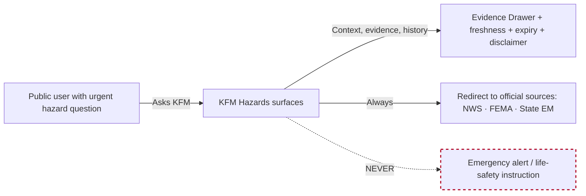
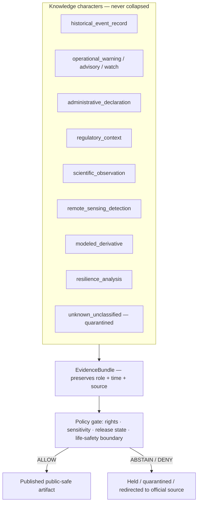
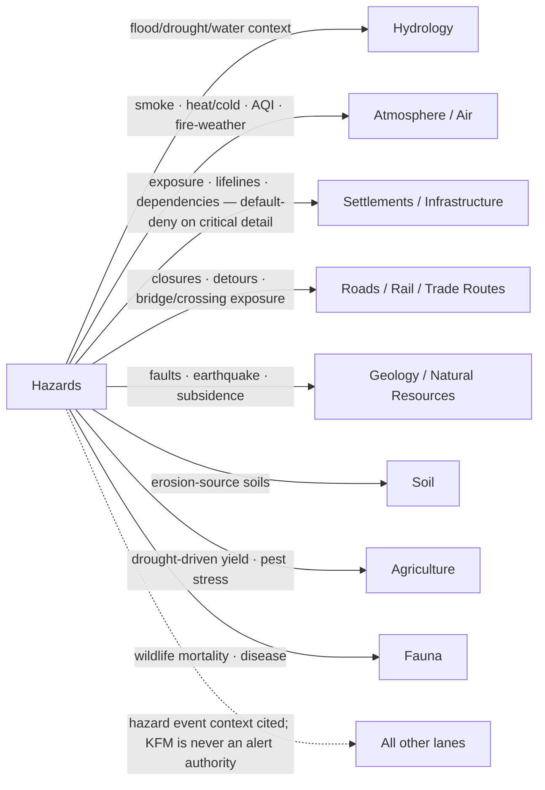
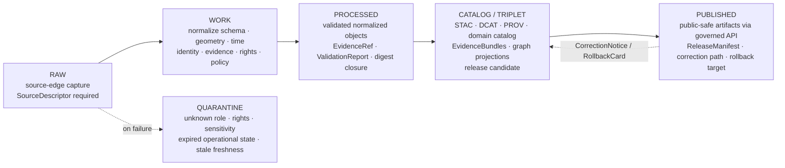
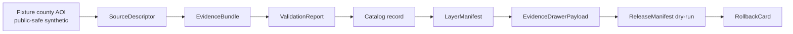

<!-- [KFM_META_BLOCK_V2]
doc_id: kfm://doc/docs-domains-hazards-architecture
title: Hazards Domain Architecture
type: standard
version: v2
status: draft
owners: TODO — assign Hazards lane steward + Docs steward
created: 2026-05-17
updated: 2026-06-05
policy_label: public
contract_version: "3.0.0"
related:
  - docs/domains/README.md
  - docs/domains/hazards/api-contracts.md
  - docs/doctrine/directory-rules.md
  - docs/doctrine/lifecycle-law.md
  - docs/doctrine/trust-membrane.md
  - docs/architecture/governed-api.md
  - docs/architecture/map-shell.md
  - docs/domains/hydrology/
  - docs/domains/atmosphere/
  - docs/domains/settlements-infrastructure/
  - docs/domains/roads-rail-trade/
  - docs/standards/PROV.md
  - docs/standards/ISO-19115.md
tags: [kfm, domain, hazards, governance, lifecycle, sensitivity, life-safety-boundary]
notes:
  # CONTRACT_VERSION = "3.0.0" pinned per ai-build-operating-contract.md v3.0.
  # Authority of any specific repo path quoted here is PROPOSED until verified against mounted-repo evidence.
  # Repo-state claims are bounded by current-session evidence (no mounted repo this session).
  # Schema-home segment corrected v1->v2: Atlas Sec 24.13 crosswalk places hazards at
  #   schemas/contracts/v1/hazards/ and contracts/hazards/ (no intervening /domains/ segment).
  #   The /domains/<x>/ form used in v1 is now flagged CONFLICTED pending ADR-S-01 / ADR-0001.
  # Pass-index idea IDs corrected v1->v2: the real convention is KFM-P{PASS}-IDEA-{NNNN}; the
  #   v1 "KFM-IDX-*" IDs were not verifiable and are neutralized. The one verifiable card is
  #   KFM-P1-IDEA-0072 (atmosphere/hazards knowledge-character separation).
[/KFM_META_BLOCK_V2] -->

# Hazards Domain Architecture

> The Hazards lane governs **historical, regulatory, modeled, and operational-context** hazard information for analysis and resilience — and **refuses to act as a life-safety alerting system**.

[](#status--ownership)
[](../../doctrine/directory-rules.md)
[](../../doctrine/lifecycle-law.md)
[](#3-life-safety-boundary-non-negotiable)
[](#10-governed-ai-behavior)
[](../../../ai-build-operating-contract.md)
[](#)

| Field | Value |
|---|---|
| **Document type** | Standard — domain architecture |
| **Status** | `draft` |
| **Owners** | TODO — Hazards lane steward + Docs steward |
| **Last updated** | 2026-06-05 |
| **`CONTRACT_VERSION`** | `"3.0.0"` |
| **Authority of doctrine claims** | CONFIRMED where labeled; PROPOSED otherwise |
| **Authority of any quoted repo path** | PROPOSED until verified against mounted-repo evidence |
| **Schema home (default)** | `schemas/contracts/v1/hazards/` per ADR-0001 (see §11, §15) |

---

## Contents

1. [Purpose & Scope](#1-purpose--scope)
2. [Source Authority & Doctrine Lineage](#2-source-authority--doctrine-lineage)
3. [Life-Safety Boundary (Non-Negotiable)](#3-life-safety-boundary-non-negotiable)
4. [Ubiquitous Language](#4-ubiquitous-language)
5. [Knowledge-Character Separation](#5-knowledge-character-separation)
6. [Object Families](#6-object-families)
7. [Source Families & Source Roles](#7-source-families--source-roles)
8. [Cross-Lane Relations](#8-cross-lane-relations)
9. [Lifecycle Pipeline (RAW → PUBLISHED)](#9-lifecycle-pipeline-raw--published)
10. [Governed AI Behavior](#10-governed-ai-behavior)
11. [API, Contract & Schema Surfaces](#11-api-contract--schema-surfaces)
12. [Validators, Tests & Fixtures](#12-validators-tests--fixtures)
13. [Map Layers & Viewing Products](#13-map-layers--viewing-products)
14. [Sensitivity, Rights & Publication Posture](#14-sensitivity-rights--publication-posture)
15. [Repository Placement (Lane Pattern)](#15-repository-placement-lane-pattern)
16. [Thin-Slice Plan](#16-thin-slice-plan)
17. [Risks & Mitigations](#17-risks--mitigations)
18. [Open Questions & Verification Backlog](#18-open-questions--verification-backlog)
19. [Changelog](#19-changelog)
20. [Related Docs](#20-related-docs)

---

## 1. Purpose & Scope

The Hazards lane is KFM's **evidence-first, governance-first interpretation surface for hazard phenomena across Kansas**. It owns historical events, regulatory hazard areas, scientific observations, remote-sensing detections, modeled derivatives, operational warning/advisory/watch *context*, administrative declarations, exposure summaries, and resilience timelines.

It is a **proof-bearing domain lane**, not a root folder. Under the Domain Placement Law (Directory Rules), Hazards files live as segments inside the relevant responsibility roots (`docs/domains/hazards/`, `schemas/contracts/v1/hazards/`, `policy/domains/hazards/`, `data/<phase>/hazards/`, etc.) and never as a `hazards/` root folder.

**In scope** (Hazards owns; CONFIRMED doctrine, PROPOSED implementation):

- Historical event records: severe weather, flood, wildfire, smoke, drought, earthquake, heat/cold, hail/wind/tornado.
- Regulatory hazard context: FEMA NFHL flood zones and similar regulatory archives (as *regulatory context*, never as observed inundation).
- Operational *context*: NWS warnings, advisories, watches — explicitly marked **not for life safety**, with issue and expiry time carried.
- Administrative declarations: FEMA disaster declarations, gubernatorial declarations.
- Scientific observations and remote-sensing detections: USGS earthquake catalog, NASA FIRMS active fire, NOAA HMS smoke.
- Modeled derivatives, exposure summaries, resilience analyses, role-aware hazard timelines.
- Domain Evidence Drawer payloads, layer manifests, and governed-AI summary envelopes that flow over released Hazards EvidenceBundles.

**Out of scope** (Hazards does not own; redirects or cites another lane):

| Concern | Owning lane |
|---|---|
| Live emergency alerting and life-safety instructions | **External — official sources (NWS, FEMA, state EM)** |
| Observed flow, water level, gauge time series | Hydrology |
| Smoke, AQI, weather observations | Atmosphere / Air |
| Critical infrastructure canonical identity, dependencies | Settlements / Infrastructure |
| Road and rail canonical identity, closures of record | Roads / Rail / Trade Routes |
| Faults, seismotectonics, subsurface geology | Geology / Natural Resources |
| Erosion-source soils, soil moisture | Soil |
| Drought-driven yield, pest stress | Agriculture |
| Cultural/archaeological sites in hazard footprints | Archaeology / Cultural Heritage |
| Living-person impact records | People / Genealogy / DNA / Land |

Hazards **cites** these lanes for context (with EvidenceBundle support and source-role preservation); it does not duplicate or override their canonical claims.

[Back to top](#contents)

---

## 2. Source Authority & Doctrine Lineage

Authority order for this document follows the KFM Authority Ladder: KFM core invariants → accepted ADRs amending them → this domain architecture → per-root READMEs → domain dossiers → current mounted-repo convention. Lineage and supporting doctrine:

| Source | Role | Status |
|---|---|---|
| KFM Encyclopedia — Hazards chapter | CONFIRMED doctrine — mission, boundary, source families, object families, knowledge systems | Doctrinal anchor |
| KFM Domains Culmination Atlas v1.1 §12 (Hazards) | CONFIRMED doctrine + PROPOSED tables for ubiquitous language, source families, object families, cross-lane relations, pipeline, API surfaces, validators, AI behavior | Doctrinal anchor |
| KFM Domains Culmination Atlas v1.1 §24.1 (Source-Role Anti-Collapse Register) | CONFIRMED — canonical source-role classes and DENY conditions | Doctrinal anchor |
| KFM Unified Implementation Architecture Build Manual §10.10 (Hazards) | CONFIRMED scope, sources of authority, sensitivity posture; PROPOSED object families, pipelines, publication gates | Doctrinal anchor |
| Idea Index card `KFM-P1-IDEA-0072` (atmosphere & hazards knowledge-character separation) | CONFIRMED — Pass 20 records that KFM hazards are not emergency alerting; knowledge-character separation | Doctrinal anchor |
| Directory Rules — Domain Placement Law | CONFIRMED — domain placement and lane pattern | Governance anchor |
| Whole-UI + Governed AI Expansion Report | CONFIRMED — Evidence Drawer, Focus Mode, finite-outcome envelopes | Cross-cutting anchor |
| Master MapLibre Atlas (NFHL handling, `ML-061-017`…`ML-061-024`) | CONFIRMED — NFHL is regulatory baseline, not observed inundation; vector-vs-WMS analytic distinction | Cross-cutting anchor |
| Mounted KFM repository | Not mounted in this session | UNKNOWN — implementation claims remain PROPOSED |

> [!NOTE]
> Exact section numbers for the Encyclopedia and Build Manual citations above are normalized to the chapter/section forms verifiable in this session. Any finer `§x.y.z` reference is **NEEDS VERIFICATION** against the live source documents and is not asserted as exact.

[Back to top](#contents)

---

## 3. Life-Safety Boundary (Non-Negotiable)

> [!CAUTION]
> **KFM is not an emergency alert system.** This boundary is CONFIRMED doctrine. It is the highest-priority invariant in this lane.
>
> No surface in KFM — map layer, Evidence Drawer, Focus Mode answer, watcher decision, derivative tile, generated summary, or third-party embed — may stand as an authoritative warning, life-safety instruction, real-time alert, or regulatory determination.
>
> Operational warning, advisory, and watch products are **contextual only**, carry **issue time and expiry time**, are tagged **not-for-life-safety**, and must **redirect users to official sources** (NWS, FEMA, state emergency management, local authorities).
>
> Validators MUST fail closed when operational-context outputs omit expiry, freshness, source identity, knowledge-character label, or the not-for-life-safety boundary.

Why this boundary holds:

- **Capability.** KFM does not operate the SLAs of an alerting system — ingestion latency, redundancy, paging, and last-mile delivery are not its function.
- **Legal posture.** Regulatory determinations require statutory authority. KFM has neither and does not claim either.
- **Trust spine.** Operational warning feeds are version-sensitive, source-dependent, and freshness-bound. Treating them as authoritative inside KFM would collapse the cite-or-abstain truth posture.
- **User safety.** Pointing to official authorities is the **correct service** to users in time pressure; substituting KFM context is a worse answer, not a faster one.



**PROPOSED enforcement:** a `not_emergency_alert_system` (or `not_for_life_safety`) flag on every Hazards `RuntimeResponseEnvelope` whose object class is `operational_warning`, `operational_advisory`, or `operational_watch`, plus a fail-closed validator that rejects emission without it (see §12). This aligns with the Deny-by-Default register: *"KFM used as life-safety instruction" → DENY* (Atlas §20.5).

[Back to top](#contents)

---

## 4. Ubiquitous Language

Hazards terminology is **CONFIRMED as the bounded vocabulary of this lane**; the field-level realization for each term is **PROPOSED** until contracts and schemas land. Source-role and knowledge-character labels are *non-interchangeable*.

| Term | Meaning inside Hazards | Status |
|---|---|---|
| **Hazard Event** | Discrete occurrence (storm, fire, flood, earthquake, etc.) bounded by source role, observed/valid time, and evidence. | CONFIRMED term / PROPOSED field |
| **historical_event_record** | Archived event documented after the fact (e.g., NCEI Storm Events). Not operational. | CONFIRMED / PROPOSED |
| **operational_warning** | Active warning *as context*. Carries issue, expiry, source, freshness. Not life-safety authority. | CONFIRMED / PROPOSED |
| **operational_advisory** | Active advisory *as context*. Same constraints as warning. | CONFIRMED / PROPOSED |
| **operational_watch** | Active watch *as context*. Same constraints. | CONFIRMED / PROPOSED |
| **administrative_declaration** | Disaster/emergency declaration by an authority (FEMA, governor). Authoritative *about the declaration*, not about ongoing conditions. | CONFIRMED / PROPOSED |
| **regulatory_context** | Legally effective regulatory hazard data (e.g., FEMA NFHL flood zones). Not observed inundation, forecast, or hydraulic model output. | CONFIRMED / PROPOSED |
| **scientific_observation** | Instrumented or surveyed measurement (e.g., USGS earthquake catalog entry). | CONFIRMED / PROPOSED |
| **remote_sensing_detection** | Satellite/airborne-derived candidate (e.g., NASA FIRMS active fire, NOAA HMS smoke). Candidate until reviewed. | CONFIRMED / PROPOSED |
| **modeled_derivative** | Output of a hazard model (exposure surface, drought index). Subordinate to the underlying observation/source-role chain. | CONFIRMED / PROPOSED |
| **resilience_analysis** | Aggregated, historical, evidence-backed resilience or exposure narrative. | CONFIRMED / PROPOSED |
| **unknown_unclassified** | Source role, knowledge character, or freshness state has not been determined → quarantined; never published. | CONFIRMED / PROPOSED |

> [!NOTE]
> The lane's ubiquitous-language terms map onto the **seven canonical source roles** of the Atlas Source-Role Anti-Collapse Register (observed · regulatory · modeled · aggregate · administrative · candidate · synthetic). "Operational" warning/advisory/watch is a **freshness-bound sub-form** carried with a canonical role plus expiry/freshness windows — not an eighth top-level role. Whether it warrants a distinct enum value is OPEN under ADR-S-04.

[Back to top](#contents)

---

## 5. Knowledge-Character Separation

CONFIRMED doctrine (Idea Index card `KFM-P1-IDEA-0072`; Atlas §24.1): observations, regulatory archives, public reports, model fields, remote-sensing detections, operational context, and resilience summaries are **not interchangeable**. The lane's central design discipline is to keep them separate at every level — source role, identity, temporal handling, validator, policy, layer manifest, drawer payload, and AI envelope.



> [!IMPORTANT]
> A remote-sensing detection is a **candidate** until reviewed and is **not** an observed fire on the ground.
> A regulatory NFHL zone is a **legally effective hazard area** and is **not** an observed flood extent or a forecast.
> An operational warning is **active context**, not a life-safety instruction.
> Collapsing any of these is a fail-closed validator violation (Atlas §24.1.2 anti-collapse DENY conditions).

[Back to top](#contents)

---

## 6. Object Families

CONFIRMED canonical object families (KFM Encyclopedia, Hazards chapter; Domains Atlas §12.E). Identity rules are **PROPOSED** (`source id + object role + temporal scope + normalized digest`); temporal-field separation (source, observed, valid, retrieval, release, correction) is **CONFIRMED doctrine**.

<details>
<summary><strong>Object family table (click to expand)</strong></summary>

| Object family | Purpose | Identity rule (PROPOSED) | Temporal handling (CONFIRMED doctrine) |
|---|---|---|---|
| `HazardEvent` | Discrete hazard occurrence with role, geometry, time, evidence. | source id + role + temporal scope + digest | source · observed · valid · retrieval · release · correction kept distinct |
| `HazardObservation` | Instrumented or surveyed hazard measurement. | same | same |
| `WarningContext` | Active warning *as context*; not life-safety authority. | same | same; **expiry is mandatory** |
| `AdvisoryContext` | Active advisory *as context*. | same | same; **expiry is mandatory** |
| `DisasterDeclaration` | Authoritative declaration record. | same | same |
| `FloodContext` | Flood-related context, including regulatory or observed sub-roles. | same | same |
| `WildfireDetection` | Remote-sensing fire detection candidate. | same | same; **freshness state mandatory** |
| `SmokeContext` | Smoke or fire-weather context. | same | same |
| `DroughtIndicator` | Drought monitor / index value. | same | same |
| `EarthquakeEvent` | Earthquake catalog entry. | same | same |
| `HeatColdEvent` | Heat or cold extreme event. | same | same |
| `ExposureSummary` | Aggregated exposure narrative. | same | same |
| `ResilienceSummary` | Aggregated resilience narrative. | same | same |
| `HazardTimeline` | Role-aware timeline projection over released evidence. | derived; references EvidenceBundles | derived; never overrides source time |
| `ImpactArea` | Generalized public-safe geometry for impact analysis. | same | same |

</details>

> [!NOTE]
> The first eight families (`HazardEvent` through `SmokeContext`) are the **CONFIRMED** object-family spine named in the Atlas Cross-Domain Object Index and §12.B/E. The remaining families (`DroughtIndicator` onward) are drawn from the §12.E object table and the §12.B "owns" list; treat their exact object names as **NEEDS VERIFICATION** against the live encyclopedia chapter.

Cross-cutting trust objects consumed (not owned) by Hazards: `SourceDescriptor`, `EvidenceRef`, `EvidenceBundle`, `DatasetVersion`, `ValidationReport`, `RunReceipt`, `DecisionEnvelope`, `LayerManifest`, `ReleaseManifest`, `CorrectionNotice`, `RollbackCard`, `ReviewRecord`.

[Back to top](#contents)

---

## 7. Source Families & Source Roles

CONFIRMED source families (KFM Encyclopedia, Hazards chapter; Domains Atlas §12.D). Source roles must be **explicit and non-collapsible**: a regulatory layer is not an observation; an observation is not a model; an operational feed is not an alert authority inside KFM.

| Source family | Role(s) | Rights / sensitivity | Freshness handling |
|---|---|---|---|
| NOAA Storm Events / NCEI archive | authority (archive) · historical_event_record | Rights & current terms `NEEDS VERIFICATION` per current source docs | Source-vintage; cadence specific |
| NWS API — alerts, warnings, advisories, watches | observation · context (never alert authority inside KFM) | Rights `NEEDS VERIFICATION` | Issue & expiry mandatory; freshness state required |
| FEMA Disaster Declarations / OpenFEMA | authority (administrative declaration) | Rights `NEEDS VERIFICATION` | Cadence specific |
| FEMA NFHL / MSC | regulatory_context (legally effective flood hazard) | Rights `NEEDS VERIFICATION` | Tracked via `VERSION_ID`, `EFFECTIVE_DATE`, `DFIRM_ID` — **never** a single national release date |
| USGS Earthquake Catalog | scientific_observation | Rights `NEEDS VERIFICATION` | Per-event; updates revise prior |
| USGS Water Data | scientific_observation (consumed; **canonically owned by Hydrology**) | Rights `NEEDS VERIFICATION` | Cadence specific |
| NOAA HMS — Fire and Smoke | remote_sensing_detection / context | Rights `NEEDS VERIFICATION` | Issue date per analysis day |
| NASA FIRMS active fire | remote_sensing_detection (candidate) | Rights `NEEDS VERIFICATION`; sensitive joins fail closed | Near-real-time; candidates not authoritative ignition records |
| Drought monitors (e.g., USDM) | modeled_derivative / authority (as published) | Rights `NEEDS VERIFICATION` | Weekly cadence (typical) — confirm at source |
| USACE NLD (levees) / NID (dams) | authority (regulatory/administrative) | Rights `NEEDS VERIFICATION`; **dam-failure inundation / restricted-precise fields fail closed** | Version-disciplined; sensitivity-tagged |
| Kansas / local emergency management & resilience plans | authority (planning) · context | Rights `NEEDS VERIFICATION`; sensitive joins fail closed | Source-vintage |

> [!NOTE]
> CONFIRMED cross-domain rule: *source role cannot be inferred from convenience.* Regulatory flood layers are not observed inundation; operational warnings are not life-safety authority inside KFM; remote-sensing anomalies are candidates until reviewed. FEMA NFHL is the canonical flood-hazard authority and USACE NLD/NID are canonical levee/dam authorities; all three are ingested with explicit version handling and license posture, and some NID fields (e.g., dam-failure inundation) are classified restricted-precise.

[Back to top](#contents)

---

## 8. Cross-Lane Relations

CONFIRMED doctrine (Domains Atlas §12.F; cross-domain relations register): every cross-lane relation must preserve **ownership, source role, sensitivity, and EvidenceBundle support**. Hazards cites other lanes for context; it never overrides their canonical claims, and it never becomes the alert authority for any of them.



| This domain | Related lane | Relation | Constraint (CONFIRMED / PROPOSED) |
|---|---|---|---|
| Hazards | Hydrology | Flood / drought / water-event context | Preserve ownership, source role, sensitivity, EvidenceBundle support; NFHL is regulatory, not observed |
| Hazards | Atmosphere / Air | Smoke, heat/cold, AQI/advisory, wind, fire-weather context | Same constraints; knowledge-character separation enforced |
| Hazards | Settlements / Infrastructure | Exposure, lifelines, dependencies | Default-deny on public detail for critical infrastructure |
| Hazards | Roads / Rail | Closures, detours, bridge/crossing exposure, resilience | Same constraints |
| Hazards | Geology / Natural Resources | Fault, earthquake, subsidence inputs | Geology owns the geologic claim |
| Hazards | Soil | Erosion-source / dust-source soils | Soil owns soil claims; carry soil time caveat |
| Hazards | Agriculture | Drought / pest stress (advisory) | Agriculture owns crop/yield; Hazards cites |
| Hazards | Fauna | Wildlife mortality / disease as hazard context | Fauna owns occurrence; rights & stewardship apply |

[Back to top](#contents)

---

## 9. Lifecycle Pipeline (RAW → PUBLISHED)

CONFIRMED doctrine, PROPOSED lane application. The KFM lifecycle invariant — **RAW → WORK / QUARANTINE → PROCESSED → CATALOG / TRIPLET → PUBLISHED** — governs Hazards. Promotion is a **governed state transition, not a file move**.



| Stage | Handling | Gate (PROPOSED status) |
|---|---|---|
| **RAW** | Capture immutable source payload or reference with source role, rights, sensitivity, citation, time, hash. | `SourceDescriptor` exists; ingest receipt recorded |
| **WORK / QUARANTINE** | Normalize schema, geometry, time, identity, evidence, rights, policy; hold failures with explicit reason. | Validation & policy gate pass *or* quarantine reason recorded |
| **PROCESSED** | Emit validated normalized objects, receipts, and public-safe candidates. | `EvidenceRef`, `ValidationReport`, digest closure exist |
| **CATALOG / TRIPLET** | Emit catalog records, `EvidenceBundle`s, graph/triplet projections, release candidates. | Catalog & proof closure passes |
| **PUBLISHED** | Serve released public-safe artifacts through governed APIs and manifests. | `ReleaseManifest`, correction path, rollback target, review/policy state exist; **life-safety boundary asserted** for operational-context outputs |

CONFIRMED constraints:

- **Watcher-as-non-publisher.** Source-health, freshness, and ETag/`Last-Modified` watchers (e.g., the NWS/NFHL/FIRMS feed health probes) emit `RunReceipt`s and candidate decisions; they never write to `data/catalog/` or `data/published/`.
- **Connectors emit to `data/raw/hazards/<source_id>/<run_id>/` or `data/quarantine/hazards/…`** — never to `data/processed/` or `data/published/`.
- **Stale operational state cannot appear as current warning state.** Expired warnings/advisories are quarantined or demoted; they may be cited as historical context only with explicit `historical_event_record` role.

[Back to top](#contents)

---

## 10. Governed AI Behavior

CONFIRMED doctrine, PROPOSED implementation. AI inside KFM is **interpretive and subordinate to evidence, policy, review, and release state** — never a truth source. For Hazards, this is especially load-bearing because life-safety stakes are high.

| Outcome | When AI may emit it |
|---|---|
| **ANSWER** | All of: released `EvidenceBundle` resolves; policy/sensitivity/rights/release gates pass; freshness & expiry within bounds; **not** life-safety instruction; cites the bundle and surfaces the not-for-life-safety disclaimer for operational context |
| **ABSTAIN** | Evidence is insufficient, ambiguous, stale, or unresolved; AI surfaces what is missing and points to the Evidence Drawer / official sources |
| **DENY** | Policy, rights, sensitivity, or release state blocks the request; **any** life-safety / emergency-instruction framing; over-precision on critical-infrastructure exposure; stale operational claim as if current |
| **ERROR** | System failure; no inference attempted on the substantive question |

> [!IMPORTANT]
> CONFIRMED rule: AI must **DENY** any request that would produce or imply an emergency alert, life-safety instruction, or regulatory determination — regardless of how the request is framed. Refusal surfaces the official-source referral instead. Every AI ANSWER over Hazards material requires an `AIReceipt` and a citation-validation report (cite-or-abstain).

**PROPOSED validators:**

- **Citation validation.** Every AI ANSWER over Hazards material must resolve every cited `EvidenceRef`. No bundle, no answer.
- **Knowledge-character preservation.** AI may not flatten a regulatory zone, observation, model field, and remote-sensing detection into a single undifferentiated claim.
- **Freshness gate.** AI may not emit operational-context summaries past their expiry without explicit historical framing.

[Back to top](#contents)

---

## 11. API, Contract & Schema Surfaces

PROPOSED governed API surfaces. Exact routes, DTO field shapes, and schema homes are **PROPOSED** pending mounted-repo verification and ADR confirmation. The four-surface set and finite-outcome grammar are **CONFIRMED** from the Hazards J-table; field shapes and routes remain unverified. The full surface-by-surface contract lives in the companion doc, [`api-contracts.md`](./api-contracts.md).

| Surface | DTO / artifact | Finite outcomes | Status |
|---|---|---|---|
| Hazards feature/detail resolver (route TBD) | `HazardsDecisionEnvelope` | ANSWER · ABSTAIN · DENY · ERROR | Surface + outcomes CONFIRMED; route UNKNOWN |
| Hazards layer manifest resolver | `LayerManifest` / domain layer descriptor | ANSWER · DENY · ERROR | Surface + outcomes CONFIRMED; public-safe release only |
| Hazards Evidence Drawer payload | `EvidenceDrawerPayload` + `EvidenceBundle` projection | ANSWER · ABSTAIN · DENY · ERROR | Surface + outcomes CONFIRMED; evidence and policy filtered |
| Hazards Focus Mode answer | `RuntimeResponseEnvelope` + `AIReceipt` | ANSWER · ABSTAIN · DENY · ERROR | Surface + outcomes CONFIRMED; AI never root truth |
| Schema responsibility root | `schemas/contracts/v1/hazards/` | finite validator outcomes | PROPOSED; verify per ADR-0001 |
| Contract semantic root | `contracts/hazards/` (Markdown) | n/a | PROPOSED; semantic Markdown only — no parallel schema authority |
| Policy domain bundle | `policy/domains/hazards/` (+ `policy/release/hazards/`) | ALLOW · DENY · RESTRICT · ABSTAIN | PROPOSED; includes life-safety boundary gate |

> [!IMPORTANT]
> **Schema-home segment corrected in v2.** The Atlas §24.13 crosswalk places Hazards at `schemas/contracts/v1/hazards/`, `contracts/hazards/`, and `policy/release/hazards/` — **with no intervening `/domains/` segment**. The v1 edition used `schemas/contracts/v1/domains/hazards/`. Treated as **CONFLICTED** (doc-internal drift vs. crosswalk) and resolved here in favor of the crosswalk form, pending **ADR-S-01 / ADR-0001** confirmation. A `DRIFT_REGISTER.md` entry is required (see §18).

> [!NOTE]
> All public clients land at `apps/governed-api/` (trust membrane). No public client — including the map shell — may read directly from `data/raw|work|quarantine|processed|catalog|triplets`. The map shell consumes only released artifacts via the governed API.

[Back to top](#contents)

---

## 12. Validators, Tests & Fixtures

PROPOSED validator suite (Domains Atlas §12.K). All validators **fail closed** on missing schema fields, policy decisions, rights evidence, sensitivity posture, proof objects, or release state.

| Validator | What it enforces | Status |
|---|---|---|
| `hazards.source_role_anti_collapse` | Forbids collapsing regulatory / observation / model / remote-sensing / operational into one undifferentiated record | PROPOSED |
| `hazards.temporal_role` | Source · observed · valid · issue · expiry · retrieval · release · correction times kept distinct where material | PROPOSED |
| `hazards.emergency_alert_denial` | DENIES any payload framed as a life-safety alert or instruction | PROPOSED |
| `hazards.operational_expiry_freshness` | Rejects operational-context outputs missing issue, expiry, source, freshness state, or not-for-life-safety boundary | PROPOSED |
| `hazards.catalog_closure` | Rejects catalog/release candidates without resolved `EvidenceBundle` and `ValidationReport` | PROPOSED |
| `hazards.evidence_drawer_disclaimer` | Rejects Evidence Drawer payloads for operational context missing the not-for-life-safety disclaimer | PROPOSED |
| `hazards.ui_no_direct_source` | Rejects map/UI bindings that bypass governed API and read raw/canonical stores | PROPOSED |
| `hazards.nfhl_regulatory_label` | Rejects NFHL payloads not labeled `regulatory_context` and not carrying `VERSION_ID` / `EFFECTIVE_DATE` / `DFIRM_ID` | PROPOSED |

CONFIRMED fixture posture (no-network, fixture-first — Atlas roadmap Phase 2/4): **no-network fixture-first**. The first Hazards slice runs on synthetic public-safe fixtures covering positive, negative, denied, abstained, ambiguous, stale-source, and rollback cases — never live source activation.

[Back to top](#contents)

---

## 13. Map Layers & Viewing Products

PROPOSED viewing products (KFM Encyclopedia, Hazards chapter; Domains Atlas §12.G). All map products consume released artifacts via the trust membrane; the renderer is downstream of trust.

- **Historical event layers** — severe weather, flood, wildfire, smoke, drought, earthquake, heat/cold; role-aware.
- **Operational warning / advisory / watch context layers** — issue/expiry overlays; not-for-life-safety label and official-source referral visible at all zoom levels.
- **Regulatory hazard areas** — NFHL flood context with `VERSION_ID`/`EFFECTIVE_DATE` provenance.
- **Scientific observation layers** — USGS earthquake catalog.
- **Remote-sensing detection layers** — NOAA HMS, NASA FIRMS detections labeled as candidates.
- **Exposure analysis** — generalized, public-safe geometry.
- **Resilience summary** — historical, aggregated, evidence-backed.
- **Role-aware hazard timeline** — preserves source role, temporal fields, freshness.
- **"Not for life safety" official-link mode** — persistent affordance pointing to NWS / FEMA / state EM.

CONFIRMED cross-cutting UI products: **Evidence Drawer**, **time-aware state**, **trust badges**, **sensitivity-redacted view**, **correction / stale-state view**, **governed Focus Mode**.

> [!WARNING]
> NFHL ArcGIS REST/FeatureServer endpoints are for **analytic vector access**; WMS endpoints are **visualization-only** and not suitable for analytic joins (Master MapLibre `ML-061-017`, `ML-061-021`). Mixing these collapses the regulatory-baseline / analytics distinction. Vertical-datum mismatch is a major BFE/compliance error source (`ML-061-022`); regulatory decisions must reference FEMA directly and avoid resale-like determinations (`ML-061-024`).

[Back to top](#contents)

---

## 14. Sensitivity, Rights & Publication Posture

CONFIRMED doctrine. Hazards inherits KFM's default-deny posture and adds lane-specific constraints. The Deny-by-Default register (Atlas §20.5) lists *Hazards — emergency instructions or KFM as alert authority → not allowed as KFM authority*.

| Concern | Default posture |
|---|---|
| Unclear rights on a source | Block public release until terms and redistribution class are recorded in `data/registry/sources/hazards/` |
| Unresolved source role | Quarantine; never publish |
| Missing `EvidenceBundle` | ABSTAIN at runtime; DENY at publication |
| Stale freshness on operational context | Demote to historical or quarantine; cannot appear as current warning state |
| Critical-infrastructure exposure via hazard joins | Default-deny exact detail; generalize; require steward review (Settlements / Infrastructure owns the underlying posture) |
| USACE NID dam-failure inundation / restricted-precise fields | Default-deny; classify restricted-precise; steward review + transform receipt before any exposure |
| Living-person impact records | Defer to People / Genealogy / DNA / Land controls |
| Cultural / archaeological sites in hazard footprints | Defer to Archaeology controls; exact site coords denied |
| Wildlife sensitive locations (e.g., disease, mortality) | Defer to Fauna controls; rare-species geoprivacy applies |
| Any framing as life-safety instruction or alert | **DENY** under §3 |

Every public release of a Hazards artifact requires: validation pass, source-role/rights/sensitivity checks, review state where required, `ReleaseManifest`, correction path, and rollback target.

[Back to top](#contents)

---

## 15. Repository Placement (Lane Pattern)

Under the Domain Placement Law (Directory Rules), Hazards files live as **segments inside responsibility roots**, never as a `hazards/` root folder. All paths below are **PROPOSED** until verified against mounted-repo evidence; ADR is required for any path that would create parallel schema, contract, policy, source, registry, release, or proof homes.

```text
docs/domains/hazards/
├── ARCHITECTURE.md           # this file
├── api-contracts.md          # companion: governed API surfaces + envelopes
├── README.md                 # (PROPOSED) landing / orientation
└── …                         # additional standards, runbook crosslinks, ADR notes

contracts/hazards/            # semantic Markdown only (no parallel schema authority)   ← Atlas Sec 24.13
schemas/contracts/v1/hazards/ # canonical machine schemas (per ADR-0001)               ← Atlas Sec 24.13
policy/domains/hazards/       # admissibility, life-safety boundary gate, sensitivity rules
policy/release/hazards/       # release-policy lane                                      ← Atlas Sec 24.13
tests/domains/hazards/        # contract · schema · policy · pipeline · runtime-proof tests
fixtures/domains/hazards/     # valid · invalid · golden · synthetic · stale-source · rollback
packages/domains/hazards/     # reusable hazards libraries (if and only if reusable)
pipelines/domains/hazards/    # executable pipeline logic
pipeline_specs/hazards/       # declarative pipeline configuration

data/raw/hazards/<source_id>/<run_id>/          # connector output; immutable
data/work/hazards/<run_id>/                     # normalized intermediates
data/quarantine/hazards/<reason>/<run_id>/      # failed validation / unresolved role/rights/sensitivity
data/processed/hazards/<dataset_id>/<version>/  # validated canonical records
data/catalog/domain/hazards/                    # domain catalog records
data/published/layers/hazards/                  # public-safe released layers
data/registry/sources/hazards/                  # source descriptors, rights, freshness state

release/candidates/hazards/                     # release-candidate dossiers
```

CONFIRMED placement constraints:

- **Schema home.** `schemas/contracts/v1/hazards/` is canonical (ADR-0001; Atlas §24.13 crosswalk). `contracts/hazards/` retains semantic Markdown only. *(The v1 `…/domains/hazards/` form is CONFLICTED — see §11 and §18.)*
- **No root-level `hazards/` folder.** A root `hazards/` directory is a Directory Rules placement anti-pattern (domain-folder-at-root).
- **Connectors write only to `data/raw/hazards/` or `data/quarantine/hazards/`.** Promotion is governed; no connector or watcher writes to `data/processed/`, `data/catalog/`, or `data/published/`.
- **Cross-domain hazard files** (e.g., a hazards × hydrology × atmosphere validator) live at the lowest common responsibility root **without** a domain segment — for instance, `tools/validators/<topic>/…`, not `tools/validators/domains/hazards/…`.

[Back to top](#contents)

---

## 16. Thin-Slice Plan

CONFIRMED doctrine: domain expansion is **proof-bearing, not coverage-bearing**. The first Hazards slice should demonstrate descriptor → evidence → policy → validation → release closure on a tightly scoped fixture, not broad horizontal coverage. (Atlas roadmap places a Hydrology proof-bearing thin slice at Phase 5; the Hazards slice follows the same proof-lane exemplar pattern.)

PROPOSED first credible thin slice (KFM Encyclopedia, Hazards chapter, verification backlog):

1. **One historical flood or severe-weather event fixture** (synthetic, public-safe).
2. **One NFHL `regulatory_context` fixture** with `VERSION_ID` / `EFFECTIVE_DATE` provenance.
3. **One exposure summary** referencing a generalized Settlements/Infrastructure footprint (default-deny on precise critical-infrastructure detail).
4. **Operational warning feeds disabled or contextual-only** for this slice; if included at all, a `not_for_life_safety` `DecisionEnvelope` fixture is mandatory (PROPOSED first artifact, per the knowledge-character-separation card).
5. **Closure artifacts:** `SourceDescriptor`(s), `EvidenceBundle`, `ValidationReport`, `LayerManifest`, `EvidenceDrawerPayload`, `ReleaseManifest` (dry-run), `RollbackCard`.
6. **Validator coverage:** at minimum `hazards.source_role_anti_collapse`, `hazards.temporal_role`, `hazards.emergency_alert_denial`, `hazards.operational_expiry_freshness`, `hazards.catalog_closure`.



No live source activation happens before this slice closes.

[Back to top](#contents)

---

## 17. Risks & Mitigations

| Risk | Mitigation |
|---|---|
| Public misreads KFM as an alerting system | §3 disclaimer surfaces; persistent official-source referral; AI DENY on life-safety framing; validator fail-closed on missing not-for-life-safety boundary |
| Rights uncertainty on source | Block public release; record in `data/registry/sources/hazards/`; quarantine until resolved |
| Sensitive location / critical infrastructure exposure | Default-deny exact detail; generalize; require steward review; defer to Settlements / Infrastructure exposure controls |
| Stale operational data published as current | Freshness state mandatory; expiry mandatory; demote to historical or quarantine on expiry |
| Source-role confusion (regulatory ↔ observation ↔ model ↔ remote-sensing) | Source-role registry; knowledge-character labels; anti-collapse validator |
| AI hallucination on Hazards questions | Citation validation; finite outcomes (ANSWER / ABSTAIN / DENY / ERROR); `AIReceipt`; no direct AI-to-public path; freshness gate |
| NFHL misuse — WMS pixels for regulatory analysis, or NFHL as forecast | Analytics-only-on-vector validator; `regulatory_context` label preserved; vertical-datum and version checks |
| Rollback complexity on a hazard layer with downstream embeds | `ReleaseManifest` + `RollbackCard` + rollback drill per release |
| Watcher emits a publication | Watcher-as-non-publisher invariant; watcher writes receipts only |

[Back to top](#contents)

---

## 18. Open Questions & Verification Backlog

These items are **NEEDS VERIFICATION**, **PROPOSED**, or **OPEN** against mounted-repo evidence, source documentation, or ADR resolution. They remain blockers before promotion from `draft` to `published`.

| Item | Evidence that would settle it | Status |
|---|---|---|
| Schema-home segment: `schemas/contracts/v1/hazards/` (crosswalk) vs. legacy `.../domains/hazards/` (v1 doc) | ADR-S-01 / ADR-0001 reaffirmation; repo inspection; `DRIFT_REGISTER.md` entry for the v1→v2 correction | NEEDS VERIFICATION |
| Verify official-source endpoints, terms of use, rate limits, and rights for NWS, FEMA OpenFEMA, NFHL, USGS Earthquake, USGS Water, NASA FIRMS, NOAA HMS, drought monitors, USACE NLD/NID, Kansas EM | Mounted-repo source descriptors + current source docs | NEEDS VERIFICATION |
| Implement and ratify role taxonomy and freshness state machine (issue / valid / expiry / stale / withdrawn) | Mounted schemas + validators + tests | NEEDS VERIFICATION |
| Whether "operational" is a distinct `source_role` enum value or a freshness/policy overlay on observed/regulatory | ADR-S-04 (source-role vocabulary v1) | OPEN |
| Verify emergency-alert boundary enforcement end-to-end (validator + policy + AI + UI) | Tests + runtime proof + fixture pack | NEEDS VERIFICATION |
| Verify release / correction / rollback drill on a Hazards artifact | `release/rollback_cards/` + docs/runbooks evidence | NEEDS VERIFICATION |
| ADR for Hazards-specific policy profile (life-safety boundary gate, critical-infrastructure deferral, exposure class table) | Accepted ADR | PROPOSED |
| ADR or convention note for runbook subfolder pattern — `docs/runbooks/hazards/...` mirroring the Fauna lane | Accepted ADR or directory-rules update (carries OPEN-DR-02) | PROPOSED |
| Decide whether the NFHL regulatory-context surface needs its own contract/schema family or is covered by `WarningContext`/`AdvisoryContext`/`FloodContext` | Mounted contracts/schemas + ADR | NEEDS VERIFICATION |
| Resolve `PROV.md` vs. `PROVENANCE.md` naming for the related provenance standards profile (carried OPEN-DR-01) | ADR | PROPOSED |
| Hazards Decision Envelope finite-outcome route name | Mounted governed-API code; routing-convention ADR | UNKNOWN |
| Source-health watcher placement (likely `apps/workers/` per Directory Rules) and receipt schema | Mounted repo evidence + ADR | NEEDS VERIFICATION |
| Verify the exact Idea Index card IDs cited as lineage (the verifiable one is `KFM-P1-IDEA-0072`; the v1 `KFM-IDX-*` IDs were not verifiable and have been neutralized) | Mounted Idea Index / Pass atlases | NEEDS VERIFICATION |

### Open questions register

| ID | Question | Owner role | Resolution path |
|---|---|---|---|
| OQ-HAZ-ARCH-01 | Is the canonical Hazards schema home `schemas/contracts/v1/hazards/` or `.../domains/hazards/`? | Docs steward + governed-API steward | ADR-S-01 / ADR-0001 check; Directory Rules; repo inspection |
| OQ-HAZ-ARCH-02 | Does "operational" deserve a distinct source-role enum value? | Hazards lane steward | ADR-S-04 |
| OQ-HAZ-ARCH-03 | Does NFHL need a dedicated contract/schema family or is it covered by `FloodContext`? | Hazards lane steward | Repo inspection + ADR |
| OQ-HAZ-ARCH-04 | Runbook subfolder pattern `docs/runbooks/hazards/` vs. flat? | Docs steward | ADR (OPEN-DR-02) |
| OQ-HAZ-ARCH-05 | `PROV.md` vs `PROVENANCE.md` filename? | Docs steward | ADR (OPEN-DR-01) |

[Back to top](#contents)

---

## 19. Changelog

| Change | Type (per contract §37) | Reason |
|---|---|---|
| Corrected schema-home segment from `schemas/contracts/v1/domains/hazards/` to `schemas/contracts/v1/hazards/` (and `contracts/hazards/`, `policy/release/hazards/`) in §1, §11, §15, meta block. | reconciliation | Atlas §24.13 crosswalk places hazards without an intervening `/domains/` segment; v1 form flagged CONFLICTED. |
| Neutralized unverifiable Idea Index IDs (`KFM-IDX-POL-007`, `KFM-IDX-APP-005`, `KFM-IDX-PLN-002/003`, `KFM-IDX-VAL-001`); cited the verifiable card `KFM-P1-IDEA-0072` for knowledge-character separation. | reconciliation | The real convention is `KFM-P{PASS}-IDEA-{NNNN}`; the v1 IDs were not found in project knowledge (no-fabrication rule). |
| Pinned `CONTRACT_VERSION = "3.0.0"` in meta block, badge row, and status table. | housekeeping | Doctrine-adjacent doc; contract authority pin requirement. |
| Marked the seven canonical source roles as authoritative; demoted "operational" to a freshness sub-form with an OPEN ADR-S-04 question (§4, §7). | clarification | Atlas §24.1.1 canonical role list. |
| Distinguished CONFIRMED surface/outcome sets from PROPOSED routes/field shapes in §11; cross-linked the companion `api-contracts.md`. | clarification | J-table confirms surfaces and outcomes; field shapes unverified. |
| Distinguished the eight-family CONFIRMED object spine from PROPOSED extensions in §6. | clarification | Cross-Domain Object Index names only the first eight. |
| Added USACE NLD/NID source family + restricted-precise dam-failure-inundation posture (§7, §14, §17). | gap closure | NFHL/NLD/NID flood-and-infrastructure authority card; restricted-precise sensitivity. |
| Softened exact `§x.y.z` Encyclopedia/Build-Manual section numbers to verifiable chapter forms with a NEEDS VERIFICATION note (§2). | clarification | Exact sub-section numbers not verifiable this session. |
| Added Open questions register (OQ-HAZ-ARCH-01..05) and this changelog. | gap closure | Doctrine-doc companion-section expectation. |

> **Backward compatibility.** All §-anchor headings 1–18 are preserved; two new tail sections (§19 Changelog, §20 Related Docs) were appended, so the Related-docs anchor changed from `#19-related-docs` to `#20-related-docs`. No live repo links break, since the schema-home change is a PROPOSED placement, not a live path; the change is logged for `DRIFT_REGISTER.md`.

[Back to top](#contents)

---

## 20. Related Docs

> Placeholder targets — link validity NEEDS VERIFICATION against mounted-repo evidence.

- [`docs/domains/README.md`](../README.md) — domain lane index
- [`docs/domains/hazards/api-contracts.md`](./api-contracts.md) — Hazards governed API surfaces, decision envelopes, contract shape
- [`docs/doctrine/directory-rules.md`](../../doctrine/directory-rules.md) — placement law, lane pattern, anti-patterns
- [`docs/doctrine/lifecycle-law.md`](../../doctrine/lifecycle-law.md) — RAW → PUBLISHED invariant
- [`docs/doctrine/trust-membrane.md`](../../doctrine/trust-membrane.md) — governed API as trust path
- [`docs/architecture/governed-api.md`](../../architecture/governed-api.md) — finite-outcome envelopes
- [`docs/architecture/map-shell.md`](../../architecture/map-shell.md) — MapLibre downstream of trust
- [`docs/standards/PROV.md`](../../standards/PROV.md) — provenance profile *(filename `PROV.md` vs `PROVENANCE.md` is OPEN per Directory Rules OPEN-DR-01)*
- [`docs/standards/ISO-19115.md`](../../standards/ISO-19115.md) — geospatial metadata crosswalk
- [`docs/standards/OGC-API-TILES.md`](../../standards/OGC-API-TILES.md) — tile delivery
- [`docs/standards/PMTILES.md`](../../standards/PMTILES.md) — public-safe tile archive
- [`docs/runbooks/hazards/`](../../runbooks/) — PROPOSED runbook subfolder (operational source refresh, rollback drills, validation runs)
- [`docs/domains/hydrology/`](../hydrology/) · [`atmosphere/`](../atmosphere/) · [`settlements-infrastructure/`](../settlements-infrastructure/) · [`roads-rail-trade/`](../roads-rail-trade/) — adjacent lanes

---

**Last updated:** 2026-06-05  ·  **Owners:** TODO — Hazards lane steward + Docs steward  ·  **Status:** `draft`  ·  **`CONTRACT_VERSION = "3.0.0"`**

[↑ Back to top](#hazards-domain-architecture)
