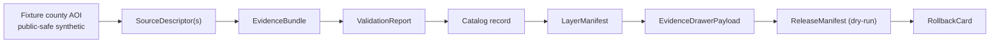
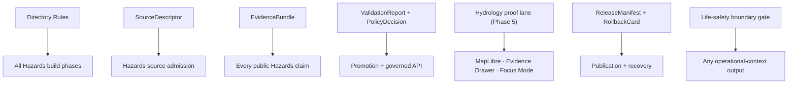

<!-- [KFM_META_BLOCK_V2]
doc_id: kfm://doc/domains/hazards/blueprint
title: Hazards Domain Implementation Blueprint
type: standard
version: v1
status: draft
owners: TODO — assign Hazards lane steward + Docs steward + Governed-API steward
created: 2026-06-05
updated: 2026-06-05
policy_label: public
contract_version: "3.0.0"
related:
  - docs/domains/hazards/ARCHITECTURE.md
  - docs/domains/hazards/api-contracts.md
  - docs/domains/hazards/README.md
  - docs/doctrine/directory-rules.md
  - docs/doctrine/lifecycle-law.md
  - docs/doctrine/trust-membrane.md
  - docs/architecture/governed-api.md
  - docs/architecture/map-shell.md
  - schemas/contracts/v1/hazards/
  - contracts/hazards/
  - policy/domains/hazards/
  - policy/release/hazards/
  - tests/domains/hazards/
  - fixtures/domains/hazards/
  - release/candidates/hazards/
  - docs/registers/DRIFT_REGISTER.md
  - docs/registers/VERIFICATION_BACKLOG.md
tags: [kfm, domain, hazards, blueprint, implementation, roadmap, thin-slice, life-safety-boundary]
notes:
  # CONTRACT_VERSION = "3.0.0" pinned per ai-build-operating-contract.md v3.0.
  # This is the LANE BUILD PLAN. ARCHITECTURE.md = what the lane is; api-contracts.md = governed surfaces; this doc = how it gets built, in reversible slices.
  # Lineage source: SRC-HAZ / SRC-036 (kfm_hazards_extended_pro_pdf_only_blueprint.pdf), the KFM Hazards Architecture Extended Pro Blueprint.
  # Build sequence specializes the CONFIRMED governance-spine roadmap (Atlas Sec 21; Build Manual Sec 19; Unified Doctrine Synthesis Sec 23) for the Hazards lane.
  # Schema-home segment: schemas/contracts/v1/hazards/ (no /domains/ segment) per Atlas Sec 24.13 crosswalk; ADR-S-01 / ADR-0001 pending.
  # Idea/Feature/Programming seed-card IDs use the real convention KFM-P{PASS}-{CLASS}-{NNNN}; PASS and ordinal are placeholders until allocated.
  # No mounted repo this session: all paths, routes, schema files, and phase artifacts are PROPOSED / NEEDS VERIFICATION.
[/KFM_META_BLOCK_V2] -->

# Hazards Domain Implementation Blueprint

> The reversible, proof-bearing **build plan** for the Hazards lane — how the architecture in `ARCHITECTURE.md` and the surfaces in `api-contracts.md` get built, sliced, validated, released, and rolled back **without KFM ever becoming a life-safety alerting system**.

[](#status--ownership)
[](#1-what-this-blueprint-is)
[](#4-build-sequence-hazards-specialized)
[](#3-non-negotiables-carried-into-the-build)
[](#3-non-negotiables-carried-into-the-build)
[](../../../ai-build-operating-contract.md)
[](#)

| Field | Value |
|---|---|
| **Document type** | Standard — domain implementation blueprint |
| **Status** | `draft` |
| **Owners** | TODO — Hazards lane steward + Docs steward + Governed-API steward |
| **Last updated** | 2026-06-05 |
| **`CONTRACT_VERSION`** | `"3.0.0"` |
| **Lineage source** | `SRC-HAZ` / `SRC-036` — *KFM Hazards Architecture Extended Pro Blueprint* (`kfm_hazards_extended_pro_pdf_only_blueprint.pdf`) |
| **Authority of doctrine claims** | CONFIRMED where labeled; PROPOSED otherwise |
| **Authority of any quoted repo path** | PROPOSED until verified against mounted-repo evidence |
| **Schema home (default)** | `schemas/contracts/v1/hazards/` per ADR-0001 (see §7) |

---

## Contents

1. [What this blueprint is](#1-what-this-blueprint-is)
2. [Design synthesis — the lane in three seed cards](#2-design-synthesis--the-lane-in-three-seed-cards)
3. [Non-negotiables carried into the build](#3-non-negotiables-carried-into-the-build)
4. [Build sequence (Hazards-specialized)](#4-build-sequence-hazards-specialized)
5. [First thin slice — definition of closure](#5-first-thin-slice--definition-of-closure)
6. [Trust-object inventory for the slice](#6-trust-object-inventory-for-the-slice)
7. [Repository placement (build targets)](#7-repository-placement-build-targets)
8. [Validators & policy gates to stand up](#8-validators--policy-gates-to-stand-up)
9. [Dependency graph](#9-dependency-graph)
10. [Risks, rollback & failure posture](#10-risks-rollback--failure-posture)
11. [Open questions register](#11-open-questions-register)
12. [Open verification backlog](#12-open-verification-backlog)
13. [Changelog](#13-changelog)
14. [Definition of done](#14-definition-of-done)
15. [Related docs](#15-related-docs)
- [Appendix A — Seed-card detail](#appendix-a--seed-card-detail)
- [Appendix B — Truth-label legend](#appendix-b--truth-label-legend)

---

## 1. What this blueprint is

This is the **lane build plan** for Hazards. It is the third member of the Hazards doc triad and is deliberately scoped to *sequencing and proof*, not to re-stating object semantics or surface contracts.

| Doc | Question it answers | This blueprint's relationship |
|---|---|---|
| [`ARCHITECTURE.md`](./ARCHITECTURE.md) | **What** the Hazards lane is — scope, object families, source roles, cross-lane relations, lifecycle. | Upstream. The blueprint assumes it and does not duplicate it. |
| [`api-contracts.md`](./api-contracts.md) | **Which** governed surfaces publish Hazards claims and what envelopes they return. | Upstream. The blueprint schedules these surfaces into build phases. |
| **`BLUEPRINT.md`** *(this doc)* | **How** the lane gets built — reversible slices, exit criteria, validators, rollback. | The build sequence. |

> [!NOTE]
> "Blueprint" is a recognized KFM document genre: the source-of-record for this lane is the *KFM Hazards Architecture Extended Pro Blueprint* (`SRC-HAZ` / `SRC-036`), one of the per-domain blueprint PDFs (`SRC-028`…`SRC-041`). This Markdown is the repo-native, proof-bearing build plan derived from that blueprint and the operating contract — **not** a claim that the live repository already implements it.

The blueprint follows the **CONFIRMED KFM rule: build the governance spine before public features.** Source ledger, schemas, fixtures, validators, policy gates, EvidenceBundle closure, finite envelopes, release manifests, correction path, and rollback targets come first; public hazard maps and AI summaries come last, only over released evidence.

[Back to top](#contents)

---

## 2. Design synthesis — the lane in three seed cards

The Hazards lane normalizes into three atlas seed cards (CONFIRMED design synthesis from `SRC-HAZ` + `SRC-ENCYC`; PROPOSED implementation). These are the design intent the build sequence delivers. Full card bodies are in [Appendix A](#appendix-a--seed-card-detail).

| Card class | Stable ID (convention) | Normalized statement (PROPOSED) |
|---|---|---|
| **IDEA** | `KFM-P{PASS}-IDEA-{NNNN}` — *Hazards Without Emergency Alerting Pattern* | Support hazards history, regulatory context, operational context, observations, detections, models, and resilience review **without becoming an emergency alert system**. |
| **FEATURE** | `KFM-P{PASS}-FEAT-{NNNN}` — *Hazards Without Emergency Alerting Capability* | Expose hazard evidence, freshness, expiry, operational-context disclaimers, source authority, and **official-source routing** where life-safety action is requested. |
| **PROGRAMMING** | `KFM-P{PASS}-PROG-{NNNN}` — *Hazards Without Emergency Alerting Implementation Surface* | Implement hazard source-role descriptors, event/observation/model separation, not-for-life-safety policy checks, and **finite DENY/ABSTAIN behavior** for unsafe requests. |

> [!IMPORTANT]
> The `{PASS}` and `{NNNN}` tokens are **placeholders**, not fabricated IDs. The corpus carries these cards without a PASS or ordinal allocation; the canonical convention is `KFM-P{PASS}-{CLASS}-{NNNN}`. Do not treat any concrete number as assigned until allocated in the Idea Index. **NEEDS VERIFICATION.**

[Back to top](#contents)

---

## 3. Non-negotiables carried into the build

Every slice in §4 inherits these. They are CONFIRMED doctrine and do not bend for convenience.

> [!CAUTION]
> **KFM is not an emergency alert system.** No build artifact — layer, drawer payload, Focus Mode answer, watcher decision, tile, generated summary, or embed — may stand as an authoritative warning, life-safety instruction, real-time alert, or regulatory determination. Operational warning/advisory/watch products are **contextual only**, carry **issue + expiry time**, are tagged **not-for-life-safety**, and **redirect to official sources** (NWS, FEMA, state EM). The Deny-by-Default register lists *Hazards — emergency instructions or KFM as alert authority → not allowed as KFM authority*.

| # | Invariant | Build consequence |
|---|---|---|
| 1 | Lifecycle: `RAW → WORK / QUARANTINE → PROCESSED → CATALOG / TRIPLET → PUBLISHED`. Promotion is a governed state transition, not a file move. | No slice writes a published artifact without a `ReleaseManifest`, correction path, and rollback target. |
| 2 | Trust membrane: public clients reach data only via `apps/governed-api/`. | No slice wires a UI directly to `data/raw|work|quarantine|processed|catalog|triplets`. |
| 3 | Cite-or-abstain: `EvidenceBundle` outranks generated language. | No `ANSWER` without resolvable `EvidenceRef`s; AI surfaces emit `AIReceipt` + citation validation. |
| 4 | Source-role anti-collapse: the **seven canonical roles** (observed · regulatory · modeled · aggregate · administrative · candidate · synthetic) are fixed at admission and never upgraded. | Every Hazards record carries `source_role`; NFHL is regulatory, not observed; FIRMS is candidate until reviewed. |
| 5 | Watcher-as-non-publisher: source-health/freshness watchers emit receipts and candidates only. | Feed-health probes (NWS/NFHL/FIRMS) never write to `data/catalog/` or `data/published/`. |
| 6 | Finite outcomes: runtime reads return `ANSWER / ABSTAIN / DENY / ERROR`; gates use `HOLD / PASS / FAIL`. | No silent fall-through; `DENY` and `ABSTAIN` are product features, not failures. |
| 7 | Deny-by-default for sensitive content; sensitive lanes fail closed. | Critical-infrastructure exposure and USACE NID dam-failure-inundation fields are restricted-precise; steward review + transform receipt required. |

[Back to top](#contents)

---

## 4. Build sequence (Hazards-specialized)

CONFIRMED doctrine / PROPOSED roadmap. The KFM governance-spine roadmap (Atlas §21; Build Manual §19; Unified Doctrine Synthesis §23) is an 18-phase sequence (0–17). Hazards enters as a **public-safe aggregate expansion at Phase 10**, after the trust spine is proven on a hydrology/ecology slice (Phase 5). The phases below are the global sequence with the **Hazards build emphasis** called out; the lane does not get its own parallel roadmap.

```mermaid
flowchart LR
  P0["0 · Repo inventory<br/>+ ADR baseline"] --> P1["1 · Doc control plane"]
  P1 --> P2["2 · Trust-object<br/>schemas + fixtures"]
  P2 --> P3["3 · Validators<br/>+ policy gates"]
  P3 --> P4["4 · No-network<br/>loop dry run"]
  P4 --> P5["5 · Hydrology/ecology<br/>proof slice"]
  P5 --> P6["6 · Governed API<br/>+ evidence resolver"]
  P6 --> P7["7 · MapLibre shell<br/>+ Evidence Drawer"]
  P7 --> P8["8 · Focus Mode<br/>AIReceipt + citations"]
  P8 --> P10["10 · Hazards expansion<br/>(this lane enters)"]
  P10 --> P12["12 · Sensitive-lane<br/>staged builds"]

  classDef spine fill:#e8f3ff,stroke:#2470c4,color:#0b3a72;
  classDef haz   fill:#fff7e6,stroke:#cc8a00,color:#5a3d00,stroke-width:2px;
  class P0,P1,P2,P3,P4,P5,P6,P7,P8,P12 spine;
  class P10 haz;
```



| Phase | Global goal (CONFIRMED) | Hazards build emphasis (PROPOSED) | Exit / done-when | Rollback posture |
|---|---|---|---|---|
| **0** | Repo inventory + ADR baseline. | Confirm Hazards schema home (`schemas/contracts/v1/hazards/` vs. legacy `…/domains/hazards/`); open drift entry. | Drift register clean or entry filed; ADR-S-01/ADR-0001 status known. | No implementation claim without proof. |
| **1** | Documentation control plane. | Land Hazards `README`, this blueprint, and source-ledger rows for NWS/NFHL/FEMA/USGS/FIRMS/HMS/USDM/USACE/Kansas EM. | Authority boundaries + next-PR scope visible. | Revert doc PR; preserve correction note. |
| **2** | Trust-object schemas + no-network fixtures. | Hazards-typed `SourceDescriptor` fixtures with `source_role` + issue/expiry/freshness fields. | Valid/invalid fixtures pass; unknown-role fixture quarantines. | Remove schema wave if ADR fails. |
| **3** | Validators + policy gates. | Stand up the Hazards validators in §8 (anti-collapse, temporal-role, emergency-alert denial, freshness). | Invalid fixtures `DENY`/`ABSTAIN` with reason codes. | Disable only if a stronger gate replaces. |
| **4** | No-network loop dry run. | Run query→save→recompile over Hazards fixtures only; emit `RecompileManifest`. | No published output. | No direct PUBLISHED target. |
| **5** | Hydrology/ecology proof slice (**not Hazards**). | Hazards consumes the proven trust spine; **never label NFHL an observed flood**. | Click → governed resolution → drawer payload testable. | Revert layer registry. |
| **6** | Governed API + evidence resolver. | Hazards feature/detail resolver returns `HazardsDecisionEnvelope` with `not_for_life_safety` when operational. | API returns finite outcomes only; raw/work bypass denied. | Disable route or revert alias. |
| **7** | MapLibre shell + Evidence Drawer. | Hazards layer manifest + drawer with not-for-life-safety disclaimer and official-source referral visible at all zooms. | Unreleased-layer toggle denied; drawer validates evidence. | Revert layer registry. |
| **8** | Focus Mode (bounded AI). | Hazards Focus profile: `DENY` any life-safety/alert framing; `ABSTAIN` on stale operational context. | `ANSWER` requires citations; stale/missing/sensitive cases abstain or deny. | Disable AI adapter if failing. |
| **10** | **Public-safe aggregate expansion — Hazards lane enters here.** | First Hazards thin slice (see §5) passes all gates; agriculture/geology/air share this phase. | Hazards fixtures pass gates; per-domain rollback path verified. | Per-domain rollback. |
| **12** | Sensitive-lane staged builds. | Critical-infrastructure exposure + NID dam-failure-inundation surfaces stay restricted/generalized; default DENY. | Default DENY enforced; transform receipts recorded. | Default DENY; disable surface on leak. |

> [!NOTE]
> Phases 9 (live connector pilot), 11 (transport/settlements), 13 (graph/analytics), 14 (Frontier Matrix), 15 (atlas/stories/exports), 16 (3D scenes), and 17 (live-source maturity) are part of the global roadmap but are **out of scope for the first Hazards build** and are listed here only for sequence context. **Live source activation for Hazards feeds does not happen until the thin slice in §5 closes** and a connector pilot (Phase 9 pattern) is run one source at a time with rights verified.

[Back to top](#contents)

---

## 5. First thin slice — definition of closure

CONFIRMED doctrine: domain expansion is **proof-bearing, not coverage-bearing**. The first Hazards slice demonstrates `descriptor → evidence → policy → validation → release → rollback` closure on a tightly scoped, public-safe, synthetic fixture — not broad horizontal coverage.



PROPOSED slice contents:

1. **One historical flood or severe-weather event fixture** (synthetic, public-safe) — `historical_event_record` role.
2. **One NFHL `regulatory_context` fixture** carrying `VERSION_ID` / `EFFECTIVE_DATE` / `DFIRM_ID` — never relabeled as observed inundation.
3. **One exposure summary** referencing a *generalized* Settlements/Infrastructure footprint — default-deny on precise critical-infrastructure detail.
4. **Operational warning feeds disabled or contextual-only.** If any operational fixture is included, a `not_for_life_safety` `DecisionEnvelope` fixture is **mandatory** as the first artifact.
5. **Closure artifacts:** `SourceDescriptor`(s), `EvidenceBundle`, `ValidationReport`, `LayerManifest`, `EvidenceDrawerPayload`, `ReleaseManifest` (dry-run), `RollbackCard`.
6. **Validator coverage (minimum):** `hazards.source_role_anti_collapse`, `hazards.temporal_role`, `hazards.emergency_alert_denial`, `hazards.operational_expiry_freshness`, `hazards.catalog_closure` (see §8).

> [!TIP]
> The slice is **done** when an end-to-end no-network test passes: click the fixture feature → governed API resolves the `HazardsDecisionEnvelope` → Evidence Drawer renders citations + `not_for_life_safety` → a dry-run release can publish and roll back — all without a single live source fetch.

[Back to top](#contents)

---

## 6. Trust-object inventory for the slice

Cross-cutting trust objects the slice **consumes** (owned elsewhere) versus Hazards-typed payloads it **produces**.

| Trust object | Owned by | Hazards build role in the slice |
|---|---|---|
| `SourceDescriptor` | source/registry lane | Admits each fixture source with fixed `source_role`, rights, sensitivity, freshness. |
| `EvidenceRef` → `EvidenceBundle` | evidence lane | Resolves before any public claim; closure required at Phase 2/4. |
| `ValidationReport` | tests/validators | Records validator outcomes for the slice. |
| `RunReceipt` | receipts | Emitted by connectors/watchers; non-publishing. |
| `PolicyDecision` | policy lane | `ALLOW / DENY / RESTRICT / ABSTAIN`; carries the life-safety boundary obligation. |
| `LayerManifest` | runtime | Hazards-scoped; carries `domain: "hazards"`, public-safe flag, life-safety disclaimer field. |
| `EvidenceDrawerPayload` | evidence/UI | Hazards extension fields: `source_role`, `issue_time`, `expiry_time`, `freshness_state`, `official_source_referral`, `not_for_life_safety`. |
| `HazardsDecisionEnvelope` | **Hazards (produced)** | Feature/detail payload; specialization of `DomainFeatureEnvelope`. |
| `RuntimeResponseEnvelope` + `AIReceipt` | runtime/AI | Focus Mode answer; finite outcome + citation validation. |
| `ReleaseManifest` + `RollbackCard` | release lane | Bind the published slice and its rollback target. |
| `CorrectionNotice` | release lane | Correction path for any published Hazards claim. |

[Back to top](#contents)

---

## 7. Repository placement (build targets)

Under the Domain Placement Law (Directory Rules), Hazards files are **segments inside responsibility roots**, never a `hazards/` root folder. All paths are **PROPOSED** until verified against mounted-repo evidence.

> [!IMPORTANT]
> **Schema-home segment.** The Atlas §24.13 crosswalk places Hazards at `schemas/contracts/v1/hazards/`, `contracts/hazards/`, and `policy/release/hazards/` — **no intervening `/domains/` segment**. Earlier Hazards docs used `…/domains/hazards/`; that form is **CONFLICTED** and resolved here in favor of the crosswalk, pending **ADR-S-01 / ADR-0001**. A `DRIFT_REGISTER.md` entry is required (see §12).

```text
docs/domains/hazards/
├── ARCHITECTURE.md            # what the lane is
├── api-contracts.md           # governed surfaces + envelopes
├── BLUEPRINT.md               # this file — the build plan
└── README.md                  # (PROPOSED) landing / orientation

contracts/hazards/             # semantic Markdown only (no parallel schema authority)   ← Atlas Sec 24.13
schemas/contracts/v1/hazards/  # canonical machine schemas (per ADR-0001)               ← Atlas Sec 24.13
policy/domains/hazards/        # admissibility, life-safety boundary gate, sensitivity
policy/release/hazards/        # release-policy lane                                      ← Atlas Sec 24.13
tests/domains/hazards/         # contract · schema · policy · pipeline · runtime-proof tests
fixtures/domains/hazards/      # valid · invalid · golden · synthetic · stale-source · rollback
pipelines/domains/hazards/     # executable pipeline logic
pipeline_specs/hazards/        # declarative pipeline configuration

data/raw/hazards/<source_id>/<run_id>/          # connector output; immutable
data/work/hazards/<run_id>/                     # normalized intermediates
data/quarantine/hazards/<reason>/<run_id>/      # held failures / unresolved role/rights/sensitivity
data/processed/hazards/<dataset_id>/<version>/  # validated canonical records
data/catalog/domain/hazards/                    # domain catalog records + EvidenceBundles
data/published/layers/hazards/                  # public-safe released layers
data/registry/sources/hazards/                  # source descriptors, rights, freshness state

release/candidates/hazards/                     # release-candidate dossiers
```

> [!NOTE]
> A root-level `hazards/` folder is a Directory Rules placement anti-pattern (domain-folder-at-root). Cross-domain build files (e.g., a hazards × hydrology × air validator) live at the lowest common responsibility root **without** a domain segment — `tools/validators/<topic>/…`, not `tools/validators/domains/hazards/…`.

[Back to top](#contents)

---

## 8. Validators & policy gates to stand up

PROPOSED validator suite (Domains Atlas §12.K). Every validator **fails closed** on missing schema fields, policy decisions, rights evidence, sensitivity posture, proof objects, or release state. These are the gates the build sequence wires up at Phase 3 and exercises at Phase 10.

| Validator | What it enforces | Phase | Status |
|---|---|---|---|
| `hazards.source_role_anti_collapse` | Forbids collapsing regulatory / observation / model / remote-sensing / operational into one undifferentiated record. | 3 | PROPOSED |
| `hazards.temporal_role` | Source · observed · valid · issue · expiry · retrieval · release · correction times kept distinct where material. | 3 | PROPOSED |
| `hazards.emergency_alert_denial` | `DENY`s any payload framed as a life-safety alert or instruction; surfaces official-source referral. | 3 | PROPOSED |
| `hazards.operational_expiry_freshness` | Rejects operational-context outputs missing issue, expiry, source, freshness state, or not-for-life-safety boundary. | 3 | PROPOSED |
| `hazards.nfhl_regulatory_label` | Rejects NFHL payloads not labeled `regulatory_context` and not carrying `VERSION_ID` / `EFFECTIVE_DATE` / `DFIRM_ID`. | 3 | PROPOSED |
| `hazards.catalog_closure` | Rejects catalog/release candidates without resolved `EvidenceBundle` and `ValidationReport`. | 4 | PROPOSED |
| `hazards.evidence_drawer_disclaimer` | Rejects Evidence Drawer payloads for operational context missing the not-for-life-safety disclaimer. | 7 | PROPOSED |
| `hazards.ui_no_direct_source` | Rejects map/UI bindings that bypass governed API and read raw/canonical stores. | 7 | PROPOSED |
| `hazards.focus_citation_validation` | Rejects Focus Mode `ANSWER` with any unresolved cited `EvidenceRef`. | 8 | PROPOSED |

CONFIRMED fixture posture: **no-network, fixture-first.** The first Hazards slice runs on synthetic public-safe fixtures covering positive, negative, denied, abstained, ambiguous, stale-source, and rollback cases — never live source activation.

[Back to top](#contents)

---

## 9. Dependency graph

CONFIRMED dependency ordering (Atlas §21.1). Hazards build artifacts depend on upstream trust objects; nothing in the lane bypasses them.



| Upstream | Downstream | Dependency type |
|---|---|---|
| Directory Rules | All build phases | Placement + lifecycle authority. |
| `SourceDescriptor` | Hazards source admission | Source-role fixed at admission. |
| `EvidenceBundle` | Every public Hazards claim | Evidence closure before authority. |
| `ValidationReport` + `PolicyDecision` | Promotion / governed API | Gate enforcement. |
| Hydrology proof lane (Phase 5) | MapLibre / Drawer / Focus Mode | First proof-bearing map/AI slice the Hazards lane reuses. |
| `ReleaseManifest` + `RollbackCard` | Publication + recovery | Reversibility. |
| Life-safety boundary gate | Any operational-context output | Non-negotiable obligation. |

[Back to top](#contents)

---

## 10. Risks, rollback & failure posture

| Risk | Mitigation | Rollback / failure posture |
|---|---|---|
| Public misreads KFM as an alerting system. | §3 disclaimer; persistent official-source referral; AI `DENY` on life-safety framing; fail-closed `hazards.emergency_alert_denial`. | Disable the operational layer; default `DENY`. |
| Source-role collapse (regulatory ↔ observed ↔ model ↔ remote-sensing). | `source_role` fixed at admission; `hazards.source_role_anti_collapse`; NFHL `regulatory_context` label preserved. | Quarantine the record; revert layer registry. |
| Stale operational data published as current. | Mandatory expiry + freshness state; demote to historical or quarantine on expiry. | `DENY` / `ABSTAIN` with `freshness: expired`. |
| Critical-infrastructure / dam-failure-inundation exposure. | Default-deny exact detail; generalize; steward review + transform receipt; defer to Settlements/Infrastructure posture. | Default `DENY`; disable surface on leak. |
| Watcher emits a publication. | Watcher-as-non-publisher invariant; watchers write receipts only. | Revert watcher run; preserve receipt. |
| Slice scope creep (hazards is broad). | Tensions card flags this; split into reversible slices; one source at a time. | Per-slice rollback; never a single large PR. |
| NFHL misuse — WMS pixels for regulatory analysis, or NFHL as forecast. | Analytics-only-on-vector; vertical-datum + version checks; reference FEMA directly on exports. | Revert layer; correction notice. |
| AI hallucination on Hazards questions. | Citation validation; finite outcomes; `AIReceipt`; freshness gate; no direct AI-to-public path. | Disable AI adapter if failing. |

[Back to top](#contents)

---

## 11. Open questions register

| ID | Question | Owner role | Resolution path |
|---|---|---|---|
| OQ-HAZ-BP-01 | Is the canonical Hazards schema home `schemas/contracts/v1/hazards/` or `…/domains/hazards/`? | Docs steward + Governed-API steward | ADR-S-01 / ADR-0001; Directory Rules; repo inspection. |
| OQ-HAZ-BP-02 | What PASS and ordinal get allocated to the three Hazards seed cards? | Hazards lane steward | Idea Index allocation. |
| OQ-HAZ-BP-03 | Does "operational" warrant a distinct `source_role` enum value or remain a freshness/policy overlay? | Hazards lane steward | ADR-S-04 (source-role vocabulary v1). |
| OQ-HAZ-BP-04 | Does the first Hazards slice belong at global Phase 10, or should a hazards-specific proof slice run earlier behind a flag? | Governed-API steward | Roadmap review; ADR if it changes phase ordering. |
| OQ-HAZ-BP-05 | Runbook subfolder pattern `docs/runbooks/hazards/` vs. flat? | Docs steward | ADR (OPEN-DR-02). |
| OQ-HAZ-BP-06 | Source-health watcher placement (likely `apps/workers/`) and receipt schema? | Governed-API steward | Repo inspection + ADR. |

[Back to top](#contents)

---

## 12. Open verification backlog

These items remain `NEEDS VERIFICATION` before promotion from `draft` to `published`:

1. Schema-home segment (`…/hazards/` vs. `…/domains/hazards/`); file a `DRIFT_REGISTER.md` entry for the correction.
2. PASS/ordinal allocation for the three seed cards; confirm the `KFM-P{PASS}-{CLASS}-{NNNN}` IDs against the Idea Index.
3. Official-source endpoints, terms of use, rate limits, and rights for NWS, FEMA OpenFEMA, NFHL, USGS Earthquake, USGS Water, NASA FIRMS, NOAA HMS, drought monitors, USACE NLD/NID, Kansas EM.
4. Exact governed-API route paths for the four Hazards surfaces; routing-convention ADR.
5. Field-level shape of `HazardsDecisionEnvelope` and the placement of `not_for_life_safety` (top-level vs. `policy_decision.obligations`).
6. End-to-end emergency-alert boundary enforcement (validator + policy + AI + UI).
7. Release / correction / rollback drill on a Hazards artifact.
8. Whether the NFHL regulatory-context surface needs its own contract/schema family or is covered by `FloodContext`.
9. Object families beyond the eight-family CONFIRMED spine (`DroughtIndicator` onward).

[Back to top](#contents)

---

## 13. Changelog

| Change | Type (per contract §37) | Reason |
|---|---|---|
| Initial blueprint authored. | new | No Hazards build plan existed; ARCHITECTURE.md and api-contracts.md cover *what* and *which surfaces*, not *how to build*. |
| Derived the build sequence from the CONFIRMED governance-spine roadmap (Atlas §21 / Build Manual §19 / Unified Doctrine §23) and placed the Hazards lane at global Phase 10. | new | Reuses the canonical roadmap rather than inventing a parallel one. |
| Carried the three "Hazards Without Emergency Alerting" seed cards (IDEA / FEATURE / PROGRAMMING) with the real `KFM-P{PASS}-{CLASS}-{NNNN}` placeholder convention. | new | Atlas seed cards are the design synthesis; IDs kept as placeholders (no fabrication). |
| Used `schemas/contracts/v1/hazards/` (no `/domains/` segment) per Atlas §24.13 crosswalk; flagged the legacy form CONFLICTED. | reconciliation | Consistency with the corrected ARCHITECTURE.md and api-contracts.md. |
| Pinned `CONTRACT_VERSION = "3.0.0"`. | housekeeping | Doctrine-adjacent doc. |

> **Backward compatibility.** New file; no prior anchors to preserve. The triad cross-links (`ARCHITECTURE.md`, `api-contracts.md`) are added so the neighbors can link back.

[Back to top](#contents)

---

## 14. Definition of done

This document is done enough to enter the repository when:

- it is placed at `docs/domains/hazards/BLUEPRINT.md` per Directory Rules;
- a Docs steward and the Hazards lane steward review it;
- it is linked from the Hazards `README` and the domain index, and `ARCHITECTURE.md` / `api-contracts.md` link to it;
- it does not conflict with accepted ADRs (notably ADR-0001 schema home, ADR-S-01, ADR-S-04);
- the schema-home CONFLICTED note is logged in `docs/registers/DRIFT_REGISTER.md`;
- the `GENERATED_RECEIPT.json` planned in the delivery notes is wired into CI;
- future changes follow the operating contract's §37 lifecycle.

[Back to top](#contents)

---

## 15. Related docs

> Placeholder targets — link validity NEEDS VERIFICATION against mounted-repo evidence.

- [`docs/domains/hazards/ARCHITECTURE.md`](./ARCHITECTURE.md) — what the Hazards lane is
- [`docs/domains/hazards/api-contracts.md`](./api-contracts.md) — governed API surfaces + decision envelopes
- [`docs/domains/hazards/README.md`](./README.md) — Hazards landing page. `TODO` link target
- [`docs/doctrine/directory-rules.md`](../../doctrine/directory-rules.md) — placement law, lane pattern, anti-patterns
- [`docs/doctrine/lifecycle-law.md`](../../doctrine/lifecycle-law.md) — RAW → PUBLISHED invariant
- [`docs/doctrine/trust-membrane.md`](../../doctrine/trust-membrane.md) — governed API as trust path
- [`docs/architecture/governed-api.md`](../../architecture/governed-api.md) — finite-outcome envelopes
- [`docs/architecture/map-shell.md`](../../architecture/map-shell.md) — MapLibre downstream of trust
- [`docs/registers/DRIFT_REGISTER.md`](../../registers/DRIFT_REGISTER.md) — drift entries (schema-home correction). `TODO` link target
- [`docs/registers/VERIFICATION_BACKLOG.md`](../../registers/VERIFICATION_BACKLOG.md) — repo-wide verification backlog. `TODO` link target
- `schemas/contracts/v1/hazards/` · `contracts/hazards/` · `policy/domains/hazards/` · `policy/release/hazards/` · `tests/domains/hazards/` — PROPOSED build targets

[Back to top](#contents)

---

## Appendix A — Seed-card detail

> [!NOTE]
> These cards are the CONFIRMED **design synthesis** for the lane (source attribution `SRC-HAZ` + `SRC-ENCYC`), not a claim of repository implementation. IDs use the `KFM-P{PASS}-{CLASS}-{NNNN}` convention with `{PASS}` / `{NNNN}` as placeholders. Spec hashes are `PROPOSED: pending canonical JCS+SHA-256 computation`.

<details>
<summary><strong>A.1 — IDEA · <code>KFM-P{PASS}-IDEA-{NNNN}</code> — Hazards Without Emergency Alerting Pattern</strong></summary>

- **Class:** idea · **Category:** POL — Policy, OPA, Conftest, Decisions *(PROPOSED extension)* · **Status:** active · **Carry-forward:** EXPANDED
- **Source IDs:** `SRC-HAZ`, `SRC-ENCYC`
- **Normalized statement (PROPOSED):** KFM should support hazards history, regulatory context, operational context, observations, detections, models, and resilience review **without becoming an emergency alert system**.
- **Why it matters (PROPOSED):** Preserves public safety and prevents KFM from substituting for official emergency systems.
- **Dependencies (PROPOSED):** `EvidenceBundle`/`EvidenceRef` closure; `PolicyDecision` + review-state checks; `ReleaseManifest`; rollback/correction reference where public exposure is possible.
- **Tensions:** *(PROPOSED)* scope may be too broad for one PR — split into reversible slices. *(NEEDS VERIFICATION)* mounted-repo conventions, schema homes, tooling, test runners unverified. *(UNKNOWN)* implementation maturity.

</details>

<details>
<summary><strong>A.2 — FEATURE · <code>KFM-P{PASS}-FEAT-{NNNN}</code> — Hazards Without Emergency Alerting Capability</strong></summary>

- **Class:** feature · **Category:** MAP — Map Surface, MapLibre, Tiles, Styling · **Status:** active · **Carry-forward:** EXPANDED
- **Source IDs:** `SRC-HAZ`, `SRC-ENCYC`
- **Normalized statement (PROPOSED):** KFM should expose hazard evidence, freshness, expiry, operational-context disclaimers, source authority, and **official-source routing** where life-safety action is requested.
- **Why it matters (PROPOSED):** Preserves public safety and prevents KFM from substituting for official emergency systems.
- **Dependencies (PROPOSED):** as A.1.
- **Open questions:** *(NEEDS VERIFICATION)* which current repo files/schemas/policies/tests/receipts already satisfy this card. *(UNKNOWN)* release-authority owner.

</details>

<details>
<summary><strong>A.3 — PROGRAMMING · <code>KFM-P{PASS}-PROG-{NNNN}</code> — Hazards Without Emergency Alerting Implementation Surface</strong></summary>

- **Class:** programming · **Category:** PIP — Pipelines, Pipeline Specs, Validators · **Status:** active · **Carry-forward:** EXPANDED
- **Source IDs:** `SRC-HAZ`, `SRC-ENCYC`
- **Normalized statement (PROPOSED):** KFM should implement hazard source-role descriptors, event/observation/model separation, not-for-life-safety policy checks, and **finite DENY/ABSTAIN behavior** for unsafe requests.
- **Why it matters (PROPOSED):** Preserves public safety and prevents KFM from substituting for official emergency systems.
- **Dependencies (PROPOSED):** `EvidenceBundle`/`EvidenceRef` closure; `PolicyDecision` + review-state checks; `ReleaseManifest`; rollback/correction reference; JSON Schema/contract validation; no-network fixture tests; **Directory Rules placement review before any path is created**.
- **Tensions:** as A.1.

</details>

[Back to top](#contents)

---

## Appendix B — Truth-label legend

| Label | Meaning (this document) |
|---|---|
| **CONFIRMED** | Verified this session from attached KFM doctrine (Domains Culmination Atlas v1.1 incl. §21/§24.1/§24.13, Build Manual §19, Unified Doctrine Synthesis §23, atlas seed cards, Master MapLibre, Directory Rules). |
| **PROPOSED** | Design, path, or build artifact not yet verified in the mounted repository; rests on attached doctrine + Directory Rules placement law. |
| **NEEDS VERIFICATION** | Checkable, but not yet checked against the mounted repository in this session. |
| **CONFLICTED** | Sources disagree (e.g., schema-home segment vs. Atlas §24.13 crosswalk); resolved here pending ADR. |
| **UNKNOWN** | Not resolvable without further evidence. |
| **OPEN** | Pending an ADR or steward decision. |

[Back to top](#contents)

---

**Last updated:** 2026-06-05 · **Doc id:** `kfm://doc/domains/hazards/blueprint` · **Version:** v1 · **Status:** `draft` · **`CONTRACT_VERSION = "3.0.0"`**

[↑ Back to top](#contents)
