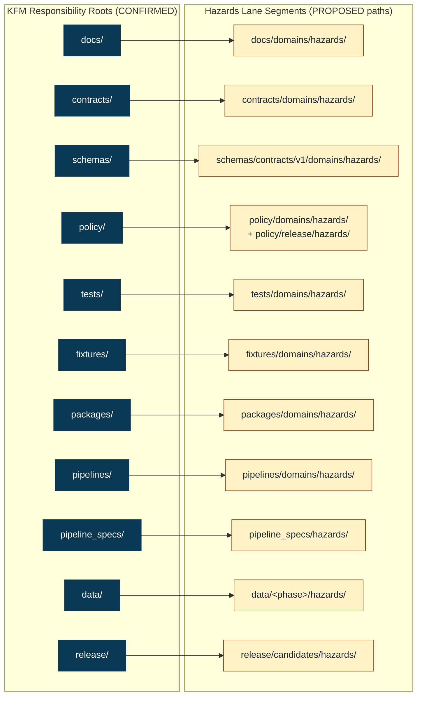

<!-- [KFM_META_BLOCK_V2]
doc_id: kfm://doc/domains/hazards/canonical-paths
title: Hazards Domain — Canonical Paths
type: standard
version: v1
status: draft
owners: <hazards-domain-steward TBD>; <directory-rules-steward TBD>
created: 2026-05-17
updated: 2026-05-17
policy_label: public
related:
  - ../../../directory-rules.md
  - ../README.md
  - kfm://standard/directory-rules
  - kfm://atlas/v1.1/section-24.13
  - kfm://encyclopedia/v0.1/section-7.10
tags: [kfm, domains, hazards, directory-rules, canonical-paths]
notes:
  - PROPOSED: lane-pattern segment form `schemas/contracts/v1/domains/hazards/` per Directory Rules §12 may conflict with the Atlas v1.1 §24.13 flat form `schemas/contracts/v1/hazards/`; an ADR is required to freeze one.
  - PROPOSED: all implementation paths remain PROPOSED until verified against a mounted repo.
[/KFM_META_BLOCK_V2] -->

# Hazards Domain — Canonical Paths

> Authoritative path map for everything the **Hazards** lane owns across KFM's responsibility roots — a domain-side index pinned to Directory Rules §12 and the lifecycle invariant `RAW → WORK / QUARANTINE → PROCESSED → CATALOG / TRIPLET → PUBLISHED`.


<!-- TODO: replace shields above with repo-canonical Shields.io endpoints once selected. -->

**Status** — draft · **Owners** — `<hazards-domain-steward TBD>`, `<directory-rules-steward TBD>` · **Last updated** — 2026-05-17

---

## Contents

- [1. Purpose and scope](#1-purpose-and-scope)
- [2. Authority and conformance](#2-authority-and-conformance)
- [3. Lane pattern at a glance](#3-lane-pattern-at-a-glance)
- [4. Canonical paths by responsibility root](#4-canonical-paths-by-responsibility-root)
- [5. Lifecycle paths under `data/`](#5-lifecycle-paths-under-data)
- [6. Release-plane paths](#6-release-plane-paths)
- [7. Cross-lane relations and shared homes](#7-cross-lane-relations-and-shared-homes)
- [8. Anti-patterns and drift watch](#8-anti-patterns-and-drift-watch)
- [9. Path-validation checklist for Hazards PRs](#9-path-validation-checklist-for-hazards-prs)
- [10. Compatibility and migration notes](#10-compatibility-and-migration-notes)
- [11. Open questions](#11-open-questions)
- [12. Related docs](#12-related-docs)

---

## 1. Purpose and scope

This document is the **Hazards domain's path index** — a single navigable map of where Hazards material lives across KFM's responsibility roots. It exists so contributors, reviewers, and stewards do not have to re-derive lane placement every time a fixture, schema, policy, pipeline, or release artifact for Hazards is added, moved, or audited.

It is **not** a license to create a `hazards/` root, a parallel schema home, or a separate publication path. The Hazards lane is a segment inside KFM's shared responsibility roots, governed by the same lifecycle, trust membrane, and authority rules as every other domain. Where doctrine in Directory Rules §12 and Atlas §24.13 differ in segment form, this document follows Directory Rules §12 and surfaces the variance as an open question.

> [!IMPORTANT]
> **KFM Hazards is not an emergency alert authority.** Operational warnings and advisories are admitted as *context only*. Life-safety instruction is redirected to the issuing authority (e.g., NWS, FEMA, state EM). This boundary shapes several Hazards-specific path additions in §6 and §8.

[Back to top](#contents)

---

## 2. Authority and conformance

The Hazards lane sits inside a layered authority stack. Path claims in this document defer to the higher layer in case of conflict.

| Layer | Source | Authority for this doc |
|---|---|---|
| 1 | KFM operating law: lifecycle invariant, trust membrane, watcher-as-non-publisher, cite-or-abstain | **CONFIRMED** doctrine; binds every section here. |
| 2 | Accepted ADRs amending Directory Rules | Binding where accepted. The `/domains/<domain>/` segment question (§11) is a pending ADR candidate. |
| 3 | Directory Rules (Domain Placement Law §12; Authority roots §5; Lifecycle §9.1) | **CONFIRMED** doctrine — primary basis for §§3–6 below. |
| 4 | Per-root `README.md` files in the repo | Refines this doc; cannot contradict §§1–3 above. **NEEDS VERIFICATION** against mounted repo. |
| 5 | Hazards domain dossier ([Encyclopedia §7.10](#); [Atlas §24.13 crosswalk](#)) | Lineage / proposed home declarations only. |
| 6 | Mounted-repo convention | Where it conflicts with the layers above, raise via `docs/registers/DRIFT_REGISTER.md`, not as new authority. |

**Conformance language** (RFC 2119-style) follows Directory Rules §2.2: **MUST**, **MUST NOT**, **SHOULD**, **SHOULD NOT**, **MAY**.

> [!NOTE]
> Truth labels used below follow KFM convention: **CONFIRMED** (doctrine or verified evidence), **PROPOSED** (recommended path not yet verified in implementation), **INFERRED** (derivable but not directly stated), **NEEDS VERIFICATION** (checkable, not yet checked), **UNKNOWN** (not resolvable here).

[Back to top](#contents)

---

## 3. Lane pattern at a glance

The Hazards lane applies Directory Rules §12 **Domain Placement Law** uniformly: a domain MUST NOT become a root folder; instead, the domain name appears as a **segment** inside each owning responsibility root.



> [!CAUTION]
> The diagram shows **PROPOSED** path *segments* derived from Directory Rules §12 and the Atlas crosswalk. They are not a claim that these directories currently exist in the repo. See §11 for the pending segment-form ADR question.

[Back to top](#contents)

---

## 4. Canonical paths by responsibility root

The table below is the Hazards lane's primary reference. Each row names a responsibility root, the Hazards-specific path inside it, what it owns, and what does **not** belong there.

| Responsibility root | Hazards path (PROPOSED) | Owns | Does NOT belong here | Status |
|---|---|---|---|---|
| `docs/` | `docs/domains/hazards/` | Domain README, this `CANONICAL_PATHS.md`, runbooks, source dossiers, governance notes for Hazards. | Schemas, policy bundles, code, fixtures, release decisions. | Doctrine **CONFIRMED**; specific path **PROPOSED**. |
| `contracts/` | `contracts/domains/hazards/` | Object-family **meaning** for `HazardEvent`, `HazardObservation`, `WarningContext`, `AdvisoryContext`, `DisasterDeclaration`, `FloodContext`, `WildfireDetection`, `SmokeContext`, `DroughtIndicator`, `EarthquakeEvent`, `HeatColdEvent`, `ExposureSummary`, `ResilienceSummary`, `HazardTimeline`, `ImpactArea`. | Machine-shape JSON Schemas (those live under `schemas/`); release decisions; policy. | **PROPOSED**. |
| `schemas/` | `schemas/contracts/v1/domains/hazards/` | Machine-checkable JSON Schemas for Hazards DTOs, layer manifests, and Hazards-flavored envelopes (e.g., `HazardsDecisionEnvelope`). Schema home is fixed by ADR-0001. | Object meaning (lives in `contracts/`); fixtures; instance data. | **PROPOSED**. |
| `policy/` | `policy/domains/hazards/` | Allow/deny/restrict/abstain rules for Hazards: source-role anti-collapse, expiry/freshness denials, sensitive infrastructure joins, life-safety boundary enforcement. | Sensitivity registries for other domains; release manifests; tests. | **PROPOSED**. |
| `policy/` (release sub-lane) | `policy/release/hazards/` | Release-eligibility rules specific to Hazards (e.g., `not_emergency_alert_system` envelope flag, official-source referral requirement, stale-state denial). | Generic release policy (lives at `policy/release/`); life-safety operational decisions (KFM has no such authority). | **PROPOSED**; called out by Atlas §24.13. |
| `tests/` | `tests/domains/hazards/` | Domain test suites: source-role anti-collapse, temporal-role, emergency-alert denial, operational expiry/freshness, catalog closure, Evidence Drawer disclaimer, UI no-direct-source. | Shared validator implementations (those live in `tools/validators/`); fixtures (those live in `fixtures/`). | **PROPOSED**. |
| `fixtures/` | `fixtures/domains/hazards/` (or `tests/fixtures/domains/hazards/` per repo convention) | Golden/valid/invalid/synthetic fixtures for Hazards: storm events, NFHL flood polygons, advisory polygons with expiry, earthquake catalog rows, FIRMS detections. | Schemas; canonical truth; published artifacts. | **PROPOSED**; choose **one** fixture home per Directory Rules §6.6 — `NEEDS VERIFICATION`. |
| `packages/` | `packages/domains/hazards/` | Reusable Hazards libraries: domain ontology helpers, source-role taxonomy, freshness/expiry utilities, exposure overlay helpers. | One-off scripts (those belong in `tools/` or `pipelines/`); deployable apps. | **PROPOSED**. |
| `pipelines/` | `pipelines/domains/hazards/` | Executable Hazards pipeline steps: ingest, normalize, validate, catalog, publish, rollback. | Declarative specs (those live in `pipeline_specs/`); connector definitions (those live in `connectors/`). | **PROPOSED**. |
| `pipeline_specs/` | `pipeline_specs/hazards/` | Declarative pipeline configuration for Hazards sources and transforms. | Executable logic; runtime adapters. | **PROPOSED**. |
| `data/` | See §5 | Lifecycle data by phase. | Release decisions (those live in `release/`); generated build artifacts. | **PROPOSED**. |
| `release/` | See §6 | Release candidates, manifests, rollback cards, correction notices for Hazards releases. | Released artifacts (those live in `data/published/`); receipts of process memory (those live in `data/receipts/`). | **PROPOSED**. |
| `connectors/` | Per-source, **not** per-domain — see §7 | Fetch and admission for Hazards source families (NOAA, NWS, FEMA, USGS, NASA, drought monitors). | Domain-bearing logic; publication. | **PROPOSED**; placement is per-source, not under a `hazards/` segment. |
| `tools/validators/` | Cross-cutting validators with Hazards-aware fixtures | Generic validators for source descriptors, evidence bundles, promotion gates. Hazards-specific tests live in `tests/domains/hazards/`. | Domain-only logic that is not reusable. | **PROPOSED**. |

[Back to top](#contents)

---

## 5. Lifecycle paths under `data/`

The Hazards lane follows the lifecycle invariant exactly. Promotion between phases is a **governed state transition**, not a file move.

```text
data/
├── raw/hazards/<source_id>/<run_id>/         # Immutable source-edge captures.
├── work/hazards/<run_id>/                    # Normalized intermediates, candidate assertions.
├── quarantine/hazards/<reason>/<run_id>/     # Held: rights, sensitivity, source-role, schema,
│                                             #   expired operational context, life-safety drift.
├── processed/hazards/<dataset_id>/<version>/ # Validated normalized records, receipts attached.
├── catalog/
│   └── domain/hazards/                       # STAC/DCAT/PROV/domain catalog entries.
├── triplets/
│   ├── graph_deltas/                         # Hazards relations (event→declaration, event→exposure).
│   └── exports/
├── receipts/                                 # Run/validation/AI/ingest/release receipts (not domain-segmented).
├── proofs/                                   # EvidenceBundle/ProofPack closure (not domain-segmented).
├── published/
│   └── layers/hazards/                       # Released public-safe Hazards artifacts (e.g., PMTiles).
├── rollback/hazards/<release_id>/            # Alias-revert receipts (data plane).
└── registry/
    └── sources/hazards/                      # SourceDescriptors for Hazards source families.
```

### 5.1 Phase-by-phase Hazards rules

| Phase | Hazards-specific gate | Failure-closed outcome |
|---|---|---|
| `raw/hazards/` | `SourceDescriptor` exists; role declared (authority / observation / context / model); rights captured; sensitivity declared; payload or reference hashed. | Source not admitted; logged as candidate awaiting steward. |
| `work/hazards/` | Schema, geometry, time, identity, evidence, rights, and policy normalized; `TransformReceipt` + working `ValidationReport` + `PolicyDecision` emitted. | Move to `quarantine/hazards/` with reason; never silent promotion. |
| `quarantine/hazards/` | Common Hazards reasons: expired operational context labeled as current; warning/advisory used as life-safety instruction; unresolved rights on regulatory or proprietary feeds; source-role collapse (e.g., warning treated as observed event). | Hold; structured FAIL; remediation or denial. |
| `processed/hazards/` | `ValidationReport` pass; `EvidenceRef`s point to resolvable `EvidenceBundle`s; digest closure. | Stay in `work/`; structured FAIL. |
| `catalog/domain/hazards/` | `CatalogMatrix` entry; `EvidenceBundle` closure; graph/triplet projections where applicable. | HOLD at `processed/`; no public edge. |
| `published/layers/hazards/` | `ReleaseManifest` exists; rollback target exists; correction path exists; review state where required; **`not_emergency_alert_system`** posture flag set on operational-context layers. | HOLD at `catalog/`; no public surface change. |

> [!WARNING]
> The lifecycle is one-directional under normal promotion. Backward transitions (e.g., `published → quarantine` after a correction) are recorded via `CorrectionNotice` + `RollbackCard` in the **release plane** (§6), never by silent file deletion or overwrite.

[Back to top](#contents)

---

## 6. Release-plane paths

The release plane is **separate** from `data/published/`. Conflating released **artifacts** (`data/published/layers/hazards/`) with release **decisions** (`release/.../hazards/`) is one of the named drift patterns in Directory Rules §13.

```text
release/
├── candidates/hazards/         # Release-candidate dossiers for Hazards.
├── manifests/                  # ReleaseManifest by release_id (not domain-segmented at this level).
├── promotion_decisions/        # PromotionDecision records.
├── rollback_cards/             # Rollback decision artifacts (release plane).
├── correction_notices/         # Public correction notices.
├── withdrawal_notices/         # Withdrawal records.
├── signatures/                 # DSSE / Sigstore artifacts.
└── changelog/                  # Release-level changelog.
```

### 6.1 Hazards-specific release rules

- **MUST** include a `not_emergency_alert_system` posture flag in every Hazards `ReleaseManifest` whose payload includes operational-context layers (warnings, advisories, watches).
- **MUST** name an official referral source (e.g., NWS, FEMA, state EM) for any layer that depicts operational context.
- **MUST NOT** publish operational-context layers without an expiry/freshness contract.
- **SHOULD** route `rollback_cards/` and `correction_notices/` for hazard misclassifications through the steward-review queue before public publication, given the elevated misuse risk.
- **MAY** stage public release through `apps/review-console/` for layers whose source freshness is borderline.

[Back to top](#contents)

---

## 7. Cross-lane relations and shared homes

Hazards is one of KFM's most cross-cutting lanes. Files that legitimately span domains MUST follow Directory Rules §12 **Multi-domain placement** — they live under the **lowest common responsibility root without a domain segment**, not under a single picked domain.

| Cross-cutting concern | Where it lives | Why |
|---|---|---|
| Hazards ↔ Hydrology flood/drought context | `tools/validators/<topic>/...`; `schemas/contracts/v1/<topic>/...` (no domain segment) | Cross-lane validator/schema, not a Hazards-only file. |
| Hazards ↔ Atmosphere/Air smoke and heat/cold | Same as above. | Same. |
| Hazards ↔ Settlements/Infrastructure exposure overlays | Same as above. Critical-infrastructure sensitivity gates live in `policy/sensitivity/infrastructure/`, **not** under `policy/domains/hazards/`. | Sensitivity ownership stays with Settlements/Infrastructure. |
| Hazards ↔ Roads/Rail closure and resilience | Same. Route exposure decisions remain in the Roads/Rail lane. | Ownership rule. |
| Hazards source connectors (NOAA, NWS, FEMA, USGS, NASA) | `connectors/noaa/`, `connectors/fema/`, `connectors/usgs/`, etc. — **per source**, not under a `hazards/` segment. | Connectors are source-specific, not domain-specific (Directory Rules §7.3). |
| Hazards `SourceDescriptor`s | `data/registry/sources/hazards/` | Registry records are domain-segmented by ownership. |

> [!TIP]
> A useful smell test: if a file would need to be edited every time *another* domain changes, it probably belongs in a cross-cutting home, not under `policy/domains/hazards/`.

[Back to top](#contents)

---

## 8. Anti-patterns and drift watch

The patterns below are the Hazards-specific versions of Directory Rules §13. Each is a drift candidate; each has a fix.

| Anti-pattern | Symptom | Why it's wrong | Fix |
|---|---|---|---|
| **`hazards/` at repo root** | A `hazards/` folder appears at root with its own `data/`, `schemas/`, `policy/`, `docs/` subtree. | Violates Domain Placement Law (§12); fragments the lifecycle; creates parallel schema/policy/data homes. | Migrate piece by piece into the responsibility-root lane pattern; preserve `docs/domains/hazards/README.md`. |
| **Parallel Hazards schema home** | Schemas under both `contracts/hazards/*.schema.json` and `schemas/contracts/v1/domains/hazards/*.schema.json`. | Two homes diverge silently; reviewers no longer know which is authoritative. | Per ADR-0001, `schemas/contracts/v1/...` is canonical; freeze old paths to mirror; add drift entry. |
| **Operational warning treated as observed event** | `WarningContext` records flow into a `HazardEvent` catalog path without source-role separation. | Collapses source roles; violates Hazards anti-collapse posture. | Quarantine in `data/quarantine/hazards/source_role_collapse/<run_id>/`; require steward review. |
| **Life-safety drift** | Hazards layer published without `not_emergency_alert_system` flag; UI presents an advisory as instruction. | Violates the KFM Hazards boundary (Encyclopedia §7.10; Atlas POL-007). | DENY at the release gate; emit `PolicyDecision` with reason; route correction through `release/correction_notices/`. |
| **Expired operational context shown as current** | Warning polygon with elapsed expiry remains visible on a public layer. | Stale state on a hazard surface is high-risk. | Freshness validator MUST deny; quarantine and rollback per `release/rollback_cards/`. |
| **Public client reads `data/processed/hazards/` directly** | `apps/explorer-web/` or an external consumer hits a canonical store. | Trust-membrane bypass (Directory Rules §7.1). | Public reads MUST route through `apps/governed-api/`. |
| **Connector publishes Hazards data** | A NOAA/NWS/FEMA connector writes to `data/processed/hazards/` or `data/published/layers/hazards/`. | Connectors do not publish (Directory Rules §7.3); watcher-as-non-publisher invariant. | Connector output stays in `data/raw/hazards/<source_id>/<run_id>/` or `data/quarantine/hazards/<reason>/<run_id>/`. |
| **Release manifest in `artifacts/`** | A Hazards `ReleaseManifest` ends up in `artifacts/` instead of `release/manifests/`. | Confuses build/QA scratch with release decisions (Directory Rules §13.2). | Move to `release/manifests/`; `artifacts/` is build/docs/qa/temporary only. |
| **Sensitive infrastructure exposure via Hazards layer** | A Hazards exposure overlay reveals precise critical-infrastructure geometry. | Critical-asset deny lane lives with Settlements/Infrastructure (Atlas §24.13). | Generalize geometry; route through `policy/sensitivity/infrastructure/`; emit `RedactionReceipt`. |

[Back to top](#contents)

---

## 9. Path-validation checklist for Hazards PRs

Reviewers SHOULD work through this list for any PR that adds, moves, or renames a Hazards-bearing path. It extends Directory Rules §16 with Hazards-specific items.

- [ ] **Responsibility identified.** File maps to exactly one responsibility root.
- [ ] **Right root.** Chosen root matches the responsibility (e.g., a JSON Schema went to `schemas/`, not `contracts/`).
- [ ] **Domain segment correct.** `hazards/` appears as a *segment* inside a responsibility root, never as a root.
- [ ] **Lifecycle phase correct** (for `data/` files). Phase named explicitly; no phase-skipping.
- [ ] **No new root without ADR.** No `hazards/` at root; no new sibling under `data/`.
- [ ] **No parallel authority.** No new home for Hazards schemas, contracts, policy, sources, registries, releases, proofs, or receipts.
- [ ] **README present.** Affected folders have READMEs that meet Directory Rules §15.
- [ ] **Trust content placement.** Receipts → `data/receipts/`; proofs → `data/proofs/`; release manifests → `release/manifests/`; never `artifacts/`.
- [ ] **Public path discipline.** Routes go through `apps/governed-api/`, not directly to canonical stores.
- [ ] **Connector posture.** Connectors emit to `data/raw/hazards/...` or `data/quarantine/hazards/...`, never to `data/processed/` or `data/published/`.
- [ ] **Watcher posture.** Workers under `apps/workers/` emit receipts and candidate decisions; they do not publish.
- [ ] **Source-role labeled.** `SourceDescriptor` declares one of authority / observation / context / model.
- [ ] **Freshness/expiry contract.** Operational-context layers carry expiry and freshness fields.
- [ ] **Life-safety flag.** Release manifest sets `not_emergency_alert_system` posture for operational-context layers.
- [ ] **Official referral declared.** Operational-context layers name an official issuing authority for redirection.
- [ ] **Cross-lane sensitivity respected.** Critical-infrastructure or sensitive-occurrence joins routed through the owning lane's sensitivity policy.

[Back to top](#contents)

---

## 10. Compatibility and migration notes

The following are points of friction or PROPOSED state that may surface during repo inspection. Each is a candidate drift entry or ADR question.

| Item | Status | Notes |
|---|---|---|
| `schemas/contracts/v1/domains/hazards/` (§12 form) vs. `schemas/contracts/v1/hazards/` (Atlas §24.13 form) | **PROPOSED CORRECTION** | Directory Rules §12 lane pattern (`/domains/<domain>/` segment) is followed in this doc; Atlas §24.13 crosswalk uses the flat form. An ADR should freeze one. See §11. |
| Fixture home: `fixtures/domains/hazards/` vs. `tests/fixtures/domains/hazards/` | **NEEDS VERIFICATION** | Directory Rules §6.6 permits either; choose one per repo convention; document the choice in both root READMEs. |
| `policy/release/hazards/` as a Hazards-specific release-policy sub-lane | **PROPOSED** | Atlas §24.13 surfaces this; not yet declared canonical in Directory Rules. ADR may be appropriate if other domains adopt the same pattern. |
| `apps/api/` vs. `apps/governed-api/` boundary | **OPEN** in Directory Rules §18; affects Hazards public path | If both exist, Hazards public routes MUST land on `apps/governed-api/`. |
| `data/rollback/hazards/` (data plane) vs. `release/rollback_cards/` (release plane) | **OPEN** in Directory Rules §18 | This doc keeps both: `data/rollback/hazards/` for alias-revert receipts; `release/rollback_cards/` for the release decision. |

[Back to top](#contents)

---

## 11. Open questions

<details>
<summary>Click to expand the verification and ADR backlog</summary>

| # | Question | Why it matters | What would settle it |
|---|---|---|---|
| 1 | Is the canonical schema-home form for Hazards `schemas/contracts/v1/domains/hazards/` (Directory Rules §12) or `schemas/contracts/v1/hazards/` (Atlas §24.13)? | Two forms in doctrine documents creates exactly the parallel-home risk §8 flags. | ADR amending or confirming the lane-pattern segment form. |
| 2 | Does the repo use `fixtures/domains/hazards/` or `tests/fixtures/domains/hazards/`? | Avoids two competing fixture homes. | Mounted-repo inspection + per-root README declaration. |
| 3 | Is `policy/release/hazards/` adopted as a stable sub-lane, or merged back into `policy/domains/hazards/`? | Hazards is one of the lanes most likely to need release-specific policy (life-safety boundary). | ADR; cross-lane survey of whether other domains need a parallel sub-lane. |
| 4 | Are NOAA/NWS/FEMA/USGS/NASA connectors structured per-source under `connectors/<vendor>/` or grouped under any Hazards-specific umbrella? | Directory Rules §7.3 says per-source; verify no umbrella exists. | Mounted-repo inspection. |
| 5 | Does `apps/workers/` currently include a Hazards freshness/expiry watcher, and does it respect watcher-as-non-publisher? | Workers MUST emit receipts and candidate decisions only. | Mounted-repo inspection + log/receipt audit. |
| 6 | Is `not_emergency_alert_system` represented as a flag on `ReleaseManifest`, a field on `LayerManifest`, both, or neither? | Determines where the life-safety boundary is enforced at release time. | Schema inspection under `schemas/contracts/v1/release/` and `schemas/contracts/v1/runtime/`. |
| 7 | Where do `EvidenceDrawerPayload` disclaimer strings for Hazards live — content under `docs/`, schema under `schemas/`, or fixtures under `fixtures/`? | Affects UI no-direct-source tests and Drawer policy. | Cross-check with `docs/architecture/ui/README.md` and per-root READMEs. |
| 8 | Verification backlog from Encyclopedia §7.10.N (source endpoints/rights; role taxonomy and freshness states; emergency-alert boundary enforcement; release/correction/rollback drill) — what is the current evidence state? | All four were marked **NEEDS VERIFICATION** in source doctrine. | Mounted-repo files, schemas, registry entries, tests, logs, emitted artifacts, review records, release manifests. |

</details>

[Back to top](#contents)

---

## 12. Related docs

- [`docs/directory-rules.md`](../../../directory-rules.md) — root authority for placement, lifecycle, and trust membrane. (CONFIRMED authority)
- [`docs/domains/hazards/README.md`](./README.md) — domain landing page. *(TODO: confirm existence in mounted repo.)*
- [`docs/domains/README.md`](../README.md) — domains index. *(TODO: confirm.)*
- [`docs/standards/PROV.md`](../../standards/PROV.md) — provenance standards profile referenced by Hazards `EvidenceBundle`s.
- [`docs/registers/DRIFT_REGISTER.md`](../../registers/DRIFT_REGISTER.md) — where to raise §10 / §11 items that cannot be resolved by ADR alone. *(TODO: confirm.)*
- [`docs/adr/`](../../adr/) — ADR home; questions in §11 are candidates here.
- Encyclopedia §7.10 — Hazards domain chapter. *(In project knowledge; not yet a repo doc.)*
- Atlas v1.1 §24.13 — Atlas Section ↔ Dossier ↔ Responsibility Root crosswalk. *(In project knowledge.)*

---

<sub>Last updated: **2026-05-17** · Owners: `<hazards-domain-steward TBD>`, `<directory-rules-steward TBD>` · [Back to top](#contents)</sub>
