<!-- [KFM_META_BLOCK_V2]
doc_id: kfm://doc/domains/hazards/continuity-inventory
title: Hazards Domain — Continuity Inventory
type: standard
version: v2
status: draft
owners: <hazards-domain-steward (placeholder)>; <docs-steward (placeholder)>
created: 2026-05-17
updated: 2026-06-05
policy_label: public
contract_version: "3.0.0"
related:
  - docs/domains/hazards/ARCHITECTURE.md
  - docs/domains/hazards/api-contracts.md
  - docs/domains/hazards/BLUEPRINT.md
  - docs/domains/hazards/CANONICAL_PATHS.md
  - docs/standards/PROV.md
  - docs/runbooks/fauna/SOURCE_REFRESH_RUNBOOK.md
  - docs/registers/DRIFT_REGISTER.md
  - docs/registers/VERIFICATION_BACKLOG.md
  - docs/registers/CANONICAL_LINEAGE_EXPLORATORY.md
tags: [kfm, hazards, continuity, doctrine, lane-inventory]
notes:
  # CONTRACT_VERSION = "3.0.0" pinned per ai-build-operating-contract.md v3.0.
  # Continuity register: classifies prior gains and lane-level doctrine carried into the current Hazards slice.
  # Implementation-layer rows are PROPOSED until verified against mounted repo evidence.
  # Owner and doc_id placeholders require assignment before status moves past draft.
  # Idea-index IDs corrected v1->v2: the v1 KFM-IDX-* IDs were not verifiable. The real convention is
  #   KFM-P{PASS}-IDEA-{NNNN}. Verified cards: KFM-P1-IDEA-0072 (atmosphere/hazards knowledge-character
  #   separation; Pass 20 records hazards-are-not-alerting) and KFM-P1-IDEA-0051 (knowledge-character labels).
  #   The hazards-not-alert and critical-infrastructure postures are also anchored by Atlas Sec 20.5
  #   (Deny-by-Default register) and Sec 24.4.10 / 24.4.12 (edge registers).
  # Schema-home form set to the FLAT crosswalk form schemas/contracts/v1/hazards/ (Atlas Sec 24.13 and
  #   Encyclopedia Sec 7.1 converge); the /domains/hazards/ segment form is CONFLICTED pending ADR-S-01 / ADR-0001.
[/KFM_META_BLOCK_V2] -->

# Hazards Domain — Continuity Inventory

> Auditable register of prior gains, doctrinal surfaces, source-role taxonomy, object families, pipeline shape, validators, API surfaces, and governance posture that the Hazards lane carries forward from the KFM source corpus — each classified, evidence-cited, and truth-labeled.

| Field | Value |
|---|---|
| **Status** | `draft` |
| **Owners** | `<hazards-domain-steward>` · `<docs-steward>` *(placeholders pending assignment)* |
| **Last updated** | `2026-06-05` |
| **`CONTRACT_VERSION`** | `"3.0.0"` |
| **Authority** | This register inherits authority from KFM doctrine; rows are PROPOSED unless explicitly CONFIRMED by attached corpus or mounted-repo evidence. |
| **Schema home (for Hazards machine shape)** | `schemas/contracts/v1/hazards/` *(PROPOSED — flat crosswalk form per Atlas §24.13 / Encyclopedia §7.1; segment form CONFLICTED — see §17)* |

> [!IMPORTANT]
> **Hazards is not an emergency alert system.** Every entry in this inventory must preserve the Hazards boundary: KFM governs **historical, regulatory, modeled, and operational-context** hazard information for analysis and resilience, and **refuses** to act as a life-safety alerting system. Operational warning products are contextual only and not for life safety; expired operational context must not appear as current warning state. *(CONFIRMED doctrine: `DOM-HAZ`; `ENCY` Hazards chapter; Atlas §20.5 Deny-by-Default register — "Hazards · KFM as alert authority → not allowed"; idea card `KFM-P1-IDEA-0072`.)*

---

## Table of Contents

- [1. Purpose & Scope](#1-purpose--scope)
- [2. Evidence Basis & Source Ledger](#2-evidence-basis--source-ledger)
- [3. How to Read This Inventory](#3-how-to-read-this-inventory)
- [4. Continuity Model — Diagram](#4-continuity-model--diagram)
- [5. Mission & Boundary Carried Forward](#5-mission--boundary-carried-forward)
- [6. Source Families & Source Roles](#6-source-families--source-roles)
- [7. Canonical Object Families](#7-canonical-object-families)
- [8. Map Layers & Viewing Modes](#8-map-layers--viewing-modes)
- [9. Pipeline Shape (RAW → PUBLISHED)](#9-pipeline-shape-raw--published)
- [10. Validators, Fixtures & Tests](#10-validators-fixtures--tests)
- [11. API, DTO & Schema Surfaces](#11-api-dto--schema-surfaces)
- [12. Cross-Lane Relations](#12-cross-lane-relations)
- [13. Governed AI Behavior](#13-governed-ai-behavior)
- [14. Sensitivity & Rights Posture Carried Forward](#14-sensitivity--rights-posture-carried-forward)
- [15. Items DEFERRED in the Current Slice](#15-items-deferred-in-the-current-slice)
- [16. Items SUPERSEDED or Not Carried Forward](#16-items-superseded-or-not-carried-forward)
- [17. Open Questions & Verification Backlog](#17-open-questions--verification-backlog)
- [18. Related Docs](#18-related-docs)

---

## 1. Purpose & Scope

This document is the **continuity register for the Hazards domain lane.** It does three things, and only these three things:

1. **Enumerates** the doctrinal surfaces, source-role taxonomy, object families, pipeline stages, validator families, API surfaces, cross-lane relations, and governance posture for Hazards that the project's corpus already establishes.
2. **Classifies** each entry — `KEEP`, `KEEP AND EXTEND`, `WRAP WITH ADAPTER`, `DEFER`, `KEEP AS LINEAGE`, or `SUPERSEDE` — so that downstream design and implementation decisions inherit a stable substrate.
3. **Truth-labels** each entry — `CONFIRMED`, `INFERRED`, `PROPOSED`, `UNKNOWN`, `NEEDS VERIFICATION`, or `CONFLICTED` — so that no implementation-shaped claim is treated as repo state without evidence.

It is **not** a place that originates new doctrine, declares implementation, asserts route names, claims schema validation, or publishes promotion decisions. Those live in their canonical homes — `contracts/hazards/`, `schemas/contracts/v1/hazards/`, `policy/domains/hazards/`, `tests/domains/hazards/`, `pipelines/domains/hazards/`, `release/candidates/hazards/`, and the corresponding registers under `docs/registers/`.

> [!NOTE]
> The continuity-inventory pattern is adapted from the "Prior gains and continuity inventory" section of the KFM Whole-UI + Governed AI Expansion Report and from the `<subsystem>/CONTINUITY_NOTES.md` row in its update-propagation matrix. This file applies that pattern to a single domain lane (Hazards) rather than a UI subsystem. It is the fifth member of the Hazards doc set, alongside `ARCHITECTURE.md`, `api-contracts.md`, `BLUEPRINT.md`, and `CANONICAL_PATHS.md`.

[⬆ Back to top](#table-of-contents)

---

## 2. Evidence Basis & Source Ledger

The rows in §§5–14 are sourced from the following corpus documents. Citations in subsequent tables use short source IDs.

| Short ID | Source | Role in this register | Truth posture |
|---|---|---|---|
| `DOM-HAZ` | Hazards Architecture Extended Pro Blueprint *(`kfm_hazards_extended_pro_pdf_only_blueprint.pdf`; SRC-HAZ / SRC-036)* | Primary doctrine for Hazards mission, boundary, source-role taxonomy, validators, posture. | CONFIRMED doctrine; implementation rows remain PROPOSED. |
| `ENCY` | KFM Domain and Capability Encyclopedia *(Hazards chapter)* | Canonical object families, knowledge systems, map layers, analytical functions, user actions. | CONFIRMED doctrine. |
| `DOM-CULM` | KFM Domains Culmination Atlas v1.1 *(Hazards §12; §20.5 Deny-by-Default register; §24.4.10 Hazards edges; §24.13 crosswalk)* | Object families with identity rules and temporal handling; pipeline shape; API surface candidates; deny-by-default rows. | CONFIRMED doctrine; implementation rows PROPOSED. |
| `DIRRULES` | Directory Rules v1.3 *(`directory-rules.md`)* | Authority for path placement and the Domain Placement Law. | CONFIRMED for placement rules; specific repo presence remains PROPOSED until verified. |
| `UNIFIED` | KFM Unified Implementation Architecture Build Manual *(§10.10 Hazards)* | Cross-doctrine roll-up of Hazards coverage, risks, and public posture. | CONFIRMED roll-up of source doctrine. |
| `WHOLE-UI` | KFM Whole-UI + Governed AI Expansion Report | Continuity-inventory template; UI-side touch points (Evidence Drawer, Focus Mode, finite outcomes). | CONFIRMED doctrine; UI bindings remain PROPOSED. |
| `IDX-20` | KFM Pass 20 Idea Index / Consolidated Atlas idea cards | Idea cards that reference Hazards (`KFM-P1-IDEA-0072`, `KFM-P1-IDEA-0051`). | CONFIRMED for idea-card content; exact ID allocation per the `KFM-P{PASS}-IDEA-{NNNN}` convention. |
| `GAI` | KFM Governed AI doctrine *(Whole-UI report; Encyclopedia Governed-AI sections)* | AI-as-interpretive boundary; finite outcomes (ANSWER / ABSTAIN / DENY / ERROR). | CONFIRMED doctrine. |

> [!NOTE]
> **No external (web) research was performed for this register.** Every claim in this file is grounded in attached project corpus. Implementation-layer claims (routes, packages, runtime presence) are not made; they are marked `PROPOSED` and listed in the [Open Questions & Verification Backlog](#17-open-questions--verification-backlog).

> [!CAUTION]
> **Idea-index IDs corrected in v2.** The v1 edition cited `KFM-IDX-POL-007`, `KFM-IDX-PLN-002`, `KFM-IDX-APP-005`, `KFM-IDX-POL-006` (and an Appendix-A cluster). Those IDs were **not** found in project knowledge. The real convention is `KFM-P{PASS}-IDEA-{NNNN}`; the verifiable hazards-relevant cards are **`KFM-P1-IDEA-0072`** (atmosphere/hazards knowledge-character separation; Pass 20 records that KFM hazards are not emergency alerting) and **`KFM-P1-IDEA-0051`** (knowledge-character labels). The hazards-not-alert and critical-infrastructure postures are independently anchored by Atlas §20.5 and the §24.4.10 / §24.4.12 edge registers, so the doctrine is sound even though the v1 IDs were not.

[⬆ Back to top](#table-of-contents)

---

## 3. How to Read This Inventory

Every row carries a **classification** and a **truth label.** Rows are inherited substrate; consumers in `contracts/`, `schemas/`, `policy/`, `pipelines/`, and `tests/` may extend them but should not silently rename or contradict them.

### 3.1 Classifications

| Classification | Meaning |
|---|---|
| `KEEP` | Carry forward as-is; no design pressure to change. |
| `KEEP AND EXTEND` | Carry forward and elaborate in the next slice (schema, fixture, policy, test, runbook). |
| `WRAP WITH ADAPTER` | Carry forward behind a boundary contract; consumers must not depend on the raw surface. |
| `DEFER` | Defer activation until a stated precondition is met (e.g., live source rights, mounted repo, ADR). |
| `KEEP AS LINEAGE` | Preserve as scaffold/plan evidence only; do not treat as implementation. |
| `SUPERSEDE` | Replaced by a newer doctrinal home; retain pointer for history. |

### 3.2 Truth labels

| Label | Meaning here |
|---|---|
| `CONFIRMED` | Directly verified from attached corpus in this session. |
| `INFERRED` | Reasonably derived from multiple corpus sources but not directly asserted. |
| `PROPOSED` | Recommended design, path, or behavior; not yet verified in implementation. |
| `UNKNOWN` | Not resolvable without further evidence. |
| `NEEDS VERIFICATION` | Checkable, but not yet checked strongly enough to act as fact. |
| `CONFLICTED` | Two corpus sources disagree (e.g., schema-home form); resolved here pending ADR. |

### 3.3 What this register does **not** do

- It does not declare schemas valid, tests green, policies enforced, or routes live.
- It does not pick between adjacent-lane interpretations; cross-lane joins remain governed by the owning lane.
- It does not authorize publication, promotion, or rollback; those flow through `release/` and the publication gate.

[⬆ Back to top](#table-of-contents)

---

## 4. Continuity Model — Diagram

The diagram below summarizes how Hazards doctrine carried forward in this register relates to canonical homes and the lifecycle. *Placeholder boxes marked `PROPOSED` reflect homes that are doctrinally specified but whose presence in a mounted repo has not been verified in this session.*

```mermaid
flowchart LR
    subgraph CORPUS["KFM Source Corpus (CONFIRMED doctrine)"]
        DOMHAZ["DOM-HAZ Blueprint"]
        ENCY["KFM Encyclopedia (Hazards chapter)"]
        DOMCULM["Domains Culmination Atlas (Sec 12 / 20.5 / 24)"]
        UNIFIED["Unified Build Manual (Sec 10.10)"]
        IDX20["Idea cards (KFM-P1-IDEA-0072 / 0051)"]
    end

    subgraph LANE["docs/domains/hazards/  (this lane)"]
        CI["CONTINUITY_INVENTORY.md (this file)"]
        ARCH["ARCHITECTURE.md"]
        APIC["api-contracts.md"]
        BP["BLUEPRINT.md"]
        CP["CANONICAL_PATHS.md"]
    end

    subgraph CANON["Canonical homes (PROPOSED for Hazards)"]
        CON["contracts/hazards/"]
        SCH["schemas/contracts/v1/hazards/"]
        POL["policy/domains/hazards/"]
        TST["tests/domains/hazards/"]
        FIX["fixtures/domains/hazards/"]
        PIPE["pipelines/domains/hazards/"]
        REL["release/candidates/hazards/"]
    end

    subgraph LIFECYCLE["Lifecycle (governed state transitions)"]
        RAW["data/raw/hazards/"]
        WORK["data/work and quarantine /hazards/"]
        PROC["data/processed/hazards/"]
        CAT["data/catalog/domain/hazards/"]
        PUB["data/published/layers/hazards/"]
    end

    CORPUS --> CI
    CI -. informs .-> ARCH
    CI -. informs .-> APIC
    CI -. informs .-> BP
    CI -. informs .-> CP
    CI -. classifies surfaces consumed by .-> CANON
    CANON --> LIFECYCLE
    LIFECYCLE -- "governed promotion" --> PUB
```

> [!NOTE]
> Specific repo presence of any canonical home shown above is `PROPOSED` until verified against a mounted repository. This diagram is a doctrinal placement map, not a current-state inventory. (Authority: `DIRRULES` Domain Placement Law; truth-label rule per `WHOLE-UI`.)

[⬆ Back to top](#table-of-contents)

---

## 5. Mission & Boundary Carried Forward

| # | Item | Classification | Truth label | Evidence | Preserved-next behavior |
|---|---|---|---|---|---|
| M-01 | Hazards governs historical, regulatory, modeled, and operational-context hazard information for analysis and resilience. | `KEEP` | CONFIRMED | `DOM-HAZ`; `ENCY` Hazards chapter; `UNIFIED` §10.10 | Every Hazards artifact, layer, and Focus answer is bounded to these four roles. |
| M-02 | Hazards is **not** a life-safety alerting system. | `KEEP` | CONFIRMED | `DOM-HAZ`; `ENCY`; Atlas §20.5 Deny-by-Default register; `KFM-P1-IDEA-0072` | Public surfaces and Focus Mode must redirect life-safety action to official sources and never imply alerting authority. |
| M-03 | Operational warning products are contextual only; expired operational context cannot appear as current warning state. | `KEEP` | CONFIRMED | `DOM-HAZ` (Sensitivity, rights, publication posture); `DOM-CULM` Hazards | Expiry/freshness gates fail closed; stale-warning denial is a first-class validator. |
| M-04 | Unknown source roles are quarantined until resolved. | `KEEP` | CONFIRMED | `DOM-HAZ`; `DOM-CULM` Hazards | Source-role anti-collapse tests must reject `unknown_unclassified` in published outputs. |
| M-05 | Adjacent lanes (Hydrology, Atmosphere/Air, Roads/Rail, Settlements/Infrastructure) provide context without converting Hazards into life-safety alerting. | `KEEP AND EXTEND` | CONFIRMED | `UNIFIED` §10.10; `DOM-CULM` Hazards §F; Atlas §24.4.10 | Cross-lane joins preserve ownership, source role, sensitivity, and EvidenceBundle support. |

[⬆ Back to top](#table-of-contents)

---

## 6. Source Families & Source Roles

Source-role discipline is the central anti-collapse mechanism for Hazards. The family-level table below uses the Hazards source-family role tags (`authority` / `observation` / `context` / `model`); these map onto the **seven canonical source roles** of the Atlas Source-Role Anti-Collapse Register (observed · regulatory · modeled · aggregate · administrative · candidate · synthetic), and **role is fixed at admission**. Live source endpoints, rights, and cadences are **not** revalidated here; they are explicitly `NEEDS VERIFICATION`.

| # | Source family | Permitted role tags | Rights / sensitivity | Freshness | Classification | Truth label |
|---|---|---|---|---|---|---|
| S-01 | NOAA Storm Events / NCEI-style records | authority / observation / context / model *(as source role requires)* | NEEDS VERIFICATION; sensitive joins fail closed | source-vintage or cadence specific | `KEEP AND EXTEND` | CONFIRMED *(`DOM-HAZ`; `DOM-CULM` Hazards)* |
| S-02 | NWS alerts / warnings / advisories / watches | authority / observation / context / model | NEEDS VERIFICATION; operational use is **context only** | issue/expiry-bound | `KEEP AND EXTEND` | CONFIRMED *(`DOM-HAZ`; `ENCY`)* |
| S-03 | FEMA Disaster Declarations / OpenFEMA | authority / observation / context / model | NEEDS VERIFICATION | declaration-event cadence | `KEEP AND EXTEND` | CONFIRMED *(`DOM-HAZ`)* |
| S-04 | FEMA NFHL / MSC flood hazard context | authority / observation / context / model | NEEDS VERIFICATION; regulatory context but **not a regulatory determination** in KFM | NFHL effective dates | `KEEP AND EXTEND` | CONFIRMED *(`DOM-HAZ`; `ENCY`)* |
| S-05 | USGS Earthquake Catalog | authority / observation / context / model | NEEDS VERIFICATION | event cadence | `KEEP AND EXTEND` | CONFIRMED *(`DOM-HAZ`)* |
| S-06 | NOAA HMS Fire and Smoke | authority / observation / context / model | NEEDS VERIFICATION | daily/operational cadence | `KEEP AND EXTEND` | CONFIRMED *(`DOM-HAZ`; `ENCY`)* |
| S-07 | NASA FIRMS active fire | authority / observation / context / model | NEEDS VERIFICATION | near-real-time cadence | `KEEP AND EXTEND` | CONFIRMED *(`DOM-HAZ`)* |
| S-08 | Drought monitors *(e.g., USDM, NIDIS family)* | authority / observation / context / model | NEEDS VERIFICATION | weekly cadence *(per source)* | `KEEP AND EXTEND` | CONFIRMED *(`DOM-HAZ`; `ENCY`)* |
| S-09 | USACE NLD (levees) / NID (dams) | authority / observation / context / model | NEEDS VERIFICATION; **dam-failure inundation / restricted-precise fields fail closed** | version-disciplined | `KEEP AND EXTEND` | CONFIRMED *(`DOM-CULM`; NFHL/NLD/NID authority card)* |
| S-10 | Kansas / local emergency-management & resilience plans | authority / observation / context / model | NEEDS VERIFICATION; sensitive joins fail closed | source-vintage specific | `KEEP AND EXTEND` | CONFIRMED *(`DOM-HAZ`; `ENCY`)* |

> [!CAUTION]
> The role tags (`authority`, `observation`, `context`, `model`) are permissive at the family level but **strictly enforced at the artifact level**. A single ingest from NWS may emit one artifact in role `observation` and another in role `context`, never both at once and never collapsed. Cross-role collapse is the canonical Hazards validation failure (Atlas §24.1.2 anti-collapse DENY conditions).

[⬆ Back to top](#table-of-contents)

---

## 7. Canonical Object Families

The encyclopedia and the Domains Culmination Atlas agree on the Hazards object set. Each object's deterministic identity basis is `source id + object role + temporal scope + normalized digest` *(PROPOSED)*. Source / observed / valid / retrieval / release / correction times are kept distinct where material *(CONFIRMED)*.

| # | Object | Purpose | Classification | Truth label |
|---|---|---|---|---|
| O-01 | `HazardEvent` | Discrete hazard occurrence (severe weather, flood, wildfire, earthquake, heat/cold, hail/wind/tornado) bound to time and place. | `KEEP AND EXTEND` | CONFIRMED |
| O-02 | `HazardObservation` | Measured or reported observation associated with a hazard event or condition. | `KEEP AND EXTEND` | CONFIRMED |
| O-03 | `WarningContext` | Issued warning with issue/expiry time; **context only**, never authoritative alerting. | `KEEP AND EXTEND` | CONFIRMED |
| O-04 | `AdvisoryContext` | Issued advisory / watch with issue/expiry; **context only**. | `KEEP AND EXTEND` | CONFIRMED |
| O-05 | `DisasterDeclaration` | Government disaster declaration record. | `KEEP AND EXTEND` | CONFIRMED |
| O-06 | `FloodContext` | Regulatory flood-hazard polygon context (e.g., NFHL); **not** a regulatory determination. | `KEEP AND EXTEND` | CONFIRMED |
| O-07 | `WildfireDetection` | Remote-sensing wildfire detection (e.g., FIRMS) with role `observation`/candidate-until-reviewed. | `KEEP AND EXTEND` | CONFIRMED |
| O-08 | `SmokeContext` | Smoke product (e.g., HMS smoke) with model/observation role distinction. | `KEEP AND EXTEND` | CONFIRMED |
| O-09 | `DroughtIndicator` | Drought-monitor classification at a place and time. | `KEEP AND EXTEND` | CONFIRMED |
| O-10 | `EarthquakeEvent` | Catalogued earthquake with magnitude, depth, time, location. | `KEEP AND EXTEND` | CONFIRMED |
| O-11 | `HeatColdEvent` | Heat or cold event derived from observation/model with role distinction. | `KEEP AND EXTEND` | CONFIRMED |
| O-12 | `ExposureSummary` | Public-safe summary linking hazard footprints to people/assets/infrastructure exposure. | `KEEP AND EXTEND` | CONFIRMED |
| O-13 | `ResilienceSummary` | Resilience-oriented summary derived from review-authorized evidence. | `KEEP AND EXTEND` | CONFIRMED |
| O-14 | `HazardTimeline` | Time-aware view-product object spanning historical events for a place/region. | `KEEP AND EXTEND` | CONFIRMED |
| O-15 | `ImpactArea` | Spatial impact polygon or footprint, role-tagged. | `KEEP AND EXTEND` | CONFIRMED |

> [!NOTE]
> The first eight families (`HazardEvent` through `SmokeContext`) are the **CONFIRMED** object-family spine named in the Atlas §12.B "owns" list and Cross-Domain Object Index. The remaining families (`DroughtIndicator` onward) come from the §12.E object table; treat their exact object names as **NEEDS VERIFICATION** against the live encyclopedia chapter.

[⬆ Back to top](#table-of-contents)

---

## 8. Map Layers & Viewing Modes

Hazards layers are **planning context, not alerting** — every public surface that hosts a hazards layer must respect that label *(CONFIRMED; `KFM-P1-IDEA-0072`; Atlas §20.5)*. Layer content is governed via `LayerManifest` and the Evidence Drawer.

| # | Layer / mode | Classification | Truth label | Notes |
|---|---|---|---|---|
| L-01 | Hazard event timeline | `KEEP AND EXTEND` | CONFIRMED *(`ENCY`; `DOM-CULM` Hazards §G)* | Time-aware; bound to historical evidence. |
| L-02 | NFHL flood context layer | `KEEP AND EXTEND` | CONFIRMED | Labelled "context, not regulatory determination". |
| L-03 | Drought map | `KEEP AND EXTEND` | CONFIRMED | Source freshness gate; cadence-bound. |
| L-04 | Wildfire / smoke layer | `KEEP AND EXTEND` | CONFIRMED | Role-tagged: observation (FIRMS), model (smoke forecast), context (HMS). |
| L-05 | Earthquake layer | `KEEP AND EXTEND` | CONFIRMED | USGS catalog basis. |
| L-06 | Severe weather layer | `KEEP AND EXTEND` | CONFIRMED | Storm-events + advisory/warning **context**. |
| L-07 | Heat / cold layer | `KEEP AND EXTEND` | CONFIRMED | Observation/model distinction enforced. |
| L-08 | Exposure analysis view | `KEEP AND EXTEND` | CONFIRMED | Cross-lane (Settlements/Infrastructure, People/Land — public-safe). |
| L-09 | Resilience summary view | `KEEP AND EXTEND` | CONFIRMED | Steward-reviewed summaries only. |
| L-10 | Not-for-life-safety **official-link mode** | `KEEP` | CONFIRMED | Directs users to official alerting authorities. |
| L-11 | Cross-cutting: Evidence Drawer, time-aware state, trust badges, sensitivity-redacted view, correction/stale-state view, governed Focus Mode | `KEEP AND EXTEND` | CONFIRMED *(`DOM-CULM` Hazards §G; `MAP-MASTER`; `GAI`)* | These apply to every Hazards layer surface. |

[⬆ Back to top](#table-of-contents)

---

## 9. Pipeline Shape (RAW → PUBLISHED)

The Hazards lane follows the KFM core lifecycle invariant. **Promotion is a governed state transition, not a file move** *(CONFIRMED doctrine: lifecycle law)*. The table below carries forward the stage / handling / gate triad with truth labels.

| Stage | Handling | Gate | Classification | Truth label |
|---|---|---|---|---|
| `RAW` | Capture immutable source payload or reference with source role, rights, sensitivity, citation, time, and hash. | `SourceDescriptor` exists. | `KEEP` | CONFIRMED doctrine / PROPOSED Hazards-specific realization |
| `WORK / QUARANTINE` | Normalize schema, geometry, time, identity, evidence, rights, and policy; hold failures. | Validation and policy gate pass, or a quarantine reason is recorded. | `KEEP` | CONFIRMED doctrine / PROPOSED realization |
| `PROCESSED` | Emit validated normalized objects, receipts, and public-safe candidates. | `EvidenceRef`, `ValidationReport`, and digest closure exist. | `KEEP` | CONFIRMED doctrine / PROPOSED realization |
| `CATALOG / TRIPLET` | Emit catalog records, `EvidenceBundle`s, graph/triplet projections, and release candidates. | Catalog / proof closure passes. | `KEEP` | CONFIRMED doctrine / PROPOSED realization |
| `PUBLISHED` | Serve released public-safe artifacts through governed APIs and manifests. | `ReleaseManifest`, correction path, rollback target, and review/policy state exist. | `KEEP` | CONFIRMED doctrine / PROPOSED realization |

> [!IMPORTANT]
> **Hazards-specific publication gate add-ons** *(CONFIRMED in `UNIFIED` §10.10 and `DOM-HAZ`):* evidence closure, source-role distinction, freshness/expiry handling, emergency-disclaimer posture, public-safe policy, release manifest, rollback/correction support. Each of these is a non-negotiable for promoting a Hazards artifact past `CATALOG / TRIPLET`.

[⬆ Back to top](#table-of-contents)

---

## 10. Validators, Fixtures & Tests

The corpus enumerates seven canonical validator families for Hazards. Each is `PROPOSED` for implementation in `tests/domains/hazards/` and `fixtures/domains/hazards/`; the doctrinal requirement is `CONFIRMED`.

| # | Validator family | Purpose | Classification | Truth label |
|---|---|---|---|---|
| V-01 | Source-role anti-collapse tests | Reject artifacts that collapse `authority`, `observation`, `context`, and `model` into a single role. | `KEEP AND EXTEND` | CONFIRMED doctrine / PROPOSED test code *(`DOM-HAZ` §K; `DOM-CULM` Hazards §K)* |
| V-02 | Temporal-role validators | Enforce distinct source / observed / valid / retrieval / release / correction times where material. | `KEEP AND EXTEND` | CONFIRMED doctrine / PROPOSED |
| V-03 | Emergency-alert denial | Deny outputs that present as life-safety alerts or omit the "not an emergency alert system" boundary. | `KEEP AND EXTEND` | CONFIRMED doctrine / PROPOSED |
| V-04 | Operational expiry / freshness tests | Block release of operational context past its expiry; verify freshness state on every operational-role artifact. | `KEEP AND EXTEND` | CONFIRMED doctrine / PROPOSED |
| V-05 | Catalog closure tests | Verify `EvidenceBundle`, digest, and catalog record closure before promotion. | `KEEP AND EXTEND` | CONFIRMED doctrine / PROPOSED |
| V-06 | Evidence Drawer disclaimer tests | Verify that every Hazards Evidence Drawer payload carries the "not for life safety" / "planning context, not alerting" disclaimer. | `KEEP AND EXTEND` | CONFIRMED doctrine / PROPOSED |
| V-07 | UI no-direct-source tests | Verify that no UI surface reads canonical hazards stores; all reads flow through the governed API. | `KEEP AND EXTEND` | CONFIRMED doctrine / PROPOSED |

[⬆ Back to top](#table-of-contents)

---

## 11. API, DTO & Schema Surfaces

Hazards API surfaces follow the finite-outcome contract: `ANSWER` / `ABSTAIN` / `DENY` / `ERROR`. The four-surface set and outcome grammar are **CONFIRMED** (Atlas Hazards §J); **exact routes are `UNKNOWN`** and DTO field shapes are `PROPOSED`. Schema home is `schemas/contracts/v1/hazards/` (flat crosswalk form) per ADR-0001 *(segment form CONFLICTED — §17)*. The full surface-by-surface contract lives in the companion [`api-contracts.md`](./api-contracts.md).

| # | Surface | DTO / schema | Outcomes | Classification | Truth label |
|---|---|---|---|---|---|
| A-01 | Hazards feature / detail resolver | `HazardsDecisionEnvelope` | `ANSWER` / `ABSTAIN` / `DENY` / `ERROR` | `KEEP AND EXTEND` | Surface+outcomes CONFIRMED; route UNKNOWN; fields PROPOSED *(`DOM-CULM` Hazards §J)* |
| A-02 | Hazards layer manifest resolver | `LayerManifest` / domain layer descriptor | `ANSWER` / `DENY` / `ERROR` | `KEEP AND EXTEND` | Surface+outcomes CONFIRMED; public-safe release only |
| A-03 | Hazards Evidence Drawer payload | `EvidenceDrawerPayload` + `EvidenceBundle` projection | `ANSWER` / `ABSTAIN` / `DENY` / `ERROR` | `KEEP AND EXTEND` | Surface+outcomes CONFIRMED; evidence and policy filtered |
| A-04 | Hazards Focus Mode answer | `RuntimeResponseEnvelope` + `AIReceipt` | `ANSWER` / `ABSTAIN` / `DENY` / `ERROR` | `KEEP AND EXTEND` | Surface+outcomes CONFIRMED; AI never root truth |
| A-05 | Schema responsibility root | `schemas/contracts/v1/hazards/` | finite validator outcomes | `KEEP` *(per `DIRRULES`; ADR-0001)* | PROPOSED — flat crosswalk form; segment form CONFLICTED; verify against mounted repo |

[⬆ Back to top](#table-of-contents)

---

## 12. Cross-Lane Relations

| # | Related lane | Relation type | Constraint | Classification | Truth label |
|---|---|---|---|---|---|
| X-01 | Hydrology | Flood / drought / water-event context with role separation. | Preserve ownership, source role, sensitivity, and `EvidenceBundle` support; NFHL owned by Hydrology's regulatory channel. | `KEEP AND EXTEND` | CONFIRMED *(`DOM-CULM` Hazards §F; Atlas §24.4.10)* |
| X-02 | Atmosphere / Air | Smoke, heat/cold, AQI/advisory, wind, fire-weather context. | Same as X-01; cross-domain knowledge-character separation applies *(`KFM-P1-IDEA-0072`)*. | `KEEP AND EXTEND` | CONFIRMED |
| X-03 | Settlements / Infrastructure | Exposure, lifelines, dependencies. | Public-safe geometry only; honor critical-infrastructure exposure controls *(Atlas §20.5 Infrastructure row; §24.4.12 — default deny on public detail)*. | `KEEP AND EXTEND` | CONFIRMED |
| X-04 | Roads / Rail | Closures, detours, bridge/crossing exposure, resilience. | Same constraints as X-03. | `KEEP AND EXTEND` | CONFIRMED |
| X-05 | Archaeology | Threat / erosion / fire / flood / exposure context. | **Exact-site denial** for archaeology applies to the join. | `KEEP AND EXTEND` | CONFIRMED *(Atlas §20.5 Archaeology row; §24.4.13)* |

[⬆ Back to top](#table-of-contents)

---

## 13. Governed AI Behavior

| # | Item | Classification | Truth label |
|---|---|---|---|
| AI-01 | AI may summarize released Hazards `EvidenceBundle`s, compare evidence, explain limitations, and draft steward-review notes. | `KEEP AND EXTEND` | CONFIRMED doctrine / PROPOSED implementation *(`GAI`; `DOM-HAZ`; `ENCY`)* |
| AI-02 | AI must `ABSTAIN` when evidence is insufficient. | `KEEP` | CONFIRMED doctrine |
| AI-03 | AI must `DENY` where policy, rights, sensitivity, or release state blocks the request. | `KEEP` | CONFIRMED doctrine |
| AI-04 | AI is never the root truth source for Hazards; `EvidenceBundle` outranks generated language. | `KEEP` | CONFIRMED doctrine |
| AI-05 | Hazards Focus answers must include the "not for life safety" / official-source referral when operational-role evidence is touched. | `KEEP AND EXTEND` | CONFIRMED doctrine / PROPOSED test (V-06) |

[⬆ Back to top](#table-of-contents)

---

## 14. Sensitivity & Rights Posture Carried Forward

| # | Posture item | Classification | Truth label |
|---|---|---|---|
| P-01 | Unclear rights, unresolved source role, missing evidence, unresolved sensitivity, or absent release state **blocks** public promotion. | `KEEP` | CONFIRMED *(`ENCY`; `DIRRULES`; "Policy-Safe Exposure" fail-closed doctrine)* |
| P-02 | Operational warning products are contextual only and **not for life safety**. | `KEEP` | CONFIRMED *(`DOM-HAZ`)* |
| P-03 | Unknown source roles are quarantined. | `KEEP` | CONFIRMED |
| P-04 | Expired operational context cannot appear as current warning state. | `KEEP` | CONFIRMED |
| P-05 | Critical-infrastructure exposure detail (from cross-lane joins with Settlements/Infrastructure or Roads/Rail) defaults to deny on public detail; release only with steward review + public-safe generalization. | `KEEP AND EXTEND` | CONFIRMED doctrine *(Atlas §20.5 Infrastructure row; §24.4.12)* / PROPOSED implementation |
| P-06 | Archaeology cross-join honors **exact-site denial**. | `KEEP` | CONFIRMED *(Atlas §20.5 Archaeology row)* |

[⬆ Back to top](#table-of-contents)

---

## 15. Items DEFERRED in the Current Slice

The following Hazards-related surfaces are doctrinally specified but **deferred** in the current slice. Deferral reasons are listed alongside; each has a precondition before activation.

| # | Item | Classification | Precondition |
|---|---|---|---|
| D-01 | Live ingest of operational NWS / NOAA / FEMA / USGS / NASA / drought-monitor feeds. | `DEFER` | Rights review CONFIRMED; freshness/expiry validator V-04 in place; source-role tests V-01 green; `SourceDescriptor` realized in `data/registry/sources/hazards/`. |
| D-02 | 3D viewing of Hazards layers. | `DEFER` | 2D evidence continuity preserved; `StoryManifest` / scene admission + reality-boundary controls satisfied per `WHOLE-UI` and 3D admission policy (ADR-S-07). |
| D-03 | Generative AI synthesis beyond bounded summary/comparison. | `DEFER` | AI-04 / AI-05 validators in place; `AIReceipt` schema realized; citation-validation report wired. |
| D-04 | Public exposure of restricted-exact infrastructure cross-joins. | `DEFER` | Critical-infrastructure exposure-class controls in place (Atlas §20.5); reviewer + transform-receipt (`RedactionReceipt`) requirements satisfied. |
| D-05 | Materially live emergency-management plan ingestion. | `DEFER` | Rights and steward-review process CONFIRMED; sensitive-join failure-closed verified. |

[⬆ Back to top](#table-of-contents)

---

## 16. Items SUPERSEDED or Not Carried Forward

No prior Hazards-lane doctrine known in the attached corpus is `SUPERSEDED` at the time of this register. If future doctrine supersedes any row above, the superseding pointer **must** appear here with a forward link, per the WHOLE-UI continuity discipline.

| # | Item | Classification | Replacing pointer |
|---|---|---|---|
| SC-01 | v1 idea-index IDs (`KFM-IDX-POL-007`, `KFM-IDX-PLN-002`, `KFM-IDX-APP-005`, `KFM-IDX-POL-006`, and the Appendix-A cluster). | `SUPERSEDE` | Replaced by verifiable cards `KFM-P1-IDEA-0072` and `KFM-P1-IDEA-0051` plus Atlas §20.5 / §24.4.10 / §24.4.12 anchors. The v1 IDs were not found in project knowledge. |
| SC-02 | v1 schema-home segment form `schemas/contracts/v1/domains/hazards/`. | `SUPERSEDE` *(pending ADR-S-01)* | Replaced by the flat crosswalk form `schemas/contracts/v1/hazards/` (Atlas §24.13 / Encyclopedia §7.1); CONFLICTED until ADR freezes it. |

[⬆ Back to top](#table-of-contents)

---

## 17. Open Questions & Verification Backlog

The list below is the Hazards-lane portion of the verification backlog. Each row needs a mounted-repo check, an ADR, or external authoritative confirmation before its status can change.

| # | Question / item | Status |
|---|---|---|
| Q-01 | Is the canonical Hazards schema home the flat `schemas/contracts/v1/hazards/` (crosswalks) or the segment `schemas/contracts/v1/domains/hazards/` (lane-pattern prose)? | `CONFLICTED` → ADR-S-01 / ADR-0001 |
| Q-02 | Exact route names for the four API surfaces (A-01 … A-04). | `UNKNOWN` |
| Q-03 | Live rights / current-terms status for every source family (S-01 … S-10). | `NEEDS VERIFICATION` |
| Q-04 | Presence and shape of `policy/domains/hazards/` (gates: source role, expiry/freshness, life-safety boundary). | `NEEDS VERIFICATION` |
| Q-05 | Presence of validator code for V-01 … V-07 in `tests/domains/hazards/`. | `NEEDS VERIFICATION` |
| Q-06 | Presence of public-safe fixtures in `fixtures/domains/hazards/` covering positive + negative cases for each validator. | `NEEDS VERIFICATION` |
| Q-07 | Owning team(s) for the Hazards lane (filling owner placeholders in the meta block). | `UNKNOWN` |
| Q-08 | Authoritative published list of "official alerting authorities" for the L-10 official-link mode. | `NEEDS VERIFICATION` |
| Q-09 | Whether `LayerManifest` / `HazardsDecisionEnvelope` are already present anywhere under `contracts/` or `schemas/`. | `NEEDS VERIFICATION` |
| Q-10 | ADR existence: does an ADR govern the "Hazards is not an emergency alert system" boundary at the publication-gate level? | `NEEDS VERIFICATION` |
| Q-11 | PASS/ordinal allocation and exact IDs for the hazards idea cards (verifiable: `KFM-P1-IDEA-0072`, `KFM-P1-IDEA-0051`). | `NEEDS VERIFICATION` |
| Q-12 | Does "operational" warrant a distinct `source_role` enum value or remain a freshness/policy overlay? | `OPEN` → ADR-S-04 |

<b>Appendix A — Idea cards that touch Hazards (reference)</b>

> [!NOTE]
> IDs use the corpus convention `KFM-P{PASS}-IDEA-{NNNN}`. Only the first two rows are verifiable in project knowledge; the others are descriptive pointers whose IDs are **NEEDS VERIFICATION** until allocated in the Idea Index. The v1 edition's `KFM-IDX-*` IDs are retired (see §16, SC-01).

| Card ID | Title | Status |
|---|---|---|
| `KFM-P1-IDEA-0072` | Atmosphere and hazards knowledge-character separation (Pass 20 records hazards-are-not-alerting) | CONFIRMED *(IDX-20)* |
| `KFM-P1-IDEA-0051` | Knowledge-character labels for observed / modeled / regulatory / inferred / interpreted / fused / candidate | CONFIRMED *(IDX-20)* |
| *(seed card)* `KFM-P{PASS}-IDEA-{NNNN}` | Hazards Without Emergency Alerting Pattern | PROPOSED *(seed card; PASS/ordinal unallocated)* |
| *(seed card)* `KFM-P{PASS}-IDEA-{NNNN}` | Policy-Safe Exposure Pattern (fail-closed on infrastructure/precise-location exposure) | PROPOSED *(seed card)* |
| *(register, not a card)* Atlas §20.5 | Deny-by-Default Register — "Hazards · KFM as alert authority → not allowed"; "Infrastructure · critical assets → steward review + generalization" | CONFIRMED *(Atlas)* |
| *(register, not a card)* Atlas §24.4.10 / §24.4.12 | Edges owned by Hazards / by Settlements-Infrastructure (default deny on public critical-infra detail) | CONFIRMED *(Atlas)* |

These rows are referenced for traceability; this table is a pointer, not a substitute.

<b>Appendix B — Glossary of Hazards-specific terms used in this register</b>

| Term | Definition (carried forward from corpus) |
|---|---|
| `HazardEvent` | Discrete hazard occurrence (severe weather, flood, wildfire, earthquake, heat/cold, hail/wind/tornado) bound to time and place. |
| `WarningContext` | Issued warning record carried as **context only** with issue/expiry; never used as an authoritative alert. |
| `AdvisoryContext` | Issued advisory / watch record; **context only**. |
| `FloodContext` | Regulatory flood-hazard polygon (e.g., NFHL) carried as context; **not** a regulatory determination by KFM. |
| `WildfireDetection` | Remote-sensing wildfire signal; role `observation` / candidate-until-reviewed. |
| `SmokeContext` | Smoke product (e.g., HMS smoke) with model/observation role distinction. |
| `DroughtIndicator` | Drought-monitor classification at a place and time. |
| `ExposureSummary` | Public-safe summary linking hazard footprints to people/asset/infrastructure exposure. |
| `ResilienceSummary` | Steward-reviewed resilience summary derived from authorized evidence. |
| `HazardTimeline` | Time-aware view object spanning historical events for a place/region. |
| `LayerManifest` | Cross-cutting layer descriptor governing public-safe release. |
| `EvidenceBundle` | Content-addressed bundle of cited evidence supporting a Hazards artifact. |
| `RuntimeResponseEnvelope` | Finite-outcome envelope used at the trust membrane (`ANSWER` / `ABSTAIN` / `DENY` / `ERROR`). |
| `not-for-life-safety` | Doctrinal label that every Hazards public surface, operational-role artifact, and Focus answer must carry where relevant. |

[⬆ Back to top](#table-of-contents)

---

## 18. Related Docs

- `docs/domains/hazards/ARCHITECTURE.md` — what the Hazards lane is *(companion)*
- `docs/domains/hazards/api-contracts.md` — governed API surfaces + decision envelopes *(companion)*
- `docs/domains/hazards/BLUEPRINT.md` — lane implementation build plan *(companion)*
- `docs/domains/hazards/CANONICAL_PATHS.md` — Hazards path index *(companion)*
- `docs/domains/README.md` — Domain lanes index *(PROPOSED)*
- `docs/domains/hazards/README.md` — Hazards lane orientation *(PROPOSED)*
- `docs/standards/PROV.md` — W3C PROV-O / PAV provenance standards profile *(`PROV.md` vs `PROVENANCE.md` OPEN per OPEN-DR-01)*
- `docs/runbooks/hazards/SOURCE_REFRESH_RUNBOOK.md` — Hazards source-refresh runbook *(PROPOSED, mirrors `fauna/SOURCE_REFRESH_RUNBOOK.md`)*
- `docs/registers/CANONICAL_LINEAGE_EXPLORATORY.md` — Canonical / lineage / exploratory classifications *(PROPOSED)*
- `docs/registers/DRIFT_REGISTER.md` — Drift entries (idea-ID correction; schema-home segment→flat) *(PROPOSED)*
- `docs/registers/VERIFICATION_BACKLOG.md` — Verification backlog *(PROPOSED)*
- `directory-rules.md` — Directory Rules v1.3 (Domain Placement Law; schema-home ADR-0001) *(CONFIRMED)*

---

*Last updated: 2026-06-05 · Status: `draft` · `CONTRACT_VERSION = "3.0.0"` · Owners: `<hazards-domain-steward>` · `<docs-steward>` (placeholders).*

[⬆ Back to top](#table-of-contents)
