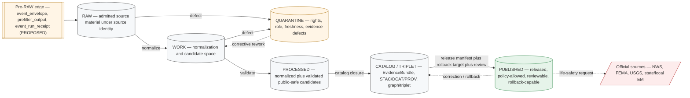

<!-- [KFM_META_BLOCK_V2]
doc_id: kfm://doc/docs-domains-hazards-data-lifecycle
title: Hazards Domain — Data Lifecycle
type: standard
version: v2
status: draft
owners: <hazards-domain-stewards-TBD>, <governed-publication-authority-TBD>
created: 2026-05-17
updated: 2026-06-05
policy_label: public
contract_version: "3.0.0"
related:
  - ai-build-operating-contract.md
  - directory-rules.md
  - docs/doctrine/lifecycle-law.md
  - docs/doctrine/trust-membrane.md
  - docs/domains/hazards/README.md
  - docs/domains/hydrology/DATA_LIFECYCLE.md
  - docs/domains/atmosphere/DATA_LIFECYCLE.md
  - docs/standards/PROV.md
  - docs/standards/PMTILES.md
  - kfm://register/domain-lane/hazards
tags: [kfm, domain, hazards, lifecycle, data, governance, life-safety-boundary]
notes:
  - CONTRACT_VERSION pinned at 3.0.0 per ai-build-operating-contract.md v3.0.
  - PROPOSED implementation throughout; CONFIRMED doctrine only where labeled.
  - Domain-segment lane tree under existing responsibility roots is CONFIRMED by Directory Rules §12; specific file presence is NEEDS VERIFICATION.
  - Owners and CI/badge endpoints are placeholders pending mounted-repo confirmation.
  - v2 corrects the receipt-phase matrix (RedactionReceipt/AggregationReceipt/ModelRunReceipt PUBLISHED dots) per Atlas v1.1 §24.2.2.
[/KFM_META_BLOCK_V2] -->

# Hazards Domain — Data Lifecycle

> How the KFM lifecycle invariant **RAW → WORK / QUARANTINE → PROCESSED → CATALOG / TRIPLET → PUBLISHED**
> applies to the Hazards domain, with the source-role, freshness, and life-safety boundaries that make
> hazard material safe to publish as **planning context, not as alerting**.

<!-- Badge row — placeholders until CI endpoints land. Per KFM presentation standard: >=3 badges. -->


**Status:** draft · **Owners:** `<hazards-domain-stewards-TBD>` · `<governed-publication-authority-TBD>` · **Contract:** `CONTRACT_VERSION = "3.0.0"` · **Last updated:** 2026-06-05

> [!CAUTION]
> **KFM is not an emergency alert system.** Hazards lifecycle outputs are historical, regulatory,
> observational, modeled, and resilience-context evidence. Operational warning material is carried
> only as **freshness-bounded context** with an explicit pointer to the official source. Life-safety
> action **must** redirect to NWS, FEMA, USGS, state, and local emergency authorities.
> See [§2 Mission & Boundary](#2-mission--boundary) and [§7 Operational Context Freshness Rules](#7-operational-context-freshness-rules). *(CONFIRMED doctrine — DOM-HAZ; ENCY; Atlas v1.1 §24.9.2.)*

---

## Table of Contents

1. [Purpose & Audience](#1-purpose--audience)
2. [Mission & Boundary](#2-mission--boundary)
3. [Doctrinal Basis](#3-doctrinal-basis)
4. [The Lifecycle Invariant](#4-the-lifecycle-invariant)
5. [Source Families & Source Roles](#5-source-families--source-roles)
6. [Per-Stage Handling](#6-per-stage-handling)
7. [Operational Context Freshness Rules](#7-operational-context-freshness-rules)
8. [Source-Role Anti-Collapse](#8-source-role-anti-collapse)
9. [Receipts ↔ Lifecycle Phase Matrix](#9-receipts--lifecycle-phase-matrix)
10. [Promotion Gates (Hazards Profile)](#10-promotion-gates-hazards-profile)
11. [Trust Membrane & Public Surfaces](#11-trust-membrane--public-surfaces)
12. [Cross-Lane Relations](#12-cross-lane-relations)
13. [Correction, Rollback & Stale State](#13-correction-rollback--stale-state)
14. [Validators, Tests & Fixtures](#14-validators-tests--fixtures)
15. [Directory & Path Map](#15-directory--path-map)
16. [Open Questions Register](#16-open-questions-register)
17. [Verification Backlog](#17-verification-backlog)
18. [Changelog](#18-changelog)
19. [Definition of Done](#19-definition-of-done)
20. [Related Docs](#20-related-docs)
21. [Appendix](#21-appendix)

---

## 1. Purpose & Audience

This document explains, for the **Hazards domain only**, how KFM's universal lifecycle invariant is
applied — what each phase means for hazard material, what evidence and receipts each gate requires,
which source roles are admitted, and what the Hazards lane must never become.

It is intended for:

- **Domain stewards** approving promotions, freshness states, and corrections for hazards layers.
- **Pipeline authors** wiring connectors, normalizers, and validators under `pipelines/domains/hazards/`.
- **Reviewers** evaluating release candidates whose claims touch hazards.
- **Policy authors** writing rules under `policy/domains/hazards/`.
- **Map / UI / AI engineers** binding hazards outputs to governed surfaces.

This file **explains** hazards lifecycle behavior; it does not **decide** it. Authoritative
machinery lives in `schemas/contracts/v1/domains/hazards/` *(canonical schema home per ADR-0001;
specific file presence NEEDS VERIFICATION)*, in `policy/domains/hazards/`, and in `control_plane/`
registers.

[↩ Back to top](#table-of-contents)

---

## 2. Mission & Boundary

> [!IMPORTANT]
> **CONFIRMED doctrine / PROPOSED implementation.** The Hazards lane governs historical, regulatory,
> modeled, and operational-context hazard material for **analysis and resilience**. It refuses to act
> as a life-safety alerting system and redirects life-safety action to official sources.
> *(DOM-HAZ §B; ENCY §7.10; Atlas v1.1 §12.B, §24.9.2.)*

### 2.1 In scope

Historical events, severe weather, flood, wildfire, smoke, drought, earthquake, heat/cold,
hail/wind/tornado, disaster declarations, warnings and advisories **as context only**, exposure
and resilience summaries, hazard timelines, and the not-for-life-safety **official-link mode**.
*(CONFIRMED doctrine — DOM-HAZ §B; ENCY §7.10.)*

### 2.2 Explicitly out of scope

> [!CAUTION]
> The right-hand column is **fail-closed** behavior, not advisory. Each row maps to a CONFIRMED DENY
> condition in the master anti-collapse and trust-membrane registers (Atlas v1.1 §§24.1.2, 24.9.2).

| Out-of-scope use | Why | Required response |
|---|---|---|
| Issuing alerts or warnings | KFM has not assumed operational SLAs or legal authority *(CONFIRMED — Atlas v1.1 §24.9.2 "KFM used as alert / instruction authority")* | Redirect to official source; record `not_emergency_alert_system` in envelope |
| Regulatory determinations (e.g., declaring a flood zone) | KFM cites regulatory layers as **context**, not as the issuing authority | Cite issuing body; carry source-role = `regulatory` |
| Life-safety instructions or action guidance | Out-of-scope use of governed evidence as life-safety guidance is a **DENY** anti-pattern *(CONFIRMED — Atlas v1.1 §24.9.2)* | DENY at governed API; route user to NWS/FEMA/state/local |
| Real-time, low-latency alert delivery | No operational SLA exists | ABSTAIN/DENY; surface freshness state |

[↩ Back to top](#table-of-contents)

---

## 3. Doctrinal Basis

This document does not invent doctrine; it specializes existing KFM doctrine for hazards.

| Authority | What it provides | Status |
|---|---|---|
| `ai-build-operating-contract.md` v3.0 (`CONTRACT_VERSION = "3.0.0"`) | Operating law, truth labels, evidence rule, receipt discipline | CONFIRMED |
| Directory Rules (`directory-rules.md` v1.3) | Lifecycle phase rule, **Domain Placement Law (§12)**, drift prevention (§13), responsibility-root protocol | CONFIRMED |
| `docs/doctrine/lifecycle-law.md` *(PROPOSED path)* | Universal RAW → PUBLISHED invariant; promotion as a governed state transition | CONFIRMED doctrine; path PROPOSED |
| KFM Encyclopedia §7.10 (Hazards) | Mission/boundary, source families, object families, viewing products, knowledge systems | CONFIRMED doctrine; PROPOSED implementation |
| Domains Culmination Atlas v1.1 §12 + Chapter 24 (§§24.1, 24.2, 24.3, 24.6, 24.9) | Source-role anti-collapse, receipt↔phase mapping, decision outcomes, master gates, anti-patterns | CONFIRMED doctrine |
| Unified Implementation Architecture Build Manual §§6.1–6.2, 10.10 | Canonical lifecycle semantics; promotion gates A–G; Hazards lane scope, risks, public posture | CONFIRMED doctrine; PROPOSED implementation |
| Pass 20 Idea Index — hazards-as-context, knowledge-character separation, source-role discipline | Lane-specific design pressure | CONFIRMED reference |

> [!NOTE]
> Where this document and any later mounted-repo evidence disagree, the repo wins for implementation
> claims; doctrine remains governed by the listed authorities until an ADR amends them. Any
> divergence becomes a drift entry per Directory Rules §13 and `docs/registers/DRIFT_REGISTER.md`.

[↩ Back to top](#table-of-contents)

---

## 4. The Lifecycle Invariant



**Invariant rule** *(CONFIRMED — Directory Rules §0 lifecycle invariant + §12; Atlas v1.1 §24.9):* promotion between
phases is a **governed state transition**, not a file move. A path-level move that bypasses validators,
policy gates, evidence-bundle creation, catalog closure, and release-decision recording is a
violation of the invariant regardless of which directory the bytes ended up in.

**Hazards specialization** *(CONFIRMED doctrine / PROPOSED execution — DOM-HAZ; ENCY §7.10):*
hazard pipelines must keep historical events, operational warnings, regulatory areas, observations,
detections, and modeled derivatives **distinct** through source-role taxonomy and freshness gates.

[↩ Back to top](#table-of-contents)

---

## 5. Source Families & Source Roles

> [!IMPORTANT]
> **CONFIRMED cross-domain rule** *(Atlas v1.1 §24.1.1 reading note; DOM-HAZ):* source role is set at admission
> and **never** upgraded by promotion. A modeled smoke trajectory does not become an observation;
> a regulatory flood zone does not become an observed flood event; an operational warning is **not**
> a life-safety authority inside KFM.

### 5.1 Family table (hazards)

> [!NOTE]
> Source families and their `authority / observation / context / model` role profiles are CONFIRMED
> in the Atlas Hazards dossier (§12.D); per-source **rights and current terms are NEEDS VERIFICATION**
> and `sensitive joins fail closed` *(DOM-HAZ §12.D)*.

| Source family (DOM-HAZ §12.D) | Allowed source roles | Rights / sensitivity | Freshness profile | Status |
|---|---|---|---|---|
| **NOAA Storm Events / NCEI-style records** | `observed` (historical event), `aggregate` (counts/normals) | Public; rights and current terms **NEEDS VERIFICATION** | Source-vintage; periodic re-issue | PROPOSED implementation |
| **NWS API — alerts / warnings / advisories / watches** | `context` operational only (never `regulatory`/`observed` authority inside KFM) | Public; **not for life safety** inside KFM | Issue → expiry; high-cadence | PROPOSED; **operational gating mandatory** |
| **FEMA Disaster Declarations / OpenFEMA** | `administrative` (declaration record) | Public; current terms NEEDS VERIFICATION | Periodic; per-event | PROPOSED implementation |
| **FEMA NFHL / MSC flood hazard layers** | `regulatory` (flood-zone designation) | Public; **regulatory ≠ observed inundation** | Per-effective-date version | PROPOSED implementation |
| **USGS Earthquake Catalog** | `observed` (event), `aggregate` where summarized | Public; current terms NEEDS VERIFICATION | Continuous + revision windows | PROPOSED implementation |
| **USGS Water Data** *(cross-lane to Hydrology)* | `observed` | Public; cross-lane source-role discipline | Continuous | PROPOSED implementation |
| **NOAA HMS Fire & Smoke** | `modeled` (analysis), `observed` (where it cites direct detection) | Public; product-version-specific | Daily / event-driven | PROPOSED implementation |
| **NASA FIRMS active fire** | `observed` (remote-sensing detection — treat as `candidate` until reviewed) | Public; rights and current terms NEEDS VERIFICATION | Near-real-time | PROPOSED implementation |
| **Drought monitors (USDM / state)** | `aggregate` / `modeled` | Public; weekly cadence | Weekly composite | PROPOSED implementation |
| **State / local emergency management & resilience plans** | `administrative` / `context` | Mixed; per-source review | Plan-cycle | PROPOSED implementation |

> [!WARNING]
> **Remote-sensing anomalies are not confirmations.** Active-fire detections, smoke products, and
> similar feeds enter Hazards as **`candidate`** material and must be steward-reviewed before being
> cited as `observed` events. *(CONFIRMED cross-domain rule — Atlas v1.1 §24.1.1 candidate role; DOM-HAZ §12.D.)*

### 5.2 Allowed source-role classes (KFM master register)

> CONFIRMED — Atlas v1.1 §24.1.1. The seven roles below are the canonical, fixed-at-admission set. The
> "promotion rule" column restates the §24.1.1 reading note: promotion never upgrades a role.

| Role | Definition | Hazards example | Promotion rule |
|---|---|---|---|
| `observed` | Direct reading or first-hand evidentiary record tied to place + time | USGS earthquake event; storm-event observation | Never relabeled as `regulatory` or `administrative` |
| `regulatory` | Authoritative determination with legal/administrative force | NFHL flood-zone designation | Never labeled an `observed` event or `modeled` estimate |
| `modeled` | Derived product with inputs, assumptions, and uncertainty | HMS smoke trajectory; drought composite | Always carries `ModelRunReceipt`; never labeled an observation |
| `aggregate` | Published summary/total over a unit | Decadal severe-weather counts by county | Carries `AggregationReceipt`; never treated as a per-place record |
| `administrative` | Compiled agency record (not observation, not regulation) | FEMA declaration index | Never collapsed with `observed` or `regulatory` |
| `candidate` | Awaiting validation / dedup / steward review | FIRMS detection prior to review | **No** `PUBLISHED` edge until promoted |
| `synthetic` | Simulated / reconstructed / AI-generated | Reconstructed historical impact scene | Carries `RealityBoundaryNote` + `RepresentationReceipt`; never queried as observed reality |

[↩ Back to top](#table-of-contents)

---

## 6. Per-Stage Handling

Each subsection states **handling** (what happens), **gate** (what must hold to promote), and a
**fail-closed outcome** (what happens if it does not).

### 6.1 Pre-RAW (admission edge)

> [!NOTE]
> *(PROPOSED — BLD-GREEN; Atlas v1.1 §24.9 watcher-as-non-publisher invariant.)* Pre-RAW exists to govern
> automated probes, watchers, GitOps PR emission, live feeds, source refreshes, and model-assisted
> candidates **before** material is admitted into RAW. Watchers must not publish; watchers must not skip review.

| Aspect | Hazards behavior |
|---|---|
| Triggers | `event_envelope` from a watcher, scheduled probe, or GitOps PR opening |
| Required artifacts | `event_envelope`, `prefilter_output`, `event_run_receipt` (all PROPOSED) |
| Decisions | Admit-to-RAW, Hold, Reject; **never** publish |
| Failure-closed outcome | No admission; logged as candidate awaiting steward |

### 6.2 RAW — admit immutable source under source identity

| Aspect | Hazards behavior |
|---|---|
| Handling | Capture immutable source payload **or** reference with source role, rights, sensitivity, citation, time, and content hash *(CONFIRMED — Atlas v1.1 §12.H; IMPL-MANUAL §6.1)* |
| Required artifacts | `SourceDescriptor` (canonical), payload hash or reference, optional `event_run_receipt` |
| Gate (RAW exists when…) | `SourceDescriptor` exists with `source_role`, `role_authority`, rights state, sensitivity state, retrieval time |
| Promotion direction | RAW → WORK on normalization start; RAW → QUARANTINE on admission defect |
| Failure-closed outcome | Source not admitted; logged as candidate awaiting steward *(Atlas v1.1 §24.6)* |

### 6.3 WORK — normalization & candidate space

| Aspect | Hazards behavior |
|---|---|
| Handling | Normalize schema, geometry, time, identity, evidence, rights, and policy fields. Keep `source`, `observed`, `valid`, `retrieval`, `release`, and `correction` times distinct where material *(CONFIRMED — Atlas v1.1 §12.E temporal handling)* |
| Required artifacts | `TransformReceipt`; working `ValidationReport`; `PolicyDecision` for any sensitivity flag |
| Gate (WORK → PROCESSED) | Schema/geometry/time/identity/evidence/rights/policy validators run deterministically; required receipts present |
| Failure-closed outcome | Stay in WORK with structured FAIL; or route to QUARANTINE on defect |

### 6.4 QUARANTINE — governed holding state

> [!WARNING]
> Quarantine is **not** silence. Hazards material in QUARANTINE carries an explicit **reason code**
> and never reaches a `PUBLISHED` edge until the defect is resolved. *(CONFIRMED — Atlas v1.1 §24.6.)*

| Quarantine reason *(PROPOSED catalog — extends Atlas v1.1 §24.6)* | Typical hazards trigger |
|---|---|
| `RIGHTS_UNKNOWN` | Source terms unverified; license change |
| `SENSITIVITY_UNRESOLVED` | Cross-lane sensitive geometry (e.g., critical infrastructure exposure) |
| `ROLE_COLLAPSE` | Source attempts to register `regulatory` claim as `observed` event |
| `ROLE_DOWNCAST_FORBIDDEN` | Attempt to relabel a candidate as observed without review |
| `FRESHNESS_EXPIRED` *(PROPOSED hazards-specific)* | NWS warning past `expiry`; cannot appear as current warning state *(CONFIRMED doctrine — DOM-HAZ §12.I)* |
| `SCHEMA_MISMATCH` / `CONTRACT_DRIFT` | Normalizer cannot resolve geometry/time fields |
| `MISSING_EVIDENCE` / `MISSING_RECEIPT` | EvidenceRef does not resolve; required receipt absent |

### 6.5 PROCESSED — validated normalized objects + public-safe candidates

| Aspect | Hazards behavior |
|---|---|
| Handling | Emit normalized `HazardEvent`, `HazardObservation`, `WarningContext`, `AdvisoryContext`, `DisasterDeclaration`, `FloodContext`, `WildfireDetection`, `SmokeContext`, `DroughtIndicator`, `EarthquakeEvent`, `HeatColdEvent`, `ExposureSummary`, `ResilienceSummary`, `HazardTimeline`, `ImpactArea` *(CONFIRMED object families — DOM-HAZ §12.B, §12.E; ENCY §7.10)* |
| Required artifacts | `EvidenceRef` (resolvable), `ValidationReport` (pass), `TransformReceipt`, digest closure |
| Gate (PROCESSED → CATALOG) | EvidenceRefs resolve; catalog matrix and digests close *(CONFIRMED — Atlas v1.1 §24.6)* |
| Failure-closed outcome | HOLD at PROCESSED; no public edge |

### 6.6 CATALOG / TRIPLET — claim, layer, graph, provenance

| Aspect | Hazards behavior |
|---|---|
| Handling | Emit catalog records (KFM STAC profile, DCAT, PROV), `EvidenceBundle`, optional graph/triplet projections, and release candidates |
| Required artifacts | `CatalogMatrix` entry; `EvidenceBundle`; graph/triplet projections if applicable; `LayerManifest` for any prospective public surface |
| Gate (CATALOG → PUBLISHED) | Review state where required; release authority distinct from author when materiality applies; `ReleaseManifest`; rollback target; correction path |
| Failure-closed outcome | HOLD at CATALOG; no public surface change |

### 6.7 PUBLISHED — released, policy-allowed, reviewable, rollback-capable

| Aspect | Hazards behavior |
|---|---|
| Handling | Serve released public-safe artifacts through governed APIs and manifests **only**. Operational warning context carries `issue_time`, `expiry_time`, `source`, `retrieval_time`, `freshness_state`, and `official_source_link` *(CONFIRMED — DOM-HAZ §12.I; IMPL-MANUAL §10.10)* |
| Required artifacts | `ReleaseManifest`; rollback target; correction path; `ReviewRecord` where required; `EvidenceBundle` resolvable from each claim |
| Public surfaces | Hazards feature/detail resolver, Hazards LayerManifest resolver, Hazards Evidence Drawer payload, Hazards Focus Mode answer — each PROPOSED; route names UNKNOWN *(Atlas v1.1 §12.J)* |
| Withdrawal | Correction (`CorrectionNotice`) or rollback (`RollbackCard`); see [§13](#13-correction-rollback--stale-state) |

[↩ Back to top](#table-of-contents)

---

## 7. Operational Context Freshness Rules

> [!CAUTION]
> **CONFIRMED doctrine** *(DOM-HAZ §12.I; IMPL-MANUAL §10.10; ENCY):* operational warning products are
> **contextual only and not for life safety**; unknown source roles are quarantined; **expired
> operational context cannot appear as current warning state**.

### 7.1 Required fields on every operational hazard claim

Each `WarningContext` / `AdvisoryContext` artifact, on every surface where it appears, must carry:

| Field | Purpose | Source |
|---|---|---|
| `issue_time` | When the issuing authority published the message | Source feed |
| `expiry_time` | When the message becomes stale by the issuing authority's rules | Source feed; if absent, see fallback below |
| `source` | Source identity (e.g., NWS office) | `SourceDescriptor` |
| `retrieval_time` | When KFM retrieved the message | Connector receipt |
| `freshness_state` | One of `current` / `stale` / `expired` / `unknown` *(PROPOSED enum)* | Computed at render |
| `official_source_link` | Direct deep link to the official source | `SourceDescriptor.role_authority` |
| `not_emergency_alert_system` | Boolean banner flag *(PROPOSED)* | Hazards envelope |

### 7.2 Freshness state computation (PROPOSED)

```text
if now > expiry_time          -> freshness_state = "expired"   -> DENY current-warning render; allow historical-context render
if expiry_time - now < grace  -> freshness_state = "stale"     -> ABSTAIN on Focus Mode; allow context with banner
if expiry_time absent         -> freshness_state = "unknown"   -> QUARANTINE until issuing authority's rule recorded in SourceDescriptor
else                          -> freshness_state = "current"   -> permit context render with mandatory banner + official link
```

`grace` is a per-source policy parameter and must live under `policy/domains/hazards/` *(CONFIRMED that
thresholds are policy, not universal science; specific file presence NEEDS VERIFICATION)*.

### 7.3 Anti-collapse: warning ↔ event

> [!WARNING]
> A `WarningContext` is **not** an observed `HazardEvent`. The lifecycle must keep them in separate
> normalization tracks; collapsing them is a documented **DENY anti-pattern** at publication and an
> **ABSTAIN** at any AI surface. *(CONFIRMED — Atlas v1.1 §24.1.2 "Regulatory zone labeled as an observed flood / event"; §24.9.2.)*

[↩ Back to top](#table-of-contents)

---

## 8. Source-Role Anti-Collapse

The Hazards lane is one of three lanes (with Air and Hydrology) where regulatory ↔ observed ↔
modeled collapses are most consequential. The following are CONFIRMED DENY conditions from Atlas v1.1
§24.1.2; the hazards-specific guardrail is in the right column.

| Collapse pattern | Hazards trigger | Required guardrail | Outcome |
|---|---|---|---|
| **Regulatory zone labeled as observed event** | NFHL polygon cited as an observed flood | Separate regulatory-layer and observed-event lanes; UI banner *(Atlas v1.1 §24.1.2)* | DENY publication; ABSTAIN at AI |
| **Modeled product labeled as observed** | HMS smoke trajectory cited as observed plume location | `ModelRunReceipt` + uncertainty surface + role-preserving DTO field | DENY publication; ABSTAIN at AI |
| **Aggregate cited as per-place truth** | County severe-weather counts cited as a specific event | `AggregationReceipt`; geometry-scope guard | DENY join; ABSTAIN at AI |
| **Administrative compilation cited as observed event timeline** | FEMA declaration list rendered as a hazard event timeline | Named `DisasterDeclaration` type; preserve role tag | DENY publication |
| **Candidate exposed publicly** | FIRMS detection rendered on a public layer prior to review | Promotion gate; no PUBLISHED edge to WORK / QUARANTINE | DENY at trust membrane; route to QUARANTINE |
| **Operational warning treated as life-safety authority** | KFM surface used as the alert source | `not_emergency_alert_system` envelope flag; official-source redirect | DENY publication; redirect to NWS/FEMA |
| **Synthetic carrier presented as observed reality** | Reconstructed historical impact scene without note | `RealityBoundaryNote` + `RepresentationReceipt` + UI badge | DENY publication; HOLD for steward review |

Source-role enforcement is a **lifecycle invariant**, not a UI nicety: it fires at admission, at
validation, at catalog closure, and at release. *(CONFIRMED — Atlas v1.1 §§24.1, 24.6.)*

[↩ Back to top](#table-of-contents)

---

## 9. Receipts ↔ Lifecycle Phase Matrix

> CONFIRMED master mapping — Atlas v1.1 §24.2.2. A dot means the receipt is **normally emitted,
> amended, or referenced** at that phase. Receipts created earlier remain referenced (not
> duplicated) at later phases via `EvidenceRef`.

| Receipt | RAW | WORK / QUAR | PROCESSED | CATALOG / TRIPLET | PUBLISHED |
|---|:---:|:---:|:---:|:---:|:---:|
| `SourceDescriptor` | ● | ● | ● | ● | ● |
| `TransformReceipt` |   | ● | ● | ● |   |
| `RedactionReceipt` |   | ● | ● | ● | ● |
| `AggregationReceipt` |   | ● | ● | ● | ● |
| `ModelRunReceipt` |   | ● | ● | ● | ● |
| `RepresentationReceipt` |   |   | ● | ● | ● |
| `AIReceipt` |   |   |   | ● | ● *(Focus Mode only)* |
| `ReviewRecord` |   | ● | ● | ● | ● |
| `PolicyDecision` | ● | ● | ● | ● | ● |
| `ValidationReport` |   | ● | ● | ● |   |
| `ReleaseManifest` |   |   |   | ● | ● |
| `CorrectionNotice` |   |   |   | ● | ● |
| `RollbackCard` |   |   |   | ● | ● |
| `RealityBoundaryNote` |   |   | ● | ● | ● |

> [!NOTE]
> **v2 correction.** The v1 draft omitted PUBLISHED dots for `RedactionReceipt`, `AggregationReceipt`,
> and `ModelRunReceipt`, and showed no CATALOG dot for `AIReceipt`. This matrix now matches Atlas v1.1
> §24.2.2 exactly. The Atlas reading note explains the apparent persistence: a receipt referenced via
> `EvidenceRef` at PUBLISHED is not re-emitted — the dot marks where it is normally referenced.

**Hazards-specific note:** `WarningContext` and `AdvisoryContext` artifacts additionally bind a
`FreshnessReceipt` *(PROPOSED naming — not yet in the master Atlas §24.2 receipt catalog; see [OQ-HAZ-LC-06](#16-open-questions-register))* whose fields are listed in [§7.1](#71-required-fields-on-every-operational-hazard-claim).

[↩ Back to top](#table-of-contents)

---

## 10. Promotion Gates (Hazards Profile)

> CONFIRMED master gate reference — Atlas v1.1 §24.6 + IMPL-MANUAL §6.2 (Gates A–G). Hazards specialization
> added in the **Hazards-specific requirement** column. The IMPL-MANUAL gate letters (A Source identity,
> B Rights/terms, C Sensitivity, D Schema/contract, E Evidence closure, F Catalog/provenance,
> G Review/release/rollback) map onto the transitions below.

| Gate (transition) | Pre-condition | Required artifacts | Hazards-specific requirement | Failure-closed outcome |
|---|---|---|---|---|
| **Admission** (— → RAW) | Source identity + rights minimally established; source-role intent set | `SourceDescriptor`; payload/reference hash | Source-role recorded as one of the seven canonical classes; `not_for_life_safety` flag set on operational-feed descriptors | Not admitted; candidate awaiting steward |
| **Normalization** (RAW → WORK / QUARANTINE) | Schema/geometry/time/identity/evidence/rights/policy rules runnable | `TransformReceipt`; working `ValidationReport`; `PolicyDecision`; quarantine reason on failure | Temporal-role validator: `source`, `observed`, `valid`, `issue/expiry`, `retrieval`, `release` distinct where material | Quarantine with reason code |
| **Validation** (WORK → PROCESSED) | Validators deterministic; required receipts present | `ValidationReport` pass; `RedactionReceipt` if sensitivity; `AggregationReceipt` if aggregate | Source-role anti-collapse tests; freshness-state validator; operational-expiry test | Stay in WORK; structured FAIL |
| **Catalog closure** (PROCESSED → CATALOG / TRIPLET) | `EvidenceRef`s resolve; catalog matrix and digests close | `CatalogMatrix` entry; `EvidenceBundle`; graph/triplet projections if applicable | Evidence Drawer disclaimer payload present for any operational-context layer | HOLD at PROCESSED; no public edge |
| **Release** (CATALOG / TRIPLET → PUBLISHED) | Review state where required; release authority distinct from author when materiality applies | `ReleaseManifest`; rollback target; correction path; `ReviewRecord` | `not_emergency_alert_system` envelope flag; `official_source_link` present on operational-context surfaces; UI no-direct-source test passes | HOLD at CATALOG |
| **Correction** (PUBLISHED → PUBLISHED′) | Detected error or new evidence; downstream derivatives identified | `CorrectionNotice`; `ReviewRecord`; invalidation list; `ReleaseManifest` update or supersession | Stale-warning denial: corrected operational context never re-emerges as current | Stale-state announcement; no silent edit |
| **Rollback** (PUBLISHED → prior release) | Failed release or post-publication failure; prior release identified | `RollbackCard`; `CorrectionNotice`; derivative invalidation; manifest reverts | Rollback drill exercised before any operational-context layer first publishes | Held at current state until rollback validated |

### 10.1 Universal closure rule (CONFIRMED — Atlas v1.1 §24.6; IMPL-MANUAL Gate E)

A transition is **closed** only when:

1. The required artifacts above exist.
2. Every required artifact **resolves** (not just references) what it depends on — `EvidenceRef → EvidenceBundle`, `source_id → SourceDescriptor`, `model_id → ModelRunReceipt`.
3. The policy gate **evaluated and recorded** its decision.

Missing any of these means the transition fails closed and the prior state is preserved.

[↩ Back to top](#table-of-contents)

---

## 11. Trust Membrane & Public Surfaces

> [!IMPORTANT]
> **CONFIRMED doctrine** *(Atlas v1.1 §24.9.2; Directory Rules §0/§3 trust membrane):* no public client, no normal UI
> surface, and no released AI surface may reach RAW, WORK, QUARANTINE, canonical/internal stores,
> graph internals, vector indexes, source APIs, or direct model runtimes. The promotion gates above
> are the **only** routes to PUBLISHED, and PUBLISHED is the **only** state from which the governed
> API may emit `ANSWER`.

### 11.1 Hazards governed surfaces (PROPOSED routes; exact paths UNKNOWN)

| Surface | DTO / schema *(PROPOSED)* | Finite outcomes *(CONFIRMED set — Atlas v1.1 §24.3)* |
|---|---|---|
| Hazards feature / detail resolver | `HazardsDecisionEnvelope` | `ANSWER` / `ABSTAIN` / `DENY` / `ERROR` |
| Hazards layer manifest resolver | `LayerManifest` (hazards profile) | `ANSWER` / `DENY` / `ERROR` |
| Hazards Evidence Drawer payload | `EvidenceDrawerPayload` + `EvidenceBundle` projection | `ANSWER` / `ABSTAIN` / `DENY` / `ERROR` |
| Hazards Focus Mode answer | `RuntimeResponseEnvelope` + `AIReceipt` | `ANSWER` / `ABSTAIN` / `DENY` / `ERROR` |
| Schema responsibility root | `schemas/contracts/v1/domains/hazards/` | finite validator outcomes |

### 11.2 Governed AI behavior in this lane

> CONFIRMED doctrine / PROPOSED implementation *(GAI; DOM-HAZ §12.L):* AI may summarize
> released Hazards `EvidenceBundle`s, compare evidence, explain limitations, and draft
> steward-review notes. AI must `ABSTAIN` when evidence is insufficient and `DENY` where policy,
> rights, sensitivity, or release state blocks the request. AI **must not** answer with operational
> alert guidance — even when bounded evidence is available — without an explicit referral to the
> official source.

[↩ Back to top](#table-of-contents)

---

## 12. Cross-Lane Relations

Hazards joins to other lanes; **every join must preserve ownership, source role, sensitivity, and
`EvidenceBundle` support.** *(CONFIRMED — DOM-HAZ §12.F; ENCY.)*

| This lane | Related lane | Relation type | Hazards-side constraint |
|---|---|---|---|
| Hazards | Hydrology | flood / drought / water-event context with role separation | Regulatory flood layer never relabeled as observed water event |
| Hazards | Atmosphere / Air | smoke, heat / cold, AQI / advisory, wind, fire-weather context | Knowledge-character labels preserved; observed vs regulatory vs modeled never merged |
| Hazards | Settlements / Infrastructure | exposure, lifelines, dependencies | Critical-infrastructure precision deny-default applies *(Atlas v1.1 §20.5 deny register)* |
| Hazards | Roads / Rail | closures, detours, bridge / crossing exposure, resilience | Network identity governed by Roads lane; Hazards cites exposure only |

Cross-domain validators and shared geometry / time normalizers live under the **lowest common
responsibility root** without a domain segment, e.g., `tools/validators/<topic>/` *(CONFIRMED rule — Directory Rules §12 "Multi-domain and cross-cutting files")*.

[↩ Back to top](#table-of-contents)

---

## 13. Correction, Rollback & Stale State

| Scenario | Required artifacts | Visible effect |
|---|---|---|
| Released hazard claim found to be wrong | `CorrectionNotice` + `ReviewRecord` + invalidation list + `ReleaseManifest` update or supersession | Stale-state announcement on all surfaces that referenced the claim; downstream derivatives invalidated |
| Failed release or post-publication systemic failure | `RollbackCard` + `CorrectionNotice` + manifest reverts to prior release | Public surface reverts; rollback receipt audited |
| Operational warning lapses | Automatic freshness transition to `stale` or `expired` | UI banner; AI surfaces shift to `ABSTAIN`; no re-promotion to `current` |
| Source rights or terms change | Steward review → tier reassignment or denial | Layer may demote to QUARANTINE or be redacted via `RedactionReceipt` |

> [!NOTE]
> **Tier downgrade asymmetry** *(CONFIRMED — Atlas v1.1 §7):* moving toward **less** public exposure
> requires only a correction notice and review record; moving toward **more** public exposure
> requires a transform receipt **and** a review record. Hazards corrections that demote claims do
> not need the full promotion chain.

[↩ Back to top](#table-of-contents)

---

## 14. Validators, Tests & Fixtures

PROPOSED *(per DOM-HAZ §12.K; Atlas v1.1 §12.K)*. Each item maps to a deterministic validator under
`tools/validators/...` and to fixtures under `fixtures/domains/hazards/`. The seven validator
families below are CONFIRMED as named test intents in the Hazards dossier *(DOM-HAZ §12.K)*; their
implementation is NEEDS VERIFICATION.

| Validator / test | What it proves | Negative fixture example |
|---|---|---|
| Source-role anti-collapse | A claim's `source_role` is consistent with its citation type and is not upgraded across promotion | Regulatory polygon cited as observed event → DENY |
| Temporal-role validator | `source`, `observed`, `valid`, `issue/expiry`, `retrieval`, `release` times are distinct and consistent | Expiry < issue → QUARANTINE |
| Emergency-alert denial | KFM surface cannot be invoked as the alert source | Focus Mode prompt asks for life-safety guidance → DENY + referral |
| Operational expiry / freshness | Expired operational context cannot render as current warning state | `now > expiry_time` with `freshness_state = "current"` → DENY |
| Catalog closure | `EvidenceRef`s resolve, manifests close, digests verify | Orphan `EvidenceRef` → HOLD |
| Evidence Drawer disclaimer | Hazards operational-context payloads carry `not_emergency_alert_system` + `official_source_link` | Missing flag → DENY at release |
| UI no-direct-source | No public client reads RAW/WORK/QUARANTINE, canonical stores, or direct model endpoints | Public client wired to a canonical store → trust-membrane failure |

> [!TIP]
> **PROPOSED first proof slice:** historical flood / severe-weather event fixture + NFHL regulatory
> context + exposure summary, **with warning feeds disabled or contextual-only**. *(CONFIRMED
> recommendation — ENCY §7.10 "First credible thin slice"; aligns with IMPL-MANUAL Phase 5/10 staging.)*

[↩ Back to top](#table-of-contents)

---

## 15. Directory & Path Map

> [!IMPORTANT]
> **The domain-segment lane tree below is CONFIRMED by Directory Rules §12** (Domain Placement Law),
> which names `hazards` explicitly and prescribes this exact lane pattern. What remains **NEEDS
> VERIFICATION** is the *presence of specific files* once the repo is mounted — not the placement
> convention itself. The `docs/domains/hazards/` segment, the `schemas/contracts/v1/domains/hazards/`
> home (per ADR-0001), and the `data/...hazards/` lanes are all CONFIRMED-by-rule.

```text
docs/domains/hazards/
├── README.md                    # CONFIRMED placement; file presence NEEDS VERIFICATION
├── DATA_LIFECYCLE.md            # this file
├── SOURCES.md                   # PROPOSED — source family catalog
├── SOURCE_ROLES.md              # PROPOSED — source-role registry profile
├── OBJECT_FAMILIES.md           # PROPOSED — HazardEvent, WarningContext, …
└── PUBLICATION_AND_BOUNDARY.md  # PROPOSED — life-safety boundary doc

contracts/domains/hazards/                       # semantic Markdown for object meaning (CONFIRMED placement per §12)
schemas/contracts/v1/domains/hazards/            # canonical machine schemas (CONFIRMED home per ADR-0001 + §12)
policy/domains/hazards/                          # admissibility, freshness, life-safety policy bundles (CONFIRMED placement per §12)
tests/domains/hazards/                           # validator/test proof (CONFIRMED placement per §12)
fixtures/domains/hazards/                        # golden / invalid fixtures (CONFIRMED placement per §12)
pipelines/domains/hazards/                       # executable pipeline logic (CONFIRMED placement per §12)
pipeline_specs/hazards/                          # declarative pipeline config (CONFIRMED placement per §12)

data/raw/hazards/<source_id>/<run_id>/           # admitted source material under source identity
data/work/hazards/<run_id>/                      # transformation / candidate space
data/quarantine/hazards/<reason>/<run_id>/       # rights / role / freshness / evidence defects
data/processed/hazards/<dataset_id>/<version>/   # normalized validated outputs
data/catalog/domain/hazards/                     # STAC / DCAT / PROV per KFM profiles
data/triplets/<graph_or_export>/                 # graph projections (shared root; not per-domain)
data/published/layers/hazards/                   # released public-safe layer artifacts
data/receipts/{ingest,validation,pipeline,ai,release}/   # alongside lifecycle, not replacing
data/proofs/{evidence_bundle,proof_pack,validation_report,citation_validation}/
data/rollback/hazards/<release_id>/
data/registry/sources/hazards/                   # SourceDescriptor entries

release/candidates/hazards/                      # release decisions (distinct from data/published/)
```

> [!WARNING]
> **Anti-pattern guardrail** *(CONFIRMED — Directory Rules §13.4):* Hazards must **not** become a root
> folder (`hazards/` with its own `data/`, `schemas/`, `policy/`, `docs/`). Files belong under the
> responsibility roots above with `hazards` as a segment. The fix for any such drift is to apply
> Domain Placement Law (§12) and migrate piece by piece.

[↩ Back to top](#table-of-contents)

---

## 16. Open Questions Register

| ID | Question | Owner role | Resolution path |
|---|---|---|---|
| OQ-HAZ-LC-01 | Is `FreshnessReceipt` a hazards-local receipt or a shared-kernel addition to the master Atlas §24.2 receipt catalog? | Docs steward + schema owner | ADR / Directory Rules §2.4 check |
| OQ-HAZ-LC-02 | Should `FRESHNESS_EXPIRED` be adopted into the master quarantine reason catalog, or stay hazards-local? | Hazards steward + governance authority | ADR or drift entry |
| OQ-HAZ-LC-03 | Grace-window policy authoring location: `policy/domains/hazards/` vs per-layer descriptor? | Policy author | ADR |
| OQ-HAZ-LC-04 | Does `not_emergency_alert_system` live on `HazardsDecisionEnvelope`, on every layer payload, or both? | Schema owner + UI engineer | Schema + UI binding review |
| OQ-HAZ-LC-05 | Cross-lane validator placement for Hazards ↔ Hydrology flood context (shared `tools/validators/<topic>/`)? | Docs steward | Directory Rules §12 cross-cutting rule + ADR-S-14 |

[↩ Back to top](#table-of-contents)

---

## 17. Verification Backlog

> These items remain `NEEDS VERIFICATION` before promotion from `draft` to `published`. They become
> release-blocking only in proportion to the surface they support. Track in
> `docs/registers/VERIFICATION_BACKLOG.md`.

| # | Item | Evidence that would settle it | Status |
|---|---|---|---|
| H-LC-01 | Confirm presence of the Hazards schema home `schemas/contracts/v1/domains/hazards/` (placement CONFIRMED by rule; file presence not) | Mounted repo inspection | NEEDS VERIFICATION |
| H-LC-02 | Confirm official source endpoints, current rights, and license terms for NOAA Storm Events, NWS API, FEMA OpenFEMA/NFHL, USGS earthquake catalog, NASA FIRMS, drought monitors | Source-descriptor entries; steward review records | NEEDS VERIFICATION |
| H-LC-03 | Implement role taxonomy + freshness states; bind to validators and policy bundles | Tests/fixtures; policy bundle | NEEDS VERIFICATION |
| H-LC-04 | Verify emergency-alert boundary enforcement on every public surface (UI, governed API, Focus Mode) | Trust-membrane acceptance test; release dry-run | NEEDS VERIFICATION |
| H-LC-05 | Verify rollback drill against a dry-run Hazards release before any operational-context layer first publishes | `RollbackCard` + receipt | NEEDS VERIFICATION |
| H-LC-06 | Confirm `FreshnessReceipt` naming + home decision (see OQ-HAZ-LC-01) | ADR | NEEDS VERIFICATION |
| H-LC-07 | Confirm `FRESHNESS_EXPIRED` reason-code adoption (see OQ-HAZ-LC-02) | ADR or drift entry | NEEDS VERIFICATION |

[↩ Back to top](#table-of-contents)

---

## 18. Changelog

| Change | Type (per contract §37) | Reason |
|---|---|---|
| Corrected receipt↔phase matrix: added PUBLISHED dots for `RedactionReceipt`, `AggregationReceipt`, `ModelRunReceipt`; added CATALOG dot for `AIReceipt` | reconciliation | v1 draft diverged from Atlas v1.1 §24.2.2 |
| Reclassified `docs/domains/hazards/` and the domain lane tree from PROPOSED to CONFIRMED-by-rule | clarification | Directory Rules §12 explicitly names `hazards` and prescribes the lane pattern |
| Pinned `CONTRACT_VERSION = "3.0.0"` in meta block, badge row, status line, and doctrinal basis | housekeeping | ai-build-operating-contract.md v3.0 requirement |
| Added Open Questions register, Verification backlog, Changelog, Definition of Done (doctrine companion sections) | gap closure | Doctrine-adjacent doc companion-section pattern |
| Replaced parenthetical-bearing Mermaid node labels with em-dash form | housekeeping | Prevent Mermaid parse failure on `(`/`·`/`/` in labels |
| Folded former §16 open-question rows into OQ/verification tables with stable IDs | clarification | Stable-ID tracking per KFM doctrine |

> **Backward compatibility.** Section anchors §1–§14 are preserved. Former §15 (Directory & Path Map)
> retains its anchor `#15-directory--path-map`. The former combined §16 "Verification Backlog & Open
> Questions" is split into §16 (Open Questions) and §17 (Verification Backlog); any inbound link to
> `#16-verification-backlog--open-questions` will break and should be repointed. Related Docs moves to
> §20 and Appendix to §21.

[↩ Back to top](#table-of-contents)

---

## 19. Definition of Done

This document is done enough to enter the repository when:

- it is placed at `docs/domains/hazards/DATA_LIFECYCLE.md` per Directory Rules §12;
- a docs steward and the hazards domain steward review it;
- it is linked from the Hazards lane README and a docs/doctrine index;
- it does not conflict with accepted ADRs (notably ADR-0001 schema home);
- any conflict with current repo conventions is logged in `docs/registers/DRIFT_REGISTER.md`;
- the `GENERATED_RECEIPT.json` planned in Section 2 is wired into CI with `human_review.state` transitioned past `pending`;
- future changes follow the operating contract's §37 lifecycle.

[↩ Back to top](#table-of-contents)

---

## 20. Related Docs

> Sibling-doc paths are PROPOSED unless verified; placement under `docs/domains/hazards/` is CONFIRMED
> by Directory Rules §12.

- [`ai-build-operating-contract.md`](../../../ai-build-operating-contract.md) — operating law; `CONTRACT_VERSION = "3.0.0"` *(CONFIRMED authority)*
- [`directory-rules.md`](../../../directory-rules.md) — placement, Domain Placement Law §12, drift §13 *(CONFIRMED authority)*
- [`docs/doctrine/lifecycle-law.md`](../../doctrine/lifecycle-law.md) — universal RAW → PUBLISHED invariant *(PROPOSED path)*
- [`docs/doctrine/trust-membrane.md`](../../doctrine/trust-membrane.md) — public surfaces, governed APIs, no-bypass rule *(PROPOSED path)*
- [`docs/domains/hazards/README.md`](./README.md) — Hazards lane orientation *(file presence NEEDS VERIFICATION)*
- [`docs/domains/hazards/SOURCES.md`](./SOURCES.md) — Hazards source family catalog *(PROPOSED)*
- [`docs/domains/hazards/PUBLICATION_AND_BOUNDARY.md`](./PUBLICATION_AND_BOUNDARY.md) — life-safety boundary, official-source referral *(PROPOSED)*
- [`docs/domains/hydrology/DATA_LIFECYCLE.md`](../hydrology/DATA_LIFECYCLE.md) — sibling lane; flood-context cross-lane partner *(PROPOSED path)*
- [`docs/domains/atmosphere/DATA_LIFECYCLE.md`](../atmosphere/DATA_LIFECYCLE.md) — sibling lane; smoke / heat / AQI cross-lane partner *(PROPOSED path)*
- [`docs/standards/PROV.md`](../../standards/PROV.md) — W3C PROV-O / PAV profile *(NEEDS VERIFICATION)*
- [`docs/standards/PMTILES.md`](../../standards/PMTILES.md) — PMTiles v3 governance *(NEEDS VERIFICATION)*
- ADR-0001 — schema-home rule *(referenced; CONFIRMED via Directory Rules §7.4 / §0 schema-home convention)*

---

## 21. Appendix

<details>
<summary><strong>A. Hazards object families (CONFIRMED list — DOM-HAZ §12.B, §12.E; ENCY §7.10)</strong></summary>

| Object | One-line role | Identity rule *(PROPOSED deterministic basis — Atlas v1.1 §12.E)* |
|---|---|---|
| `HazardEvent` | Observed or historical hazard event | source id + object role + temporal scope + normalized digest |
| `HazardObservation` | Direct hazard observation tied to place + time | as above |
| `WarningContext` | Operational warning carried as context only | as above; `issue/expiry/freshness` mandatory |
| `AdvisoryContext` | Operational advisory carried as context only | as above; `issue/expiry/freshness` mandatory |
| `DisasterDeclaration` | Administrative declaration record | as above |
| `FloodContext` | Cross-lane flood context (Hydrology partner) | as above |
| `WildfireDetection` | Remote-sensing or reported wildfire detection | candidate by default until reviewed |
| `SmokeContext` | Modeled smoke trajectory / mask | always carries `ModelRunReceipt` |
| `DroughtIndicator` | Aggregate / modeled drought indicator | always carries `AggregationReceipt` or `ModelRunReceipt` |
| `EarthquakeEvent` | Observed earthquake event | as above |
| `HeatColdEvent` | Heat or cold event | as above |
| `ExposureSummary` | Exposure overlay summary | derivative; cites `EvidenceBundle` |
| `ResilienceSummary` | Resilience summary | derivative; cites `EvidenceBundle` |
| `HazardTimeline` | Role-aware hazard timeline | derivative; carries source-role tags |
| `ImpactArea` | Impact-area geometry | derivative; preserves source role |

> Note: the Atlas spells two of these as single tokens — `SmokeContext` and `ImpactArea` — while
> rendering the rest as two-word display names (e.g., "Hazard Event"). KFM token casing is preserved
> as the Atlas uses it; field-realization is PROPOSED.

</details>

<details>
<summary><strong>B. Trust & evidence terms used in this document</strong></summary>

| Term | Meaning *(CONFIRMED — Atlas v1.1 §24.2; ENCY Appendix A; IMPL-MANUAL §7.1)* |
|---|---|
| `Inspectable claim` | Public or semi-public statement reconstructable to evidence, scope, source role, policy posture, review state, release state, correction lineage |
| `EvidenceRef` | Pointer from a claim/feature/answer/layer/proof item to evidence that must resolve before consequential release |
| `EvidenceBundle` | Resolved evidence package supporting a claim — source, scope, provenance, policy, citation, review context |
| `SourceDescriptor` | Machine-readable source identity, source role, rights, cadence, access, steward, sensitivity, release posture |
| `PolicyDecision` | Explicit allow/deny/restrict/abstain/error decision tied to user, purpose, release class, evidence, sensitivity |
| `DecisionEnvelope` | Finite decision wrapper used by APIs, runtime surfaces, and UI/AI payloads |
| `RuntimeResponseEnvelope` | Governed AI/API response wrapper carrying outcome, evidence context, citations, policy state, validation result |
| `RunReceipt` | Auditable record of intake, transform, validation, catalog, release, or rebuild action |
| `ReleaseManifest` | Released artifact set, digests, policy posture, rollback target |
| `CorrectionNotice` | Records that a published claim was corrected: what changed, why, what derivatives were invalidated |
| `RollbackCard` | Records a rollback decision and the targeted prior release |
| `RealityBoundaryNote` | Public-facing or steward-facing statement that a carrier is synthetic or reconstructed and not direct evidence |

</details>

<details>
<summary><strong>C. Finite outcome legend (CONFIRMED — Atlas v1.1 §24.3; Unified Doctrine Synthesis §11)</strong></summary>

| Outcome | Meaning |
|---|---|
| `ANSWER` | Evidence sufficient, policy permits, release + review state allow |
| `ABSTAIN` | Evidence insufficient/stale, or AI surface cannot cite |
| `DENY` | Policy, rights, sensitivity, or release state blocks the request |
| `ERROR` | Finite, actionable error; never a silent fall-through |
| `HOLD` | Promotion/release/correction paused pending review |
| `PASS` / `FAIL` | Validator-class outcomes (process-only; not a public answer) |

</details>

<details>
<summary><strong>D. Truth-label legend for this document</strong></summary>

| Label | Meaning in this doc |
|---|---|
| **CONFIRMED** | Verified this session from attached KFM doctrine (Directory Rules, ENCY, Atlas v1.1, IMPL-MANUAL, operating contract) |
| **PROPOSED** | Design, recommendation, file path, or implementation behavior not yet verified in a mounted repo |
| **INFERRED** | Reasonably derivable from visible evidence but not directly stated |
| **NEEDS VERIFICATION** | Checkable, but not yet checked strongly enough to act as fact |
| **UNKNOWN** | Not resolvable without more evidence |

</details>

---

### Footer

> **Related docs:** see [§20](#20-related-docs) · **Doctrine basis:** see [§3](#3-doctrinal-basis) · **Open questions:** see [§16](#16-open-questions-register) · **Verification backlog:** see [§17](#17-verification-backlog)

**Last updated:** 2026-06-05 · **Maintainers:** `<hazards-domain-stewards-TBD>`, `<governed-publication-authority-TBD>` · **Status:** draft · **Contract:** `CONTRACT_VERSION = "3.0.0"` · **Policy label:** public

[↩ Back to top](#table-of-contents)
