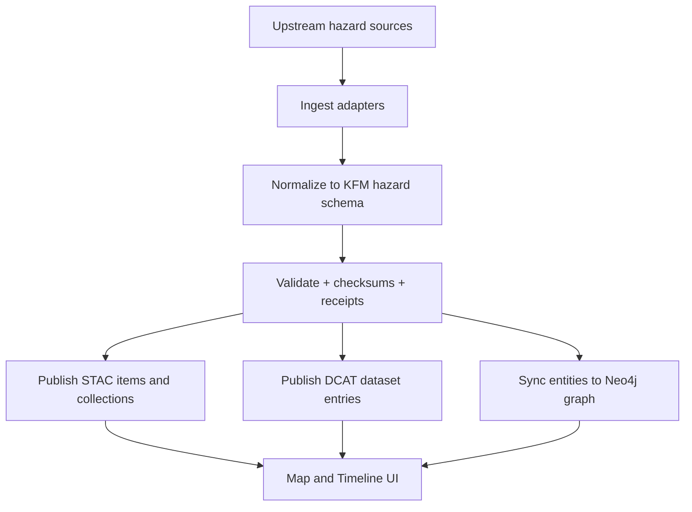

<!-- [KFM_META_BLOCK_V2]
doc_id: kfm://doc/8d11d9a6-8f52-4a2a-9c9f-8c6b1c6c7a3d
title: Hazards Data Sources
type: standard
version: v1
status: draft
owners: TBD (Hazards domain maintainers)
created: 2026-03-04
updated: 2026-03-04
policy_label: public
related: [
  "docs/domains/hazards/README.md",
  "src/pipelines/autonomous/hazards-refresh/README.md",
  "docs/guides/geo/vector-etl-pipelines.md"
]
tags: [kfm, hazards, data-sources, stac, dcat, prov]
notes: [
  "This file is a governed registry-style inventory of upstream hazard datasets used by KFM.",
  "Every dataset row carries an evidence label: CONFIRMED / PROPOSED / UNKNOWN."
]
[/KFM_META_BLOCK_V2] -->

# Hazards Data Sources
One place to track upstream datasets powering KFM’s hazards domain (events + alerts + context layers), including access patterns and governance gates.

---

## Impact
- **Status:** draft (ready for adoption; needs governance pinning of endpoints + licenses)
- **Owners:** **TBD** (Hazards domain maintainers)
- **Applies to:** `docs/domains/hazards/*` + `src/pipelines/autonomous/hazards-refresh/*`

**Badges (TODO):**
-   
-   
-   

**Jump to:** [Scope](#scope) · [Where it fits](#where-it-fits) · [Source registry](#source-registry) · [Access patterns](#access-patterns-and-normalization) · [Governance checklist](#governance-checklist) · [Appendix](#appendix)

---

## Scope
- **In scope:** Natural hazard *events* (tornado, hail, flood, wildfire, drought), *alerts/warnings*, *declarations*, and hazard-adjacent derived layers (e.g., inundation extents, smoke plumes).
- **Out of scope:** Long-term climate baselines, land cover, and general environmental monitoring unless explicitly used as a hazards *trigger* or *overlay*.

**Evidence labels**
- **CONFIRMED:** Supported by an existing KFM design/blueprint document and suitable to treat as canonical for planning.
- **PROPOSED:** Reasonable addition, but not yet pinned/approved in KFM governance.
- **UNKNOWN:** Mentioned conceptually, but key details (endpoint, license, cadence, schema) are not yet pinned.

---

## Where it fits
- **Pipeline:** `src/pipelines/autonomous/hazards-refresh` (Hazards Refresh, v11) ingests multiple hazard datasets, normalizes records, and registers outputs into KFM’s catalog/graph surfaces.  
- **Surfaces:** Output features are exposed via map/timeline UX (via STAC/DCAT metadata) and linked into the knowledge graph as hazard-event entities.

**KFM invariants (policy)**
- UI/clients **must not** read storage directly; access must cross governed APIs + policy boundary.
- Core logic **must not** bypass repository/adapters to reach storage.

[Back to top](#hazards-data-sources)

---

## Acceptable inputs
- Public or properly permissioned hazard datasets with:
  - documented provenance (publisher, retrieval time, checksum/etag if available)
  - clear spatial/temporal extents
  - explicit license or public-domain statement
  - stable identifiers (or a reproducible KFM-derived ID strategy)

## Exclusions
- Sensitive facility locations, private addresses, or any restricted critical-infrastructure geometry **unless**:
  - it is explicitly permitted,
  - labeled with sensitivity classification,
  - protected by policy gates before publication.

[Back to top](#hazards-data-sources)

---

## Source registry

> NOTE: The **Source Key** values below are intended to become stable identifiers in KFM’s source registry (e.g., `data/registry/...`). If a key already exists elsewhere, prefer the canonical registry key and update this file.

### Severe weather and storm events

| Source Key | Dataset / Publisher | Hazard types | Coverage | Temporal extent | Delivery / Access | Expected cadence | License | KFM lifecycle target | Evidence |
|---|---|---|---|---|---|---|---|---|---|
| `noaa_ncei_storm_events` | NOAA NCEI Storm Events Database (NOAA) | tornado, thunderstorm, hail, flood, drought, wildfire (event logs) | USA (filter to KS) | 1950–present | Bulk CSV (state/year) via NOAA tooling | Monthly | Public domain (as documented) | RAW → PROCESSED → PUBLISHED | **CONFIRMED** |
| `noaa_spc_severe_gis` | NOAA SPC Severe Weather GIS (NOAA SPC) | tornado tracks, hail/wind reports | USA (filter to KS) | tornado 1950–2024; hail/wind 1955–2024 (as documented) | Shapefiles (tracks/points), plus other exports | Annual | UNKNOWN (pin in registry) | RAW → PROCESSED → PUBLISHED | **CONFIRMED** |
| `nws_alerts_cap` | NWS Alerts (CAP) | watches/warnings/advisories (incl. severe + fire weather + smoke advisories) | USA (filter to KS bbox) | near real-time | CAP messages via alerts API | Continuously updated | UNKNOWN (pin in registry) | RAW → WORK → PROCESSED | **CONFIRMED** (CAP + continuous updates) |

### Declarations and disaster administration

| Source Key | Dataset / Publisher | Hazard types | Coverage | Temporal extent | Delivery / Access | Expected cadence | License | KFM lifecycle target | Evidence |
|---|---|---|---|---|---|---|---|---|---|
| `openfema_disaster_declarations` | FEMA Disaster Declarations (OpenFEMA) | federally declared disasters/emergencies (incl. drought, flood, tornado) | USA (KS counties included) | 1953–present | CSV + JSON via FEMA open data API | Near real-time | UNKNOWN (pin in registry) | RAW → PROCESSED → PUBLISHED | **CONFIRMED** |

### Drought

| Source Key | Dataset / Publisher | Hazard types | Coverage | Temporal extent | Delivery / Access | Expected cadence | License | KFM lifecycle target | Evidence |
|---|---|---|---|---|---|---|---|---|---|
| `usdm_weekly` | U.S. Drought Monitor (NOAA/USDA/NDMC) | drought intensity polygons (D0–D4) | USA (filter to KS) | 2000–present | Shapefile/GeoJSON/KMZ downloads; WMS | Weekly (Thu) | UNKNOWN (pin in registry) | RAW → PROCESSED → PUBLISHED | **CONFIRMED** |

### Wildfire and smoke

| Source Key | Dataset / Publisher | Hazard types | Coverage | Temporal extent | Delivery / Access | Expected cadence | License | KFM lifecycle target | Evidence |
|---|---|---|---|---|---|---|---|---|---|
| `nifc_wildfire_perimeters_hist` | Wildfire Perimeters (Historic) (NIFC) | burned area polygons | USA (KS included) | 2000–present | Shapefile/KML + feature services | Annual | Public domain (as documented) | RAW → PROCESSED → PUBLISHED | **CONFIRMED** |
| `ksfs_wildfire_perimeters` | Kansas Wildland Fire Perimeters (KS Forest Service via KS GIS Hub) | significant in-state fire perimeters | Kansas | 2000–present (as documented) | GIS hub layer (downloadable) | Periodic | UNKNOWN (pin in registry) | RAW → PROCESSED → PUBLISHED | **CONFIRMED** |
| `nasa_firms_active_fire` | NASA FIRMS (LANCE) Active Fire / Hotspots | active fire points + attributes | Global (filter to KS/region) | near real-time | API / downloads (TBD) | Hours | UNKNOWN (pin in registry) | RAW → WORK | **CONFIRMED** (capability + intent) |
| `noaa_hms_smoke` | NOAA Hazard Mapping System (HMS) Smoke Polygons | smoke plume polygons + density | CONUS (filter to KS/region) | near real-time | Product feed (TBD) | Daily/near real-time | UNKNOWN (pin in registry) | RAW → WORK → PROCESSED | **CONFIRMED** (capability + intent) |

### Flood mapping and inundation

| Source Key | Dataset / Publisher | Hazard types | Coverage | Temporal extent | Delivery / Access | Expected cadence | License | KFM lifecycle target | Evidence |
|---|---|---|---|---|---|---|---|---|---|
| `ks_flood_mapping_dashboard` | Kansas Flood Mapping & Inundation (KARS/KU & KDEM) | flood extent + inundation | Kansas rivers (coverage per dashboard) | near real-time during events + static library | Web dashboard; GIS downloads via KS geoportal | ~2 hours during flooding | UNKNOWN (pin in registry) | RAW → WORK → PROCESSED | **CONFIRMED** |

### Seismic

| Source Key | Dataset / Publisher | Hazard types | Coverage | Temporal extent | Delivery / Access | Expected cadence | License | KFM lifecycle target | Evidence |
|---|---|---|---|---|---|---|---|---|---|
| `usgs_earthquakes` | USGS earthquake records | earthquakes | USA (filter to KS/region) | UNKNOWN | UNKNOWN (pin endpoint + schema) | UNKNOWN | UNKNOWN | RAW → PROCESSED | **CONFIRMED** (ingested by hazards pipeline) / **UNKNOWN** (access details) |

[Back to top](#hazards-data-sources)

---

## Access patterns and normalization

### Canonical geometry expectations
- **Points:** event centroids, station readings, hotspot detections (e.g., FIRMS).
- **Lines:** tornado tracks (SPC) and other path-like events.
- **Polygons:** warning areas (NWS), drought categories (USDM), burn perimeters (NIFC/KSFS), inundation extents (KARS/KU/KDEM), smoke plumes (HMS).

### Temporal model
**Minimum fields** (PROPOSED):
- `event_start` (datetime, required if known)
- `event_end` (datetime, optional)
- `observed_at` (datetime, for sensor-derived points)
- `issued_at` / `expires_at` (for alerts)
- `source_updated_at` (if provider supplies)

### Identifiers and dedupe
**PROPOSED strategy**
- `kfm_event_id = sha256(source_key + source_native_id + event_start + geom_hash)`
- Maintain `source_native_id` whenever available (FEMA, NOAA, NWS, etc.).

### Provenance and receipts
Every ingestion run should emit:
- a **run receipt** with inputs, tool versions, and policy decisions
- checksums for bulk assets and normalized outputs

[Back to top](#hazards-data-sources)

---

## Governance checklist
Use this as the promotion gate for each dataset (RAW → WORK → PROCESSED → PUBLISHED).

- [ ] **Identity:** source key, publisher, contact, canonical home
- [ ] **Schema:** fields + types documented; geometry type declared
- [ ] **Extents:** spatial + temporal bounds recorded
- [ ] **License:** explicit license / public-domain statement pinned
- [ ] **Sensitivity:** classification + redaction rules (if any)
- [ ] **Validation:** thresholds + checks (null rates, geometry validity, time sanity)
- [ ] **Provenance:** inputs, transforms, tool versions (PROV surface)
- [ ] **Integrity:** checksums / etags / signatures where possible
- [ ] **Auditability:** who/what/when/why + policy decisions (fail-closed)

[Back to top](#hazards-data-sources)

---

## Appendix

### A. What is “Hazards Refresh” responsible for?
- Multi-hazard ingestion (storms, warnings, declarations, seismic, wildfire/satellite detection).
- Daily + on-demand runs (zero-touch design).
- Produces STAC/DCAT metadata and syncs entities into the knowledge graph.

### B. UNKNOWN items to pin next (smallest verification steps)
1. **NWS alerts endpoint + polygon semantics**
   - Pin the exact endpoint(s), confirm how polygon geometry is represented, and record rate limits.
2. **USGS earthquakes**
   - Pin the exact endpoint(s), fields, license, and identifier semantics.
3. **FIRMS + HMS**
   - Pin access method (bulk vs API), licensing, and the exact products to ingest.
4. **SPC Severe Weather GIS licensing**
   - Record license/terms and preferred download mechanism.

### C. Change log
- 2026-03-04 — Initial draft created.

[Back to top](#hazards-data-sources)
