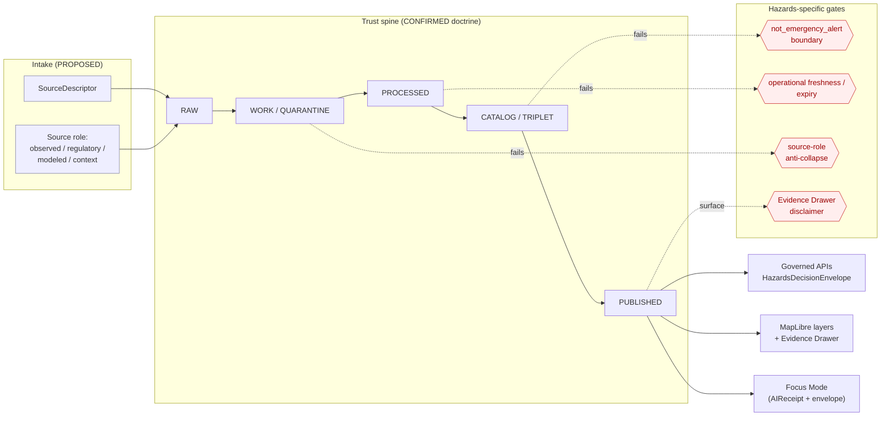

<!-- [KFM_META_BLOCK_V2]
doc_id: kfm://doc/hazards-expansion-backlog
title: Hazards Domain — Expansion Backlog
type: standard
version: v1
status: draft
owners: TODO — hazards domain steward(s); KFM doc owners
created: 2026-05-17
updated: 2026-05-17
policy_label: public
related:
  - docs/domains/hazards/README.md
  - docs/domains/hazards/SOURCE_REGISTRY.md
  - docs/standards/PROV.md
  - docs/standards/OGC-API-TILES.md
  - docs/standards/PMTILES.md
  - docs/standards/OAI-PMH.md
  - docs/standards/ISO-19115.md
  - docs/runbooks/fauna/SOURCE_REFRESH_RUNBOOK.md
  - docs/registers/VERIFICATION_BACKLOG.md
  - docs/registers/DRIFT_REGISTER.md
tags: [kfm, hazards, backlog, planning, governance]
notes:
  - Domain-scoped backlog; mirrors encyclopedia §7.10.L feature backlog shape.
  - All implementation-layer claims are PROPOSED until verified against the mounted repo.
  - KFM Hazards is explicitly NOT an emergency alert system.
[/KFM_META_BLOCK_V2] -->

# Hazards Domain — Expansion Backlog

> Prioritized, governance-bound work list for the KFM **Hazards** lane — historical events, regulatory context, observed and modeled hazard products, exposure and resilience summaries — explicitly **not** an emergency alert system.

**Status:** draft &nbsp;·&nbsp; **Owners:** _TODO — hazards domain steward(s); KFM doc owners_ &nbsp;·&nbsp; **Last updated:** 2026-05-17

> [!IMPORTANT]
> KFM Hazards is **CONFIRMED doctrine** as a planning, history, regulatory-context, observation, exposure, and resilience surface. It is **not** an emergency alert system and **must not** provide life-safety instructions. Operational warning/advisory/watch products are admitted as **context only**, are freshness-bound, and **must redirect** life-safety action to official authorities (NWS, FEMA, state/local emergency management). Every item in this backlog inherits that boundary.

---

## Contents

1. [Purpose](#1-purpose)
2. [Scope and non-ownership](#2-scope-and-non-ownership)
3. [Backlog conventions](#3-backlog-conventions)
4. [Backlog flow at a glance](#4-backlog-flow-at-a-glance)
5. [Feature backlog](#5-feature-backlog)
6. [Validators, tests, and fixtures backlog](#6-validators-tests-and-fixtures-backlog)
7. [Source-family backlog](#7-source-family-backlog)
8. [Thin-slice plan (first credible slice)](#8-thin-slice-plan-first-credible-slice)
9. [Pipeline gates and promotion backlog](#9-pipeline-gates-and-promotion-backlog)
10. [API / schema / contract surface backlog](#10-api--schema--contract-surface-backlog)
11. [Cross-lane relation backlog](#11-cross-lane-relation-backlog)
12. [Risks and mitigations](#12-risks-and-mitigations)
13. [Verification backlog and open questions](#13-verification-backlog-and-open-questions)
14. [Directory placement basis](#14-directory-placement-basis)
15. [Related docs](#15-related-docs)

---

## 1. Purpose

This document is the **prioritized work register** for the KFM Hazards domain lane. It enumerates the features, validators, fixtures, source-role work, schema/contract/API surfaces, cross-lane relations, and verification items that the Hazards lane needs to satisfy the KFM trust spine — `RAW → WORK/QUARANTINE → PROCESSED → CATALOG/TRIPLET → PUBLISHED` — without crossing the life-safety boundary.

It is a **planning artifact**, not a release decision. Promotion of any item below to actual repo work requires the normal KFM apparatus: ADR (where Directory Rules §2.4 applies), per-root README updates, source descriptors, evidence bundles, policy decisions, validation, release manifest, correction path, and rollback target.

> [!NOTE]
> Status is **CONFIRMED doctrine / PROPOSED implementation** throughout, mirroring the Hazards domain blueprint and the Domain Atlas v1.1. No item below should be treated as repo state. Where a backlog item names a path, schema, or route, the path is **PROPOSED** until checked against the mounted repository and Directory Rules.

---

## 2. Scope and non-ownership

### 2.1 In scope (CONFIRMED doctrine)

The Hazards lane owns evidence and released derivatives for:

- Historical hazard events — severe weather, flood, wildfire, smoke, drought, earthquake, heat/cold, hail/wind/tornado.
- Disaster declarations (administrative records).
- Warnings, advisories, watches — admitted only as **operational context**, never as life-safety instructions.
- Regulatory hazard areas (e.g., NFHL flood-zone polygons).
- Scientific observations and remote-sensing detections.
- Modeled hazard derivatives and resilience analyses.
- Exposure and resilience summaries and hazard timelines.

### 2.2 Explicit non-ownership (CONFIRMED doctrine)

> [!WARNING]
> KFM Hazards **is not an emergency alert system**. Hazards backlog work must **never**:
>
> - Produce or display content as authoritative real-time alerting.
> - Bind regulatory determinations.
> - Hide source role behind operational urgency.
> - Surface expired operational context as current warning state.

Lane non-ownership (CONFIRMED / PROPOSED):

| Concern | Owning lane |
|---|---|
| Canonical water evidence (gauges, NHDPlus, HUC, NFHL identity) | Hydrology |
| Air quality, smoke aerosol/AOD, climate normals, weather observation | Atmosphere / Air |
| Settlements, infrastructure assets, dependencies | Settlements / Infrastructure |
| Road and rail network identity, closures, detours | Roads / Rail |
| Archaeological site exposure, cultural review | Archaeology |
| Living-person, DNA, genealogy posture | People / Genealogy / DNA / Land |

[⬆ back to top](#contents)

---

## 3. Backlog conventions

### 3.1 Item IDs

Items in this backlog use the **PROPOSED** prefix `HAZ-BL-NNN`, scoped to the Hazards domain. The global Pass-20 expansion list (`EXP-NNN`) remains the canonical cross-domain ID space; any `HAZ-BL` item that needs cross-domain elevation should be re-issued an `EXP-NNN` ID via the global backlog. Renumbering must follow the doc-change discipline in `docs/registers/`.

### 3.2 Status labels

| Label | Meaning |
|---|---|
| `CONFIRMED` | Verified in this session from attached project doctrine. |
| `PROPOSED` | Design or path not yet verified against the mounted repo. |
| `NEEDS VERIFICATION` | Checkable, but not checked in this session. |
| `UNKNOWN` | Not resolvable without more evidence. |
| `DENY` | Default-deny posture; item is in the backlog only to harden the deny gate. |

### 3.3 Closure criteria

A backlog item is **closed** only when every applicable element exists and is wired through the trust spine: `SourceDescriptor` → `EvidenceRef` → `EvidenceBundle` → `ValidationReport` → `DecisionEnvelope` → `LayerManifest` / `ReleaseManifest` → correction path → rollback target. Items that emit operational warning context additionally require a `not_emergency_alert_system` envelope flag and freshness/expiry handling.

[⬆ back to top](#contents)

---

## 4. Backlog flow at a glance

> [!NOTE]
> **NEEDS VERIFICATION:** Exact placement of hazards gates relative to the lifecycle phases. The diagram reflects KFM doctrine (lifecycle order, Hazards posture, governed surfaces) but the specific validator wiring is **PROPOSED** until the mounted repo confirms it.

[⬆ back to top](#contents)

---

## 5. Feature backlog

This table follows the encyclopedia §7.10.L feature-backlog shape and adds backlog IDs and a Directory Rules home column. All entries are **PROPOSED** unless marked otherwise.

### 5.1 Group: **Build first**

| ID | Feature | Actor / action | Evidence needed | Risk | Validation path | Status |
|---|---|---|---|---|---|---|
| `HAZ-BL-001` | Hazards source registry + no-network fixture | steward / developer | `SourceDescriptor` + synthetic fixture for one NOAA Storm Events record and one NFHL polygon | rights / source-role ambiguity | schema, source, rights validators | PROPOSED |
| `HAZ-BL-002` | Hazards Evidence Drawer inspector (one feature) | public / researcher / steward | `EvidenceBundle` for one historical hazard event | uncited public claim | evidence closure + citation tests | PROPOSED |
| `HAZ-BL-003` | `not_emergency_alert_system` envelope flag and fixture | steward / API engineer | `HazardsDecisionEnvelope` with `not_emergency_alert_system: true` and official-source referral | drift toward alerting | envelope schema test + denial fixture | PROPOSED |
| `HAZ-BL-004` | Operational expiry / freshness fixture | steward / developer | expired NWS-style advisory + valid advisory fixtures | stale-as-current warning | freshness/expiry validator | PROPOSED |
| `HAZ-BL-005` | Source-role anti-collapse fixture set | steward | one fixture per `Hazards` ubiquitous-language term (see §7) | role collapse on join | role-tag retention validator | PROPOSED |

### 5.2 Group: **After proof lane**

| ID | Feature | Actor / action | Evidence needed | Risk | Validation path | Status |
|---|---|---|---|---|---|---|
| `HAZ-BL-010` | Hazards time slider + compare mode | researcher / steward | versioned observations / regulatory layers with distinct `observed` / `valid` / `issue` / `expiry` / `retrieval` / `release` times | false temporal alignment | temporal-logic tests | PROPOSED |
| `HAZ-BL-011` | NFHL regulatory-vs-observed lane separation | steward / API engineer | NFHL `regulatory_context` fixture + observed flood event fixture | regulatory cited as event | role-separation + DENY tests | PROPOSED |
| `HAZ-BL-012` | Disaster declaration ↔ hazard event linkage | researcher | OpenFEMA-style declaration fixture + linked event fixture | administrative cited as observed | source-role join validator | PROPOSED |
| `HAZ-BL-013` | Exposure summary public-safe surface | researcher / steward | exposure summary generated from released layers only | precision leak | layer-manifest + redaction tests | PROPOSED |
| `HAZ-BL-014` | Resilience-summary review path | steward | analysis with citations to released Hazards `EvidenceBundles` | derivative becomes truth | citation + finite-outcome tests | PROPOSED |

### 5.3 Group: **Ambitious / research**

| ID | Feature | Actor / action | Evidence needed | Risk | Validation path | Status |
|---|---|---|---|---|---|---|
| `HAZ-BL-020` | Cross-domain Hazards analytics and graph queries | researcher / AI assistant | source-backed triples and model receipts | derivative treated as canonical truth | graph projection + provenance tests | PROPOSED |
| `HAZ-BL-021` | Hazards Focus Mode templates (history / context / resilience) | researcher | released `EvidenceBundles` and `AIReceipt` template | hallucinated alerting language | ANSWER / ABSTAIN / DENY / ERROR fixtures | PROPOSED |
| `HAZ-BL-022` | Hazards Story Node pilot | steward | composite manifest with mixed-state components | candidate cited as released | composite-manifest validator | PROPOSED |
| `HAZ-BL-023` | Drought / hydrology / agriculture join with role guards | researcher | drought indicator + linked Hydrology and Agriculture EvidenceBundles | cross-lane authority confusion | cross-lane relation validator | PROPOSED |

### 5.4 Group: **DENY by default**

| ID | Feature | Actor / action | Evidence needed | Risk | Validation path | Status |
|---|---|---|---|---|---|---|
| `HAZ-BL-030` | Real-time emergency-alert mimicry surface | public visitor | n/a — must be denied | life-safety harm | emergency-alert denial test | DENY |
| `HAZ-BL-031` | Life-safety instruction generation by AI | public visitor | n/a — must be denied | life-safety harm | Focus Mode DENY test + AIReceipt | DENY |
| `HAZ-BL-032` | Expired operational warning as current warning | public visitor | n/a — must be denied | misleading freshness | expiry/freshness validator | DENY |
| `HAZ-BL-033` | NFHL regulatory polygon published as observed flood event | public visitor | n/a — must be denied | regulatory-vs-event collapse | role-separation deny test | DENY |
| `HAZ-BL-034` | Sensitive critical-infrastructure exposure via hazard overlay | public visitor | policy approval + redaction receipt before release | public-safety harm | policy deny + transform-receipt tests | DENY |

[⬆ back to top](#contents)

---

## 6. Validators, tests, and fixtures backlog

CONFIRMED doctrine list from the Hazards atlas chapter, normalized as backlog items. Implementation status is **PROPOSED**.

| ID | Validator / test | Trigger | DENY case the test must reject |
|---|---|---|---|
| `HAZ-BL-100` | Source-role anti-collapse | any Hazards object emit | regulatory cited as observed; operational cited as historical |
| `HAZ-BL-101` | Temporal-role validator | any Hazards object emit | issue/expiry/valid/observed/retrieval/release times conflated |
| `HAZ-BL-102` | Emergency-alert denial | any public-facing Hazards surface | output framed as life-safety instruction |
| `HAZ-BL-103` | Operational expiry / freshness | warnings / advisories / watches | expired context shown as current |
| `HAZ-BL-104` | Catalog closure | publication candidate | bundle missing `EvidenceRef`, `ValidationReport`, or digest closure |
| `HAZ-BL-105` | Evidence Drawer disclaimer | drawer payload | missing not-for-life-safety disclaimer for operational context |
| `HAZ-BL-106` | UI no-direct-source | renderer / drawer / Focus Mode | direct read from RAW / WORK / QUARANTINE / canonical store |
| `HAZ-BL-107` | No-network fixture pack | CI | network access during test run; missing negative fixtures |
| `HAZ-BL-108` | Rollback drill (Hazards) | release candidate | `ReleaseManifest` without `RollbackCard` target |

> [!TIP]
> Each validator above SHOULD ship with at least one **valid fixture** and one **invalid fixture** — the negative case is the credibility test. This mirrors the cross-cutting validator-registry guidance in the Pass 20 expansion dossier.

[⬆ back to top](#contents)

---

## 7. Source-family backlog

CONFIRMED family list with PROPOSED admission work. Roles per source are **CONFIRMED to be one of** `authority / observation / context / model` **as the source role requires**; rights and current terms are **NEEDS VERIFICATION** until each descriptor is admitted.

| ID | Source family | Primary roles | Freshness profile | Admission backlog |
|---|---|---|---|---|
| `HAZ-BL-200` | NOAA Storm Events / NCEI-style records | observation / context | source-vintage; periodic refresh | descriptor + rights review + temporal validator |
| `HAZ-BL-201` | NWS alerts / warnings / advisories / watches | operational context (NOT alerting) | issue / expiry-bound | descriptor + expiry validator + `not_emergency_alert_system` flag |
| `HAZ-BL-202` | FEMA Disaster Declarations / OpenFEMA | administrative declaration | declaration-cycle | descriptor + admin-vs-event role guard |
| `HAZ-BL-203` | FEMA NFHL / MSC flood hazard context | regulatory context | map-revision cycle | descriptor + regulatory-vs-observed guard |
| `HAZ-BL-204` | USGS Earthquake Catalog | observation / scientific | near-real-time + historical | descriptor + observed-vs-modeled guard |
| `HAZ-BL-205` | NOAA HMS Fire and Smoke | observation / remote-sensing | daily / sub-daily | descriptor + remote-sensing role tag |
| `HAZ-BL-206` | NASA FIRMS active fire | remote-sensing detection | hourly to daily | descriptor + detection-vs-event guard |
| `HAZ-BL-207` | Kansas / local emergency management context | administrative / context | program-specific | descriptor + rights / steward review |
| `HAZ-BL-208` | Drought monitors (e.g., USDM-style) | modeled / aggregate | weekly | descriptor + aggregation receipt |

> [!CAUTION]
> Source rights and **current** access terms are **NEEDS VERIFICATION** for every family above. Public release MUST be blocked until source terms and a redistribution class are recorded in the source descriptor. This applies even when the family is widely used in public GIS practice.

[⬆ back to top](#contents)

---

## 8. Thin-slice plan (first credible slice)

CONFIRMED first-thin-slice description (encyclopedia §3, Domain table): **"Historical flood/severe weather event fixture plus NFHL context and exposure summary, with warning feeds disabled or contextual-only."**

Operationalized backlog form:

| Step | Backlog ID | Item |
|---|---|---|
| 1 | `HAZ-BL-001` | Admit one historical severe weather / flood event into RAW with a complete `SourceDescriptor`. |
| 2 | `HAZ-BL-005` | Admit one NFHL polygon into RAW with `regulatory_context` role tagged. |
| 3 | `HAZ-BL-100`/`HAZ-BL-101` | Run source-role and temporal validators; fail closed on any collapse. |
| 4 | `HAZ-BL-002` | Build the EvidenceBundle and Evidence Drawer payload for the chosen event. |
| 5 | `HAZ-BL-013` | Produce a public-safe exposure summary from released layers only. |
| 6 | `HAZ-BL-003` | Wire the `not_emergency_alert_system` flag and official-source referral. |
| 7 | `HAZ-BL-105` | Render the Evidence Drawer with the not-for-life-safety disclaimer. |
| 8 | `HAZ-BL-108` | Execute one rollback drill against the slice. |

> [!IMPORTANT]
> Warning feeds (NWS-style) are **disabled or strictly contextual** in this slice. The slice closes only when a steward-signed `ReleaseManifest` + `RollbackCard` + correction path exist and the emergency-alert denial test passes against the published surface.

[⬆ back to top](#contents)

---

## 9. Pipeline gates and promotion backlog

CONFIRMED doctrine (lifecycle stages); PROPOSED Hazards-specific gates.

| Lifecycle stage | Hazards-specific gate (PROPOSED) | Closure marker |
|---|---|---|
| `RAW` | `SourceDescriptor` exists with role in `{observed, regulatory, modeled, context, administrative}` plus rights status. | descriptor recorded |
| `WORK / QUARANTINE` | Source-role anti-collapse + temporal-role + rights/sensitivity gates pass; quarantine reason recorded on failure. | validator passes or quarantine record exists |
| `PROCESSED` | `EvidenceRef`, `ValidationReport`, and digest closure exist for the normalized object. | evidence + validation closure |
| `CATALOG / TRIPLET` | `EvidenceBundle` resolves; `not_emergency_alert_system` flag set where operational context is involved; catalog closure passes. | bundle + flag |
| `PUBLISHED` | `ReleaseManifest` + correction path + `RollbackCard` exist; review state captured where required; Evidence Drawer disclaimer rendered. | release decision recorded |

> [!NOTE]
> No Hazards artifact may skip a stage; promotion is a governed state transition, not a file move. The watcher-as-non-publisher invariant applies: source-watch outputs (e.g., refreshing NFHL or storm-event records) **propose** work and **never** publish.

[⬆ back to top](#contents)

---

## 10. API / schema / contract surface backlog

Atlas v1.1 §J for Hazards lists four PROPOSED governed surfaces. Backlog form below; exact routes UNKNOWN.

| ID | Surface | DTO / schema | Finite outcomes | Status |
|---|---|---|---|---|
| `HAZ-BL-300` | Hazards feature/detail resolver (route TBD) | `HazardsDecisionEnvelope` | ANSWER / ABSTAIN / DENY / ERROR | PROPOSED; exact route UNKNOWN |
| `HAZ-BL-301` | Hazards layer manifest resolver | `LayerManifest` / domain layer descriptor | ANSWER / DENY / ERROR | PROPOSED; public-safe release only |
| `HAZ-BL-302` | Hazards Evidence Drawer payload | `EvidenceDrawerPayload` + `EvidenceBundle` projection | ANSWER / ABSTAIN / DENY / ERROR | PROPOSED; evidence + policy filtered |
| `HAZ-BL-303` | Hazards Focus Mode answer | `RuntimeResponseEnvelope` + `AIReceipt` | ANSWER / ABSTAIN / DENY / ERROR | PROPOSED; AI never root truth |
| `HAZ-BL-304` | Schema home for Hazards contracts | `schemas/contracts/v1/hazards/` (PROPOSED) | finite validator outcomes | PROPOSED; verify against Directory Rules §7 and ADR-0001 |
| `HAZ-BL-305` | Policy home for Hazards release controls | `policy/release/hazards/` (PROPOSED) | ALLOW / DENY / RESTRICT / ABSTAIN | PROPOSED; verify against Directory Rules |

> [!IMPORTANT]
> Every Hazards surface MUST carry the `not_emergency_alert_system` posture in its envelope, drawer payload, and Focus Mode receipt where operational context is involved. A surface that cannot carry the flag SHOULD NOT be served.

[⬆ back to top](#contents)

---

## 11. Cross-lane relation backlog

CONFIRMED / PROPOSED relations from the Hazards atlas chapter, normalized as joint backlog items. Each relation MUST preserve ownership, source role, sensitivity, and `EvidenceBundle` support.

| ID | Related lane | Relation | Backlog item |
|---|---|---|---|
| `HAZ-BL-400` | Hydrology | Flood / drought / water-event context with role separation. | Joint regulatory-vs-observed fixture; NFHL DENY-as-event test. |
| `HAZ-BL-401` | Atmosphere / Air | Smoke, heat/cold, AQI / advisory, wind, fire-weather context. | Knowledge-character separation fixture; not-for-life-safety envelope. |
| `HAZ-BL-402` | Settlements / Infrastructure | Exposure, lifelines, dependencies. | Public-safe exposure summary; infrastructure-precision DENY default. |
| `HAZ-BL-403` | Roads / Rail | Closures, detours, bridge / crossing exposure, resilience. | Cross-lane closure fixture; route-narrative-vs-alignment guard. |
| `HAZ-BL-404` | Archaeology | Hazard impact on culturally sensitive sites. | Steward-review-required release path; exact-location DENY default. |

[⬆ back to top](#contents)

---

## 12. Risks and mitigations

| Risk | Mitigation | Backlog ID(s) |
|---|---|---|
| Rights uncertainty | Block public release until source terms and redistribution class are recorded. | `HAZ-BL-200`–`HAZ-BL-208` |
| Sensitive-location exposure | Default redaction / generalization; restricted views; geoprivacy transform receipts. | `HAZ-BL-013`, `HAZ-BL-034`, `HAZ-BL-402` |
| False precision | Show uncertainty / support; scale and source-role badges; abstain on over-precise claims. | `HAZ-BL-005`, `HAZ-BL-302` |
| Source-authority confusion | Use source-role registry; keep observation / model / regulatory / administrative contexts separate. | `HAZ-BL-005`, `HAZ-BL-100`, `HAZ-BL-011`, `HAZ-BL-012` |
| Model hallucination (Focus Mode) | Citation validation; finite outcomes; no direct model-to-public path. | `HAZ-BL-021`, `HAZ-BL-031`, `HAZ-BL-303` |
| Stale data shown as current | Freshness badges; retrieval / source / release time fields; stale-state policy. | `HAZ-BL-004`, `HAZ-BL-103`, `HAZ-BL-032` |
| Rollback complexity | `ReleaseManifest` + `RollbackCard` + rollback drill for every release. | `HAZ-BL-108` |
| Drift toward alerting | `not_emergency_alert_system` envelope flag; official-source referral; emergency-alert DENY test; UI disclaimer. | `HAZ-BL-003`, `HAZ-BL-030`, `HAZ-BL-102`, `HAZ-BL-105` |

[⬆ back to top](#contents)

---

## 13. Verification backlog and open questions

CONFIRMED items mirror Atlas v1.1 §N for Hazards. Status is **NEEDS VERIFICATION** until each is checked against the mounted repo.

| ID | Item to verify | Evidence that would settle it |
|---|---|---|
| `HAZ-BL-500` | Official source endpoints and rights for every family in §7. | source descriptors + registry entries + rights records |
| `HAZ-BL-501` | Role taxonomy and freshness states implementation. | mounted schema files + validator code + fixtures |
| `HAZ-BL-502` | Emergency-alert boundary enforcement end-to-end. | API tests, UI tests, Focus Mode receipts, denial fixtures |
| `HAZ-BL-503` | Release / correction / rollback drill for Hazards. | release manifests + rollback cards + drill receipts |
| `HAZ-BL-504` | Canonical schema home for Hazards (`schemas/contracts/v1/hazards/` per atlas crosswalk and ADR-0001). | repository inspection + ADR resolution |
| `HAZ-BL-505` | Canonical policy home for Hazards release (`policy/release/hazards/` per atlas crosswalk). | repository inspection + per-root README |
| `HAZ-BL-506` | Layer manifest renderer-binding for Hazards layers. | layer registry validator + viewer verification |
| `HAZ-BL-507` | Cross-lane relation contracts (Hydrology, Atmosphere/Air, Settlements, Roads, Archaeology). | joint fixtures + cross-lane validator |

### 13.1 Open questions

- Which Hazards layers carry the **highest misuse risk** and need the most prominent labeling? *(See PLN-002 in the Pass 20 idea index.)*
- Should the `not_emergency_alert_system` flag live on the envelope, on the layer manifest, or both? **UNKNOWN.**
- What freshness thresholds are appropriate per source family (Storm Events vs. NWS context vs. NFHL revisions vs. FIRMS)? **PROPOSED:** thresholds belong in the global threshold policy registry (`EXP-008`), not hard-coded per layer.
- How does Hazards Focus Mode interact with rollback when a referenced `EvidenceBundle` is withdrawn? Propagation surface is **UNKNOWN**.

[⬆ back to top](#contents)

---

## 14. Directory placement basis

<strong>Directory Rules basis for this file and its referenced homes</strong>

**This file** — `docs/domains/hazards/EXPANSION_BACKLOG.md`. Placement basis (PROPOSED):

- Directory Rules §4 Step 1: primary responsibility is *explanation to humans / planning register* → `docs/`.
- Directory Rules §4 Step 3: domain-specific docs live as a segment **inside** the `docs/` responsibility root → `docs/domains/<domain>/`.
- Atlas v1.1 §24.13 crosswalk identifies Hazards primary responsibility roots as `schemas/contracts/v1/hazards/`, `contracts/hazards/`, and `policy/release/hazards/` — none of which is the right home for a planning backlog.
- A directory-rules-shaped peer for this file is `docs/domains/<domain>/EXPANSION_BACKLOG.md`. NEEDS VERIFICATION that the `docs/domains/hazards/` folder exists in the mounted repo and that no parallel backlog home (e.g., `docs/backlog/`, `docs/expansion/`) is canonical.

**Referenced homes used in this backlog (PROPOSED unless an ADR proves otherwise):**

| Reference | Proposed home | Basis |
|---|---|---|
| Hazards machine schemas | `schemas/contracts/v1/hazards/` | Atlas §24.13 crosswalk; Directory Rules schema-home rule (ADR-0001 default). |
| Hazards semantic contracts | `contracts/hazards/` | Atlas §24.13. |
| Hazards release policy | `policy/release/hazards/` | Atlas §24.13. |
| Hazards source-role / sensitivity policy | `policy/domains/hazards/` (or `policy/release/hazards/`) | Directory Rules §4 Step 3; NEEDS VERIFICATION. |
| Hazards tests | `tests/domains/hazards/` | Directory Rules §4 Step 3. |
| Hazards fixtures | `fixtures/domains/hazards/` or `tests/fixtures/domains/hazards/` | Directory Rules §13 (fixture sprawl anti-pattern); choose one authority. |
| Hazards data lifecycle | `data/<phase>/hazards/`, `data/catalog/domain/hazards/`, `data/published/layers/hazards/`, `data/registry/sources/hazards/` | Directory Rules §4 Step 3. |
| Hazards release candidates | `release/candidates/hazards/` | Directory Rules §4 Step 3. |
| Hazards pipelines | `pipelines/domains/hazards/`; specs in `pipeline_specs/hazards/` | Directory Rules §4 Step 3. |

> [!NOTE]
> Any path above that does not exist in the mounted repo MUST be treated as **PROPOSED** in PR descriptions, with the Directory Rules section cited. A new canonical root or sibling under `data/` requires an ADR per Directory Rules §2.4.

[⬆ back to top](#contents)

---

## 15. Related docs

> _Placeholder targets where the linked file is not yet confirmed to exist; replace with verified paths during repo preflight._

- `docs/domains/hazards/README.md` — Hazards domain README (TODO).
- `docs/domains/hazards/SOURCE_REGISTRY.md` — Hazards source registry detail (TODO).
- `docs/standards/PROV.md` — W3C PROV-O / PAV provenance profile.
- `docs/standards/OGC-API-TILES.md` — OGC API — Tiles delivery profile.
- `docs/standards/PMTILES.md` — PMTiles governance and conformance profile.
- `docs/standards/OAI-PMH.md` — OAI-PMH harvest governance.
- `docs/standards/ISO-19115.md` — ISO 19115 crosswalk profile.
- `docs/runbooks/fauna/SOURCE_REFRESH_RUNBOOK.md` — companion domain runbook pattern.
- `docs/registers/VERIFICATION_BACKLOG.md` — global verification register.
- `docs/registers/DRIFT_REGISTER.md` — drift entries between Rules and repo.
- Atlas v1.1, chapter 12 (Hazards) — domain doctrine baseline.
- KFM Encyclopedia §7.10 (Hazards) — capability encyclopedia baseline.
- KFM Pass 20 Part 2 — expansion dossier (EXP-NNN crosswalk).

---

**Last updated:** 2026-05-17 &nbsp;·&nbsp; **Status:** draft &nbsp;·&nbsp; [⬆ back to top](#contents)
