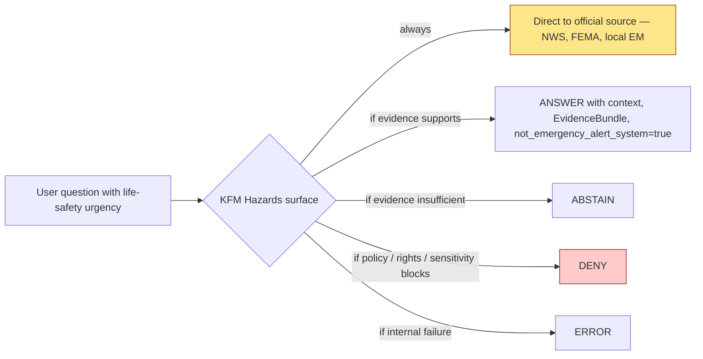
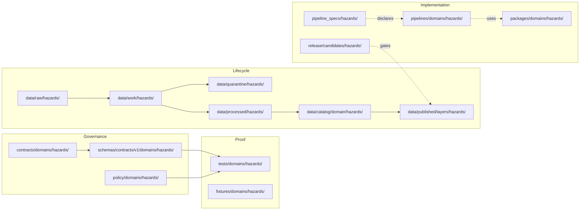
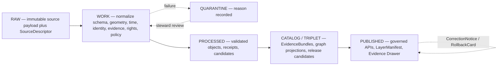
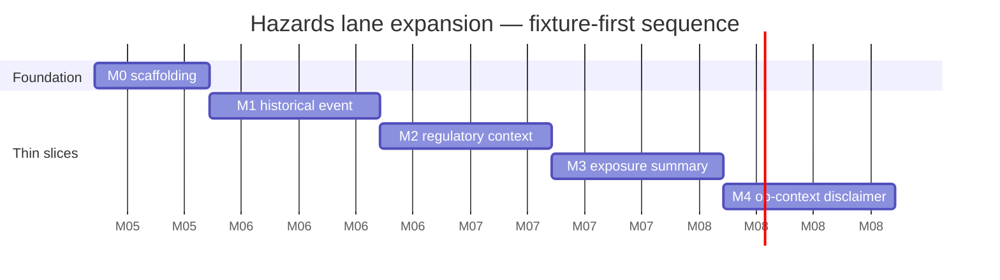
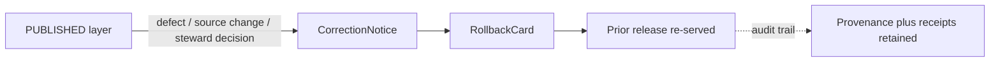

<!-- [KFM_META_BLOCK_V2]
doc_id: kfm://doc/domains/hazards/expansion-plan
title: Hazards Domain — Expansion Plan
type: standard
version: v2
status: draft
owners: <hazards-lane steward> + <governance steward>  # TODO: assign before review
created: 2026-05-17
updated: 2026-06-05
policy_label: public
contract_version: "3.0.0"
related:
  - ai-build-operating-contract.md
  - directory-rules.md
  - docs/doctrine/trust-membrane.md
  - docs/doctrine/lifecycle-law.md
  - docs/doctrine/truth-posture.md
  - docs/domains/hazards/README.md            # PROPOSED neighbor; NEEDS VERIFICATION
  - docs/domains/hazards/DATA_LIFECYCLE.md     # sibling doc
  - docs/domains/hazards/EXPANSION_BACKLOG.md  # sibling doc
  - docs/domains/hydrology/README.md           # PROPOSED neighbor; NEEDS VERIFICATION
  - docs/adr/ADR-0001-schema-home.md
  - docs/registers/VERIFICATION_BACKLOG.md
  - docs/registers/DRIFT_REGISTER.md
tags: [kfm, hazards, domain, expansion, planning, governance]
notes:
  - CONTRACT_VERSION pinned at 3.0.0 per ai-build-operating-contract.md v3.0.
  - Doctrine basis is CONFIRMED; implementation maturity is PROPOSED unless repo evidence is mounted.
  - apps/governed-api/ trust path is CONFIRMED at commit b6a279… per the Repository Structure Guiding Document.
  - Life-safety / not-emergency-alert boundary is a non-negotiable invariant for this lane.
  - v2 flags OQ-HAZ-EP-01 — operational_warning -> source_role mapping (observed vs context) is CONFLICTED pending ADR.
[/KFM_META_BLOCK_V2] -->

# Hazards Domain — Expansion Plan

> A governance-aware, thin-slice-first plan for building the **Hazards** domain lane under KFM's trust spine — without ever becoming an emergency alert system.

<!-- Badge row (placeholders; CI target unverified) -->


 <!-- TODO: replace with real CI badge -->

**Status:** draft · **Owners:** _hazards-lane steward + governance steward_ (TODO) · **Contract:** `CONTRACT_VERSION = "3.0.0"` · **Last updated:** 2026-06-05

---

## Contents

1. [Why this plan exists](#1-why-this-plan-exists)
2. [Mission and non-mission boundary](#2-mission-and-non-mission-boundary)
3. [Expansion principles](#3-expansion-principles)
4. [Domain placement (where files live)](#4-domain-placement-where-files-live)
5. [Source families and source-role discipline](#5-source-families-and-source-role-discipline)
6. [Object families and ubiquitous language](#6-object-families-and-ubiquitous-language)
7. [Lifecycle pipeline and promotion gates](#7-lifecycle-pipeline-and-promotion-gates)
8. [Milestone sequence (M0–M4)](#8-milestone-sequence-m0m4)
9. [Validators, tests, and fixtures](#9-validators-tests-and-fixtures)
10. [Governed surfaces — API, MapLibre, Drawer, Focus](#10-governed-surfaces--api-maplibre-drawer-focus)
11. [Sensitivity, rights, and publication posture](#11-sensitivity-rights-and-publication-posture)
12. [Correction and rollback](#12-correction-and-rollback)
13. [Verification backlog and open questions](#13-verification-backlog-and-open-questions)
14. [Changelog](#14-changelog)
15. [Definition of done](#15-definition-of-done)
16. [Related docs and appendices](#16-related-docs-and-appendices)

> [!IMPORTANT]
> **Hazards is not an emergency alert system.** Every surface this plan produces must direct life-safety questions to official sources (NWS, FEMA, local emergency management) and must mark operational warning/advisory/watch content with issue time, expiry, source, freshness, and a `not_emergency_alert_system` flag. This invariant overrides convenience, completeness, and demo polish. *(CONFIRMED — DOM-HAZ §12.I; Atlas §24.9.2 "KFM used as alert / instruction authority → DENY".)*

---

## 1. Why this plan exists

The KFM corpus describes Hazards as one of the most consequential and most constrained domain lanes. The doctrine is detailed — mission, sources, objects, source-role taxonomy, life-safety boundary, sensitivity posture, governed surfaces — but the implementation across the responsibility roots (`contracts/`, `schemas/`, `policy/`, `tests/`, `fixtures/`, `pipelines/`, `pipeline_specs/`, `data/`, `release/`, `apps/`, `packages/`) is **PROPOSED** until mounted-repo evidence proves otherwise.

This plan converts CONFIRMED doctrine into a sequenced, fixture-first, governance-shaped expansion that:

- Honors the **trust membrane** — no public reads of `data/raw|work|quarantine`; the public path is `apps/governed-api/`.
- Honors the **lifecycle invariant** — RAW → WORK / QUARANTINE → PROCESSED → CATALOG / TRIPLET → PUBLISHED.
- Honors **promotion-as-state-transition** — not file movement.
- Honors **cite-or-abstain** as the default truth posture.
- Honors the **life-safety boundary** above all hazard-specific decisions.

It is intentionally narrow in early milestones (one historical event, one regulatory context layer, no live operational feeds) and earns broader coverage by repeated thin-slice closure rather than by horizontal launch.

> [!NOTE]
> Doctrine cited here (`[DOM-HAZ]`, `[ENCY]`, `[DIRRULES]`, `[MAP-MASTER]`, `[GAI]`) maps to the KFM Atlas, Encyclopedia, Directory Rules, MapLibre Master, and Governed AI dossiers. Specific file paths are **PROPOSED** until verified against current mounted-repo state — except `apps/governed-api/`, which is **CONFIRMED at commit** `b6a279…` per the Repository Structure Guiding Document (Directory Rules §7.1, §11).

[⬆ back to top](#contents)

---

## 2. Mission and non-mission boundary

### 2.1 What Hazards owns — CONFIRMED doctrine

Govern **historical**, **regulatory**, **modeled**, and **operational-context** hazard information for analysis and resilience while refusing to act as a life-safety alerting system. Owns historical events, severe weather, flood, wildfire, smoke, drought, earthquake, heat/cold, hail/wind/tornado, disaster declarations, warnings/advisories **as context only**, exposure/resilience summaries, and hazard timelines. *(Atlas §12.A–B; Encyclopedia §7.10.)* [DOM-HAZ] [ENCY]

### 2.2 What Hazards explicitly does *not* own

- Life-safety alerting, evacuation instructions, or any surface that implies authoritative warning state.
- Canonical water observations (owned by Hydrology).
- Canonical atmospheric observations (owned by Atmosphere/Air).
- Canonical road/rail/settlement/infrastructure truth (owned by their lanes; Hazards consumes these as exposure context).
- Cross-domain spatial conventions (owned by Spatial Foundation).

> [!CAUTION]
> Operational `WarningContext`, `AdvisoryContext`, and watches are **contextual-only** carriers. Expired operational context **MUST NOT** appear as current warning state. Unknown source roles **MUST** be quarantined. *(CONFIRMED — DOM-HAZ Atlas §12.I.)*

### 2.3 The single overriding invariant



[⬆ back to top](#contents)

---

## 3. Expansion principles

These principles govern every milestone in §8 and every PR that lands under the hazards lane.

| # | Principle | Source | Status |
|---|---|---|---|
| 1 | **Thin-slice, not coverage.** Each PR proves one closed loop (descriptor → evidence → policy → validation → release) for one small AOI before broadening. | IMPL-MANUAL roadmap; hydrology / habitat-fauna analogs | CONFIRMED |
| 2 | **Fixture-first, no-network.** New objects, gates, and surfaces prove themselves on representative fixtures before any live connector is activated. | IMPL-MANUAL Phase 4 no-network dry run | CONFIRMED |
| 3 | **Fail-closed validators.** Missing schema fields, policy decisions, rights evidence, sensitivity posture, proof objects, or release state DENY publication. | Atlas §24.6 closure rule | CONFIRMED |
| 4 | **Source-role anti-collapse.** Historical event, operational warning, regulatory layer, observation, remote-sensing detection, and modeled derivative are **separate** source-role channels and must not collapse into one truth class. | DOM-HAZ §12.C; Atlas §24.1; SourceDescriptor `source_role` enum | CONFIRMED |
| 5 | **Life-safety boundary is policy.** Every operational-context output carries `not_emergency_alert_system=true`, official-source referral, and finite outcome (ANSWER / ABSTAIN / DENY / ERROR). | DOM-HAZ §12.I; Atlas §24.9.2 | CONFIRMED |
| 6 | **Watcher-as-non-publisher.** Source-health watchers emit receipts and candidate decisions; they never publish, mutate canonical truth, or rewrite catalog. | Directory Rules §2.1 (core invariant) | CONFIRMED |
| 7 | **Promotion is governed.** Promotion is a state transition with receipts, not a file move; rollback target and correction path are part of release closure. | Directory Rules §0; ENCY Appendix E | CONFIRMED |
| 8 | **Documentation as control plane.** This plan, ADRs, source-role matrix, and the verification backlog are part of governance — not commentary. | ai-build-operating-contract.md §1; Directory Rules §1 | CONFIRMED |

[⬆ back to top](#contents)

---

## 4. Domain placement (where files live)

The **Domain Placement Law** (Directory Rules §12) forbids a `hazards/` root folder. Hazards lives as a *distributed lane* across the canonical responsibility roots. The lane pattern itself — the domain as a **segment** inside each responsibility root — is **CONFIRMED by Directory Rules §12** (which names `hazards` explicitly); specific *file presence* is **PROPOSED until repo-verified**.

```text
docs/domains/hazards/                           # this folder — human-facing domain doctrine
contracts/domains/hazards/                      # object meaning (Markdown) — placement CONFIRMED §12; presence NEEDS VERIFICATION
schemas/contracts/v1/domains/hazards/           # machine shape (per ADR-0001) — placement CONFIRMED §12
policy/domains/hazards/                         # admissibility, life-safety policy bundle — placement CONFIRMED §12
tests/domains/hazards/                          # validators, policy tests, fixtures-runner — placement CONFIRMED §12
fixtures/domains/hazards/                       # valid / invalid / golden / synthetic — placement CONFIRMED §12
packages/domains/hazards/                       # shared hazards library code — placement CONFIRMED §12
pipelines/domains/hazards/                      # executable pipeline steps — placement CONFIRMED §12
pipeline_specs/hazards/                         # declarative pipeline configuration — placement CONFIRMED §12
data/raw/hazards/                               # immutable source payloads
data/work/hazards/                              # normalization working area
data/quarantine/hazards/                        # held failures
data/processed/hazards/                         # validated normalized objects
data/catalog/domain/hazards/                    # STAC/DCAT/PROV catalog records (catalog phase uses domain/<domain>/)
data/published/layers/hazards/                  # released public-safe artifacts
data/registry/sources/hazards/                  # source descriptors
release/candidates/hazards/                     # release decisions / candidates
connectors/{noaa,fema,usgs,nasa}/...            # PROPOSED — source-specific fetchers (shared with other lanes; placement NEEDS VERIFICATION)
```

> [!WARNING]
> **Atlas crosswalk path drift.** The Atlas §24.13 responsibility-root crosswalk uses a **non-segmented** shorthand for Hazards (`schemas/contracts/v1/hazards/`, `contracts/hazards/`, `policy/release/hazards/`). This plan uses the **segmented** form mandated by Directory Rules §12, which wins on path questions (the §24.13 column is self-labeled PROPOSED). Tracked as **DRIFT-HAZ-PATH-01** in the sibling `EXPANSION_BACKLOG.md` and in `docs/registers/DRIFT_REGISTER.md`.



> [!NOTE]
> Cross-lane validators (e.g., a hydrology × hazards flood-context join) belong under the **lowest common responsibility root without a domain segment** — for example `tools/validators/flood-context/`, not under `tools/validators/domains/hazards/`. See Directory Rules §12 "Multi-domain and cross-cutting files."

[⬆ back to top](#contents)

---

## 5. Source families and source-role discipline

### 5.1 Source families — CONFIRMED doctrine, NEEDS VERIFICATION rights

| Source family | Typical role(s) | Rights / sensitivity | Freshness profile | Status |
|---|---|---|---|---|
| NOAA Storm Events / NCEI-style records | observation, historical_event_record | NEEDS VERIFICATION; sensitive joins fail closed | source-vintage / event-aged | CONFIRMED doctrine / PROPOSED impl |
| NWS alerts / warnings / advisories / watches | operational_warning, operational_advisory, operational_watch | NEEDS VERIFICATION; contextual-only | issue/expiry-bound; freshness-gated | CONFIRMED doctrine / PROPOSED impl |
| FEMA Disaster Declarations / OpenFEMA | administrative_declaration | NEEDS VERIFICATION | cadence-specific | CONFIRMED doctrine / PROPOSED impl |
| FEMA NFHL / MSC flood hazard | regulatory_context | NEEDS VERIFICATION; versioned via `VERSION_ID` / `EFFECTIVE_DATE` / `DFIRM_ID` | localized, event-driven | CONFIRMED doctrine / PROPOSED impl |
| USGS Earthquake Catalog | scientific_observation | NEEDS VERIFICATION | source-cadence | CONFIRMED doctrine / PROPOSED impl |
| USGS Water Data | scientific_observation (joined as flood/drought context) | NEEDS VERIFICATION | observation-cadence | CONFIRMED doctrine / PROPOSED impl |
| NOAA HMS Fire & Smoke | remote_sensing_detection, context | NEEDS VERIFICATION | daily/sub-daily | CONFIRMED doctrine / PROPOSED impl |
| NASA FIRMS active fire | remote_sensing_detection | NEEDS VERIFICATION | sub-daily | CONFIRMED doctrine / PROPOSED impl |
| Drought monitors (USDM and similar) | modeled_derivative / context | NEEDS VERIFICATION | weekly | CONFIRMED doctrine / PROPOSED impl |
| Kansas / local emergency context | administrative / context | NEEDS VERIFICATION; steward-mediated | varies | CONFIRMED doctrine / PROPOSED impl |

Sources: Encyclopedia §7.10; Atlas §12.D. NFHL versioning attributes from `[MAP-MASTER] ML-061-019` (CONFIRMED). The Atlas NWS-row role shorthand is "authority / observation / context / model **as source role requires**" — i.e., the role is set per record at admission, not fixed for the whole family.

### 5.2 Source-role taxonomy (anti-collapse)

The hazards-specific ubiquitous-language terms are CONFIRMED doctrine; field realization is PROPOSED. They map to the cross-cutting `SourceDescriptor.source_role` enum (the canonical seven-role register, Atlas §24.1.1: `observed / regulatory / modeled / aggregate / administrative / candidate / synthetic`).

```text
historical_event_record      → source_role: observed
operational_warning          → source_role: observed  *(CONFLICTED — see OQ-HAZ-EP-01; carrier WarningContext, contextual-only)
operational_advisory         → source_role: observed  *(CONFLICTED — see OQ-HAZ-EP-01; carrier AdvisoryContext, contextual-only)
operational_watch            → source_role: observed  *(CONFLICTED — see OQ-HAZ-EP-01; contextual-only)
administrative_declaration   → source_role: administrative
regulatory_context           → source_role: regulatory  (e.g., NFHL polygons)
scientific_observation       → source_role: observed
remote_sensing_detection     → source_role: observed   (detection ≠ ground truth; candidate until reviewed)
modeled_derivative           → source_role: modeled    (requires ModelRunReceipt)
resilience_analysis          → source_role: modeled or aggregate (context for planning)
unknown_unclassified         → DENY at admission; quarantine until reviewed
```

> [!CAUTION]
> **CONFLICTED mapping — OQ-HAZ-EP-01.** Mapping `operational_warning / advisory / watch` to `source_role: observed` is **not settled**. The canonical seven-role register (Atlas §24.1.1) has **no `context` role** — "contextual-only" is a *usage posture*, not a source role — so the operational carriers must be assigned one of the seven. `observed` is defensible (the issuance is a first-hand record of what the authority said), but it risks the very collapse §2.2 forbids if downstream code reads `observed` as "observed hazard." The safer alternatives are (a) keep `source_role: observed` **plus** a mandatory `operational_context: true` + `not_emergency_alert_system: true` qualifier that gates rendering, or (b) introduce a dedicated descriptor field for operational-context character. **Resolution path: ADR.** Until resolved, treat the `observed` mapping as PROPOSED, never as a license to render a warning as an observed event.

> [!WARNING]
> Two collapses are denied at the trust membrane and must be enforced by fixtures: **regulatory layer presented as event evidence** (e.g., NFHL polygon shown as observed inundation) and **operational warning treated as life-safety instruction**. Both deny cases are required tests. *(CONFIRMED — Atlas §24.1.2.)*

[⬆ back to top](#contents)

---

## 6. Object families and ubiquitous language

The canonical hazards object families (Encyclopedia §7.10; Atlas §12.B, §12.E) are CONFIRMED doctrine; deterministic identity and schema realization are PROPOSED.

| Object family | Carrier role | Identity basis (PROPOSED) | Temporal handling (CONFIRMED doctrine) |
|---|---|---|---|
| `HazardEvent` | historical_event_record | `source_id + object_role + temporal_scope + normalized_digest` | event, observed, valid, source, retrieval, release, correction times — kept distinct |
| `HazardObservation` | scientific_observation | same basis | same |
| `WarningContext` | operational_warning (contextual-only) | same basis | issue / expiry / source / retrieval / release — all required |
| `AdvisoryContext` | operational_advisory | same basis | same |
| `DisasterDeclaration` | administrative_declaration | same basis | declaration / amended / closed times distinct |
| `FloodContext` | regulatory_context (e.g., NFHL) | same basis + version attributes | source vintage + `EFFECTIVE_DATE` |
| `WildfireDetection` | remote_sensing_detection | same basis | acquisition / retrieval distinct |
| `SmokeContext` | remote_sensing_detection / model context | same basis | issue / valid / retrieval |
| `DroughtIndicator` | modeled_derivative | same basis + `role_model_run_ref` | week-of / valid |
| `EarthquakeEvent` | scientific_observation | same basis | event / origin / retrieval |
| `HeatColdEvent` | derived from observed/model | same basis | event / valid / retrieval |
| `ExposureSummary` | derived (joined with Settlements / Infrastructure) | aggregation-aware identity | summary period / generation time |
| `ResilienceSummary` | resilience_analysis | same basis | summary period / generation time |
| `HazardTimeline` | view-time projection | composed identity | role-aware temporal join |
| `ImpactArea` | derived / context | aggregation-aware identity | source / valid |

<details>
<summary><strong>Ubiquitous-language terms (CONFIRMED doctrine; field realization PROPOSED)</strong></summary>

- `Hazard Event`
- `historical_event_record`
- `operational_warning`
- `operational_advisory`
- `operational_watch`
- `administrative_declaration`
- `regulatory_context`
- `scientific_observation`
- `remote_sensing_detection`
- `modeled_derivative`
- `resilience_analysis`
- `unknown_unclassified`

Each is used inside the Hazards bounded context with meaning constrained by source role, evidence, time, and release state. *(CONFIRMED — DOM-HAZ Atlas §12.C.)*

</details>

[⬆ back to top](#contents)

---

## 7. Lifecycle pipeline and promotion gates

CONFIRMED doctrine; per-stage implementation is PROPOSED.



| Stage | Handling | Gate (must pass to advance) | Status |
|---|---|---|---|
| **RAW** | Capture immutable source payload (or reference) with source role, rights, sensitivity, citation, time, hash. | `SourceDescriptor` exists with `source_role`, rights, sensitivity, freshness profile. | PROPOSED |
| **WORK / QUARANTINE** | Normalize schema, geometry, time, identity, evidence, rights, policy. Hold failures. | Validation + policy gate pass, **or** quarantine reason recorded. | PROPOSED |
| **PROCESSED** | Emit validated normalized objects, receipts, and public-safe candidates. | `EvidenceRef` resolves, `ValidationReport` issued, digest closure. | PROPOSED |
| **CATALOG / TRIPLET** | Emit STAC/DCAT/PROV catalog records, `EvidenceBundle`, graph projections, release candidates. | Catalog/proof closure passes; emergency-disclaimer fields present for operational-context carriers. | PROPOSED |
| **PUBLISHED** | Serve released public-safe artifacts through `apps/governed-api/` and `LayerManifest`. | `ReleaseManifest` + correction path + rollback target + review/policy state. | PROPOSED |

> [!TIP]
> The trust membrane (Directory Rules §7.1, §11) forbids public clients reading directly from `data/raw|work|quarantine` — every public read of hazards data **MUST** route through `apps/governed-api/`. This applies even to the M0 milestone's demo surfaces. *(`apps/governed-api/` is CONFIRMED at commit `b6a279…`; the no-direct-canonical-read rule is a CONFIRMED §7.1 anti-pattern.)*

[⬆ back to top](#contents)

---

## 8. Milestone sequence (M0–M4)

The sequence below converts the **first-credible thin slice** — a historical flood / severe-weather event fixture plus NFHL context and exposure summary, with warning feeds disabled or contextual-only (Encyclopedia §7.10; Atlas §10.10 public posture) — into stepped PRs. Each milestone is **fixture-first** and emits an EvidenceBundle, validator pass, and release/rollback drill before the next milestone unlocks.

| ID | Goal | Inputs | Closure proof | Operational feeds? |
|---|---|---|---|---|
| **M0 — Foundation** | Land hazards-lane scaffolding under the responsibility roots: source-role matrix, ubiquitous-language doc, `SourceDescriptor` fixture, no-network test harness. | This plan + Directory Rules + ADR-0001 | All §4 lane folders have READMEs; `tests/domains/hazards/` smoke test passes. | Disabled. |
| **M1 — Historical event thin slice** | One historical flood/severe-weather event fixture promoted RAW → PUBLISHED through every gate. | Synthetic Kansas-county event fixture; NWS Storm Events-shaped record | `EvidenceBundle` resolves; `LayerManifest` emitted; Evidence Drawer payload renders; rollback drill green. | Disabled. |
| **M2 — Regulatory context (NFHL) thin slice** | One NFHL polygon fixture published as `FloodContext` with `source_role=regulatory`, full version attributes, anti-collapse denial test. | Synthetic NFHL feature with `DFIRM_ID`, `VERSION_ID`, `EFFECTIVE_DATE` | Anti-collapse test denies "regulatory-as-observed-event"; clean fixture grants ANSWER; stale-vintage denied. | Disabled. |
| **M3 — Exposure summary (cross-lane)** | One `ExposureSummary` joining M1 event with Settlements/Infrastructure public-safe layer. | M1 event + Settlements fixture | Aggregation-aware identity; sensitive-infrastructure precision denied by default; cross-lane EvidenceBundle. | Disabled. |
| **M4 — Operational-context disclaimer slice** | One `WarningContext` fixture with `not_emergency_alert_system=true`, issue/expiry/freshness, official-source referral. **Read-only fixture — no live NWS connector.** | Synthetic NWS-shaped record with explicit expiry | Emergency-alert denial test green; stale-warning denial test green; UI banner renders; Focus Mode ABSTAINS on life-safety phrasing. | Still disabled (live NWS gated behind separate ADR + source-rights review). |



> [!NOTE]
> Dates above are illustrative cadence anchors, not commitments. Real cadence depends on steward availability and review queue depth. Milestones are **gated by closure proof**, not by elapsed time.

### Activation of live operational feeds — explicit gate

Live NWS / NOAA / FIRMS / FEMA connectors **MUST NOT** be activated until **all** of the following are CONFIRMED:

1. `SourceActivationDecision` ADR landed per source.
2. Source rights, terms of use, redistribution class, and API-key handling recorded in `data/registry/sources/hazards/`.
3. Freshness / cadence / expiry semantics encoded in the source descriptor.
4. The anti-collapse and emergency-alert-denial tests (§9) pass on real-shape fixtures.
5. UI banner + drawer disclaimer surfaces verified.
6. Rollback drill green within last 30 days.

Until then, hazards surfaces are fixture-backed only.

[⬆ back to top](#contents)

---

## 9. Validators, tests, and fixtures

All validators below are CONFIRMED-required by doctrine *(DOM-HAZ Atlas §12.K)*; current presence in `tests/domains/hazards/` is PROPOSED.

| Validator / test | What it asserts | Fixture taxonomy needed | Status |
|---|---|---|---|
| **Source-role anti-collapse** | Regulatory polygon DENIED when published as observed event; aggregate DENIED as per-place truth; admin compilation DENIED as observed timeline. | regulatory-as-event, aggregate-as-record, admin-as-observation | PROPOSED |
| **Temporal-role validator** | Event / observed / valid / retrieval / release / correction times are distinct where material; missing required time DENIED. | missing-issue, missing-expiry, stale-vintage | PROPOSED |
| **Emergency-alert denial** | Any output marked as emergency instruction is DENIED at the trust membrane; Focus Mode ABSTAINS on life-safety phrasing. | life-safety-phrasing, emergency-instruction | PROPOSED |
| **Operational expiry / freshness** | Expired operational context cannot appear as current warning state; freshness badge required. | expired-warning, missing-freshness | PROPOSED |
| **Catalog closure** | `EvidenceRef → EvidenceBundle` resolves; STAC/DCAT/PROV closure passes. | unresolved-evidenceref, broken-catalog | PROPOSED |
| **Evidence Drawer disclaimer** | Drawer payload for operational-context carriers includes `not_emergency_alert_system=true`, official-source link, freshness, expiry, source. | drawer-no-disclaimer, drawer-no-expiry | PROPOSED |
| **UI no-direct-source** | Public client never imports or fetches `data/raw|work|quarantine`, model endpoints, or unreviewed layer sources. | bypass-attempt, raw-path-import | PROPOSED |
| **Schema validation** | Object families validate against `schemas/contracts/v1/domains/hazards/`. | valid, invalid-shape | PROPOSED |
| **Rollback drill** | `RollbackCard` repoints release state; correction notice emitted; public surface re-served from prior version. | failed-rollback, missing-rollback-card | PROPOSED |

### Required fixture taxonomy

- **Valid** — clean fixture passes every gate.
- **Rights-denied** — rights unresolved or missing.
- **Sensitivity-denied** — sensitivity unresolved or breaches default.
- **Stale-source** — expired/stale-vintage operational context.
- **Unresolved-EvidenceRef** — citation that does not resolve to `EvidenceBundle`.
- **Rollback** — exercised in a drill.
- **Source-role-collision** (hazards-specific) — regulatory-as-event, aggregate-as-record, admin-as-observation, model-as-observation.
- **Life-safety-phrasing** (hazards-specific) — input or output that implies emergency instruction.

> [!NOTE]
> The fixture-taxonomy and the fixture-first principle are CONFIRMED by the Implementation Manual roadmap (no-network dry run, valid + invalid fixtures per gate). The specific Pass-20 `KFM-IDX-VAL-*` identifiers used in the v1 draft could not be confirmed against the corpus this session and have been replaced with the doctrine source that is verifiable.

[⬆ back to top](#contents)

---

## 10. Governed surfaces — API, MapLibre, Drawer, Focus

CONFIRMED doctrine; routes, DTOs, and component bindings are PROPOSED.

| Surface | DTO / schema | Finite outcomes | Status |
|---|---|---|---|
| Hazards feature/detail resolver (route TBD) | `HazardsDecisionEnvelope` | ANSWER / ABSTAIN / DENY / ERROR | PROPOSED; route UNKNOWN |
| Hazards layer manifest resolver | `LayerManifest` / domain layer descriptor | ANSWER / DENY / ERROR | PROPOSED; public-safe release only |
| Hazards Evidence Drawer payload | `EvidenceDrawerPayload` + `EvidenceBundle` projection | ANSWER / ABSTAIN / DENY / ERROR | PROPOSED; evidence- and policy-filtered |
| Hazards Focus Mode answer | `RuntimeResponseEnvelope` + `AIReceipt` | ANSWER / ABSTAIN / DENY / ERROR | PROPOSED; AI never root truth |
| Schema responsibility root | `schemas/contracts/v1/domains/hazards/` | n/a | PROPOSED per ADR-0001 |

### MapLibre layer conventions (consumed, not authored)

The hazards lane consumes `[MAP-MASTER]` conventions for the renderer boundary, NFHL handling, time-aware interaction, and PMTiles attestation. All four IDs below are **CONFIRMED** in the MapLibre Master:

- NFHL is a **regulatory baseline**, not a predictive flood model. *(`ML-061-018`, CONFIRMED.)*
- NFHL updates are localized and event-driven; tracked through `VERSION_ID`, `EFFECTIVE_DATE`, `DFIRM_ID`; carry source / valid / retrieval / release time and version lock. *(`ML-061-019`, CONFIRMED.)*
- Flood hazard features carry regulatory attributes that must be preserved verbatim before client exposure. *(`ML-061-020`, CONFIRMED.)*
- NFHL WMS is **visualization-only**; analytics joins use the vector / feature service. *(`ML-061-021`, CONFIRMED.)*

### Governed AI in Hazards Focus Mode

CONFIRMED doctrine / PROPOSED implementation: AI may summarize **released** Hazards `EvidenceBundle`s, compare evidence, explain limitations, and draft steward-review notes; AI MUST ABSTAIN when evidence is insufficient and DENY where policy, rights, sensitivity, or release state blocks the request. AI text is never evidence; an `AIReceipt` accompanies every Focus Mode answer. *(GAI; DOM-HAZ §12.L.)*

[⬆ back to top](#contents)

---

## 11. Sensitivity, rights, and publication posture

CONFIRMED / PROPOSED. The posture below applies to every milestone in §8.

| Concern | Default posture | Promotion requirement |
|---|---|---|
| Unknown source role | DENY admission; QUARANTINE until reviewed | Source-role classification + steward review |
| Operational warning / advisory / watch | Contextual-only; `not_emergency_alert_system=true` | Issue / expiry / freshness / official-source referral all present |
| Expired operational context | DENY public surface as current | Freshness gate + UI banner |
| Regulatory layer (NFHL) | ALLOW as `regulatory_context` only | Version attributes + anti-collapse test green |
| Exact infrastructure exposure precision | Deny-by-default precision | Public-safe transform receipt; steward review |
| Cross-lane joins (Hydrology / Atmosphere / Settlements / Roads) | Preserve ownership, source role, sensitivity, EvidenceBundle support | Cross-lane EvidenceBundle + per-lane policy concurrence |
| AI-generated hazard summary | Released bundles only; ABSTAIN otherwise | `AIReceipt` + finite outcome |

> [!IMPORTANT]
> Unclear rights, unresolved source role, missing evidence, unresolved sensitivity, or absent release state BLOCKS public promotion. This is the cross-cutting doctrine line; the hazards lane has no exception. *(CONFIRMED — DOM-HAZ §12.I; ENCY; DIRRULES.)*

[⬆ back to top](#contents)

---

## 12. Correction and rollback

CONFIRMED doctrine / PROPOSED implementation. Hazards publication requires:

- `ReleaseManifest`
- `EvidenceBundle`
- Validation + policy support
- `ReviewRecord` where required
- `CorrectionNotice` path
- Stale-state rule
- `RollbackCard` rollback target

A rollback drill is part of M1 closure and is re-run before any milestone graduates. Correction notices for hazards are publicly visible (they are a feature, not an embarrassment) and are linked from the Evidence Drawer. *(CONFIRMED — Atlas §M Publication/correction/rollback; ENCY Appendix E.)*



[⬆ back to top](#contents)

---

## 13. Verification backlog and open questions

These items are explicitly **not resolved** by this plan. They should be tracked in `docs/registers/VERIFICATION_BACKLOG.md` and closed by ADR or by milestone PRs.

| # | Item | Default posture | Evidence that would settle it |
|---|---|---|---|
| V1 | Whether `docs/domains/hazards/` already contains a README and any prior expansion notes. | NEEDS VERIFICATION | Mounted-repo inspection. |
| V2 | Whether `schemas/contracts/v1/domains/hazards/` is the live schema home or whether `contracts/domains/hazards/<...>.schema.json` has drifted. | NEEDS VERIFICATION per ADR-0001 | Inspection + drift register entry. |
| V3 | Source endpoints, rights, terms of use, redistribution class for NOAA / NWS / FEMA / USGS / NASA FIRMS in the current operational context. | NEEDS VERIFICATION | `SourceActivationDecision` per source; legal/steward review. |
| V4 | Implementation of the `source_role` enum and hazards-specific terms (`operational_warning`, `regulatory_context`, etc.) in the live `SourceDescriptor` schema. | NEEDS VERIFICATION | Schema inspection + fixture parity. |
| V5 | Emergency-alert boundary enforcement — does any current surface, API, or model path violate `not_emergency_alert_system`? | NEEDS VERIFICATION | Negative tests + UI/route audit. |
| V6 | Release / correction / rollback drill maturity for the hazards lane. | NEEDS VERIFICATION | Drill execution + receipts. |
| V7 | Whether `runbooks/hazards/` follows the same subfolder convention as `runbooks/fauna/` (precedent set by the fauna source-refresh runbook; Directory Rules §6 notes the convention is ADR-pending). | OPEN | ADR or per-root README clarifying runbook subfolder conventions. |
| V8 | NFHL WMS vs vector/feature service ingestion strategy and rate-limit posture. | NEEDS VERIFICATION | Connector design + source descriptor entry (per `ML-061-017`/`ML-061-021`). |
| V9 | Cross-lane EvidenceBundle shape for hazards × hydrology and hazards × settlements joins. | OPEN | Cross-domain schema ADR (ADR-S-14 cross-lane join policy). |
| V10 | Owner assignment for this plan and for `policy/domains/hazards/`. | OPEN | Governance owner ADR or `CODEOWNERS` update. |

### 13.1 Open questions register

| ID | Question | Owner role | Resolution path |
|---|---|---|---|
| OQ-HAZ-EP-01 | What `source_role` do `operational_warning` / `advisory` / `watch` take, given the canonical register has no `context` role? (`observed` + qualifier, or a dedicated operational-context field?) | Schema owner + hazards steward | ADR |
| OQ-HAZ-EP-02 | DRIFT-HAZ-PATH-01: freeze the Atlas §24.13 vs Directory Rules §12 path form by ADR, or leave §12 as standing winner with a drift note? | Docs steward | ADR / drift register |
| OQ-HAZ-EP-03 | Should `not_emergency_alert_system` live on the envelope, the layer manifest, or both? | Schema owner + UI engineer | Schema + UI binding review |
| OQ-HAZ-EP-04 | Per-source freshness thresholds (Storm Events vs NWS context vs NFHL revisions vs FIRMS) — global threshold policy registry vs per-layer? | Policy author | Threshold policy ADR |
| OQ-HAZ-EP-05 | Connectors home: are `connectors/{noaa,fema,usgs,nasa}/` a canonical root or a lane segment? | Docs steward | Directory Rules check + ADR |

[⬆ back to top](#contents)

---

## 14. Changelog

| Change | Type (per contract §37) | Reason |
|---|---|---|
| Flagged `operational_warning/advisory/watch → observed` as CONFLICTED (OQ-HAZ-EP-01) with `[!CAUTION]` and ADR resolution path | reconciliation | Canonical register (Atlas §24.1.1) has no `context` role; the `observed` mapping risks the collapse §2.2 forbids |
| Upgraded `apps/governed-api/` trust-path claims from PROPOSED to CONFIRMED at commit | clarification | Directory Rules §7.1/§11 + Repository Structure Guiding Document confirm it at commit `b6a279…` |
| Corrected Directory Rules citations: trust membrane §13.5 → §7.1/§11; watcher-as-non-publisher §13.5 → §2.1 core invariant | clarification | v1 cited §13.5 for rules that live in §7.1/§11/§2.1 |
| Reclassified the domain lane tree from blanket PROPOSED to CONFIRMED-by-rule placement (presence still NEEDS VERIFICATION) | clarification | Directory Rules §12 names `hazards` and prescribes the lane pattern |
| Added Atlas §24.13-vs-§12 path-drift warning cross-referencing DRIFT-HAZ-PATH-01 | reconciliation | Consistency with sibling EXPANSION_BACKLOG.md |
| Replaced unverifiable `KFM-IDX-*` Pass-20 identifiers with verifiable doctrine sources (IMPL-MANUAL roadmap, Atlas §24.6) | clarification | v1 IDs could not be confirmed against the corpus this session |
| Pinned `CONTRACT_VERSION = "3.0.0"`; added Changelog + Definition of Done companion sections | housekeeping / gap closure | Operating contract v3.0; doctrine companion-section pattern |
| Sanitized Mermaid node labels (removed `<br/>`, `(`, `:`, `/` from label text; renamed reserved `O` node to `OO`) | housekeeping | Prevent Mermaid parse failure |

> **Backward compatibility.** Section anchors §1–§13 are preserved. New §14 (Changelog) and §15 (Definition of done) are inserted; "Related docs and appendices" moves from §14 to §16. Inbound links to the old `#14-related-docs-and-appendices` will break and should be repointed to `#16-related-docs-and-appendices`.

[⬆ back to top](#contents)

---

## 15. Definition of done

This document is done enough to enter the repository when:

- it is placed at `docs/domains/hazards/EXPANSION_PLAN.md` per Directory Rules §12;
- a hazards-lane steward and a governance steward are assigned (closes V10) and review it;
- it is linked from the Hazards lane README and the sibling `DATA_LIFECYCLE.md` / `EXPANSION_BACKLOG.md`;
- it does not conflict with accepted ADRs (notably ADR-0001 schema home);
- OQ-HAZ-EP-01 (operational source-role) and DRIFT-HAZ-PATH-01 are logged in the appropriate registers;
- the `GENERATED_RECEIPT.json` planned in the delivery notes is wired into CI with `human_review.state` transitioned past `pending`;
- future changes follow the operating contract's §37 lifecycle.

[⬆ back to top](#contents)

---

## 16. Related docs and appendices

### 16.1 Related docs

- `ai-build-operating-contract.md` — operating law; `CONTRACT_VERSION = "3.0.0"`. **CONFIRMED authority**.
- `directory-rules.md` — placement authority, lifecycle invariant, trust membrane (§7.1/§11), Domain Placement Law (§12). **CONFIRMED**.
- `docs/doctrine/lifecycle-law.md` — RAW → PUBLISHED invariant. **PROPOSED presence**.
- `docs/doctrine/trust-membrane.md` — public path must use `apps/governed-api/`. **PROPOSED presence** (operational form CONFIRMED at commit).
- `docs/doctrine/truth-posture.md` — cite-or-abstain default. **PROPOSED presence**.
- `docs/adr/ADR-0001-schema-home.md` — schema home rule. **PROPOSED presence** (rule CONFIRMED via Directory Rules §7.4).
- `docs/standards/PROV.md` — provenance standard profile. **NEEDS VERIFICATION**.
- `docs/standards/PMTILES.md` — PMTiles governance. **NEEDS VERIFICATION**.
- `docs/standards/OGC-API-TILES.md` — tile delivery. **NEEDS VERIFICATION**.
- `docs/standards/OAI-PMH.md` — harvest governance. **NEEDS VERIFICATION**.
- `docs/standards/ISO-19115.md` — metadata crosswalk. **NEEDS VERIFICATION**.
- `docs/runbooks/fauna/SOURCE_REFRESH_RUNBOOK.md` — runbook precedent for domain-subfoldered runbooks. **NEEDS VERIFICATION**.
- `docs/domains/hazards/README.md` — domain landing page. **TODO / PROPOSED**.
- `docs/domains/hazards/SOURCE_ROLE_MATRIX.md` — operational role matrix. **TODO / PROPOSED**.
- `docs/registers/VERIFICATION_BACKLOG.md` — verification register. **PROPOSED presence**.
- `docs/registers/DRIFT_REGISTER.md` — drift register (home of DRIFT-HAZ-PATH-01). **PROPOSED presence**.

### 16.2 Appendix A — Cross-lane relations (CONFIRMED doctrine)

<details>
<summary><strong>Hazards cross-lane relations</strong></summary>

| This domain | Related lane | Relation type | Constraint |
|---|---|---|---|
| Hazards | Hydrology | flood / drought / water-event context with role separation | Preserve ownership, source role, sensitivity, EvidenceBundle support; NFHL never relabeled as observed water event |
| Hazards | Atmosphere / Air | smoke, heat/cold, AQI/advisory, wind, fire-weather context | Preserve ownership, source role, sensitivity, EvidenceBundle support |
| Hazards | Settlements / Infrastructure | exposure, lifelines, dependencies | Preserve sensitive-infrastructure precision controls (deny-default) |
| Hazards | Roads / Rail | closures, detours, bridge/crossing exposure, resilience | Network identity owned by Roads; Hazards cites exposure only |

Source: DOM-HAZ Atlas §12.F.

</details>

### 16.3 Appendix B — Hazards-lane PR checklist

<details>
<summary><strong>Required checks for any hazards-lane PR</strong></summary>

- [ ] PR cites the Directory Rules section that justifies the path of every new/moved file.
- [ ] `SourceDescriptor` exists for each source touched, with `source_role`, rights, sensitivity, freshness profile.
- [ ] Every new object family has a `schemas/contracts/v1/domains/hazards/` schema (or an ADR explaining a temporary exception).
- [ ] Policy fixture added under `policy/domains/hazards/` for any new allow/deny case.
- [ ] Fixture taxonomy includes the hazards-specific source-role-collision and life-safety-phrasing cases.
- [ ] Operational-context carriers include `not_emergency_alert_system=true`, issue, expiry, freshness, and official-source referral.
- [ ] No public client reads `data/raw|work|quarantine` directly; public reads route through `apps/governed-api/`.
- [ ] `EvidenceRef → EvidenceBundle` resolves; catalog closure passes.
- [ ] `ReleaseManifest` + `RollbackCard` updated where the PR touches PUBLISHED state.
- [ ] Drift register updated if any path conflicts with Directory Rules (e.g., Atlas §24.13 shorthand).
- [ ] `docs/registers/VERIFICATION_BACKLOG.md` updated for any NEEDS VERIFICATION items the PR introduces or resolves.
- [ ] Hazards Focus Mode behavior re-tested for ABSTAIN on life-safety phrasing.
- [ ] `GENERATED_RECEIPT.json` present with `CONTRACT_VERSION = "3.0.0"` and `human_review.state` set.

</details>

### 16.4 Appendix C — Glossary pointers

<details>
<summary><strong>Glossary pointers (CONFIRMED)</strong></summary>

- `EvidenceBundle` — resolved evidence package for a claim.
- `EvidenceRef` — reference that must resolve to `EvidenceBundle` before public claim authority.
- `Governed API` — interface enforcing evidence, policy, release, finite outcomes, and audit. Operational form: `apps/governed-api/`.
- `Promotion` — governed release transition, **not** file movement.
- `RedactionReceipt` — record of public-safe field or geometry transformation.
- `RuntimeResponseEnvelope` — finite-answer envelope for AI and runtime surfaces.
- `RollbackCard` — rollback target and drill object preserving history while repointing current release state.
- `Trust membrane` — doctrine boundary preventing raw, unreviewed, restricted, or generated state from becoming public truth. Operational form: `apps/governed-api/`.

Source: Atlas Appendix A; Encyclopedia glossary; Directory Rules §19 glossary.

</details>

---

**Related docs:** [Directory Rules](../../../directory-rules.md) · [Hazards DATA_LIFECYCLE](./DATA_LIFECYCLE.md) · [Hazards EXPANSION_BACKLOG](./EXPANSION_BACKLOG.md) · [Verification backlog](../../registers/VERIFICATION_BACKLOG.md)

**Last updated:** 2026-06-05 · **Version:** v2 (draft) · **Contract:** `CONTRACT_VERSION = "3.0.0"`

[⬆ back to top](#contents)
