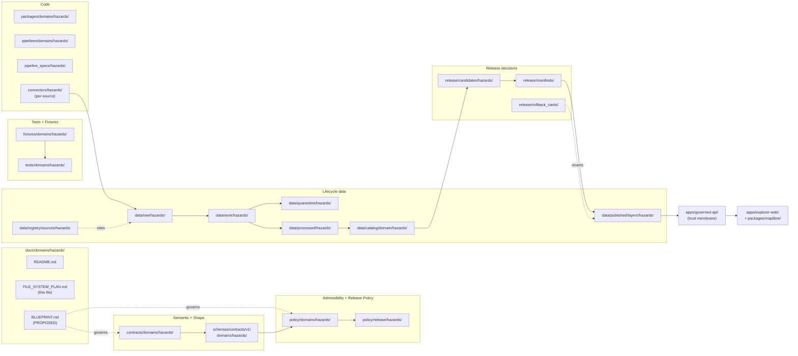

<!-- [KFM_META_BLOCK_V2]
doc_id: kfm://doc/docs-domains-hazards-file-system-plan
title: Hazards Domain — File System Plan
type: standard
version: v1
status: draft
owners: [hazards-domain-stewards, directory-rules-stewards]
created: 2026-05-17
updated: 2026-05-17
policy_label: public
related:
  - docs/domains/hazards/README.md
  - directory-rules.md
  - docs/adr/ADR-0001-schema-home.md
  - docs/registers/VERIFICATION_BACKLOG.md
  - docs/registers/DRIFT_REGISTER.md
tags: [kfm, hazards, directory, placement, plan]
notes:
  - All implementation-layer claims are PROPOSED until verified against a mounted repo.
  - This document plans placement; it does not authorize publication.
[/KFM_META_BLOCK_V2] -->

# 🌪️ Hazards Domain — File System Plan

> Authoritative placement plan for every Hazards-domain path across KFM responsibility roots, governed by Directory Rules §12 (Domain Placement Law) and the Hazards lane doctrine in the KFM Encyclopedia §7.10 and Atlas Ch. 12.


-blue)


**Status:** Draft · **Owners:** Hazards domain stewards + Directory Rules stewards · **Last updated:** 2026-05-17

> [!IMPORTANT]
> KFM is **not** an emergency alert system. Every Hazards path planned in this document inherits the life-safety boundary defined in the encyclopedia and Pass 20 idea `KFM-IDX-POL-007`: hazards layers carry historical, regulatory, modeled, and operational *context only*, and must redirect life-safety action to official sources.

---

## 📑 Contents

1. [Scope and intent](#1-scope-and-intent)
2. [Repo fit and authority basis](#2-repo-fit-and-authority-basis)
3. [What this plan owns — and what it does not](#3-what-this-plan-owns--and-what-it-does-not)
4. [Hazards lane structure (overview)](#4-hazards-lane-structure-overview)
5. [Directory tree (PROPOSED)](#5-directory-tree-proposed)
6. [Per-root path plan](#6-per-root-path-plan)
7. [Data lifecycle for the Hazards lane](#7-data-lifecycle-for-the-hazards-lane)
8. [Source-family admission plan](#8-source-family-admission-plan)
9. [Object-family placement crosswalk](#9-object-family-placement-crosswalk)
10. [Cross-lane relations](#10-cross-lane-relations)
11. [Validators, tests, and fixtures plan](#11-validators-tests-and-fixtures-plan)
12. [Publication, correction, and rollback file plan](#12-publication-correction-and-rollback-file-plan)
13. [Anti-patterns to avoid for this lane](#13-anti-patterns-to-avoid-for-this-lane)
14. [Open questions and verification backlog](#14-open-questions-and-verification-backlog)
15. [Related docs](#15-related-docs)

---

## 1. Scope and intent

This document is the **single placement-authority surface** for the Hazards domain in the KFM repository. It enumerates every path the Hazards lane is **expected** to occupy across responsibility roots, what each path owns, and the truth status of that path (CONFIRMED doctrine, PROPOSED placement, UNKNOWN materialization).

The plan exists to:

- Pre-decide path placement so domain PRs cite the Rules section justifying each path (Directory Rules §4 Step 5).
- Prevent the Hazards lane from drifting into a root folder (Domain Placement Law, Directory Rules §12).
- Keep observed / regulatory / modeled / administrative / aggregate / candidate / synthetic source roles in **separate** files, never collapsed into one (Atlas §24.1 anti-collapse register).
- Preserve the life-safety boundary at every surface: file layout reflects the boundary, not just text in a README.

This plan **does not**:

- Authorize publication of any artifact. Publication is governed by the release-state machine; promotion is a governed state transition, not a file move (Directory Rules §9.1).
- Override `directory-rules.md` or ADRs. Where this plan and the Rules disagree, the Rules win until an ADR amends them.
- Substitute for the per-root `README.md` files. Each path materialized here must still satisfy the README contract in Directory Rules §15.

> [!NOTE]
> Implementation-layer claims in this document (whether a path exists today, whether a CI workflow runs, whether a connector is wired) are **PROPOSED** unless explicitly checked against a mounted repository. No mounted repo was available in the authoring session.

[⬆ back to top](#-contents)

---

## 2. Repo fit and authority basis

| Aspect | Value | Status |
|---|---|---|
| This file's path | `docs/domains/hazards/FILE_SYSTEM_PLAN.md` | CONFIRMED placement under Directory Rules §12 |
| Responsibility root | `docs/` (human explanation) | CONFIRMED |
| Domain segment | `domains/hazards/` | CONFIRMED |
| Authority class | Doctrine companion to the Hazards `README.md` | PROPOSED |
| Governing rules | Directory Rules §§3, 4, 9, 12, 13, 15 | CONFIRMED |
| Governing doctrine | KFM Encyclopedia §7.10; Atlas Ch. 12 + §24.13 crosswalk; Pass 20 KFM-IDX-POL-007, KFM-IDX-PLN-002 | CONFIRMED |
| Authority order | Doctrine → ADRs → Directory Rules → per-root READMEs → this plan → repo convention | CONFIRMED (Directory Rules §2.1) |

> [!TIP]
> When a Hazards PR needs to cite the rule that justifies a path (Directory Rules §4 Step 5), it should cite **both** Directory Rules §12 **and** the relevant row of the [Per-root path plan](#6-per-root-path-plan) in this file.

[⬆ back to top](#-contents)

---

## 3. What this plan owns — and what it does not

### Accepted scope of this plan

- Lane-wide placement of Hazards files across `docs/`, `contracts/`, `schemas/`, `policy/`, `tests/`, `fixtures/`, `packages/`, `pipelines/`, `pipeline_specs/`, `data/`, `release/`, `runtime/`, and `connectors/`.
- Mapping of the Hazards source families (NOAA Storm Events, NWS, FEMA Disaster Declarations, FEMA NFHL, USGS earthquakes, USGS Water, NASA FIRMS, NOAA HMS, drought monitors, Kansas/local emergency context) into the `data/raw/hazards/<source_id>/` layout.
- Object-family placement crosswalk for `HazardEvent`, `HazardObservation`, `WarningContext`, `AdvisoryContext`, `DisasterDeclaration`, `FloodContext`, `WildfireDetection`, `SmokeContext`, `DroughtIndicator`, `EarthquakeEvent`, `HeatColdEvent`, `ExposureSummary`, `ResilienceSummary`, `HazardTimeline`, `ImpactArea` (encyclopedia §7.10C).
- Cross-lane placement guidance where Hazards files touch Hydrology, Atmosphere/Air, Roads/Rail, or Settlements/Infrastructure.

### Explicit non-scope

- Object **meaning** — owned by `contracts/domains/hazards/` (Markdown), not this plan.
- Object **shape** — owned by `schemas/contracts/v1/domains/hazards/` (JSON Schema), not this plan.
- Admissibility decisions — owned by `policy/domains/hazards/`, not this plan.
- Release decisions — owned by `release/`, not `data/published/`.
- Operational alerting — **never** owned by KFM. Out of system scope by doctrine.

[⬆ back to top](#-contents)

---

## 4. Hazards lane structure (overview)

The diagram below renders the responsibility-root lane pattern (Directory Rules §12) as applied to the Hazards domain. Edges show where files flow and where authority resides; the trust membrane is reproduced here because the Hazards lane interacts with operational source feeds and must respect it without exception.



> [!CAUTION]
> The map shell (`apps/explorer-web/`, `packages/maplibre/`) **must not** read directly from `data/raw/`, `data/work/`, `data/processed/`, or `data/catalog/`. Hazards layers reach the renderer only via released artifacts under `data/published/layers/hazards/` through the governed API. This is the trust membrane (Directory Rules §13.5 and §7.1).

[⬆ back to top](#-contents)

---

## 5. Directory tree (PROPOSED)

The tree below is **PROPOSED**: it expresses the intended Hazards-lane layout under Directory Rules §12. Materialization is **UNKNOWN** without a mounted repo. Per-source paths use a `<source_id>` placeholder; the SourceDescriptor decides the concrete id.

```text
Kansas-Frontier-Matrix/
├── docs/
│   └── domains/
│       └── hazards/
│           ├── README.md                       # PROPOSED — lane landing page
│           ├── FILE_SYSTEM_PLAN.md             # this file
│           └── BLUEPRINT.md                    # PROPOSED — full lane blueprint
├── contracts/
│   └── domains/
│       └── hazards/
│           ├── README.md                       # PROPOSED
│           ├── hazard_event.md
│           ├── hazard_observation.md
│           ├── warning_context.md
│           ├── advisory_context.md
│           ├── disaster_declaration.md
│           ├── flood_context.md
│           ├── wildfire_detection.md
│           ├── smoke_context.md
│           ├── drought_indicator.md
│           ├── earthquake_event.md
│           ├── heat_cold_event.md
│           ├── exposure_summary.md
│           ├── resilience_summary.md
│           ├── hazard_timeline.md
│           └── impact_area.md
├── schemas/
│   └── contracts/
│       └── v1/
│           └── domains/
│               └── hazards/
│                   ├── README.md
│                   ├── hazard_event.schema.json
│                   ├── hazard_observation.schema.json
│                   ├── warning_context.schema.json
│                   ├── advisory_context.schema.json
│                   ├── disaster_declaration.schema.json
│                   ├── flood_context.schema.json
│                   ├── wildfire_detection.schema.json
│                   ├── smoke_context.schema.json
│                   ├── drought_indicator.schema.json
│                   ├── earthquake_event.schema.json
│                   ├── heat_cold_event.schema.json
│                   ├── exposure_summary.schema.json
│                   ├── resilience_summary.schema.json
│                   ├── hazard_timeline.schema.json
│                   └── impact_area.schema.json
├── policy/
│   ├── domains/
│   │   └── hazards/
│   │       ├── README.md
│   │       ├── source_role_anti_collapse.rego        # PROPOSED
│   │       ├── operational_freshness.rego            # PROPOSED
│   │       ├── emergency_alert_denial.rego           # PROPOSED
│   │       └── sensitivity_join.rego                 # PROPOSED
│   └── release/
│       └── hazards/
│           ├── README.md
│           └── public_safe_release.rego              # PROPOSED
├── tests/
│   └── domains/
│       └── hazards/
│           ├── README.md
│           ├── test_source_role_anti_collapse.py
│           ├── test_temporal_role.py
│           ├── test_emergency_alert_denial.py
│           ├── test_operational_expiry_freshness.py
│           ├── test_catalog_closure.py
│           ├── test_evidence_drawer_disclaimer.py
│           └── test_ui_no_direct_source.py
├── fixtures/
│   └── domains/
│       └── hazards/
│           ├── valid/
│           │   ├── historical_flood_event/
│           │   ├── nfhl_context/
│           │   └── exposure_summary/
│           └── invalid/
│               ├── modeled_labeled_observed/
│               ├── regulatory_labeled_observed/
│               ├── expired_warning_as_current/
│               └── uncited_focus_mode_answer/
├── packages/
│   └── domains/
│       └── hazards/
│           ├── README.md
│           └── src/                                  # PROPOSED — shared lib code
├── pipelines/
│   └── domains/
│       └── hazards/
│           ├── README.md
│           └── ingest_normalize_promote/             # PROPOSED
├── pipeline_specs/
│   └── hazards/
│       ├── README.md
│       └── <source_id>.yaml                          # PROPOSED — one per source
├── connectors/
│   └── hazards/
│       ├── README.md
│       ├── noaa_storm_events/
│       ├── nws_api/
│       ├── fema_disaster_declarations/
│       ├── fema_nfhl/
│       ├── usgs_earthquake/
│       ├── usgs_water/
│       ├── nasa_firms/
│       ├── noaa_hms/
│       ├── drought_monitor/
│       └── ks_emergency_context/
├── data/
│   ├── raw/hazards/<source_id>/<run_id>/
│   ├── work/hazards/<run_id>/
│   ├── quarantine/hazards/<reason>/<run_id>/
│   ├── processed/hazards/<dataset_id>/<version>/
│   ├── catalog/domain/hazards/
│   ├── triplets/                                     # cross-domain; no hazards/ segment here
│   ├── receipts/                                     # cross-domain; per Directory Rules §9.1
│   ├── proofs/
│   ├── published/layers/hazards/
│   ├── rollback/hazards/<release_id>/
│   └── registry/sources/hazards/
└── release/
    ├── candidates/hazards/
    ├── manifests/                                    # cross-domain; one manifest per release_id
    ├── rollback_cards/
    └── correction_notices/
```

> [!NOTE]
> Cross-cutting roots (`data/triplets/`, `data/receipts/`, `data/proofs/`, `release/manifests/`, `release/rollback_cards/`, `release/correction_notices/`) **do not** carry a `hazards/` segment. They are repo-wide and refer to Hazards content via identifiers (release_id, evidence_bundle_id, etc.), not directory segmentation. This follows Directory Rules §9.

[⬆ back to top](#-contents)

---

## 6. Per-root path plan

The table below enumerates every Hazards-domain path, what it owns, the rule that justifies it, and its truth status. Status reflects placement doctrine, not materialization.

### 6.1 Human explanation — `docs/`

| Path | Owns | Rule basis | Status |
|---|---|---|---|
| `docs/domains/hazards/README.md` | Hazards lane landing page; mini-TOC; links to all other Hazards files. | DR §6.1, §12 | PROPOSED |
| `docs/domains/hazards/FILE_SYSTEM_PLAN.md` | This file. | DR §6.1, §12, §16 | CONFIRMED placement |
| `docs/domains/hazards/BLUEPRINT.md` | Full domain blueprint (encyclopedia §7.10 in repo-native form). | DR §6.1, §12 | PROPOSED |
| `docs/runbooks/hazards/SOURCE_REFRESH_RUNBOOK.md` | Source-refresh runbook (Hazards). Subfolder convention pending ADR. | DR §6.1 | PROPOSED · NEEDS VERIFICATION |
| `docs/runbooks/hazards/ROLLBACK_DRILL.md` | Hazards rollback drill runbook. | DR §6.1 | PROPOSED |

### 6.2 Object meaning — `contracts/`

| Path | Owns | Rule basis | Status |
|---|---|---|---|
| `contracts/domains/hazards/` | Markdown semantic definitions for each Hazards object family. | DR §6.3, §12 | PROPOSED |
| `contracts/domains/hazards/README.md` | Per-root README per DR §15. | DR §15 | PROPOSED |
| 15 × `<object_family>.md` | One per object family in encyclopedia §7.10C. | DR §6.3 | PROPOSED |

### 6.3 Object shape — `schemas/`

| Path | Owns | Rule basis | Status |
|---|---|---|---|
| `schemas/contracts/v1/domains/hazards/` | Canonical JSON Schema home for Hazards (ADR-0001). | DR §6.4, ADR-0001 | CONFIRMED placement · PROPOSED materialization |
| 15 × `<object_family>.schema.json` | One schema per object family. | DR §6.4 | PROPOSED |
| `schemas/tests/valid/hazards/`, `schemas/tests/invalid/hazards/` | Shape-level positive/negative fixtures. | DR §6.4 | PROPOSED |

> [!WARNING]
> The shape home is **`schemas/contracts/v1/domains/hazards/`**, not `contracts/domains/hazards/*.schema.json`. ADR-0001 makes the schemas home canonical; a `*.schema.json` under `contracts/` is **lineage / CONFLICTED** and must be migrated. Hazards PRs that introduce schema files under `contracts/` should be rejected absent a superseding ADR.

### 6.4 Admissibility and release — `policy/`

| Path | Owns | Rule basis | Status |
|---|---|---|---|
| `policy/domains/hazards/` | Domain-specific admissibility policy (source roles, freshness, sensitivity). | DR §6.5, §12 | PROPOSED |
| `policy/release/hazards/` | Release-gate policy for Hazards (public-safe transforms, official-source referral). | DR §6.5; Atlas §24.13 | PROPOSED |
| `policy/sensitivity/hazards/` | Sensitivity classes specific to Hazards joins (e.g., infrastructure × hazard exposure). | DR §6.5 | PROPOSED — only if cross-cutting policy bundle is insufficient |

### 6.5 Tests and fixtures

| Path | Owns | Rule basis | Status |
|---|---|---|---|
| `tests/domains/hazards/` | Validator-bearing tests for Hazards (encyclopedia §7.10K). | DR §6.6, §12 | PROPOSED |
| `fixtures/domains/hazards/valid/` | Public-safe positive fixtures. | DR §6.6 | PROPOSED |
| `fixtures/domains/hazards/invalid/` | Negative fixtures: anti-collapse, expiry, uncited, modeled-labeled-observed. | DR §6.6 | PROPOSED |

### 6.6 Code — `packages/`, `pipelines/`, `pipeline_specs/`, `connectors/`

| Path | Owns | Rule basis | Status |
|---|---|---|---|
| `packages/domains/hazards/` | Shared library code for Hazards (used by pipelines, governed API). | DR §7.2, §12 | PROPOSED |
| `pipelines/domains/hazards/` | Executable pipeline logic (ingest → normalize → quarantine/processed → catalog → release candidate). | DR §7.4, §12 | PROPOSED |
| `pipeline_specs/hazards/` | Declarative pipeline configuration per source. | DR §7.4 | PROPOSED |
| `connectors/hazards/<source_id>/` | Source-specific fetchers/admitters; output goes to `data/raw/` or `data/quarantine/`. | DR §7.3 | PROPOSED |

### 6.7 Lifecycle data — `data/`

| Path | Owns | Rule basis | Status |
|---|---|---|---|
| `data/raw/hazards/<source_id>/<run_id>/` | Source-edge captures with retrieval metadata and checksums. | DR §9.1 | PROPOSED |
| `data/work/hazards/<run_id>/` | Normalized intermediates and candidate assertions. | DR §9.1 | PROPOSED |
| `data/quarantine/hazards/<reason>/<run_id>/` | Failed validation; unresolved rights/sensitivity; expired operational context. | DR §9.1 | PROPOSED |
| `data/processed/hazards/<dataset_id>/<version>/` | Validated canonical records. | DR §9.1 | PROPOSED |
| `data/catalog/domain/hazards/` | STAC/DCAT/PROV records and domain catalog entries. | DR §9.1 | PROPOSED |
| `data/published/layers/hazards/` | Released public-safe artifacts (PMTiles, GeoJSON, etc.). | DR §9.1 | PROPOSED |
| `data/registry/sources/hazards/` | Append-only Hazards source registry. | DR §9.1 | PROPOSED |
| `data/rollback/hazards/<release_id>/` | Alias-revert receipts (data plane). | DR §9.1 | PROPOSED |

### 6.8 Release decisions — `release/`

Release roots do **not** carry per-domain segmentation by directory; they segment by release_id. Hazards content is identified via release manifest contents, not by directory location.

| Path | Owns | Rule basis | Status |
|---|---|---|---|
| `release/candidates/hazards/` | Release candidate dossiers for Hazards. | DR §9.2, §12 | PROPOSED |
| `release/manifests/<release_id>/` | ReleaseManifest records (cross-domain). | DR §9.2 | PROPOSED |
| `release/rollback_cards/<release_id>/` | Rollback decision artifacts (cross-domain). | DR §9.2 | PROPOSED |
| `release/correction_notices/<release_id>/` | Public correction notices (cross-domain). | DR §9.2 | PROPOSED |

[⬆ back to top](#-contents)

---

## 7. Data lifecycle for the Hazards lane

The lifecycle invariant **RAW → WORK / QUARANTINE → PROCESSED → CATALOG / TRIPLET → PUBLISHED** is CONFIRMED doctrine (Directory Rules §9.1; encyclopedia §7.10H; Atlas §24.6). The table below records the Hazards-specific gating that each transition adds on top of the universal gates.

| Stage | Hazards-specific entrance gate | Required artifacts (PROPOSED) | Fail-closed outcome |
|---|---|---|---|
| **RAW** | SourceDescriptor present; source role recorded as one of *observed / regulatory / modeled / administrative / aggregate / candidate / context*; rights & retrieval metadata captured. | `data/registry/sources/hazards/<source_id>.json`; per-run receipt under `data/receipts/ingest/`. | Source not admitted; logged as candidate. |
| **WORK / QUARANTINE** | Source-role anti-collapse holds; expiry/freshness for operational items present; sensitivity joins resolved. | TransformReceipt; ValidationReport (working set); PolicyDecision. | Quarantine with structured reason. |
| **PROCESSED** | Schema-valid; temporal fields preserved (event / valid / issue / expiry / source / retrieval / release); sensitivity-redaction receipt where applicable. | ValidationReport pass; RedactionReceipt if applies. | Stay in WORK; structured FAIL. |
| **CATALOG / TRIPLET** | EvidenceRefs resolve to EvidenceBundles; catalog digest closes; cross-lane joins preserve ownership and source role. | CatalogMatrix entry; EvidenceBundle; optional graph projections. | HOLD at PROCESSED; no public edge. |
| **PUBLISHED** | Public-safe transform receipt present; **life-safety boundary disclaimer** present in layer manifest; official-source referral target recorded; review state where required; release authority separate from author when materiality applies. | ReleaseManifest; rollback target; correction path; ReviewRecord (if required). | HOLD at CATALOG; no public surface change. |

> [!CAUTION]
> **Expired operational context cannot appear as current warning state.** This is the single most consequential failure mode in the Hazards lane (encyclopedia §7.10I). The path-level expression of this rule is: a Hazards layer in `data/published/layers/hazards/` whose payload contains an `expiry` past the current clock must be either (a) re-released with a corrected payload, (b) withdrawn via `release/withdrawal_notices/`, or (c) rolled back via `release/rollback_cards/`. The renderer must not display an expired warning as live.

[⬆ back to top](#-contents)

---

## 8. Source-family admission plan

All Hazards source families are CONFIRMED at the doctrine level (encyclopedia §7.10B; Atlas Ch. 12 §D). Their **role per release** is set at admission and preserved through every promotion. The Atlas explicitly lists each as carrying potentially multiple of *authority / observation / context / model* — KFM does **not** treat these as interchangeable, even when one source provides material in more than one role.

| Source family | Primary intended role(s) | `connectors/hazards/<id>/` | `data/registry/sources/hazards/<id>.json` | Rights status | Status |
|---|---|---|---|---|---|
| NOAA Storm Events / NCEI | observation / aggregate | `noaa_storm_events/` | yes | NEEDS VERIFICATION | PROPOSED |
| NWS API (alerts/warnings/advisories/watches) | operational context (never live alerting) | `nws_api/` | yes | NEEDS VERIFICATION | PROPOSED |
| FEMA Disaster Declarations / OpenFEMA | administrative / regulatory | `fema_disaster_declarations/` | yes | NEEDS VERIFICATION | PROPOSED |
| FEMA NFHL / MSC | **regulatory** (never labeled "observed flood") | `fema_nfhl/` | yes | NEEDS VERIFICATION | PROPOSED |
| USGS Earthquake Catalog | observation | `usgs_earthquake/` | yes | NEEDS VERIFICATION | PROPOSED |
| USGS Water (flood/drought context) | observation / context | `usgs_water/` | yes | NEEDS VERIFICATION | PROPOSED |
| NASA FIRMS active fire | observation (remote-sensing detection) | `nasa_firms/` | yes | NEEDS VERIFICATION | PROPOSED |
| NOAA HMS Fire and Smoke | observation (remote-sensing detection) / model derivative | `noaa_hms/` | yes | NEEDS VERIFICATION | PROPOSED |
| Drought monitors | aggregate / context | `drought_monitor/` | yes | NEEDS VERIFICATION | PROPOSED |
| Kansas / local emergency context | administrative / context | `ks_emergency_context/` | yes | NEEDS VERIFICATION | PROPOSED |

> [!IMPORTANT]
> **Anti-collapse rule (Atlas §24.1.2):** Regulatory NFHL geometry must never be released or queried as observed flood inundation. A regulatory layer labeled as an observed event is a DENY condition at publication and an ABSTAIN condition at AI surfaces. The path-level expression is that `data/published/layers/hazards/nfhl/` and `data/published/layers/hazards/flood_event/` are **separate** layer roots with separate manifests; a unified "flood" layer is forbidden by doctrine.

[⬆ back to top](#-contents)

---

## 9. Object-family placement crosswalk

Every Hazards object family from encyclopedia §7.10C has a uniform placement pattern. Each family appears in: one Markdown contract file, one JSON Schema file, optional policy specialization, and at minimum one valid and one invalid fixture set.

<details>
<summary>Click to expand the object-family placement crosswalk</summary>

| Object family | `contracts/.../` (meaning) | `schemas/.../` (shape) | Fixtures | Policy specialization |
|---|---|---|---|---|
| `HazardEvent` | `hazard_event.md` | `hazard_event.schema.json` | yes | source-role anti-collapse |
| `HazardObservation` | `hazard_observation.md` | `hazard_observation.schema.json` | yes | temporal-role, freshness |
| `WarningContext` | `warning_context.md` | `warning_context.schema.json` | yes | **expiry**, life-safety boundary |
| `AdvisoryContext` | `advisory_context.md` | `advisory_context.schema.json` | yes | **expiry**, life-safety boundary |
| `DisasterDeclaration` | `disaster_declaration.md` | `disaster_declaration.schema.json` | yes | administrative-not-observed |
| `FloodContext` | `flood_context.md` | `flood_context.schema.json` | yes | regulatory-not-observed (NFHL) |
| `WildfireDetection` | `wildfire_detection.md` | `wildfire_detection.schema.json` | yes | candidate-not-confirmed |
| `SmokeContext` | `smoke_context.md` | `smoke_context.schema.json` | yes | model-not-observed |
| `DroughtIndicator` | `drought_indicator.md` | `drought_indicator.schema.json` | yes | aggregate-not-per-place |
| `EarthquakeEvent` | `earthquake_event.md` | `earthquake_event.schema.json` | yes | observation-with-uncertainty |
| `HeatColdEvent` | `heat_cold_event.md` | `heat_cold_event.schema.json` | yes | observation-with-uncertainty |
| `ExposureSummary` | `exposure_summary.md` | `exposure_summary.schema.json` | yes | derived; infrastructure sensitivity |
| `ResilienceSummary` | `resilience_summary.md` | `resilience_summary.schema.json` | yes | derived; review state |
| `HazardTimeline` | `hazard_timeline.md` | `hazard_timeline.schema.json` | yes | role-aware composition |
| `ImpactArea` | `impact_area.md` | `impact_area.schema.json` | yes | infrastructure sensitivity |

All identity rules follow the PROPOSED deterministic basis from Atlas Ch. 12 §E: `source id + object role + temporal scope + normalized digest`. All families preserve distinct *source, observed, valid, retrieval, release, and correction* times where material (CONFIRMED).

</details>

[⬆ back to top](#-contents)

---

## 10. Cross-lane relations

Hazards files routinely interact with adjacent lanes. Cross-lane files **do not** live under `docs/domains/hazards/`; they live under the lowest common responsibility root **without** a domain segment (Directory Rules §12, Multi-domain and cross-cutting files).

| Adjacent lane | Typical relation | Where the cross-cutting file lives | Constraint |
|---|---|---|---|
| Hydrology | Flood/drought/water-event context with role separation. | `tools/validators/hydrology-hazards/` for joins; `schemas/contracts/v1/relations/` for relation shape. | Ownership preserved per lane; EvidenceBundle support required. |
| Atmosphere / Air | Smoke, heat/cold, AQI/advisory, wind, fire-weather context. | `tools/validators/air-hazards/` for joins. | Knowledge-character labels remain inspectable. |
| Settlements / Infrastructure | Exposure, lifelines, dependencies. | `policy/sensitivity/infrastructure/` continues to govern critical-asset exposure; Hazards exposure files cite but do not re-author. | Infrastructure sensitivity is a DENY-by-default lane. |
| Roads / Rail | Closures, detours, bridge/crossing exposure, resilience. | `packages/domains/transport/` continues to own network identity; Hazards files cite. | No back-channel rewriting of transport identity from a Hazards file. |

> [!TIP]
> When in doubt about where a Hazards-touching file lives: if it carries Hazards-specific semantics, place under `…/domains/hazards/`. If it merely reads from or cites Hazards content as one of several inputs, place under the cross-cutting root and treat Hazards as a citation, not a parent folder.

[⬆ back to top](#-contents)

---

## 11. Validators, tests, and fixtures plan

The Hazards validator backlog is CONFIRMED at the doctrine level (encyclopedia §7.10K; Atlas Ch. 12 §K). The table below maps each validator to its planned file home, the negative fixture that would prove it enforceable, and its truth status.

| Validator | Test file | Negative fixture | Status |
|---|---|---|---|
| Source-role anti-collapse | `tests/domains/hazards/test_source_role_anti_collapse.py` | `fixtures/domains/hazards/invalid/modeled_labeled_observed/` | PROPOSED |
| Source-role anti-collapse (regulatory) | same | `fixtures/domains/hazards/invalid/regulatory_labeled_observed/` | PROPOSED |
| Temporal-role validator | `tests/domains/hazards/test_temporal_role.py` | `fixtures/domains/hazards/invalid/temporal_role_swap/` | PROPOSED |
| Emergency-alert denial | `tests/domains/hazards/test_emergency_alert_denial.py` | `fixtures/domains/hazards/invalid/focus_mode_as_alert/` | PROPOSED |
| Operational expiry / freshness | `tests/domains/hazards/test_operational_expiry_freshness.py` | `fixtures/domains/hazards/invalid/expired_warning_as_current/` | PROPOSED |
| Catalog closure | `tests/domains/hazards/test_catalog_closure.py` | `fixtures/domains/hazards/invalid/unresolved_evidence_ref/` | PROPOSED |
| Evidence Drawer disclaimer present | `tests/domains/hazards/test_evidence_drawer_disclaimer.py` | `fixtures/domains/hazards/invalid/drawer_missing_disclaimer/` | PROPOSED |
| UI no-direct-source | `tests/domains/hazards/test_ui_no_direct_source.py` | `fixtures/domains/hazards/invalid/ui_reads_raw_directly/` | PROPOSED |
| No-network fixture-first | covered by all of the above | n/a | PROPOSED |

> [!NOTE]
> Repo-wide validators that already exist (e.g., `tools/validators/validate_spec_hash.py`, `tools/validators/validate_attestation_ref.py`) **stay** under `tools/validators/` and are not duplicated into the Hazards lane. The lane-specific tests above wrap them, parameterized on Hazards fixtures.

[⬆ back to top](#-contents)

---

## 12. Publication, correction, and rollback file plan

| Concern | Path | Owner | Status |
|---|---|---|---|
| Release candidate dossier | `release/candidates/hazards/<release_id>/` | Hazards stewards + release authority | PROPOSED |
| ReleaseManifest | `release/manifests/<release_id>/manifest.json` | release authority | PROPOSED |
| Promotion decision | `release/promotion_decisions/<release_id>/` | release authority | PROPOSED |
| Rollback card | `release/rollback_cards/<release_id>/` | release authority | PROPOSED |
| Correction notice | `release/correction_notices/<release_id>/` | release authority + Hazards stewards | PROPOSED |
| Withdrawal notice | `release/withdrawal_notices/<release_id>/` | release authority | PROPOSED |
| Signed attestations | `release/signatures/<release_id>/` | release authority | PROPOSED |
| Alias-revert receipts (data plane) | `data/rollback/hazards/<release_id>/` | pipeline owner | PROPOSED |

> [!WARNING]
> **Release decisions** live in `release/`; **released artifacts** live in `data/published/`. Mixing the two is a Directory Rules §13.2 anti-pattern. A Hazards ReleaseManifest never appears under `data/published/layers/hazards/`; a published PMTiles never appears under `release/`.

[⬆ back to top](#-contents)

---

## 13. Anti-patterns to avoid for this lane

The general anti-patterns in Directory Rules §13 apply universally. Below are the four that have repeatedly bitten Hazards-style work in domain-lane reports and that should be treated as **lane-specific WARNING signals**.

| Anti-pattern | Symptom in the Hazards lane | Fix |
|---|---|---|
| Hazards becoming a root folder | `hazards/` at repo root with its own `data/`, `schemas/`, `policy/`, `docs/` subtree. | Apply Domain Placement Law (DR §12). Migrate into the lane pattern; preserve `docs/domains/hazards/README.md`. |
| Source-role collapse | NFHL regulatory polygons released as "observed flood" or merged into a single flood layer. | DENY at publication. Separate `data/published/layers/hazards/nfhl/` and `data/published/layers/hazards/flood_event/`; banner in UI; preserve `source_role` field in DTO. |
| Operational feed → alerting drift | A NWS warning layer rendered without expiry/source/disclaimer, or read directly by the UI. | Map shell reads only `data/published/layers/hazards/...` via the governed API. WarningContext / AdvisoryContext payloads carry `expiry`, `source`, `not_emergency_alert_system: true`, and an `official_source_url`. |
| Watcher publishes | An environmental-source watcher writes directly into `data/catalog/` or `data/published/`. | Watcher-as-non-publisher invariant (DR §13.5). Watchers emit receipts and candidate decisions into the pre-RAW envelope only. |

[⬆ back to top](#-contents)

---

## 14. Open questions and verification backlog

Each item below is checkable against a mounted repository or by ADR. None should be silently resolved by this plan.

| Item | What would settle it | Status |
|---|---|---|
| Whether `docs/domains/hazards/` already contains a `README.md` and `BLUEPRINT.md` in the live repo. | `ls docs/domains/hazards/` against a mounted repo. | UNKNOWN |
| Whether `docs/runbooks/<domain>/` (subfolder) or `docs/runbooks/<domain>_<topic>.md` (flat-prefix) is the chosen convention. | Open ADR; cross-reference with `docs/runbooks/fauna/SOURCE_REFRESH_RUNBOOK.md`. | NEEDS VERIFICATION |
| Whether `policy/sensitivity/hazards/` is needed alongside `policy/release/hazards/`, or whether cross-cutting `policy/sensitivity/` is sufficient. | Inspect `policy/` tree; resolve by ADR. | UNKNOWN |
| Whether `data/registry/sources/hazards/` or `data/registry/hazards/` is the chosen form. Directory Rules §4 Step 3 allows either; DR §9.1 uses `sources/`. | Inspect `data/registry/`; freeze by ADR. | NEEDS VERIFICATION |
| Hazards source rights (NOAA Storm Events, NWS, FEMA Disaster Declarations, NFHL, USGS, NASA FIRMS, drought monitors, Kansas/local). | Source-terms review per source; record in `data/registry/sources/hazards/<id>.json`. | NEEDS VERIFICATION |
| Whether `triplets/` (plural) or `triplet/` (singular) wins in `data/`. This plan uses **`triplets/`** consistently with Directory Rules §9.1. | One-line ADR. | OPEN |
| Whether per-source `pipeline_specs/hazards/<source_id>.yaml` is one file per source or one file per `<source_id>.<run_kind>`. | Inspect existing `pipeline_specs/` examples (none assumed visible). | UNKNOWN |
| Whether `connectors/hazards/` is grouped by source (as proposed) or flat (`connectors/noaa_storm_events/`). DR §7.3 does not mandate either. | Inspect `connectors/` tree; freeze by ADR. | NEEDS VERIFICATION |
| Whether a Hazards-specific `docs/architecture/hazards-trust-membrane.md` is warranted, or whether the cross-cutting trust-membrane doc suffices. | Inspect `docs/architecture/`. | OPEN |

> [!NOTE]
> Items marked `UNKNOWN` cannot be resolved without a mounted repo. Items marked `NEEDS VERIFICATION` are checkable and should be lifted into `docs/registers/VERIFICATION_BACKLOG.md` in the same PR that adopts this plan.

[⬆ back to top](#-contents)

---

## 15. Related docs

- [`directory-rules.md`](../../../directory-rules.md) — root Directory Rules; authoritative for placement.
- [`docs/domains/hazards/README.md`](./README.md) — Hazards lane landing page (PROPOSED).
- [`docs/domains/hazards/BLUEPRINT.md`](./BLUEPRINT.md) — Full Hazards lane blueprint (PROPOSED).
- [`docs/runbooks/hazards/SOURCE_REFRESH_RUNBOOK.md`](../../runbooks/hazards/SOURCE_REFRESH_RUNBOOK.md) — Hazards source refresh procedure (PROPOSED; subfolder convention pending ADR).
- [`docs/adr/ADR-0001-schema-home.md`](../../adr/ADR-0001-schema-home.md) — Canonical home for JSON Schemas; binding for the `schemas/` rows above.
- [`docs/registers/VERIFICATION_BACKLOG.md`](../../registers/VERIFICATION_BACKLOG.md) — Where the §14 backlog items should be lifted.
- [`docs/registers/DRIFT_REGISTER.md`](../../registers/DRIFT_REGISTER.md) — Where any conflict between this plan and the live repo should be filed.
- [`docs/standards/PROV.md`](../../standards/PROV.md) — Provenance profile that EvidenceBundles referenced here must satisfy.

---

<sub><sup>Last updated: 2026-05-17 · Doc version: v1 · Status: draft · [⬆ back to top](#-contents)</sup></sub>
