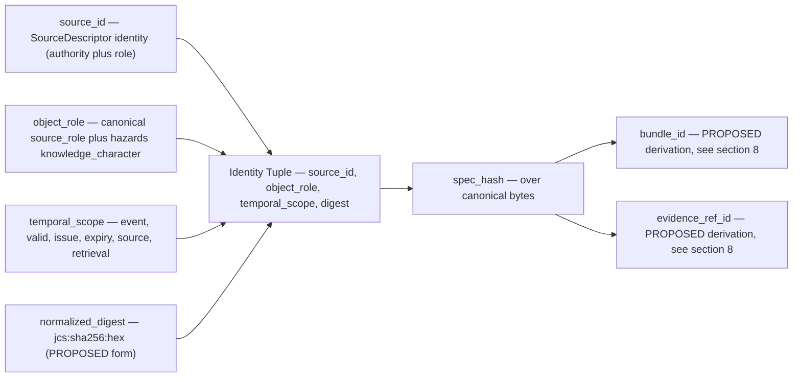
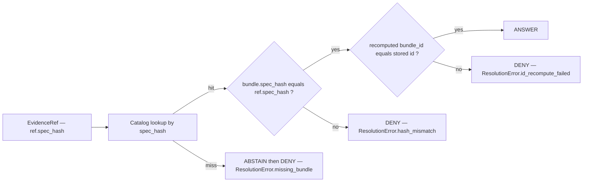

<!-- [KFM_META_BLOCK_V2]
doc_id: kfm://doc/hazards-identity-model
title: Hazards Identity Model
type: standard
version: v2
status: draft
owners: <TBD: Hazards Domain Steward; Trust Architecture Steward>
created: 2026-05-17
updated: 2026-06-05
policy_label: public
contract_version: "3.0.0"
related:
  - ai-build-operating-contract.md
  - directory-rules.md
  - docs/domains/hazards/README.md
  - docs/domains/hazards/DATA_LIFECYCLE.md
  - docs/domains/hazards/GLOSSARY.md
  - docs/architecture/source-role-anti-collapse.md
  - docs/standards/PROV.md
  - docs/standards/CANONICALIZATION.md
  - schemas/contracts/v1/domains/hazards/
  - contracts/domains/hazards/
  - policy/domains/hazards/
tags: [kfm, hazards, identity, evidence, source-role, temporal-scope]
notes:
  - CONTRACT_VERSION pinned at 3.0.0 per ai-build-operating-contract.md v3.0.
  - CONFIRMED doctrine derives from DOM-HAZ §§12.E, 24.1 and ENCY §7.10.
  - PROPOSED implementation specifics (paths, validator names, ID derivation) until repo evidence is mounted.
  - Hazards is NOT an emergency alert system; this document constrains identity, not alerting.
  - v2 flags OQ-HAZ-IM-01 — operational-context source-role (administrative vs observed vs context) is CONFLICTED across the Hazards lane docs.
[/KFM_META_BLOCK_V2] -->

# Hazards Identity Model

> What makes a Hazards object **the same object** — and what makes it a different one — across sources, roles, time, and releases.


**Status:** draft · **Owners:** `<TBD: Hazards Domain Steward; Trust Architecture Steward>` · **Contract:** `CONTRACT_VERSION = "3.0.0"` · **Last updated:** 2026-06-05

---

## Contents

- [1. Purpose & scope](#1-purpose--scope)
- [2. What identity means in Hazards](#2-what-identity-means-in-hazards)
- [3. Identity primitives](#3-identity-primitives)
- [4. Per-object identity rule](#4-per-object-identity-rule)
- [5. Source-role and identity (anti-collapse)](#5-source-role-and-identity-anti-collapse)
- [6. Temporal scope and identity](#6-temporal-scope-and-identity)
- [7. Geography versioning and identity](#7-geography-versioning-and-identity)
- [8. Deterministic ID derivation (PROPOSED)](#8-deterministic-id-derivation-proposed)
- [9. Resolution and gates](#9-resolution-and-gates)
- [10. Failure modes and outcomes](#10-failure-modes-and-outcomes)
- [11. Cross-lane identity boundaries](#11-cross-lane-identity-boundaries)
- [12. Worked examples (illustrative)](#12-worked-examples-illustrative)
- [13. Validators, tests, fixtures](#13-validators-tests-fixtures)
- [14. Open questions register](#14-open-questions-register)
- [15. Verification backlog](#15-verification-backlog)
- [16. Changelog](#16-changelog)
- [17. Definition of done](#17-definition-of-done)
- [18. Related docs](#18-related-docs)
- [Appendix A — Identity primitives reference](#appendix-a--identity-primitives-reference)
- [Appendix B — Hazards knowledge-character labels](#appendix-b--hazards-knowledge-character-labels)

---

## 1. Purpose & scope

This document defines the **identity model** for the Hazards domain — the rules that determine when two Hazards records refer to the same object, when they refer to different objects, and how stable, content-addressable identifiers are derived from evidence. It does not define alerting behavior, public release policy, or rendering rules; those live in adjacent documents.

> [!IMPORTANT]
> KFM Hazards is **not an emergency alert system** and must not provide life-safety instructions. This document constrains *what an object is*; it does not authorize life-safety messaging. See [`docs/domains/hazards/README.md`](./README.md) for the lane boundary and DOM-HAZ §12.B for the explicit non-ownership statement.

**In scope.** Identity rules for the Hazards object families enumerated in DOM-HAZ §12.E and ENCY §7.10; deterministic ID derivation; source-role and temporal-scope contributions to identity; failure modes that produce `ABSTAIN` / `DENY`; resolution from `EvidenceRef` to `EvidenceBundle`.

**Out of scope.** Field-level schemas (live under `schemas/contracts/v1/domains/hazards/`); admissibility and release policy (lives under `policy/domains/hazards/`); rendering and viewing products (live under map / UI documents); life-safety alerting (explicitly denied, full stop).

| Attribute | Value | Status |
|---|---|---|
| Authority for this document | Hazards Domain Steward (doctrine: DOM-HAZ) | CONFIRMED |
| Authority for ID format | Trust Architecture Steward (canonicalization doctrine) | CONFIRMED concept / PROPOSED derivation |
| Authority for schema home | ADR-0001; `schemas/contracts/v1/domains/hazards/` | CONFIRMED placement (§12) / PROPOSED materialization |
| Authority for placement of this doc | Directory Rules §12 (Domain Placement Law) | CONFIRMED |
| Contract pin | `CONTRACT_VERSION = "3.0.0"` | CONFIRMED |

[Back to top](#hazards-identity-model)

---

## 2. What identity means in Hazards

In Hazards, identity is the answer to the question: *given two records, are they the same object?* The answer cannot rest on shared attributes alone, because hazards data arrives from many sources playing different roles, at different times, with overlapping spatial extents. A 1991 tornado in Andover, Kansas may appear as:

- a **NOAA Storm Events** record (observed history),
- a **FEMA disaster declaration** referencing the same event window (administrative),
- a **reconstructed swath** in a model run (modeled),
- a long-form **resilience analysis** that cites the event (aggregate / derived),
- a **steward-curated** corrected version after a property-damage revision (corrected observed).

> [!NOTE]
> These are five different objects in KFM Hazards. They cite the **same physical event**, but each carries a different source, a different role, and a different evidentiary obligation. Collapsing them into one identity destroys the system's ability to reason about source-role, freshness, and rollback — which is exactly the anti-collapse rule in Atlas §24.1.2.

Identity therefore answers a narrower question: *given two records that purport to describe the same evidence in the same role over the same time window, are their normalized contents byte-equivalent?* If yes, they are the same identity. If not, they are different identities — even if they describe the same physical phenomenon.

The Hazards identity rule (CONFIRMED doctrine, Atlas §12.E):

> **PROPOSED deterministic basis:** `source id + object role + temporal scope + normalized digest`.
> **CONFIRMED temporal handling:** source, observed, valid, retrieval, release, and correction times stay distinct where material.

The remainder of this document operationalizes that one-line rule.

[Back to top](#hazards-identity-model)

---

## 3. Identity primitives

Hazards identity composes four primitives. Each is a CONFIRMED concept in KFM doctrine; the field names and serializations below are PROPOSED until verified against mounted schemas.



| Primitive | What it captures | Where it comes from | Status |
|---|---|---|---|
| `source_id` | The admitted source's stable identity (e.g., NOAA Storm Events feed, FEMA OpenFEMA declarations) | `SourceDescriptor` at RAW admission | CONFIRMED doctrine / PROPOSED field shape |
| `object_role` | The role this record plays *for this source* — canonical source-role enum + hazards knowledge-character label | `SourceDescriptor.source_role` + hazards label vocabulary | CONFIRMED doctrine (vocabulary reconciliation NEEDS VERIFICATION — see [§5](#5-source-role-and-identity-anti-collapse)) |
| `temporal_scope` | The time-tuple that uniquely scopes this record (event/valid/issue/expiry — not retrieval or release) | Source feed fields, normalized at WORK | CONFIRMED doctrine / PROPOSED normalization |
| `normalized_digest` | A deterministic content digest computed via canonical JSON + SHA-256 | canonicalization validator (PROPOSED) | CONFIRMED concept / PROPOSED form |

> [!TIP]
> The four primitives are independent. Identity is the **tuple**, not any single field. Two records that share three primitives but differ on the fourth are different identities.

[Back to top](#hazards-identity-model)

---

## 4. Per-object identity rule

Every object family in Atlas §12.E carries the same shape of identity rule, with family-specific specifics for which fields participate in `temporal_scope` and which `object_role` values are admissible.

> [!CAUTION]
> **The `object_role` column for operational-context families is CONFLICTED.** This document maps `WarningContext` / `AdvisoryContext` to `administrative`. The sibling `DATA_LIFECYCLE.md` treats operational warnings as `context`-posture carriers, and `EXPANSION_PLAN.md` maps them to `observed` (flagged there as OQ-HAZ-EP-01). The canonical seven-role register (Atlas §24.1.1) has **no `context` role**, so the carrier must take one of the seven — but *which* one is unsettled across the lane. Treat the `administrative` mapping below as **PROPOSED**, not settled. Resolution: ADR. Tracked here as **OQ-HAZ-IM-01** (shared with OQ-HAZ-EP-01 / OQ-HAZ-GL-01).

| Object family | Identity rule | Dominant `object_role` values | Temporal handling | Status |
|---|---|---|---|---|
| `HazardEvent` | `{source_id, role, temporal_scope, digest}` | `observed`, `modeled` (reconstructed) | event_time + (valid window when bounded); source / retrieval / release / correction stay distinct | CONFIRMED doctrine / PROPOSED |
| `HazardObservation` | same shape | `observed` | observed_time + sampling window | CONFIRMED doctrine / PROPOSED |
| `WarningContext` | same shape | `administrative` *(CONFLICTED — see OQ-HAZ-IM-01)* | issue_time + expiry_time; never retrieval | CONFIRMED doctrine / PROPOSED role |
| `AdvisoryContext` | same shape | `administrative` *(CONFLICTED — see OQ-HAZ-IM-01)* | issue_time + expiry_time | CONFIRMED doctrine / PROPOSED role |
| `DisasterDeclaration` | same shape | `administrative` (`administrative_declaration`) | declaration_date + incident_period | CONFIRMED doctrine / PROPOSED |
| `FloodContext` | same shape | `regulatory` (`regulatory_context`, e.g., NFHL) | effective_date + (panel_version where applicable) | CONFIRMED doctrine / PROPOSED |
| `WildfireDetection` | same shape | `observed` (`remote_sensing_detection`); `candidate` until reviewed | detection_time + sensor_pass_window | CONFIRMED doctrine / PROPOSED |
| `SmokeContext` | same shape | `modeled` (`modeled_derivative`) or `observed` | analysis_time + valid window | CONFIRMED doctrine / PROPOSED |
| `DroughtIndicator` | same shape | `aggregate` or `modeled` | valid_week + analysis_release | CONFIRMED doctrine / PROPOSED |
| `EarthquakeEvent` | same shape | `observed` | origin_time + (revision_id where USGS supplies one) | CONFIRMED doctrine / PROPOSED |
| `HeatColdEvent` | same shape | `observed` or `modeled` | event_window | CONFIRMED doctrine / PROPOSED |
| `ExposureSummary` | same shape | `modeled` or `aggregate` | aggregation_window | CONFIRMED doctrine / PROPOSED |
| `ResilienceSummary` | same shape | `aggregate` or `modeled` | analysis_window | CONFIRMED doctrine / PROPOSED |
| `HazardTimeline` | same shape | derived (cites underlying roles) | composition_window | CONFIRMED doctrine / PROPOSED |
| `ImpactArea` | same shape | `modeled` or `regulatory` | effective_window + geography_version | CONFIRMED doctrine / PROPOSED |

> [!WARNING]
> The rule **looks** uniform across object families. It is not — the family determines which `object_role` values are admissible and which time fields participate in `temporal_scope`. A `WarningContext` keyed on `retrieval_time` would silently misidentify revised warnings as new objects; an `EarthquakeEvent` keyed on `release_time` would conflate publication churn with seismic events. See [§6](#6-temporal-scope-and-identity) for the rules.

[Back to top](#hazards-identity-model)

---

## 5. Source-role and identity (anti-collapse)

CONFIRMED doctrine (Atlas §24.1): source role is a **first-class identity attribute**. The same underlying phenomenon admitted by a different role produces a different identity. The KFM canonical source-role classes (Atlas §24.1.1) are:

| Role | Hazards-typical example | Identity consequence |
|---|---|---|
| `observed` | NOAA Storm Events historical record; USGS earthquake origin; FIRMS hotspot | Identity binds to the observing source and the observed time |
| `regulatory` | FEMA NFHL flood zone designation | Identity binds to the regulatory effective window and the issuing authority |
| `modeled` | Smoke trajectory model; reconstructed hazard swath; AOD-derived raster | Identity binds to the model run receipt (inputs, parameters, version) |
| `aggregate` | County-year hazard frequency; decadal climate normal | Identity binds to the aggregation unit and window |
| `administrative` | FEMA disaster declaration; (operational warning/advisory — see CONFLICTED note) | Identity binds to the issuing-authority record and its issue/expiry window |
| `candidate` | Unresolved connector output awaiting review | Identity exists but cannot be promoted past QUARANTINE without role resolution |
| `synthetic` | Reconstructed historical scene; AI-drafted summary of a hazard bundle | Identity carries a Reality Boundary Note and cannot be queried as observed reality |

> [!CAUTION]
> **Source-role anti-collapse is fail-closed.** A modeled product labeled or queried as observed, a regulatory zone labeled as an observed event, an aggregate cited as a per-place truth, an administrative compilation cited as observation, a candidate exposed on a public surface, or synthetic content presented as observed reality — each is a DENY in publication. See the master register in Atlas §24.1.2.

> [!IMPORTANT]
> **Two vocabularies, not yet reconciled.** KFM uses at least two role vocabularies that this document leans on: the **canonical seven-role register** (Atlas §24.1.1, above) for `source_role`, and the **hazards knowledge-character labels** (Atlas §12.C) for hazards reasoning. A third string, `authoritative_context`, appears as a `source_role` value in the Unified Implementation Architecture Build Manual examples. Whether knowledge-character labels are part of the canonical `source_role` enum or a parallel vocabulary, and how `authoritative_context` relates to the seven-role register, is **NEEDS VERIFICATION** (Atlas explicitly asks "what canonical enum values should KFM use for knowledge-character labels?"). See [§14](#14-open-questions-register) Q4.

**Hazards-specific knowledge-character labels** (Atlas §12.C) further refine the role for hazards reasoning: `historical_event_record`, `operational_warning`, `operational_advisory`, `operational_watch`, `administrative_declaration`, `regulatory_context`, `scientific_observation`, `remote_sensing_detection`, `modeled_derivative`, `resilience_analysis`, `unknown_unclassified`. These labels participate in `object_role` alongside the canonical enum, and they participate in `normalized_digest`. Changing a knowledge-character label rotates identity.

[Back to top](#hazards-identity-model)

---

## 6. Temporal scope and identity

CONFIRMED doctrine (Atlas §12.E; ENCY §7.10): **source, observed, valid, retrieval, release, and correction times stay distinct where material.** Only a subset of these participate in `temporal_scope` for identity; the rest are recorded but excluded from the digest so that retrieval churn and release scheduling do not rotate IDs.

| Time | Definition | Participates in `temporal_scope`? | Rationale |
|---|---|---|---|
| `event_time` / `observed_time` | When the phenomenon occurred or was observed | **Yes** for `observed` / `modeled` reconstructions | Identity must distinguish events |
| `valid_from` / `valid_to` | The window during which a record is asserted to be true | **Yes** for `regulatory` / `administrative` / operational context | Identity must distinguish revisions of warnings, advisories, and effective zones |
| `issue_time` / `expiry_time` | When an operational product was issued and when it expires | **Yes** for `WarningContext` / `AdvisoryContext` / `operational_*` | A revised warning at a new issue_time is a new identity, not a mutation |
| `source_time` | When the source recorded or stamped the record at the upstream system | Optional; recorded; participates only when the source uses it as the canonical timestamp | Avoids double-counting against `event_time` |
| `retrieval_time` | When KFM fetched the record | **No** | Retrieval churn must not rotate identity |
| `release_time` | When KFM published a release including the record | **No** | Release scheduling must not rotate identity |
| `correction_time` | When a correction was applied | **No** at identity level; tracked separately via `CorrectionNotice` | Identity binds to the *thing*; corrections are recorded as a related governed transition |

> [!NOTE]
> The exclusion of `retrieval_time` and `release_time` from `temporal_scope` is what allows the same observed hazard event, retrieved on different days and published in different releases, to keep a stable identity. The inclusion of `issue_time` / `expiry_time` is what allows a revised operational warning at a new issue time to be **a different object**, not a mutation of the prior one.

### 6.1 Stale operational context and identity

Operational warnings, advisories, and watches are time-bounded. CONFIRMED doctrine (Atlas §12.I): *expired operational context cannot appear as current warning state.* Identity does not change when an operational record passes its `expiry_time` — the record is still itself — but its **state** changes, and that state change is enforced at the trust membrane, not at identity. The same record, served past expiry without a stale-state badge, is a DENY at publication.

[Back to top](#hazards-identity-model)

---

## 7. Geography versioning and identity

CONFIRMED concept: **geography versions are part of identity** where geometry refresh would otherwise produce false drift. Hazards records this most sharply for:

| Geography surface | Why it matters for Hazards | Identity participation |
|---|---|---|
| NFHL flood zone panel version | Floodplain boundaries are refreshed; a "same" zone across panel versions is not the same object | `geography_version` participates in `temporal_scope` for `FloodContext` and `ImpactArea` (`regulatory` role) |
| County / HUC / tract boundaries | County-year hazard aggregates depend on the boundary used | `geography_version` participates in `temporal_scope` for `ExposureSummary` and `ResilienceSummary` (`aggregate` role) |
| Storm event polygon revisions | NWS may revise storm polygons | Treated as a new `issue_time` rather than a geometry-version bump (recorded as revision lineage) |

The `GeographyVersion` object is owned by Spatial Foundation / Frontier Matrix (CONFIRMED — it appears in the Frontier Matrix object-family list); Hazards cites it without re-defining it.

[Back to top](#hazards-identity-model)

---

## 8. Deterministic ID derivation (PROPOSED)

> [!WARNING]
> **This entire section is PROPOSED.** CONFIRMED doctrine establishes that `spec_hash`, `bundle_id`, and `evidence_ref_id` exist and that the `spec_hash` algorithm is SHA-256 over canonicalized bytes (Unified Implementation Architecture Build Manual; Atlas spec-hash notes; a JCS `spec_hash` utility is a named Pass-32 program item). The Build Manual, however, shows **human-readable** id forms (e.g., `bundle:hydrology:huc12:...`, `eref:001`), **not** the `eb-`/`er-` base32-truncated forms below. The base32 scheme, the 26-char truncation, and the `jcs:sha256:` tag string are this document's **PROPOSED** convention and require a cross-domain ADR before they are canonical. Where this section and a mounted repo disagree, the repo wins.

### 8.1 Normalization

The normalized spec includes the identity tuple plus all evidentiary-meaning-bearing fields:

- `object_type` (e.g., `HazardEvent`, `WarningContext`)
- `schema_version`
- `source_refs` (the `SourceDescriptor` identity)
- `object_role` (canonical source_role + hazards knowledge_character)
- `temporal_scope` (only the fields enumerated in [§6](#6-temporal-scope-and-identity))
- `evidence_refs` and `object_refs`
- `policy_label`, `rights_status`, `sensitivity`
- `geography_version` where it participates (see [§7](#7-geography-versioning-and-identity))

It **excludes** transport, runtime, and transient fields: storage URLs, retrieval timestamps, release timestamps, signatures, nonces.

### 8.2 Hashing (PROPOSED form)

```text
canonical_bytes = JCS(spec)                      # RFC 8785 (PROPOSED canonicalizer)
spec_hash       = "sha256:" + hex(sha256(canonical_bytes))   # CONFIRMED algorithm; "jcs:" prefix PROPOSED
```

### 8.3 IDs (PROPOSED form)

```text
bundle_id         = "eb-" + base32(lowercase(sha256(spec_hash)))[:26]   # PROPOSED; Build Manual uses readable form
evidence_ref_id   = "er-" + base32(lowercase(sha256(target_bundle_spec_hash)))[:26]   # PROPOSED
```

> [!NOTE]
> The algorithm tag is fixed for v1 once chosen; any future migration requires an ADR and a dual-hash compatibility window. See `docs/standards/CANONICALIZATION.md` (PROPOSED home for the JCS-vs-URDNA2015 decision matrix).

### 8.4 Worked digest skeleton (illustrative, not authoritative)

```json
{
  "object_type": "WarningContext",
  "schema_version": "v1",
  "source_refs": [{"id": "noaa.nws.alerts", "role": "administrative"}],
  "object_role": {
    "source_role": "administrative",
    "knowledge_character": "operational_warning"
  },
  "temporal_scope": {
    "issue_time": "2026-04-12T18:32:00Z",
    "expiry_time": "2026-04-12T19:30:00Z"
  },
  "policy_label": "public",
  "rights_status": "review_pending",
  "sensitivity": "T2"
}
```

> The `source_role: "administrative"` value above inherits the CONFLICTED status from [§4](#4-per-object-identity-rule) (OQ-HAZ-IM-01). The `sensitivity: "T2"` value is illustrative — the default hazards sensitivity tier is itself an open question ([§14](#14-open-questions-register) Q8).

[Back to top](#hazards-identity-model)

---

## 9. Resolution and gates

CONFIRMED doctrine (ENCY; Atlas §24.6): an `EvidenceRef` resolves to its `EvidenceBundle` through the governed catalog, and the resolution is gated.



Publication adds further gates: matching `spec_hash` at promotion time, `RunReceipt` recompute, signature and inclusion-proof verification (CONFIRMED concept), and a release-manifest entry. See Atlas §12.J for the hazards governed-API surface.

[Back to top](#hazards-identity-model)

---

## 10. Failure modes and outcomes

| # | Failure mode | Trigger | Outcome | Doctrine |
|---|---|---|---|---|
| 1 | Missing bundle | `EvidenceRef` resolves to nothing | `ABSTAIN` at validator → `DENY` at publication; emit `ResolutionError.missing_bundle` | CONFIRMED |
| 2 | Hash mismatch | `ref.spec_hash` ≠ `bundle.spec_hash` | `DENY`; emit `ResolutionError.hash_mismatch` | CONFIRMED |
| 3 | Non-deterministic serialization | Same logical spec, different canonical bytes across runtimes | `ERROR`; emit `NormalizationError.nondeterministic_serialization` | CONFIRMED concept / PROPOSED error name |
| 4 | Excluded-field violation | A meaning-bearing field was omitted from the digest set | `DENY`; emit `NormalizationError.field_exclusion_violation` | CONFIRMED concept / PROPOSED error name |
| 5 | Hash algorithm drift | Unexpected algorithm tag | `DENY`; require explicit migration gate | CONFIRMED |
| 6 | Source-role anti-collapse | Modeled labeled observed; regulatory labeled event; aggregate cited as per-place; etc. | `DENY` at publication; `ABSTAIN` at AI surface | CONFIRMED (Atlas §24.1.2) |
| 7 | Operational expiry | Operational record served past `expiry_time` without stale-state badge | `DENY` at publication | CONFIRMED (Atlas §12.I) |
| 8 | Life-safety framing | Hazards output framed as emergency instruction | `DENY`; route user to official source | CONFIRMED (Atlas §12.B; §24.9.2) |
| 9 | Unknown / unclassified role | Source role not yet resolved | `QUARANTINE`; identity exists but cannot promote | CONFIRMED |
| 10 | Synthetic-as-observed | Synthetic content presented as observed reality | `DENY` at publication; `HOLD` for steward review; `ABSTAIN` at AI | CONFIRMED (Atlas §24.1.2) |

> [!IMPORTANT]
> Failure modes 6–10 are hazards-specific consequences of the general identity rule. They are enforced at the trust membrane (validators + policy), not at the digest layer. Identity itself is content-agnostic; admissibility is not. Error-string names (modes 3–4) are PROPOSED.

[Back to top](#hazards-identity-model)

---

## 11. Cross-lane identity boundaries

CONFIRMED doctrine (Atlas §12.F): hazards cites adjacent lanes but does not own their canonical sources. Identity must preserve ownership.

| Adjacent lane | What hazards may cite | Identity rule |
|---|---|---|
| Hydrology | gauge/flow observations, NFHL regulatory channel | Hazards refers via `EvidenceRef` to hydrology-owned objects; never re-mints identity for them |
| Atmosphere / Air | Smoke layers, AQI/advisory, fire-weather context | Hazards refers via `EvidenceRef`; air-owned objects keep air's identity |
| Settlements / Infrastructure | Lifelines, critical-asset references for exposure | Hazards refers; settlements-owned objects keep settlements' identity |
| Roads / Rail | Closures, detours, bridge/crossing exposure | Hazards refers; roads-owned objects keep roads' identity |
| Spatial Foundation / Frontier Matrix | `GeographyVersion`, coordinate-reference profile | Cited by every Hazards object that depends on geometry refresh; never re-defined |

> [!TIP]
> When in doubt, cite rather than re-mint. A Hazards `ImpactArea` that depends on an NFHL zone references the regulatory zone by its identity; it does not absorb that zone into hazards-owned identity.

[Back to top](#hazards-identity-model)

---

## 12. Worked examples (illustrative)

The examples below are **illustrative**, not authoritative fixtures. They show how the rule decides identity in common Hazards collisions.

### 12.1 Two records describe the same physical tornado

Source A: NOAA Storm Events historical record, role `observed`, event_time = `1991-04-26T22:25Z`.
Source B: FEMA disaster declaration, role `administrative`, declaration_date = `1991-04-29`, incident_period spanning the event.

**Different identities.** Different `source_id`, different `object_role`. Both cite the same physical phenomenon; neither is a substitute for the other. A `HazardTimeline` may compose both, but the timeline is a third identity, derived and cited.

### 12.2 NWS revises a tornado warning mid-event

Issue at `T1`: identity `eb-...A` (PROPOSED id form).
Revision at `T2`: identity `eb-...B` (different `issue_time` rotates `temporal_scope`).

**Two identities.** The revision is not a mutation. Both records remain inspectable; the trust membrane decides which is current.

### 12.3 FIRMS hotspot vs. modeled smoke trajectory

Source A: NASA FIRMS hotspot, role `observed` (`remote_sensing_detection`, `candidate` until reviewed), detection_time = `T`.
Source B: HMS smoke model run, role `modeled` (`modeled_derivative`), analysis_time = `T`.

**Different identities.** Same time scope, different role. A query that treats the model as an observation is a DENY (anti-collapse, failure mode 6).

### 12.4 NFHL zone updated on a new panel

Panel `v2023`: identity `eb-...C`.
Panel `v2026` (boundaries refreshed): identity `eb-...D`.

**Two identities.** `geography_version` participates in `temporal_scope` for `regulatory` roles. A comparison across panels must surface the version difference, not silently overwrite.

### 12.5 Same NOAA Storm Events record retrieved twice

Retrieval on Monday: identity `eb-...E`.
Retrieval on Tuesday (same upstream record, no upstream change): identity `eb-...E`.

**Same identity.** `retrieval_time` is excluded from the digest. The two retrievals share spec_hash; the heartbeat / no-change path applies.

[Back to top](#hazards-identity-model)

---

## 13. Validators, tests, fixtures

PROPOSED hazards-specific validator surface, in line with the cross-cutting identity tests and the DOM-HAZ §12.K backlog:

<details>
<summary><b>Identity determinism tests</b> (positive / negative pairs; no-network)</summary>

- **T1 — Round-trip determinism.** Computing `spec_hash` for a canonical hazards fixture in {Python, TS, Go} yields identical bytes; deriving `bundle_id` / `evidence_ref_id` yields identical IDs. PROPOSED fixture set under `fixtures/domains/hazards/identity/`.
- **T2 — Whitespace / key-order irrelevance.** Variants differing only by whitespace and key ordering normalize to the same `spec_hash`.
- **T3 — Semantic change rotates hash.** Changing `object_role`, `policy_label`, `rights_status`, `sensitivity`, or any `temporal_scope` field rotates `spec_hash` and IDs.
- **T4 — Excluded-field stability.** Changing `retrieval_time` or `release_time` does **not** rotate `spec_hash`.
- **T5 — Hazards source-role anti-collapse.** A record relabeled from `observed` to `regulatory` rotates identity; a published mismatch denies.
- **T6 — Operational expiry.** A `WarningContext` served past `expiry_time` without a stale-state badge fails the publication gate.
- **T7 — Cross-lane citation parity.** A Hazards `ImpactArea` citing a hydrology NFHL zone preserves the hydrology-owned identity; tampering rotates and denies.
- **T8 — Algorithm tag enforcement.** A non-canonical hash tag is `DENY` with `HashAlgoUnsupported` (PROPOSED error name).

</details>

<details>
<summary><b>Hazards-specific gates</b> (DOM-HAZ §12.K)</summary>

- Source-role anti-collapse tests.
- Temporal-role validators (issue / expiry / valid distinct from retrieval / release).
- Emergency-alert denial (no life-safety framing in any answered hazards output).
- Operational expiry / freshness tests.
- Evidence Drawer disclaimer tests (`not_emergency_alert_system` label visible).
- UI no-direct-source tests (public clients only consume governed APIs).

</details>

> [!NOTE]
> PROPOSED validator home is `tools/validators/<topic>/` for cross-cutting identity logic (Directory Rules §4 Step 1: validator → `tools/`; §12: cross-cutting files take no domain segment) with hazards-specific wrappers under `tests/domains/hazards/`. Confirmation requires mounted-repo inspection.

[Back to top](#hazards-identity-model)

---

## 14. Open questions register

| ID | Question | Owner role | Resolution path |
|---|---|---|---|
| OQ-HAZ-IM-01 | What canonical `source_role` do `operational_warning` / `advisory` / `watch` carry — `administrative` (this doc), `observed` (EXPANSION_PLAN), or `context`-posture (DATA_LIFECYCLE)? | Schema owner + hazards steward | ADR (shared with OQ-HAZ-EP-01 / OQ-HAZ-GL-01) |
| OQ-HAZ-IM-02 | Are the `eb-`/`er-` base32-truncated id forms canonical, or does the Build Manual's readable `bundle:...`/`eref:...` form win? | Trust Architecture Steward | Cross-domain ID ADR |
| OQ-HAZ-IM-03 | Is the `jcs:sha256:` tag the canonical algorithm tag, or plain `sha256:` per the Build Manual examples? | Trust Architecture Steward | Canonicalization ADR |
| OQ-HAZ-IM-04 | Are knowledge-character labels part of the canonical `source_role` enum or a parallel vocabulary — and how does `authoritative_context` relate to the seven-role register? | Schema owner | Mounted `SourceDescriptor` schema; Atlas §24.1.3 |
| OQ-HAZ-IM-05 | Does `correction_time` ever participate in `temporal_scope` (currently excluded)? | Hazards steward | ADR |
| OQ-HAZ-IM-06 | Default sensitivity tier per hazards object family (operational warnings vs historical events)? | Policy author | `policy/domains/hazards/` profile |
| OQ-HAZ-IM-07 | Identity treatment of `unknown_unclassified` records past a steward-review SLA. | Hazards steward | Quarantine doctrine + policy |

[Back to top](#hazards-identity-model)

---

## 15. Verification backlog

These items remain `NEEDS VERIFICATION` before promotion from `draft` to `published`:

1. Final canonical schema home for hazards identity DTOs (`schemas/contracts/v1/domains/hazards/`) — mounted repo + accepted ADR.
2. The `bundle_id` / `evidence_ref_id` derivation and truncation length against a mounted reference implementation (OQ-HAZ-IM-02).
3. The canonical hash algorithm tag (`sha256:` vs `jcs:sha256:`) against the live `spec_hash` utility (OQ-HAZ-IM-03).
4. Whether knowledge-character labels live in the `source_role` enum or a parallel field (OQ-HAZ-IM-04).
5. NFHL panel-version field name and surfacing across hazards / hydrology.
6. Whether `RunReceipt` for a hazards model run participates as a direct identity primitive or only via `evidence_refs`.
7. The `C1-01` / `C1-02` Pass-10 identifiers cited in the v1 draft as the canonicalization authority — **could not be confirmed against the corpus this session**; replaced with the Build Manual + Atlas spec-hash evidence and the named Pass-32 JCS utility, which are verifiable.

[Back to top](#hazards-identity-model)

---

## 16. Changelog

| Change | Type (per contract §37) | Reason |
|---|---|---|
| Flagged the `WarningContext`/`AdvisoryContext` → `administrative` mapping as CONFLICTED (OQ-HAZ-IM-01) | reconciliation | Three sibling docs give three different operational-context roles; register has no `context` role |
| Marked §8 ID derivation explicitly PROPOSED; noted the Build Manual's divergent readable id form and `sha256:` tag | reconciliation | CONFIRMED concept, but the `eb-`/`er-` base32 scheme and `jcs:` tag are this doc's convention, not doctrine |
| Replaced unverifiable `C1-01`/`C1-02` Pass-10 citations with verifiable Build Manual + Atlas + Pass-32 JCS-utility evidence | clarification | C1-01/C1-02 identifiers not found in the corpus this session |
| Strengthened the two-vocabularies note (`source_role` register vs knowledge-character labels vs `authoritative_context`) | clarification | Atlas explicitly flags the knowledge-character enum as NEEDS VERIFICATION |
| Re-cited section anchors to Atlas/§ forms used across the lane (§12.B/E/F/I/J/K, §24.1, §24.1.2, §24.6, §24.9.2) | clarification | v1 used `DOM-HAZ §24.x` shorthand for some master-register sections that live in Chapter 24 |
| Pinned `CONTRACT_VERSION = "3.0.0"`; added Open Questions register, Verification backlog, Changelog, Definition of done | housekeeping / gap closure | Operating contract v3.0; doctrine companion-section pattern |
| Sanitized Mermaid node labels (removed `<b>`, `<br/>`, `{...}`, `&lt;`, `==` from label text) | housekeeping | HTML/brace/entity content in Mermaid labels is parse-fragile |
| `ExposureSummary` role widened to `modeled` or `aggregate` for consistency with GLOSSARY/EXPANSION docs | clarification | Exposure summaries are aggregation-aware derivatives |

> **Backward compatibility.** Section anchors §1–§13 are preserved. The v1 combined "§14 Open questions and verification backlog" is split into §14 (Open Questions, now with stable `OQ-HAZ-IM-*` IDs) and §15 (Verification backlog); "Related docs" moves §15 → §18; appendices keep their anchors. Inbound links to `#14-open-questions-and-verification-backlog` and `#15-related-docs` will break and should be repointed.

[Back to top](#hazards-identity-model)

---

## 17. Definition of done

This document is done enough to enter the repository when:

- it is placed at `docs/domains/hazards/IDENTITY_MODEL.md` per Directory Rules §12;
- a Hazards Domain Steward and a Trust Architecture Steward are assigned and review it;
- it is linked from the Hazards lane README, `GLOSSARY.md`, and `DATA_LIFECYCLE.md`;
- it does not conflict with accepted ADRs (notably ADR-0001 and the canonicalization ADR);
- OQ-HAZ-IM-01 (operational source-role) and the canonicalization questions (OQ-HAZ-IM-02/03) are logged in the appropriate registers;
- the `GENERATED_RECEIPT.json` planned in the delivery notes is wired into CI with `human_review.state` transitioned past `pending`;
- future changes follow the operating contract's §37 lifecycle.

[Back to top](#hazards-identity-model)

---

## 18. Related docs

- [`ai-build-operating-contract.md`](../../../ai-build-operating-contract.md) — operating law; `CONTRACT_VERSION = "3.0.0"` *(CONFIRMED authority)*
- [`directory-rules.md`](../../../directory-rules.md) — placement authority; §12 Domain Placement Law *(CONFIRMED)*
- [`docs/domains/hazards/README.md`](./README.md) — Hazards lane landing and scope *(file presence NEEDS VERIFICATION)*
- [`docs/domains/hazards/DATA_LIFECYCLE.md`](./DATA_LIFECYCLE.md) — lifecycle, freshness, receipt matrix *(sibling doc; operational-context role posture)*
- [`docs/domains/hazards/GLOSSARY.md`](./GLOSSARY.md) — lane vocabulary; knowledge-character labels *(sibling doc)*
- [`docs/architecture/source-role-anti-collapse.md`](../../architecture/source-role-anti-collapse.md) — cross-domain source-role register *(PROPOSED home)*
- [`docs/standards/PROV.md`](../../standards/PROV.md) — W3C PROV-O / PAV profile *(provenance ties to identity via `RunReceipt`; NEEDS VERIFICATION)*
- [`docs/standards/CANONICALIZATION.md`](../../standards/CANONICALIZATION.md) — JCS vs URDNA2015 decision matrix *(PROPOSED)*
- [`schemas/contracts/v1/domains/hazards/`](../../../schemas/contracts/v1/domains/hazards/) — Hazards schemas *(placement CONFIRMED per ADR-0001 + §12)*
- [`contracts/domains/hazards/`](../../../contracts/domains/hazards/) — Hazards object-family meaning
- [`policy/domains/hazards/`](../../../policy/domains/hazards/) — Hazards admissibility and release policy

[Back to top](#hazards-identity-model)

---

## Appendix A — Identity primitives reference

<details>
<summary><b>A.1 Field-level participation (PROPOSED)</b></summary>

| Field | In `temporal_scope`? | In `normalized_digest`? | Notes |
|---|---|---|---|
| `source_id` | n/a | Yes | Always |
| `source_role` (canonical enum) | n/a | Yes | Anti-collapse primitive |
| `knowledge_character` (hazards) | n/a | Yes | Hazards-specific refinement; enum NEEDS VERIFICATION |
| `event_time` / `observed_time` | Yes (object-family-dependent) | Yes | |
| `valid_from` / `valid_to` | Yes for regulatory / operational | Yes | |
| `issue_time` / `expiry_time` | Yes for `WarningContext` / `AdvisoryContext` | Yes | Revisions rotate identity |
| `source_time` | Optional | Yes when used | |
| `retrieval_time` | No | No | Recorded in `RunReceipt` only |
| `release_time` | No | No | Recorded in `ReleaseManifest` only |
| `correction_time` | No | No | Tracked via `CorrectionNotice` (OQ-HAZ-IM-05) |
| `geography_version` | Yes where geometry refresh affects claims | Yes | Owned by Spatial Foundation / Frontier Matrix |
| `policy_label`, `rights_status`, `sensitivity` | No | Yes | Meaning-bearing |
| Signatures, nonces, storage URLs | No | No | Transport/runtime only |

</details>

<details>
<summary><b>A.2 Canonicalization recipe (illustrative)</b></summary>

```python
# Illustrative only; pinned implementation is PROPOSED.
import json, hashlib
# In production, use a pinned RFC 8785 JCS library, not json.dumps.
def canonical_bytes(obj: dict) -> bytes:
    return json.dumps(obj, sort_keys=True, separators=(",", ":")).encode("utf-8")

def spec_hash(obj: dict) -> str:
    return "sha256:" + hashlib.sha256(canonical_bytes(obj)).hexdigest()
```

> [!WARNING]
> The snippet above uses `json.dumps(sort_keys=True)` for illustration only. A canonicalization rule requires RFC 8785 JCS (a named Pass-32 program item: "JCS `spec_hash` utility"); trivial reformatting of developer-formatted JSON does **not** satisfy it. A pinned JCS library per language is a prerequisite. The `sha256:` vs `jcs:sha256:` tag is itself open (OQ-HAZ-IM-03).

</details>

[Back to top](#hazards-identity-model)

---

## Appendix B — Hazards knowledge-character labels

CONFIRMED vocabulary (Atlas §12.C). These labels refine `object_role` for hazards reasoning and participate in `normalized_digest`. The canonical enum values themselves are NEEDS VERIFICATION (Atlas open question on knowledge-character enums).

| Label | Typical role | Identity consequence |
|---|---|---|
| `historical_event_record` | `observed` | Identity binds to the observing source and event_time |
| `operational_warning` | `administrative` *(CONFLICTED — OQ-HAZ-IM-01)* | Each issue is a separate identity |
| `operational_advisory` | `administrative` *(CONFLICTED — OQ-HAZ-IM-01)* | Each issue is a separate identity |
| `operational_watch` | `administrative` *(CONFLICTED — OQ-HAZ-IM-01)* | Each issue is a separate identity |
| `administrative_declaration` | `administrative` | Identity binds to declaration_date and incident_period |
| `regulatory_context` | `regulatory` | Identity binds to effective_date + geography_version |
| `scientific_observation` | `observed` | Identity binds to observed_time |
| `remote_sensing_detection` | `observed` (`candidate` until reviewed) | Identity binds to detection_time + sensor_pass_window |
| `modeled_derivative` | `modeled` | Identity binds to model_run_ref |
| `resilience_analysis` | `aggregate` or `modeled` | Identity binds to aggregation_window |
| `unknown_unclassified` | `candidate` | Identity exists; promotion forbidden until classified |

[Back to top](#hazards-identity-model)

---

<sub>
<b>Doc version:</b> v2 (draft) · <b>Last updated:</b> 2026-06-05 · <b>Contract:</b> CONTRACT_VERSION = "3.0.0" · <b>Authority:</b> Atlas §§12.E, 24.1; ENCY §7.10; Directory Rules §12.
[Back to top](#hazards-identity-model)
</sub>
