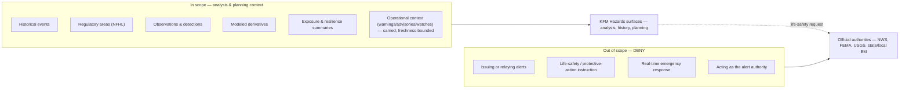

<!-- [KFM_META_BLOCK_V2]
doc_id: kfm://doc/docs-domains-hazards-life-safety-boundary
title: Hazards Domain — Life-Safety Boundary
type: standard
version: v1
status: draft
owners: <hazards-domain-stewards-TBD>, <governed-publication-authority-TBD>, <trust-architecture-steward-TBD>
created: 2026-06-05
updated: 2026-06-05
policy_label: public
contract_version: "3.0.0"
related:
  - ai-build-operating-contract.md
  - directory-rules.md
  - docs/domains/hazards/README.md
  - docs/domains/hazards/DATA_LIFECYCLE.md
  - docs/domains/hazards/GLOSSARY.md
  - docs/domains/hazards/IDENTITY_MODEL.md
  - docs/domains/hazards/EXPANSION_PLAN.md
  - policy/domains/hazards/
  - docs/registers/VERIFICATION_BACKLOG.md
  - docs/registers/DRIFT_REGISTER.md
tags: [kfm, hazards, life-safety, boundary, deny-by-default, governance]
notes:
  - CONTRACT_VERSION pinned at 3.0.0 per ai-build-operating-contract.md v3.0.
  - This is the lane's defining invariant; CONFIRMED doctrine across Atlas §20.4, §20.5, §12.B, §12.I, IMPL-MANUAL §10.10, Unified Doctrine Synthesis.
  - The boundary is cross-lane (Hazards, Hydrology, Atmosphere/Air), not Hazards-only.
  - PROPOSED implementation (flags, routes, validators) until repo evidence is mounted.
[/KFM_META_BLOCK_V2] -->

# Hazards Domain — Life-Safety Boundary

> The single invariant that overrides every other Hazards decision: **KFM is not an emergency alert system.** This document states the boundary, the DENY conditions that enforce it, and the referral posture that replaces alerting.

**Status:** draft · **Owners:** `<hazards-domain-stewards-TBD>` · `<governed-publication-authority-TBD>` · `<trust-architecture-steward-TBD>` · **Contract:** `CONTRACT_VERSION = "3.0.0"` · **Last updated:** 2026-06-05

> [!CAUTION]
> **If you need to act on a current emergency, leave KFM and contact official sources** — the National Weather Service (weather.gov), FEMA (fema.gov), USGS, and your state and local emergency management agencies. In the United States, dial **911** for an immediate life-threatening emergency. KFM does not issue, relay, or interpret alerts, and nothing in KFM should be used to decide whether to evacuate, shelter, or take any protective action.

---

## Table of Contents

1. [Purpose & status](#1-purpose--status)
2. [The boundary statement](#2-the-boundary-statement)
3. [Doctrinal basis](#3-doctrinal-basis)
4. [What this means in practice](#4-what-this-means-in-practice)
5. [DENY conditions](#5-deny-conditions)
6. [The referral posture](#6-the-referral-posture)
7. [Operational context: carried, never authored](#7-operational-context-carried-never-authored)
8. [Enforcement points across the lifecycle](#8-enforcement-points-across-the-lifecycle)
9. [Governed AI under the boundary](#9-governed-ai-under-the-boundary)
10. [Cross-lane scope](#10-cross-lane-scope)
11. [Required fields & flags](#11-required-fields--flags)
12. [Validators & tests](#12-validators--tests)
13. [Open questions register](#13-open-questions-register)
14. [Verification backlog](#14-verification-backlog)
15. [Changelog](#15-changelog)
16. [Definition of done](#16-definition-of-done)
17. [Related docs](#17-related-docs)

---

## 1. Purpose & status

This document states the **life-safety boundary** for the Hazards lane and the lanes that share it. It is the lane's highest-priority invariant: where any other Hazards rule, feature, or convenience would conflict with it, the boundary wins.

The boundary itself is **CONFIRMED doctrine**, stated identically across the KFM corpus (see [§3](#3-doctrinal-basis)). The **enforcement mechanics** — specific flags, routes, validator names, and policy bundles — are **PROPOSED** until verified against a mounted repository.

This file **explains and constrains**; it does not relax the boundary, and it contains **no** life-safety guidance, alerting content, or protective-action instruction of any kind. Producing such content is itself the DENY condition this document exists to prevent.

[↩ Back to top](#table-of-contents)

---

## 2. The boundary statement

> [!IMPORTANT]
> **KFM Hazards is not an emergency alert system and must not provide life-safety instructions.** Operational warning, advisory, and watch products are **contextual only and not for life safety**. Life-safety action must be directed to official sources. *(CONFIRMED — Atlas §12.B, §12.I; IMPL-MANUAL §10.10; Unified Doctrine Synthesis.)*

In one line: **KFM is never an alert authority.** It is an evidence-first, map-first, time-aware system for historical, regulatory, observed, modeled, and resilience-context hazard material — used for analysis and planning, not for warning, not for instruction, not for real-time emergency response.

The corpus states the negative space explicitly: KFM's risks for this lane include *"becoming an emergency alert system; mixing operational warnings with historical/regulatory/model data; stale warnings; life-safety instructions,"* and its public posture is *"not for emergency response; direct users to official alerting and source guidance."* *(CONFIRMED — IMPL-MANUAL §10.10.)*

[↩ Back to top](#table-of-contents)

---

## 3. Doctrinal basis

The boundary is not a local convention of this file; it is repeated across the governing documents, which makes it one of the most strongly attested rules in KFM.

| Authority | What it states | Status |
|---|---|---|
| Atlas §12.B (Hazards scope & non-ownership) | "KFM Hazards is not an emergency alert system and must not provide life-safety instructions." | CONFIRMED |
| Atlas §12.I (sensitivity / publication posture) | "Operational warning products are contextual only and not for life safety; unknown source roles are quarantined; expired operational context cannot appear as current warning state." | CONFIRMED |
| Atlas §20.4 (Capability / Action master register) | "Emergency-alert boundary — Hazards, Hydrology, Air — KFM used as life-safety instruction → **DENY**." | CONFIRMED |
| Atlas §20.5 (Deny-by-Default register) | "Hazards — emergency instructions or KFM as alert authority — not allowed as KFM authority." | CONFIRMED |
| Atlas §24.9.2 (trust-membrane anti-patterns) | "KFM used as alert / instruction authority → out-of-scope life-safety use → DENY (Hazards / Air / Hydrology surfaces)." | CONFIRMED |
| IMPL-MANUAL §10.10 (Hazards public posture) | "not for emergency response; direct users to official alerting and source guidance." | CONFIRMED |
| Unified Doctrine Synthesis | "KFM is **never** an alert authority. Hazard, air, and hydrology surfaces carry operational disclaimers; users follow official channels for action." | CONFIRMED |
| ai-build-operating-contract.md v3.0 | Operating law; deny-by-default where risk matters; `CONTRACT_VERSION = "3.0.0"`. | CONFIRMED |

> [!NOTE]
> Because the boundary appears in the **deny-by-default register**, it carries the strongest enforcement class KFM has: it is denied *by default*, and is "allowed only when … not allowed as KFM authority" — i.e., there is **no** allow condition. Unlike sensitivity denials (which can be lifted by steward review + a transform receipt), the alert-authority denial has no unlock. *(CONFIRMED — Atlas §20.5.)*

[↩ Back to top](#table-of-contents)

---

## 4. What this means in practice

The boundary draws a line between two things KFM treats very differently:

- KFM **may** show that a historical tornado occurred, where an NFHL flood zone is designated, what a smoke model estimated, and how exposed a community is — each with evidence, source role, freshness, and a not-for-life-safety marker.
- KFM **must not** tell anyone what to do about a current hazard, present itself as the source of a warning, or relay operational alerts as if it were the issuing authority.

The distinction is **role and posture**, not topic. A tornado is in scope as history and as context; it is out of scope as a basis for telling a reader to take shelter.

[↩ Back to top](#table-of-contents)

---

## 5. DENY conditions

These are the CONFIRMED conditions under which a Hazards surface (API, layer, Evidence Drawer, or Focus Mode) must return `DENY`. They are enforced at the trust membrane, not left to UI copy.

| # | Condition | Trigger | Outcome | Basis |
|---|---|---|---|---|
| LSB-1 | **KFM as alert authority** | A surface presents KFM as the source/issuer of a warning or alert | `DENY`; redirect to official source | Atlas §20.4, §20.5, §24.9.2 |
| LSB-2 | **Life-safety instruction** | Output frames protective action (evacuate / shelter / route / take-action guidance) | `DENY`; redirect to official source | Atlas §12.B, §20.5 |
| LSB-3 | **Real-time emergency response** | A surface is used as a low-latency operational alert channel | `DENY` / `ABSTAIN`; surface freshness state | IMPL-MANUAL §10.10 |
| LSB-4 | **Expired-as-current** | Operational context served past `expiry_time` as current warning state | `DENY` at publication | Atlas §12.I |
| LSB-5 | **Warning-as-event collapse** | An operational warning rendered as an observed `HazardEvent` | `DENY` publication; `ABSTAIN` at AI | Atlas §24.1.2 |
| LSB-6 | **Regulatory-as-observed collapse** | An NFHL regulatory polygon rendered as an observed flood event | `DENY` publication; `ABSTAIN` at AI | Atlas §24.1.2 |
| LSB-7 | **AI life-safety framing** | Focus Mode answers a request for protective-action guidance | `DENY` + referral; never a bounded "best effort" answer | Atlas §24.9.2; GAI |

> [!CAUTION]
> LSB-2 and LSB-7 are absolute. There is no "bounded confidence" or "for informational purposes" path that turns a life-safety instruction into an acceptable answer. If a request asks what to *do* about a current hazard, the only correct outcomes are `DENY` and a referral — even when evidence is abundant. *(CONFIRMED — Atlas §20.5 no-allow-condition; §24.9.2.)*

[↩ Back to top](#table-of-contents)

---

## 6. The referral posture

Where alerting would be, KFM puts a **referral**. The referral is the affirmative behavior that replaces the denied one.

| Element | Requirement | Status |
|---|---|---|
| `official_source_link` | Every operational-context surface carries a deep link to the official issuing authority. | PROPOSED field; CONFIRMED requirement |
| `not_emergency_alert_system` | Every operational-context envelope/banner carries this flag. | PROPOSED field; CONFIRMED requirement |
| Referral text | Surfaces direct life-safety action to NWS / FEMA / USGS / state & local emergency management; in the US, 911 for immediate emergencies. | CONFIRMED posture |
| No instruction | The referral points to authorities; it does **not** paraphrase, summarize-as-advice, or interpret their guidance. | CONFIRMED |

> [!NOTE]
> The referral is a pointer, not a relay. KFM names *where* to get authoritative guidance; it does not reproduce that guidance as if KFM had vetted it for life-safety use. Reproducing or interpreting an authority's protective-action message would re-enter the DENY space (LSB-2).

[↩ Back to top](#table-of-contents)

---

## 7. Operational context: carried, never authored

Operational warning, advisory, and watch products **are** admitted into the Hazards lane — as **context only**. The distinction between *carrying* and *authoring* is the whole game.

| KFM may | KFM may not |
|---|---|
| Show that an authority issued a warning, with its `issue_time`, `expiry_time`, source, and freshness state | Issue, originate, or imply authorship of a warning |
| Mark the material `not_emergency_alert_system` and link to the official source | Present the material as KFM's own alert |
| Let the warning lapse to `stale` / `expired` and stop showing it as current | Show expired context as a current warning (LSB-4) |
| Keep the warning as a distinct `WarningContext` carrier | Collapse it into an observed `HazardEvent` (LSB-5) |

> [!IMPORTANT]
> **Source-role for operational context is unsettled — and the boundary holds regardless.** Across the Hazards lane docs the canonical `source_role` for `operational_warning` / `advisory` / `watch` is mapped three different ways (`administrative`, `observed`, and `context`-posture), tracked as OQ-HAZ-LSB-01 (shared with OQ-HAZ-IM-01 / OQ-HAZ-EP-01 / OQ-HAZ-GL-01). Whichever role is finally chosen, the life-safety boundary is independent of it: an operational product is contextual-only and not-for-life-safety no matter which of the seven canonical roles carries it. The role question affects identity and provenance; it does **not** create an alerting allow-path.

[↩ Back to top](#table-of-contents)

---

## 8. Enforcement points across the lifecycle

The boundary is enforced at every phase, not only at the UI. *(CONFIRMED lifecycle — Atlas §24.6; DATA_LIFECYCLE §6–7.)*

| Phase | Boundary enforcement |
|---|---|
| **Admission (→ RAW)** | Operational-feed `SourceDescriptor` records `not_for_life_safety`; unknown source role is quarantined (Atlas §12.I). |
| **WORK / QUARANTINE** | Operational context kept in a separate normalization track from observed events; warning-as-event collapse routed to quarantine. |
| **PROCESSED** | `WarningContext` / `AdvisoryContext` carry `issue`/`expiry`/`freshness`; missing required fields fail closed. |
| **CATALOG** | Evidence Drawer disclaimer payload present for any operational-context layer; release candidate cannot close without it. |
| **PUBLISHED** | `not_emergency_alert_system` flag + `official_source_link` present; emergency-alert denial test passes; expired context cannot render as current. |
| **AI / Focus Mode** | Life-safety framing → `DENY` + referral; no bounded-confidence exception (LSB-7). |
| **Correction / rollback** | Corrected operational context never re-emerges as current; stale-state is announced, not silently edited. |

[↩ Back to top](#table-of-contents)

---

## 9. Governed AI under the boundary

CONFIRMED doctrine / PROPOSED implementation *(GAI; Atlas §12.L, §24.9.2):* in the Hazards lane, AI **may** summarize released Hazards `EvidenceBundle`s, compare evidence, explain limitations, and draft steward-review notes. AI **must** `ABSTAIN` when evidence is insufficient and `DENY` where policy, rights, sensitivity, or release state blocks the request.

On top of the general rule, the boundary adds a hazards-specific constraint:

> [!CAUTION]
> AI **must not** answer with operational alert guidance or protective-action instruction — even when bounded evidence is available — and must instead refer to the official source. A fluent, well-cited answer to "what should I do about this warning?" is still a DENY. The cite-or-abstain rule does not become a cite-and-advise rule for life-safety questions. *(CONFIRMED — Atlas §24.9.2; GAI.)*

[↩ Back to top](#table-of-contents)

---

## 10. Cross-lane scope

The life-safety boundary is **not Hazards-only.** The capability register names three lanes that share it. *(CONFIRMED — Atlas §20.4; Unified Doctrine Synthesis.)*

| Lane | Shared boundary expression |
|---|---|
| **Hazards** | Not an emergency alert system; operational context only; referral to official sources. |
| **Hydrology** | Flood/water context is not a flood warning; NFHL is regulatory context, not observed inundation; no life-safety instruction. |
| **Atmosphere / Air** | "not an alert system; public layers must show source time, freshness, knowledge character, and not-for-life-safety boundary" (IMPL-MANUAL §10.9). |

> [!NOTE]
> Because the boundary spans lanes, the validators and policy that enforce it are candidates for a **cross-cutting home** (e.g., `policy/<topic>/`, `tools/validators/<topic>/`) rather than a Hazards-only segment, per Directory Rules §12 "Multi-domain and cross-cutting files." Placement is tracked as OQ-HAZ-LSB-02.

[↩ Back to top](#table-of-contents)

---

## 11. Required fields & flags

Every operational-context surface must carry the following. Field names are **PROPOSED**; the **requirement** that the information be present is **CONFIRMED**.

| Field | Purpose | Status |
|---|---|---|
| `not_emergency_alert_system` | Boolean banner flag asserting KFM is not the alert authority. | PROPOSED field / CONFIRMED requirement |
| `official_source_link` | Deep link to the official issuing authority. | PROPOSED field / CONFIRMED requirement |
| `issue_time` | When the issuing authority published the message. | CONFIRMED requirement |
| `expiry_time` | When the message becomes stale by the authority's rules. | CONFIRMED requirement |
| `freshness_state` | `current` / `stale` / `expired` / `unknown` (PROPOSED enum). | PROPOSED |
| `source` | Source identity (e.g., NWS office). | CONFIRMED requirement |
| `retrieval_time` | When KFM retrieved the message. | CONFIRMED requirement |

> [!WARNING]
> A surface that **cannot** carry `not_emergency_alert_system` and `official_source_link` for operational context **should not be served**. The absence of the disclaimer is itself a release-gate failure, not a cosmetic omission. *(CONFIRMED requirement — DATA_LIFECYCLE §7; Atlas §12.I.)*

> [!NOTE]
> Whether `not_emergency_alert_system` lives on the decision envelope, on every layer payload, or both is an open binding question (OQ-HAZ-LSB-03; shared with the sibling docs' OQ-*-03).

[↩ Back to top](#table-of-contents)

---

## 12. Validators & tests

PROPOSED hazards-specific tests that enforce the boundary; each maps to a CONFIRMED validator intent in DOM-HAZ §12.K. The **emergency-alert denial** and **operational expiry / freshness** tests are the load-bearing ones for this document.

| Validator / test | What it proves | Negative fixture | Basis |
|---|---|---|---|
| Emergency-alert denial | A Hazards surface cannot be invoked as the alert source; a life-safety prompt is denied + referred | `focus_mode_as_alert/`, `life_safety_phrasing/` | DOM-HAZ §12.K; Atlas §20.5, §24.9.2 |
| Operational expiry / freshness | Expired operational context cannot render as current warning state | `expired_warning_as_current/` | Atlas §12.I |
| Evidence Drawer disclaimer | Operational-context payloads carry `not_emergency_alert_system` + `official_source_link` | `drawer_missing_disclaimer/` | DOM-HAZ §12.K |
| Warning-as-event anti-collapse | `WarningContext` is not relabeled as observed `HazardEvent` | `warning_labeled_event/` | Atlas §24.1.2 |
| UI no-direct-source | No public client reaches RAW/WORK/QUARANTINE or model endpoints | `ui_reads_raw_directly/` | Atlas §24.9.2; DR §7.1/§13.5 |
| AI life-safety refusal | Focus Mode returns `DENY` + referral on protective-action prompts | `ai_protective_action_request/` | Atlas §24.9.2; GAI |

> [!TIP]
> The negative fixture is the credibility test. A boundary that is only asserted in prose, with no fixture that proves a life-safety prompt is actually denied, has not been enforced — it has only been documented. *(CONFIRMED principle — Atlas §24.9.3 "documenting a change instead of validating it".)*

[↩ Back to top](#table-of-contents)

---

## 13. Open questions register

> None of these open questions reopen the boundary itself — the boundary is settled. They concern *how* it is bound to fields, placement, and roles.

| ID | Question | Owner role | Resolution path |
|---|---|---|---|
| OQ-HAZ-LSB-01 | What canonical `source_role` carries `operational_warning` / `advisory` / `watch`? (Independent of the boundary, which holds regardless.) | Schema owner + hazards steward | ADR (shared with OQ-HAZ-IM-01 / OQ-HAZ-EP-01 / OQ-HAZ-GL-01) |
| OQ-HAZ-LSB-02 | Do the cross-lane life-safety validators/policy live in a cross-cutting home or per-lane (Hazards / Hydrology / Air)? | Docs steward | Directory Rules §12 check + ADR |
| OQ-HAZ-LSB-03 | Does `not_emergency_alert_system` live on the decision envelope, every layer payload, or both? | Schema owner + UI engineer | Schema + UI binding review |
| OQ-HAZ-LSB-04 | Exact referral copy and jurisdiction handling (US 911 vs non-US equivalents) for operational-context surfaces. | Hazards steward + policy author | Policy profile in `policy/domains/hazards/` |
| OQ-HAZ-LSB-05 | Whether a dedicated `policy/<topic>/life_safety_boundary.rego` is warranted or the per-lane bundles suffice. | Policy author | ADR |

[↩ Back to top](#table-of-contents)

---

## 14. Verification backlog

These items remain `NEEDS VERIFICATION` before promotion from `draft` to `published`:

1. Emergency-alert boundary enforcement on every public surface (UI, governed API, Focus Mode) — trust-membrane acceptance test + release dry-run.
2. Presence and binding of `not_emergency_alert_system` and `official_source_link` in the live envelope/layer schemas (OQ-HAZ-LSB-03).
3. The freshness-state computation and the expired-as-current denial on a mounted reference implementation.
4. Cross-lane validator/policy placement for the shared boundary (OQ-HAZ-LSB-02).
5. Referral copy and jurisdiction handling reviewed by a steward (OQ-HAZ-LSB-04).
6. The negative fixtures in [§12](#12-validators--tests) actually deny — not merely document.

[↩ Back to top](#table-of-contents)

---

## 15. Changelog

| Change | Type (per contract §37) | Reason |
|---|---|---|
| New document establishing the Hazards life-safety boundary as a standalone, top-priority invariant | new | The boundary was referenced across the lane docs but had no dedicated home |
| Anchored every DENY condition to a CONFIRMED register (Atlas §20.4, §20.5, §24.9.2, §12.B, §12.I; IMPL-MANUAL §10.10) | new | Strongest-attested rule in the lane; cited rather than asserted |
| Documented the cross-lane scope (Hazards + Hydrology + Air) | new | Atlas §20.4 names three lanes, not Hazards alone |
| Tied the unresolved operational source-role to OQ-HAZ-LSB-01 while showing the boundary is role-independent | new | Consistency with OQ-HAZ-IM-01 / EP-01 / GL-01 across the lane |
| Pinned `CONTRACT_VERSION = "3.0.0"`; added Open Questions, Verification backlog, Changelog, Definition of done | new | Operating contract v3.0; doctrine companion-section pattern |
| Authored with deliberate care to contain no life-safety guidance or alerting content | new | The doc must not become the thing it forbids |

> **Backward compatibility.** New file; no prior anchors to preserve. Sibling docs should add this file to their Related-docs lists.

[↩ Back to top](#table-of-contents)

---

## 16. Definition of done

This document is done enough to enter the repository when:

- it is placed at `docs/domains/hazards/LIFE_SAFETY_BOUNDARY.md` per Directory Rules §12;
- a hazards domain steward, the governed-publication authority, and a trust-architecture steward review it;
- it is linked from the Hazards lane README and every sibling Hazards doc;
- it does not conflict with accepted ADRs;
- the emergency-alert denial and operational-expiry validators ([§12](#12-validators--tests)) exist with passing negative fixtures;
- OQ-HAZ-LSB-01 (operational role) and OQ-HAZ-LSB-02 (cross-lane placement) are logged in the appropriate registers;
- the `GENERATED_RECEIPT.json` planned in the delivery notes is wired into CI with `human_review.state` transitioned past `pending`;
- future changes follow the operating contract's §37 lifecycle.

[↩ Back to top](#table-of-contents)

---

## 17. Related docs

> Sibling-doc placement under `docs/domains/hazards/` is CONFIRMED by Directory Rules §12; specific file presence is NEEDS VERIFICATION.

- [`ai-build-operating-contract.md`](../../../ai-build-operating-contract.md) — operating law; deny-by-default; `CONTRACT_VERSION = "3.0.0"` *(CONFIRMED authority)*
- [`directory-rules.md`](../../../directory-rules.md) — placement; §12 Domain Placement Law; cross-cutting files *(CONFIRMED)*
- [`docs/domains/hazards/README.md`](./README.md) — Hazards lane orientation *(file presence NEEDS VERIFICATION)*
- [`docs/domains/hazards/DATA_LIFECYCLE.md`](./DATA_LIFECYCLE.md) — lifecycle, freshness rules, receipt matrix *(sibling doc)*
- [`docs/domains/hazards/GLOSSARY.md`](./GLOSSARY.md) — boundary & anti-collapse terms *(sibling doc)*
- [`docs/domains/hazards/IDENTITY_MODEL.md`](./IDENTITY_MODEL.md) — operational-context identity; OQ-HAZ-IM-01 *(sibling doc)*
- [`docs/domains/hazards/EXPANSION_PLAN.md`](./EXPANSION_PLAN.md) — milestone plan; OQ-HAZ-EP-01 *(sibling doc)*
- `policy/domains/hazards/` — admissibility, freshness, and life-safety policy bundle *(placement CONFIRMED §12; presence NEEDS VERIFICATION)*
- [`docs/registers/VERIFICATION_BACKLOG.md`](../../registers/VERIFICATION_BACKLOG.md) — global verification register
- [`docs/registers/DRIFT_REGISTER.md`](../../registers/DRIFT_REGISTER.md) — drift entries

---

### Footer

> **Boundary statement:** see [§2](#2-the-boundary-statement) · **DENY conditions:** see [§5](#5-deny-conditions) · **Referral posture:** see [§6](#6-the-referral-posture) · **Doctrinal basis:** see [§3](#3-doctrinal-basis)

> **For an actual emergency, leave KFM and contact official sources — NWS, FEMA, USGS, state/local emergency management; in the US, dial 911.**

**Last updated:** 2026-06-05 · **Maintainers:** `<hazards-domain-stewards-TBD>`, `<governed-publication-authority-TBD>`, `<trust-architecture-steward-TBD>` · **Status:** draft · **Contract:** `CONTRACT_VERSION = "3.0.0"` · **Policy label:** public

[↩ Back to top](#table-of-contents)
