<!-- [KFM_META_BLOCK_V2]
doc_id: kfm://doc/domains/hazards/map-ui-contracts
title: Hazards — Map and UI Contracts
type: standard
version: v1
status: draft
owners: <Hazards domain steward> + <Map shell steward> + <Governed API steward>  <!-- placeholder; resolve before publish -->
created: 2026-05-17
updated: 2026-05-17
policy_label: public
related:
  - docs/domains/hazards/README.md
  - docs/architecture/map-shell.md
  - docs/architecture/governed-api.md
  - docs/doctrine/trust-membrane.md
  - schemas/contracts/v1/hazards/
  - schemas/contracts/v1/map/
  - schemas/contracts/v1/ui/
  - policy/release/hazards/
tags: [kfm, hazards, map, ui, contracts, evidence-drawer, focus-mode, trust-membrane]
notes:
  - "KFM is not an alert authority — life-safety actions redirect to official sources."
  - "All repo-state claims here are PROPOSED until verified against a mounted repo."
[/KFM_META_BLOCK_V2] -->

# 🌪️ Hazards — Map and UI Contracts

> Governance contract between the **Hazards** domain and the KFM map shell, Evidence Drawer, and Focus Mode. Defines what hazards content the public UI may render, under what gates, and with what disclaimers — **never as life-safety alerting**.

[](#)
[](#)
[](../README.md)
[](#1-non-negotiable-boundary)
[](#)
[](#)

**Status:** draft &middot; **Owners:** Hazards domain steward · Map shell steward · Governed API steward *(placeholders — resolve before publish)* &middot; **Updated:** 2026-05-17

> [!CAUTION]
> **KFM is not an emergency alert authority.** Hazards layers in the KFM map shell are **planning, historical, regulatory, and resilience context** — never real-time warnings, never regulatory determinations, never life-safety instructions. Every hazards surface must label itself accordingly and redirect users seeking emergency action to **official sources** (NWS, FEMA, state and local emergency management). This boundary is enforced by contract, by policy gate, by UI label, and by validator — not by convention.

---

## Table of contents

1. [Non-negotiable boundary](#1-non-negotiable-boundary)
2. [Scope and purpose](#2-scope-and-purpose)
3. [Repo fit and authority roots](#3-repo-fit-and-authority-roots)
4. [Canonical flow](#4-canonical-flow)
5. [Layer manifest contract](#5-layer-manifest-contract)
6. [Evidence Drawer contract](#6-evidence-drawer-contract)
7. [Focus Mode contract](#7-focus-mode-contract)
8. [Time, freshness, and stale state](#8-time-freshness-and-stale-state)
9. [Source-role anti-collapse](#9-source-role-anti-collapse)
10. [Trust-visible UI states](#10-trust-visible-ui-states)
11. [Validators, tests, fixtures](#11-validators-tests-fixtures)
12. [Anti-patterns (DENY surface)](#12-anti-patterns-deny-surface)
13. [Open questions and verification backlog](#13-open-questions-and-verification-backlog)
14. [Related docs](#14-related-docs)

---

## 1. Non-negotiable boundary

**CONFIRMED doctrine.** The hazards lane is governed by one structural rule that takes precedence over every other contract in this document.

> [!IMPORTANT]
> **Planning context, not alerting.** Per `[DOM-HAZ]` and the Pass 19 normalization in `KFM-IDX-POL-007` / `KFM-IDX-PLN-002`, KFM may provide hazard history, regulatory context, observations, resilience analysis, and evidence-backed summaries — but **must not operate as an emergency alert or life-safety instruction system**. Operational warning products are **contextual only**; **expired operational context cannot appear as current warning state**.

| Rule | Status | Citation |
|---|---|---|
| KFM is never an alert authority | CONFIRMED doctrine | `[DOM-HAZ]`, Atlas v1.1 §24.13 |
| Operational warning products are contextual only and not for life safety | CONFIRMED doctrine | `[DOM-HAZ]`, `[ENCY]` |
| Expired operational context cannot appear as current warning state | CONFIRMED doctrine | `[DOM-HAZ]`, `[ENCY]` |
| Unknown source roles are quarantined | CONFIRMED doctrine | `[DOM-HAZ]`, `[ENCY]` |
| Every hazards surface labels itself "planning context, not alerting" | CONFIRMED doctrine | Pass 19 `KFM-IDX-PLN-002` |
| Hazards surfaces redirect life-safety action to official sources | CONFIRMED doctrine | `[DOM-HAZ]` §A, mission and boundary |

[⤴ Back to top](#table-of-contents)

---

## 2. Scope and purpose

**CONFIRMED purpose.** This document specifies the contracts that bind the **Hazards** domain (`[DOM-HAZ]`) to the KFM map shell, Evidence Drawer, Focus Mode, and any client that renders hazards features. It is the **single contract reference** for:

- Which **object families** may surface in the map UI and under what gates.
- Which **manifests, payloads, and envelopes** carry hazards content across the trust membrane.
- Which **labels, badges, time states, and finite outcomes** must appear on hazards surfaces.
- Which **anti-patterns** the validator stack must reject before public release.

**What this document is not.**

- It is **not** the source registry. Source families and rights live in `data/registry/sources/hazards/` (PROPOSED path; see §3).
- It is **not** the schema. Field-level shape lives under `schemas/contracts/v1/hazards/` and `schemas/contracts/v1/map/` (PROPOSED paths).
- It is **not** the policy. Release and sensitivity policy live under `policy/release/hazards/` (PROPOSED path).
- It is **not** life-safety guidance. See §1.

[⤴ Back to top](#table-of-contents)

---

## 3. Repo fit and authority roots

**PROPOSED placements** per Directory Rules §12 (Domain Placement Law). All paths below are PROPOSED until verified against a mounted repository. No path here may be cited as a current repo fact.

| Responsibility | PROPOSED path | Notes |
|---|---|---|
| Domain doctrine (this document, README, scope) | `docs/domains/hazards/` | Directory Rules §6.1, §12 confirm `docs/domains/<domain>/`. |
| Domain schemas (machine shape) | `schemas/contracts/v1/hazards/` | Atlas v1.1 §24.13 PROPOSED root. Authority requires ADR-0001 verification. |
| Map/UI schemas reused by hazards | `schemas/contracts/v1/map/`, `schemas/contracts/v1/ui/`, `schemas/contracts/v1/ai/` | LayerManifest, EvidenceDrawerPayload, MapContextEnvelope, FocusMode*. |
| Domain contracts (meaning) | `contracts/hazards/` *(or `contracts/domains/hazards/`)* | NEEDS VERIFICATION — Atlas v1.1 §24.13 shows `contracts/hazards/`; Directory Rules §12 shows `contracts/domains/<domain>/`. **Drift candidate.** |
| Release / sensitivity policy | `policy/release/hazards/` | Atlas v1.1 §24.13 explicitly carries this path with "KFM is never an alert authority" note. |
| Tests | `tests/domains/hazards/` | Directory Rules §12. |
| Fixtures | `fixtures/domains/hazards/` | Directory Rules §12. |
| Source registry | `data/registry/sources/hazards/` | Directory Rules §12. |
| Published layer artifacts | `data/published/layers/hazards/` | Directory Rules §12. |
| Release candidates | `release/candidates/hazards/` | Directory Rules §12. |

> [!NOTE]
> The pattern at Directory Rules §12 reads `contracts/domains/<domain>/`. The Atlas v1.1 §24.13 crosswalk reads `contracts/hazards/`. Until reconciled by ADR or repo evidence, this document treats `contracts/<...>/hazards/` as **NEEDS VERIFICATION** and refers only to the responsibility root, not the exact segment depth.

[⤴ Back to top](#table-of-contents)

---

## 4. Canonical flow

**CONFIRMED doctrine.** Hazards content reaches the public UI through the governed flow defined for all KFM lanes (MapLibre Master Atlas §10):

> released layer → user click → **governed API** → **EvidenceBundle** → **Evidence Drawer** → **Focus Mode** answer / abstain / deny / error

The flow is identical for hazards, with one additional gate: every hazards surface must carry the **planning-context-not-alerting** label before render.

```mermaid
flowchart LR
  classDef raw      fill:#fff1f0,stroke:#cf222e,color:#1f2328;
  classDef catalog  fill:#fff8c5,stroke:#9a6700,color:#1f2328;
  classDef released fill:#dafbe1,stroke:#1a7f37,color:#1f2328;
  classDef public   fill:#ddf4ff,stroke:#0969da,color:#1f2328;
  classDef deny     fill:#ffebe9,stroke:#cf222e,color:#82071e;

  RAW["RAW / WORK / QUARANTINE<br/>(non-public)"]:::raw
  CAT["CATALOG / TRIPLET<br/>EvidenceBundle, ReleaseCandidate"]:::catalog
  PUB["PUBLISHED<br/>LayerManifest · TileArtifactManifest · MapReleaseManifest"]:::released

  API["apps/governed-api/<br/>(PROPOSED) hazards routes"]:::public
  SHELL["MapLibre map shell<br/>apps/explorer-web/ (PROPOSED)"]:::public
  DRAWER["Evidence Drawer<br/>EvidenceDrawerPayload"]:::public
  FOCUS["Focus Mode<br/>MapContextEnvelope → FocusModeResponse"]:::public

  DENY{{"DENY surfaces<br/>• stale operational warning<br/>• unknown source role<br/>• missing rollback target<br/>• life-safety request"}}:::deny

  RAW -->|"promotion (governed)"| CAT
  CAT -->|"ReleaseManifest"| PUB
  PUB --> API
  API -->|"layer manifest resolver"| SHELL
  SHELL -->|"click feature"| API
  API -->|"feature/detail resolver"| DRAWER
  DRAWER -->|"open Focus"| FOCUS
  FOCUS -->|"ABSTAIN / DENY"| DENY
  API -.->|"freshness / source-role / life-safety gate"| DENY
```



> [!NOTE]
> The diagram shows the **governed flow shape**. Concrete route names, package names, and component names are PROPOSED and require repo verification before they can be cited as facts.

[⤴ Back to top](#table-of-contents)

---

## 5. Layer manifest contract

**CONFIRMED doctrine / PROPOSED field realization.** Every hazards map layer is published through a `LayerManifest` that binds the layer to its source, evidence, policy, and release state. The contract below extends the generic `LayerManifest` (MapLibre Master Atlas §J, `schemas/contracts/v1/map/layer_manifest.schema.json` PROPOSED) with hazards-specific obligations.

### 5.1 Hazards object families allowed on the map

Per `[DOM-HAZ]` §C and Atlas v1.1 §24 ch. 12:

| Object family | Default geometry | Default source role | Default sensitivity | Notes |
|---|---|---|---|---|
| `HazardEvent` | point / line / polygon | observation or context | public | Historical event record. |
| `HazardObservation` | point / area | observation | public | Direct measurement. |
| `WarningContext` | polygon (issue/expiry) | context only | public | **Never alerting.** Stale ≠ current. |
| `AdvisoryContext` | polygon (issue/expiry) | context only | public | **Never alerting.** Stale ≠ current. |
| `DisasterDeclaration` | administrative polygon | authority | public | FEMA / state declaration record. |
| `FloodContext` | polygon (regulatory) | authority (regulatory) | public | NFHL — regulatory context, not observed inundation. |
| `WildfireDetection` | point / footprint | observation (remote-sensing) | public | NASA FIRMS / NOAA HMS detection class. |
| `SmokeContext` | polygon / raster | context | public | HMS smoke product. |
| `DroughtIndicator` | raster / polygon | model or context | public | Drought monitor category. |
| `EarthquakeEvent` | point | observation | public | USGS catalog. |
| `HeatColdEvent` | polygon / station | observation or context | public | Anomaly or event class. |
| `ExposureSummary` | derived polygon | model | public-safe derivative | Aggregated; no per-parcel exposure by default. |
| `ResilienceSummary` | derived polygon | model | public-safe derivative | Aggregated; planning context. |
| `HazardTimeline` | timeline | derived | public | Time-aware roll-up; see §8. |
| `ImpactArea` | polygon | derived | public-safe derivative | NEEDS VERIFICATION — sensitivity tier per source. |

### 5.2 Required hazards extensions to `LayerManifest`

PROPOSED required fields on top of the generic `LayerManifest`:

| Field | Type | Required | Purpose |
|---|---|---|---|
| `hazard_object_family` | enum from §5.1 | yes | Anti-collapse — one layer, one family. |
| `source_role` | `authority \| observation \| context \| model` | yes | See §9. Frozen at admission; never upgraded. |
| `life_safety_label` | `"planning_context_not_alerting"` | yes | Constant string; validator rejects any other value. |
| `official_source_redirect_url` | URI | yes for `WarningContext`, `AdvisoryContext` | Where the user must go for live alerts. |
| `freshness_window` | ISO 8601 duration | yes for operational-context families | After which the layer renders **stale** (see §8). |
| `issue_time_field` | property name | yes for `WarningContext`, `AdvisoryContext` | Drives stale calculation. |
| `expiry_time_field` | property name | yes for `WarningContext`, `AdvisoryContext` | Drives DENY after expiry. |
| `evidence_ref_field` | property name | yes | Required by Evidence Drawer click resolution. |
| `temporal_fields` | array | yes | source / observed / valid / retrieval / release / correction times. |
| `policy_label` | string | yes | Public / restricted / etc. |
| `release_state` | `PUBLISHED` | yes | Anything else fails the gate. |
| `rollback_target` | release id | yes | Per `ReleaseManifest` rule. |

<details>
<summary>Illustrative <code>LayerManifest</code> stub for a hazards layer (PROPOSED, not normative)</summary>

```json
{
  "layer_id": "hazards.warning_context.v1",
  "title": "NWS warnings (planning context, not alerting)",
  "geometry_type": "polygon",
  "source_id": "src.nws.alerts.v1",
  "source_layer": "warnings",
  "evidence_ref_field": "evidence_ref",
  "temporal_fields": [
    "source_time", "issue_time", "expiry_time",
    "observed_time", "valid_time",
    "retrieval_time", "release_time", "correction_time"
  ],
  "policy_label": "public",
  "release_state": "PUBLISHED",

  "hazard_object_family": "WarningContext",
  "source_role": "context",
  "life_safety_label": "planning_context_not_alerting",
  "official_source_redirect_url": "https://www.weather.gov/",
  "freshness_window": "PT15M",
  "issue_time_field": "issue_time",
  "expiry_time_field": "expiry_time",
  "rollback_target": "rel.hazards.v0.prev"
}
```

This block is **illustrative**. Field names, source IDs, freshness windows, and redirect URLs are placeholders requiring verification against `[DOM-HAZ]` §D, the source registry, and current upstream terms.

</details>

[⤴ Back to top](#table-of-contents)

---

## 6. Evidence Drawer contract

**CONFIRMED doctrine / PROPOSED implementation.** Per `[DOM-HAZ]` §J and MapLibre Master Atlas §N, the Evidence Drawer is the **mandatory inspection surface** for clicked hazards features. Map popups are not a substitute.

### 6.1 Required fields on `EvidenceDrawerPayload` (hazards profile)

Extends the generic `EvidenceDrawerPayload` (PROPOSED home `schemas/contracts/v1/ui/evidence_drawer_payload.schema.json`):

| Field | Required | Purpose |
|---|---|---|
| `feature_id` | yes | Stable identity; binds drawer to a released feature. |
| `layer_id` | yes | Anchors to `LayerManifest`. |
| `evidence_bundle_refs[]` | yes | EvidenceRef must resolve to `EvidenceBundle`. |
| `source_summary` | yes | Source name, role, rights status, retrieval window. |
| `source_role` | yes | Shown as a labeled chip; see §9. |
| `citations[]` | yes | Cite-or-abstain: no claim without citation. |
| `policy_state` | yes | Policy decision id and obligations. |
| `release_state` | yes | Always `PUBLISHED`; staleness shown separately. |
| `limitations` | yes | Per-claim limitations from `EvidenceBundle`. |
| `life_safety_disclaimer` | yes | Constant string: *"This is planning and historical context. For emergencies and current warnings, see {official_source_redirect_url}."* |
| `official_source_redirect_url` | yes for operational-context families | Required for `WarningContext`, `AdvisoryContext`. |
| `freshness_state` | yes for operational-context families | `current` · `stale` · `expired`. See §8. |
| `temporal_window` | yes | source / observed / valid / retrieval / release times, distinct. |

### 6.2 Drawer rendering rules

> [!IMPORTANT]
> **Disclaimer is not optional and not buried.** The `life_safety_disclaimer` and `official_source_redirect_url` render on every hazards drawer, above the fold. Per `KFM-IDX-PLN-002`, the disclaimer is part of the surface vocabulary, not a small-print footer.

- **No drawer without a resolved EvidenceBundle.** A click that cannot resolve `evidence_bundle_refs[]` MUST render `ABSTAIN`, not a partial drawer.
- **No drawer for `expired` operational context.** When `expiry_time < now`, the drawer renders DENY with a redirect message — never a stale polygon presented as current.
- **One source-role chip.** The drawer surfaces the `source_role` value (see §9) as a visible, screen-reader-accessible label.
- **Trust-visible state.** Per MapLibre Master Atlas §S (`ML-061-058`, `ML-061-094`), `freshness_state`, schema-drift, geography-version-drift, and review-aged badges render in the drawer where present.
- **No private reasoning.** AI summaries shown in the drawer route through Focus Mode (§7) and carry an `AIReceipt` reference; the drawer never shows raw model output.

[⤴ Back to top](#table-of-contents)

---

## 7. Focus Mode contract

**CONFIRMED doctrine / PROPOSED implementation.** Focus Mode is the bounded, citation-validated answer surface for hazards questions. It is **never** an emergency oracle and **never** life-safety guidance.

### 7.1 Allowed and disallowed behaviors

Per `[DOM-HAZ]` §L:

| Allowed (with citation) | Required outcome when violated |
|---|---|
| Summarize released hazards `EvidenceBundle`s. | — |
| Compare evidence across sources. | — |
| Explain limitations, source roles, freshness, and disclaimers. | — |
| Draft steward-review notes (non-public). | — |
| **Life-safety guidance, instructions to act, current-warning interpretation.** | **DENY** with redirect to official source. |
| Answer where evidence is insufficient. | **ABSTAIN**. |
| Answer where policy / rights / sensitivity / release state blocks the request. | **DENY**. |

### 7.2 Required envelope shape

The hazards Focus Mode pipeline uses the standard envelope (MapLibre Master Atlas §J, `schemas/contracts/v1/ai/`):


> [!CAUTION]
> **Life-safety request detection is a DENY gate, not a soft hint.** Per `KFM-IDX-POL-007`, the hazards Focus Mode pipeline MUST detect life-safety phrasing (e.g., *"is it safe to drive home now"*, *"should I evacuate"*) and return DENY with the official-source redirect. This is enforced by validator fixture, not by model judgment.

### 7.3 Required validations before answer display

- **CitationValidationReport** must verify every claim resolves to an `EvidenceRef` in the released `EvidenceBundle`. Verdict ≠ `resolved` → `ABSTAIN`.
- **`AIReceipt`** records model provider, model id, context hash, evidence ids, policy ids, runtime, and outcome. No private reasoning is stored.
- **Citation list** renders alongside the answer; the user can always trace a sentence to a source.
- **Outcome chip** (ANSWER / ABSTAIN / DENY / ERROR) renders visibly. DENY is a valid, legible outcome — not a failure to suppress.

[⤴ Back to top](#table-of-contents)

---

## 8. Time, freshness, and stale state

**CONFIRMED doctrine.** Hazards is the lane where source-time, observed-time, valid-time, issue-time, expiry-time, retrieval-time, release-time, and correction-time most commonly **diverge** — and where collapsing them is most dangerous. Per `[DOM-HAZ]` §E and Atlas v1.1 §24.8.1.

### 8.1 Required temporal fields per family

| Family | Required temporal fields |
|---|---|
| `HazardEvent` | source, observed, valid, retrieval, release, correction |
| `HazardObservation` | source, observed, retrieval, release |
| `WarningContext` | source, **issue**, **expiry**, retrieval, release |
| `AdvisoryContext` | source, **issue**, **expiry**, retrieval, release |
| `DisasterDeclaration` | source, **declared**, valid, retrieval, release |
| `FloodContext` | source, **effective**, retrieval, release |
| `WildfireDetection` | source, **observed (acquisition)**, retrieval, release |
| `SmokeContext` | source, valid (issue), retrieval, release |
| `DroughtIndicator` | source, valid (period), retrieval, release |
| `EarthquakeEvent` | source, **origin**, retrieval, release |

### 8.2 Stale-state markers (UI states the map shell must render)

Per Atlas v1.1 §24.8.1:

| Marker | Trigger | UI signal | Required action |
|---|---|---|---|
| Source freshness expired | `now - retrieval_time > freshness_window` | Stale source badge in drawer + dimmed style | Re-admit or mark stale; do not promote silently. |
| Operational expiry | `now > expiry_time` for `WarningContext` / `AdvisoryContext` | **DENY** at API; layer hidden or labeled "expired" | Layer MUST NOT render as current. |
| Schema-version drift | published claim bound to superseded schema | Schema-drift badge with ADR link | Migrate, re-validate, re-release. |
| Geography-version drift | claim bound to prior `GeographyVersion` | Geography-version banner | Rebind and re-release. |
| Time-out-of-support | claim's temporal scope outside support window | Time-out-of-support indicator | Mark stale; do not refresh silently. |
| Review aged out | `ReviewRecord` older than tolerance | Review-aged badge | Trigger steward review. |
| Rights status changed | source rights changed | Rights-changed badge | Re-evaluate tier; possible `CorrectionNotice`. |
| Policy version changed | `PolicyDecision` references superseded policy | Policy-version badge | Re-run gate. |

> [!WARNING]
> **"Stale" ≠ "wrong"** (Atlas v1.1 §24.8). A stale operational warning is not a current warning; it is **last-known context**. Rendering a stale polygon without the stale badge is a **trust-membrane violation** and a §12 anti-pattern.

[⤴ Back to top](#table-of-contents)

---

## 9. Source-role anti-collapse

**CONFIRMED doctrine.** Per `[DOM-HAZ]` §D and `KFM-IDX-APP-005`, hazards source families carry one of four roles, fixed at admission, **never upgraded by promotion** (Atlas v1.1 §24.9.3):

| Role | Definition | Examples (PROPOSED, per `[DOM-HAZ]` §D) |
|---|---|---|
| `authority` | Source acts as authoritative record under regulation or charter. | FEMA NFHL flood hazard layer; FEMA disaster declarations. |
| `observation` | Source records a measurement of a real event. | NOAA Storm Events; USGS earthquake catalog; NASA FIRMS active fire. |
| `context` | Source provides operational or advisory context, not authoritative determination. | NWS warnings / advisories / watches; HMS smoke; drought monitor. |
| `model` | Source is a modeled or derived product. | Exposure/resilience derivatives; modeled fields. |

> [!IMPORTANT]
> **Anti-collapse is a validator obligation.** A modeled exposure surface MUST NOT be admitted to a `LayerManifest` as `source_role: observation`. An operational advisory MUST NOT be admitted as `authority`. The validator under §11 (PROPOSED: `tests/domains/hazards/source_role_anti_collapse_test`) rejects collapses.

### 9.1 Source-role rendering rules

- The drawer's **source-role chip** is visible and accessible (WCAG, per MapLibre Master Atlas §S).
- The layer legend MUST disambiguate roles when more than one role is in view (e.g., observed earthquake events vs. modeled hazard zones).
- AI summaries (Focus Mode) MUST reference the role when comparing sources; collapsing observed + modeled into one statement is a citation-validation failure.

[⤴ Back to top](#table-of-contents)

---

## 10. Trust-visible UI states

**CONFIRMED doctrine.** The hazards map shell renders trust as state, not as decoration. Badges are pinned to receipts, not to visual confidence (MapLibre Master Atlas §S, `ML-057-013`, `ML-061-090`).

| State | Where rendered | Source |
|---|---|---|
| Source role chip | Drawer header, layer legend | §9 |
| Freshness state | Drawer header, layer toggle | §8.2 |
| Policy label | Drawer footer | `LayerManifest.policy_label` |
| Release state | Drawer footer | `LayerManifest.release_state` |
| Stale-source badge | Drawer header, layer toggle | §8.2 |
| Review-aged badge | Drawer header | §8.2 |
| Geography-version banner | Map header when drift detected | §8.2 |
| **Planning-context-not-alerting** label | Layer toggle, drawer, Focus Mode answer header | §1 |
| Official-source redirect button | Drawer, Focus Mode DENY response | §1, §6, §7 |
| Outcome chip (ANSWER / ABSTAIN / DENY / ERROR) | Focus Mode answer | §7 |

> [!NOTE]
> **Badges are not proof substitutes** (`KFM-IDX-MAP-006`, `ML-061-090`). A green "released" badge does not bypass the gate; it reflects the gate's outcome. The drawer must remain inspectable for receipts and citations behind every badge.

[⤴ Back to top](#table-of-contents)

---

## 11. Validators, tests, fixtures

**PROPOSED test surface** per `[DOM-HAZ]` §K. All tests are **PROPOSED** until verified in a mounted repo.

| Test | Purpose | Status |
|---|---|---|
| Source-role anti-collapse | Reject admission of a modeled/context source as `observation` or `authority`. | PROPOSED |
| Temporal-role validators | Reject manifests missing `issue`/`expiry` for operational-context families. | PROPOSED |
| Emergency-alert denial | Focus Mode life-safety phrasing → DENY + redirect. | PROPOSED |
| Operational expiry / freshness | `now > expiry_time` → layer DENY or stale-state render. | PROPOSED |
| Catalog closure | `EvidenceBundle` resolves; citations validate. | PROPOSED |
| Evidence Drawer disclaimer | Drawer payload missing `life_safety_disclaimer` → reject. | PROPOSED |
| UI no-direct-source | Public client MUST NOT fetch `data/raw/`, `data/work/`, `data/quarantine/`, candidate URLs, or non-released tiles. | PROPOSED |
| No-stale-as-current | Stale operational polygon rendered without stale badge → fail. | PROPOSED |
| Citation validation | Every Focus Mode answer claim resolves to a released `EvidenceRef`. | PROPOSED |
| AIReceipt presence | No Focus Mode answer renders without an `AIReceipt` reference. | PROPOSED |
| Rollback drill | Hazards release rolls back via `ReleaseManifest.rollback_target`. | PROPOSED |

<details>
<summary>Suggested first hazards UI fixture (illustrative)</summary>

A minimal hazards fixture pack would include:
- A **historical** `HazardEvent` (e.g., a 1951 flood event) with valid `EvidenceBundle`.
- A **regulatory** `FloodContext` polygon (`source_role: authority`).
- A **contextual** `WarningContext` polygon with `issue_time` in the past and `expiry_time` in the past — fixture asserts the layer DENYs.
- A **modeled** `ExposureSummary` (`source_role: model`) — fixture asserts the role chip renders.
- A Focus Mode question phrased as life-safety guidance — fixture asserts DENY + redirect.
- A Focus Mode question phrased as historical comparison — fixture asserts ANSWER with citations.

Paths, file names, and harness specifics are PROPOSED.

</details>

[⤴ Back to top](#table-of-contents)

---

## 12. Anti-patterns (DENY surface)

**CONFIRMED doctrine.** Per Atlas v1.1 §24.9.2, the following are trust-membrane anti-patterns. Every hazards UI contract above exists to prevent them.

| Anti-pattern | What goes wrong | DENY surface |
|---|---|---|
| Public client reads RAW / WORK / QUARANTINE. | Trust membrane bypassed. | Governed API; layer manifest resolver. |
| Map shell consumes canonical store directly. | Renderer inherits no governance. | Map shell wiring; layer registry. |
| Stale operational warning rendered as current. | KFM appears to issue alerts. | Layer resolver; drawer payload validator. |
| AI returns uncited language. | Cite-or-abstain broken. | Focus Mode citation validator. |
| AI answers from RAW / WORK. | AI becomes truth source. | Governed AI runtime. |
| Sensitive content released without redaction. | Rights / sovereignty violation. | Release queue. |
| Aggregate cited as per-place observation. | Source-role collapse. | Validator; Focus Mode citation evaluator. |
| KFM used as alert / instruction authority. | **Out-of-scope, out-of-doctrine.** | Hazards / Air / Hydrology surfaces. |
| Release without `ReleaseManifest` or rollback target. | Not auditable, not reversible. | Release queue. |
| Badge as proof substitute. | Visual trust theater. | Drawer evidence inspection. |
| `source_role` upgraded on promotion. | Modeled → observed silently. | Admission validator. |

[⤴ Back to top](#table-of-contents)

---

## 13. Open questions and verification backlog

All items below are **NEEDS VERIFICATION** in this session because no live repo is mounted.

| # | Item | Evidence that would settle it |
|---|---|---|
| HZ-UI-01 | Confirm `docs/domains/hazards/` exists and this is the right file name (`MAP_UI_CONTRACTS.md` vs. `MAP-UI-CONTRACTS.md` vs. nested `ui/MAP_CONTRACTS.md`). | Mounted repo + adjacent domain doc naming. |
| HZ-UI-02 | Reconcile `contracts/hazards/` (Atlas v1.1 §24.13) vs. `contracts/domains/hazards/` (Directory Rules §12). | ADR or repo evidence. |
| HZ-UI-03 | Verify `schemas/contracts/v1/hazards/` shape — required fields per object family. | Mounted schemas. |
| HZ-UI-04 | Verify `policy/release/hazards/` content and its life-safety gate enforcement. | Mounted policy + tests. |
| HZ-UI-05 | Confirm governed API route names for hazards feature/detail, layer manifest, drawer payload, and Focus Mode. | `apps/governed-api/` source. |
| HZ-UI-06 | Confirm map shell component names for layer registry, drawer, Focus Mode panel. | `apps/explorer-web/` or `packages/maplibre/` source. |
| HZ-UI-07 | Implement and verify source-role anti-collapse tests. | Tests + fixtures + CI run. |
| HZ-UI-08 | Implement and verify emergency-alert denial fixture. | Test + fixture. |
| HZ-UI-09 | Implement and verify operational expiry / freshness tests. | Test + fixture. |
| HZ-UI-10 | Confirm Evidence Drawer disclaimer is rendered above-the-fold by component test. | Snapshot / a11y test. |
| HZ-UI-11 | Confirm rollback drill for a hazards release. | Rollback card + receipt. |
| HZ-UI-12 | Confirm source endpoints, rights, and current terms for NWS, NFHL, NCEI, USGS, FIRMS, HMS, drought monitors, Kansas EM. | Source registry + EXTERNAL refresh. |
| HZ-UI-13 | Decide whether `ImpactArea` defaults to public-safe derivative or restricted by source. | `[DOM-HAZ]` profile + policy. |
| HZ-UI-14 | Decide cadence for re-evaluating freshness windows per family (per-source defaults vs. domain-wide). | ADR. |

[⤴ Back to top](#table-of-contents)

---

## 14. Related docs

> Links below are **PROPOSED** paths; verify against mounted repo before linking from rendered surfaces.

- `docs/domains/hazards/README.md` — hazards domain landing (PROPOSED).
- `docs/architecture/map-shell.md` — map shell architecture (PROPOSED).
- `docs/architecture/governed-api.md` — governed API architecture (PROPOSED).
- `docs/doctrine/trust-membrane.md` — trust-membrane doctrine (PROPOSED).
- `docs/doctrine/lifecycle-law.md` — RAW → WORK/QUARANTINE → PROCESSED → CATALOG/TRIPLET → PUBLISHED (PROPOSED).
- `docs/standards/PMTILES.md` — PMTiles governance profile (CONFIRMED prior in this project).
- `docs/standards/PROV.md` — provenance profile (CONFIRMED prior in this project).
- `docs/registers/DRIFT_REGISTER.md` — file open drifts here (e.g., HZ-UI-02).
- `docs/registers/VERIFICATION_BACKLOG.md` — file open verification items here (HZ-UI-01 … HZ-UI-14).
- `schemas/contracts/v1/map/layer_manifest.schema.json` (PROPOSED).
- `schemas/contracts/v1/ui/evidence_drawer_payload.schema.json` (PROPOSED).
- `schemas/contracts/v1/ai/focus_mode_request.schema.json`, `focus_mode_response.schema.json`, `ai_receipt.schema.json` (PROPOSED).
- `schemas/contracts/v1/hazards/` (PROPOSED).
- `policy/release/hazards/` (PROPOSED).

---

<sub>Doc id: `kfm://doc/domains/hazards/map-ui-contracts` &middot; Version: v1 &middot; Status: draft &middot; Last updated: 2026-05-17 &middot; Authority: `[DOM-HAZ]`, `[ENCY]`, `[DIRRULES]`, `[MAP-MASTER]`, `[GAI]` &middot; All repo-state claims are PROPOSED until verified against a mounted repository.</sub>

[⤴ Back to top](#table-of-contents)
