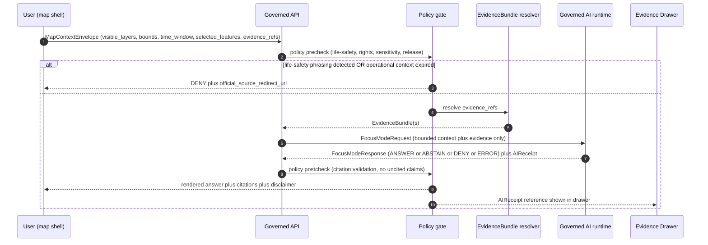

<!-- [KFM_META_BLOCK_V2]
doc_id: kfm://doc/domains/hazards/map-ui-contracts
title: Hazards — Map and UI Contracts
type: standard
version: v2
status: draft
owners: <Hazards domain steward> + <Map shell steward> + <Governed API steward>   # placeholder; resolve before publish
created: 2026-05-17
updated: 2026-06-05
policy_label: public
contract_version: "3.0.0"
related:
  - ai-build-operating-contract.md
  - directory-rules.md
  - docs/domains/hazards/README.md
  - docs/domains/hazards/DATA_LIFECYCLE.md
  - docs/domains/hazards/LIFE_SAFETY_BOUNDARY.md
  - docs/domains/hazards/IDENTITY_MODEL.md
  - docs/architecture/map-shell.md
  - docs/architecture/governed-api.md
  - docs/doctrine/trust-membrane.md
  - schemas/contracts/v1/map/
  - schemas/contracts/v1/ui/
  - policy/domains/hazards/
tags: [kfm, hazards, map, ui, contracts, evidence-drawer, focus-mode, trust-membrane]
notes:
  - CONTRACT_VERSION pinned at 3.0.0 per ai-build-operating-contract.md v3.0.
  - KFM is not an alert authority — life-safety actions redirect to official sources (see LIFE_SAFETY_BOUNDARY.md).
  - All repo-state claims here are PROPOSED until verified against a mounted repo, except apps/governed-api/ and apps/explorer-web/ which are CONFIRMED at commit b6a279….
  - v2 reconciles the four-role vs canonical seven-role vocabulary (OQ-HAZ-MUI-01) and flags DRIFT-HAZ-PATH-01 on the contracts/policy paths.
[/KFM_META_BLOCK_V2] -->

# 🌪️ Hazards — Map and UI Contracts

> Governance contract between the **Hazards** domain and the KFM map shell, Evidence Drawer, and Focus Mode. Defines what hazards content the public UI may render, under what gates, and with what disclaimers — **never as life-safety alerting**.

[](#)
[](#)
[](./README.md)
[](#1-non-negotiable-boundary)
[](#)
[](#)
[](#)

**Status:** draft &middot; **Owners:** Hazards domain steward · Map shell steward · Governed API steward *(placeholders — resolve before publish)* &middot; **Contract:** `CONTRACT_VERSION = "3.0.0"` &middot; **Updated:** 2026-06-05

> [!CAUTION]
> **KFM is not an emergency alert authority.** Hazards layers in the KFM map shell are **planning, historical, regulatory, and resilience context** — never real-time warnings, never regulatory determinations, never life-safety instructions. Every hazards surface must label itself accordingly and redirect users seeking emergency action to **official sources** (NWS, FEMA, state and local emergency management). This boundary is enforced by contract, by policy gate, by UI label, and by validator — not by convention. See [`LIFE_SAFETY_BOUNDARY.md`](./LIFE_SAFETY_BOUNDARY.md) for the full invariant.

---

## Table of contents

1. [Non-negotiable boundary](#1-non-negotiable-boundary)
2. [Scope and purpose](#2-scope-and-purpose)
3. [Repo fit and authority roots](#3-repo-fit-and-authority-roots)
4. [Canonical flow](#4-canonical-flow)
5. [Layer manifest contract](#5-layer-manifest-contract)
6. [Evidence Drawer contract](#6-evidence-drawer-contract)
7. [Focus Mode contract](#7-focus-mode-contract)
8. [Time, freshness, and stale state](#8-time-freshness-and-stale-state)
9. [Source-role anti-collapse](#9-source-role-anti-collapse)
10. [Trust-visible UI states](#10-trust-visible-ui-states)
11. [Validators, tests, fixtures](#11-validators-tests-fixtures)
12. [Anti-patterns (DENY surface)](#12-anti-patterns-deny-surface)
13. [Open questions register](#13-open-questions-register)
14. [Verification backlog](#14-verification-backlog)
15. [Changelog](#15-changelog)
16. [Definition of done](#16-definition-of-done)
17. [Related docs](#17-related-docs)

---

## 1. Non-negotiable boundary

**CONFIRMED doctrine.** The hazards lane is governed by one structural rule that takes precedence over every other contract in this document.

> [!IMPORTANT]
> **Planning context, not alerting.** Per DOM-HAZ §12.B/§12.I, KFM may provide hazard history, regulatory context, observations, resilience analysis, and evidence-backed summaries — but **must not operate as an emergency alert or life-safety instruction system**. Operational warning products are **contextual only**; **expired operational context cannot appear as current warning state**.

| Rule | Status | Citation |
|---|---|---|
| KFM is never an alert authority | CONFIRMED doctrine | Atlas §20.4, §20.5, §24.9.2; DOM-HAZ §12.B |
| Operational warning products are contextual only and not for life safety | CONFIRMED doctrine | DOM-HAZ §12.I; ENCY §7.10 |
| Expired operational context cannot appear as current warning state | CONFIRMED doctrine | DOM-HAZ §12.I |
| Unknown source roles are quarantined | CONFIRMED doctrine | DOM-HAZ §12.I |
| Every hazards surface labels itself "planning context, not alerting" | CONFIRMED doctrine | IMPL-MANUAL §10.10 ("direct users to official alerting and source guidance") |
| Hazards surfaces redirect life-safety action to official sources | CONFIRMED doctrine | Atlas §20.5; DOM-HAZ §12.B; IMPL-MANUAL §10.10 |

> [!NOTE]
> The v1 draft cited several of these rows to Pass-19/20 idea codes (`KFM-IDX-POL-007`, `KFM-IDX-PLN-002`). Those identifiers could not be confirmed against the corpus this session; the rows above are re-cited to the **verifiable** registers (Atlas §20.4/§20.5/§24.9.2, DOM-HAZ §12.B/§12.I, IMPL-MANUAL §10.10), which state the same doctrine.

[⤴ Back to top](#table-of-contents)

---

## 2. Scope and purpose

**CONFIRMED purpose.** This document specifies the contracts that bind the **Hazards** domain to the KFM map shell, Evidence Drawer, Focus Mode, and any client that renders hazards features. It is the **single contract reference** for:

- Which **object families** may surface in the map UI and under what gates.
- Which **manifests, payloads, and envelopes** carry hazards content across the trust membrane.
- Which **labels, badges, time states, and finite outcomes** must appear on hazards surfaces.
- Which **anti-patterns** the validator stack must reject before public release.

**What this document is not.**

- It is **not** the source registry. Source families and rights live in `data/registry/sources/hazards/` (see §3).
- It is **not** the schema. Field-level shape lives under `schemas/contracts/v1/domains/hazards/` and `schemas/contracts/v1/map/` (PROPOSED).
- It is **not** the policy. Release and sensitivity policy live under `policy/domains/hazards/` (PROPOSED; see DRIFT-HAZ-PATH-01 in §3).
- It is **not** life-safety guidance. See §1 and [`LIFE_SAFETY_BOUNDARY.md`](./LIFE_SAFETY_BOUNDARY.md).

[⤴ Back to top](#table-of-contents)

---

## 3. Repo fit and authority roots

Placements per Directory Rules §12 (Domain Placement Law). The **lane pattern** (domain as a segment under each root) is CONFIRMED by §12; specific **file presence** is PROPOSED until verified against a mounted repo. `apps/governed-api/` and `apps/explorer-web/` are **CONFIRMED at commit** `b6a279…` (Directory Rules §7.1/§11; Repository Structure Guiding Document).

| Responsibility | Path (segmented, §12) | Notes |
|---|---|---|
| Domain doctrine (this document, README, scope) | `docs/domains/hazards/` | CONFIRMED placement (DR §6.1, §12). |
| Domain schemas (machine shape) | `schemas/contracts/v1/domains/hazards/` | CONFIRMED placement per ADR-0001 + §12; materialization PROPOSED. |
| Map/UI/AI schemas reused by hazards | `schemas/contracts/v1/map/`, `schemas/contracts/v1/ui/`, `schemas/contracts/v1/ai/` | LayerManifest, EvidenceDrawerPayload, MapContextEnvelope, FocusMode*. |
| Domain contracts (meaning) | `contracts/domains/hazards/` | **DRIFT-HAZ-PATH-01** — Atlas §24.13 shows the non-segmented `contracts/hazards/`; Directory Rules §12 mandates the segmented form, which wins. |
| Release / sensitivity policy | `policy/domains/hazards/` | **DRIFT-HAZ-PATH-01** — Atlas §24.13 shows `policy/release/hazards/`; §12 default is `policy/domains/hazards/`. Whether release-gate policy legitimately splits to `policy/release/` is OPEN. |
| Tests | `tests/domains/hazards/` | Directory Rules §12. |
| Fixtures | `fixtures/domains/hazards/` | Directory Rules §12. |
| Source registry | `data/registry/sources/hazards/` | Directory Rules §12 (note §4 Step 3 also allows `data/registry/hazards/`). |
| Published layer artifacts | `data/published/layers/hazards/` | Directory Rules §12. |
| Release candidates | `release/candidates/hazards/` | Directory Rules §12. |

> [!NOTE]
> **DRIFT-HAZ-PATH-01.** The Atlas §24.13 crosswalk (self-labeled "Primary responsibility root (PROPOSED)") uses non-segmented `contracts/hazards/` and `policy/release/hazards/`; Directory Rules §12 / §4 Step 3 require the domain as a **segment** (`contracts/domains/hazards/`, `policy/domains/hazards/`). Per the authority order (§2.1), Directory Rules win and the Atlas form is logged as drift in `docs/registers/DRIFT_REGISTER.md`. v2 of this doc uses the segmented form throughout. Shared with the sibling `EXPANSION_BACKLOG.md` / `FILE_SYSTEM_PLAN.md`.

[⤴ Back to top](#table-of-contents)

---

## 4. Canonical flow

**CONFIRMED doctrine.** Hazards content reaches the public UI through the governed flow defined for all KFM lanes (MapLibre Master §10; trust membrane Atlas §24.9.2):

> released layer → user click → **governed API** → **EvidenceBundle** → **Evidence Drawer** → **Focus Mode** answer / abstain / deny / error

The flow is identical for hazards, with one additional gate: every hazards surface must carry the **planning-context-not-alerting** label before render.

```mermaid
flowchart LR
  classDef raw      fill:#fff1f0,stroke:#cf222e,color:#1f2328;
  classDef catalog  fill:#fff8c5,stroke:#9a6700,color:#1f2328;
  classDef released fill:#dafbe1,stroke:#1a7f37,color:#1f2328;
  classDef public   fill:#ddf4ff,stroke:#0969da,color:#1f2328;
  classDef deny     fill:#ffebe9,stroke:#cf222e,color:#82071e;

  RAW["RAW / WORK / QUARANTINE — non-public"]:::raw
  CAT["CATALOG / TRIPLET — EvidenceBundle, ReleaseCandidate"]:::catalog
  PUB["PUBLISHED — LayerManifest, TileArtifactManifest, MapReleaseManifest"]:::released

  API["apps/governed-api/ — hazards routes (CONFIRMED at commit; routes PROPOSED)"]:::public
  SHELL["MapLibre map shell — apps/explorer-web/ (CONFIRMED at commit)"]:::public
  DRAWER["Evidence Drawer — EvidenceDrawerPayload"]:::public
  FOCUS["Focus Mode — MapContextEnvelope to FocusModeResponse"]:::public

  DENY{{"DENY surfaces — stale operational warning, unknown source role, missing rollback target, life-safety request"}}:::deny

  RAW -->|"promotion (governed)"| CAT
  CAT -->|"ReleaseManifest"| PUB
  PUB --> API
  API -->|"layer manifest resolver"| SHELL
  SHELL -->|"click feature"| API
  API -->|"feature/detail resolver"| DRAWER
  DRAWER -->|"open Focus"| FOCUS
  FOCUS -->|"ABSTAIN / DENY"| DENY
  API -.->|"freshness / source-role / life-safety gate"| DENY
```



> [!NOTE]
> The diagram shows the **governed flow shape**. Concrete route names and component names are PROPOSED and require repo verification; the package homes `apps/governed-api/` and `apps/explorer-web/` are CONFIRMED at commit.

[⤴ Back to top](#table-of-contents)

---

## 5. Layer manifest contract

**CONFIRMED doctrine / PROPOSED field realization.** Every hazards map layer is published through a `LayerManifest` that binds the layer to its source, evidence, policy, and release state. The contract below extends the generic `LayerManifest` (`schemas/contracts/v1/map/layer_manifest.schema.json`, PROPOSED) with hazards-specific obligations.

### 5.1 Hazards object families allowed on the map

Per DOM-HAZ §12.B/§12.E. The **source-role** column uses the **canonical seven-role register** (Atlas §24.1.1); see §9 and OQ-HAZ-MUI-01 for the reconciliation with the §12.D dossier shorthand.

| Object family | Default geometry | Canonical source role | Default sensitivity | Notes |
|---|---|---|---|---|
| `HazardEvent` | point / line / polygon | `observed` | public | Historical event record. |
| `HazardObservation` | point / area | `observed` | public | Direct measurement. |
| `WarningContext` | polygon (issue/expiry) | operational, contextual-only *(role CONFLICTED — OQ-HAZ-MUI-01)* | public | **Never alerting.** Stale ≠ current. |
| `AdvisoryContext` | polygon (issue/expiry) | operational, contextual-only *(role CONFLICTED — OQ-HAZ-MUI-01)* | public | **Never alerting.** Stale ≠ current. |
| `DisasterDeclaration` | administrative polygon | `administrative` | public | FEMA / state declaration record. |
| `FloodContext` | polygon (regulatory) | `regulatory` | public | NFHL — regulatory context, not observed inundation. |
| `WildfireDetection` | point / footprint | `observed` (`candidate` until reviewed) | public | NASA FIRMS / NOAA HMS detection class. |
| `SmokeContext` | polygon / raster | `modeled` | public | HMS smoke product. |
| `DroughtIndicator` | raster / polygon | `aggregate` or `modeled` | public | Drought monitor category. |
| `EarthquakeEvent` | point | `observed` | public | USGS catalog. |
| `HeatColdEvent` | polygon / station | `observed` or `modeled` | public | Anomaly or event class. |
| `ExposureSummary` | derived polygon | `modeled` or `aggregate` | public-safe derivative | Aggregated; no per-parcel exposure by default. |
| `ResilienceSummary` | derived polygon | `modeled` or `aggregate` | public-safe derivative | Aggregated; planning context. |
| `HazardTimeline` | timeline | derived (preserves underlying roles) | public | Time-aware roll-up; see §8. |
| `ImpactArea` | polygon | `modeled` or `regulatory` | public-safe derivative | NEEDS VERIFICATION — sensitivity tier per source. |

### 5.2 Required hazards extensions to `LayerManifest`

PROPOSED required fields on top of the generic `LayerManifest`:

| Field | Type | Required | Purpose |
|---|---|---|---|
| `hazard_object_family` | enum from §5.1 | yes | Anti-collapse — one layer, one family. |
| `source_role` | canonical enum (Atlas §24.1.1) | yes | See §9. Frozen at admission; never upgraded. |
| `life_safety_label` | `"planning_context_not_alerting"` | yes | Constant string; validator rejects any other value. |
| `official_source_redirect_url` | URI | yes for `WarningContext`, `AdvisoryContext` | Where the user must go for live alerts. |
| `not_emergency_alert_system` | boolean | yes for operational-context families | Constant `true`; binds to LIFE_SAFETY_BOUNDARY §11. |
| `freshness_window` | ISO 8601 duration | yes for operational-context families | After which the layer renders **stale** (see §8). |
| `issue_time_field` | property name | yes for `WarningContext`, `AdvisoryContext` | Drives stale calculation. |
| `expiry_time_field` | property name | yes for `WarningContext`, `AdvisoryContext` | Drives DENY after expiry. |
| `evidence_ref_field` | property name | yes | Required by Evidence Drawer click resolution. |
| `temporal_fields` | array | yes | source / observed / valid / retrieval / release / correction times. |
| `policy_label` | string | yes | Public / restricted / etc. |
| `release_state` | `PUBLISHED` | yes | Anything else fails the gate. |
| `rollback_target` | release id | yes | Per `ReleaseManifest` rule. |

<details>
<summary>Illustrative <code>LayerManifest</code> stub for a hazards layer (PROPOSED, not normative)</summary>

```json
{
  "layer_id": "hazards.warning_context.v1",
  "title": "NWS warnings (planning context, not alerting)",
  "geometry_type": "polygon",
  "source_id": "src.nws.alerts.v1",
  "source_layer": "warnings",
  "evidence_ref_field": "evidence_ref",
  "temporal_fields": [
    "source_time", "issue_time", "expiry_time",
    "observed_time", "valid_time",
    "retrieval_time", "release_time", "correction_time"
  ],
  "policy_label": "public",
  "release_state": "PUBLISHED",

  "hazard_object_family": "WarningContext",
  "source_role": "administrative",
  "life_safety_label": "planning_context_not_alerting",
  "not_emergency_alert_system": true,
  "official_source_redirect_url": "https://www.weather.gov/",
  "freshness_window": "PT15M",
  "issue_time_field": "issue_time",
  "expiry_time_field": "expiry_time",
  "rollback_target": "rel.hazards.v0.prev"
}
```

This block is **illustrative**. The `source_role` value for operational context is CONFLICTED (OQ-HAZ-MUI-01); field names, source IDs, freshness windows, and redirect URLs are placeholders requiring verification against DOM-HAZ §12.D, the source registry, and current upstream terms.

</details>

[⤴ Back to top](#table-of-contents)

---

## 6. Evidence Drawer contract

**CONFIRMED doctrine / PROPOSED implementation.** Per DOM-HAZ §12.J and MapLibre Master §N, the Evidence Drawer is the **mandatory inspection surface** for clicked hazards features. Map popups are not a substitute.

### 6.1 Required fields on `EvidenceDrawerPayload` (hazards profile)

Extends the generic `EvidenceDrawerPayload` (PROPOSED home `schemas/contracts/v1/ui/evidence_drawer_payload.schema.json`):

| Field | Required | Purpose |
|---|---|---|
| `feature_id` | yes | Stable identity; binds drawer to a released feature. |
| `layer_id` | yes | Anchors to `LayerManifest`. |
| `evidence_bundle_refs[]` | yes | EvidenceRef must resolve to `EvidenceBundle`. |
| `source_summary` | yes | Source name, role, rights status, retrieval window. |
| `source_role` | yes | Shown as a labeled chip; see §9. |
| `citations[]` | yes | Cite-or-abstain: no claim without citation. |
| `policy_state` | yes | Policy decision id and obligations. |
| `release_state` | yes | Always `PUBLISHED`; staleness shown separately. |
| `limitations` | yes | Per-claim limitations from `EvidenceBundle`. |
| `life_safety_disclaimer` | yes | Constant string: *"This is planning and historical context. For emergencies and current warnings, see {official_source_redirect_url}."* |
| `official_source_redirect_url` | yes for operational-context families | Required for `WarningContext`, `AdvisoryContext`. |
| `freshness_state` | yes for operational-context families | `current` · `stale` · `expired`. See §8. |
| `temporal_window` | yes | source / observed / valid / retrieval / release times, distinct. |

### 6.2 Drawer rendering rules

> [!IMPORTANT]
> **Disclaimer is not optional and not buried.** The `life_safety_disclaimer` and `official_source_redirect_url` render on every hazards drawer, above the fold. The disclaimer is part of the surface vocabulary, not a small-print footer. *(CONFIRMED requirement — DOM-HAZ §12.I; LIFE_SAFETY_BOUNDARY §6, §11.)*

- **No drawer without a resolved EvidenceBundle.** A click that cannot resolve `evidence_bundle_refs[]` MUST render `ABSTAIN`, not a partial drawer.
- **No drawer for `expired` operational context.** When `expiry_time < now`, the drawer renders DENY with a redirect message — never a stale polygon presented as current.
- **One source-role chip.** The drawer surfaces the `source_role` value (see §9) as a visible, screen-reader-accessible label.
- **Trust-visible state.** Per MapLibre Master §S (`ML-061-058`, `ML-061-094`, both CONFIRMED), `freshness_state`, schema-drift, geography-version-drift, and review-aged badges render in the drawer where present.
- **No private reasoning.** AI summaries shown in the drawer route through Focus Mode (§7) and carry an `AIReceipt` reference; the drawer never shows raw model output. Per `ML-061-139` (CONFIRMED), a badge click opens proof details rather than replacing the drawer.

[⤴ Back to top](#table-of-contents)

---

## 7. Focus Mode contract

**CONFIRMED doctrine / PROPOSED implementation.** Focus Mode is the bounded, citation-validated answer surface for hazards questions. It is **never** an emergency oracle and **never** life-safety guidance.

### 7.1 Allowed and disallowed behaviors

Per DOM-HAZ §12.L:

| Allowed (with citation) | Required outcome when violated |
|---|---|
| Summarize released hazards `EvidenceBundle`s. | — |
| Compare evidence across sources. | — |
| Explain limitations, source roles, freshness, and disclaimers. | — |
| Draft steward-review notes (non-public). | — |
| **Life-safety guidance, instructions to act, current-warning interpretation.** | **DENY** with redirect to official source. |
| Answer where evidence is insufficient. | **ABSTAIN**. |
| Answer where policy / rights / sensitivity / release state blocks the request. | **DENY**. |

### 7.2 Required envelope shape

The hazards Focus Mode pipeline uses the standard envelope (`schemas/contracts/v1/ai/`, PROPOSED):



> [!CAUTION]
> **Life-safety request detection is a DENY gate, not a soft hint.** The hazards Focus Mode pipeline MUST detect life-safety phrasing (e.g., *"is it safe to drive home now"*, *"should I evacuate"*) and return DENY with the official-source redirect. This is enforced by validator fixture, not by model judgment. *(CONFIRMED — Atlas §24.9.2; LIFE_SAFETY_BOUNDARY §5 LSB-7.)*

### 7.3 Required validations before answer display

- **CitationValidationReport** must verify every claim resolves to an `EvidenceRef` in the released `EvidenceBundle`. Verdict ≠ `resolved` → `ABSTAIN`.
- **`AIReceipt`** records model provider, model id, context hash, evidence ids, policy ids, runtime, and outcome. No private reasoning is stored.
- **Citation list** renders alongside the answer; the user can always trace a sentence to a source.
- **Outcome chip** (ANSWER / ABSTAIN / DENY / ERROR) renders visibly. DENY is a valid, legible outcome — not a failure to suppress.

[⤴ Back to top](#table-of-contents)

---

## 8. Time, freshness, and stale state

**CONFIRMED doctrine.** Hazards is the lane where source-time, observed-time, valid-time, issue-time, expiry-time, retrieval-time, release-time, and correction-time most commonly **diverge** — and where collapsing them is most dangerous. Per DOM-HAZ §12.E and the Atlas **Stale-State and Supersession Reference (§24.8)**.

### 8.1 Required temporal fields per family

| Family | Required temporal fields |
|---|---|
| `HazardEvent` | source, observed, valid, retrieval, release, correction |
| `HazardObservation` | source, observed, retrieval, release |
| `WarningContext` | source, **issue**, **expiry**, retrieval, release |
| `AdvisoryContext` | source, **issue**, **expiry**, retrieval, release |
| `DisasterDeclaration` | source, **declared**, valid, retrieval, release |
| `FloodContext` | source, **effective**, retrieval, release |
| `WildfireDetection` | source, **observed (acquisition)**, retrieval, release |
| `SmokeContext` | source, valid (issue), retrieval, release |
| `DroughtIndicator` | source, valid (period), retrieval, release |
| `EarthquakeEvent` | source, **origin**, retrieval, release |

### 8.2 Stale-state markers (UI states the map shell must render)

Per Atlas §24.8 (Stale-State and Supersession Reference):

| Marker | Trigger | UI signal | Required action |
|---|---|---|---|
| Source freshness expired | `now - retrieval_time > freshness_window` | Stale source badge in drawer + dimmed style | Re-admit or mark stale; do not promote silently. |
| Operational expiry | `now > expiry_time` for `WarningContext` / `AdvisoryContext` | **DENY** at API; layer hidden or labeled "expired" | Layer MUST NOT render as current. |
| Schema-version drift | published claim bound to superseded schema | Schema-drift badge with ADR link | Migrate, re-validate, re-release. |
| Geography-version drift | claim bound to prior `GeographyVersion` | Geography-version banner | Rebind and re-release. |
| Time-out-of-support | claim's temporal scope outside support window | Time-out-of-support indicator | Mark stale; do not refresh silently. |
| Review aged out | `ReviewRecord` older than tolerance | Review-aged badge | Trigger steward review. |
| Rights status changed | source rights changed | Rights-changed badge | Re-evaluate tier; possible `CorrectionNotice`. |
| Policy version changed | `PolicyDecision` references superseded policy | Policy-version badge | Re-run gate. |

> [!WARNING]
> **"Stale" ≠ "wrong"** (Atlas §24.8). A stale operational warning is not a current warning; it is **last-known context**. Rendering a stale polygon without the stale badge is a **trust-membrane violation** and a §12 anti-pattern.

[⤴ Back to top](#table-of-contents)

---

## 9. Source-role anti-collapse

**CONFIRMED doctrine.** Source role is a first-class identity attribute, fixed at admission and **never upgraded by promotion** (Atlas §24.1, §24.9.3).

> [!IMPORTANT]
> **Two vocabularies — reconciled here (OQ-HAZ-MUI-01).** The Hazards dossier (§12.D) uses a four-term shorthand `authority / observation / context / model`. The KFM **canonical register** (Atlas §24.1.1) uses seven roles: `observed / regulatory / modeled / aggregate / administrative / candidate / synthetic`. **Schema `source_role` values use the canonical seven** (the `LayerManifest` and drawer chip bind to the register). The four-term shorthand is dossier narration: `authority` disambiguates to `regulatory` (legal force) or `administrative` (compiled record); `context` is a usage posture, not a role. The v1 draft used the four-term form as the field vocabulary; v2 maps it to the register below.

| Dossier shorthand (§12.D) | Canonical role (§24.1.1) | Hazards examples |
|---|---|---|
| `observation` | `observed` | NOAA Storm Events; USGS earthquake catalog; NASA FIRMS active fire (`candidate` until reviewed) |
| `authority` (legal force) | `regulatory` | FEMA NFHL flood hazard layer |
| `authority` (compiled record) | `administrative` | FEMA disaster declarations |
| `context` (usage posture) | one of the seven + contextual-only flag *(CONFLICTED — OQ-HAZ-MUI-01)* | NWS warnings / advisories / watches |
| `model` | `modeled` | exposure / resilience derivatives; HMS smoke; modeled fields |
| — | `aggregate` | drought monitor category; county-year frequency |

> [!IMPORTANT]
> **Anti-collapse is a validator obligation.** A modeled exposure surface MUST NOT be admitted to a `LayerManifest` as `source_role: observed`. An NFHL regulatory polygon MUST NOT be rendered as an observed flood event. The validator under §11 rejects collapses. *(CONFIRMED — Atlas §24.1.2.)*

### 9.1 Source-role rendering rules

- The drawer's **source-role chip** is visible and accessible (WCAG, per MapLibre Master §S).
- The layer legend MUST disambiguate roles when more than one role is in view (e.g., observed earthquake events vs. modeled hazard zones).
- AI summaries (Focus Mode) MUST reference the role when comparing sources; collapsing observed + modeled into one statement is a citation-validation failure.

> [!NOTE]
> The canonical `source_role` for `operational_warning` / `advisory` / `watch` is unsettled across the Hazards lane docs (mapped `administrative` in IDENTITY_MODEL, `observed` in EXPANSION_PLAN, `context`-posture in DATA_LIFECYCLE). Tracked as **OQ-HAZ-MUI-01**, shared with OQ-HAZ-IM-01 / OQ-HAZ-EP-01 / OQ-HAZ-GL-01 / OQ-HAZ-LSB-01. The life-safety boundary holds regardless of which role wins.

[⤴ Back to top](#table-of-contents)

---

## 10. Trust-visible UI states

**CONFIRMED doctrine.** The hazards map shell renders trust as state, not as decoration. Badges are pinned to receipts, not to visual confidence (MapLibre Master §S, `ML-061-090`, `ML-061-094`, both CONFIRMED).

| State | Where rendered | Source |
|---|---|---|
| Source role chip | Drawer header, layer legend | §9 |
| Freshness state | Drawer header, layer toggle | §8.2 |
| Policy label | Drawer footer | `LayerManifest.policy_label` |
| Release state | Drawer footer | `LayerManifest.release_state` |
| Stale-source badge | Drawer header, layer toggle | §8.2 |
| Review-aged badge | Drawer header | §8.2 |
| Geography-version banner | Map header when drift detected | §8.2 |
| **Planning-context-not-alerting** label | Layer toggle, drawer, Focus Mode answer header | §1 |
| Official-source redirect button | Drawer, Focus Mode DENY response | §1, §6, §7 |
| Outcome chip (ANSWER / ABSTAIN / DENY / ERROR) | Focus Mode answer | §7 |

> [!NOTE]
> **Badges are not proof substitutes** (`ML-061-090`, CONFIRMED: "attestation badges should be backed by receipts and not visual trust theater"). A green "released" badge does not bypass the gate; it reflects the gate's outcome. The drawer must remain inspectable for receipts and citations behind every badge. *(Note: `ML-057-013`, which also discusses provenance badges, predates the v1.3 single-renderer decision and references Cesium; the renderer is MapLibre-only per Directory Rules §11. The badge-as-annotation principle still holds.)*

[⤴ Back to top](#table-of-contents)

---

## 11. Validators, tests, fixtures

**PROPOSED test surface** per DOM-HAZ §12.K. All tests are **PROPOSED** until verified in a mounted repo.

| Test | Purpose | Status |
|---|---|---|
| Source-role anti-collapse | Reject admission of a modeled/context source as `observed` or `regulatory`. | PROPOSED |
| Temporal-role validators | Reject manifests missing `issue`/`expiry` for operational-context families. | PROPOSED |
| Emergency-alert denial | Focus Mode life-safety phrasing → DENY + redirect. | PROPOSED |
| Operational expiry / freshness | `now > expiry_time` → layer DENY or stale-state render. | PROPOSED |
| Catalog closure | `EvidenceBundle` resolves; citations validate. | PROPOSED |
| Evidence Drawer disclaimer | Drawer payload missing `life_safety_disclaimer` → reject. | PROPOSED |
| UI no-direct-source | Public client MUST NOT fetch `data/raw/`, `data/work/`, `data/quarantine/`, candidate URLs, or non-released tiles. | PROPOSED |
| No-stale-as-current | Stale operational polygon rendered without stale badge → fail. | PROPOSED |
| Citation validation | Every Focus Mode answer claim resolves to a released `EvidenceRef`. | PROPOSED |
| AIReceipt presence | No Focus Mode answer renders without an `AIReceipt` reference. | PROPOSED |
| Rollback drill | Hazards release rolls back via `ReleaseManifest.rollback_target`. | PROPOSED |

<details>
<summary>Suggested first hazards UI fixture (illustrative)</summary>

A minimal hazards fixture pack would include:
- A **historical** `HazardEvent` (e.g., a 1951 flood event) with valid `EvidenceBundle`.
- A **regulatory** `FloodContext` polygon (`source_role: regulatory`).
- A **contextual** `WarningContext` polygon with `issue_time` in the past and `expiry_time` in the past — fixture asserts the layer DENYs.
- A **modeled** `ExposureSummary` (`source_role: modeled`) — fixture asserts the role chip renders.
- A Focus Mode question phrased as life-safety guidance — fixture asserts DENY + redirect.
- A Focus Mode question phrased as historical comparison — fixture asserts ANSWER with citations.

Paths, file names, and harness specifics are PROPOSED.

</details>

[⤴ Back to top](#table-of-contents)

---

## 12. Anti-patterns (DENY surface)

**CONFIRMED doctrine.** Per Atlas §24.9.2, the following are trust-membrane anti-patterns. Every hazards UI contract above exists to prevent them.

| Anti-pattern | What goes wrong | DENY surface |
|---|---|---|
| Public client reads RAW / WORK / QUARANTINE. | Trust membrane bypassed. | Governed API; layer manifest resolver. |
| Map shell consumes canonical store directly. | Renderer inherits no governance. | Map shell wiring; layer registry. |
| Stale operational warning rendered as current. | KFM appears to issue alerts. | Layer resolver; drawer payload validator. |
| AI returns uncited language. | Cite-or-abstain broken. | Focus Mode citation validator. |
| AI answers from RAW / WORK. | AI becomes truth source. | Governed AI runtime. |
| Sensitive content released without redaction. | Rights / sovereignty violation. | Release queue. |
| Aggregate cited as per-place observation. | Source-role collapse. | Validator; Focus Mode citation evaluator. |
| KFM used as alert / instruction authority. | **Out-of-scope, out-of-doctrine.** | Hazards / Air / Hydrology surfaces. |
| Release without `ReleaseManifest` or rollback target. | Not auditable, not reversible. | Release queue. |
| Badge as proof substitute. | Visual trust theater. | Drawer evidence inspection. |
| `source_role` upgraded on promotion. | Modeled → observed silently. | Admission validator. |

[⤴ Back to top](#table-of-contents)

---

## 13. Open questions register

| ID | Question | Owner role | Resolution path |
|---|---|---|---|
| OQ-HAZ-MUI-01 | Canonical `source_role` for `operational_warning` / `advisory` / `watch`? (`administrative` / `observed` / `context`-posture all appear across the lane.) | Schema owner + hazards steward | ADR (shared with OQ-HAZ-IM-01 / EP-01 / GL-01 / LSB-01) |
| OQ-HAZ-MUI-02 | DRIFT-HAZ-PATH-01: freeze Atlas §24.13 vs Directory Rules §12 path form by ADR, or leave §12 standing? | Docs steward | ADR / drift register |
| OQ-HAZ-MUI-03 | Does `not_emergency_alert_system` live on the layer manifest, the decision envelope, or both? | Schema owner + UI engineer | Schema + UI binding review |
| OQ-HAZ-MUI-04 | Per-source vs domain-wide default for `freshness_window` per family. | Policy author | ADR |
| OQ-HAZ-MUI-05 | Does `ImpactArea` default to public-safe derivative or restricted by source? | Hazards steward + policy author | DOM-HAZ profile + policy |
| OQ-HAZ-MUI-06 | This file's exact name (`MAP_UI_CONTRACTS.md` vs nested `ui/MAP_CONTRACTS.md`) and adjacent-doc naming parity. | Docs steward | Mounted repo + sibling naming |

[⤴ Back to top](#table-of-contents)

---

## 14. Verification backlog

All items below are **NEEDS VERIFICATION** in this session because no live repo is mounted (except where noted CONFIRMED at commit).

| # | Item | Evidence that would settle it |
|---|---|---|
| HZ-UI-01 | Confirm `docs/domains/hazards/` exists and this file's name. | Mounted repo + adjacent domain doc naming. |
| HZ-UI-02 | Resolve DRIFT-HAZ-PATH-01 (`contracts/hazards/` vs `contracts/domains/hazards/`; `policy/release/hazards/` vs `policy/domains/hazards/`). | ADR or repo evidence. |
| HZ-UI-03 | Verify `schemas/contracts/v1/domains/hazards/` shape — required fields per object family. | Mounted schemas. |
| HZ-UI-04 | Verify hazards life-safety gate enforcement in the policy bundle. | Mounted policy + tests. |
| HZ-UI-05 | Confirm governed API route names for hazards feature/detail, layer manifest, drawer payload, and Focus Mode. | `apps/governed-api/` source (root CONFIRMED at commit; routes PROPOSED). |
| HZ-UI-06 | Confirm map shell component names for layer registry, drawer, Focus Mode panel. | `apps/explorer-web/` source (root CONFIRMED at commit; components PROPOSED). |
| HZ-UI-07 | Implement and verify source-role anti-collapse tests. | Tests + fixtures + CI run. |
| HZ-UI-08 | Implement and verify emergency-alert denial fixture. | Test + fixture. |
| HZ-UI-09 | Implement and verify operational expiry / freshness tests. | Test + fixture. |
| HZ-UI-10 | Confirm Evidence Drawer disclaimer is rendered above-the-fold by component test. | Snapshot / a11y test. |
| HZ-UI-11 | Confirm rollback drill for a hazards release. | Rollback card + receipt. |
| HZ-UI-12 | Confirm source endpoints, rights, and current terms for NWS, NFHL, NCEI, USGS, FIRMS, HMS, drought monitors, Kansas EM. | Source registry + rights review. |
| HZ-UI-13 | Decide whether `ImpactArea` defaults to public-safe derivative or restricted by source (OQ-HAZ-MUI-05). | DOM-HAZ profile + policy. |
| HZ-UI-14 | Decide cadence for re-evaluating freshness windows per family (OQ-HAZ-MUI-04). | ADR. |

[⤴ Back to top](#table-of-contents)

---

## 15. Changelog

| Change | Type (per contract §37) | Reason |
|---|---|---|
| Reconciled the four-role `source_role` vocabulary to the canonical seven-role register (Atlas §24.1.1); added a crosswalk in §9 | reconciliation | v1 used `authority/observation/context/model` as field values; the register is canonical |
| Replaced unverifiable `KFM-IDX-POL-007/PLN-002/APP-005/MAP-006/MOD-003` citations with verifiable anchors (Atlas §20.4/§20.5/§24.8/§24.9.2, DOM-HAZ §12.B/I/D, IMPL-MANUAL §10.10) | clarification | Those Pass-19/20 idea codes could not be confirmed against the corpus this session |
| Confirmed `ML-061-058`, `ML-061-090`, `ML-061-094`, `ML-061-139` and noted `ML-057-013`'s Cesium reference is superseded by the v1.3 MapLibre-only decision | clarification | Verified against the MapLibre Master; renderer is MapLibre-only per DR §11 |
| Flagged DRIFT-HAZ-PATH-01 and switched `contracts/`/`policy/` paths to the segmented §12 form | reconciliation | Atlas §24.13 shorthand vs Directory Rules §12; §12 wins |
| Upgraded `apps/governed-api/` and `apps/explorer-web/` to CONFIRMED at commit; renamed `packages/maplibre/` → `packages/maplibre-runtime/` | clarification | DR §7.1/§11 + Repository Structure Guiding Document; v1.3 package name |
| Tied the operational-warning role to OQ-HAZ-MUI-01 (shared lane thread); added `not_emergency_alert_system` to the layer-manifest extensions | reconciliation | Consistency with LIFE_SAFETY_BOUNDARY and the other sibling docs |
| Pinned `CONTRACT_VERSION = "3.0.0"`; split the combined open-questions/backlog into Open Questions register + Verification backlog; added Changelog + Definition of done | housekeeping / gap closure | Operating contract v3.0; doctrine companion-section pattern |
| Sanitized Mermaid node and arrow labels (removed `<br/>`, `{...}`, `→`, `/`, `()` from label text) | housekeeping | Brace/entity/arrow content in Mermaid labels is parse-fragile |

> **Backward compatibility.** Section anchors §1–§12 are preserved. The v1 combined "§13 Open questions and verification backlog" is split into §13 (Open Questions, stable `OQ-HAZ-MUI-*` IDs) and §14 (Verification backlog, keeping the `HZ-UI-*` IDs); "Related docs" moves §14 → §17. Inbound links to `#13-open-questions-and-verification-backlog` and `#14-related-docs` will break and should be repointed.

[⤴ Back to top](#table-of-contents)

---

## 16. Definition of done

This document is done enough to enter the repository when:

- it is placed at `docs/domains/hazards/MAP_UI_CONTRACTS.md` per Directory Rules §12;
- a hazards domain steward, a map-shell steward, and a governed-API steward are assigned and review it;
- it is linked from the Hazards lane README and the sibling `LIFE_SAFETY_BOUNDARY.md`, `DATA_LIFECYCLE.md`, and `IDENTITY_MODEL.md`;
- it does not conflict with accepted ADRs;
- the emergency-alert denial, operational-expiry, and Evidence-Drawer-disclaimer validators (§11) exist with passing negative fixtures;
- OQ-HAZ-MUI-01 (operational role) and DRIFT-HAZ-PATH-01 are logged in the appropriate registers;
- the `GENERATED_RECEIPT.json` planned in the delivery notes is wired into CI with `human_review.state` transitioned past `pending`;
- future changes follow the operating contract's §37 lifecycle.

[⤴ Back to top](#table-of-contents)

---

## 17. Related docs

> Links below are **PROPOSED** paths unless noted; verify against mounted repo before linking from rendered surfaces. Placement under `docs/domains/hazards/` is CONFIRMED by §12.

- [`ai-build-operating-contract.md`](../../../ai-build-operating-contract.md) — operating law; `CONTRACT_VERSION = "3.0.0"` *(CONFIRMED authority)*
- [`directory-rules.md`](../../../directory-rules.md) — placement; §12, §7.1/§11 trust membrane *(CONFIRMED)*
- [`docs/domains/hazards/README.md`](./README.md) — hazards domain landing *(PROPOSED)*
- [`docs/domains/hazards/LIFE_SAFETY_BOUNDARY.md`](./LIFE_SAFETY_BOUNDARY.md) — the not-an-alert-system invariant *(sibling doc)*
- [`docs/domains/hazards/DATA_LIFECYCLE.md`](./DATA_LIFECYCLE.md) — lifecycle, freshness, receipt matrix *(sibling doc)*
- [`docs/domains/hazards/IDENTITY_MODEL.md`](./IDENTITY_MODEL.md) — feature/source identity; OQ-HAZ-IM-01 *(sibling doc)*
- [`docs/architecture/map-shell.md`](../../architecture/map-shell.md) — map shell architecture *(PROPOSED)*
- [`docs/architecture/governed-api.md`](../../architecture/governed-api.md) — governed API architecture *(PROPOSED)*
- [`docs/doctrine/trust-membrane.md`](../../doctrine/trust-membrane.md) — trust-membrane doctrine *(PROPOSED; operational form `apps/governed-api/` CONFIRMED at commit)*
- [`docs/registers/DRIFT_REGISTER.md`](../../registers/DRIFT_REGISTER.md) — file DRIFT-HAZ-PATH-01 here
- [`docs/registers/VERIFICATION_BACKLOG.md`](../../registers/VERIFICATION_BACKLOG.md) — file HZ-UI-01 … HZ-UI-14 here
- `schemas/contracts/v1/map/layer_manifest.schema.json` *(PROPOSED)*
- `schemas/contracts/v1/ui/evidence_drawer_payload.schema.json` *(PROPOSED)*
- `schemas/contracts/v1/ai/focus_mode_request.schema.json`, `focus_mode_response.schema.json`, `ai_receipt.schema.json` *(PROPOSED)*
- `schemas/contracts/v1/domains/hazards/` *(placement CONFIRMED per ADR-0001 + §12)*
- `policy/domains/hazards/` *(placement CONFIRMED §12; presence NEEDS VERIFICATION)*

---

<sub>Doc id: `kfm://doc/domains/hazards/map-ui-contracts` &middot; Version: v2 &middot; Status: draft &middot; Last updated: 2026-06-05 &middot; Contract: CONTRACT_VERSION = "3.0.0" &middot; Authority: DOM-HAZ §12; Atlas §20.4/§20.5/§24.1/§24.8/§24.9; MapLibre Master §N/§S; Directory Rules §12. All repo-state claims are PROPOSED until verified against a mounted repository, except `apps/governed-api/` and `apps/explorer-web/` (CONFIRMED at commit `b6a279…`).</sub>

[⤴ Back to top](#table-of-contents)
