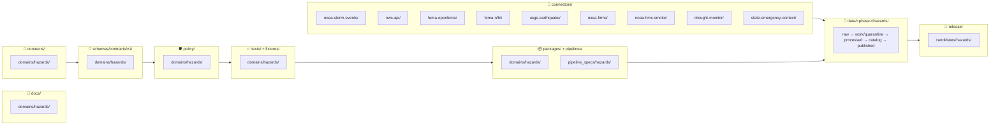

<!-- [KFM_META_BLOCK_V2]
doc_id: kfm://doc/docs/domains/hazards/missing_or_planned_files
title: Hazards — Missing or Planned Files
type: standard
version: v1
status: draft
owners: TBD — Hazards domain stewards + Directory Rules reviewers
created: 2026-05-17
updated: 2026-05-17
policy_label: public
related:
  - docs/doctrine/directory-rules.md
  - docs/registers/VERIFICATION_BACKLOG.md
  - docs/registers/DRIFT_REGISTER.md
  - docs/domains/hazards/README.md
  - docs/adr/README.md
tags: [kfm, domain, hazards, planning, directory-rules, backlog]
notes:
  - Repository is not mounted in this session; all path-shaped claims are PROPOSED.
  - This file is a planning inventory of the hazards domain lane, not a status report.
  - The life-safety boundary is doctrinal: KFM Hazards is NOT an emergency alert system.
[/KFM_META_BLOCK_V2] -->

# 🌪️ Hazards — Missing or Planned Files

> **Purpose.** Working inventory of every file the **hazards** domain lane is doctrinally expected to carry across every responsibility root, distinguishing what is **PROPOSED** by KFM doctrine from what is **NEEDS VERIFICATION**, **UNKNOWN**, or pending an **ADR**. This is a planning artifact, not a status claim.

**Status:** draft · **Owners:** _TBD — Hazards domain stewards + Directory Rules reviewers_ · **Last updated:** 2026-05-17

---

## 📑 Table of contents

1. [Scope and reading guide](#1-scope-and-reading-guide)
2. [Repo fit and lane pattern](#2-repo-fit-and-lane-pattern)
3. [Status legend](#3-status-legend)
4. [Lane inventory at a glance](#4-lane-inventory-at-a-glance)
5. [Per-root expected files](#5-per-root-expected-files)
   - [5.1 `docs/domains/hazards/`](#51-docsdomainshazards)
   - [5.2 `contracts/domains/hazards/`](#52-contractsdomainshazards)
   - [5.3 `schemas/contracts/v1/domains/hazards/`](#53-schemascontractsv1domainshazards)
   - [5.4 `policy/domains/hazards/`](#54-policydomainshazards)
   - [5.5 `tests/domains/hazards/`](#55-testsdomainshazards)
   - [5.6 `fixtures/domains/hazards/`](#56-fixturesdomainshazards)
   - [5.7 `packages/domains/hazards/`](#57-packagesdomainshazards)
   - [5.8 `pipelines/domains/hazards/` and `pipeline_specs/hazards/`](#58-pipelinesdomainshazards-and-pipeline_specshazards)
   - [5.9 `connectors/` (hazards source families)](#59-connectors-hazards-source-families)
   - [5.10 `data/<phase>/hazards/`](#510-dataphasehazards)
   - [5.11 `release/candidates/hazards/`](#511-releasecandidateshazards)
   - [5.12 Cross-cutting and adjacent](#512-cross-cutting-and-adjacent)
6. [Source families and connector backlog](#6-source-families-and-connector-backlog)
7. [Open ADR questions](#7-open-adr-questions)
8. [Verification backlog](#8-verification-backlog)
9. [Anti-pattern watchlist](#9-anti-pattern-watchlist)
10. [How to use this file](#10-how-to-use-this-file)
11. [Related docs](#11-related-docs)

---

## 1. Scope and reading guide

KFM Hazards governs historical hazard events, warnings/advisories/watches **as context only**, disaster declarations, regulatory hazard areas, scientific observations, remote sensing, models, exposure and resilience summaries, and bounded public runtime answers. The lane explicitly excludes life-safety alerting and must redirect emergency action to official sources.

This file enumerates what the lane is doctrinally expected to grow into, per Directory Rules §12 (Domain Placement Law) applied across the canonical responsibility roots. Each entry carries a status label so reviewers can see at a glance which artifacts exist, which are planned, and which are blocked on an ADR or verification.

> [!IMPORTANT]
> **Life-safety boundary is non-negotiable.** No file in this lane may render warning/advisory feeds as live alerts, replace official emergency sources, or expose unexpired operational state as if it were current safety guidance. Expired operational context cannot appear as a current warning. Stale-warning denial, emergency-alert denial, and official-source redirection are first-class validator and policy obligations — not nice-to-haves.

> [!NOTE]
> **Repository not mounted in this session.** Every path here is **PROPOSED** by KFM doctrine; no claim is made that any of these files currently exist, contain particular content, or are wired into CI. A future revision should reconcile this inventory against a live `git ls-tree` of the hazards lane and update statuses accordingly.

---

## 2. Repo fit and lane pattern

Per **Directory Rules §12 — Domain Placement Law**, hazards is a **domain segment** inside each responsibility root, never a root folder itself. The lane pattern expands as:

The root stays **stable and boring**; the hazards lane grows inside each responsibility root without ever fragmenting the lifecycle. This file walks each segment in turn.

[⬆ Back to top](#-table-of-contents)

---

## 3. Status legend

| Label | Meaning |
|---|---|
| **PRESENT** | File exists in the repo and meets its README/contract obligations. Use only when verified against a mounted repo. |
| **PROPOSED** | Path and purpose are doctrinally expected; no claim that the file currently exists. Default in this session. |
| **PARTIAL** | A file at the expected path exists but is incomplete, stale, or non-conforming. |
| **NEEDS VERIFICATION** | Could be checked but has not been in this session. |
| **DEFERRED** | Intentionally postponed until a precondition is met (named ADR, slice, or verification). |
| **BLOCKED-ON-ADR** | Requires an ADR before it can be placed (per Directory Rules §2.4). |
| **UNKNOWN** | No evidence either way. |

> [!NOTE]
> Because the repo is not mounted, virtually every row defaults to **PROPOSED** or **NEEDS VERIFICATION**. Do not promote any of these to **PRESENT** without a `git ls-tree`-equivalent inspection plus a content check against the cited contract.

---

## 4. Lane inventory at a glance

| Responsibility root | Lane segment | Required minimums | Status |
|---|---|---|---|
| `docs/` | `docs/domains/hazards/` | `README.md`, this file, life-safety boundary doc, source notes | **PROPOSED** |
| `contracts/` | `contracts/domains/hazards/` | Object meaning per family (HazardEvent … ImpactArea) | **PROPOSED** |
| `schemas/` | `schemas/contracts/v1/domains/hazards/` | JSON Schema per object family (ADR-0001 home) | **PROPOSED** |
| `policy/` | `policy/domains/hazards/` | Source-role, life-safety, operational-expiry, sensitivity bundles | **PROPOSED** |
| `tests/` | `tests/domains/hazards/` | Source-role anti-collapse, alert-denial, expiry/freshness, catalog closure | **PROPOSED** |
| `fixtures/` | `fixtures/domains/hazards/` | Historical flood + NFHL context + exposure summary fixture | **PROPOSED** |
| `packages/` | `packages/domains/hazards/` | Domain-specific normalization + role-classification helpers | **PROPOSED** |
| `pipelines/` + `pipeline_specs/` | `pipelines/domains/hazards/` · `pipeline_specs/hazards/` | Per-source RAW → PUBLISHED specs | **PROPOSED** |
| `connectors/` | One per source family | Source descriptors, deterministic admit | **PROPOSED** |
| `data/` | `data/<phase>/hazards/` | Lifecycle phases per Directory Rules §4 Step 2 | **PROPOSED** |
| `release/` | `release/candidates/hazards/` | Per-release ReleaseManifest + RollbackCard pair | **PROPOSED** |

[⬆ Back to top](#-table-of-contents)

---

## 5. Per-root expected files

Every table below carries `Truth` (CONFIRMED doctrine vs. PROPOSED implementation) and `Status` (presence). Filenames marked with `*` are illustrative naming conventions; the canonical name resolves on first PR.

### 5.1 `docs/domains/hazards/`

Domain documentation — the **human-readable** control plane for the lane. Belongs under `docs/` per Directory Rules §4 Step 1.

| File | Purpose | Truth | Status |
|---|---|---|---|
| `README.md` | Lane landing page; satisfies §15 Required README Contract | CONFIRMED doctrine | **PROPOSED** |
| `MISSING_OR_PLANNED_FILES.md` | **This file.** Planning inventory across responsibility roots | CONFIRMED doctrine | **PRESENT (this file)** |
| `LIFE_SAFETY_BOUNDARY.md` * | Explicit non-ownership statement; redirect-to-official rules; emergency-alert denial doctrine | CONFIRMED doctrine | **PROPOSED** |
| `SOURCE_NOTES.md` * | Per-source-family role assignments, rights notes, freshness expectations | PROPOSED implementation | **PROPOSED** |
| `OBJECT_FAMILIES.md` * | Hazards object families (HazardEvent, WarningContext, FloodContext, …) and identity rules | PROPOSED implementation | **PROPOSED** |
| `EVIDENCE_DRAWER_PAYLOAD.md` * | Hazards-specific Evidence Drawer payload shape, disclaimers, source-role surfacing | PROPOSED implementation | **PROPOSED** |
| `FOCUS_MODE_TEMPLATES.md` * | Bounded AI templates: stale-warning denial, official-source redirect, abstain conditions | PROPOSED implementation | **PROPOSED** |

> [!CAUTION]
> **A `docs/domains/hazards/README.md` without a documented life-safety boundary is a drift candidate.** The boundary cannot be implicit. If `README.md` lands before `LIFE_SAFETY_BOUNDARY.md` (or an equivalent section inside the README), reviewers should block the PR or open a drift entry.

[⬆ Back to top](#-table-of-contents)

### 5.2 `contracts/domains/hazards/`

Semantic meaning of each hazards object family — **Markdown only**. Executable validation lives in `schemas/`, `policy/`, and `tests/` per Directory Rules §6.3.

| File | Object family | Truth | Status |
|---|---|---|---|
| `README.md` | Lane README per §15 | CONFIRMED doctrine | **PROPOSED** |
| `hazard_event.md` * | `HazardEvent` — historical and observed events | CONFIRMED doctrine | **PROPOSED** |
| `hazard_observation.md` * | `HazardObservation` — observed measurements | CONFIRMED doctrine | **PROPOSED** |
| `warning_context.md` * | `WarningContext` — **context only**, not life-safety | CONFIRMED doctrine | **PROPOSED** |
| `advisory_context.md` * | `AdvisoryContext` — context only | CONFIRMED doctrine | **PROPOSED** |
| `disaster_declaration.md` * | `DisasterDeclaration` — FEMA/state declarations | CONFIRMED doctrine | **PROPOSED** |
| `flood_context.md` * | `FloodContext` — NFHL-derived regulatory context | CONFIRMED doctrine | **PROPOSED** |
| `wildfire_detection.md` * | `WildfireDetection` — FIRMS/HMS detections | CONFIRMED doctrine | **PROPOSED** |
| `smoke_context.md` * | `SmokeContext` — HMS smoke polygons as context | CONFIRMED doctrine | **PROPOSED** |
| `drought_indicator.md` * | `DroughtIndicator` — drought-monitor indicators | CONFIRMED doctrine | **PROPOSED** |
| `earthquake_event.md` * | `EarthquakeEvent` — USGS catalog events | CONFIRMED doctrine | **PROPOSED** |
| `heat_cold_event.md` * | `HeatColdEvent` — heat/cold context events | CONFIRMED doctrine | **PROPOSED** |
| `exposure_summary.md` * | `ExposureSummary` — public-safe exposure rollups | CONFIRMED doctrine | **PROPOSED** |
| `resilience_summary.md` * | `ResilienceSummary` — resilience indicators | CONFIRMED doctrine | **PROPOSED** |
| `hazard_timeline.md` * | `HazardTimeline` — multi-event timelines | CONFIRMED doctrine | **PROPOSED** |
| `impact_area.md` * | `ImpactArea` — impact-area polygons | CONFIRMED doctrine | **PROPOSED** |

> [!NOTE]
> Object families are CONFIRMED in KFM doctrine (Atlas v1.1 §12.B and Encyclopedia §7.10). Their **field realization** is PROPOSED — schemas/policy/tests must follow before any of these are treated as enforced.

[⬆ Back to top](#-table-of-contents)

### 5.3 `schemas/contracts/v1/domains/hazards/`

Machine-checkable shape per **ADR-0001**: the default schema home is `schemas/contracts/v1/...`, not `contracts/<domain>/`.

| File | Validates | Truth | Status |
|---|---|---|---|
| `README.md` | Lane README per §15 | CONFIRMED doctrine | **PROPOSED** |
| `hazard_event.schema.json` * | `HazardEvent` shape | PROPOSED implementation | **PROPOSED** |
| `hazard_observation.schema.json` * | `HazardObservation` shape | PROPOSED implementation | **PROPOSED** |
| `warning_context.schema.json` * | `WarningContext` shape (issue/expiry mandatory) | PROPOSED implementation | **PROPOSED** |
| `advisory_context.schema.json` * | `AdvisoryContext` shape | PROPOSED implementation | **PROPOSED** |
| `disaster_declaration.schema.json` * | `DisasterDeclaration` shape | PROPOSED implementation | **PROPOSED** |
| `flood_context.schema.json` * | `FloodContext` (DFIRM_ID, VERSION_ID, EFFECTIVE_DATE preserved) | PROPOSED implementation | **PROPOSED** |
| `wildfire_detection.schema.json` * | `WildfireDetection` shape | PROPOSED implementation | **PROPOSED** |
| `smoke_context.schema.json` * | `SmokeContext` shape | PROPOSED implementation | **PROPOSED** |
| `drought_indicator.schema.json` * | `DroughtIndicator` shape | PROPOSED implementation | **PROPOSED** |
| `earthquake_event.schema.json` * | `EarthquakeEvent` shape | PROPOSED implementation | **PROPOSED** |
| `heat_cold_event.schema.json` * | `HeatColdEvent` shape | PROPOSED implementation | **PROPOSED** |
| `exposure_summary.schema.json` * | `ExposureSummary` shape | PROPOSED implementation | **PROPOSED** |
| `resilience_summary.schema.json` * | `ResilienceSummary` shape | PROPOSED implementation | **PROPOSED** |
| `hazard_timeline.schema.json` * | `HazardTimeline` shape | PROPOSED implementation | **PROPOSED** |
| `impact_area.schema.json` * | `ImpactArea` shape | PROPOSED implementation | **PROPOSED** |
| `hazards_decision_envelope.schema.json` * | `HazardsDecisionEnvelope` runtime DTO | PROPOSED implementation | **BLOCKED-ON-ADR** (envelope home) |

> [!WARNING]
> **Schema-home rule (ADR-0001).** If schemas land under `contracts/domains/hazards/*.schema.json` instead of `schemas/contracts/v1/domains/hazards/...`, that is `CONFLICTED` per Directory Rules §13.1 and must be migrated before any new schema lands. **Do not maintain divergent definitions in both `schemas/` and `contracts/`.**

[⬆ Back to top](#-table-of-contents)

### 5.4 `policy/domains/hazards/`

Admissibility, release, sensitivity, and runtime gates per Directory Rules §6.5.

| File | Decides | Truth | Status |
|---|---|---|---|
| `README.md` | Lane README per §15 | CONFIRMED doctrine | **PROPOSED** |
| `source_role.rego` * | Source-role classification + anti-collapse: authority ≠ observation ≠ context ≠ model | CONFIRMED doctrine / PROPOSED implementation | **PROPOSED** |
| `life_safety_denial.rego` * | DENY any path that renders advisories/watches/warnings as live alerts | CONFIRMED doctrine / PROPOSED implementation | **PROPOSED** |
| `operational_expiry.rego` * | DENY expired operational-context items presented as current state | CONFIRMED doctrine / PROPOSED implementation | **PROPOSED** |
| `stale_warning_denial.rego` * | DENY warning-context past expiry on map / drawer / API surface | CONFIRMED doctrine / PROPOSED implementation | **PROPOSED** |
| `nfhl_regulatory.rego` * | NFHL surfaces are regulatory context, not observed inundation or forecast | CONFIRMED doctrine / PROPOSED implementation | **PROPOSED** |
| `sensitivity.rego` * | Restricted-geometry handling for sensitive joins (defaults fail-closed) | CONFIRMED doctrine / PROPOSED implementation | **PROPOSED** |
| `rights.rego` * | Rights status per source family; unknown-rights → DENY | CONFIRMED doctrine / PROPOSED implementation | **PROPOSED** |
| `release_gate.rego` * | Hazards-specific release-gate composition | CONFIRMED doctrine / PROPOSED implementation | **PROPOSED** |

> [!IMPORTANT]
> **Operational warning products are contextual only and not for life safety.** Unknown source roles are quarantined; expired operational context cannot appear as current warning state. This is doctrine (Atlas v1.1 §12.I); the policy bundles above are the enforcement surface.

[⬆ Back to top](#-table-of-contents)

### 5.5 `tests/domains/hazards/`

Proof that the doctrine is enforceable. Each test below is **PROPOSED** in the Atlas verification backlog (§12.K).

| File | Proves | Truth | Status |
|---|---|---|---|
| `README.md` | Lane README per §15 | CONFIRMED doctrine | **PROPOSED** |
| `test_source_role_anti_collapse.py` * | Cannot collapse authority/observation/context/model into one truth class | PROPOSED implementation | **PROPOSED** |
| `test_temporal_role_validators.py` * | Event time, valid/issue/expiry, source/retrieval/release time stay distinct | PROPOSED implementation | **PROPOSED** |
| `test_emergency_alert_denial.py` * | DENY any route that renders warnings as life-safety alerts | PROPOSED implementation | **PROPOSED** |
| `test_operational_expiry_freshness.py` * | Expired warning context cannot surface as current state | PROPOSED implementation | **PROPOSED** |
| `test_stale_warning_denial.py` * | Stale-warning denial enforced on map, drawer, API surfaces | PROPOSED implementation | **PROPOSED** |
| `test_catalog_closure.py` * | EvidenceBundle, EvidenceRef, ValidationReport closure for hazards artifacts | PROPOSED implementation | **PROPOSED** |
| `test_evidence_drawer_disclaimer.py` * | Hazards drawer must surface life-safety disclaimer + official-source link | PROPOSED implementation | **PROPOSED** |
| `test_ui_no_direct_source.py` * | Public UI never reads raw NWS/FIRMS/NFHL directly; goes through governed API | PROPOSED implementation | **PROPOSED** |
| `test_nfhl_not_inundation.py` * | NFHL features cannot be published or rendered as observed inundation or forecast | PROPOSED implementation | **PROPOSED** |
| `test_rollback_drill.py` * | Hazards release → rollback card → restored prior manifest | PROPOSED implementation | **PROPOSED** |

> [!NOTE]
> The Atlas explicitly lists `Source-role anti-collapse`, `temporal-role validators`, `emergency-alert denial`, `operational expiry/freshness`, `catalog closure`, `Evidence Drawer disclaimer`, and `UI no-direct-source` as PROPOSED validator tests for hazards. The NFHL-specific test is added here because the Master MapLibre source explicitly warns against treating NFHL as observed inundation or model output.

[⬆ Back to top](#-table-of-contents)

### 5.6 `fixtures/domains/hazards/`

No-network fixtures. The hazards thin slice from KFM Encyclopedia §7.10 is:

> _Historical flood/severe weather event fixture plus NFHL context and exposure summary, with warning feeds disabled or contextual-only._

| File | Provides | Truth | Status |
|---|---|---|---|
| `README.md` | Lane README per §15 | CONFIRMED doctrine | **PROPOSED** |
| `historical_flood/event.json` * | One historical flood `HazardEvent` (e.g., a Kansas flood of record) | PROPOSED implementation | **PROPOSED** |
| `historical_flood/nfhl_context.json` * | One NFHL zone polygon as `FloodContext` (with VERSION_ID, EFFECTIVE_DATE) | PROPOSED implementation | **PROPOSED** |
| `historical_flood/exposure_summary.json` * | One `ExposureSummary` over the flood footprint | PROPOSED implementation | **PROPOSED** |
| `historical_flood/evidence_bundle.json` * | EvidenceBundle binding the three above | PROPOSED implementation | **PROPOSED** |
| `historical_flood/layer_manifest.json` * | Public-safe `LayerManifest` for the slice | PROPOSED implementation | **PROPOSED** |
| `historical_flood/drawer_payload.json` * | Evidence Drawer payload, life-safety disclaimer surfaced | PROPOSED implementation | **PROPOSED** |
| `historical_flood/release_manifest.json` * | Dry-run `ReleaseManifest` for the slice | PROPOSED implementation | **PROPOSED** |
| `negative/expired_warning_as_current.json` * | Negative fixture: expired warning treated as current → must DENY | PROPOSED implementation | **PROPOSED** |
| `negative/nfhl_as_observed_inundation.json` * | Negative fixture: NFHL labeled as observed inundation → must DENY | PROPOSED implementation | **PROPOSED** |
| `negative/unknown_source_role.json` * | Negative fixture: source role unknown → must QUARANTINE | PROPOSED implementation | **PROPOSED** |
| `negative/missing_rights.json` * | Negative fixture: rights unknown → must DENY | PROPOSED implementation | **PROPOSED** |

[⬆ Back to top](#-table-of-contents)

### 5.7 `packages/domains/hazards/`

Domain-specific library code (not pipeline orchestration). Use sparingly; cross-domain utilities live outside the domain segment per Directory Rules §12.

| File / module | Purpose | Truth | Status |
|---|---|---|---|
| `README.md` | Lane README per §15 | CONFIRMED doctrine | **PROPOSED** |
| `source_role_classifier/` * | Classify a source family into authority / observation / context / model | PROPOSED implementation | **PROPOSED** |
| `temporal_role_normalizer/` * | Normalize event/valid/issue/expiry/source/retrieval/release times | PROPOSED implementation | **PROPOSED** |
| `nfhl_attribute_preserver/` * | Preserve `DFIRM_ID`, `VERSION_ID`, `EFFECTIVE_DATE` verbatim through pipeline | PROPOSED implementation | **PROPOSED** |
| `exposure_overlay/` * | Public-safe exposure-overlay computation | PROPOSED implementation | **PROPOSED** |
| `stale_warning_detector/` * | Detect operational-context items past expiry | PROPOSED implementation | **PROPOSED** |

[⬆ Back to top](#-table-of-contents)

### 5.8 `pipelines/domains/hazards/` and `pipeline_specs/hazards/`

`pipeline_specs/` says **what** should run (declarative); `pipelines/` is **how** it runs (executable).

| File | Purpose | Truth | Status |
|---|---|---|---|
| `pipelines/domains/hazards/README.md` | Lane README per §15 | CONFIRMED doctrine | **PROPOSED** |
| `pipeline_specs/hazards/README.md` | Lane README per §15 | CONFIRMED doctrine | **PROPOSED** |
| `pipeline_specs/hazards/noaa_storm_events.yaml` * | Storm Events RAW → PUBLISHED spec | PROPOSED implementation | **PROPOSED** |
| `pipeline_specs/hazards/nws_alerts_context.yaml` * | NWS alerts → `WarningContext`/`AdvisoryContext` (context only) | PROPOSED implementation | **PROPOSED** |
| `pipeline_specs/hazards/fema_openfema.yaml` * | OpenFEMA declarations → `DisasterDeclaration` | PROPOSED implementation | **PROPOSED** |
| `pipeline_specs/hazards/fema_nfhl.yaml` * | NFHL → `FloodContext` (verbatim attribute preservation) | PROPOSED implementation | **PROPOSED** |
| `pipeline_specs/hazards/usgs_earthquake.yaml` * | USGS Earthquake Catalog → `EarthquakeEvent` | PROPOSED implementation | **PROPOSED** |
| `pipeline_specs/hazards/nasa_firms.yaml` * | FIRMS active fire → `WildfireDetection` | PROPOSED implementation | **PROPOSED** |
| `pipeline_specs/hazards/noaa_hms_smoke.yaml` * | NOAA HMS smoke → `SmokeContext` | PROPOSED implementation | **PROPOSED** |
| `pipeline_specs/hazards/drought_monitor.yaml` * | Drought monitors → `DroughtIndicator` | PROPOSED implementation | **PROPOSED** |
| `pipeline_specs/hazards/exposure_resilience_rollup.yaml` * | Build `ExposureSummary`/`ResilienceSummary` from released layers | PROPOSED implementation | **PROPOSED** |

> [!CAUTION]
> **Watcher-as-non-publisher invariant.** Any worker or watcher that polls these sources MUST emit candidate decisions and receipts only — it may not write directly to `data/catalog/` or `data/published/`. Promotion is a governed state transition, never an automatic flush.

[⬆ Back to top](#-table-of-contents)

### 5.9 `connectors/` (hazards source families)

Source-specific fetchers/admitters. Per Directory Rules §13.5: connectors emit to `data/raw/` or `data/quarantine/`, never directly to `data/processed/` or `data/published/`.

| Connector | Source family | Role | Status |
|---|---|---|---|
| `connectors/noaa-storm-events/` * | NOAA Storm Events / NCEI-style records | authority / observation (historical) | **PROPOSED** |
| `connectors/nws-api/` * | NWS alerts/warnings/advisories/watches | **context only** — never live alerting | **PROPOSED** |
| `connectors/fema-openfema/` * | FEMA Disaster Declarations / OpenFEMA | authority (declarations) | **PROPOSED** |
| `connectors/fema-nfhl/` * | FEMA NFHL / MSC flood hazard | regulatory context | **PROPOSED** |
| `connectors/usgs-earthquake/` * | USGS Earthquake Catalog | observation | **PROPOSED** |
| `connectors/noaa-hms-smoke/` * | NOAA HMS Fire and Smoke | context | **PROPOSED** |
| `connectors/nasa-firms/` * | NASA FIRMS active fire | observation (with caveats) | **PROPOSED** |
| `connectors/drought-monitor/` * | Drought monitors | context | **PROPOSED** |
| `connectors/state-emergency-context/` * | Kansas/local emergency management context | context (rights-bound) | **PROPOSED** |

> [!NOTE]
> Per Atlas v1.1 §12.D, **all** of the above source families currently have `rights NEEDS VERIFICATION; sensitive joins fail closed`. A `SourceActivationDecision` per Directory Rules §6.5 + an explicit rights record is required before any connector ships.

[⬆ Back to top](#-table-of-contents)

### 5.10 `data/<phase>/hazards/`

Lifecycle data — the invariant `RAW → WORK/QUARANTINE → PROCESSED → CATALOG/TRIPLET → PUBLISHED` lives here per Directory Rules §4 Step 2.

| Path | Phase responsibility | Status |
|---|---|---|
| `data/raw/hazards/` | Connector outputs only; never reads back into public path | **PROPOSED** |
| `data/work/hazards/` | Normalization in progress | **PROPOSED** |
| `data/quarantine/hazards/` | Failed validation, unresolved source role, rights gap, sensitivity gap | **PROPOSED** |
| `data/processed/hazards/` | Validated normalized objects + receipts + public-safe candidates | **PROPOSED** |
| `data/catalog/domain/hazards/` | EvidenceBundles, catalog records, graph/triplet projections, release candidates | **PROPOSED** |
| `data/published/layers/hazards/` | Released public-safe artifacts (served via governed API only) | **PROPOSED** |
| `data/registry/sources/hazards/` | Hazards source registry | **PROPOSED** |
| `data/receipts/` (hazards-related) | RunReceipts emitted by hazards pipelines (shared root, no domain subdir) | **PROPOSED** |
| `data/proofs/` (hazards-related) | Proofs emitted by hazards pipelines (shared root, no domain subdir) | **PROPOSED** |

> [!WARNING]
> **Lifecycle skip is an anti-pattern.** A hazards pipeline that writes from `data/raw/` directly to `data/published/` is a Directory Rules §13.5 violation. All phases run. Promotion is a governed state transition.

[⬆ Back to top](#-table-of-contents)

### 5.11 `release/candidates/hazards/`

Release **decisions** (distinct from `data/published/`, which holds released **artifacts**).

| File | Purpose | Truth | Status |
|---|---|---|---|
| `README.md` | Lane README per §15 | CONFIRMED doctrine | **PROPOSED** |
| `<slice-id>/release_manifest.json` * | ReleaseManifest for a hazards slice | PROPOSED implementation | **PROPOSED** |
| `<slice-id>/promotion_decision.json` * | PromotionDecision per release | PROPOSED implementation | **PROPOSED** |
| `<slice-id>/rollback_card.json` * | RollbackCard naming the prior manifest + restore steps | PROPOSED implementation | **PROPOSED** |
| `<slice-id>/review_record.json` * | ReviewRecord for steward/release reviewer | PROPOSED implementation | **PROPOSED** |
| `<slice-id>/correction_notices/` * | CorrectionNotice references when applicable | PROPOSED implementation | **PROPOSED** |

[⬆ Back to top](#-table-of-contents)

### 5.12 Cross-cutting and adjacent

Files that touch hazards but live **outside** the domain segment (per Directory Rules §12, "Multi-domain and cross-cutting files").

| File / path | Why it's outside the hazards segment | Status |
|---|---|---|
| `apps/governed-api/` (hazards routes) | Public trust path; hazards routes live under the governed API, not under a hazards root | **PROPOSED** |
| `packages/ui/` (hazards components) | Shared UI; map shell components for hazards stay in the UI package, not under `packages/domains/hazards/` | **PROPOSED** |
| `packages/maplibre/` (hazards style fragments) | Renderer is a shared package | **PROPOSED** |
| `tools/validators/<topic>/` (cross-domain) | Cross-domain validators (e.g., temporal-role) go to a non-domain topic segment | **PROPOSED** |
| `docs/architecture/governed-api.md` | Where the hazards governed-API contract lives | **PROPOSED** |
| `docs/sources/SOURCE_DESCRIPTOR_STANDARD.md` | Source descriptors are repo-wide, not hazards-specific | **PROPOSED** |

[⬆ Back to top](#-table-of-contents)

---

## 6. Source families and connector backlog

<strong>📖 Per-family connector backlog (click to expand)</strong>

| Source family | Atlas role | Hazards object families touched | Rights / sensitivity | Connector status |
|---|---|---|---|---|
| **NOAA Storm Events / NCEI-style records** | authority / observation (historical) | `HazardEvent`, `HazardObservation`, `HeatColdEvent` | Rights **NEEDS VERIFICATION**; sensitive joins fail closed | **PROPOSED** |
| **NWS alerts/warnings/advisories/watches** | **context only** | `WarningContext`, `AdvisoryContext` | Rights **NEEDS VERIFICATION**; **never** rendered as life-safety | **PROPOSED** |
| **FEMA Disaster Declarations / OpenFEMA** | authority | `DisasterDeclaration` | Rights **NEEDS VERIFICATION** | **PROPOSED** |
| **FEMA NFHL / MSC flood hazard context** | regulatory context | `FloodContext` | Rights **NEEDS VERIFICATION**; preserve `DFIRM_ID`/`VERSION_ID`/`EFFECTIVE_DATE` verbatim | **PROPOSED** |
| **USGS Earthquake Catalog** | observation | `EarthquakeEvent` | Rights **NEEDS VERIFICATION** | **PROPOSED** |
| **NOAA HMS Fire and Smoke** | context | `SmokeContext`, `WildfireDetection` | Rights **NEEDS VERIFICATION** | **PROPOSED** |
| **NASA FIRMS active fire** | observation (caveats) | `WildfireDetection` | Rights **NEEDS VERIFICATION**; not authoritative for legal fire status | **PROPOSED** |
| **Drought monitors** | context | `DroughtIndicator` | Rights **NEEDS VERIFICATION** | **PROPOSED** |
| **Kansas / local emergency context** | context (rights-bound) | `WarningContext`, `AdvisoryContext`, `DisasterDeclaration` | Rights **NEEDS VERIFICATION**; many sources have access constraints | **PROPOSED** |

Cross-domain joins worth noting:

- **Hydrology** owns water evidence; hazards only consumes it for `FloodContext` and exposure overlays. Joins must respect the hydrology lane's source-role rules.
- **Atmosphere/Air** owns observed weather, AQ, and smoke observations; hazards consumes derived `SmokeContext` and `HeatColdEvent` evidence.
- **Settlements/Infrastructure** owns canonical settlement/infrastructure claims; `ExposureSummary` overlays must not re-publish settlement identity.

[⬆ Back to top](#-table-of-contents)

---

## 7. Open ADR questions

Per Directory Rules §2.4, the following structural decisions are ADR-class for the hazards lane.

| # | Question | Why it's ADR-class | Suggested ADR title (PROPOSED) |
|---|---|---|---|
| ADR-HAZ-01 | Where does `HazardsDecisionEnvelope` live — `schemas/contracts/v1/runtime/` (shared) or `schemas/contracts/v1/domains/hazards/` (domain segment)? | Decision envelopes may or may not be domain-specific; placement affects every domain lane | Decision-envelope home: shared vs. per-domain |
| ADR-HAZ-02 | Stale-warning denial: enforced in `policy/domains/hazards/` only, or also in `runtime/envelopes/` as a generic capability? | Cross-cutting if other domains also carry expiring contexts (e.g., atmosphere advisories) | Stale-context denial: domain vs. runtime |
| ADR-HAZ-03 | NFHL attribute-preservation contract: a hazards-domain concern, or a shared spatial-attribute-preservation contract under `contracts/data/`? | Verbatim attribute preservation may apply broadly (e.g., legal/regulatory layers in other domains) | Verbatim-attribute preservation contract |
| ADR-HAZ-04 | Source-role enum — canonical vocabulary placement and evolution rule (also tracked at repo level as ADR-S-04) | Source-role anti-collapse depends on a stable enum | Source-role vocabulary v1 |
| ADR-HAZ-05 | Should `data/registry/sources/hazards/` carry per-source rights records, or only descriptor metadata? | Mixing rights into descriptors vs. separating into a rights register affects audit surface | Rights record placement |
| ADR-HAZ-06 | Are connector outputs in `data/raw/hazards/` partitioned by source family or by retrieval date first? | Partitioning shape affects watcher logic and rollback scope | RAW partitioning convention |

[⬆ Back to top](#-table-of-contents)

---

## 8. Verification backlog

Items inherited from Atlas v1.1 §12.N and expanded for the lane inventory. Each row needs `mounted repo files, schemas, registry entries, tests, logs, emitted artifacts, review records, or release manifests` to advance.

| Item | Why it matters | Status |
|---|---|---|
| Verify official source endpoints and rights | No connector ships without rights resolution and current terms | **NEEDS VERIFICATION** |
| Implement role taxonomy and freshness states | Source-role anti-collapse and stale-warning denial both depend on the taxonomy | **NEEDS VERIFICATION** |
| Verify emergency-alert boundary enforcement | DENY-as-life-safety-alert tests must exist and pass in CI | **NEEDS VERIFICATION** |
| Verify release / correction / rollback drill | Reversibility is a core invariant; drill must run on a hazards fixture | **NEEDS VERIFICATION** |
| Confirm `HazardsDecisionEnvelope` schema home | See ADR-HAZ-01 | **BLOCKED-ON-ADR** |
| Confirm NFHL attribute-preservation contract location | See ADR-HAZ-03 | **BLOCKED-ON-ADR** |
| Inspect repo for existing `data/catalog/domain/hazards/` artifacts | None claimed; cannot promote PROPOSED → PRESENT without inspection | **NEEDS VERIFICATION** |
| Inspect repo for existing hazards routes under `apps/governed-api/` | Public trust path verification | **NEEDS VERIFICATION** |
| Confirm `kfm_hazards_extended_pro_pdf_only_blueprint.pdf` claims map onto current repo files | Doc lineage vs. live repo | **NEEDS VERIFICATION** |

> [!TIP]
> When checking these items against a mounted repo, also reconcile `docs/registers/VERIFICATION_BACKLOG.md` so this domain's backlog stays in sync with the repo-wide register.

[⬆ Back to top](#-table-of-contents)

---

## 9. Anti-pattern watchlist

Patterns that, if observed in the hazards lane, should generate a drift entry per Directory Rules §13.

| Anti-pattern | Specific to hazards | Severity |
|---|---|---|
| Live-alert rendering | UI or API surfaces an unexpired warning as a life-safety alert | **CRITICAL** — emergency-alert denial must hold |
| NFHL as observed inundation | `FloodContext` published or rendered as an observed flood extent | **HIGH** — regulatory ≠ observed |
| Warning as current after expiry | `WarningContext`/`AdvisoryContext` displayed past its `expiry` time | **HIGH** — stale-warning denial must hold |
| Schema home drift | A hazards schema lands under `contracts/domains/hazards/*.schema.json` | **HIGH** — violates ADR-0001 |
| Domain-as-root | A `hazards/` top-level folder | **HIGH** — violates §12 |
| Connector publishes | Hazards connector writes to `data/processed/` or `data/published/` | **HIGH** — violates §13.5 |
| Watcher publishes | A worker writes to `data/catalog/domain/hazards/` or `data/published/layers/hazards/` | **HIGH** — watcher-as-non-publisher |
| Direct source from UI | UI reads NWS/FIRMS/NFHL endpoints without going through the governed API | **HIGH** — violates trust membrane |
| Lifecycle skip | A pipeline writes from `data/raw/hazards/` directly to `data/published/layers/hazards/` | **HIGH** — violates lifecycle invariant |
| Single-file root | A hazards subfolder with one file is created, then never grows | **MEDIUM** — drift candidate per §13.5 |
| AI as authority | A Focus Mode answer treated as a hazards finding without an `EvidenceBundle` and `AIReceipt` | **HIGH** — AI never root truth |

[⬆ Back to top](#-table-of-contents)

---

## 10. How to use this file

This file is a **planning inventory**. It does not enforce, validate, or promote anything by itself. Use it like this:

1. When a hazards-related PR adds, moves, or renames a file, look up the affected row(s) here and update the **Status** column in the same PR.
2. When a row flips from **PROPOSED** to **PRESENT**, link the PR or commit in the row (use a footnote if the table is too wide).
3. When a new file is added that is not in this inventory, **add a row** for it in the same PR — do not let new lane files land silently.
4. When an ADR closes one of the §7 questions, add the ADR ID next to the affected rows and remove the `BLOCKED-ON-ADR` status.
5. Reconcile against `docs/registers/VERIFICATION_BACKLOG.md` on every major review cycle so the lane inventory and the repo-wide register do not drift.

> [!TIP]
> **The most useful next PR** for this lane, per Atlas §12 and Encyclopedia §7.10, is the **historical flood + NFHL context + exposure summary** thin slice (fixtures + schema + policy + tests + dry-run release), with **warning feeds disabled or contextual-only**. Optimizing the inventory before that slice is shipped is premature.

[⬆ Back to top](#-table-of-contents)

---

## 11. Related docs

> All targets below are **PROPOSED** in this session; reconcile against the live repo before relying on them.

- `docs/doctrine/directory-rules.md` — Directory Rules (especially §4, §6, §12, §13, §15).
- `docs/domains/hazards/README.md` — Hazards lane landing page (planned).
- `docs/domains/hazards/LIFE_SAFETY_BOUNDARY.md` — Life-safety non-ownership statement (planned).
- `docs/registers/VERIFICATION_BACKLOG.md` — Repo-wide verification backlog.
- `docs/registers/DRIFT_REGISTER.md` — Drift entries from this lane.
- `docs/adr/README.md` — ADR index; ADR-HAZ-* entries (planned) will land here.
- `docs/architecture/governed-api.md` — Governed API surface where hazards routes live.
- `docs/sources/SOURCE_DESCRIPTOR_STANDARD.md` — Source-descriptor standard for connectors.
- `docs/runbooks/` — Runbook home (hazards refresh runbook PROPOSED; subfolder convention to be confirmed).

---

<strong>Last reviewed:</strong> 2026-05-17 ·
<strong>Doc version:</strong> v1 (initial inventory) ·
<strong>Lineage:</strong> KFM Domains Culmination Atlas v1.1 §12; KFM Encyclopedia §7.10; Directory Rules §12 (Domain Placement Law), §15 (Required README Contract) ·
<a href="#-hazards--missing-or-planned-files">⬆ Back to top</a>

