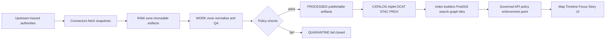

<!-- [KFM_META_BLOCK_V2]
doc_id: kfm://doc/8b0e6a2c-6e6e-4f84-9a12-0d8f64b2a7e3
title: Hazards Domain Pipelines
type: standard
version: v1
status: draft
owners: ["TODO:hazards-domain-stewards", "TODO:data-pipelines-stewards"]
created: 2026-03-04
updated: 2026-03-04
policy_label: public
related:
  - "docs/domains/hazards/README.md"
  - "src/pipelines/autonomous/hazards-refresh/README.md"
  - "docs/standards/governance/ROOT-GOVERNANCE.md"
  - "docs/standards/faircare/FAIRCARE-GUIDE.md"
tags: [kfm, hazards, pipelines, etl, provenance, stac, dcat, prov, governance]
notes:
  - "This file is a governed description of Hazards pipelines. Any feature not verified in-repo MUST be labeled PROPOSED."
[/KFM_META_BLOCK_V2] -->

# Hazards Domain Pipelines
One-line purpose: Define the governed pipeline(s) that ingest, normalize, catalog, and publish hazard events and derived hazard products into KFM.

---

## Impact
- **Status:** draft (this document), pipeline implementation may be active (see Evidence Status)
- **Owners:** `TODO:hazards-domain-stewards`, `TODO:data-pipelines-stewards`
- **Policy posture:** default-deny; fail-closed promotion; evidence-required
- **Quick links:** [Scope](#scope) · [Pipelines](#pipelines) · [Hazards Refresh](#hazards-refresh-pipeline) · [Gates](#promotion-contract-gates-for-hazards) · [Quickstart](#quickstart-local--ci)

Badges (placeholders; replace with real shields in-repo):
- 
- 
- 

---

## Evidence status
Legend:
- **CONFIRMED:** explicitly described in KFM documentation (source-linked in repo or governed briefings)
- **PROPOSED:** target contract / intended behavior (must be verified in code, tests, or run receipts before treating as implemented)
- **UNKNOWN:** not yet verified; smallest steps listed to confirm

### What is CONFIRMED (documented)
- **CONFIRMED:** A “Hazards Refresh” pipeline (v11) is described as an automated ETL that ingests multi-hazard sources (NOAA Storm Events, live NWS warnings polygon feeds, FEMA disaster declarations, USGS earthquakes, satellite wildfire detection).  
- **CONFIRMED:** It is described as **daily** and **on-demand**, with a **declarative DAG** (LangGraph YAML) including steps for stale detection → fetch → normalize → build STAC items → validate checksums → sync to Neo4j.  
- **CONFIRMED:** Hazards are expected to follow KFM’s “truth path” lifecycle zones and “catalog triplet” (DCAT + STAC + PROV) and pass promotion gates (fail-closed).

### What is PROPOSED (this doc’s contract)
- **PROPOSED:** Canonical hazard schemas, stable IDs, and output directory layout (until verified against `contracts/`, `schemas/`, and `src/pipelines/...`).
- **PROPOSED:** Exact CLI commands, Make targets, container images, and CI workflow names.

### What is UNKNOWN (needs verification)
- **UNKNOWN:** Exact dataset IDs, versioning scheme, and spec_hash inputs for hazards datasets.
- **UNKNOWN:** Exact STAC Collection IDs and Neo4j label/edge mappings for hazards.
- **UNKNOWN:** The precise schedule mechanism (cron vs watcher vs CI dispatch).

Smallest verification steps:
1. Open `src/pipelines/autonomous/hazards-refresh/README.md` and confirm: schedule, DAG file names, output paths, and run commands.
2. Locate hazards catalog artifacts (DCAT/STAC/PROV) under `data/` and confirm IDs and cross-links.
3. Find pipeline receipts/run manifests for hazards and confirm toolchain versions and checksums.
4. Find mapping specs for Neo4j ingestion (e.g., `graph/mappings/hazards/*.yml`) and confirm labels/edges.

---

## Scope
This document covers:
- Pipelines that ingest and refresh hazard event data and hazard-derived products.
- Their governed data flow across zones: **RAW → WORK/QUARANTINE → PROCESSED → CATALOG/TRIPLET → PUBLISHED**.
- The minimum promotion gates, evidence surfaces, and safety constraints for hazards.

---

## Where it fits in the repo
- **You are here:** `docs/domains/hazards/PIPELINES.md`
- **Upstream:** external hazard authorities and feeds (NOAA, NWS, FEMA, USGS, satellite-derived wildfire detections)
- **Downstream:** governed API + Map/Timeline UI + Focus/Story surfaces (all access via Policy Enforcement Point; no direct store access)

Key invariants this domain MUST respect:
- Clients and UI must not access storage directly; all access is policy-evaluated behind the governed API and evidence resolver.
- Promotion to runtime (“PUBLISHED”) is blocked unless artifacts, catalogs, and receipts exist and validate (fail-closed).

---

## Acceptable inputs
- Authoritative, publicly documented hazard event sources and declarations (agency datasets and feeds).
- Machine-readable event records (CSV/JSON/GeoJSON), polygon/geometry products where licensing and terms are explicit.
- Satellite-derived hazard detections when provenance, methodology, and licensing are captured.

---

## Exclusions
- **Not an emergency alert system.** Even if near-real-time warnings are ingested, KFM hazards are not a dispatch/alerting platform.
- **No direct-to-store writes/reads from clients.** UI/clients must cross the governed API boundary.
- **No promotion without evidence.** If provenance, licensing, or sensitivity classification is unclear, hazards data MUST remain in WORK/QUARANTINE.

---

## Pipelines

| Pipeline | Purpose | Trigger | Primary outputs | Status |
|---|---|---|---|---|
| Hazards Refresh | Refresh hazard events from multiple authorities; normalize; catalog; index into graph | Daily + on-demand | Event tables/files, STAC Items, DCAT Dataset/Distributions, PROV bundle, receipts; graph nodes | **CONFIRMED (documented as v11 Active/Enforced); IMPLEMENTATION STATUS UNKNOWN until verified in-repo** |

---

## Hazards Refresh pipeline

### Overview
**CONFIRMED (documented):** “Hazards Refresh” is a zero-touch ETL that ingests multi-hazard event streams and declarations, normalizes events, builds catalog artifacts, validates integrity, and syncs hazards into Neo4j for timeline/map/graph access.

### Triggers
- **CONFIRMED:** Daily refresh.
- **CONFIRMED:** On-demand runs (manual/operator or CI dispatch).
- **PROPOSED:** A “watcher” detects upstream changes and dispatches a governed run that produces a PR with artifacts + receipts.

### Sources
**CONFIRMED (documented examples):**
- NOAA Storm Events (tornado, hail, floods)
- NWS severe weather warnings (polygon feeds)
- FEMA disaster declarations (e.g., drought/flood declarations by county)
- USGS earthquake records
- Satellite-derived wildfire detection products

> IMPORTANT (safety): When exposing hazards in UI, default to aggregated and contextualized views and avoid sensational narratives. If the data could plausibly cause harm (sensitive infrastructure, vulnerable populations, etc.), apply sensitivity labeling and policy restrictions.

### Pipeline orchestration
- **CONFIRMED:** Declarative DAG (LangGraph YAML).
- **CONFIRMED:** Stages include: stale detection → fetch → normalize → STAC build → checksum validation → Neo4j sync.

### Data flow


### Artifacts by lifecycle zone (contract)
This section is **PROPOSED** until verified against actual hazards pipeline outputs.

#### RAW
- Acquisition manifest (what was fetched, from where, when, under what terms)
- Raw payload snapshots (files/responses)
- Checksums for raw artifacts
- License/terms snapshot

#### WORK / QUARANTINE
- Normalized intermediate representations (parsed tables, standardized geometry)
- QA reports (schema, spatial validity, completeness)
- Candidate redactions/generalizations (if needed)
- Quarantine outputs for: unclear licensing, failed validation, sensitivity concerns

#### PROCESSED
- Publishable, standardized hazard event artifacts (e.g., GeoParquet, GeoJSON, PMTiles, summary tables)
- Checksums for every processed artifact
- Derived metadata for runtime (bounds, temporal extents, counts)

#### CATALOG / TRIPLET
- **DCAT**: dataset-level metadata (license, publisher, distributions)
- **STAC**: collection/items/assets for spatiotemporal artifacts
- **PROV**: lineage (inputs → transforms → outputs), including policy events and tool versions
- Run receipt / run manifest tying the run to digests and artifacts

#### PUBLISHED
- Served only through governed API surfaces
- EvidenceRefs must resolve to allowed EvidenceBundles (else abstain/narrow scope)

---

## Promotion Contract gates for hazards
These gates are **CONFIRMED (KFM-wide)** and therefore apply to hazards.

A hazards dataset/version MUST NOT be promoted unless:
1. **Identity & versioning**: stable dataset_id and immutable dataset_version_id derived from deterministic inputs.
2. **Licensing & rights**: explicit license + rights metadata, fail-closed if unclear.
3. **Sensitivity classification**: policy_label assigned; redaction/generalization obligations recorded when needed.
4. **Catalog triplet validation**: DCAT + STAC + PROV exist, validate, and cross-link.
5. **Receipts & checksums**: run receipts exist; inputs/outputs enumerated with checksums; environment recorded.
6. **Policy + contract tests**: OPA tests pass; schema validations pass; evidence resolver can resolve at least one EvidenceRef in CI.

---

## Graph & ontology mapping
- **CONFIRMED (documented):** Hazard events become nodes in the knowledge graph and may use ontologies such as CIDOC-CRM + GeoSPARQL + OWL-Time for temporal and geospatial reasoning.
- **UNKNOWN:** Exact labels/edges, mapping file locations, and canonical relationship types.

**PROPOSED minimum mapping contract:**
- Every event has: stable ID, hazard type, time bounds, geometry bounds, authority/source, and an EvidenceRef pointer.
- Every derived product references its inputs in PROV and links back to event sets.

---

## Policy & safety constraints (hazards-specific)
**PROPOSED contract (aligns to KFM-wide invariants):**
- Default-deny if sensitivity metadata is missing.
- Prefer aggregated or generalized hazard views when harm is plausible.
- Non-sensational framing in any narrative surfaces.
- Provenance must be first-class (authority + retrieval time + terms snapshot + receipt).

---

## Quickstart (local + CI)
This section is **PROPOSED** until the hazards pipeline README and Make targets are verified.

### Local dev
```bash
# 1) Bring up core services (example)
make dev-up

# 2) Run hazards refresh (example)
make hazards-refresh

# 3) Validate catalogs and receipts (example)
make validate-catalogs
make validate-receipts

# 4) Tear down
make dev-down
```

### CI posture (minimum)
- Run schema validation for hazards normalized outputs.
- Run catalog validators for DCAT/STAC/PROV and cross-link integrity.
- Run OPA/Conftest policy checks (fail-closed).
- Require run receipts for any promoted hazards artifacts.

---

## Directory tree (expected)
**PROPOSED** until confirmed against the live repo.

```text
docs/domains/hazards/
  PIPELINES.md
  README.md

src/pipelines/autonomous/hazards-refresh/
  README.md
  dag.yaml
  pipeline.yaml
  connectors/
  normalize/
  catalog/
  index/

data/
  raw/hazards/
  work/hazards/
  processed/hazards/
  catalog/dcat/hazards/
  stac/hazards/
  prov/hazards/
```

---

## Definition of Done checklist
- [ ] (CONFIRMED requirement) Hazards artifacts follow lifecycle zones; RAW is immutable; no direct edits.
- [ ] (CONFIRMED requirement) Promotion gates enforced in CI; fail-closed on missing license/prov/catalogs.
- [ ] (CONFIRMED requirement) DCAT/STAC/PROV cross-links resolve; EvidenceRefs resolve through evidence resolver.
- [ ] (PROPOSED) Hazards refresh run emits: acquisition manifest, checksums, run receipt, catalog triplet, and index build logs.
- [ ] (PROPOSED) Graph ingestion mapping tests validate labels/edges and temporal/geospatial fields.
- [ ] (PROPOSED) Safety checks: aggregated-by-default for risky narratives; sensitivity labels present.

---

## FAQ

### Is this an emergency alerting system?
No. Hazards may ingest near-real-time warnings, but KFM hazards are intended for governed analysis, history, and resilience planning—not operational alerting.

### What happens if licensing is unclear?
Fail-closed: the dataset stays in WORK/QUARANTINE and is not promoted or served.

### How do citations work for hazards?
Citations are EvidenceRefs that resolve to EvidenceBundles (DCAT/STAC/PROV + receipts). If a citation cannot be verified or is disallowed by policy, the system must abstain or narrow scope.

---

## Appendix
<details>
<summary>PROPOSED run receipt skeleton (pseudocode)</summary>

```json
{
  "schema": "kfm://schemas/run-receipt/v1",
  "run_id": "TODO",
  "pipeline": "hazards-refresh",
  "spec_hash": "TODO",
  "started_at": "TODO",
  "ended_at": "TODO",
  "inputs": [
    { "source": "NOAA Storm Events", "snapshot_digest": "sha256:TODO", "terms_digest": "sha256:TODO" }
  ],
  "outputs": [
    { "uri": "data/processed/hazards/TODO/events.parquet", "digest": "sha256:TODO" },
    { "uri": "data/stac/hazards/TODO/item.json", "digest": "sha256:TODO" },
    { "uri": "data/catalog/dcat/hazards/TODO/dataset.json", "digest": "sha256:TODO" },
    { "uri": "data/prov/hazards/TODO/prov.bundle.jsonld", "digest": "sha256:TODO" }
  ],
  "policy": {
    "decision": "allow",
    "policy_label": "public",
    "notes": ["default-deny enforced", "no sensitive fields leaked"]
  },
  "toolchain": {
    "container_image": "TODO@sha256:...",
    "opa_version": "TODO",
    "langgraph": "TODO"
  }
}
```

</details>

---

[Back to top](#hazards-domain-pipelines)
