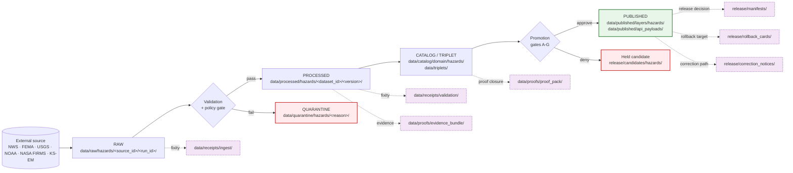

<!-- [KFM_META_BLOCK_V2]
doc_id: kfm://doc/hazards-preservation-matrix
title: Hazards Preservation Matrix
type: standard
version: v1
status: draft
owners: TODO — Hazards domain steward + ENCY doctrine reviewer + Docs steward
created: 2026-05-17
updated: 2026-05-17
policy_label: public
related:
  - docs/domains/hazards/README.md
  - docs/doctrine/lifecycle-law.md
  - docs/doctrine/truth-posture.md
  - docs/doctrine/trust-membrane.md
  - docs/doctrine/directory-rules.md
  - docs/registers/VERIFICATION_BACKLOG.md
  - contracts/OBJECT_MAP.md
tags: [kfm, domain, hazards, preservation, lifecycle, sensitivity, evidence, not-for-life-safety]
notes:
  - PRESERVATION_MATRIX as a doctrinal artifact is PROPOSED; no indexed evidence confirms a prior file at this path.
  - The Hazards "not-for-life-safety" boundary is the single most preservation-shaping doctrine in this domain.
  - All schema, policy, fixture, and test paths cited are PROPOSED until verified against a mounted repo.
[/KFM_META_BLOCK_V2] -->

# Hazards Preservation Matrix

> What the Hazards domain must preserve, at which lifecycle stage, under which sensitivity tier, and with which receipts — so historical hazard knowledge stays inspectable, operational warning context expires visibly, and KFM never drifts into life-safety alerting.

| Field | Value |
|---|---|
| **Document type** | Standard / domain doctrine matrix |
| **Domain** | Hazards (`[DOM-HAZ]`) |
| **Authority of this matrix** | PROPOSED — derives from CONFIRMED KFM lifecycle, supersession, and Hazards-domain doctrine; existence of this file as canonical is PROPOSED |
| **Authority of cited paths** | PROPOSED until verified against the mounted repo |
| **Owners** | TODO — Hazards domain steward + ENCY doctrine reviewer + Docs steward |
| **Status** | Draft |
| **Last updated** | 2026-05-17 |
| **Cross-cutting invariant** | RAW → WORK / QUARANTINE → PROCESSED → CATALOG / TRIPLET → PUBLISHED; promotion is a governed state transition, not a file move |

---

## Table of contents

1. [Purpose and scope](#1-purpose-and-scope)
2. [How this matrix is read](#2-how-this-matrix-is-read)
3. [Preservation lifecycle (visual)](#3-preservation-lifecycle-visual)
4. [Core preservation invariants for Hazards](#4-core-preservation-invariants-for-hazards)
5. [The Preservation Matrix](#5-the-preservation-matrix)
6. [Operational warning context — the expiry problem](#6-operational-warning-context--the-expiry-problem)
7. [Source-role anti-collapse and preservation](#7-source-role-anti-collapse-and-preservation)
8. [Sensitivity, rights, and exposure posture](#8-sensitivity-rights-and-exposure-posture)
9. [Stale-state, supersession, and correction](#9-stale-state-supersession-and-correction)
10. [Receipts, proofs, and rollback targets](#10-receipts-proofs-and-rollback-targets)
11. [Cross-lane preservation dependencies](#11-cross-lane-preservation-dependencies)
12. [Validators that enforce preservation](#12-validators-that-enforce-preservation)
13. [Open questions and NEEDS VERIFICATION](#13-open-questions-and-needs-verification)
14. [Related docs](#14-related-docs)

---

## 1. Purpose and scope

The Hazards Preservation Matrix records, for each Hazards canonical object family, what KFM must keep, where it must live, how long it must persist, what fixity must accompany it, and what access posture governs it across the lifecycle.

The matrix exists because **preservation is not the same as publication**. KFM publishes a public-safe surface; KFM must also preserve the evidence, receipts, supersession lineage, and rollback targets that make any public claim inspectable, reversible, and correctable. For the Hazards domain, preservation carries one additional weight: an expired NWS warning, a rolled-back NFHL flood map version, and a 1951 Storm Events record must each survive in a way that makes their **temporal role**, **source-role**, and **release-state** unmistakable.

This document is doctrine. It does not implement preservation; it constrains how implementation must look. The lifecycle invariant `RAW → WORK / QUARANTINE → PROCESSED → CATALOG / TRIPLET → PUBLISHED` is CONFIRMED by Directory Rules §9.1 and the Unified Implementation Architecture Build Manual; this matrix applies it to Hazards object families.

> [!IMPORTANT]
> KFM Hazards is **not** an emergency alert system, not a regulatory determination, and not a life-safety instruction surface. Preservation discipline must reinforce that boundary at every stage. An operational warning preserved without a visible expiry marker is a preservation failure, not just a UI failure.

[Back to top](#table-of-contents)

---

## 2. How this matrix is read

Each row in [§5](#5-the-preservation-matrix) covers one canonical Hazards object family from the v1.0 Atlas and Encyclopedia. Each column describes one preservation dimension:

| Column | Meaning |
|---|---|
| **Object family** | The canonical Hazards object (e.g. `HazardEvent`, `WarningContext`). Names use KFM casing exactly. |
| **Source-role(s)** | Permitted source roles per `[DOM-HAZ]`: `authority`, `observation`, `context`, `model`. Anti-collapse is doctrine-significant. |
| **RAW preservation** | What must be captured immutably at intake, where, and under what identity. |
| **PROCESSED preservation** | Normalized, validated, public-safe-candidate state and its receipts. |
| **CATALOG / TRIPLET preservation** | Catalog records, EvidenceBundles, graph projections. |
| **PUBLISHED preservation** | What appears in `data/published/` and what `ReleaseManifest` binds it to. |
| **Sensitivity tier (default)** | T0–T4 per the v1.1 Sensitivity / Rights Tier Reference; `PROPOSED` for tier scheme adoption per ADR-S-05. |
| **Retention rule** | Whether the object is permanent record, supersedable with prior-version retention, or freshness-bound. |
| **Fixity discipline** | Hash, digest, sidecar, or DSSE/cosign attestation expectations. |
| **Notes** | Domain-specific caveats; almost always references the not-for-life-safety boundary. |

[Back to top](#table-of-contents)

---

## 3. Preservation lifecycle (visual)

The diagram below shows how a single Hazards object — for example an `EarthquakeEvent` ingested from the USGS Earthquake Catalog — moves through preservation lanes. Receipts, proofs, registry, and rollback are emitted *alongside* lifecycle phases; they do not replace them. This reflects CONFIRMED Directory Rules §9.1 doctrine.

All paths shown are **PROPOSED**; they apply Directory Rules §9.1 lane templates to the Hazards domain and require verification against a mounted repo.

[Back to top](#table-of-contents)

---

## 4. Core preservation invariants for Hazards

These invariants govern every row of the matrix. Where doctrine is CONFIRMED, the row is CONFIRMED; where the Hazards-specific application is new, it is PROPOSED.

| # | Invariant | Status | Source |
|---:|---|---|---|
| I-1 | RAW preserves admitted source material under source identity; promotion is a governed state transition, not a file move. | CONFIRMED | Directory Rules §0, §9.1; Unified Manual §7 |
| I-2 | Unknown or unresolved source roles are quarantined, not promoted; expired operational context cannot appear as current warning state. | CONFIRMED | `[DOM-HAZ]` §I; ENCY |
| I-3 | Hazards is not a life-safety alerting system; preservation must not erase the not-for-life-safety boundary at any stage. | CONFIRMED | `[DOM-HAZ]` §A; `KFM-IDX-POL-007`; `KFM-IDX-PLN-002` |
| I-4 | Public-safe published artifacts must be downstream of validation, policy decision, review state, release manifest, and a rollback target. | CONFIRMED | Unified Manual §5; Directory Rules §6.5 |
| I-5 | Critical-infrastructure exposure context defaults to deny on public detail; aggregated or generalized footprints may be admitted with steward review. | CONFIRMED | `[DOM-SETTLE]` ↔ `[DOM-HAZ]` cross-lane; v1.1 Atlas §24.4.12; `KFM-IDX-POL-006` |
| I-6 | A `ReleaseManifest` that does not name a rollback target is not a complete release. | CONFIRMED | `KFM-IDX-REL-004` |
| I-7 | EvidenceRef must resolve to an EvidenceBundle before a consequential Hazards claim can be presented; otherwise ABSTAIN/DENY/ERROR. | CONFIRMED | Unified Manual §2.4 (cite-or-abstain); UIAI-GAI |
| I-8 | Source, observed, valid, retrieval, release, and correction times stay distinct where material. | CONFIRMED | v1.1 Atlas §24.14 E. Main object families (temporal handling) |
| I-9 | The watcher-as-non-publisher invariant applies: watchers, scrapers, and connectors emit to RAW or QUARANTINE only; promotion runs through validators and gates. | CONFIRMED | Directory Rules §13.5; `KFM-IDX-SRC-001` |
| I-10 | Hazards object identity uses a PROPOSED deterministic basis: source id + object role + temporal scope + normalized digest. | PROPOSED | v1.1 Atlas §24.14 (E. Main object families) |

> [!NOTE]
> Invariant I-3 is the load-bearing constraint for Hazards. Most of the unique structure in this matrix exists to keep I-3 enforceable across the lifecycle, especially during ingest of NWS operational feeds whose payloads describe imminent risk to people.

[Back to top](#table-of-contents)

---

## 5. The Preservation Matrix

Object families below come from `[DOM-HAZ]` §C and v1.1 Atlas §24.14 E. Sensitivity defaults derive from v1.1 Atlas §24.5 Sensitivity / Rights Tier Reference (T0–T4) and from the per-domain Object Family × Domain Reference Matrix. Sensitivity tier scheme adoption is itself PROPOSED per `ADR-S-05`.

| Object family | Source-role(s) | RAW preservation | PROCESSED preservation | CATALOG / TRIPLET preservation | PUBLISHED preservation | Sensitivity (default) | Retention rule | Fixity discipline | Notes |
|---|---|---|---|---|---|---|---|---|---|
| `HazardEvent` | authority · observation | Immutable source payload (e.g. Storm Events row, USGS event) with citation, time, hash; under `data/raw/hazards/<source>/<run_id>/` | Normalized event with separate event / observed / valid / retrieval times; `EvidenceRef` populated; ValidationReport closed | Catalog record + EvidenceBundle + graph projection | Public-safe LayerManifest, API payload, tile slice | **T0** | Permanent historical record; corrections via `CorrectionNotice`, supersession with prior retained | BLAKE3 / SHA-256 digest at ingest + processed; `RunReceipt` per stage; DSSE on release artifacts (PROPOSED) | Default cross-lane citation object. Past-event nature does not weaken evidence requirement. |
| `HazardObservation` | observation · context | Immutable observation row with source vintage and cadence | Normalized observation; freshness state recorded | Catalog + EvidenceBundle | LayerManifest; only released observations | **T0** | Permanent; freshness-bound for "current" use | Hash + receipts | Observation is not authority; preservation must keep that distinction. |
| `WarningContext` | context (operational) | Immutable issuance payload with `issue_time`, `expiry_time`, source, retrieval time | Normalized advisory shell + expiry; quarantine on missing expiry | Catalog of historical issuances; EvidenceBundle marks "expired operational context" after `expiry_time` | Historical-only public surface with prominent `not_for_life_safety` label and visible expiry; **never** served as current state past `expiry_time` | **T0** historical / **RESTRICT** for "current" usage past expiry | Permanent historical record; live "current" status auto-expires; supersession lineage retained | Hash + receipts; expiry validated by validator before catalog closure | See [§6](#6-operational-warning-context--the-expiry-problem). Mishandling this object is the single largest preservation risk in this domain. |
| `AdvisoryContext` | context (operational) | Same as `WarningContext` | Same | Same | Same | **T0** historical / **RESTRICT** current | Same | Same | Same temporal-role rules as `WarningContext`. |
| `DisasterDeclaration` | authority | FEMA/OpenFEMA payload under `data/raw/hazards/fema/` with rights snapshot | Normalized declaration record with `effective` / `closed` dates | Catalog + EvidenceBundle; linked to affected `Settlement` and `ImpactArea` via cross-lane relations | LayerManifest; public surface | **T0** | Permanent record; amendments are supersession with prior retained | Hash + receipts | Stable identity; canonical authority record. |
| `FloodContext` (NFHL / MSC) | authority (regulatory) · context | FEMA NFHL/MSC vintage payload under `data/raw/hazards/nfhl/<vintage>/` | Normalized regulatory polygons with `NFHL_version` | Catalog + EvidenceBundle; cross-cited by `[DOM-HYD]` (regulatory channel) | LayerManifest with version pin; prior versions remain queryable | **T0 (regulatory)** | Versioned; **prior version retained** when superseded; never overwrite in place | Versioned filename + digest sidecar (PROPOSED per `KFM-IDX-REL-003`) | Regulatory boundary; cite the version used. |
| `WildfireDetection` | observation · model | NASA FIRMS / NOAA HMS payload under `data/raw/hazards/firms/` (or `hms/`) with retrieval time | Normalized detection with detection vintage, sensor, confidence | Catalog + EvidenceBundle marked "detection — not ground-truth fire perimeter" | LayerManifest with detection-vintage caveat in Evidence Drawer | **T0** | Permanent record; vintage and confidence travel with the object | Hash + receipts | Detection is not perimeter; preservation must keep that distinction. |
| `SmokeContext` | observation · model | NOAA HMS smoke product payload | Normalized smoke polygon with `analyzed_at` | Catalog + EvidenceBundle | LayerManifest; Atmosphere/Air may re-cite | **T0** | Permanent; analyst vintage preserved | Hash + receipts | Cross-citation owned by `[DOM-AIR]` per v1.1 §24.4.9. |
| `DroughtIndicator` | model · observation | U.S. Drought Monitor / state monitor payload by week | Normalized indicator with `valid_week` | Catalog + EvidenceBundle; time-series preserved | LayerManifest; time slider | **T0** | Permanent time-series; weekly cadence retained | Hash + receipts | Atmosphere/Air provides climate normals as `[DOM-AIR]` context. |
| `EarthquakeEvent` | authority · observation | USGS Earthquake Catalog payload | Normalized event with magnitude type, location uncertainty | Catalog + EvidenceBundle | LayerManifest; point/centroid public | **T0** | Permanent; magnitude revisions are supersession with prior retained | Hash + receipts | Geology cites as hazard input per v1.1 §24.4.8. |
| `HeatColdEvent` | observation · context | NWS / NCEI extreme-event record | Normalized event with valid window | Catalog + EvidenceBundle | LayerManifest | **T0** | Permanent | Hash + receipts | Treat operational extreme-heat advisories under `WarningContext` rules. |
| `ExposureSummary` | model (derived) | n/a — derivative product | Materialized summary with input lineage, model version, run digest | Catalog + EvidenceBundle bound to upstream `Settlement` / `InfrastructureAsset` / `HazardEvent` | LayerManifest only if all upstream tiers permit public detail | **T0** aggregate / **T4** when upstream critical-infrastructure detail is implied | Derivative; supersedable; prior model run retained for audit | Hash + `ModelRunReceipt`; spec_hash pin (PROPOSED) | Default deny on public exposure of critical-infrastructure detail per I-5. |
| `ResilienceSummary` | model (derived) | n/a | Materialized summary with assumptions, inputs, scenario status | Catalog + EvidenceBundle | LayerManifest with bounded-confidence disclaimer | **T0** aggregate / **T1** in sensitive contexts | Derivative; supersedable | Hash + `ModelRunReceipt` | Cite-or-abstain on every public claim derived from this object. |
| `HazardTimeline` | model (derived) | n/a | Materialized timeline of cited events / declarations / warnings | Catalog + EvidenceBundle | LayerManifest; time slider | **T0** | Derivative; rebuilt from preserved events; rollback by manifest pin | Hash + receipts | Surfaces the temporal-role caveat for any operational item rolled in. |
| `ImpactArea` | model (derived) · context | n/a | Materialized impact polygon with input lineage and method | Catalog + EvidenceBundle bound to affected lanes | LayerManifest gated by sensitivity check of inputs | **T0** generalized / **T1+** when input detail is sensitive | Derivative; supersedable | Hash + receipts | Deny default if input includes T4 infrastructure detail. |

> [!CAUTION]
> **Default-deny on public detail.** Where an object family's upstream EvidenceBundle includes critical-infrastructure detail, person-parcel detail, or other T4 inputs, the published surface must redact, generalize, stage, or deny — even if the matrix row above shows `T0` as the **family** default. The tier of the *output* tracks the most sensitive input that materially shaped it.

[Back to top](#table-of-contents)

---

## 6. Operational warning context — the expiry problem

`WarningContext` and `AdvisoryContext` carry a preservation tension unique to this domain:

- **The historical record** of a warning issuance — that the NWS issued a Severe Thunderstorm Warning over Ellsworth County at 17:42 UTC on 2024-07-12 with an expiry of 18:30 UTC — is **permanent**. It belongs in the historical hazard archive; it is auditable evidence of a past operational event.
- **The current-state representation** of that same object — "there is a Severe Thunderstorm Warning over Ellsworth County" — is **strictly time-bound**. After 18:30 UTC, that representation is wrong, and KFM serving it would amount to misleading life-safety information.

The Preservation Matrix resolves this by separating **temporal role** from **release state**:

| Temporal role | Allowed public surface | Preservation lane | Required label |
|---|---|---|---|
| Active operational (within `[issue_time, expiry_time)`) | Historical-context layer with prominent `not_for_life_safety` label and link to NWS / official source; **never** as authoritative current state | RAW + PROCESSED + CATALOG + PUBLISHED | `not_for_life_safety`, source-vintage, freshness indicator |
| Expired operational (past `expiry_time`) | Historical archive only; **never** as current state | CATALOG + PUBLISHED (archive layer) | `expired_operational_context`, expiry time, link to historical timeline |
| Quarantined (missing issue/expiry, unknown role, unresolved rights) | None | QUARANTINE | quarantine reason |

> [!WARNING]
> A `WarningContext` PUBLISHED without `expiry_time`, without `source_vintage`, or without the `not_for_life_safety` posture **is a preservation failure**, not merely a UI bug. It violates `[DOM-HAZ]` invariants I-2 and I-3 and must be denied at the validator and policy gates before reaching `release/`.

PROPOSED validator obligations (see [§12](#12-validators-that-enforce-preservation)):

- Reject any `WarningContext` PROCESSED record missing `issue_time` or `expiry_time`.
- Reject any release candidate whose presentation does not include `not_for_life_safety` disclosure when an operational object is in the bundle.
- Reject any "current state" payload that includes a warning whose `expiry_time` has passed.

[Back to top](#table-of-contents)

---

## 7. Source-role anti-collapse and preservation

Per `[DOM-HAZ]` §B, every Hazards intake must carry one of four source roles, and those roles must not silently collapse during preservation: `authority`, `observation`, `context`, `model`. Anti-collapse is doctrine-significant — it is named in `ADR-S-04` (Source-role enum vocabulary) and is one of the explicit PROPOSED validator obligations in v1.1 Atlas §24.14 K.

| Source role | Examples in Hazards | Preservation duty |
|---|---|---|
| **authority** | FEMA Disaster Declarations, NFHL polygons, NWS-issued products treated as the authoritative issuance record | Preserve original payload byte-stream + authority attribution + version |
| **observation** | NOAA Storm Events records, USGS earthquake catalog rows, gauge readings cross-cited from `[DOM-HYD]` | Preserve original observation + observed time + sensor / source vintage |
| **context** | KFM-derived advisories shown as historical context, secondary digests, expired warnings | Preserve original + explicit `not_for_life_safety` label + provenance back to source role |
| **model** | NASA FIRMS detections, model-derived smoke products, drought indicators, exposure / resilience derivatives | Preserve model identity, version, run receipt, inputs digest |

A preservation operation that flattens these roles into a single "hazard layer" — for example by concatenating Storm Events `observation` rows and NWS `authority` issuances under one schema with no role discriminator — fails preservation. Recovery requires re-ingest from RAW under role-aware normalization.

[Back to top](#table-of-contents)

---

## 8. Sensitivity, rights, and exposure posture

The default tiers in [§5](#5-the-preservation-matrix) apply when no other constraint binds. Several Hazards situations elevate the tier of the **output** above the tier of the **input family**:

| Trigger | Resulting posture |
|---|---|
| Output cites a T4 `InfrastructureAsset` detail (critical-infrastructure exposure) | Generalize / aggregate / steward review; deny public detail by default per I-5 |
| Output joins person-level data with hazard exposure | Living-person posture from `[DOM-PEOPLE]` applies; deny by default |
| Output cites an `ArchaeologicalSite` location near a hazard zone | Site coords denied per `[DOM-ARCH]`; only generalized references |
| Source rights changed (rights status change in `SourceDescriptor`) | Re-evaluate tier; potentially downgrade; emit `CorrectionNotice` if necessary (v1.1 §24.8.1) |
| Source role unresolved or unknown | Quarantine; never publish |

> [!IMPORTANT]
> The sensitivity tier scheme (T0–T4) is itself PROPOSED per `ADR-S-05`. Until that ADR is accepted, treat the tier labels in this matrix as a working vocabulary subject to revision. Preservation receipts must use whichever scheme the accepted ADR adopts; do not bake the working vocabulary into machine-checkable fields without ADR linkage.

[Back to top](#table-of-contents)

---

## 9. Stale-state, supersession, and correction

Preservation includes the obligation to keep a previously PUBLISHED claim queryable even after it becomes stale or is corrected. KFM separates **stale** (evidence aged past tolerance) from **wrong** (substance incorrect); both have visible markers and traceable lifecycles per v1.1 Atlas §24.8.

| Trigger | Preservation action | Receipt(s) |
|---|---|---|
| `SourceDescriptor` cadence expired | Stale-source badge on dependent claims; supersede or mark stale | `RunReceipt` (ingest), `CorrectionNotice` if user-visible |
| `NFHL_version` superseded | Prior version retained and queryable; new version becomes default | Supersession entry + version register row |
| Operational `expiry_time` passed | Move from "current" surface to "historical archive" surface; "current" no longer carries the object | Validator-enforced transition; no new receipt required, but historical retention is mandatory |
| Schema upgraded past published claim's schema version | Migrate, re-validate, re-release; or mark stale | Schema-drift badge + ADR link |
| Review aged out (sensitive lane) | Trigger steward review; potentially downgrade tier | `ReviewRecord` |
| Rights status changed | Re-evaluate tier; potentially downgrade; emit `CorrectionNotice` | `SourceDescriptor` update + `CorrectionNotice` |
| Substantive error discovered | `CorrectionNotice` + supersession; previous `EvidenceBundle` retained for audit | `CorrectionNotice` + new EvidenceBundle + supersession link |

A correction never deletes the prior EvidenceBundle. It supersedes it. The bundle's supersession lineage is part of preservation.

[Back to top](#table-of-contents)

---

## 10. Receipts, proofs, and rollback targets

Receipts, proofs, and release manifests are emitted *alongside* lifecycle phases and live in dedicated lanes per Directory Rules §9.1.

<strong>Expand: receipt classes and their preservation lanes</strong>

| Receipt / proof / decision class | Emitted at | PROPOSED lane | Notes |
|---|---|---|---|
| Source admission record (`SourceActivationDecision`) | Source admission | `data/registry/sources/hazards/` | Records rights, role, sensitivity, cadence per `SourceDescriptor` |
| `RunReceipt` (intake / transform / validation / catalog / release) | Each stage | `data/receipts/{ingest,validation,pipeline,ai,release}/` | Auditable per Unified Manual §3 |
| `ValidationReport` | Validation gate | `data/proofs/validation_report/` | Finite outcome record |
| `EvidenceBundle` | PROCESSED → CATALOG closure | `data/proofs/evidence_bundle/` | Resolves `EvidenceRef`; required before any consequential public claim |
| `DecisionEnvelope` / `PolicyDecision` | Policy gate | Bound to runtime/release receipts | Finite ANSWER / ABSTAIN / DENY / ERROR |
| `PromotionReceipt` | Promotion Gates A–G | `data/receipts/release/` (PROPOSED) | Audit of Promotion Gates A–G |
| `ReleaseManifest` | Release decision | `release/manifests/` | Names rollback target; without it the release is not complete (I-6) |
| `RollbackCard` | Release decision | `release/rollback_cards/` | Auditable instructions and target |
| `CorrectionNotice` | Post-publication correction | `release/correction_notices/` | Public notice of corrected claim |
| `ReviewRecord` | Steward review | Bound to `EvidenceBundle` | Required for sensitive-lane release |
| `AIReceipt` / `RuntimeResponseEnvelope` | Focus Mode answer | `data/receipts/ai/` | AI is never root truth; receipt is mandatory |

All lane paths are **PROPOSED**; they apply Directory Rules §9.1 lane templates and need verification against a mounted repo.

> [!NOTE]
> "Trust content" — receipts, proofs, manifests, signed envelopes — must not live in `artifacts/`. That is named drift in Directory Rules §13.2. Trust content lives in `data/receipts/`, `data/proofs/`, and `release/`.

[Back to top](#table-of-contents)

---

## 11. Cross-lane preservation dependencies

When Hazards consumes from or is consumed by another domain, preservation responsibilities split along owner lines. CONFIRMED doctrine: relations must preserve ownership, source role, sensitivity, and EvidenceBundle support (`[DOM-HAZ]` §F).

| Counterpart domain | Direction | Object on the wire | Preservation note |
|---|---|---|---|
| `[DOM-HYD]` Hydrology | Hazards consumes | NFHL zone, gauge / flow observation | NFHL version pin retained; gauge observations re-cited with `[DOM-HYD]` evidence |
| `[DOM-AIR]` Atmosphere / Air | Hazards consumes | Smoke context, weather observation, AOD raster | `[DOM-AIR]` retains source-side preservation; Hazards retains derivation receipt |
| `[DOM-SETTLE]` Settlements / Infrastructure | Hazards consumes (with restriction) | Generalized infrastructure footprint, critical-asset exposure | Default deny on public detail per I-5; aggregated forms only |
| `[DOM-ROADS]` Roads / Rail | Hazards consumes | Closures, detours, bridge / crossing exposure | Sensitive condition detail tracked at T2/T4 in source domain |
| `[DOM-GEOL]` Geology | Hazards consumes | Faults, earthquake events, subsidence context | Geology preserves source-side; Hazards re-cites |
| `[UNIFIED]` Frontier Matrix | Hazards is cited by | Hazard-context cells | Matrix-cell preservation rules apply per `ADR-S-08` |
| `[MAP-MASTER]` Planetary / 3D | Hazards is cited by | Scenario / exposure context for 3D scenes | Admission and reality-boundary controls apply; never as instruction |

> [!IMPORTANT]
> Hazards never owns infrastructure identity, hydrologic gauge identity, atmospheric station identity, road segment identity, geologic unit identity, settlement identity, or person identity. When citing them, Hazards preserves the **citation and the derivation receipt**, not the upstream object's authoritative record. The upstream domain remains the preservation authority for its own objects.

[Back to top](#table-of-contents)

---

## 12. Validators that enforce preservation

The following validator classes are PROPOSED in `[DOM-HAZ]` §K (v1.0 Atlas) and remain to be implemented:

- **Source-role anti-collapse** — reject objects that fail to carry a permitted source role; reject silent role collapses in joins.
- **Temporal-role validator** — for `WarningContext` / `AdvisoryContext`, reject missing `issue_time` / `expiry_time`; reject "current state" payloads that include expired items.
- **Emergency-alert denial** — reject any release path that frames Hazards output as life-safety alerting or instruction.
- **Operational expiry / freshness** — reject release if `not_for_life_safety` posture is absent or if freshness state is missing on operational items.
- **Catalog closure** — reject catalog entries lacking resolvable `EvidenceRef`, `SourceDescriptor`, `ValidationReport`, or temporal-role fields.
- **Evidence Drawer disclaimer** — reject Evidence Drawer payloads that omit the required Hazards disclaimers when operational context is in the bundle.
- **UI no-direct-source** — reject UI bindings that pull Hazards from canonical / raw stores instead of the governed API.

PROPOSED additional validator obligations introduced by this matrix:

- **Critical-infrastructure exposure guard** — deny public release of derived objects (`ExposureSummary`, `ResilienceSummary`, `ImpactArea`) whose input lineage includes T4 infrastructure detail without a generalization / aggregation receipt.
- **Supersession lineage guard** — deny release of a `ReleaseManifest` that does not name a rollback target (I-6).
- **Stale-source guard** — annotate any released claim whose `SourceDescriptor` cadence has expired with a stale-source badge.

PROPOSED test placements per Directory Rules §12:

- `tests/domains/hazards/` — proof-of-rule tests.
- `fixtures/domains/hazards/` — golden, valid, and invalid fixtures, including expiry-edge fixtures.
- `policy/domains/hazards/` — Rego / OPA bundles for sensitive paths.

[Back to top](#table-of-contents)

---

## 13. Open questions and NEEDS VERIFICATION

These items are not resolved by this matrix. They are surfaced for the verification backlog and any ADR queue.

- **NEEDS VERIFICATION:** Whether `docs/domains/hazards/PRESERVATION_MATRIX.md` is an established repo convention or new. This document treats it as a new domain-scoped doctrine artifact.
- **NEEDS VERIFICATION:** Whether a sibling `docs/domains/<domain>/PRESERVATION_MATRIX.md` exists for other domains (atmosphere and agriculture have draft analogues in conversation lineage; repo presence unconfirmed). If yes, naming and section structure should align.
- **OPEN (ADR-S-04):** Final source-role enum vocabulary for Hazards (`authority` / `observation` / `context` / `model`) — confirm or amend.
- **OPEN (ADR-S-05):** Adopt T0–T4 sensitivity tier scheme as canonical, or revise. This matrix uses T0–T4 as a working vocabulary; rebind to the accepted scheme.
- **OPEN (ADR-S-10):** Stale-state propagation rules across cross-lane edges into Hazards.
- **OPEN (ADR-S-11):** Story / export receipt scope and retention for hazards stories.
- **OPEN:** Exact retention durations for quarantined Hazards records (audit-only). Doctrine implies "retained for audit"; numeric retention is unspecified in indexed corpus (cf. Pass 10 Idea Index §8.x).
- **OPEN:** Whether `EarthquakeEvent` magnitude revisions are correction (`CorrectionNotice`) or supersession (new EvidenceBundle with retained prior). Atlas v1.1 §24.8.2 implies supersession; needs a Hazards-specific call.
- **OPEN:** Whether `data/published/layers/hazards/` carries archived operational layers (expired warnings) under a separate sub-lane, and how the archive layer is named.
- **NEEDS VERIFICATION:** Whether `release/candidates/hazards/` is the agreed lane for held candidates or whether a different staging convention applies.
- **NEEDS VERIFICATION:** Whether fixity uses BLAKE3 (as referenced in build pipeline tooling per project memory) or SHA-256 (default in DSSE / sidecar examples). Both appear in the corpus; the matrix uses "BLAKE3 / SHA-256" pending clarification.

[Back to top](#table-of-contents)

---

## 14. Related docs

> [!NOTE]
> All targets below are **PROPOSED**. Existence of each path requires verification against a mounted repo.

- `docs/domains/hazards/README.md` — Hazards domain landing page (PROPOSED).
- `docs/doctrine/lifecycle-law.md` — RAW → PUBLISHED invariant (PROPOSED canonical home per Directory Rules §6.1).
- `docs/doctrine/truth-posture.md` — cite-or-abstain doctrine.
- `docs/doctrine/trust-membrane.md` — public surface vs. canonical stores boundary.
- `docs/doctrine/directory-rules.md` — placement rules (CONFIRMED authority).
- `docs/registers/VERIFICATION_BACKLOG.md` — verification queue.
- `docs/registers/DRIFT_REGISTER.md` — drift entries; file conflicts go here per Directory Rules §2.5.
- `contracts/domains/hazards/` — Hazards object meaning (PROPOSED).
- `schemas/contracts/v1/domains/hazards/` — Hazards machine shapes (PROPOSED, per ADR-0001).
- `policy/domains/hazards/` — Hazards admissibility rules (PROPOSED).
- `tests/domains/hazards/` — Hazards rule-enforcement tests (PROPOSED).
- `fixtures/domains/hazards/` — Hazards fixtures incl. expiry edge cases (PROPOSED).
- `release/candidates/hazards/` — held release candidates (PROPOSED).
- `docs/standards/PROV.md` — provenance standards profile (already authored).
- `docs/standards/PMTILES.md` — PMTiles delivery (already authored).
- `docs/standards/ISO-19115.md` — metadata crosswalk (already authored).
- v1.0 Atlas Ch. 12 — Hazards; v1.1 Atlas Ch. 24 (extended master atlases).
- KFM Encyclopedia §7.10 — Hazards mission, boundary, objects, sources, sensitivity.

---

Last updated: 2026-05-17 · Status: draft · Domain: Hazards · Authority of paths: PROPOSED until verified against a mounted repo.

[Back to top](#table-of-contents)
