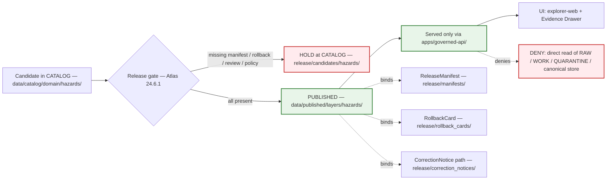

<!-- [KFM_META_BLOCK_V2]
doc_id: kfm://doc/docs/domains/hazards/publication_and_boundary
title: Hazards — Publication and Boundary
type: standard
version: v1
status: draft
owners: TODO — Hazards domain steward + Release authority + ENCY doctrine reviewer + Docs steward
created: 2026-06-05
updated: 2026-06-05
policy_label: public
related:
  - ai-build-operating-contract.md
  - docs/domains/hazards/README.md
  - docs/domains/hazards/PRESERVATION_MATRIX.md
  - docs/domains/hazards/MISSING_OR_PLANNED_FILES.md
  - docs/doctrine/trust-membrane.md
  - docs/doctrine/directory-rules.md
  - docs/architecture/governed-api.md
  - docs/registers/VERIFICATION_BACKLOG.md
tags: [kfm, domain, hazards, publication, rollback, correction, governed-api, life-safety, not-for-life-safety]
notes:
  # CONTRACT_VERSION = "3.0.0" (ai-build-operating-contract.md v3.0)
  # Repository is not mounted in this session; all path/route-shaped claims are PROPOSED.
  # The Hazards "not-for-life-safety" boundary is the single most publication-shaping doctrine in this domain.
  # KFM-as-alert-authority is T4 forever (Atlas 24.5.2); no transform path exists to any public tier.
  # All schema, policy, route, and fixture paths cited are PROPOSED until verified against a mounted repo.
[/KFM_META_BLOCK_V2] -->

# 🌪️ Hazards — Publication and Boundary

> The two-sided contract for the Hazards lane: **what KFM may publish** (historical hazard knowledge, regulatory context, scientific observations, exposure rollups — only behind the full governed promotion path) and **what KFM must never become** (an emergency alert system, a life-safety instruction surface, or a regulatory determination). Publication discipline exists to keep the second list empty.

**Status:** draft · **Owners:** _TODO — Hazards domain steward + Release authority + ENCY doctrine reviewer + Docs steward_ · **Last updated:** 2026-06-05 · **Pins:** `CONTRACT_VERSION = "3.0.0"`

---

## 📑 Table of contents

1. [Scope and reading guide](#1-scope-and-reading-guide)
2. [The boundary, stated plainly](#2-the-boundary-stated-plainly)
3. [What may be published](#3-what-may-be-published)
4. [The governed publication path](#4-the-governed-publication-path)
5. [Promotion gates (deny-by-default)](#5-promotion-gates-deny-by-default)
6. [Governed API and UI surfaces](#6-governed-api-and-ui-surfaces)
7. [Governed AI behavior at the boundary](#7-governed-ai-behavior-at-the-boundary)
8. [Operational warning context — publish-as-history, never-as-current](#8-operational-warning-context--publish-as-history-never-as-current)
9. [Correction, stale-state, and rollback](#9-correction-stale-state-and-rollback)
10. [Sensitivity and exposure at publication](#10-sensitivity-and-exposure-at-publication)
11. [Hazards deny register](#11-hazards-deny-register)
12. [Validators that defend the boundary](#12-validators-that-defend-the-boundary)
13. [Open questions and verification backlog](#13-open-questions-and-verification-backlog)
14. [Related docs](#14-related-docs)

---

## 1. Scope and reading guide

This document governs the **publication surface** and the **domain boundary** for the Hazards lane (`[DOM-HAZ]`). It answers two questions a reviewer must be able to settle before any hazards artifact reaches the public:

1. *Is this allowed to be published at all, and through which path?* — [§3](#3-what-may-be-published), [§4](#4-the-governed-publication-path), [§5](#5-promotion-gates-deny-by-default).
2. *Does publishing it risk turning KFM into something it must never be?* — [§2](#2-the-boundary-stated-plainly), [§8](#8-operational-warning-context--publish-as-history-never-as-current), [§11](#11-hazards-deny-register).

It is doctrine, not implementation. It constrains how the governed API, the UI, the policy bundles, and the release process must behave; it does not assert that any route, schema, or test currently exists.

> [!NOTE]
> **Repository not mounted in this session.** Every route, path, schema, and policy file named here is **PROPOSED** by KFM doctrine. The boundary rules themselves (not-for-life-safety, deny-by-default promotion, cite-or-abstain) are **CONFIRMED** doctrine; their enforcement surfaces are PROPOSED until verified against a mounted repo.

[⬆ Back to top](#-table-of-contents)

---

## 2. The boundary, stated plainly

KFM Hazards governs **historical hazard events, warnings/advisories/watches as context, disaster declarations, regulatory hazard areas, scientific observations, remote sensing, models, exposure and resilience summaries, and bounded public runtime answers**. _(CONFIRMED: Atlas §12.A.)_

It explicitly does **not** own, and must never present itself as:

> [!CAUTION]
> **KFM Hazards is not an emergency alert system and must not provide life-safety instructions.** _(CONFIRMED: Atlas §12.B; Encyclopedia §7.10.)_ The deny register pins this at the strongest tier: **"KFM as alert authority → T4 forever; no transform permits KFM to act as an emergency-alert authority. The boundary holds."** _(CONFIRMED: Atlas §24.5.2; deny surface §24.9.2.)_

What that means for publication, concretely:

- KFM may publish *that* an NWS warning was issued, when, and over where — as **historical context** with a visible expiry and a `not_for_life_safety` posture. It may **not** present that warning as current, authoritative, or actionable safety guidance.
- KFM may publish an NFHL flood zone as **regulatory context** with its version pinned. It may **not** render it as an observed flood extent or a forecast.
- KFM may publish a FIRMS detection as an **observed** thermal signal with caveats. It may **not** present it as a legal fire status or a ground-truth perimeter.
- Every public hazards surface must **redirect emergency action to official sources** (NWS, FEMA, local emergency management) rather than substitute for them.

There is no transform, redaction, generalization, or review path that converts KFM into an alert authority. Unlike most T4 content — which can sometimes reach a public tier after a `RedactionReceipt` and `ReviewRecord` — the alert-authority boundary is **T4 forever**.

[⬆ Back to top](#-table-of-contents)

---

## 3. What may be published

The hazards object families that *can* reach a public-safe surface, with the posture each carries. Object families are CONFIRMED (Atlas §12.B/E); their field realization and exact public shape are PROPOSED.

| Object family | Publishable as | Mandatory posture at publication |
|---|---|---|
| `HazardEvent` | Historical event layer, API payload, tile slice | Evidence-backed; past-event status does not weaken evidence requirement |
| `HazardObservation` | Observation layer | Observation ≠ authority; freshness state visible |
| `WarningContext` / `AdvisoryContext` | **Historical** context layer only | `not_for_life_safety`; visible expiry; **never** current state past expiry (see [§8](#8-operational-warning-context--publish-as-history-never-as-current)) |
| `DisasterDeclaration` | Declaration layer | Administrative/regulatory record; effective/closed dates |
| `FloodContext` (NFHL/MSC) | Regulatory context layer | Version-pinned; **never** observed inundation or forecast |
| `WildfireDetection` | Detection layer | Detection ≠ perimeter; vintage + confidence in Evidence Drawer |
| `SmokeContext` | Smoke context layer | Analyst vintage; Atmosphere/Air may re-cite |
| `DroughtIndicator` | Indicator time-series | Weekly cadence; modeled/aggregate posture |
| `EarthquakeEvent` | Event layer (point/centroid) | Magnitude type + location uncertainty preserved |
| `HeatColdEvent` | Event layer | Operational extreme-heat advisories follow `WarningContext` rules |
| `ExposureSummary` | Aggregate rollup | Public only if **all** upstream tiers permit; default-deny on critical-infrastructure detail |
| `ResilienceSummary` | Aggregate rollup | Bounded-confidence disclaimer; cite-or-abstain |
| `HazardTimeline` | Time-aware timeline | Temporal-role caveat for any operational item rolled in |
| `ImpactArea` | Impact polygon | Gated by sensitivity check of inputs; deny if T4 input detail |

> [!IMPORTANT]
> **Deny-by-default promotion gate (CONFIRMED, Atlas §12.I).** Unclear rights, unresolved source role, missing evidence, unresolved sensitivity, or absent release state **blocks public promotion**. The default for any hazards candidate that cannot satisfy every gate in [§5](#5-promotion-gates-deny-by-default) is QUARANTINE or DENY, never a partial publish.

[⬆ Back to top](#-table-of-contents)

---

## 4. The governed publication path

Publication is the final transition of the lifecycle invariant `RAW → WORK / QUARANTINE → PROCESSED → CATALOG / TRIPLET → PUBLISHED`. Promotion is a **governed state transition, not a file move**. _(CONFIRMED: Directory Rules §9.1; Atlas §12.H, §24.6.)_

CONFIRMED publication requirement (Atlas §12.M): **Hazards publication requires `ReleaseManifest`, `EvidenceBundle`, validation/policy support, review state where required, correction path, stale-state rule, and rollback target.** A release missing any of these is not a complete release.

The trust membrane is non-negotiable: public clients and the normal UI reach hazards data **only** through `apps/governed-api/`, never by reading `data/processed/`, canonical stores, raw connector output, or unreleased tile URLs. _(CONFIRMED: Directory Rules §13.5 "Public route reads canonical store"; §24.9.2 trust-membrane anti-patterns.)_

[⬆ Back to top](#-table-of-contents)

---

## 5. Promotion gates (deny-by-default)

Each gate fails closed. A hazards candidate advances only when the named artifact is present and valid; otherwise it HOLDs at the prior phase with a structured outcome. _(CONFIRMED: Atlas §24.6.1 lifecycle gates.)_

| Gate (transition) | Required artifacts (minimum) | Fail-closed outcome |
|---|---|---|
| **Admission** (— → RAW) | `SourceDescriptor` (role, authority, rights, sensitivity, cadence); payload/reference hash | Not admitted; candidate awaiting steward |
| **Normalization** (RAW → WORK/QUARANTINE) | `TransformReceipt`; `ValidationReport` (working set); `PolicyDecision` | QUARANTINE with reason; never silently promotes |
| **Validation** (WORK → PROCESSED) | `ValidationReport` pass; `RedactionReceipt` if sensitivity applies; `AggregationReceipt` if applies | Stay in WORK; structured FAIL |
| **Catalog closure** (PROCESSED → CATALOG/TRIPLET) | `CatalogMatrix` entry; `EvidenceBundle`; graph/triplet projections if applicable | HOLD at PROCESSED; no public edge |
| **Release** (CATALOG → PUBLISHED) | `ReleaseManifest`; rollback target; correction path; `ReviewRecord` (if required); release authority distinct from author when materiality applies | HOLD at CATALOG; no public surface change |

Hazards-specific gate additions enforced at Release:

- **Life-safety gate** — DENY if the candidate frames any output as a live alert, instruction, or current operational state. _(I-3; Atlas §24.5.2.)_
- **Expiry gate** — DENY if a `WarningContext`/`AdvisoryContext` lacks `issue_time`/`expiry_time` or would surface past expiry as current. _(See [§8](#8-operational-warning-context--publish-as-history-never-as-current).)_
- **Source-role gate** — DENY if the seven-class source role is unresolved or would collapse in a join. _(Atlas §24.1.)_

> [!NOTE]
> **Separation of duties is maturity-dependent.** Atlas §24.7 and Directory Rules §2 treat release-author separation as scaling with the public trust surface: early low-materiality doctrine work may be authored and approved by the same actor, but as the hazards public surface grows, the release authority MUST be distinct from the original author and enforced through tooling, not custom. This doc does not claim that enforcement exists yet.

[⬆ Back to top](#-table-of-contents)

---

## 6. Governed API and UI surfaces

CONFIRMED doctrine / PROPOSED implementation: the hazards surfaces below are governed-API endpoints with finite outcomes; exact routes are UNKNOWN until verified. _(Atlas §12.J.)_

| Endpoint / artifact | DTO / schema | Outcomes | Status |
|---|---|---|---|
| Hazards feature/detail resolver | `HazardsDecisionEnvelope` | ANSWER / ABSTAIN / DENY / ERROR | PROPOSED; exact route UNKNOWN |
| Hazards layer manifest resolver | `LayerManifest` / domain layer descriptor | ANSWER / DENY / ERROR | PROPOSED; public-safe release only |
| Hazards Evidence Drawer payload | `EvidenceDrawerPayload` + `EvidenceBundle` projection | ANSWER / ABSTAIN / DENY / ERROR | PROPOSED; evidence + policy filtered |
| Hazards Focus Mode answer | `RuntimeResponseEnvelope` + `AIReceipt` | ANSWER / ABSTAIN / DENY / ERROR | PROPOSED; AI never root truth |
| Schema responsibility root | `schemas/contracts/v1/` | finite validator outcomes | PROPOSED; verify with Directory Rules + ADR |

CONFIRMED UI obligations (Master MapLibre doctrine): every public hazards surface must show released layer state, stale/degraded/denied/unverified status, citations, policy posture, and Evidence Drawer resolution — and must **never** expose raw watcher state, unreleased tile URLs, direct model output, or canonical/internal stores. The Evidence Drawer for any hazards operational object must surface the life-safety disclaimer and a link to the official source.

> [!WARNING]
> **No-direct-source rule.** The UI MUST NOT read NWS, FIRMS, NFHL, OpenFEMA, or any source endpoint directly. All hazards reads go through `apps/governed-api/`. A direct bind is a trust-membrane violation per Directory Rules §13.5 and a PROPOSED validator failure (`test_ui_no_direct_source`).

[⬆ Back to top](#-table-of-contents)

---

## 7. Governed AI behavior at the boundary

CONFIRMED doctrine / PROPOSED implementation (Atlas §12.L): in the Hazards domain, AI **may** summarize released Hazards `EvidenceBundle`s, compare evidence, explain limitations, and draft steward-review notes. AI **must ABSTAIN** when evidence is insufficient and **must DENY** where policy, rights, sensitivity, or release state blocks the request.

The boundary tightens the general governed-AI rules for this domain:

| Situation | Required outcome | Why |
|---|---|---|
| User asks AI whether they should evacuate / take shelter / act on a hazard now | **DENY** + redirect to official sources | KFM is not a life-safety instruction surface (I-3) |
| User asks about an active/expired warning's current status | **ABSTAIN** on "current"; may ANSWER the historical fact with `not_for_life_safety` framing | Operational current-state is out of scope |
| Evidence (`EvidenceBundle`) does not resolve for the claim | **ABSTAIN** | Cite-or-abstain; AI is never root truth |
| Request touches restricted/sensitive geometry or unresolved rights | **DENY** | Policy/rights/sensitivity gate |
| AI summarizes a released historical event with resolved evidence | **ANSWER** with citations + `AIReceipt` | Permitted use |

Every hazards AI answer carries an `AIReceipt`; AI output is never treated as a hazards finding without an `EvidenceBundle` and receipt. AI never reads RAW or WORK content — only released `EvidenceBundle`s. _(CONFIRMED: §24.9.2 "AI answers from RAW/WORK"; §24.5.2 Governed-AI deny lane.)_

[⬆ Back to top](#-table-of-contents)

---

## 8. Operational warning context — publish-as-history, never-as-current

This is the publication rule that most directly defends the boundary. A warning issuance has two faces, and only one is publishable as current:

| Temporal role | Allowed public surface | Required label |
|---|---|---|
| Active operational (within `[issue_time, expiry_time)`) | Historical-context layer with `not_for_life_safety` + link to official source; **never** authoritative current state | `not_for_life_safety`, source-vintage, freshness indicator |
| Expired operational (past `expiry_time`) | Historical archive only; **never** current state | `expired_operational_context`, expiry time, link to historical timeline |
| Quarantined (missing issue/expiry, unknown role, unresolved rights) | None | quarantine reason |

> [!WARNING]
> A `WarningContext` published without `expiry_time`, without source vintage, or without the `not_for_life_safety` posture is a **publication failure**, not a UI bug. It must be denied at the validator and policy gates before reaching `release/`. Expired operational context cannot appear as current warning state. _(CONFIRMED: Atlas §12.I.)_

> [!NOTE]
> `not_for_life_safety`, `expired_operational_context`, and `source_vintage` are **PROPOSED** label names illustrating the required posture; canonical field names resolve when `schemas/contracts/v1/domains/hazards/warning_context.schema.json` lands. The *requirement* is CONFIRMED; the exact spellings are not.

[⬆ Back to top](#-table-of-contents)

---

## 9. Correction, stale-state, and rollback

Publication is reversible by construction. KFM separates **stale** (evidence aged past tolerance) from **wrong** (substance incorrect); both have visible markers and traceable lifecycles. _(CONFIRMED: Atlas §24.8.)_

| Event | Action | Receipt(s) |
|---|---|---|
| Source cadence expired | Stale-source badge on dependent claims; supersede or mark stale | `RunReceipt`; `CorrectionNotice` if user-visible |
| NFHL version superseded | Prior version retained + queryable; new version becomes default | Supersession entry + version register row |
| Warning `expiry_time` passed | Move from "current" surface to historical archive; "current" no longer carries the object | Validator-enforced transition; historical retention mandatory |
| Substantive error discovered | `CorrectionNotice` + supersession; prior `EvidenceBundle` retained for audit | `CorrectionNotice` + new `EvidenceBundle` + supersession link |
| Release must be undone | Restore prior `ReleaseManifest` via `RollbackCard`; invalidate caches | `RollbackCard` + cache invalidation record |

A `ReleaseManifest` that does not name a rollback target is not a complete release. A correction never deletes the prior `EvidenceBundle`; it supersedes it, retaining the old bundle for audit. _(CONFIRMED: Atlas §24.6.1 Release gate; §24.8.2 supersession lineage.)_

[⬆ Back to top](#-table-of-contents)

---

## 10. Sensitivity and exposure at publication

The publishable object families default to **T0** (open) for historical hazard knowledge, but the **output tier tracks the most sensitive input that materially shaped it**. _(CONFIRMED: Atlas §24.5; tier vocabulary T0 Open · T1 Generalized · T2 Reviewer · T3 Restricted · T4 Denied.)_

| Trigger at publication | Resulting posture |
|---|---|
| Output cites a T4 `InfrastructureAsset` detail (critical-infrastructure exposure) | Generalize / aggregate / steward review; deny public detail by default |
| Output joins person-level data with hazard exposure | Living-person posture (`[DOM-PEOPLE]`, T4); deny by default |
| Output cites an `ArchaeologicalSite` near a hazard zone | Site coords denied (`[DOM-ARCH]`, T4); generalized references only after steward review |
| Source rights changed | Re-evaluate tier; potentially downgrade; emit `CorrectionNotice` |
| Source role unresolved | Quarantine; never publish |
| KFM framed as emergency-alert authority | **T4 forever**; no transform; deny at runtime (I-3) |

> [!CAUTION]
> A T0 family default never overrides a T4 input. `ExposureSummary`, `ResilienceSummary`, and `ImpactArea` are the most likely carriers of hidden critical-infrastructure detail and must be checked against upstream tiers before release.

[⬆ Back to top](#-table-of-contents)

---

## 11. Hazards deny register

Patterns that MUST be denied on a hazards publication or runtime surface. _(CONFIRMED deny lanes: Atlas §24.5.2, §24.9.2.)_

| Denied pattern | Surface | Severity |
|---|---|---|
| KFM presented as emergency-alert / instruction authority | Any | **CRITICAL** — T4 forever; the boundary holds |
| Unexpired warning rendered as a live life-safety alert | UI / API | **CRITICAL** |
| Warning/advisory served as current after `expiry_time` | UI / drawer / API | **HIGH** |
| NFHL `FloodContext` published as observed inundation or forecast | UI / API | **HIGH** — regulatory ≠ observed |
| Source-role collapse (observed/regulatory/modeled/aggregate/administrative/candidate/synthetic flattened) | Pipeline / catalog | **HIGH** |
| Public client reads RAW / WORK / QUARANTINE / canonical store | API / UI | **HIGH** — trust membrane |
| Connector or watcher writes to `data/processed/` / `data/catalog/` / `data/published/` | Pipeline | **HIGH** — watcher-as-non-publisher |
| AI answer treated as a hazards finding without `EvidenceBundle` + `AIReceipt` | Focus Mode | **HIGH** — AI never root truth |
| Critical-infrastructure detail exposed via an exposure/impact rollup | Release | **HIGH** — default-deny per I-5 |
| Release without `ReleaseManifest` or rollback target | Release | **HIGH** — not auditable / not reversible |

[⬆ Back to top](#-table-of-contents)

---

## 12. Validators that defend the boundary

PROPOSED validator classes (Atlas §12.K), framed here as boundary-defense obligations. Test homes per Directory Rules §12: `tests/domains/hazards/`, fixtures in `fixtures/domains/hazards/`, policy in `policy/domains/hazards/` (release-gate `.rego` may also live at `policy/release/hazards/` per Directory Rules §13.5 and the Atlas §24.13 / §24.5.2 crosswalk; tracked as ADR-HAZ-07).

- **Emergency-alert denial** — reject any release/runtime path that frames hazards output as life-safety alerting or instruction (T4-forever).
- **Stale-warning / operational-expiry** — reject missing `issue_time`/`expiry_time`; reject "current state" payloads containing expired items; require `not_for_life_safety` posture on operational objects.
- **Source-role anti-collapse** — reject objects without a permitted seven-class role; reject silent collapses in joins.
- **Temporal-role validator** — keep source/observed/valid/retrieval/release/correction times distinct where material.
- **Catalog closure** — reject catalog entries lacking resolvable `EvidenceRef`, `SourceDescriptor`, `ValidationReport`, or temporal-role fields.
- **Evidence Drawer disclaimer** — reject drawer payloads omitting the hazards life-safety disclaimer + official-source link when an operational object is in the bundle.
- **UI no-direct-source** — reject UI bindings that read NWS/FIRMS/NFHL/OpenFEMA or canonical stores directly.
- **NFHL-not-inundation** — reject `FloodContext` published or rendered as observed inundation or forecast.
- **Rollback drill** — prove a hazards release → `RollbackCard` → restored prior manifest + cache invalidation.

[⬆ Back to top](#-table-of-contents)

---

## 13. Open questions and verification backlog

| ID | Question / item | Status | Resolution path |
|---|---|---|---|
| OQ-HAZ-PB-01 | Exact governed-API routes for the hazards resolvers (feature/detail, layer manifest, drawer, Focus Mode) | **UNKNOWN** | Inspect `apps/governed-api/` on mounted repo |
| OQ-HAZ-PB-02 | Whether `data/published/layers/hazards/` carries archived expired-warning layers under a separate sub-lane, and its naming | **OPEN** | Directory Rules check + repo inspection |
| OQ-HAZ-PB-03 | Release-gate `.rego` home: `policy/domains/hazards/` vs. `policy/release/hazards/` (both admissible) | **OPEN (ADR-HAZ-07)** | ADR / Directory Rules reviewers |
| OQ-HAZ-PB-04 | Reviewer separation-of-duties threshold for hazards releases (when tooling-enforced) | **OPEN (ADR-S-09)** | ADR |
| OQ-HAZ-PB-05 | Canonical field names for `not_for_life_safety` / `expired_operational_context` / `source_vintage` | **NEEDS VERIFICATION** | Resolve when `warning_context.schema.json` lands |
| OQ-HAZ-PB-06 | Verify emergency-alert boundary enforcement exists and passes in CI | **NEEDS VERIFICATION** | Repo / CI inspection |
| OQ-HAZ-PB-07 | Verify release / correction / rollback drill runs on a hazards fixture | **NEEDS VERIFICATION** | Repo / CI inspection |
| OQ-HAZ-PB-08 | Verify official source endpoints and rights before any connector ships | **NEEDS VERIFICATION** | Source-rights resolution + `SourceActivationDecision` |

> These items remain `NEEDS VERIFICATION` / `OPEN` before this doc promotes from `draft` to `published`. Reconcile against `docs/registers/VERIFICATION_BACKLOG.md` on every review cycle.

[⬆ Back to top](#-table-of-contents)

---

## 14. Related docs

> All targets below are **PROPOSED** in this session; reconcile against the live repo before relying on them.

- `ai-build-operating-contract.md` — Canonical operating contract (`CONTRACT_VERSION = "3.0.0"`).
- `docs/domains/hazards/README.md` — Hazards lane landing page (planned).
- `docs/domains/hazards/PRESERVATION_MATRIX.md` — What the lane must preserve, per lifecycle stage and tier.
- `docs/domains/hazards/MISSING_OR_PLANNED_FILES.md` — Lane planning inventory across responsibility roots.
- `docs/doctrine/trust-membrane.md` — Public surface vs. canonical stores boundary.
- `docs/doctrine/directory-rules.md` — Placement and anti-pattern rules (§6.5, §9.1, §12, §13).
- `docs/architecture/governed-api.md` — Governed API surface where hazards routes live.
- `docs/registers/VERIFICATION_BACKLOG.md` — Repo-wide verification backlog.
- `docs/registers/DRIFT_REGISTER.md` — Drift entries from this lane.
- `docs/adr/README.md` — ADR index; ADR-HAZ-* and ADR-S-* entries.
- Atlas v1.1 Ch. 12 (Hazards §A/B/I/J/K/L/M) and Ch. 24 (§24.1 source-role, §24.5 tiers + deny register, §24.6 gates, §24.8 stale/supersession, §24.9 anti-patterns).
- KFM Encyclopedia §7.10 — Hazards mission, boundary, objects, sources, sensitivity.

---

<strong>Last reviewed:</strong> 2026-06-05 ·
<strong>Doc version:</strong> v1 (initial publication-and-boundary doctrine) ·
<strong>Pins:</strong> CONTRACT_VERSION = "3.0.0" ·
<strong>Lineage:</strong> KFM Domains Culmination Atlas v1.1 §12, §24.1, §24.5, §24.6, §24.8, §24.9; KFM Encyclopedia §7.10; Directory Rules §6.5, §9.1, §12, §13 ·
<a href="#-hazards--publication-and-boundary">⬆ Back to top</a>

