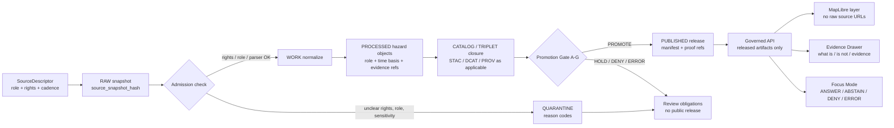

<!-- [KFM_META_BLOCK_V2]
doc_id: kfm://doc/TODO-NEEDS-UUID
title: Hazards Domain
type: standard
version: v1
status: draft
owners: TODO-NEEDS-OWNER
created: NEEDS_VERIFICATION__YYYY-MM-DD
updated: 2026-04-22
policy_label: TODO-NEEDS-VERIFICATION__public_or_restricted
related: [docs/domains/README.md, docs/domains/hazards/ARCHITECTURE.md, docs/domains/hazards/SOURCE_ROLES.md, docs/domains/hazards/TIME_SEMANTICS.md, docs/domains/hazards/PROMOTION.md, docs/domains/hazards/UI_AND_EVIDENCE_DRAWER.md, docs/adr/ADR-hazards-canonical-file-placement.md]
tags: [kfm, hazards, domain-lane, evidence, map-first, time-aware]
notes: [Target path requested as docs/domains/hazards/README.md. Owners, created date, policy label, adjacent paths, and active implementation status need verification in the mounted repository before merge.]
[/KFM_META_BLOCK_V2] -->

<a id="top"></a>

# Hazards Domain

Governed landing page for Kansas hazard context, historical events, regulatory areas, observations, detections, resilience analysis, and public-safe hazard explanations.


> [!IMPORTANT]
> **Status:** `experimental`  
> **Owners:** `TODO-NEEDS-OWNER`  
> **Path:** `docs/domains/hazards/README.md`  
> **Role:** README-like domain landing page and standard KFM documentation surface  
> **Quick jumps:** [Scope](#scope) · [Repo fit](#repo-fit) · [Accepted inputs](#accepted-inputs) · [Exclusions](#exclusions) · [Directory tree](#directory-tree) · [Lifecycle diagram](#lifecycle-diagram) · [Source roles](#source-roles) · [Usage](#usage) · [Promotion gates](#promotion-gates) · [Definition of done](#definition-of-done) · [FAQ](#faq) · [Appendix](#appendix)

> [!WARNING]
> KFM Hazards is **not** an emergency alert system. Operational warnings, watches, and advisories may be admitted only as contextual evidence with freshness, issue/expiry time, source, retrieval time, and a visible `not_for_life_safety` posture. Public users seeking life-safety action must be directed to official alerting and emergency-management sources.

---

## Scope

This directory is the documentation home for the KFM Hazards lane. It defines how hazard-related material is described, governed, validated, linked to evidence, rendered on the map, surfaced in the Evidence Drawer, summarized by Focus Mode, promoted, corrected, and rolled back.

Hazards are valuable in KFM because they connect place, time, evidence, risk context, public communication, and resilience planning. They are also easy to misuse. This lane therefore keeps different knowledge characters separate:

| Hazard knowledge character | KFM posture |
| --- | --- |
| Historical event records | Evidence-bearing records of past events; not current warnings. |
| Operational warnings, watches, advisories | Contextual only; not emergency guidance. |
| Administrative declarations | Government/legal-administrative action; not physical observation. |
| Regulatory hazard areas | Regulatory context; not proof that an event occurred. |
| Scientific observations | Measured or reported observations with uncertainty and source limits. |
| Remote-sensing detections | Product or analyst-assisted detections; not field confirmation. |
| Modeled derivatives | Derived outputs with method, input references, and `spec_hash`. |
| Resilience analysis | Planning/interpretive derivative; not damage prediction or source truth. |

**CONFIRMED doctrine:** public claims must resolve to evidence, policy posture, review state, time basis, correction lineage, and release state.  
**PROPOSED implementation:** exact schemas, validators, source descriptors, routes, workflows, and UI files remain subject to mounted-repo verification.

[Back to top](#top)

---

## Repo fit

`docs/domains/hazards/README.md` sits in the domain-documentation layer. It should orient contributors before they touch source descriptors, contracts, schemas, validators, policies, fixtures, APIs, MapLibre layer descriptors, or Focus prompts.

### Upstream orientation

| Upstream surface | Link | Status | Why it matters |
| --- | --- | --- | --- |
| Root README | [`../../../README.md`](../../../README.md) | NEEDS VERIFICATION | Project posture, repo orientation, and public promise. |
| Docs landing | [`../../README.md`](../../README.md) | NEEDS VERIFICATION | Documentation authority and navigation spine. |
| Domains landing | [`../README.md`](../README.md) | NEEDS VERIFICATION | Domain-lane burden profiles and cross-lane routing. |
| ADR index | [`../../adr/README.md`](../../adr/README.md) | NEEDS VERIFICATION | Schema-home, file-placement, and control-plane decisions. |
| Contracts boundary | [`../../../contracts/README.md`](../../../contracts/README.md) | NEEDS VERIFICATION | Machine contract ownership if root `contracts/` is active. |
| Schemas boundary | [`../../../schemas/README.md`](../../../schemas/README.md) | NEEDS VERIFICATION | Machine schema ownership if `schemas/contracts/v1/` is active. |
| Policy boundary | [`../../../policy/README.md`](../../../policy/README.md) | NEEDS VERIFICATION | Deny-by-default rules, obligations, and public-release gates. |
| Data registry | [`../../../data/registry/README.md`](../../../data/registry/README.md) | NEEDS VERIFICATION | Source descriptors and source-role verification. |

### Downstream responsibilities

| Downstream surface | Link | Status | Responsibility |
| --- | --- | --- | --- |
| Architecture | [`ARCHITECTURE.md`](ARCHITECTURE.md) | PROPOSED | End-to-end hazards lane architecture. |
| Source roles | [`SOURCE_ROLES.md`](SOURCE_ROLES.md) | PROPOSED | Role taxonomy, drawer labels, freshness behavior. |
| Time semantics | [`TIME_SEMANTICS.md`](TIME_SEMANTICS.md) | PROPOSED | Event, issue, expiry, declaration, effective, product, retrieval, and analysis time rules. |
| Promotion | [`PROMOTION.md`](PROMOTION.md) | PROPOSED | Hazards promotion gate A-G and outcome grammar. |
| UI and Evidence Drawer | [`UI_AND_EVIDENCE_DRAWER.md`](UI_AND_EVIDENCE_DRAWER.md) | PROPOSED | Drawer payload fields, MapLibre layer posture, negative states. |
| Rollback and correction | [`ROLLBACK_AND_CORRECTION.md`](ROLLBACK_AND_CORRECTION.md) | PROPOSED | Correction notices, rollback receipts, no-delete lineage. |
| Verification backlog | [`VERIFICATION_BACKLOG.md`](VERIFICATION_BACKLOG.md) | PROPOSED | Open source, schema, policy, signing, API, shell, and exposure checks. |
| Source registry | [`../../../data/registry/hazards/README.md`](../../../data/registry/hazards/README.md) | PROPOSED | Human and machine rules for hazard source descriptors. |
| Fixture lane | [`../../../tests/fixtures/hazards/README.md`](../../../tests/fixtures/hazards/README.md) | PROPOSED | Good/bad fixtures for role, evidence, rights, freshness, and policy behavior. |
| Validator lane | [`../../../tools/validators/hazards/README.md`](../../../tools/validators/hazards/README.md) | PROPOSED | Offline validator entrypoints, outputs, and CI expectations. |

> [!NOTE]
> Links above are intentionally review-visible. Before merge, verify which paths already exist in the active branch. If a target does not exist yet, either create it in the same PR, convert the link to a backticked path, or record the missing file in `VERIFICATION_BACKLOG.md`.

[Back to top](#top)

---

## Accepted inputs

Material belongs in this lane when it improves hazard-domain governance without bypassing evidence, policy, review, or release state.

Accepted inputs include:

- source-role definitions for hazards and hazard-adjacent context;
- human documentation for source intake, time semantics, promotion, correction, rollback, UI payloads, and public-safety posture;
- references to source descriptors for NOAA/NCEI storm events, NWS alerts, FEMA declarations, FEMA NFHL, USGS earthquake observations, NOAA HMS smoke/fire products, NASA FIRMS detections, and Kansas/local context sources after rights and steward review;
- schema and contract indexes for hazard source descriptors, hazard events/objects, layer manifests, run receipts, release manifests, promotion decisions, EvidenceBundle references, drawer payloads, runtime envelopes, correction notices, and rollback receipts;
- public-safe fixture descriptions for historical events, contextual warnings, declarations, regulatory areas, observations, detections, and negative cases;
- policy notes that deny unknown source roles, unresolved evidence, emergency-alert posture, rights ambiguity, restricted exact geometry, or source-role collapse;
- MapLibre and Evidence Drawer guidance for released hazard layers only;
- Focus Mode guidance that consumes released EvidenceBundles and emits finite outcomes.

[Back to top](#top)

---

## Exclusions

Do not place these here:

| Exclusion | Where it belongs instead | Reason |
| --- | --- | --- |
| Emergency instructions or life-safety guidance | Official alerting/emergency-management sources, linked as source guidance only | KFM is not an emergency alert system. |
| Raw source snapshots | `data/raw/` or source-specific lifecycle storage after repo verification | Documentation must not become data storage. |
| Work, quarantine, or unpublished candidate data | `data/work/`, `data/quarantine/`, or repo-native lifecycle homes | Public docs must not expose unpublished internal material. |
| Machine schemas as prose-only substitutes | `contracts/` or `schemas/contracts/v1/` after ADR resolution | Machine authority must be executable and validated. |
| Policy-as-code files | `policy/hazards/` | Policy must be testable, not merely described. |
| Validator scripts | `tools/validators/hazards/` or repo-native validator package | Validators must live where CI can execute them. |
| Secrets, API keys, tokens, or private source URLs | Secret manager / deployment config | No secrets in source descriptors or docs. |
| Exact restricted geometry | Restricted data stores with policy-mediated transforms | Public exact geometry can create safety and misuse risk. |
| Direct MapLibre access to raw/live endpoints | Governed API and released artifacts only | The browser must not bypass evidence, policy, or release gates. |
| AI prompts that answer from raw or unpublished material | Governed Focus prompt lane after verification | AI is interpretive only and must remain evidence-subordinate. |

[Back to top](#top)

---

## Directory tree

```text
docs/domains/hazards/
├── README.md                         # this domain landing page
├── ARCHITECTURE.md                   # PROPOSED: end-to-end lane architecture
├── FILE_MAP.md                       # PROPOSED: file/folder classification map
├── DOCUMENT_REGISTRY.v1.yaml         # PROPOSED: documentation control registry
├── SOURCE_INDEX.md                   # PROPOSED: human index of source descriptors
├── SOURCE_ROLES.md                   # PROPOSED: source role taxonomy
├── TIME_SEMANTICS.md                 # PROPOSED: role-specific time rules
├── PROMOTION.md                      # PROPOSED: promotion gate A-G
├── UI_AND_EVIDENCE_DRAWER.md         # PROPOSED: drawer payload and MapLibre behavior
├── ROLLBACK_AND_CORRECTION.md        # PROPOSED: correction/rollback procedure
├── CANON_AND_LINEAGE_RULES.md        # PROPOSED: canon, lineage, exploratory rules
├── GENERATED_ARTIFACT_RULES.md       # PROPOSED: generated artifact anti-masquerade rules
├── NAMING_AND_SUPERSESSION_RULES.md  # PROPOSED: aliases, supersedes, superseded_by
├── CHANGE_SURFACES_MATRIX.md         # PROPOSED: update propagation map
├── VERIFICATION_BACKLOG.md           # PROPOSED: open checks before implementation claims
└── OPEN_QUESTIONS.md                 # PROPOSED: unresolved design/source questions
```

Adjacent proposed implementation homes:

```text
data/registry/hazards/               # source descriptors and source registry rules
tests/fixtures/hazards/              # good/bad offline fixtures
tools/validators/hazards/            # validator entrypoints and reports
policy/hazards/                      # fail-closed policy gates
contracts/hazards/                   # candidate machine-contract home; verify by ADR
schemas/contracts/v1/hazards/        # candidate schema home; verify by ADR
apps/governed-api/hazards/           # governed API adapter; verify framework first
apps/maplibre/hazards/               # released layer descriptors and drawer mapping
docs/api/hazards.md                  # API documentation
docs/ui/hazards-maplibre.md          # MapLibre integration rules
docs/security/hazards-local-exposure-threat-model.md
docs/runbooks/hazards-refresh.md
docs/runbooks/hazards-correction-drill.md
```

[Back to top](#top)

---

## Lifecycle diagram



The diagram shows the intended trust path. It is not proof that the active repository already implements the path.

[Back to top](#top)

---

## Source roles

Hazards must not collapse different source roles into one generic “hazard event.” The source role controls time fields, freshness, public wording, Evidence Drawer labels, and policy behavior.

| `source_role` | Drawer label | What this is | What this is not |
| --- | --- | --- | --- |
| `historical_event_record` | Historical event | Published record of a past event. | Current warning or emergency instruction. |
| `operational_warning` | Warning — contextual only | Official warning context with issue, expiry, retrieval, freshness, and disclaimer. | KFM life-safety alert. |
| `operational_advisory` | Advisory — contextual only | Advisory context with valid window or expiry. | KFM guidance on what to do. |
| `operational_watch` | Watch — contextual only | Watch context with valid window and source freshness. | Confirmation that an event occurred. |
| `administrative_declaration` | Administrative declaration | Government or administrative declaration. | Physical observation or damage proof. |
| `regulatory_context` | Regulatory hazard area | Regulatory hazard area or effective layer. | Observed event or current condition. |
| `scientific_observation` | Scientific observation | Measured or reported scientific observation. | Legal declaration or warning. |
| `remote_sensing_detection` | Remote-sensing detection | Detection product with product time, latency, and limitations. | Field-confirmed event by default. |
| `modeled_derivative` | Modeled derivative | Model output with inputs, method, run time, and `spec_hash`. | Observation or authoritative prediction. |
| `resilience_analysis` | Resilience analysis candidate | Planning/interpretive analysis with method, inputs, limitations, and review state. | Damage truth or impact determination. |
| `local_context` | Local context | Local source context after rights, privacy, authority, and steward review. | Default public source. |
| `unknown_unclassified` | Unknown role — quarantined | Unresolved source role. | Publishable hazard evidence. |

> [!CAUTION]
> `unknown_unclassified` must not promote. Missing source-role mapping is an `ABSTAIN`, `DENY`, or `ERROR` condition, not a silent UI fallback.

[Back to top](#top)

---

## Time semantics

Each role must carry the time basis needed to prevent false continuity, stale context, or category collapse.

| Source role family | Required time basis | Public freshness behavior |
| --- | --- | --- |
| Historical event | `event_begin`, `event_end` or source-specific event period | Stable after publication; refresh on source diff or correction. |
| Warning/advisory/watch | `issue_time`, `expiry_time` or `valid_until`, `retrieval_time` | Must show freshness and expiry; contextual only. |
| Administrative declaration | declaration date, incident period, amendment/update time if present | Refresh on amendment or declaration update. |
| Regulatory context | effective date, layer version, release or revision date | Versioned by effective date or layer release. |
| Scientific observation | observed time, uncertainty, source event id where applicable | Show cadence, uncertainty, and source limitations. |
| Remote-sensing detection | product time, processing/analysis time, retrieval time | Show product latency and detection limitations. |
| Modeled derivative | model run time, input release refs, method/spec version | Show model run and source inputs. |
| Resilience analysis | analysis period, input refs, method version, review state | Show as derivative and candidate unless reviewed. |

[Back to top](#top)

---

## Usage

### Quickstart for maintainers

Run these from the repo root after the real checkout is mounted. They are inspection commands only.

```bash
git status --short
git branch --show-current

find docs/domains/hazards -maxdepth 2 -type f 2>/dev/null | sort

find \
  data/registry/hazards \
  contracts/hazards \
  schemas/contracts/v1/hazards \
  policy/hazards \
  tests/fixtures/hazards \
  tools/validators/hazards \
  apps/governed-api/hazards \
  apps/maplibre/hazards \
  -maxdepth 4 -type f 2>/dev/null | sort

git grep -nE \
  'hazard|hazards|operational_warning|operational_watch|not_for_life_safety|EvidenceBundle|EvidenceRef|emergency alert|NFHL|Storm Events|FIRMS|HMS|NWS|FEMA|USGS' \
  -- docs contracts schemas policy tests tools apps data 2>/dev/null
```

### Add or change a hazard source

1. Confirm source terms, rights, endpoint stability, cadence, attribution, and citation format.
2. Create or update a source descriptor in the repo-native source registry.
3. Assign exactly one primary `source_role`; use relations for cross-role context instead of mixing roles.
4. Define required time fields and freshness behavior.
5. Add good and bad fixtures for source role, time basis, rights, evidence refs, and public release posture.
6. Add or update validators and fail-closed policy rules.
7. Route unresolved rights, source role, sensitivity, or citation gaps to quarantine.
8. Publish only through a release manifest, proof closure, catalog closure, and governed API payload.
9. Update this directory’s indexes and `DOCUMENT_REGISTRY.v1.yaml` when present.

### Add or change a map layer

A hazard layer is a **derived public surface**, not canonical truth.

Layer changes must confirm:

- released hazard source ids only;
- no raw source URLs in MapLibre config;
- role-aware legend labels and accessibility labels;
- time filters that respect role-specific time basis;
- Evidence Drawer route or payload reference;
- generalization/redaction transform where required;
- correction and supersession state;
- `ABSTAIN`, `DENY`, and `ERROR` states for missing support, policy blocks, or resolver failures.

[Back to top](#top)

---

## Evidence Drawer contract

Every public hazard drawer should answer seven questions:

1. **What is this?** Claim title, hazard type, source role, and knowledge character.
2. **What is it not?** Contextual warning, regulatory area, declaration, observation, model, or analysis limitations.
3. **Where and when does it apply?** Spatial basis, time basis, freshness, and visible scope.
4. **What backs it?** EvidenceBundle links, source and publisher, release refs, and citation.
5. **Can this be shown?** Rights, attribution, sensitivity, public-safe precision, and transform receipts.
6. **Who reviewed it?** Review state, steward notes when public-safe, and promotion/correction state.
7. **What changed?** Correction, supersession, rollback, and release lineage.

Minimum drawer payload fields:

| Field group | Required content |
| --- | --- |
| Claim | title, hazard type, source role badge |
| Explanation | what-this-is, what-this-is-not |
| Scope | spatial basis, time basis, active release scope |
| Evidence | EvidenceBundle links, evidence refs, resolver status |
| Source | source descriptor id, publisher, citation |
| Policy | rights, attribution, sensitivity, generalization/redaction |
| Freshness | retrieval/issue/expiry/product/model/release time as applicable |
| Review | review state, promotion state, correction state |
| Operations | audit ref, receipt/proof refs, download refs if public |
| Safety | operational-warning disclaimer when applicable |

[Back to top](#top)

---

## Focus Mode boundary

Focus Mode may summarize hazard context only after evidence and policy checks. It is not a detached assistant.

| Runtime outcome | Meaning | Required user-visible behavior |
| --- | --- | --- |
| `ANSWER` | Evidence and policy support the answer inside the active scope. | Show citations, scope echo, evidence links, and audit ref. |
| `ABSTAIN` | Support is insufficient, unresolved, stale, or conflicted. | State the reason and offer scope refinement or evidence inspection. |
| `DENY` | Policy forbids the requested answer or precision. | Show safe denial category without leaking restricted detail. |
| `ERROR` | Runtime, resolver, validation, or payload fault. | Preserve shell context and show audit/error category. |

Focus must not:

- generate emergency instructions;
- approve releases;
- publish hazard claims;
- bypass EvidenceBundle resolution;
- bypass policy checks;
- read RAW, WORK, QUARANTINE, canonical internal stores, live source endpoints, or model runtimes directly;
- collapse operational warnings and historical events into one unlabeled hazard object.

[Back to top](#top)

---

## Promotion gates

Promotion is a governed state transition, not a file move. Runtime outcomes and promotion outcomes are intentionally different.

| Gate | Name | Pass condition |
| --- | --- | --- |
| A | `ownership_present` | Hazard release candidate has steward/owner and review responsibility. |
| B | `schema_valid` | Source descriptors, events, manifests, drawer payloads, receipts, proofs, and releases validate. |
| C | `evidence_complete` | Every public EvidenceRef resolves to EvidenceBundle; unresolved refs block promotion. |
| D | `catalog_linkage_closed` | STAC/DCAT/PROV, release manifest, proof refs, and artifact digests align where applicable. |
| E | `signatures_verified` | Signature/attestation checks pass if infrastructure exists; otherwise emit `HOLD` or an explicit obligation. |
| F | `policy_compliant` | Rights, sensitivity, source role, no-emergency-alerting, and public precision policies pass. |
| G | `diff_clean` | Diffs and migrations are clean or explicitly reviewed. |

Promotion outcomes:

| Outcome | Meaning |
| --- | --- |
| `PROMOTE` | All gates pass and obligations are satisfied. |
| `HOLD` | Fixable obligations remain. |
| `DENY` | Policy, evidence, rights, source role, or emergency-alert posture forbids promotion. |
| `ERROR` | Validator, schema, service, catalog, or proof-linkage fault prevents decision. |

> [!IMPORTANT]
> No `verified=true` field may be trusted unless an actual verification step produced it. If signing, OPA/Conftest, source verification, or catalog closure is not configured, the decision must say so.

[Back to top](#top)

---

## Security and exposure posture

KFM may be locally hosted and exposed through a firewall, reverse proxy, or VPN. Hazard information can create public misunderstanding, operational risk, or sensitivity leakage. Use fail-closed defaults.

Required posture:

- public clients use governed APIs and released artifacts only;
- deny by default for restricted layers and exact sensitive geometry;
- no raw source proxying unless explicitly authorized and audited;
- no arbitrary client-supplied source URLs;
- no SSRF-prone fetch behavior;
- no secrets in source descriptors;
- no internal file paths in public API, UI, logs, or error messages;
- bbox, time range, and result limits on expensive or broad queries;
- audit references in logs, not sensitive payloads;
- transform receipts for generalized or redacted geometry;
- visible official-source guidance for operational warning context;
- explicit `not_emergency_alert_system` or equivalent disclaimer where needed.

[Back to top](#top)

---

## Definition of done

A hazards PR is not done merely because it adds a layer, source, or prose page.

- [ ] Target branch has been inspected with `git status`, tree inventory, package/build discovery, and existing path review.
- [ ] Owners/stewards are assigned or explicitly marked `TODO-NEEDS-OWNER`.
- [ ] Schema/file placement ADR is accepted or this PR avoids creating duplicate machine authority.
- [ ] Source descriptors include role, rights, cadence, access method, citation, steward owner, public-release policy, and verification notes.
- [ ] Good and bad fixtures cover role collapse, missing expiry, regulatory-as-observed, declaration-as-observation, unresolved rights, sensitive exact geometry, and unresolved EvidenceRef.
- [ ] Validators emit reason codes, not only pass/fail booleans.
- [ ] Policy denies unknown source roles, emergency-alert posture, unresolved rights, unresolved EvidenceRefs, and restricted exact public geometry.
- [ ] Evidence Drawer payloads show `source_role`, what-this-is, what-this-is-not, time basis, freshness, rights, review state, correction/supersession, and disclaimer where applicable.
- [ ] Focus Mode consumes released EvidenceBundles only and emits finite outcomes.
- [ ] MapLibre layers consume released layer descriptors and governed API payloads only.
- [ ] Promotion gate produces `PROMOTE`, `HOLD`, `DENY`, or `ERROR` without false verification.
- [ ] Correction and rollback create new lineage and delete no evidence.
- [ ] Documentation indexes and registries are updated or the PR explains why no docs changed.

[Back to top](#top)

---

## FAQ

### Is KFM Hazards an emergency alert system?

No. KFM can preserve and explain hazard context, but it must not become a replacement for official emergency alerts, emergency instructions, or life-safety guidance.

### Can KFM show NWS warnings?

Yes, if admitted as contextual operational-warning material with issue time, expiry time, retrieval time, source, freshness status, and a visible `contextual_only` / `not_for_life_safety` posture.

### Is FEMA NFHL an observed flood event?

No. NFHL belongs to regulatory context. It can support regulatory flood-hazard context, but it must not be labeled as observed inundation or damage.

### Is a FEMA disaster declaration physical evidence of hazard impact?

No. A declaration is administrative/legal context. It can be important evidence for government action, incident periods, and jurisdictional context, but it is not a scientific observation by itself.

### What happens when an EvidenceRef does not resolve?

The API, drawer, Focus Mode, map popup, export, or story surface must return `ABSTAIN`, `DENY`, or `ERROR` with reason codes. It must not silently render an unsupported claim.

### Can resilience analysis be published?

Only as derivative analysis with method, input refs, confidence/limitations, review state, and policy clearance. It is not an observation, not an authoritative damage prediction, and not parcel-level truth unless specific evidence, rights, method, and sensitivity controls support that use.

[Back to top](#top)

---

## Appendix

<details>
<summary>Truth labels used in this README</summary>

| Label | Meaning |
| --- | --- |
| `CONFIRMED` | Verified from attached doctrine, directly inspected workspace evidence, or mounted-repo evidence when available. |
| `INFERRED` | Conservative synthesis strongly implied by evidence but not directly implemented. |
| `PROPOSED` | Recommended design, path, contract, source, validator, policy, or workflow not verified as current implementation. |
| `UNKNOWN` | Not verified strongly enough. |
| `NEEDS VERIFICATION` | Checkable item that must be verified before being treated as current fact. |

</details>

<details>
<summary>Proposed first-wave source descriptors</summary>

| Descriptor path | Source | Primary role | Initial posture |
| --- | --- | --- | --- |
| `data/registry/hazards/sources/noaa-storm-events.v1.yaml` | NOAA/NCEI Storm Events | `historical_event_record` | PROPOSED; endpoint, fields, rights, and citation need verification. |
| `data/registry/hazards/sources/nws-alerts.v1.yaml` | NWS alerts / warning polygons | `operational_warning`, `operational_advisory`, `operational_watch` | PROPOSED; contextual only, not life-safety authority. |
| `data/registry/hazards/sources/fema-disaster-declarations.v1.yaml` | FEMA Disaster Declarations / OpenFEMA | `administrative_declaration` | PROPOSED; not physical observation. |
| `data/registry/hazards/sources/fema-nfhl.v1.yaml` | FEMA NFHL | `regulatory_context` | PROPOSED; regulatory flood context, not observed event. |
| `data/registry/hazards/sources/usgs-earthquake-catalog.v1.yaml` | USGS Earthquake Catalog | `scientific_observation` | PROPOSED; feed lifecycle and query limits need verification. |
| `data/registry/hazards/sources/noaa-hms-smoke.v1.yaml` | NOAA HMS Fire and Smoke | `remote_sensing_detection` / `operational_context` | PROPOSED; limitations and non-backfill caveats must be carried. |
| `data/registry/hazards/sources/nasa-firms-active-fire.v1.yaml` | NASA FIRMS active fire | `remote_sensing_detection` | PROPOSED; auth, rights, limits, and citation need verification. |
| `data/registry/hazards/sources/kansas-local-em-context.v1.yaml` | Kansas/local emergency or hazard context | `local_context` | PROPOSED; disabled by default until rights, privacy, authority, and steward review pass. |

</details>

<details>
<summary>Anti-masquerade rules</summary>

- No generated artifact may masquerade as canonical doctrine.
- No exploratory note may masquerade as release-significant evidence.
- No receipt may masquerade as proof.
- No proof may masquerade as source truth.
- No catalog record may masquerade as canonical raw evidence.
- No PMTiles, TileJSON, search index, graph projection, embedding, summary, or model output may become canonical truth.
- No UI layer may infer missing policy, review, or evidence state from style expressions.

</details>

<details>
<summary>Open verification items before merge</summary>

- Confirm actual owners and CODEOWNERS coverage for `docs/domains/hazards/`.
- Confirm whether machine contracts belong under `contracts/hazards/`, `schemas/contracts/v1/hazards/`, or another repo-native home.
- Confirm whether `docs/domains/hazards/` already has sibling files that should be preserved or linked.
- Confirm policy engine and CI conventions before naming runnable validation commands.
- Confirm MapLibre shell path, Evidence Drawer component path, and Focus Mode adapter path before adding UI links.
- Confirm source terms, endpoints, rights, rate limits, and citation templates before activating any live connector.
- Confirm deployment exposure assumptions before publishing hazard APIs beyond trusted local use.

</details>

[Back to top](#top)
