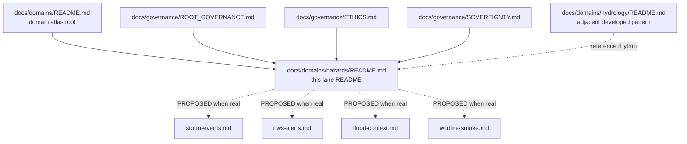
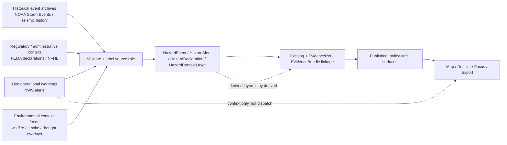

<!-- [KFM_META_BLOCK_V2]
doc_id: kfm://doc/NEEDS-VERIFICATION
title: Hazards Domain
type: standard
version: v1
status: draft
owners: @bartytime4life
created: YYYY-MM-DD
updated: YYYY-MM-DD
policy_label: public
related: [../README.md, ../../governance/ROOT_GOVERNANCE.md, ../../governance/ETHICS.md, ../../governance/SOVEREIGNTY.md, ../../standards/KFM_MARKDOWN_WORK_PROTOCOL.md, ../../standards/markdown-rules.md]
tags: [kfm, domains, hazards, kansas]
notes: [doc_id and date fields still need direct repo verification; current public hazards subtree was README-only at verification time.]
[/KFM_META_BLOCK_V2] -->

# Hazards Domain

Authoritative lane README for KFM hazards scope, current public subtree, source-role discipline, and publication burden.

> [!NOTE]
> **Status:** experimental · **Doc state:** draft  
> **Owners:** `@bartytime4life` · lane-specific owner `NEEDS VERIFICATION`  
>      
> **Quick jumps:** [Scope](#scope) · [Repo fit](#repo-fit) · [Accepted inputs](#accepted-inputs) · [Exclusions](#exclusions) · [Directory tree](#directory-tree) · [Quickstart](#quickstart) · [Usage](#usage) · [Diagram](#diagram) · [Tables](#tables) · [Task list](#task-list--definition-of-done) · [FAQ](#faq) · [Appendix](#appendix)  
> **Repo fit:** `docs/domains/hazards/README.md` → upstream: [`../README.md`](../README.md), [`../../governance/ROOT_GOVERNANCE.md`](../../governance/ROOT_GOVERNANCE.md), [`../../governance/ETHICS.md`](../../governance/ETHICS.md), [`../../governance/SOVEREIGNTY.md`](../../governance/SOVEREIGNTY.md), [`../../standards/KFM_MARKDOWN_WORK_PROTOCOL.md`](../../standards/KFM_MARKDOWN_WORK_PROTOCOL.md), [`../../standards/markdown-rules.md`](../../standards/markdown-rules.md) · downstream: **no checked-in hazard child docs verified beyond this README**

> [!IMPORTANT]
> Treat the hazards lane as a **source-role-sensitive operating lane**, not as a generic disasters bucket. Live warnings, historical event archives, regulatory flood context, wildfire/smoke context, and KFM-derived overlays do not carry the same publication burden.

> [!WARNING]
> Current public-main verification shows this subtree is still **README-only**. Corpus-described hazard automation, refresh pipelines, or runtime surfaces must not be described here as checked-in public-repo fact unless directly reverified from the repository tree, schemas, workflows, or emitted artifacts.

## Scope

This directory is the lane-level entry point for KFM hazard material. It exists to keep hazard documentation narrow, navigable, and honest about source roles, time semantics, publication burdens, and public-safe delivery.

In KFM terms, the hazards lane covers event-time hazard occurrence, warning and alert context, disaster declarations, flood-hazard context layers, wildfire and smoke context, seismicity, and cross-layer resilience framing where the evidence route stays explicit. It is a documentation and routing surface for the lane, not proof by itself that the full lane is implemented end to end.

### Status vocabulary used in this lane

| Label | Use here |
| --- | --- |
| **CONFIRMED** | Directly verified in the visible repo or directly supported by the cited KFM corpus |
| **INFERRED** | Small structural completion consistent with adjacent KFM docs and doctrine, but not directly checked in here |
| **PROPOSED** | Recommended lane shape, child-doc pattern, or next artifact not yet proven in the visible repo |
| **UNKNOWN** | Not verified strongly enough in the current session |
| **NEEDS VERIFICATION** | Reviewer action required before treating metadata, ownership, inventory, or implementation as settled |

[Back to top](#hazards-domain)

## Repo fit

| Path | Role | Relationship |
| --- | --- | --- |
| `docs/domains/README.md` | domains atlas root | parent entry point for Kansas operating lanes |
| `docs/domains/hazards/README.md` | this file | lane README for hazards documentation |
| `docs/domains/hydrology/README.md` | adjacent mature lane pattern | closest checked-in README pattern for lane structure and trust-language rhythm |
| `docs/governance/ROOT_GOVERNANCE.md` | governance anchor | use when lane wording touches system-level governance or release posture |
| `docs/governance/ETHICS.md` | ethics anchor | use when public harm, interpretation risk, or societal effects need framing |
| `docs/governance/SOVEREIGNTY.md` | sovereignty anchor | use when exact location, culturally sensitive material, or restricted publication needs extra care |
| `docs/standards/KFM_MARKDOWN_WORK_PROTOCOL.md` | documentation work protocol | formatting and documentation discipline anchor |
| `docs/standards/markdown-rules.md` | markdown style anchor | GitHub-rendering and style consistency anchor |
| `.github/CODEOWNERS` | ownership fallback | current public owner coverage for `/docs/` |

### Current public-main state

The current public subtree verified for `docs/domains/hazards/` is intentionally small: this README is the only checked-in hazard file that was directly visible in the public tree during this pass. Treat any deeper lane inventory, checked-in schemas, workflow evidence, or runtime surfaces as **UNKNOWN** until directly reverified.

## Accepted inputs

Place material here when it is primarily about the **hazards lane itself** rather than about a specific runtime contract or data artifact.

This README is the right place for:

- lane boundary notes and source-role distinctions
- hazard-specific publication burdens and trust cautions
- current checked-in subtree inventory
- routing notes to real checked-in child docs once they exist
- concise lane conventions for time, freshness, severity, and evidence posture
- narrowly scoped examples that explain how hazard sources differ from one another

### Lane-wide minimums worth preserving

The following are lane-level minimums worth naming whenever a hazard source or hazard-facing doc graduates beyond a placeholder:

| Field or concept | Why it matters |
| --- | --- |
| `source_id` / `source_uri` | preserves origin authority and recheck path |
| source role | distinguishes historical archive, live operational alert, regulatory context, and derived layer |
| event / issue / expiry / update times | prevents time collapse across source families |
| geometry basis | shows whether geometry is source-issued, generalized, clipped, or derived |
| status vocabulary | keeps `active`, `archived`, `expired`, `superseded`, or `withdrawn` legible |
| public-safe publication note | makes narrowing, withholding, or generalization visible |
| evidence link or `EvidenceRef` | preserves drill-through into supporting context |
| freshness note | matters especially for live or regularly refreshed hazard context |

## Exclusions

Do **not** place the following here:

| Exclusion | Where it goes instead |
| --- | --- |
| raw hazard source packages, download caches, or source-native bulk payloads | data / ingest / storage lanes outside `docs/` |
| checked-in schemas, fixtures, or policy gates | `schemas/`, `contracts/`, `policy/`, `tests/` |
| runtime route claims, OpenAPI surfaces, or evaluator harness details not directly verified in the repo | the exact checked-in implementation lane that owns them |
| emergency instructions, dispatch procedures, or public-alert replacement copy | dedicated operational / life-safety surfaces, not this README |
| hazard statements that flatten live warnings, historical archives, and regulatory layers into one hazard map idea | split by source role and burden before documenting |
| precise sensitive infrastructure or response details without verified publication clearance | steward-only or policy-governed lanes |
| broad climate, hydrology, or ecology doctrine that is not hazard-specific | the neighboring lane README that owns that behavior |

> [!CAUTION]
> KFM hazard docs can describe source-issued warnings and hazard context, but this lane should never read like an official emergency alert product. The lane is evidence-aware and policy-aware; it is not a substitute for official warning channels or response operations.

[Back to top](#hazards-domain)

## Directory tree

### Current public subtree (`CONFIRMED`)

```text
docs/
└── domains/
    ├── README.md
    ├── hydrology/
    │   └── README.md
    └── hazards/
        └── README.md
```

### Current verified inventory

| Path | Current role |
| --- | --- |
| `docs/domains/hazards/README.md` | lane README and routing surface |
| `docs/domains/hydrology/README.md` | adjacent reference pattern for a more developed lane README |
| `docs/domains/README.md` | atlas-root context for all domain lanes |

### Proposed expansion shape (`PROPOSED` / `NEEDS VERIFICATION`)

Do not create links to these until they are real checked-in files, but this is the smallest lane shape that would keep hazards docs orderly as the lane grows:

```text
docs/domains/hazards/
├── README.md
├── storm-events.md
├── nws-alerts.md
├── fema-declarations.md
├── flood-context.md
├── seismicity.md
├── wildfire-smoke.md
└── examples/
    └── README.md
```

## Quickstart

### When to edit this file

Edit this README when any of the following changes:

1. the checked-in subtree inventory changes
2. the lane boundary changes relative to neighboring domain READMEs
3. a new hazard source family becomes important enough to deserve a real checked-in child doc
4. public-safe wording changes for freshness, warning context, or publication caution
5. ownership, metadata placeholders, or upstream governance links are resolved

### When to add a child doc instead

| Need | Preferred move |
| --- | --- |
| One source family now needs lane-local detail | add a single source-family child doc |
| One hazard context class needs special publication rules | add a narrowly scoped child doc for that class |
| You need schemas, fixtures, or policy examples | put them in the repo lane that owns executable artifacts, then link from here |
| You need to document live warning behavior in product surfaces | add the exact checked-in UI / API / runtime doc that owns that behavior, then reference it here |
| You only have one paragraph of new material | keep it in this README until a dedicated child file is justified |

### Safe editing sequence

1. Read [`../README.md`](../README.md) first so the lane stays aligned with the domain atlas root.
2. Preserve the split between **CONFIRMED current public tree** and **PROPOSED lane growth**.
3. Prefer relative links only to checked-in files.
4. Keep source-role language explicit: live alert, historical event archive, regulatory context, derived overlay.
5. Mark uncertain implementation claims as **UNKNOWN** or **NEEDS VERIFICATION** instead of smoothing them into repo fact.

### Minimal child-doc stub

Use this only when a real checked-in child file is justified:

```md
# <Hazard source family or context class>

One-line purpose for the exact hazard source family or burden.

## What this page is
- source family or context class
- current checked-in scope
- publication burden

## KFM lane notes
- **CONFIRMED:**
- **INFERRED:**
- **PROPOSED:**
- **NEEDS VERIFICATION:**
```

[Back to top](#hazards-domain)

## Usage

### Lane operating model

Hazards should be documented and later implemented as a governed lane, not as a single undifferentiated feed.

```text
Source edge → RAW → WORK / QUARANTINE → PROCESSED → CATALOG / TRIPLET → PUBLISHED
```

That sequence matters because hazard material mixes different knowledge characters:

- live operational alerts
- historical event archives
- regulatory or administrative context
- remote-sensing or environmental context
- KFM-derived overlays or continuity analyses

Those classes can inform one another, but they should not silently substitute for one another.

### What belongs here vs elsewhere

| Material | Keep here? | Why |
| --- | --- | --- |
| lane-level rules for warning vs archive vs regulatory context | Yes | this README owns lane boundary language |
| checked-in source-family overview docs | Yes | once they exist, this README should route to them |
| executable schemas, fixtures, validators | No | they belong in implementation-owning directories |
| public UI payload claims | Only if directly verified | otherwise keep them **UNKNOWN** |
| speculative product ideas | Only if clearly marked **PROPOSED** | avoid turning sketches into repo fact |

### Preferred framing language

| Statement type | Preferred phrasing |
| --- | --- |
| Live operational warning | “Source-published warning context in effect at source time …” |
| Historical hazard event | “Recorded event in the authoritative archive for the stated period …” |
| Regulatory flood context | “Effective hazard-context layer used as regulatory or administrative context …” |
| Derived KFM overlay | “KFM-derived layer computed from promoted sources …” |
| Unsupported claim | “ABSTAIN — current evidence or checked-in repo material is insufficient to support this statement.” |

### Trust rules worth keeping in place

1. **Do not collapse time.** `event_time`, `issue_time`, `expiry_time`, `effective_time`, and `update_time` are not interchangeable.
2. **Do not collapse source roles.** Historical archives, live warnings, and effective regulatory layers answer different questions.
3. **Do not let freshness bluff.** Cached or republished alert context should still show its source and freshness state.
4. **Do not let derived overlays impersonate source truth.** Any continuity, exposure, or route-cutoff surface stays derived.
5. **Do not hide narrowing.** Generalization, withholding, stale-visible state, or policy-safe denial are valid trust-preserving outcomes.

### Illustrative hazard record shape (`PROPOSED`, not a verified checked-in schema)

```yaml
hazard_record:
  role: historical_event | live_alert | regulatory_context | derived_overlay
  source_id: example-source-id
  source_uri: https://example.org/source
  hazard_type: flood | wildfire | smoke | earthquake | storm | drought | other
  status: active | archived | expired | superseded | withdrawn
  event_time: YYYY-MM-DDThh:mm:ssZ
  issue_time: YYYY-MM-DDThh:mm:ssZ
  expiry_time: YYYY-MM-DDThh:mm:ssZ
  update_time: YYYY-MM-DDThh:mm:ssZ
  geometry_basis: source_geometry | generalized_geometry | derived_geometry
  public_safe_state: promoted | generalized | partial | stale_visible | denied
  evidence_ref: kfm://evidence/NEEDS-VERIFICATION
```

## Diagram

### Hazard lane document map



### Hazard lane evidence flow



[Back to top](#hazards-domain)

## Tables

### Source classes and handling rules

| Source class | Typical examples | Handling rule | Lane state |
| --- | --- | --- | --- |
| Historical event archive | NOAA Storm Events, archived earthquake records | preserve archive semantics, event-time meaning, and classification provenance | **CONFIRMED** as lane doctrine |
| Live operational warning | NWS alerts / warning polygons | keep freshness visible and never restate as KFM emergency dispatch | **CONFIRMED** as lane doctrine |
| Regulatory / administrative hazard context | FEMA NFHL, disaster declarations | keep effective context distinct from live inundation or modeled risk | **CONFIRMED** as lane doctrine |
| Environmental or remote-sensing context | wildfire, smoke, drought, or similar contextual layers | keep modeled vs observed character visible | **INFERRED** lane guidance |
| KFM-derived continuity overlay | route-cutoff, exposure, rollup, or freshness surfaces | expose derivation chain and keep authority downstream of source families | **PROPOSED** |

### Starter entity family for the lane

| Entity | Purpose | Minimum note |
| --- | --- | --- |
| `HazardEvent` | historical or ongoing hazard occurrence record | should preserve event-time and source authority |
| `HazardAlert` | source-issued warning or alert context | should preserve issue / expiry / update semantics |
| `HazardDeclaration` | administrative or statutory hazard declaration | should retain effective date and jurisdiction basis |
| `HazardContextLayer` | regulatory or contextual hazard geometry | should state whether it is effective, historical, or generalized |
| `HazardDerivedLayer` | KFM-computed overlay or continuity surface | should remain visibly derived |
| `EvidenceBundle` | supporting request-time evidence package | keeps hazard-facing claims inspectable |
| `DecisionEnvelope` | policy result for outward use | records why a surface is promoted, narrowed, denied, or withheld |

### Hazard-specific caution matrix

| Risk | Why it matters | Safer lane behavior |
| --- | --- | --- |
| Time collapse | hazard sources often look similar after being tiled or reprojected | show the right time field for the source class |
| Role collapse | warnings, archives, and regulatory layers can all be mapped together | name the role in the doc and surface state |
| Freshness bluff | a stale copy can look live | mark stale-visible state explicitly |
| Derived overclaim | continuity or risk surfaces can sound authoritative | keep derivation and supporting source families inspectable |
| Public-harm overreach | hazard content can be read as advice or command | keep official-source context and avoid dispatch language |

## Task list / definition of done

### Definition of done for this README

- [ ] `doc_id` is replaced with a verified KFM document identifier
- [ ] `created` and `updated` fields are replaced with verified repo-governed values
- [ ] lane-specific ownership is confirmed beyond the current `/docs/` fallback owner
- [ ] current public child-doc inventory is updated when real checked-in hazard docs appear
- [ ] every relative link points only to checked-in files
- [ ] no statement about pipelines, catalogs, APIs, or runtime behavior outruns visible repo evidence
- [ ] live-warning wording remains contextual and non-dispatch
- [ ] proposed expansion notes stay clearly marked as **PROPOSED** or **NEEDS VERIFICATION**

### Good next additions once they are real

- [ ] one checked-in source-family child doc
- [ ] one lane-local examples page showing source-role wording
- [ ] one checked-in trust-language example for warning vs archive vs regulatory context
- [ ] one verified pointer to the implementation-owning schema / policy / runtime docs, if and when they exist

[Back to top](#hazards-domain)

## FAQ

### Is hazards a real KFM lane or only a future idea?

It is a real lane in KFM doctrine. What remains limited in the current public subtree is the checked-in documentation depth for this lane.

### Does this README prove that a public hazard pipeline, catalog, or API surface already exists?

No. This README is careful not to treat corpus-described target state as checked-in public-repo implementation proof.

### Should live warnings be documented here like an alerting product?

No. Hazard docs can preserve source-issued warning context, but this lane should not read like a replacement for official emergency alert channels.

### Why keep flood context here if hydrology already exists?

Because hazard work and hydrology work intersect without being identical. Hydrology remains the first proof lane; hazards add event-time, warning, declaration, and continuity burdens that deserve their own lane language.

### When should a separate child doc be created?

Create one when a source family or publication burden needs more than a short paragraph and the new file can stay narrowly owned, source-aware, and reviewable.

## Appendix

<details>
<summary><strong>Proposed child-doc backlog and review prompts</strong></summary>

### Proposed child docs (`PROPOSED`)

| Proposed file | Use when it becomes real | Keep especially visible |
| --- | --- | --- |
| `storm-events.md` | historical severe-weather event archive needs lane-local guidance | archive period, taxonomy, event-time semantics |
| `nws-alerts.md` | live warning context needs a doc of its own | freshness, expiry, not-an-alert-system caution |
| `fema-declarations.md` | disaster declarations need separate jurisdiction / date logic | declaration vs incident vs publication time |
| `flood-context.md` | effective flood-hazard context needs its own caution set | regulatory context vs live flood vs modeled inundation |
| `seismicity.md` | earthquake source families or event semantics need separate handling | source role, magnitude/time semantics |
| `wildfire-smoke.md` | wildfire and smoke context outgrow one paragraph | observed vs modeled vs contextual distinction |

### Review prompts for future edits

1. Does this addition make the current public tree more legible, or is it implementation detail that belongs elsewhere?
2. Is the source role named explicitly?
3. Are time fields separated rather than collapsed?
4. Would a reader mistake this for emergency dispatch, authoritative legal advice, or a live product claim?
5. If the answer depends on a derived layer, is the derivation chain visible?

</details>

[Back to top](#hazards-domain)
