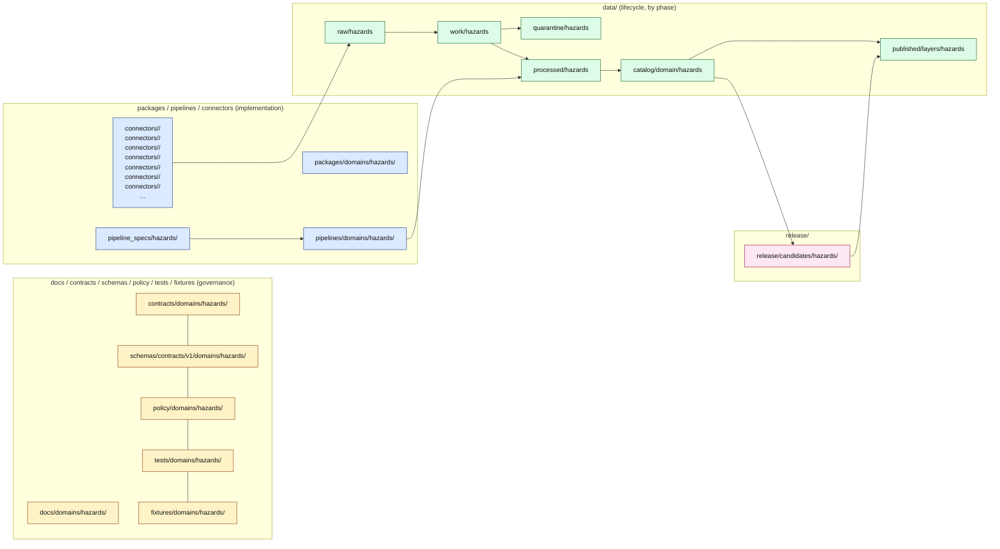
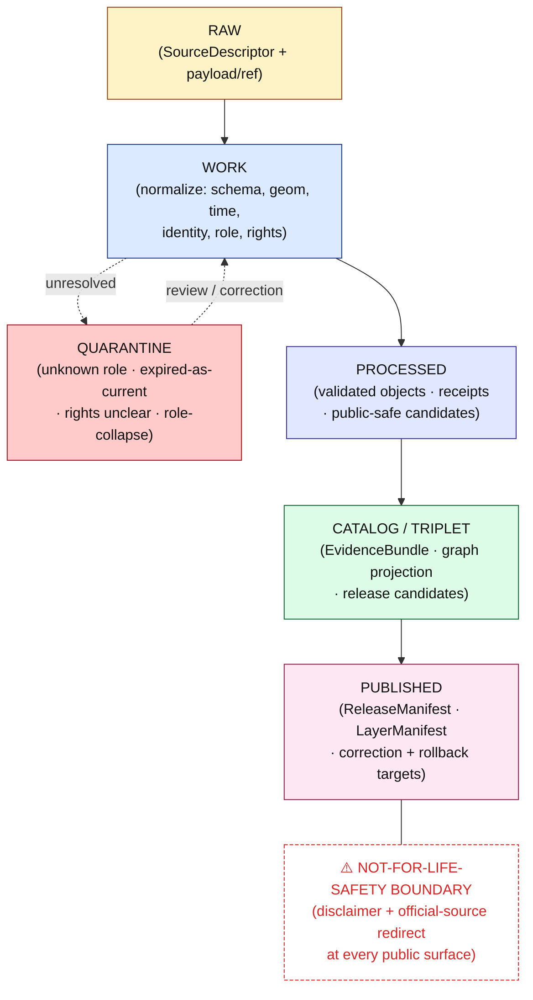
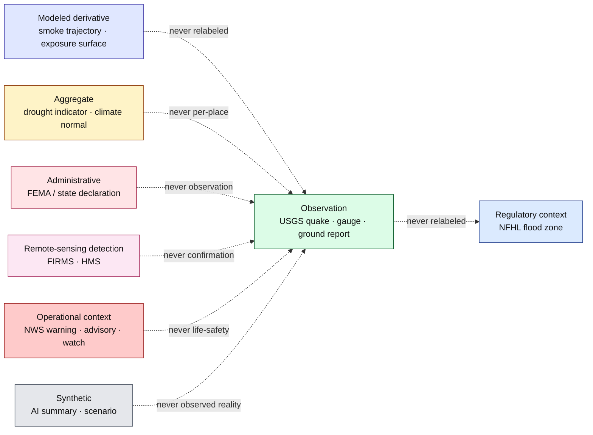

<!-- [KFM_META_BLOCK_V2]
doc_id: kfm://doc/domains-hazards-readme
title: Hazards Domain — README
type: standard
version: v1
status: draft
owners: <hazards-lane-steward> + <directory-rules-steward>   # PLACEHOLDER — assign before publish
created: 2026-05-17
updated: 2026-05-17
policy_label: public
related:
  - directory-rules.md
  - docs/domains/README.md
  - docs/domains/hydrology/README.md
  - docs/domains/atmosphere/README.md
  - docs/domains/settlements-infrastructure/README.md
  - docs/domains/roads-rail-trade/README.md
  - docs/standards/PROV.md
  - docs/standards/ISO-19115.md
  - docs/standards/PMTILES.md
  - docs/standards/OGC-API-TILES.md
  - docs/standards/OAI-PMH.md
tags: [kfm, domain, hazards, not-for-life-safety, source-role, freshness, regulatory-context, evidence-first]
notes:
  - Derived from ENC §7.10 (Hazards), Atlas v1.1 Ch. 12 (Hazards), UIAI Manual §30.6, and Directory Rules §§4, 12, 13.4.
  - Lane is doctrine-grounded; implementation specifics remain PROPOSED until mounted-repo inspection.
  - The not-for-life-safety boundary is non-negotiable and applies across every surface.
[/KFM_META_BLOCK_V2] -->

# Hazards Domain <a id="top"></a>

> **KFM's lane for historical, regulatory, observational, and modeled hazard information for Kansas — explicitly bounded so it is _never_ a life-safety alerting system.**


**Status:** draft &nbsp;·&nbsp; **Owners:** `<hazards-lane-steward>` _(PLACEHOLDER)_ &nbsp;·&nbsp; **Last updated:** 2026-05-17

---

> [!CAUTION]
> **KFM is not an emergency alert system.** Operational warning, advisory, and watch products are surfaced **as context only**, never as life-safety instructions. Every Hazards surface — map layer, Evidence Drawer, Focus Mode answer, exported report — must carry a not-for-life-safety disclaimer and direct users to **official sources** (NWS, NOAA, FEMA, USGS, Kansas Division of Emergency Management, county and tribal emergency management) for actionable warnings. This boundary is **CONFIRMED doctrine** and is enforced at the publication gate, the governed API, and the UI. <small>[ENC §7.10.A] [Atlas v1.1 §12.B, §12.I] [UIAI §30.6] [KFM-IDX-POL-007] [KFM-IDX-PLN-002]</small>

---

## Mini-TOC

1. [Mission and boundary](#1-mission-and-boundary)
2. [Scope, ownership, and explicit non-ownership](#2-scope-ownership-and-explicit-non-ownership)
3. [Repo fit — where Hazards lives across responsibility roots](#3-repo-fit--where-hazards-lives-across-responsibility-roots)
4. [Ubiquitous language](#4-ubiquitous-language)
5. [Source families and source roles](#5-source-families-and-source-roles)
6. [Object families](#6-object-families)
7. [Spatial and temporal model](#7-spatial-and-temporal-model)
8. [Cross-lane relations](#8-cross-lane-relations)
9. [Map and viewing products](#9-map-and-viewing-products)
10. [Pipeline shape — RAW → PUBLISHED](#10-pipeline-shape--raw--published)
11. [Sensitivity, rights, and publication posture](#11-sensitivity-rights-and-publication-posture)
12. [Governed API, contract, and schema surfaces](#12-governed-api-contract-and-schema-surfaces)
13. [Source-role anti-collapse for Hazards](#13-source-role-anti-collapse-for-hazards)
14. [Validators, tests, and fixtures](#14-validators-tests-and-fixtures)
15. [Governed AI behavior in this domain](#15-governed-ai-behavior-in-this-domain)
16. [Publication, correction, and rollback](#16-publication-correction-and-rollback)
17. [Risks and mitigations](#17-risks-and-mitigations)
18. [Thin-slice plan](#18-thin-slice-plan)
19. [Verification backlog and open questions](#19-verification-backlog-and-open-questions)
20. [Related docs](#20-related-docs)

---

## 1. Mission and boundary

**CONFIRMED doctrine / PROPOSED implementation.** The Hazards lane governs historical, regulatory, modeled, and operational-context hazard information for Kansas to support **analysis, research, planning, and resilience review**, while refusing to act as a life-safety alerting system. <small>[ENC §7.10.A] [Atlas v1.1 §12.A]</small>

The lane is high-value precisely because hazards are consequential. KFM contributes to risk understanding by surfacing **historical hazards, modeled exposure, infrastructure proximity, regulatory hazard context, and policy-relevant scientific observation**. It does not warn in real time, it does not bind regulatory action, and it does not replace official alert channels. <small>[KFM-IDX-POL-007] [KFM-IDX-PLN-002] [UIAI §30.6]</small>

**One-line mission:** Govern Kansas hazard history, observation, regulatory context, operational context, exposure, and resilience — evidence-bound, time-aware, role-separated, and not-for-life-safety. <small>[Atlas v1.1 §12.A]</small>

> [!IMPORTANT]
> The lane's value depends on its **boundary**. Hazards surfaces that drift toward alerting expose KFM to liability and the public to harm. The structural defense — built into the schema, the policy gate, the governed API envelope, and the UI surface vocabulary — is to keep the **planning / alerting** distinction visible at every layer. <small>[KFM-IDX-PLN-002]</small>

[Back to top ↑](#top)

---

## 2. Scope, ownership, and explicit non-ownership

### 2.1 This domain owns

**CONFIRMED / PROPOSED.** The Hazards lane owns the following object families:

`HazardEvent` · `HazardObservation` · `WarningContext` · `AdvisoryContext` · `DisasterDeclaration` · `FloodContext` · `WildfireDetection` · `SmokeContext` · `DroughtIndicator` · `EarthquakeEvent` · `HeatColdEvent` · `ExposureSummary` · `ResilienceSummary` · `HazardTimeline` · `ImpactArea`. <small>[ENC §7.10.C] [Atlas v1.1 §12.B, §12.E]</small>

It also owns the not-for-life-safety official-link viewing mode that surfaces hazard context with an explicit redirect to official emergency sources. <small>[ENC §7.10.E]</small>

### 2.2 This domain does NOT own

**CONFIRMED / PROPOSED.** The Hazards lane explicitly does not own:

- **Life-safety alerting, emergency instructions, or operational warning issuance.** Those belong to official authorities (NWS, FEMA, USGS, Kansas DEM, county/tribal emergency management). <small>[ENC §7.10.A] [Atlas v1.1 §12.B] [KFM-IDX-POL-007]</small>
- **Canonical hydrology truth.** Stream-gauge readings, HUC topology, NHDPlus identity, and NFHL regulatory zones are owned by the **Hydrology** lane; Hazards consumes them as `FloodContext` references. <small>[Atlas v1.1 §12.F]</small>
- **Canonical atmosphere / air truth.** Air-quality readings, smoke trajectory models, weather observations, advisories, fire-weather context are owned by **Atmosphere/Air**; Hazards consumes them as `SmokeContext` / `AdvisoryContext` references. <small>[Atlas v1.1 §12.F]</small>
- **Settlement and infrastructure truth.** Lifelines, dependencies, facilities are owned by **Settlements / Infrastructure**; Hazards joins to them only as `ExposureSummary` / `ImpactArea` projections. <small>[Atlas v1.1 §12.F]</small>
- **Road and rail truth.** Closures, detours, bridge/crossing exposure are owned by **Roads, Rail, and Trade Routes**; Hazards consumes them as resilience context. <small>[Atlas v1.1 §12.F]</small>

[Back to top ↑](#top)

---

## 3. Repo fit — where Hazards lives across responsibility roots

### 3.1 Domain Placement Law

Per Directory Rules §12, **the Hazards domain is _not_ a root folder.** It is a segment that appears _inside_ each responsibility root that owns a piece of the lane. The lane is read across roots, not within one. <small>[directory-rules §12, §13.4]</small>

### 3.2 PROPOSED lane layout

> [!NOTE]
> The tree below is the **PROPOSED** application of Directory Rules §12 to the Hazards domain. Path existence is **NEEDS VERIFICATION** until inspected against a mounted repo. <small>[directory-rules §0, §12]</small>

```text
docs/domains/hazards/              # this README — doctrine, glossary, lane orientation
contracts/domains/hazards/         # object meaning (Markdown):
                                   #   hazard_event.md, warning_context.md, advisory_context.md,
                                   #   disaster_declaration.md, flood_context.md, wildfire_detection.md,
                                   #   smoke_context.md, drought_indicator.md, earthquake_event.md,
                                   #   heat_cold_event.md, exposure_summary.md, resilience_summary.md,
                                   #   hazard_timeline.md, impact_area.md
schemas/contracts/v1/domains/hazards/   # JSON Schema (per ADR-0001)
policy/domains/hazards/            # admissibility, not-for-life-safety gate, redaction rules
tests/domains/hazards/             # validator + policy tests (positive + negative fixtures)
fixtures/domains/hazards/          # golden, deny, abstain, stale, expired-warning fixtures
packages/domains/hazards/          # shared hazards code (if any)
pipelines/domains/hazards/         # executable pipeline steps
pipeline_specs/hazards/            # declarative pipeline configuration
connectors/<source>/               # source-specific fetchers (NOT under a hazards folder)
data/raw/hazards/                  # immutable source payloads + SourceDescriptor
data/work/hazards/                 # normalization staging
data/quarantine/hazards/           # held failures (unresolved role, expired, ambiguous)
data/processed/hazards/            # normalized + receipted public-safe candidates
data/catalog/domain/hazards/       # catalog records + EvidenceBundles
data/published/layers/hazards/     # released public-safe layers (PMTiles, layer manifests)
data/registry/sources/hazards/     # SourceDescriptor index for the lane
release/candidates/hazards/        # release decisions, ReleaseManifests, RollbackCards
```

> [!TIP]
> **Cross-cutting files** (e.g., a shared freshness validator used by Hazards, Atmosphere, and Hydrology) live under the **lowest common responsibility root without a domain segment** — e.g., `tools/validators/freshness/`, not `tools/validators/domains/hazards/`. <small>[directory-rules §12, "Multi-domain and cross-cutting files"]</small>

### 3.3 Lane diagram



[Back to top ↑](#top)

---

## 4. Ubiquitous language

**Source:** Atlas v1.1 §12.C — every term below is **CONFIRMED as a Hazards-lane term**; the **field realization** in schemas is **PROPOSED** until inspected.

| Term | Role in Hazards | Notes |
|---|---|---|
| `hazard_event` | A discrete, time-bounded event with location and impact context. | Identity by source id + role + temporal scope + normalized digest (PROPOSED). |
| `historical_event_record` | A retrospective record (e.g., NOAA Storm Events row). | Never reclassified as an operational warning. |
| `operational_warning` | A warning issued by an official authority, surfaced **as context only**. | Carries `issue_time`, `expiry_time`, `source`, freshness state. |
| `operational_advisory` | An advisory (lower-criticality), surfaced as context only. | Same temporal disclosure as warnings. |
| `operational_watch` | A watch (potential conditions), surfaced as context only. | Never represented as a current warning. |
| `administrative_declaration` | A disaster declaration (e.g., FEMA / state). | Cited as administrative context, not as observed damage evidence. |
| `regulatory_context` | A regulatory hazard area (e.g., NFHL flood zone). | Never relabeled as observed flood inundation. |
| `scientific_observation` | A measured observation (e.g., USGS quake catalog entry, water level). | Owned by adjacent lane where applicable; cited with role preserved. |
| `remote_sensing_detection` | A detection (e.g., NASA FIRMS, NOAA HMS). | Probabilistic; never confused with confirmed wildfire occurrence. |
| `modeled_derivative` | A model output (e.g., smoke trajectory, exposure surface). | Carries run receipt, inputs, bounds; never relabeled as observation. |
| `resilience_analysis` | A summary product joining hazard + exposure + lifelines. | Public-safe by default; precise infrastructure deny by default. |
| `unknown_unclassified` | A source whose role cannot be resolved. | **DENY** at publication; held in quarantine. |

<small>[Atlas v1.1 §12.C] [ENC §7.10.C, §7.10.D]</small>

[Back to top ↑](#top)

---

## 5. Source families and source roles

**CONFIRMED source families** (Atlas v1.1 §12.D + ENC §7.10.B). **Rights, freshness, and endpoint behavior are NEEDS VERIFICATION** until each `SourceDescriptor` is independently confirmed. <small>[KFM-IDX-SRC-008]</small>

| Source family | Canonical role(s) | Freshness profile | Status |
|---|---|---|---|
| **NOAA Storm Events / NCEI** | Observation / administrative compilation | Source-vintage, retrospective | NEEDS VERIFICATION |
| **NWS API — alerts / warnings / advisories / watches** | Operational context (not life-safety) | Issue/expiry-bound; **stale-deny** required | NEEDS VERIFICATION |
| **FEMA Disaster Declarations / OpenFEMA** | Administrative declaration | Declaration-vintage | NEEDS VERIFICATION |
| **FEMA NFHL / MSC flood hazard layers** | Regulatory context | Map-revision-vintage | NEEDS VERIFICATION |
| **USGS Earthquake Catalog** | Observation | Near-real-time + retrospective | NEEDS VERIFICATION |
| **NOAA HMS Fire and Smoke** | Remote sensing detection / model | Daily product cadence | NEEDS VERIFICATION |
| **NASA FIRMS active fire** | Remote sensing detection | Sub-daily product cadence | NEEDS VERIFICATION |
| **USGS Water Data** (for `FloodContext`) | Observation (sourced via Hydrology) | Provisional / final lifecycle | NEEDS VERIFICATION |
| **Drought Monitor / drought indicators** | Modeled aggregate | Weekly / monthly cadence | NEEDS VERIFICATION |
| **Kansas / local emergency management** | Administrative context | Source-specific | NEEDS VERIFICATION |
| **State resilience plans** | Administrative / planning context | Plan-vintage | NEEDS VERIFICATION |

<small>[Atlas v1.1 §12.D] [ENC §7.10.B]</small>

> [!WARNING]
> A source whose role cannot be resolved at admission becomes `unknown_unclassified` and is held in **quarantine**. It MUST NOT pass to PROCESSED, CATALOG, or PUBLISHED. <small>[Atlas v1.1 §12.C, §12.H]</small>

[Back to top ↑](#top)

---

## 6. Object families

**CONFIRMED inventory** (ENC §7.10.C; Atlas v1.1 §12.E). Identity rule (PROPOSED): `source_id + object_role + temporal_scope + normalized_digest`. Temporal handling (CONFIRMED): `source_time`, `observed_time`, `valid_time` (issue / expiry where applicable), `retrieval_time`, `release_time`, `correction_time` stay distinct where material. <small>[Atlas v1.1 §12.E]</small>

| Object family | Primary role | Carries explicit temporal disclosure | Default sensitivity |
|---|---|---|---|
| `HazardEvent` | Historical / observed event record | event_time + source/retrieval/release | public-safe with role badge |
| `HazardObservation` | A measured observation tied to a hazard | observed + source/retrieval/release | public-safe with role badge |
| `WarningContext` | NWS-style warning surfaced as context | issue + expiry + freshness | **not-for-life-safety** disclaimer required |
| `AdvisoryContext` | Advisory surfaced as context | issue + expiry + freshness | not-for-life-safety disclaimer required |
| `DisasterDeclaration` | FEMA / state declaration | declaration date + amendments | administrative context |
| `FloodContext` | Pointer to Hydrology NFHL / observed water | regulatory vintage / observed time | regulatory framing required |
| `WildfireDetection` | FIRMS / HMS detection (probabilistic) | acquisition / retrieval | detection-not-confirmation disclaimer |
| `SmokeContext` | HMS smoke or modeled trajectory | acquisition / model run receipt | model framing required |
| `DroughtIndicator` | USDM / SPI / etc. (aggregate) | indicator week / month | aggregation framing required |
| `EarthquakeEvent` | USGS catalog event | origin + retrieval | public-safe |
| `HeatColdEvent` | Heat / cold episode | observed + source | public-safe with role badge |
| `ExposureSummary` | Hazard × population / lifelines / land use | analysis date + input citations | **public-safe summary only**; sensitive infrastructure precision deny by default |
| `ResilienceSummary` | Resilience analysis projection | analysis date + input citations | public-safe summary only |
| `HazardTimeline` | Role-aware multi-event timeline | per-event time discipline | public-safe with role badges |
| `ImpactArea` | Polygonal impact / exposure zone | event-bound | public-safe with generalization |

<small>[ENC §7.10.C] [Atlas v1.1 §12.E] [Atlas v1.1 Appendix C — Hazards row]</small>

[Back to top ↑](#top)

---

## 7. Spatial and temporal model

**CONFIRMED doctrine.** <small>[ENC §7.10.D] [Atlas v1.1 §12.E]</small>

- **Spatial:** event points / lines / polygons; warning / advisory polygons with issue + expiry; exposure zones; regulatory polygons; model grids.
- **Temporal disclosure (all distinct where material):**
  - `event_time` — when the hazard occurred (historical).
  - `issue_time` / `expiry_time` — for operational warning / advisory / watch records.
  - `observed_time` — for measured observations.
  - `valid_time` — temporal validity window for forecasts / model outputs.
  - `source_time` — when the source asserted the record.
  - `retrieval_time` — when KFM fetched it.
  - `release_time` — when KFM released a public-safe derivative.
  - `correction_time` — when a correction was issued.

> [!IMPORTANT]
> **Expired operational context MUST NOT appear as current warning state.** A `WarningContext` past its `expiry_time` is held as historical context with a stale-state badge, **never** as a live warning. <small>[Atlas v1.1 §12.I] [ENC §7.10.G]</small>

[Back to top ↑](#top)

---

## 8. Cross-lane relations

**CONFIRMED / PROPOSED.** Every cross-lane relation MUST preserve ownership, source role, sensitivity, and EvidenceBundle support. <small>[Atlas v1.1 §12.F]</small>

| Adjacent lane | Relation | Constraint |
|---|---|---|
| **Hydrology** | flood, drought, water-event context | Role separation: NFHL = regulatory, gauge = observed, hydrograph = modeled. No conflation. |
| **Atmosphere / Air** | smoke, heat/cold, AQI/advisory, wind, fire-weather context | Role separation: AOD ≠ PM2.5; model ≠ observation. |
| **Settlements / Infrastructure** | exposure, lifelines, dependencies | Sensitive infrastructure precision is deny by default. |
| **Roads / Rail / Trade Routes** | closures, detours, bridge / crossing exposure, resilience | Public-safe representation only; sensitive cultural corridors out of scope. |
| **Agriculture** | drought / wildfire / heat-stress impact context | Aggregate framing preserved; no per-field exact joins from aggregate hazards. |
| **Frontier Matrix (cross-cutting)** | hazards × story / timeline contributions | Story is derivative, not truth. |

[Back to top ↑](#top)

---

## 9. Map and viewing products

**PROPOSED layer set** (Atlas v1.1 §12.G; ENC §7.10.E):

- Hazard event timeline (role-aware, time-sliced)
- NFHL flood context layer (regulatory framing)
- Drought map (aggregate indicator)
- Wildfire / smoke layer (detection + model receipts)
- Earthquake event layer (USGS catalog)
- Severe weather event layer (historical)
- Heat / cold event layer
- Exposure analysis layer (hazard × lifeline summary)
- Resilience summary layer
- **Not-for-life-safety official-link mode** — surface that explicitly redirects to official alerting channels and refuses to render any feed as a live warning

**CONFIRMED cross-cutting viewing products** (MAP-MASTER + GAI):

- Evidence Drawer (with not-for-life-safety disclaimer permanently visible on Hazards features)
- Time-aware state (slider + freshness badges)
- Trust badges (source role, freshness, release state)
- Sensitivity-redacted view (for infrastructure precision)
- Correction / stale-state view
- Governed Focus Mode (finite envelope only)

<small>[Atlas v1.1 §12.G] [Master MapLibre — Evidence Drawer / Focus Mode / freshness]</small>

[Back to top ↑](#top)

---

## 10. Pipeline shape — RAW → PUBLISHED

**CONFIRMED doctrine / PROPOSED lane application.** Hazards follows the canonical lifecycle invariant: **RAW → WORK / QUARANTINE → PROCESSED → CATALOG / TRIPLET → PUBLISHED**, with promotion as a **governed state transition, not a file move**. <small>[directory-rules §0, §12] [Atlas v1.1 §12.H]</small>

### 10.1 Stage table

| Stage | Handling | Gate | Status |
|---|---|---|---|
| **RAW** | Capture immutable source payload (or reference) with source role, rights, sensitivity, citation, time, and hash. | `SourceDescriptor` exists. | PROPOSED |
| **WORK** | Normalize schema, geometry, time, identity, evidence, rights, policy. | Validation + policy gate pass. | PROPOSED |
| **QUARANTINE** | Hold failures (unresolved role, ambiguous identity, expired-as-current, rights uncertain). | Quarantine reason recorded; outcome must be ABSTAIN, DENY, or ERROR. | PROPOSED |
| **PROCESSED** | Emit validated normalized objects, receipts, and public-safe candidates. | `EvidenceRef`, `ValidationReport`, digest closure exist. | PROPOSED |
| **CATALOG / TRIPLET** | Emit catalog records, `EvidenceBundle`s, graph/triplet projections, and release candidates. | Catalog/proof closure passes. | PROPOSED |
| **PUBLISHED** | Serve released public-safe artifacts through governed APIs and manifests. | `ReleaseManifest`, correction path, rollback target, review/policy state exist. | PROPOSED |

<small>[Atlas v1.1 §12.H]</small>

### 10.2 Pipeline diagram



> [!NOTE]
> **Watchers observe and propose — they do not publish.** Per the watcher-as-non-publisher invariant, any Hazards watcher (e.g., NWS feed poller, FIRMS poller) emits only `SourceIntakeRecord` candidates and signed receipts into RAW / WORK; **promotion to PUBLISHED is a separate governed decision** with its own gates. <small>[directory-rules §13.5] [KFM-IDX-SRC-007]</small>

[Back to top ↑](#top)

---

## 11. Sensitivity, rights, and publication posture

**CONFIRMED doctrine** (deny-by-default register row for Hazards — ENC §13):

| Class | Default outcome | Required controls |
|---|---|---|
| **Emergency warning misuse** — operational warnings, forecasts, hazard instructions | **DENY** life-safety replacement; contextual-only with official redirection | Not-for-life-safety disclaimer; issue/expiry freshness; stale-deny |
| **Critical infrastructure** (exposure summaries that include facility precision) | RESTRICT / DENY public precision | Public-safe aggregation; role-based access |
| **Exact sensitive locations** (e.g., precise resilience-critical assets) | DENY by default | Redaction / generalization; audit |
| **Source-rights-limited records** (licensed, no-redistribution, uncertain terms) | DENY public release until terms resolved | Rights register; attribution; no public derivative if barred |

<small>[ENC §13 — deny-by-default register: SRC-HAZ row] [Atlas v1.1 §12.I, §20.5]</small>

**Publication gate (CONFIRMED doctrine).** Unclear rights, unresolved source role, missing evidence, unresolved sensitivity, missing freshness disclosure, or absent release state **blocks public promotion**. <small>[Atlas v1.1 §12.I] [ENC Appendix E]</small>

> [!CAUTION]
> **The not-for-life-safety disclaimer is never suppressed.** It is enforced on:
> 1. every Evidence Drawer payload for a Hazards feature,
> 2. every Focus Mode answer that touches Hazards evidence,
> 3. every public layer manifest description,
> 4. every exported public-safe artifact,
> 5. every API envelope returned for a Hazards object.
> Validators MUST fail closed when any of the five paths omits the disclaimer or the official-source redirect. <small>[UIAI §30.6] [Atlas v1.1 §12.I, §12.K]</small>

[Back to top ↑](#top)

---

## 12. Governed API, contract, and schema surfaces

**PROPOSED surfaces** (Atlas v1.1 §12.J). Exact routes are UNKNOWN until repo verification.

| Surface | DTO / schema | Finite outcomes | Status |
|---|---|---|---|
| Hazards feature / detail resolver | `HazardsDecisionEnvelope` | `ANSWER` / `ABSTAIN` / `DENY` / `ERROR` | PROPOSED governed-API surface; exact route UNKNOWN |
| Hazards layer manifest resolver | `LayerManifest` / domain layer descriptor | `ANSWER` / `DENY` / `ERROR` | PROPOSED; public-safe release only |
| Hazards Evidence Drawer payload | `EvidenceDrawerPayload` + `EvidenceBundle` projection | `ANSWER` / `ABSTAIN` / `DENY` / `ERROR` | PROPOSED; evidence + policy filtered; **not-for-life-safety disclaimer mandatory** |
| Hazards Focus Mode answer | `RuntimeResponseEnvelope` + `AIReceipt` | `ANSWER` / `ABSTAIN` / `DENY` / `ERROR` | PROPOSED; AI never root truth |
| Schema responsibility root | `schemas/contracts/v1/domains/hazards/` | Finite validator outcomes | PROPOSED per ADR-0001; verify against Directory Rules |

<small>[Atlas v1.1 §12.J] [directory-rules §7.1 trust membrane]</small>

> [!IMPORTANT]
> **Public clients use governed APIs only.** Standard UI surfaces (`apps/explorer-web/`) MUST read Hazards data through `apps/governed-api/`, never directly from `data/processed/`, `data/catalog/`, or `data/published/`. The trust membrane is **canonical**. <small>[directory-rules §7.1, §13.5]</small>

[Back to top ↑](#top)

---

## 13. Source-role anti-collapse for Hazards

**CONFIRMED doctrine.** Hazards is one of the highest-risk domains for source-role collapse, because operational, observational, regulatory, modeled, aggregate, and administrative artifacts about the same physical phenomenon (a flood, a wildfire, a quake) sit side by side. The lane MUST keep them separate. <small>[Atlas v1.1 §24.1, §24.1.2]</small>

| Collapse pattern | Why it is denied | Required guardrail |
|---|---|---|
| **Regulatory zone labeled as observed flood event** (NFHL zone shown as "this area flooded") | NFHL is a regulatory determination, not an observation | Separate regulatory-layer and observed-event lanes; UI banner; role-preserving DTO field |
| **Operational warning shown as historical event** (or vice versa) | Conflates the not-for-life-safety boundary with a historical record | Distinct object families; expiry+freshness gating; stale-deny |
| **Wildfire detection shown as confirmed wildfire** (FIRMS hot pixel ≠ verified ignition) | Remote detection is probabilistic | Detection vs. confirmation badge; uncertainty surface |
| **Smoke model shown as observed smoke** | Trajectory model ≠ observation | Run receipt + uncertainty; role-preserving DTO field |
| **Aggregate drought indicator cited as per-place drought truth** | Aggregate loses per-place fidelity | Aggregation receipt; matrix-cell semantics; deny per-place join |
| **Disaster declaration cited as event evidence** | Declaration is administrative, not observation | Role badge; never used as observation in timelines |
| **Synthetic content (AI-drafted summary) cited as observed reality** | Synthetic is never observed | `AIReceipt`; Reality Boundary Note; never as primary citation |

<small>[Atlas v1.1 §24.1.2 — DENY conditions]</small>



> [!WARNING]
> Every Hazards artifact passing the publication gate MUST preserve its source-role label through every promotion. **Promotion does not upgrade a model into an observation, an aggregate into a per-place record, or a candidate into a verified event.** Those are separate governed transitions with their own evidence and review requirements. <small>[Atlas v1.1 §24.1.1 reading note]</small>

[Back to top ↑](#top)

---

## 14. Validators, tests, and fixtures

**PROPOSED validator coverage** (Atlas v1.1 §12.K; ENC §7.10.K):

- Source-role anti-collapse tests (per §13 above)
- Temporal-role validators (event vs. issue/expiry vs. valid vs. observed)
- **Emergency-alert denial** (publication fails closed if disclaimer or official-source redirect is absent)
- Operational expiry / freshness tests (stale-deny)
- Catalog closure tests (`EvidenceBundle` resolves; digests closed)
- Evidence Drawer disclaimer tests (disclaimer present + official-source redirect link present)
- UI no-direct-source tests (`apps/explorer-web/` may not bypass `apps/governed-api/`)
- Schema validation; SourceDescriptor validation; rights validation; sensitivity validation; geometry validity; policy deny tests; citation validation; release manifest validation; rollback drill; no-network fixtures; non-regression tests <small>[ENC §7.10.K]</small>

> [!TIP]
> **Negative fixtures are as important as valid fixtures.** The validator registry SHOULD link every Hazards schema to both its positive and its negative fixtures — including stale-warning, expired-as-current, regulatory-as-observed, detection-as-confirmed, model-as-observed, aggregate-as-per-place, and missing-disclaimer cases. <small>[KFM-IDX-VAL-003]</small>

<details>
<summary><b>Suggested fixture taxonomy (PROPOSED)</b></summary>

| Fixture class | Purpose | Expected outcome |
|---|---|---|
| `golden_event_storm` | Historical NOAA Storm Events event — clean admission | `ANSWER` |
| `golden_quake_usgs` | USGS earthquake catalog event — clean admission | `ANSWER` |
| `golden_nfhl_zone` | NFHL polygon labeled regulatory | `ANSWER` (with regulatory badge) |
| `negative_warning_expired_as_current` | NWS warning past `expiry_time` shown as current | `DENY` |
| `negative_regulatory_as_observed` | NFHL zone exported as "observed flood" | `DENY` |
| `negative_detection_as_confirmation` | FIRMS hot pixel exported as "confirmed wildfire" | `DENY` |
| `negative_model_as_observed` | HMS trajectory exported as "observed smoke" | `DENY` |
| `negative_aggregate_per_place` | USDM cell joined to single field point | `DENY` |
| `negative_missing_disclaimer` | Evidence Drawer payload without not-for-life-safety disclaimer | `DENY` |
| `negative_unknown_role` | Source admitted without resolvable role | `QUARANTINE` |
| `abstain_insufficient_evidence` | Focus Mode answer with no resolvable `EvidenceBundle` | `ABSTAIN` |
| `stale_source` | `SourceDescriptor` cadence elapsed | stale-state badge + `ABSTAIN` on time-sensitive claim |
| `rollback_drill` | Released layer with prepared `RollbackCard` | rollback succeeds; `CorrectionNotice` emitted |

</details>

[Back to top ↑](#top)

---

## 15. Governed AI behavior in this domain

**CONFIRMED doctrine / PROPOSED implementation.** <small>[Atlas v1.1 §12.L] [Whole-UI Governed AI Expansion]</small>

AI on Hazards surfaces:

- **MAY** summarize released `EvidenceBundle`s, compare evidence, explain limitations, and draft steward-review notes.
- **MUST `ABSTAIN`** when evidence is insufficient or stale.
- **MUST `DENY`** where policy, rights, sensitivity, release state, or the not-for-life-safety boundary blocks the request.
- **MUST NOT** issue emergency instructions, life-safety directives, or anything that could be read as an active warning.
- **MUST** carry an `AIReceipt` with citations resolving to released `EvidenceBundle`s; uncited claims are blocked at the envelope.

> [!CAUTION]
> If a user prompt asks Focus Mode for actionable emergency advice ("should I evacuate?", "is it safe to drive across…?"), the correct outcome is `DENY` with an explicit redirect to official channels — never `ANSWER`. The DENY reason code is part of the Hazards envelope contract (PROPOSED). <small>[KFM-IDX-POL-007] [UIAI §30.6]</small>

[Back to top ↑](#top)

---

## 16. Publication, correction, and rollback

**CONFIRMED doctrine / PROPOSED implementation.** Hazards publication requires:

- `ReleaseManifest`
- `EvidenceBundle` closure
- Validation + policy support (positive and negative fixtures green)
- Review state where required (steward sign-off for sensitive infrastructure exposure or first-release of an operational feed)
- Correction path (`CorrectionNotice` issuable; downstream notification path defined)
- Stale-state rule (badge + ABSTAIN on stale time-sensitive claims)
- Rollback target (`RollbackCard` prepared; rollback drill rehearsed before first publication)

<small>[Atlas v1.1 §12.M] [ENC Appendix E]</small>

[Back to top ↑](#top)

---

## 17. Risks and mitigations

| Risk | Mitigation |
|---|---|
| **Surface drift toward alerting** | Disclaimer + official-source redirect enforced at every surface; validator-blocked publication; UI vocabulary uses "planning context, not alerting." <small>[KFM-IDX-PLN-002]</small> |
| **Rights uncertainty** | Block public release until source terms and redistribution class are recorded. |
| **Sensitive location exposure** (resilience layers touching infrastructure) | Default redaction / generalization; restricted views; geoprivacy transform receipts. |
| **False precision** | Uncertainty + scale + source-role badges on every feature; ABSTAIN on over-precise claims. |
| **Source authority confusion** | Source-role registry; separate observation / model / regulatory / administrative lanes. |
| **Model hallucination** | Citation validation; finite outcomes; no direct model-to-public path. |
| **Stale data** | Freshness badges; explicit `retrieval_time` / `source_time` / `release_time`; stale-deny policy on time-sensitive claims. |
| **Rollback complexity** | `ReleaseManifest` + `RollbackCard` + rollback drill for every release. |

<small>[ENC §7.10.M]</small>

[Back to top ↑](#top)

---

## 18. Thin-slice plan

**PROPOSED first credible thin slice** (ENC §7.10.N): a historical flood / severe-weather event fixture, plus NFHL context and an exposure summary, **with warning feeds disabled or contextual-only**. <small>[ENC §7.10.N]</small>

**Closure checklist for the thin slice:**

1. One historical Storm-Events fixture (e.g., a single Kansas county, single year).
2. One NFHL polygon overlay labeled `regulatory_context`.
3. One `ExposureSummary` joining the event to public-safe settlement aggregates.
4. `SourceDescriptor` for each source.
5. `EvidenceBundle` closure (all `EvidenceRef`s resolve).
6. Policy decision: ANSWER for public-safe surfaces, DENY for any infrastructure precision, ABSTAIN on time-sensitive claims with stale source.
7. Validation pass with positive AND negative fixtures (incl. expired-warning-as-current DENY).
8. `ReleaseManifest` + `RollbackCard` + rollback drill rehearsed.
9. Evidence Drawer payload includes disclaimer + official-source redirect.
10. Focus Mode answer returns `ANSWER` with citations OR `ABSTAIN` / `DENY` as appropriate.

> [!TIP]
> **Domain expansion is proof-bearing, not coverage-bearing.** Broad horizontal launches typically skip closure in one or more categories — and the gap surfaces as user-visible incoherence once the surface is live. Repeat the thin slice; do not assert horizontal coverage in the first PR. <small>[KFM-IDX-PLN-003]</small>

[Back to top ↑](#top)

---

## 19. Verification backlog and open questions

**Status:** all rows below are **NEEDS VERIFICATION** until inspected against a mounted repo. <small>[Atlas v1.1 §12.N]</small>

| Item to verify | Evidence that would settle it |
|---|---|
| Official source endpoints and current rights for NWS, NOAA Storm Events, NOAA HMS, OpenFEMA, NFHL, USGS Earthquake, NASA FIRMS, USDM. | `SourceDescriptor` entries in `data/registry/sources/hazards/`; rights register; admission tests. |
| Implementation of source-role taxonomy and freshness states. | Schemas under `schemas/contracts/v1/domains/hazards/`; validator tests under `tests/domains/hazards/`. |
| Enforcement of the emergency-alert / not-for-life-safety boundary at the publication gate. | Policy bundle under `policy/domains/hazards/`; negative fixture causing DENY. |
| Release / correction / rollback drill rehearsed for at least one Hazards release. | `ReleaseManifest`, `CorrectionNotice` template, `RollbackCard`, rehearsal log. |
| Disclaimer + official-source redirect present in every governed-API Hazards envelope. | Envelope tests; UI tests; AIReceipt content tests. |
| Stale-deny behavior for time-sensitive Hazards claims. | Stale-source fixture; ABSTAIN outcome. |
| Source-role anti-collapse coverage for the seven hazards-specific failure modes in §13. | Negative fixture set; validator pass log. |
| Watcher-as-non-publisher enforced for any NWS / FIRMS / HMS pollers. | Watcher contract; receipts proving no direct publish. |

### Open questions

- Which Kansas counties / AOIs offer the right combination of evidence richness, sensitivity, and review feasibility for the first Hazards thin slice? <small>[KFM-IDX-PLN-003 open question]</small>
- Which Hazards layers carry the highest misuse risk and need the most prominent labeling? <small>[KFM-IDX-PLN-002 open question]</small>
- Should the not-for-life-safety disclaimer be a per-domain policy fragment or a Hazards-specific contract field on every Hazards DTO? (PROPOSED: both — policy gate AND DTO field.)
- What latency thresholds and freshness profiles are appropriate for each hazard source family, and where do probe receipts live (`data/receipts/`, a dedicated source-health register, or both)? <small>[EXP-003]</small>
- Should Hazards have a separate **operational-feed** sub-lane (e.g., `policy/domains/hazards/operational/`) to localize the not-for-life-safety gate code, or stay flat? (NEEDS ADR.)

[Back to top ↑](#top)

---

## 20. Related docs

- **Doctrine and placement:** `directory-rules.md` (§4 Placement Protocol, §12 Domain Placement Law, §13.4 anti-pattern fix, §15 Required README Contract)
- **Domain index (PROPOSED):** `docs/domains/README.md`
- **Adjacent lane READMEs (PROPOSED targets):**
  - `docs/domains/hydrology/README.md` — flood / drought / water-event context
  - `docs/domains/atmosphere/README.md` — smoke / heat-cold / advisory context
  - `docs/domains/settlements-infrastructure/README.md` — exposure, lifelines, dependencies
  - `docs/domains/roads-rail-trade/README.md` — closures, detours, bridge / crossing exposure
- **Standards already authored:** `docs/standards/PROV.md`, `docs/standards/PMTILES.md`, `docs/standards/OGC-API-TILES.md`, `docs/standards/OAI-PMH.md`, `docs/standards/ISO-19115.md`
- **Operational runbooks (PROPOSED targets):**
  - `docs/runbooks/hazards/SOURCE_REFRESH_RUNBOOK.md` — source refresh for Hazards (PROPOSED; subfolder convention NEEDS VERIFICATION vs. flat `hazards_*` prefix)
  - `docs/runbooks/hazards/NOT_FOR_LIFE_SAFETY_AUDIT_RUNBOOK.md` — periodic audit of disclaimer presence and official-source redirect coverage (PROPOSED)
- **Cross-cutting doctrine:**
  - Atlas v1.1 §24.1 (Master Source-Role Anti-Collapse Register)
  - Atlas v1.1 §20.5 (Deny-by-Default Register)
  - ENC §13 (Sensitive / Deny-by-Default Register)
  - UIAI Manual §30.6 (Hazards lane assembly)
- **ADRs likely to apply:**
  - **ADR-0001** (schema home — `schemas/contracts/v1/...`) — applies.
  - **ADR-hazards-runbook-subfolder** (PROPOSED) — resolves `docs/runbooks/hazards/*` vs. flat `hazards_*` naming.
  - **ADR-not-for-life-safety-contract** (PROPOSED) — decides whether the disclaimer is a DTO field, a policy fragment, or both.
  - **ADR-source-role-taxonomy** (PROPOSED) — canonicalizes the source-role enum referenced in §13.

[Back to top ↑](#top)

---

<details>
<summary><b>Appendix · Directory Rules §15 Required README Contract — crosswalk to this file</b></summary>

§15 of Directory Rules defines a required README contract for **canonical roots and compatibility roots**. This README is a **domain-lane README inside `docs/`**, not a root README, so §15 is not strictly required here — but applying it improves trust and review consistency.

| §15 section | Where covered above |
|---|---|
| Purpose | §1 Mission and boundary |
| Authority level | "Domain lane README" (badge + meta block); doctrine is canonical, paths are PROPOSED |
| Status | Meta block + status badge (draft) |
| What belongs here | §2.1 + §3 (lane layout) |
| What does NOT belong here | §2.2 (explicit non-ownership) + §11 (deny-by-default register row) |
| Inputs | §5 source families + §10 RAW stage |
| Outputs | §9 viewing products + §12 API surfaces + §10 PUBLISHED stage |
| Validation | §14 validators + tests + fixtures |
| Review burden | Owners line (PLACEHOLDER) + §16 publication gate + §11 sensitive class controls |
| Related folders | §3 lane layout + §20 related docs |
| ADRs | §20 ADRs list |
| Last reviewed | "Last updated" line in header + footer |

</details>

---

**Related docs:** [Directory Rules](../../directory-rules.md) · [Domains index (PROPOSED)](../README.md) · [Hydrology](../hydrology/README.md) · [Atmosphere](../atmosphere/README.md) · [Settlements / Infrastructure](../settlements-infrastructure/README.md) · [Roads / Rail / Trade](../roads-rail-trade/README.md)

**Last updated:** 2026-05-17 · **Status:** draft · **Owners:** `<hazards-lane-steward>` _(PLACEHOLDER — NEEDS VERIFICATION)_ · [Back to top ↑](#top)
