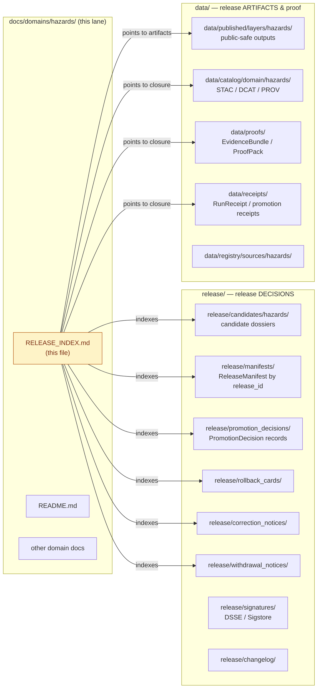
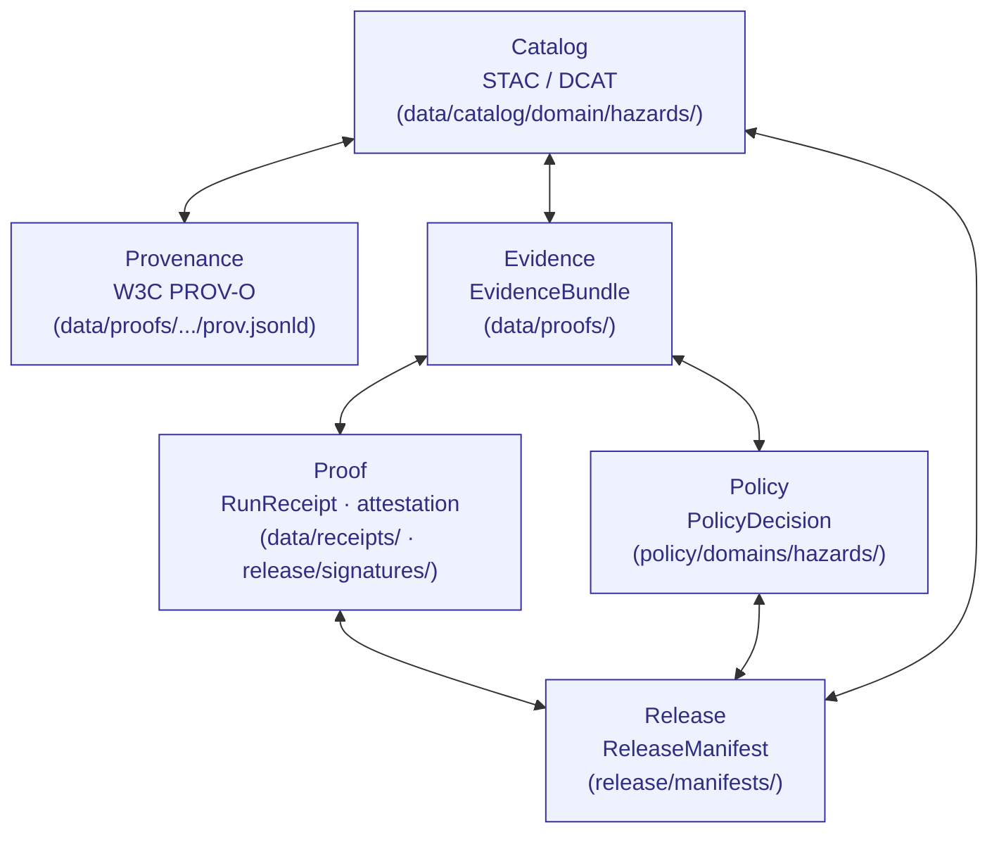
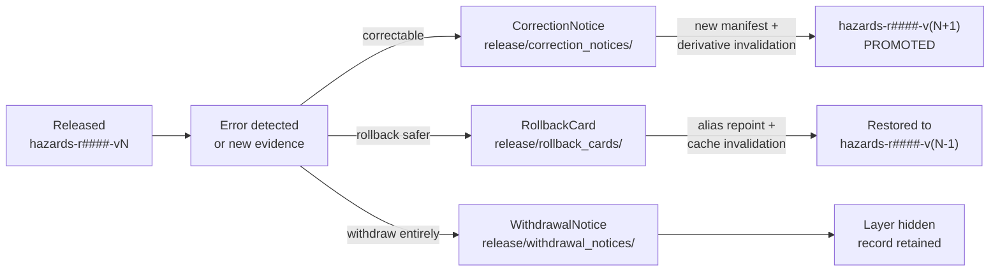

<!-- [KFM_META_BLOCK_V2]
doc_id: kfm://doc/<uuid-on-publish>
title: Hazards Release Index
type: standard
version: v1
status: draft
owners: <docs-steward> · <hazards-domain-steward> · <release-manager>
created: 2026-05-17
updated: 2026-05-17
policy_label: public
related:
  - docs/domains/hazards/README.md
  - docs/doctrine/directory-rules.md
  - docs/standards/PROV.md
  - docs/standards/PMTILES.md
  - docs/standards/OGC-API-TILES.md
  - docs/standards/ISO-19115.md
  - release/README.md
  - release/candidates/hazards/
  - release/manifests/
  - release/rollback_cards/
  - release/correction_notices/
  - release/withdrawal_notices/
  - data/published/layers/hazards/
  - data/catalog/domain/hazards/
tags: [kfm, hazards, release, index, lifecycle, governance]
notes:
  - "Docs-side index — NOT a canonical release decision artifact."
  - "Hazards is contextual / planning — NOT a life-safety alerting surface."
  - "Most implementation claims are PROPOSED until repo evidence confirms them."
[/KFM_META_BLOCK_V2] -->

# Hazards Release Index

> Navigation hub and audit-friendly registry for **Hazards domain releases** — candidates, published, corrected, withdrawn, and superseded — and the `ReleaseManifest`, `PromotionDecision`, `RollbackCard`, `CorrectionNotice`, and `WithdrawalNotice` artifacts that govern them.


**Status:** `draft` · **Owners:** `<docs-steward>` · `<hazards-domain-steward>` · `<release-manager>` · **Last updated:** `2026-05-17`

> [!CAUTION]
> **KFM Hazards is *not* an emergency-alerting system and *not* a regulatory authority.** Released hazards layers are historical, regulatory-context, modeled, or planning-context evidence — never current life-safety guidance. Direct life-safety needs to official sources (NWS, FEMA, state emergency management, local 911). This boundary is doctrine, and every release listed below MUST carry the *“planning context, not alerting”* label on every public surface.

---

## Contents

- [1. Purpose & scope](#1-purpose--scope)
- [2. What this index is — and is not](#2-what-this-index-is--and-is-not)
- [3. Repo fit & where artifacts actually live](#3-repo-fit--where-artifacts-actually-live)
- [4. Hazards release scope — artifact families](#4-hazards-release-scope--artifact-families)
- [5. Hazards release lifecycle](#5-hazards-release-lifecycle)
- [6. Release state vocabulary](#6-release-state-vocabulary)
- [7. Active releases registry](#7-active-releases-registry)
- [8. Candidate releases registry](#8-candidate-releases-registry)
- [9. Corrected, withdrawn, and superseded releases](#9-corrected-withdrawn-and-superseded-releases)
- [10. Per-layer release lineage](#10-per-layer-release-lineage)
- [11. Catalog / proof / release closure for Hazards](#11-catalog--proof--release-closure-for-hazards)
- [12. Sensitivity, rights, and the life-safety boundary](#12-sensitivity-rights-and-the-life-safety-boundary)
- [13. Promotion gates and decisions](#13-promotion-gates-and-decisions)
- [14. Correction and rollback path](#14-correction-and-rollback-path)
- [15. Source drift, watchers, and freshness](#15-source-drift-watchers-and-freshness)
- [16. Validators, tests, and fixtures](#16-validators-tests-and-fixtures)
- [17. Open questions & verification backlog](#17-open-questions--verification-backlog)
- [Related docs](#related-docs)

---

## 1. Purpose & scope

**CONFIRMED doctrine / PROPOSED implementation.** This index is the **human-facing entry point** for Hazards domain releases. It indexes — but never replaces — the canonical decision artifacts that live under `release/` and the released artifacts under `data/published/layers/hazards/`.

For any Hazards layer, dataset, evidence bundle, or report that has been promoted to `PUBLISHED` (or is a candidate, corrected, withdrawn, or superseded version of one), this document answers:

- **Where is its `ReleaseManifest`?** *(under [`release/manifests/`](../../../release/manifests/))*
- **What `PromotionDecision`, `RollbackCard`, `CorrectionNotice`, or `WithdrawalNotice` governs it?** *(under the corresponding `release/` subfolder)*
- **What `EvidenceBundle`, `RunReceipt`, and `ValidationReport` close its catalog?** *(under [`data/proofs/`](../../../data/proofs/), [`data/receipts/`](../../../data/receipts/), and [`data/catalog/domain/hazards/`](../../../data/catalog/domain/hazards/))*
- **What is its current state, vintage, source-role posture, sensitivity posture, and rollback target?**

This index is **not** a regulatory record, not a CDN cache controller, and not a substitute for the canonical artifacts it points to.

[⬆ back to top](#contents)

---

## 2. What this index is — and is not

| | **Is** | **Is not** |
|---|---|---|
| **Authority** | A docs-side navigation and audit hub for Hazards releases | The release decision authority — that role belongs to `release/manifests/` plus `release/promotion_decisions/` (CONFIRMED doctrine, [Directory Rules §9.2](../../doctrine/directory-rules.md#92-release--release-decisions)) |
| **Scope** | All Hazards artifact families: events, contexts, declarations, detections, summaries, timelines, tiles, drawer payloads, AI envelopes | Hazards source-edge captures (those live in `data/raw/hazards/`) and quarantined material (`data/quarantine/hazards/`) |
| **Trust posture** | Cite-or-abstain; release-state visible per row | A truth store, citation authority, or rights authority |
| **Alerting** | A history of planning-context hazards artifacts | A live alerting feed, a watch/warning publisher, or a regulatory determination |
| **Maintenance** | Updated whenever a Hazards release is promoted, corrected, rolled back, withdrawn, or superseded | Auto-generated from the registry; **PROPOSED**: a CI job under [`tools/docs/`](../../../tools/) could regenerate the registry tables from `release/manifests/` and `data/catalog/domain/hazards/` (NEEDS VERIFICATION). |

> [!NOTE]
> Where this index conflicts with the canonical `release/` artifacts, **the canonical artifacts win**. Open a drift entry in [`docs/registers/DRIFT_REGISTER.md`](../../registers/DRIFT_REGISTER.md) and reconcile.

[⬆ back to top](#contents)

---

## 3. Repo fit & where artifacts actually live

This document sits inside the **Hazards docs lane** per [Domain Placement Law §12](../../doctrine/directory-rules.md#12-domain-placement-law). It is one file in a family of Hazards-lane artifacts spread across responsibility roots. The diagram below shows what this index points *to*, not what it owns.



> [!IMPORTANT]
> **`data/published/` holds released artifacts. `release/` holds release decisions.** Mixing the two is one of the four primary drift patterns called out in [Directory Rules §13.2](../../doctrine/directory-rules.md#132-artifacts-datapro of s-datareceipts-and-release-mixing-proof-process-memory-build-output-and-release-decisions). A ReleaseManifest does **not** live in `data/published/`; a published PMTiles file does **not** live in `release/`.

### Hazards lane at a glance

```text
docs/domains/hazards/                  # human-facing (this lane)
  ├── README.md                        # domain overview                  [PROPOSED]
  ├── RELEASE_INDEX.md                 # ← this file                      [PROPOSED]
  └── ...                              # other Hazards docs               [PROPOSED]

contracts/domains/hazards/             # object meaning                   [PROPOSED]
schemas/contracts/v1/domains/hazards/  # object shape (per ADR-0001)      [PROPOSED]
policy/domains/hazards/                # admissibility / release policy   [PROPOSED]
tests/domains/hazards/                 # enforceability proof             [PROPOSED]
fixtures/domains/hazards/              # golden / valid / invalid inputs  [PROPOSED]
packages/domains/hazards/              # shared domain libraries          [PROPOSED]
pipelines/domains/hazards/             # executable pipeline logic        [PROPOSED]
pipeline_specs/hazards/                # declarative pipeline config      [PROPOSED]

data/raw/hazards/                      # immutable intake captures        [PROPOSED]
data/work/hazards/                     # normalized intermediates         [PROPOSED]
data/quarantine/hazards/               # failed validation / sensitivity  [PROPOSED]
data/processed/hazards/                # validated canonical records      [PROPOSED]
data/catalog/domain/hazards/           # STAC / DCAT / PROV               [PROPOSED]
data/published/layers/hazards/         # released public-safe artifacts   [PROPOSED]
data/registry/sources/hazards/         # source descriptors / cadence     [PROPOSED]

release/candidates/hazards/            # candidate release dossiers       [PROPOSED]
release/manifests/                     # ReleaseManifests (all domains)   [PROPOSED]
release/promotion_decisions/           # PromotionDecisions               [PROPOSED]
release/rollback_cards/                # rollback artifacts               [PROPOSED]
release/correction_notices/            # public correction notices        [PROPOSED]
release/withdrawal_notices/            # withdrawal records               [PROPOSED]
```

> **Status reminder.** Per [Directory Rules §5](../../doctrine/directory-rules.md#5-canonical-root-tree), the **rules** here are CONFIRMED; the **specific paths actually existing in the mounted repo** are PROPOSED until verified.

[⬆ back to top](#contents)

---

## 4. Hazards release scope — artifact families

**CONFIRMED doctrine.** The Hazards domain releases the following artifact families, each of which appears in this index when promoted to `PUBLISHED`. Object identities and source roles are governed elsewhere; this index records *release state*, not *truth*.

<details>
<summary><strong>4.1 Canonical object families (released as derivatives, not as raw evidence)</strong></summary>

| Object family | Public release form (illustrative) | Sensitivity default | Source role discipline |
|---|---|---|---|
| `HazardEvent` | Historical event point/line/polygon with attribution and time | public-safe (with caveats) | observation / archive — never alert |
| `HazardObservation` | Sensor or report observation tied to a source | public-safe with provenance | observation — never authority |
| `WarningContext` | NWS warning footprint as **historical/contextual** record only | public-safe + *“not for life safety”* label | context — never current alert |
| `AdvisoryContext` | NWS advisory footprint as **historical/contextual** record only | public-safe + *“not for life safety”* label | context — never current alert |
| `DisasterDeclaration` | FEMA / state declaration record | public-safe | authority (declarations) / context |
| `FloodContext` | FEMA NFHL polygons as **regulatory context** | public-safe + *“regulatory context, verify with authority”* | authority (regulatory) — not site-specific determination |
| `WildfireDetection` | NASA FIRMS / NOAA HMS detection points/polygons | public-safe | observation / model — never alert |
| `SmokeContext` | NOAA HMS smoke polygons | public-safe + provisional/expired badging | model / observation |
| `DroughtIndicator` | U.S. Drought Monitor / state monitor index | public-safe | model |
| `EarthquakeEvent` | USGS earthquake catalog event | public-safe | observation |
| `HeatColdEvent` | Heat / cold event records and indices | public-safe + caveats | observation / model |
| `ExposureSummary` | Population, infrastructure, asset exposure summary | review-gated; aggregate-only by default | derived |
| `ResilienceSummary` | Resilience plan / capacity summary | review-gated | reference / context |
| `HazardTimeline` | Multi-event timeline overlay | public-safe | derived |
| `ImpactArea` | Impact polygon (historical / modeled) | review-gated when joined to sensitive lanes | derived / model |

Citations: hazards object families per the KFM Domain & Capability Encyclopedia §7.10 and the Domains Culmination Atlas §12.

</details>

<details>
<summary><strong>4.2 Map / tile / drawer / AI artifact families</strong></summary>

| Artifact family | Carrier | Bound by |
|---|---|---|
| Hazards `LayerManifest` | one per public layer | `ReleaseManifest`, `SourceDescriptor`, `EvidenceBundle`, policy posture |
| Hazards PMTiles archive | versioned filename, root-hash sidecar | `TileArtifactManifest`, attestation, rollback target |
| Hazards COG raster (e.g., drought index, smoke) | versioned filename, checksum | `TileArtifactManifest` / raster manifest |
| Hazards STAC items / collections | one per dataset bundle | `kfm:` profile (PROPOSED) — see [PMTILES](../../standards/PMTILES.md) and [ISO-19115](../../standards/ISO-19115.md) |
| Hazards Evidence Drawer payload | per feature click | `EvidenceDrawerPayload` + `EvidenceBundle` projection |
| Hazards Focus Mode answer | per AI request | Runtime Response Envelope + `AIReceipt`; **ABSTAIN** if evidence is insufficient; **DENY** if life-safety / regulatory / sensitivity is implicated |

> [!NOTE]
> Map artifacts are **downstream carriers**, not authorities. Tiles, layers, and drawer payloads consume releases — they do not produce them. See [`Master MapLibre Components·Functions·Features`](../../../docs/architecture/maplibre.md) (PROPOSED path) for the renderer-boundary doctrine.

</details>

[⬆ back to top](#contents)

---

## 5. Hazards release lifecycle

**CONFIRMED doctrine: `RAW → WORK / QUARANTINE → PROCESSED → CATALOG / TRIPLET → PUBLISHED`. Promotion is a governed state transition, not a file move.** ([Directory Rules §9.1](../../doctrine/directory-rules.md#91-data--lifecycle-data-and-emitted-proof) / [ENCY Appendix E].)

```mermaid
flowchart LR
  SRC[("Hazards
source feeds")]:::ext
  RAW["RAW
data/raw/hazards/"]
  WORK["WORK
data/work/hazards/"]
  QUAR["QUARANTINE
data/quarantine/hazards/
unknown role · rights ·
sensitivity · expiry"]
  PROC["PROCESSED
data/processed/hazards/
+ data/receipts/ · data/proofs/"]
  CAT["CATALOG / TRIPLET
data/catalog/domain/hazards/
STAC · DCAT · PROV closure"]
  CAND["release/candidates/hazards/
candidate dossier"]
  PUB["PUBLISHED
data/published/layers/hazards/
+ release/manifests/"]
  COR["PUBLISHED'
(corrected)"]
  SUP["SUPERSEDED"]
  WD["WITHDRAWN"]
  RBK["ROLLBACK
release/rollback_cards/"]

  SRC -->|"SourceDescriptor
+ rights/role/cadence"| RAW
  RAW --> WORK
  RAW -. fail-closed .-> QUAR
  QUAR -. remediate .-> WORK
  WORK -->|"ValidationReport ·
PolicyDecision"| PROC
  PROC -->|"EvidenceBundle ·
RunReceipt ·
catalog closure"| CAT
  CAT --> CAND
  CAND -->|"PromotionDecision
(separation of duties)"| PUB
  PUB -. CorrectionNotice .-> COR
  PUB -. WithdrawalNotice .-> WD
  PUB -. RollbackCard .-> RBK
  RBK -. restores prior .-> PUB
  COR -. supersedes .-> SUP

  classDef ext fill:#F3F4F6,stroke:#6B7280,color:#374151;
  classDef pub fill:#DCFCE7,stroke:#15803D,color:#14532D;
  classDef quar fill:#FEE2E2,stroke:#B91C1C,color:#7F1D1D;
  classDef end fill:#FEF3C7,stroke:#B45309,color:#7C2D12;
  class PUB pub;
  class QUAR quar;
  class WD,SUP,RBK end;
```

### Hazards lifecycle gate table

| Transition | Pre-condition | Required artifacts (PROPOSED minimum) | Fail-closed outcome | Status |
|---|---|---|---|---|
| Admission (`— → RAW`) | `SourceDescriptor` exists; rights/role/cadence set | `SourceDescriptor`; payload hash | source not admitted; logged as candidate | PROPOSED |
| Normalization (`RAW → WORK / QUARANTINE`) | schema, geometry, time, identity, evidence, rights, policy rules are runnable | `TransformReceipt`; `ValidationReport`; `PolicyDecision` | quarantine with reason; never silent promote | PROPOSED |
| Validation (`WORK → PROCESSED`) | deterministic validators tied to fixtures | `ValidationReport` pass; `RedactionReceipt` if sensitivity | stay in WORK; structured FAIL | PROPOSED |
| Catalog closure (`PROCESSED → CATALOG / TRIPLET`) | `EvidenceRef` resolves; catalog matrix + digests close | `CatalogMatrix`; `EvidenceBundle`; graph/triplet | HOLD at PROCESSED; no public edge | PROPOSED |
| Release (`CATALOG → PUBLISHED`) | Review state where required; release authority distinct from author when materiality applies | `ReleaseManifest`; rollback target; correction path; `ReviewRecord` | HOLD at CATALOG; no public surface change | PROPOSED |
| Correction (`PUBLISHED → PUBLISHED'`) | Detected error or new evidence; downstream derivatives identified | `CorrectionNotice`; new manifest; derivative invalidation | superseded with public notice | PROPOSED |
| Rollback (`PUBLISHED → prior PUBLISHED`) | Rollback target named in release | `RollbackCard`; cache invalidation; downstream receipt | retraction with rollback receipt | PROPOSED |

Sources: KFM Domains Culmination Atlas §24.6.1; Encyclopedia §7.10.H; Idea Index `KFM-IDX-REL-001`..`KFM-IDX-REL-005`.

[⬆ back to top](#contents)

---

## 6. Release state vocabulary

**CONFIRMED doctrine.** The `release_state` enumeration is shared across KFM and surfaced consistently in `kfm:` profile fields (PROPOSED for finalization in the STAC profile). Hazards releases inherit this vocabulary without modification.

| State | Meaning | Visible on public UI? | Allowed transitions |
|---|---|---|---|
| `unreleased` | Internal candidate; never on the public path | No | `→ candidate`, `→ withdrawn (pre-release)` |
| `candidate` | Dossier under `release/candidates/hazards/`; awaiting `PromotionDecision` | No | `→ released`, `→ withdrawn (pre-release)` |
| `released` | Promoted with valid `ReleaseManifest`; on the public path | Yes (with trust badges) | `→ corrected`, `→ superseded`, `→ withdrawn`, `→ rolled back` |
| `corrected` | Replaced by a corrected version after a `CorrectionNotice` | Yes (corrected badge + notice) | `→ superseded`, `→ withdrawn` |
| `superseded` | A newer release exists; historical record retained | Yes (superseded badge) | `→ withdrawn` (rare) |
| `withdrawn` | Removed from the public path via `WithdrawalNotice`; history retained | Public notice; layer hidden | terminal |

> [!IMPORTANT]
> **Rollback does not silently delete history.** A rollback retracts public visibility of one release in favor of a prior `ReleaseManifest` and emits a `RollbackCard`. The original release record stays on file under `release/manifests/` (CONFIRMED doctrine: [ENCY Appendix E], `KFM-IDX-REL-004`).

[⬆ back to top](#contents)

---

## 7. Active releases registry

> **PROPOSED template.** No live Hazards releases are CONFIRMED in this session. The rows below are illustrative placeholders showing the schema each row should follow when populated. **NEEDS VERIFICATION** against the mounted repo before any row is treated as fact.

| Release ID | Layer / artifact | Vintage | `release_state` | Source role | Sensitivity | `ReleaseManifest` | `PromotionDecision` | Rollback target | Last reviewed |
|---|---|---|---|---|---|---|---|---|---|
| `hazards-r0001` *(PROPOSED)* | `hazards-historical-events-ks` | 1950–2024 | `released` *(PROPOSED)* | observation / archive | public-safe | `release/manifests/hazards-r0001.yaml` *(PROPOSED)* | `release/promotion_decisions/hazards-r0001.yaml` *(PROPOSED)* | — *(first release)* | `<YYYY-MM-DD>` |
| `hazards-r0002` *(PROPOSED)* | `hazards-nfhl-context-ks` | NFHL `<vintage>` | `released` *(PROPOSED)* | authority (regulatory context) | public-safe + *"verify with authority"* | `release/manifests/hazards-r0002.yaml` *(PROPOSED)* | `release/promotion_decisions/hazards-r0002.yaml` *(PROPOSED)* | — | `<YYYY-MM-DD>` |
| `hazards-r0003` *(PROPOSED)* | `hazards-firms-detections-ks` | `<rolling cadence>` | `released` *(PROPOSED)* | observation / model | public-safe + provisional badging | `release/manifests/hazards-r0003.yaml` *(PROPOSED)* | `release/promotion_decisions/hazards-r0003.yaml` *(PROPOSED)* | — | `<YYYY-MM-DD>` |

> [!NOTE]
> **First credible thin slice** for Hazards (CONFIRMED, KFM Encyclopedia §7.10 / Atlas §12): a historical flood/severe-weather event fixture plus NFHL context and an exposure summary, **with warning feeds disabled or contextual-only**. Use this as the seed pattern for `hazards-r0001`.

[⬆ back to top](#contents)

---

## 8. Candidate releases registry

> **PROPOSED template.** Candidates that have not yet received a `PromotionDecision` live under `release/candidates/hazards/`. They are not on the public path.

| Candidate ID | Layer / artifact | Source set | Closure state | Blocking gates | Steward | Target promotion window |
|---|---|---|---|---|---|---|
| `hazards-c0001` *(PROPOSED)* | `<layer-id>` | `<sources>` | `catalog-pending` *(example)* | `evidence_closure_gate`, `review_gate` | `<hazards-domain-steward>` | `<YYYY-Qn>` |
| `hazards-c0002` *(PROPOSED)* | `<layer-id>` | `<sources>` | `policy-pending` *(example)* | `sensitivity_gate`, `rights_gate` | `<hazards-domain-steward>` | `<YYYY-Qn>` |

### Candidate dossier minimum (PROPOSED)

A candidate dossier under `release/candidates/hazards/<candidate-id>/` SHOULD contain:

- `manifest.candidate.json` — proposed `ReleaseManifest` (status: `candidate`)
- `evidence.bundle.json` — resolved `EvidenceBundle` projection
- `validation.report.json` — `ValidationReport` linkage
- `policy.decision.json` — preliminary `PolicyDecision` (`ANSWER` / `ABSTAIN` / `DENY` / `ERROR`)
- `provenance.prov.jsonld` — W3C PROV-O graph (see [`docs/standards/PROV.md`](../../standards/PROV.md))
- `review.notes.md` — steward review markdown payload
- `closure.checklist.md` — catalog/proof/release closure walkthrough

[⬆ back to top](#contents)

---

## 9. Corrected, withdrawn, and superseded releases

> **PROPOSED template.** Corrections, withdrawals, and supersessions retain their historical record. Each row points to the canonical notice under `release/correction_notices/`, `release/withdrawal_notices/`, or back to a `ReleaseManifest`.

| Original release | Event | Reason | Notice / card | Replaced by | Public notice date |
|---|---|---|---|---|---|
| `hazards-r####` *(PROPOSED)* | `corrected` | `<short reason>` | `release/correction_notices/<id>.yaml` | `hazards-r####` | `<YYYY-MM-DD>` |
| `hazards-r####` *(PROPOSED)* | `withdrawn` | `<short reason>` | `release/withdrawal_notices/<id>.yaml` | — | `<YYYY-MM-DD>` |
| `hazards-r####` *(PROPOSED)* | `superseded` | newer release | — | `hazards-r####` | `<YYYY-MM-DD>` |
| `hazards-r####` *(PROPOSED)* | `rolled back` | `<short reason>` | `release/rollback_cards/<id>.yaml` | restored to `hazards-r####` | `<YYYY-MM-DD>` |

[⬆ back to top](#contents)

---

## 10. Per-layer release lineage

> **PROPOSED template.** One block per Hazards layer showing its release sequence. Populate from `release/manifests/` and the `release/changelog/` once entries exist (NEEDS VERIFICATION).

<details>
<summary><strong>10.1 <code>hazards-historical-events-ks</code> (PROPOSED)</strong></summary>

| Release | State | Vintage | Manifest | Promotion | Notes |
|---|---|---|---|---|---|
| `hazards-r0001-v1` | `released` | 1950–2024 | `release/manifests/hazards-r0001-v1.yaml` | `release/promotion_decisions/hazards-r0001-v1.yaml` | initial thin slice; NCEI Storm Events archive |

</details>

<details>
<summary><strong>10.2 <code>hazards-nfhl-context-ks</code> (PROPOSED)</strong></summary>

| Release | State | Vintage | Manifest | Promotion | Notes |
|---|---|---|---|---|---|
| `hazards-r0002-v1` | `released` | NFHL `<vintage>` | `release/manifests/hazards-r0002-v1.yaml` | `release/promotion_decisions/hazards-r0002-v1.yaml` | regulatory **context**, not determination |

</details>

<details>
<summary><strong>10.3 <code>hazards-firms-detections-ks</code> (PROPOSED)</strong></summary>

| Release | State | Vintage | Manifest | Promotion | Notes |
|---|---|---|---|---|---|
| `hazards-r0003-v1` | `released` | rolling | `release/manifests/hazards-r0003-v1.yaml` | `release/promotion_decisions/hazards-r0003-v1.yaml` | provisional badge required |

</details>

> [!TIP]
> When a Hazards PMTiles archive is part of a release, follow the **versioned-filename + root-hash sidecar** discipline (CONFIRMED, `KFM-IDX-REL-003`; see [`docs/standards/PMTILES.md`](../../standards/PMTILES.md)). Avoid in-place overwrites — they corrupt CDN/HTTP-Range caches and may render partially.

[⬆ back to top](#contents)

---

## 11. Catalog / proof / release closure for Hazards

**CONFIRMED doctrine.** "Ready" is a **closure property**, not a process outcome ([`KFM-IDX-REL-001`]). A Hazards release MUST resolve cleanly across all six closure links.



### Hazards closure checklist (PROPOSED minimum per release)

- [ ] `SourceDescriptor` exists for every contributing source under [`data/registry/sources/hazards/`](../../../data/registry/sources/hazards/)
- [ ] Source-role honored — no `observation → authority` upgrade, no `model → observation` flattening
- [ ] `EvidenceBundle` resolves; `EvidenceRef` chain has no phantoms
- [ ] `ValidationReport` passes; negative fixtures cover at least: stale warning denial, role anti-collapse, emergency-alert denial, sensitive-join denial
- [ ] `PolicyDecision` ≠ `DENY`; rights, sensitivity, life-safety, and release-state gates evaluated
- [ ] STAC item / DCAT record under [`data/catalog/domain/hazards/`](../../../data/catalog/domain/hazards/) with `kfm:` profile fields populated
- [ ] PROV-O graph (`provenance.prov.jsonld`) linked from the STAC item per [`docs/standards/PROV.md`](../../standards/PROV.md)
- [ ] `RunReceipt` and (for tile artifacts) attestation sidecar present; signature in `release/signatures/`
- [ ] `ReleaseManifest` references everything above by stable identifier or digest
- [ ] `rollback target` is named and resolvable
- [ ] `correction_path` is named and resolvable
- [ ] Trust state on the public surface includes *"planning context, not alerting"*

[⬆ back to top](#contents)

---

## 12. Sensitivity, rights, and the life-safety boundary

This is the section that distinguishes Hazards from every other KFM domain.

> [!CAUTION]
> **Hazards is not life-safety.** Warning/advisory polygons are released as **historical or contextual** evidence, never as live alerts. The labels *“planning context, not alerting”* and (for NFHL) *“regulatory context, verify with authority”* MUST appear on the public surface. Emergency-alert denial is a release gate, not a UI tooltip (CONFIRMED doctrine: `KFM-IDX-PLN-002`).

### Hazards-specific publication gates (CONFIRMED doctrine, PROPOSED implementation)

| Gate | Trigger | Outcome if failed |
|---|---|---|
| `source_role_gate` | Unknown / inappropriate source role for claim type (e.g., `model → observed` collapse) | `DENY` — quarantine |
| `temporal_gate` | Stale warning, expired advisory, missing `valid/issue/expiry` | `DENY` — never publish expired operational state as current |
| `emergency_alert_gate` | Attempt to publish operational alert content | `DENY` — redirect to NWS / official alerting |
| `rights_gate` | License / terms / redistribution unclear (e.g., third-party feed) | `DENY` until rights resolved |
| `sensitivity_gate` | Sensitive join (e.g., hazard × archaeology × infrastructure × parcel) producing precise location | `DENY` or generalize per `RedactionReceipt` |
| `evidence_closure_gate` | `EvidenceRef → EvidenceBundle` does not resolve | `ABSTAIN` (runtime) or `DENY` (release) |
| `citation_gate` | Generated / public claim without validated citation | `ABSTAIN` |
| `review_gate` | Steward review required for sensitive / regulatory-context / exposure releases | `HOLD` |
| `release_gate` | Missing `ReleaseManifest`, proof, correction path, or rollback target | `DENY` |
| `rollback_gate` | Rollback target untested | `DENY` |

Sources: KFM Encyclopedia Appendix I (Policy gate index); Domains Culmination Atlas §12.K.

### Hazards trust-state vocabulary on the public surface

| Trust state | When shown | Public meaning |
|---|---|---|
| `released` | Default for valid public layer | citable historical / contextual evidence |
| `released · provisional` | FIRMS / HMS / NWS detections still under steward verification | use with caution |
| `released · regulatory context` | NFHL / declarations | verify with authority before action |
| `released · stale` | Source past freshness threshold | display, but no longer current |
| `corrected` | After `CorrectionNotice` | older version replaced; see notice |
| `withdrawn` | After `WithdrawalNotice` | layer hidden; record retained |

[⬆ back to top](#contents)

---

## 13. Promotion gates and decisions

**CONFIRMED doctrine.** Promotion is a `PromotionDecision`, recorded with a `PromotionReceipt`. **No watcher, cron job, validator pass, or steward approval alone is promotion** ([`KFM-IDX-REL-002`]). For Hazards specifically, promotion of any warning/advisory or exposure summary requires **separation of duties** between author and release authority when materiality applies (CONFIRMED, Encyclopedia §10 Master Action Matrix).

### Promotion gate sequence (PROPOSED CI mapping)

| # | Gate | Decision artifact | Pass rule | Status |
|---|---|---|---|---|
| A | STAC / EvidenceRef validation | `evidence_ref + spec_hash` | Valid STAC item; spec hash reproducible | PROPOSED |
| B | Policy / Conftest evaluation | `policy_report.json` | No `DENY`; all required `allow`s satisfied | PROPOSED |
| C | Artifact attestation | DSSE / cosign attestation | Sig/attestation present; subject digest bound | PROPOSED |
| D | Attestation verification | `verify_report.json` | Attestation verifies vs subject; trusted issuer | PROPOSED |
| E | Steward approval | signed `approval_token.json` | Token valid, in window, bound to same `spec_hash` | PROPOSED |
| F | Integration smoke | `runtime_smoke.json` | All smoke checks pass; no PII / sensitivity leaks | PROPOSED |
| G | Publish ledger | `ledger_entry.json` + `run_receipt.json` | Entry committed; pointers resolvable; immutable | PROPOSED |

> [!NOTE]
> **Object separation rule** ([New Ideas 5-10-26]): `ValidationReport`, `PolicyDecision`, `RunReceipt`, `PromotionDecision`, `ReleaseManifest`, `CorrectionNotice`, `RollbackPlan`, and `ProofPack` are **distinct objects** and MUST NOT be merged. That separation is what preserves auditability, replayability, temporal correction lineage, steward accountability, and legal defensibility.

[⬆ back to top](#contents)

---

## 14. Correction and rollback path



### Rollback drill — Hazards (PROPOSED)

A complete Hazards rollback drill (NEEDS VERIFICATION in CI) should:

1. Pick one Hazards release with a named rollback target (e.g., `hazards-r####-vN` → `hazards-r####-v(N-1)`).
2. Issue a `RollbackCard` referencing both manifests by stable digest.
3. Invalidate downstream caches: PMTiles CDN entries, drawer payload cache, Focus Mode response cache, graph projection.
4. Re-verify the public surface serves the prior `ReleaseManifest`.
5. Record the rollback receipt under [`data/receipts/`](../../../data/receipts/).

> [!IMPORTANT]
> Open question (CONFIRMED gap, `KFM-IDX-REL-004`): how far rollback propagates through tiles, graphs, Focus Mode caches, and Story Nodes. Tracked under §17 below.

[⬆ back to top](#contents)

---

## 15. Source drift, watchers, and freshness

**CONFIRMED doctrine.** Hazards source feeds (NOAA Storm Events, NWS API, FEMA NFHL, FEMA disaster declarations, USGS earthquakes, USGS Water, NASA FIRMS, NOAA HMS, drought monitors, state EM) are change-prone and time-bound. Watchers SHOULD detect drift and emit `SourceIntakeRecord` candidates with `publication_state: WORK_CANDIDATE` — **never** publish or auto-promote ([`KFM-IDX-REL-005`], [`KFM-IDX-SRC-006`]).

| Source family | Suggested cadence (PROPOSED) | Freshness threshold (PROPOSED) | Drift watcher (PROPOSED) | Notes |
|---|---|---|---|---|
| NOAA Storm Events (NCEI archive) | monthly | per-archive vintage | `tools/ingest/storm_events_watch/` | observation / archive |
| NWS API (warnings / advisories) | hourly (context only) | issue/expiry strict | `tools/ingest/nws_context_watch/` | **expired ≠ current** |
| FEMA Disaster Declarations | weekly | rolling | `tools/ingest/fema_decl_watch/` | authority |
| FEMA NFHL / MSC | quarterly | per-vintage | `tools/ingest/nfhl_watch/` | regulatory context |
| USGS Earthquakes | hourly / daily | per-event | `tools/ingest/usgs_eq_watch/` | observation |
| USGS Water | per source | per-record | shared with `hydrology` lane | cross-lane |
| NASA FIRMS / NOAA HMS | per granule cadence | provisional badging required | `tools/ingest/firms_hms_watch/` | observation / model |
| Drought Monitors | weekly | per-week | `tools/ingest/drought_watch/` | model |
| Kansas / local EM | per source | per-source | `tools/ingest/state_em_watch/` | rights NEEDS VERIFICATION |

> [!WARNING]
> **Expired operational context MUST NOT appear as current warning state.** This is a release gate (`temporal_gate`), not a UI affordance. Failure here is a structural trust violation, not a styling issue (CONFIRMED, Atlas §12.I).

[⬆ back to top](#contents)

---

## 16. Validators, tests, and fixtures

**PROPOSED implementation.** Per the Hazards H/I/K sections of the Domains Culmination Atlas, the following Hazards-specific test families gate releases. Each is PROPOSED until repo evidence confirms presence and pass status.

| Test family | Purpose | Suggested path (PROPOSED) | Status |
|---|---|---|---|
| Source-role anti-collapse | Reject any release that flattens `model → observed` or `context → authority` | `tests/domains/hazards/test_source_role_anti_collapse.py` | PROPOSED |
| Temporal-role validators | Verify `event_time`, `valid/issue/expiry`, `source_time`, `retrieval_time`, `release_time` stay distinct | `tests/domains/hazards/test_temporal_role.py` | PROPOSED |
| Emergency-alert denial | Confirm `emergency_alert_gate` returns `DENY` for operational alert content | `tests/domains/hazards/test_emergency_alert_denial.py` | PROPOSED |
| Operational expiry / freshness | Confirm expired warnings/advisories cannot be served as current | `tests/domains/hazards/test_operational_expiry.py` | PROPOSED |
| Catalog closure | STAC + DCAT + PROV + EvidenceBundle + RunReceipt + ReleaseManifest resolve | `tests/domains/hazards/test_catalog_closure.py` | PROPOSED |
| Evidence Drawer disclaimer | Drawer payload always carries *"planning context, not alerting"* (and NFHL *"verify with authority"*) | `tests/domains/hazards/test_drawer_disclaimer.py` | PROPOSED |
| UI no-direct-source | Public client cannot reach `RAW` / `WORK` / `QUARANTINE` / source APIs directly | `tests/domains/hazards/test_no_direct_source.py` | PROPOSED |
| Negative-fixture deny set | `missing_spec_hash`, `unresolved_evidence`, `restricted_exact_geometry`, `stale_evidence`, `unknown_policy_label`, `publication_before_review` | `fixtures/domains/hazards/negative/` | PROPOSED |

[⬆ back to top](#contents)

---

## 17. Open questions & verification backlog

| Item | Evidence that would settle it | Status |
|---|---|---|
| Confirm `release/manifests/` and `release/candidates/hazards/` exist with at least one Hazards release | mounted repo `git ls-tree`-equivalent | NEEDS VERIFICATION |
| Confirm `policy/domains/hazards/` carries Hazards-specific gates (life-safety, expiry, role anti-collapse) | Rego files + Conftest fixtures | NEEDS VERIFICATION |
| Confirm Hazards STAC profile fields under `kfm:` namespace are fixed and validated | `schemas/contracts/v1/stac/kfm-profile-v1.schema.json` | NEEDS VERIFICATION |
| Confirm Hazards CI pipeline runs the gate sequence A–G with fail-closed semantics | GitHub Actions workflow + run logs | NEEDS VERIFICATION |
| Confirm rollback drill propagates through PMTiles cache, drawer cache, Focus Mode cache, and graph projection | rollback drill spec + receipts | OPEN (`KFM-IDX-REL-004`) |
| Confirm an ADR resolves whether this file is `RELEASE_INDEX.md` (chosen here for visibility) vs. `release-index.md` (lowercase repo convention) | ADR | OPEN |
| Confirm the open `PROV.md` vs `PROVENANCE.md` naming inconsistency (referenced from §11 above) | ADR | OPEN (carried from `docs/standards/PROV.md` note) |
| Confirm Hazards source rights and endpoint terms across NOAA, FEMA, USGS, NASA, KS-EM | source registry entries + dated probe receipts | NEEDS VERIFICATION |
| Confirm role taxonomy and freshness states are implemented (Atlas §12.N item 2) | schemas + validators + tests | NEEDS VERIFICATION |
| Confirm emergency-alert boundary enforcement (Atlas §12.N item 3) | release gate + fixture | NEEDS VERIFICATION |
| Confirm release / correction / rollback drill executes end-to-end (Atlas §12.N item 4) | drill receipts + manifests | NEEDS VERIFICATION |

> [!NOTE]
> Open items are tracked in [`docs/registers/VERIFICATION_BACKLOG.md`](../../registers/VERIFICATION_BACKLOG.md) (PROPOSED path). Drift between this index and the canonical `release/` artifacts is tracked in [`docs/registers/DRIFT_REGISTER.md`](../../registers/DRIFT_REGISTER.md) (PROPOSED path).

[⬆ back to top](#contents)

---

## Related docs

- [`docs/domains/hazards/README.md`](./README.md) — Hazards domain overview (PROPOSED)
- [`docs/doctrine/directory-rules.md`](../../doctrine/directory-rules.md) — Directory Rules (Domain Placement Law §12, `release/` §9.2)
- [`docs/standards/PROV.md`](../../standards/PROV.md) — W3C PROV-O profile *(see open naming question in §17)*
- [`docs/standards/PMTILES.md`](../../standards/PMTILES.md) — PMTiles release discipline
- [`docs/standards/OGC-API-TILES.md`](../../standards/OGC-API-TILES.md) — Tile delivery integration
- [`docs/standards/ISO-19115.md`](../../standards/ISO-19115.md) — Metadata crosswalk
- [`docs/standards/OAI-PMH.md`](../../standards/OAI-PMH.md) — Harvest governance
- [`release/README.md`](../../../release/README.md) — `release/` root README (PROPOSED)
- KFM Domain & Capability Encyclopedia §7.10 (Hazards)
- KFM Domains Culmination Atlas §12 (Hazards) and §24.6.1 (Lifecycle gates)
- KFM Pass 20 Part 2 Idea Index: `KFM-IDX-REL-001`..`KFM-IDX-REL-005`, `KFM-IDX-PLN-002`, `KFM-IDX-SRC-006`

---

<sub>Doc: **Hazards Release Index** · Path: `docs/domains/hazards/RELEASE_INDEX.md` · Version: `v1` · Status: `draft` · Last updated: `2026-05-17` · [⬆ back to top](#contents)</sub>
