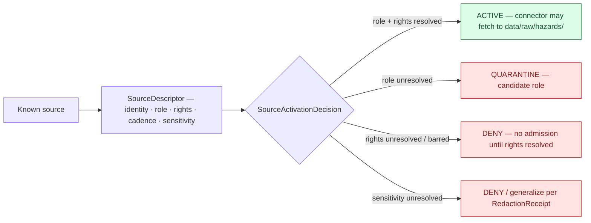

<!-- [KFM_META_BLOCK_V2]
doc_id: kfm://doc/docs/domains/hazards/sources
title: Hazards — Sources
type: standard
version: v1
status: draft
owners: TODO — Hazards domain steward + Source steward + Rights reviewer + Docs steward
created: 2026-06-05
updated: 2026-06-05
policy_label: public
related:
  - ai-build-operating-contract.md
  - docs/domains/hazards/README.md
  - docs/domains/hazards/PUBLICATION_AND_BOUNDARY.md
  - docs/domains/hazards/PRESERVATION_MATRIX.md
  - docs/domains/hazards/RELEASE_INDEX.md
  - docs/domains/hazards/MISSING_OR_PLANNED_FILES.md
  - docs/doctrine/directory-rules.md
  - docs/sources/SOURCE_DESCRIPTOR_STANDARD.md
  - data/registry/sources/hazards/
tags: [kfm, domain, hazards, sources, source-role, rights, freshness, source-descriptor, not-for-life-safety]
notes:
  # CONTRACT_VERSION = "3.0.0" (ai-build-operating-contract.md v3.0)
  # Repository not mounted in this session; all path-shaped claims are PROPOSED.
  # Every source family currently has rights NEEDS VERIFICATION; sensitive joins fail closed (Atlas 12.D).
  # Source role is the seven-class enum (Atlas 24.1.1/24.1.3), set at admission, never upgraded by promotion.
  # Hazards is not an alert authority (T4 forever); operational feeds are admitted as context only.
[/KFM_META_BLOCK_V2] -->

# 🌪️ Hazards — Sources

> The source dossier for the Hazards lane: which external feeds KFM admits, the **source role** each carries (set at admission, never upgraded), the rights and freshness posture each must satisfy, and the `SourceDescriptor` + `SourceActivationDecision` discipline that gates every one of them before a single byte reaches a public surface.


**Status:** draft · **Owners:** *TODO — Hazards domain steward + Source steward + Rights reviewer + Docs steward* · **Last updated:** 2026-06-05 · **Pins:** `CONTRACT_VERSION = "3.0.0"`

-----

## 📑 Table of contents

1. [Scope and reading guide](#1-scope-and-reading-guide)
1. [Source roles — the seven-class enum](#2-source-roles--the-seven-class-enum)
1. [Source family registry](#3-source-family-registry)
1. [Per-family detail](#4-per-family-detail)
1. [The `SourceDescriptor`](#5-the-sourcedescriptor)
1. [Admission and activation](#6-admission-and-activation)
1. [Rights and sensitivity posture](#7-rights-and-sensitivity-posture)
1. [Freshness, cadence, and stale-state](#8-freshness-cadence-and-stale-state)
1. [Cross-lane source ownership](#9-cross-lane-source-ownership)
1. [Anti-collapse at the source edge](#10-anti-collapse-at-the-source-edge)
1. [Source registry layout](#11-source-registry-layout)
1. [Open questions and verification backlog](#12-open-questions-and-verification-backlog)
1. [Related docs](#13-related-docs)

-----

## 1. Scope and reading guide

This document is the **source-side authority** for the Hazards lane. It records every external feed the lane admits, the discipline each must pass, and the boundary that governs all of them. It does not fetch, normalize, or publish anything; it constrains how the connectors, the source registry, and the admission gate must behave.

Three facts shape everything below:

1. **Source role is a first-class identity attribute**, set at admission and never upgraded by promotion. An observed reading never becomes a regulatory determination; a model never becomes an observation. *(CONFIRMED: Atlas §24.1.)*
1. **Rights are unresolved by default.** Every hazards source family currently carries `rights NEEDS VERIFICATION; sensitive joins fail closed`. No connector ships, and no source is admitted, without a resolved rights record and a `SourceActivationDecision`. *(CONFIRMED: Atlas §12.D.)*
1. **Operational feeds are admitted as context only.** NWS warnings/advisories/watches enter as historical/contextual evidence, never as live alerts. KFM-as-alert-authority is **T4 forever**. *(CONFIRMED: Atlas §12.B, §24.5.2.)*

> [!CAUTION]
> **Admitting a source is not the same as endorsing it as truth, and never the same as alerting.** An NWS warning feed may be admitted and preserved as historical context; it may never be served as a current life-safety alert. The not-for-life-safety boundary applies at the source edge, not only at publication.

> [!NOTE]
> **Repository not mounted in this session.** Source endpoints, rights terms, and registry contents are **NEEDS VERIFICATION**; descriptor fields and schema homes are **PROPOSED**. The roles, rights posture, and admission discipline are CONFIRMED doctrine; the per-source resolution is not.

[⬆ Back to top](#-table-of-contents)

-----

## 2. Source roles — the seven-class enum

Every admitted hazards source is assigned exactly one canonical source role at admission. The role is recorded in the `SourceDescriptor` and is **never edited in place** — a correction produces a new descriptor and a `CorrectionNotice`. *(CONFIRMED: Atlas §24.1.1, §24.1.3; vocabulary is ADR-class as ADR-S-04.)*

|Role            |Definition (CONFIRMED, §24.1.1)                                                |Hazards example                                                   |Never relabeled as                    |
|----------------|-------------------------------------------------------------------------------|------------------------------------------------------------------|--------------------------------------|
|`observed`      |Direct reading / first-hand evidentiary record tied to place and time          |USGS earthquake reading; FIRMS thermal detection; Storm Events row|`regulatory` or `administrative`      |
|`regulatory`    |Authoritative determination by a governing body with legal force               |NFHL flood-zone designation                                       |`observed` event or `modeled` estimate|
|`modeled`       |Derived product from inputs/assumptions; uncertainty must travel with it       |HMS smoke trajectory; drought index surface                       |an observation                        |
|`aggregate`     |Published summary/total over a unit; per-record fidelity lost                  |Drought-monitor county rollup                                     |a per-place record                    |
|`administrative`|Compiled agency record (registration/accounting), not observation or regulation|FEMA declaration roster; local EM compilation                     |an observation or regulation          |
|`candidate`     |Unverified/unreleased evidence not yet promoted                                |Quarantined feed item awaiting review                             |a verified record (no PUBLISHED edge) |
|`synthetic`     |Generated content; never the same as observed reality                          |AI-drafted summary                                                |observed reality                      |


> [!NOTE]
> The §12.D dossier column records each family’s role loosely as “authority / observation / context / model **as source role requires**” — i.e., the role is *assigned at admission, not pre-pinned*. The §3 registry below maps each family onto the canonical seven-class enum as a **PROPOSED** assignment to be fixed per source. “Context” in the dossier is a *presentation posture*, not a role: an expired warning is `observed`/`administrative` evidence presented as historical context.

[⬆ Back to top](#-table-of-contents)

-----

## 3. Source family registry

CONFIRMED source families (Atlas §12.D). Every row carries `rights NEEDS VERIFICATION; sensitive joins fail closed` until a rights record and `SourceActivationDecision` exist. Role assignments are PROPOSED mappings onto the seven-class enum, fixed per source at admission.

|Source family                                |Canonical role(s) (PROPOSED)                   |Hazards objects fed                                       |Rights                                 |Connector (PROPOSED)                 |
|---------------------------------------------|-----------------------------------------------|----------------------------------------------------------|---------------------------------------|-------------------------------------|
|**NOAA Storm Events / NCEI**                 |`observed` / `administrative`                  |`HazardEvent`, `HazardObservation`, `HeatColdEvent`       |NEEDS VERIFICATION                     |`connectors/noaa-storm-events/`      |
|**NWS API — warnings / advisories / watches**|`observed`/`administrative`, **context only**  |`WarningContext`, `AdvisoryContext`                       |NEEDS VERIFICATION                     |`connectors/nws-api/`                |
|**FEMA Disaster Declarations / OpenFEMA**    |`administrative` (+ `regulatory` where binding)|`DisasterDeclaration`                                     |NEEDS VERIFICATION                     |`connectors/fema-openfema/`          |
|**FEMA NFHL / MSC flood hazard**             |`regulatory`                                   |`FloodContext`                                            |NEEDS VERIFICATION                     |`connectors/fema-nfhl/`              |
|**USGS Earthquake Catalog**                  |`observed`                                     |`EarthquakeEvent`                                         |NEEDS VERIFICATION                     |`connectors/usgs-earthquake/`        |
|**NOAA HMS Fire and Smoke**                  |`observed` (detection) / `modeled` (trajectory)|`SmokeContext`, `WildfireDetection`                       |NEEDS VERIFICATION                     |`connectors/noaa-hms-smoke/`         |
|**NASA FIRMS active fire**                   |`observed` (detection, with caveats)           |`WildfireDetection`                                       |NEEDS VERIFICATION                     |`connectors/nasa-firms/`             |
|**USGS Water Data** (via Hydrology)          |`observed` (cross-lane)                        |`FloodContext`                                            |NEEDS VERIFICATION                     |shared with `hydrology` lane         |
|**Drought Monitor / drought indicators**     |`modeled` / `aggregate`                        |`DroughtIndicator`                                        |NEEDS VERIFICATION                     |`connectors/drought-monitor/`        |
|**Kansas / local emergency management**      |`administrative` (context)                     |`WarningContext`, `AdvisoryContext`, `DisasterDeclaration`|NEEDS VERIFICATION (access-constrained)|`connectors/state-emergency-context/`|
|**State resilience plans**                   |`administrative` / planning context            |`ResilienceSummary`                                       |NEEDS VERIFICATION                     |`connectors/state-emergency-context/`|


> [!WARNING]
> Per Directory Rules §13.5, **connectors emit to `data/raw/hazards/` or `data/quarantine/hazards/` only** — never directly to `data/processed/` or `data/published/`. A source whose role cannot be resolved at admission is admitted as `candidate` and held in quarantine; it MUST NOT advance. *(CONFIRMED: Atlas §12.C, §12.H; watcher-as-non-publisher invariant.)*

[⬆ Back to top](#-table-of-contents)

-----

## 4. Per-family detail

<details>
<summary><strong>📖 Per-family notes (click to expand)</strong></summary>

**NOAA Storm Events / NCEI.** Retrospective archive of severe-weather and related events. Role `observed`/`administrative` (the archive is a compiled record of observed events). Feeds the lane’s core historical event spine. Vintage-stamped; not a live feed.

**NWS API — warnings / advisories / watches.** Operational products. Admitted **as context only**, with `issue_time` + `expiry_time` mandatory. Past expiry, an item is historical context, never current state. This is the highest-risk family for boundary drift — see [`PUBLICATION_AND_BOUNDARY.md`](./PUBLICATION_AND_BOUNDARY.md) and [`PRESERVATION_MATRIX.md`](./PRESERVATION_MATRIX.md) §7.

**FEMA Disaster Declarations / OpenFEMA.** Administrative declarations; `regulatory` where a declaration carries binding force. Cited as administrative context, never as observed damage evidence.

**FEMA NFHL / MSC flood hazard.** Regulatory flood-zone designations. Role `regulatory`. Preserve `DFIRM_ID`, `VERSION_ID`, `EFFECTIVE_DATE` verbatim; version-pin every release. Never render as observed inundation or forecast — this is a named DENY condition (Atlas §24.1.2).

**USGS Earthquake Catalog.** Observed seismic events. Role `observed`. Magnitude type and location uncertainty travel with the object; magnitude revisions are supersession with prior retained.

**NOAA HMS Fire and Smoke.** Analyst products. Smoke polygons are `modeled`/`observed` context; fire detections are `observed`. Analyst vintage preserved. Atmosphere/Air may re-cite smoke.

**NASA FIRMS active fire.** Satellite thermal detections. Role `observed` with caveats: a detection is not a confirmed ignition and not a legal fire status. Provisional badging required.

**USGS Water Data.** Sourced via the Hydrology lane for `FloodContext`. Hydrology owns the source-side preservation; Hazards retains the citation and derivation receipt only.

**Drought Monitor / drought indicators.** Weekly modeled/aggregate indices. Role `modeled`/`aggregate`. Never join an aggregate cell to a single place — a named DENY condition.

**Kansas / local emergency management.** Administrative context; many sources carry access constraints. Rights resolution is especially likely to be the blocking gate here.

**State resilience plans.** Administrative/planning documents feeding `ResilienceSummary`. Reference/context, not observation.

</details>

[⬆ Back to top](#-table-of-contents)

-----

## 5. The `SourceDescriptor`

Every admitted hazards source has a `SourceDescriptor` recording identity, role, rights posture, update cadence, authority scope, and verification obligations. *(CONFIRMED doctrine: Atlas KFM-P1-PROG-0007; PROPOSED field realization.)* The canonical schema home defaults to `schemas/contracts/v1/source/source-descriptor.json` per Directory Rules §7.4 and ADR-0001, unless an accepted ADR relocates it.

PROPOSED descriptor surface (illustrative, not authoritative — Atlas §24.1.3):

|Field                       |Type / vocabulary                                                                                       |Required?                                              |Notes                                                                                              |
|----------------------------|--------------------------------------------------------------------------------------------------------|-------------------------------------------------------|---------------------------------------------------------------------------------------------------|
|`source_role`               |enum: `observed` | `regulatory` | `modeled` | `aggregate` | `administrative` | `candidate` | `synthetic`|MUST                                                   |Set at admission. Never edited in place; corrections produce a new descriptor + `CorrectionNotice`.|
|`role_authority`            |string (issuing body / model identity / steward)                                                        |MUST when role ∈ {`regulatory`, `modeled`, `aggregate`}|Disambiguates the authoring authority for downstream cite text.                                    |
|`role_aggregation_unit`     |geometry-scope token (county, HUC, tract, year, …)                                                      |MUST when `source_role = aggregate`                    |Prevents geometry-scope drift on join.                                                             |
|`role_model_run_ref`        |`EvidenceRef` → `ModelRunReceipt`                                                                       |MUST when `source_role = modeled`                      |Pins inputs, parameters, and version that produced the value.                                      |
|`role_synthetic_basis`      |structured: `{ method, inputs, reality_boundary_note_ref }`                                             |MUST when `source_role = synthetic`                    |Records what is and is not real in the carrier.                                                    |
|`role_candidate_disposition`|enum: `pending` | `merged` | `rejected` | `quarantined`                                                 |MUST when `source_role = candidate`                    |Tracks promotion state; PUBLISHED edge forbidden until merged.                                     |

Beyond the role fields, a hazards `SourceDescriptor` SHOULD also record: source identity and citation policy; rights/access class; update cadence; sensitivity notes; and verification status. Validate the descriptor **before fetch, before transformation, and before publication**, so source authority never collapses into generic data availability. *(CONFIRMED doctrine: Atlas KFM-P1-PROG-0007.)*

> [!NOTE]
> Descriptor field names and the schema home are **PROPOSED / NEEDS VERIFICATION**; the *requirement* that role is fixed at admission and the *role enum* are CONFIRMED. The repo-wide source-descriptor standard lives at `docs/sources/SOURCE_DESCRIPTOR_STANDARD.md` (PROPOSED).

[⬆ Back to top](#-table-of-contents)

-----

## 6. Admission and activation

A source moves from “known” to “usable” through two governed steps, both fail-closed.



- **`SourceDescriptor`** (§5) records the source’s identity, role, rights, cadence, and sensitivity. *(CONFIRMED doctrine.)*
- **`SourceActivationDecision`** is the gate deciding source use, restriction, quarantine, or denial. **Connectors stay inactive until the activation decision, fixtures, validators, and policy gates exist.** *(CONFIRMED doctrine: SourceActivationDecision is the admission gate; Directory Rules §6.5.)*

The admission gate fails closed: unknown role → quarantine as `candidate`; unresolved or barred rights → DENY; unresolved sensitivity → DENY or generalize with a `RedactionReceipt`. Nothing is admitted “provisionally usable.”

[⬆ Back to top](#-table-of-contents)

-----

## 7. Rights and sensitivity posture

> [!IMPORTANT]
> **Unclear rights, unresolved source role, missing evidence, unresolved sensitivity, or absent release state blocks public promotion.** *(CONFIRMED doctrine: Atlas §12.I.)* At the source edge, the equivalent rule is: no admission without a resolved rights record and `SourceActivationDecision`.

|Condition                                                                         |Posture                                                               |Required artifact                                   |
|----------------------------------------------------------------------------------|----------------------------------------------------------------------|----------------------------------------------------|
|Rights unresolved or terms unclear                                                |**DENY** admission/publication until resolved                         |Rights record in source registry                    |
|Rights barred (no-redistribution)                                                 |No public derivative; admit for internal evidence only if terms permit|Rights record + access class                        |
|Sensitive join (hazard × infrastructure / archaeology / parcel → precise location)|**DENY** public detail or generalize                                  |`RedactionReceipt` + steward review                 |
|Critical-infrastructure detail implied                                            |**T4** default; **T1** generalized only after steward review          |Steward review + `RedactionReceipt`                 |
|KFM framed as alert authority                                                     |**T4 forever**; no transform path                                     |Policy boundary; deny at runtime                    |
|Source role unresolved                                                            |QUARANTINE as `candidate`                                             |`SourceDescriptor` with `role_candidate_disposition`|

Tier labels use the canonical scheme (Atlas §24.5.1: T0 Open · T1 Generalized · T2 Reviewer · T3 Restricted · T4 Denied). The full per-family sensitivity treatment lives in [`PRESERVATION_MATRIX.md`](./PRESERVATION_MATRIX.md) §9 and [`PUBLICATION_AND_BOUNDARY.md`](./PUBLICATION_AND_BOUNDARY.md) §10.

[⬆ Back to top](#-table-of-contents)

-----

## 8. Freshness, cadence, and stale-state

Hazards source feeds are change-prone and time-bound. Each `SourceDescriptor` records a cadence; when the cadence elapses without a new admission, dependent claims earn a stale-source badge. *(CONFIRMED: Atlas §24.8.1 “Source freshness expired”.)* Watchers detect drift and emit candidate intake records with a `WORK_CANDIDATE` state — they **never** publish or auto-promote (watcher-as-non-publisher; Directory Rules §13.5).

|Source family                  |Suggested cadence (PROPOSED)|Freshness rule                             |Notes                |
|-------------------------------|----------------------------|-------------------------------------------|---------------------|
|NOAA Storm Events / NCEI       |monthly                     |per-archive vintage                        |retrospective        |
|NWS API (warnings / advisories)|hourly (context only)       |**issue/expiry strict — expired ≠ current**|highest boundary risk|
|FEMA Disaster Declarations     |weekly                      |rolling                                    |administrative       |
|FEMA NFHL / MSC                |quarterly                   |per-vintage; version-pin                   |regulatory           |
|USGS Earthquakes               |hourly / daily              |per-event                                  |observed             |
|USGS Water (via Hydrology)     |per source                  |per-record                                 |cross-lane           |
|NASA FIRMS / NOAA HMS          |per granule cadence         |provisional badging required               |detection / model    |
|Drought Monitors               |weekly                      |per-week                                   |modeled / aggregate  |
|Kansas / local EM              |per source                  |per-source                                 |rights-constrained   |


> [!WARNING]
> **Expired operational context MUST NOT appear as current warning state.** This is a release gate (`temporal_gate`), not a UI affordance. *(CONFIRMED: Atlas §12.I.)*

[⬆ Back to top](#-table-of-contents)

-----

## 9. Cross-lane source ownership

Hazards consumes from several lanes but **owns none of their canonical sources**. When citing them, Hazards preserves the citation and derivation receipt, not the upstream object’s authoritative record. *(CONFIRMED: Atlas §12.F, §24.14.)*

|Source / object                                |Owning lane                                  |Hazards’ use                      |Boundary rule                                                         |
|-----------------------------------------------|---------------------------------------------|----------------------------------|----------------------------------------------------------------------|
|NFHL zones, gauge / flow observations          |**Hydrology** `[DOM-HYD]`                    |`FloodContext`, exposure overlays |Role separation: NFHL `regulatory`, gauge `observed`; version-pin NFHL|
|Smoke observations, weather, AOD, fire-weather |**Atmosphere/Air** `[DOM-AIR]`               |`SmokeContext`, `HeatColdEvent`   |`modeled` ≠ `observed`; AOD ≠ PM2.5                                   |
|Settlement / infrastructure identity, lifelines|**Settlements/Infrastructure** `[DOM-SETTLE]`|`ExposureSummary`, `ImpactArea`   |Default-deny on critical-infrastructure detail (T4)                   |
|Road / rail / crossing identity                |**Roads/Rail** `[DOM-ROADS]`                 |closure / detour / bridge exposure|Public-safe representation only                                       |
|Faults, subsidence, earthquake context         |**Geology** `[DOM-GEOL]`                     |hazard input                      |Geology preserves source-side; Hazards re-cites                       |


> [!IMPORTANT]
> A cross-lane source is admitted under the **owning lane’s** source-role rules; Hazards cannot relabel or upgrade it. Every cross-lane relation must preserve ownership, source role, sensitivity, and `EvidenceBundle` support.

[⬆ Back to top](#-table-of-contents)

-----

## 10. Anti-collapse at the source edge

Source-role collapse is easiest to commit at admission, when artifacts about the same physical phenomenon arrive together. The descriptor’s `source_role` field is the structural defense. *(CONFIRMED DENY conditions: Atlas §24.1.2.)*

|Collapse at the source edge                       |Denied because                      |Guardrail                                            |
|--------------------------------------------------|------------------------------------|-----------------------------------------------------|
|NFHL zone admitted as an observed flood event     |`regulatory` ≠ `observed`           |role-preserving descriptor; separate lanes; UI banner|
|HMS trajectory admitted as observed smoke         |`modeled` ≠ `observed`              |`role_model_run_ref`; uncertainty surface            |
|FIRMS hot pixel admitted as confirmed fire        |`observed` detection ≠ confirmation |detection caveat; provisional badge                  |
|Drought-monitor cell admitted as per-place truth  |`aggregate` loses per-place fidelity|`role_aggregation_unit`; deny per-place join         |
|FEMA declaration admitted as observed damage      |`administrative` ≠ `observed`       |role badge; never an observation in timelines        |
|Any source with unresolved role admitted as usable|role must be fixed at admission     |quarantine as `candidate`; no PUBLISHED edge         |


> [!WARNING]
> **Promotion never upgrades a source role.** A `modeled` source does not become `observed`, an `aggregate` does not become per-place, and a `candidate` does not become verified by being promoted. Those are separate governed transitions with their own evidence and review. *(CONFIRMED: Atlas §24.1.1 reading note; §24.9.2 “Promotion that upgrades a source role”.)*

[⬆ Back to top](#-table-of-contents)

-----

## 11. Source registry layout

Hazards source descriptors and rights records live in the source registry, append-only, per Directory Rules §9.1.

```text
data/registry/sources/hazards/        # hazards source descriptors      [PROPOSED]
data/registry/source_descriptors/     # shared descriptor home (alt)    [PROPOSED]
data/registry/rights/                  # rights records (shared root)    [PROPOSED]
data/registry/sensitivity/             # sensitivity records (shared)    [PROPOSED]
schemas/contracts/v1/source/source-descriptor.json   # descriptor schema (ADR-0001) [PROPOSED]
connectors/<source>/                   # source-specific fetch/admission [PROPOSED]
policy/sources/                        # source-admission policy (shared) [PROPOSED]
```

> [!NOTE]
> Whether per-source rights records live inside the descriptor or in a separate `data/registry/rights/` register is a placement decision (tracked as ADR-HAZ-05 in [`MISSING_OR_PLANNED_FILES.md`](./MISSING_OR_PLANNED_FILES.md) §7). The registry is **append-only** — corrections supersede via a new descriptor with a `superseded_by` link, never an in-place edit. *(CONFIRMED: Atlas §24.8.2 SourceDescriptor supersession.)*

[⬆ Back to top](#-table-of-contents)

-----

## 12. Open questions and verification backlog

|ID           |Question / item                                                                                                                       |Status                |Resolution path                                      |
|-------------|--------------------------------------------------------------------------------------------------------------------------------------|----------------------|-----------------------------------------------------|
|OQ-HAZ-SRC-01|Resolve rights and current terms for every source family (NWS, NCEI, OpenFEMA, NFHL, USGS EQ/Water, FIRMS, HMS, USDM, KS-EM)          |**NEEDS VERIFICATION**|Rights record + `SourceActivationDecision` per source|
|OQ-HAZ-SRC-02|Confirm `SourceDescriptor` schema home and field names in the mounted repo                                                            |**NEEDS VERIFICATION**|Inspect `schemas/contracts/v1/source/`               |
|OQ-HAZ-SRC-03|Source-role enum vocabulary and evolution rule                                                                                        |**OPEN (ADR-S-04)**   |ADR                                                  |
|OQ-HAZ-SRC-04|Connector cadence and quarantine-recovery policy per family                                                                           |**OPEN (ADR-S-12)**   |ADR                                                  |
|OQ-HAZ-SRC-05|Per-source rights record placement: in descriptor vs. separate rights register                                                        |**OPEN (ADR-HAZ-05)** |ADR / Directory Rules reviewers                      |
|OQ-HAZ-SRC-06|RAW partitioning convention: by source family vs. retrieval date first                                                                |**OPEN (ADR-HAZ-06)** |ADR                                                  |
|OQ-HAZ-SRC-07|Pin canonical role for each family (the §3 column is PROPOSED until fixed at admission)                                               |**PROPOSED**          |Per-source admission decision                        |
|OQ-HAZ-SRC-08|Confirm which SDI/clearinghouse constraints (participation limits, cost recovery, sharing barriers) become mandatory descriptor fields|**NEEDS VERIFICATION**|ADR / source-descriptor standard                     |
|OQ-HAZ-SRC-09|Verify watcher-as-non-publisher enforced for NWS / FIRMS / HMS pollers                                                                |**NEEDS VERIFICATION**|Watcher contract + receipts                          |


> These items remain `NEEDS VERIFICATION` / `OPEN` before this doc promotes from `draft` to `published`. Reconcile against `docs/registers/VERIFICATION_BACKLOG.md` on every review cycle.

[⬆ Back to top](#-table-of-contents)

-----

## 13. Related docs

> All targets below are **PROPOSED** in this session; reconcile against the live repo before relying on them.

- `ai-build-operating-contract.md` — Canonical operating contract (`CONTRACT_VERSION = "3.0.0"`).
- [`docs/domains/hazards/README.md`](./README.md) — Hazards lane landing page; source-family summary in §5.
- [`docs/domains/hazards/PUBLICATION_AND_BOUNDARY.md`](./PUBLICATION_AND_BOUNDARY.md) — publication path + not-for-life-safety boundary.
- [`docs/domains/hazards/PRESERVATION_MATRIX.md`](./PRESERVATION_MATRIX.md) — preservation per lifecycle stage and tier.
- [`docs/domains/hazards/RELEASE_INDEX.md`](./RELEASE_INDEX.md) — release registry; source drift/watchers in §15.
- [`docs/domains/hazards/MISSING_OR_PLANNED_FILES.md`](./MISSING_OR_PLANNED_FILES.md) — lane planning inventory; connector backlog in §5.9/§6.
- `docs/doctrine/directory-rules.md` — Directory Rules (§6.5 policy, §7.3 connectors, §7.4 schema home, §9.1 registry, §13.5 anti-patterns).
- `docs/sources/SOURCE_DESCRIPTOR_STANDARD.md` — repo-wide source-descriptor standard.
- `data/registry/sources/hazards/` — Hazards source registry.
- Atlas v1.1 §12.C/D (Hazards ubiquitous language + source families), §24.1 (source-role anti-collapse + descriptor fields), §24.8 (stale-state + supersession); Atlas KFM-P1-PROG-0007 (source descriptors and registry).
- KFM Encyclopedia §7.10.B — Hazards source families.

-----

<sub>
<strong>Last reviewed:</strong> 2026-06-05 ·
<strong>Doc version:</strong> v1 (initial source dossier) ·
<strong>Pins:</strong> CONTRACT_VERSION = "3.0.0" ·
<strong>Lineage:</strong> KFM Domains Culmination Atlas v1.1 §12.C/D, §24.1, §24.8; Atlas KFM-P1-PROG-0007; KFM Encyclopedia §7.10.B; Directory Rules §6.5, §7.3, §7.4, §9.1, §13.5 ·
<a href="#-hazards--sources">⬆ Back to top</a>
</sub>