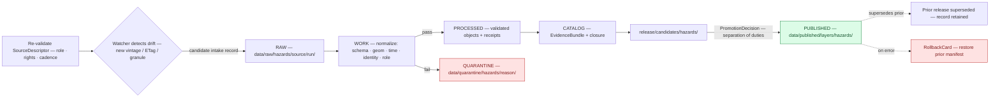

<!-- [KFM_META_BLOCK_V2]
doc_id: kfm://doc/docs/runbooks/hazards/source_refresh_runbook
title: Hazards — Source Refresh Runbook
type: standard
version: v1
status: draft
owners: TODO — Hazards domain steward + Source steward + Release manager + On-call operator
created: 2026-06-05
updated: 2026-06-05
policy_label: public
related:
  - ai-build-operating-contract.md
  - docs/domains/hazards/SOURCES.md
  - docs/domains/hazards/README.md
  - docs/domains/hazards/PUBLICATION_AND_BOUNDARY.md
  - docs/domains/hazards/RELEASE_INDEX.md
  - docs/doctrine/directory-rules.md
  - data/registry/sources/hazards/
tags: [kfm, hazards, runbook, source-refresh, operations, freshness, watcher, not-for-life-safety]
notes:
  # CONTRACT_VERSION = "3.0.0" (ai-build-operating-contract.md v3.0)
  # PLACEMENT CORRECTION: task named docs/domains/hazards/SOURCE_REFRESH_RUNBOOK.md, but runbooks belong
  #   under docs/runbooks/ per Directory Rules 6.1.b. Authored here for docs/runbooks/hazards/ (Pattern A,
  #   matching the fauna precedent). See the placement callout in section 0.
  # Subfolder vs. flat convention is OPEN (Directory Rules 18 OPEN-DR-02); Pattern A chosen per the rule's guidance.
  # Repository not mounted; commands, paths, and CI targets are PROPOSED until verified.
  # Hazards is not an alert authority (T4 forever); operational feeds refresh as context only.
[/KFM_META_BLOCK_V2] -->

# 🌪️ Hazards — Source Refresh Runbook

> Operational procedure for re-admitting and refreshing a Hazards source through the governed lifecycle — from drift detection, through descriptor re-validation, normalization, catalog closure, and a governed release decision, to correction or rollback — **without** any step short-cutting the trust membrane or letting an operational feed surface as a live alert.


**Status:** draft · **Owners:** _TODO — Hazards domain steward + Source steward + Release manager + On-call operator_ · **Last updated:** 2026-06-05 · **Pins:** `CONTRACT_VERSION = "3.0.0"`

---

## 0. Placement note

> [!IMPORTANT]
> **This runbook's canonical home is `docs/runbooks/hazards/SOURCE_REFRESH_RUNBOOK.md`, not `docs/domains/hazards/`.** Per Directory Rules §6.1.b, `docs/runbooks/` is the canonical home for operational procedures (source refresh, rollback drills, incident response); `docs/domains/hazards/` holds domain doctrine and orientation, not operational procedures. This file is authored for the runbooks home using **Pattern A** (domain-segment subfolder, matching the authored fauna runbook precedent). The subfolder-vs-flat choice is OPEN (§18 OPEN-DR-02) and awaits an ADR; Pattern A is adopted per the rule's guidance for domains that already have a segmented runbook in flight. If the lane README links this runbook, point it at the runbooks path.

---

## 📑 Table of contents

1. [Scope and when to use this runbook](#1-scope-and-when-to-use-this-runbook)
2. [Preconditions and the non-negotiable boundary](#2-preconditions-and-the-non-negotiable-boundary)
3. [Refresh overview](#3-refresh-overview)
4. [Step-by-step procedure](#4-step-by-step-procedure)
5. [Per-source refresh profiles](#5-per-source-refresh-profiles)
6. [Quarantine and remediation](#6-quarantine-and-remediation)
7. [Stale-state handling](#7-stale-state-handling)
8. [Correction and rollback](#8-correction-and-rollback)
9. [Verification checklist](#9-verification-checklist)
10. [Failure modes and DENY conditions](#10-failure-modes-and-deny-conditions)
11. [Open questions and verification backlog](#11-open-questions-and-verification-backlog)
12. [Related docs](#12-related-docs)

---

## 1. Scope and when to use this runbook

This runbook covers **refreshing an already-admitted Hazards source** — pulling a new vintage of NOAA Storm Events, a new NFHL revision, the next FIRMS granule, an updated drought week, and so on — through the governed lifecycle so the refreshed data becomes a public-safe release without bypassing any gate.

Use this runbook when:

- a watcher reports source drift (new vintage, changed ETag/Last-Modified, new granule);
- a `SourceDescriptor` cadence has elapsed and dependent claims are going stale;
- a scheduled refresh window for a hazards source is due;
- a correction upstream (e.g., a revised USGS magnitude, a superseded NFHL version) requires re-admission.

Do **not** use this runbook for *first* admission of a new source — that is the activation flow in [`SOURCES.md`](../../domains/hazards/SOURCES.md) §6. This runbook assumes the source already has a descriptor and a prior `SourceActivationDecision`.

> [!NOTE]
> **Repository not mounted in this session.** Every command, path, and CI target below is **PROPOSED** and illustrative. The procedure and gate sequence are CONFIRMED doctrine; the exact tool names, flags, and routes are not. Replace `<placeholders>` with real values once the repo is mounted.

[⬆ Back to top](#-table-of-contents)

---

## 2. Preconditions and the non-negotiable boundary

> [!CAUTION]
> **A refresh never turns Hazards into an alert system.** Refreshing the NWS feed updates *historical/contextual* records; it never produces a live warning. KFM-as-alert-authority is **T4 forever** (Atlas §24.5.2). An operational item whose `expiry_time` has passed becomes historical context, never current state. If a refresh would surface an unexpired warning as a live alert, **stop** — that is out of scope and denied.

Before starting, confirm:

| Precondition | Why | Where |
|---|---|---|
| Source already has a `SourceDescriptor` with a resolved role and rights | Refresh is re-admission, not first admission | `data/registry/sources/hazards/` |
| Rights are still current (terms can change between refreshes) | Unresolved/expired rights → DENY | rights record |
| The prior release has a named rollback target | Refresh must be reversible | `release/manifests/`, `release/rollback_cards/` |
| You are **not** the sole release authority if materiality applies | Separation of duties (Atlas §24.7) | release roles |
| A no-network fixture exists for dry-run | Validate before any live fetch | `fixtures/domains/hazards/` |

[⬆ Back to top](#-table-of-contents)

---

## 3. Refresh overview

A refresh walks the same lifecycle invariant as any admission — `RAW → WORK / QUARANTINE → PROCESSED → CATALOG / TRIPLET → PUBLISHED` — with promotion as a governed state transition, not a file move. _(CONFIRMED: Directory Rules §9.1; Atlas §24.6.)_



The watcher only **proposes** (emits candidate intake records + receipts into RAW/WORK); it never publishes. Promotion is a separate, governed decision. _(CONFIRMED: watcher-as-non-publisher, Directory Rules §13.5.)_

[⬆ Back to top](#-table-of-contents)

---

## 4. Step-by-step procedure

> [!NOTE]
> Commands are **PROPOSED / illustrative**. Tool names (`kfm`, `make` targets) and flags resolve against the mounted repo. Run the dry-run path first; never live-fetch before a fixture dry-run passes.

### Step 1 — Re-validate the descriptor (before fetch)

Confirm the source's role, rights, and cadence are still valid. A descriptor is validated **before fetch, before transformation, and before publication** so source authority never collapses into generic availability. _(CONFIRMED doctrine: Atlas KFM-P1-PROG-0007.)_

```text
# PROPOSED
kfm sources validate --domain hazards --source <source_id>
# checks: source_role set; rights record current; cadence; sensitivity notes
```

If rights have changed or lapsed → **STOP**, route to the rights reviewer, DENY refresh until resolved.

### Step 2 — Dry-run against a fixture (no network)

```text
# PROPOSED
make hazards-refresh-dryrun SOURCE=<source_id>
# runs the pipeline against fixtures/domains/hazards/ with no live fetch
```

The dry-run must produce the expected finite outcomes (ANSWER for the golden fixture; DENY/ABSTAIN/QUARANTINE for the negatives) before any live fetch.

### Step 3 — Fetch to RAW (connector, not publisher)

The connector fetches to `data/raw/hazards/<source_id>/<run_id>/` with retrieval metadata, checksum, and an ingest receipt. Connectors emit to RAW or QUARANTINE only. _(CONFIRMED: Directory Rules §7.3, §13.5.)_

```text
# PROPOSED
kfm connectors run --connector <connector> --to raw
# emits: data/raw/hazards/<source_id>/<run_id>/ + data/receipts/ingest/
```

### Step 4 — Normalize in WORK; quarantine failures

Normalize schema, geometry, time, identity, evidence, rights, and policy. Hold any failure in QUARANTINE with a reason. For operational items, `issue_time`/`expiry_time` are mandatory; missing them → QUARANTINE.

```text
# PROPOSED
make hazards-normalize SOURCE=<source_id> RUN=<run_id>
# pass → data/processed/hazards/ ; fail → data/quarantine/hazards/<reason>/
```

### Step 5 — Close the catalog

Emit validated objects, receipts, `EvidenceBundle`, and catalog records; confirm `EvidenceRef` resolves and digests close.

```text
# PROPOSED
make hazards-catalog SOURCE=<source_id> RUN=<run_id>
# emits: data/catalog/domain/hazards/ + data/proofs/evidence_bundle/
```

### Step 6 — Build the release candidate

Assemble the candidate dossier under `release/candidates/hazards/<candidate_id>/` (proposed manifest, evidence bundle, validation report, preliminary policy decision, provenance, review notes, closure checklist). See [`RELEASE_INDEX.md`](../../domains/hazards/RELEASE_INDEX.md) §8.

### Step 7 — Promote (governed decision, separation of duties)

A `PromotionDecision` (not a watcher, cron, validator pass, or steward approval *alone*) promotes the candidate. Release authority is distinct from the author when materiality applies. The new release **supersedes** the prior one; the prior record is retained.

```text
# PROPOSED — release authority, not the author
kfm release promote --candidate <candidate_id> --rollback-target <prior_release_id>
# emits: release/manifests/ + release/promotion_decisions/ + supersession link
```

### Step 8 — Verify the public surface

Confirm the refreshed layer serves through `apps/governed-api/`, carries the `not_for_life_safety` posture and (for NFHL) the "verify with authority" label, shows correct freshness/trust badges, and that the Evidence Drawer resolves. Run the post-release checks in [§9](#9-verification-checklist).

[⬆ Back to top](#-table-of-contents)

---

## 5. Per-source refresh profiles

Cadence and freshness are PROPOSED; confirm against each `SourceDescriptor`. Roles use the canonical seven-class enum (see [`SOURCES.md`](../../domains/hazards/SOURCES.md) §2).

| Source family | Cadence (PROPOSED) | Refresh trigger | Role (§24.1.1) | Refresh caveat |
|---|---|---|---|---|
| NOAA Storm Events / NCEI | monthly | new archive vintage | `observed` / `administrative` | retrospective; supersede prior vintage |
| NWS API (warnings / advisories) | hourly (context only) | new issuance / expiry pass | `observed`/`administrative` as context | **expired ≠ current**; never a live alert |
| FEMA Disaster Declarations | weekly | new/amended declaration | `administrative` | amendments are supersession |
| FEMA NFHL / MSC | quarterly | new map revision | `regulatory` | version-pin; preserve `DFIRM_ID`/`VERSION_ID`/`EFFECTIVE_DATE`; prior version stays queryable |
| USGS Earthquakes | hourly / daily | new/revised event | `observed` | magnitude revision = supersession with prior retained |
| NASA FIRMS / NOAA HMS | per granule | new granule | `observed` / `modeled` | provisional badge; detection ≠ confirmation |
| Drought Monitor | weekly | new week | `modeled` / `aggregate` | append to time-series; never per-place join |
| Kansas / local EM | per source | per source | `administrative` | rights-constrained; re-check terms each refresh |

> [!WARNING]
> **NFHL and any versioned regulatory layer never overwrite in place.** A refresh adds a new version with its own digest sidecar; the prior version remains queryable for time-bound claims. In-place overwrite corrupts CDN/HTTP-Range caches and breaks time-aware citations. _(CONFIRMED: Atlas §24.8.2; PMTiles versioned-filename discipline.)_

[⬆ Back to top](#-table-of-contents)

---

## 6. Quarantine and remediation

A refresh item lands in `data/quarantine/hazards/<reason>/` when it fails a gate. Quarantine is a holding state with a recorded reason — never a silent drop, never a silent promote.

| Quarantine reason | Remediation |
|---|---|
| Unresolved source role | Re-classify against the seven-class enum; fix the descriptor; re-admit |
| Missing `issue_time` / `expiry_time` (operational) | Reject the item or source the missing temporal fields; do not synthesize |
| Rights unclear / changed | Route to rights reviewer; DENY until resolved |
| Sensitivity unresolved (sensitive join) | Generalize per `RedactionReceipt` or DENY |
| Schema drift | Migrate, re-validate; open a schema-drift note if the upstream changed shape |
| Geometry invalid | Repair or reject; do not publish invalid geometry |

After remediation, the item re-enters WORK; it does not jump to PROCESSED or PUBLISHED.

[⬆ Back to top](#-table-of-contents)

---

## 7. Stale-state handling

When a `SourceDescriptor` cadence elapses without a successful refresh, dependent claims do not silently disappear — they earn a visible stale marker. _(CONFIRMED: Atlas §24.8.1.)_

| Trigger | Required action | UI signal |
|---|---|---|
| Source freshness expired | Re-admit (this runbook) or supersede; otherwise mark dependent claims stale | Stale-source badge in Evidence Drawer |
| Refresh repeatedly fails | Mark stale; do not refresh silently; escalate to source steward | `released · stale` trust state |
| Upstream withdrew the source | Withdraw dependent releases via `WithdrawalNotice`; retain history | Withdrawal notice; layer hidden |

> [!IMPORTANT]
> **A stale claim stays visible with its staleness marked; it is not deleted.** Stale (evidence aged) is distinct from wrong (substance incorrect). A stale hazards layer keeps serving with a stale badge until re-admitted or superseded. _(CONFIRMED: Atlas §24.8.)_

[⬆ Back to top](#-table-of-contents)

---

## 8. Correction and rollback

If a refresh introduces an error, or new evidence supersedes a just-released refresh:

- **Correctable error** → issue a `CorrectionNotice`, build a corrected release, identify and invalidate downstream derivatives. The prior `EvidenceBundle` is retained for audit.
- **Rollback is safer** → issue a `RollbackCard` referencing the prior `ReleaseManifest` by digest, repoint the alias, invalidate caches (PMTiles CDN, drawer payload cache, Focus Mode cache, graph projection), and record the revert receipt under `data/rollback/hazards/<release_id>/`.
- **Withdraw entirely** → issue a `WithdrawalNotice`; hide the layer; retain the record.

```text
# PROPOSED rollback
kfm release rollback --to <prior_release_id> --reason "<short reason>"
# emits: release/rollback_cards/ + data/rollback/hazards/<release_id>/ + cache invalidation record
```

A complete rollback drill should be rehearsed before the first hazards release and re-checked when the rollback path changes. See [`RELEASE_INDEX.md`](../../domains/hazards/RELEASE_INDEX.md) §14.

[⬆ Back to top](#-table-of-contents)

---

## 9. Verification checklist

Run before declaring the refresh complete. Each is PROPOSED until wired into CI.

- [ ] `SourceDescriptor` re-validated; role unchanged or re-classified explicitly; rights current
- [ ] Dry-run against fixtures passed (golden ANSWER; negatives DENY/ABSTAIN/QUARANTINE)
- [ ] Connector wrote only to `data/raw/hazards/` (no direct processed/published write)
- [ ] Operational items carry `issue_time`/`expiry_time`; none surface as current past expiry
- [ ] `EvidenceBundle` resolves; `EvidenceRef` chain has no phantoms; digests close
- [ ] `PolicyDecision` ≠ DENY; rights, sensitivity, life-safety, release-state gates evaluated
- [ ] Source role preserved end-to-end (no `modeled→observed`, `regulatory→observed`, `aggregate→per-place` collapse)
- [ ] New release supersedes prior; prior record retained; rollback target named
- [ ] Public surface serves via `apps/governed-api/`; `not_for_life_safety` posture present; freshness/trust badges correct; Evidence Drawer resolves
- [ ] Versioned regulatory layers (NFHL) added as new version, not overwritten
- [ ] `RunReceipt` emitted for each stage; release receipt recorded
- [ ] Verification backlog / source registry reconciled

[⬆ Back to top](#-table-of-contents)

---

## 10. Failure modes and DENY conditions

| Failure mode | Outcome | Doctrine |
|---|---|---|
| Refresh surfaces an unexpired warning as a live alert | **DENY** — out of scope; T4 forever | Atlas §24.5.2, §12.B |
| Expired operational item served as current state | **DENY** at `temporal_gate` | Atlas §12.I |
| NFHL refresh rendered as observed inundation | **DENY** — regulatory ≠ observed | Atlas §24.1.2 |
| Connector writes to `data/processed/` or `data/published/` | **DENY** — connectors emit to raw/quarantine only | Directory Rules §13.5 |
| Watcher auto-promotes without a `PromotionDecision` | **DENY** — watcher-as-non-publisher | Directory Rules §13.5 |
| In-place overwrite of a versioned layer | **DENY** — version, don't overwrite | Atlas §24.8.2 |
| Release without `ReleaseManifest` or rollback target | **DENY** — not auditable / not reversible | Atlas §24.6.1 |
| Rights changed and unresolved at refresh | **DENY** until rights resolved | Atlas §12.I |
| Source role unresolved on refreshed item | **QUARANTINE** as `candidate` | Atlas §12.C |

[⬆ Back to top](#-table-of-contents)

---

## 11. Open questions and verification backlog

| ID | Question / item | Status | Resolution path |
|---|---|---|---|
| OQ-HAZ-RRB-01 | Runbook subfolder convention: Pattern A (`docs/runbooks/hazards/`) vs. Pattern B (flat prefix) | **OPEN (OPEN-DR-02)** | ADR |
| OQ-HAZ-RRB-02 | Exact connector/pipeline tool names and `make`/CLI targets | **NEEDS VERIFICATION** | Inspect `tools/`, `pipelines/`, CI |
| OQ-HAZ-RRB-03 | Connector cadence and quarantine-recovery policy per family | **OPEN (ADR-S-12)** | ADR |
| OQ-HAZ-RRB-04 | RAW partitioning convention (source family vs. retrieval date first) — affects watcher + rollback scope | **OPEN (ADR-HAZ-06)** | ADR |
| OQ-HAZ-RRB-05 | Rollback propagation scope through tiles, drawer cache, Focus Mode cache, graph | **OPEN (`KFM-IDX-REL-004`)** | drill spec + receipts |
| OQ-HAZ-RRB-06 | Whether a dedicated no-fetch dry-run target exists for each source | **NEEDS VERIFICATION** | Inspect fixtures + CI |
| OQ-HAZ-RRB-07 | Source rights/terms currency per family (re-checked each refresh) | **NEEDS VERIFICATION** | Rights record + dated probe receipts |

> These items remain `NEEDS VERIFICATION` / `OPEN` before this runbook promotes from `draft` to `published`. Reconcile against `docs/registers/VERIFICATION_BACKLOG.md`.

[⬆ Back to top](#-table-of-contents)

---

## 12. Related docs

> All targets below are **PROPOSED** in this session; reconcile against the live repo before relying on them.

- `ai-build-operating-contract.md` — Canonical operating contract (`CONTRACT_VERSION = "3.0.0"`).
- [`docs/domains/hazards/SOURCES.md`](../../domains/hazards/SOURCES.md) — Source dossier; roles, descriptor fields, admission/activation.
- [`docs/domains/hazards/README.md`](../../domains/hazards/README.md) — Hazards lane landing page.
- [`docs/domains/hazards/PUBLICATION_AND_BOUNDARY.md`](../../domains/hazards/PUBLICATION_AND_BOUNDARY.md) — publication path + not-for-life-safety boundary.
- [`docs/domains/hazards/RELEASE_INDEX.md`](../../domains/hazards/RELEASE_INDEX.md) — release registry; lifecycle gates; rollback.
- `docs/doctrine/directory-rules.md` — Directory Rules (§6.1.b runbooks home, §7.3 connectors, §9.1 lifecycle, §13.5 anti-patterns).
- `docs/runbooks/` — Runbook home; sibling: `docs/runbooks/hazards/NOT_FOR_LIFE_SAFETY_AUDIT_RUNBOOK.md` (PROPOSED).
- `data/registry/sources/hazards/` — Hazards source registry.
- Atlas v1.1 §12 (Hazards), §24.1 (source-role), §24.5.2 (alert-authority T4 forever), §24.6.1 (lifecycle gates), §24.8 (stale/supersession); Atlas KFM-P1-PROG-0007 (source descriptors).
- KFM Encyclopedia §7.10 — Hazards mission, boundary, sources.

---

<sub>
<strong>Last reviewed:</strong> 2026-06-05 ·
<strong>Doc version:</strong> v1 (initial source-refresh runbook) ·
<strong>Pins:</strong> CONTRACT_VERSION = "3.0.0" ·
<strong>Canonical home:</strong> docs/runbooks/hazards/SOURCE_REFRESH_RUNBOOK.md (Pattern A; OPEN-DR-02) ·
<strong>Lineage:</strong> Directory Rules §6.1.b, §7.3, §9.1, §13.5; KFM Domains Culmination Atlas v1.1 §12, §24.1, §24.5.2, §24.6.1, §24.8; KFM-P1-PROG-0007 ·
<a href="#-hazards--source-refresh-runbook">⬆ Back to top</a>
</sub>
