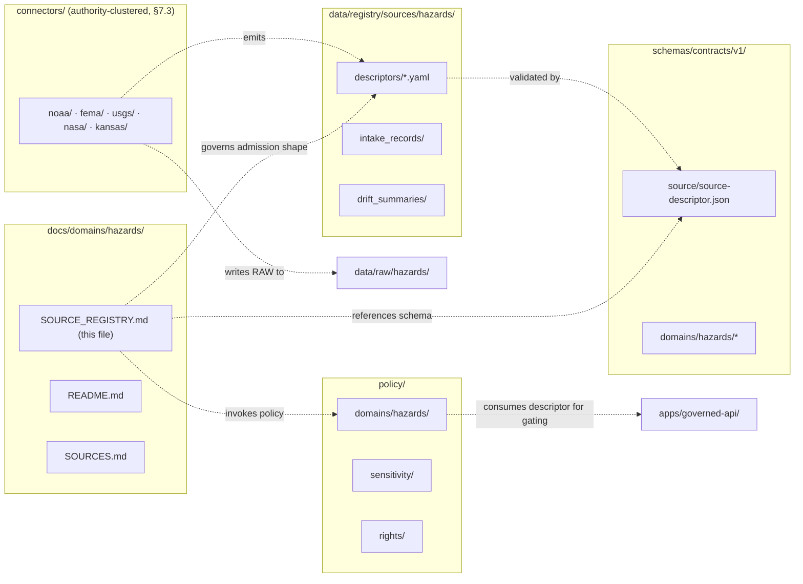
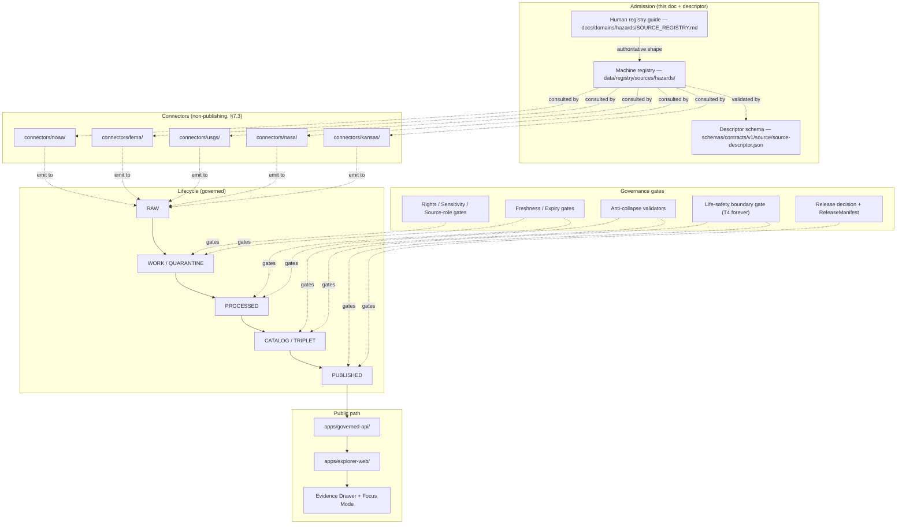

<!-- [KFM_META_BLOCK_V2]
doc_id: kfm://doc/docs/domains/hazards/source_registry
title: Hazards Domain — Source Registry
type: standard
version: v2
status: draft
owners: TODO — hazards domain steward; source-registry steward; release safety reviewer
created: 2026-05-17
updated: 2026-06-05
policy_label: public
related:
  - ai-build-operating-contract.md
  - docs/domains/hazards/README.md
  - docs/domains/hazards/SOURCES.md
  - docs/domains/hazards/PUBLICATION_AND_BOUNDARY.md
  - docs/runbooks/hazards/SOURCE_REFRESH_RUNBOOK.md
  - docs/sources/SOURCE_DESCRIPTOR_STANDARD.md
  - docs/domains/hydrology/SOURCE_REGISTRY.md
  - docs/domains/atmosphere/SOURCE_REGISTRY.md
  - directory-rules.md
  - schemas/contracts/v1/source/source-descriptor.json
  - data/registry/sources/hazards/
  - policy/domains/hazards/
  - policy/sensitivity/
tags: [kfm, hazards, source-registry, governance, admission, life-safety-boundary]
notes:
  # CONTRACT_VERSION = "3.0.0" (ai-build-operating-contract.md v3.0)
  # Path follows Directory Rules §12 domain-lane pattern.
  # This document is a human-facing control surface, not the machine-readable registry.
  # Hazards source admission MUST preserve the not-for-life-safety boundary at every gate; alert authority is T4 forever (Atlas §24.5.2).
  # Connector form is authority-clustered per Directory Rules §7.3 (usgs/ fema/ noaa/ nrcs/ kansas/).
  # v2: CONTRACT_VERSION pin; packages/maplibre → packages/maplibre-runtime (§7.2 v1.3); runbook home corrected to docs/runbooks/hazards/; sibling cross-links.
[/KFM_META_BLOCK_V2] -->

# ⚠️ Hazards Domain — Source Registry

> Human-facing admission and authority-control surface for source families the **Hazards** domain may admit, quarantine, restrict, or deny. Not an emergency alert system. Not a bibliography. Not the truth store. Not a publication authority.


**Status:** draft &middot; **Owners:** TODO — hazards domain steward; source-registry steward; release safety reviewer &middot; **Updated:** 2026-06-05 &middot; **Pins:** `CONTRACT_VERSION = "3.0.0"`

---

## Contents

1. [Purpose](#1-purpose)
2. [Repo Fit](#2-repo-fit)
3. [What Belongs Here · Exclusions](#3-what-belongs-here--exclusions)
4. [The Life-Safety Boundary](#4-the-life-safety-boundary)
5. [Source Families](#5-source-families)
6. [Source Role Discipline](#6-source-role-discipline)
7. [SourceDescriptor Field Surface](#7-sourcedescriptor-field-surface)
8. [Hazards Knowledge-Character Vocabulary](#8-hazards-knowledge-character-vocabulary)
9. [Lifecycle Posture (RAW → PUBLISHED)](#9-lifecycle-posture-raw--published)
10. [Anti-Collapse and Deny-by-Default Conditions](#10-anti-collapse-and-deny-by-default-conditions)
11. [Validators, Tests, Fixtures](#11-validators-tests-fixtures)
12. [Companion Machine-Readable Registry](#12-companion-machine-readable-registry)
13. [Source-Registry Architecture](#13-source-registry-architecture)
14. [Adding a New Source — Admission Checklist](#14-adding-a-new-source--admission-checklist)
15. [Open Questions and NEEDS VERIFICATION](#15-open-questions-and-needs-verification)
16. [Related Docs](#16-related-docs)

---

## 1. Purpose

The Hazards source registry is the **admission ledger and authority surface** for every external source the Hazards domain may touch. Each admitted source receives a `SourceDescriptor` that records identity, role, rights, sensitivity, cadence, endpoint, version, contact, and admissibility limits. The descriptor is what converts external material from anonymous data into accountable intake.

This document is the **human-facing** counterpart to the machine-readable registry data under `data/registry/sources/hazards/` (PROPOSED path per Directory Rules §9.1 and §12). It explains what may enter, what may not, what must be redirected to official sources, and how each role is treated downstream. For the source-side doctrine narrative (roles, descriptor fields, admission/activation) see the companion [`SOURCES.md`](./SOURCES.md); this registry is the admission *control surface* that doctrine feeds.

> [!IMPORTANT]
> The descriptor records *that a source exists* and *how it should be treated* — not *what the source says*. Truth resolution still requires `EvidenceBundle` resolution and policy review at publication. A descriptor is necessary for admission; it is not sufficient for release. **CONFIRMED doctrine.**

[Back to top](#contents)

---

## 2. Repo Fit

**This file's location** — `docs/domains/hazards/SOURCE_REGISTRY.md` — follows the §12 domain-lane pattern: domain segments live *inside* responsibility roots, never as root folders themselves. The hazards lane therefore appears as `<root>/domains/hazards/` (or `<root>/.../hazards/`) across `docs/`, `contracts/`, `schemas/`, `policy/`, `tests/`, `fixtures/`, `pipelines/`, `data/`, and `release/`.



| Adjacent surface | Path (PROPOSED) | What it owns |
|---|---|---|
| Domain README | `docs/domains/hazards/README.md` | Domain identity, boundary, scope, navigation. |
| Source dossier | `docs/domains/hazards/SOURCES.md` | Source-side doctrine: roles, descriptor fields, admission/activation. |
| Refresh runbook | `docs/runbooks/hazards/SOURCE_REFRESH_RUNBOOK.md` | How to refresh sources end-to-end (runbooks home per §6.1.b). |
| Machine registry | `data/registry/sources/hazards/` | YAML/JSON descriptor records, append-only. |
| Descriptor schema | `schemas/contracts/v1/source/source-descriptor.json` | Machine-checkable descriptor shape. Default home per ADR-0001. |
| Domain policy | `policy/domains/hazards/` | Hazards-specific allow/deny/abstain/restrict. |
| Sensitivity policy | `policy/sensitivity/` | Cross-domain redaction/generalization rules. |
| Connectors | `connectors/{noaa,fema,usgs,nasa,kansas}/` | Source-specific fetch + admission (authority-clustered, §7.3). |

> [!NOTE]
> Specific paths above are **PROPOSED** until verified against a mounted repository. The placement rules (which root holds which responsibility) are **CONFIRMED** by Directory Rules §3–§12. The connector form is **authority-clustered** per the §7.3 canonical tree (`connectors/usgs/ fema/ noaa/ nrcs/ kansas/ …`); finer per-product disambiguation happens inside each authority folder and via the descriptor `source_id`, and "source alias normalization" is itself **NEEDS VERIFICATION** (§7.3).

[Back to top](#contents)

---

## 3. What Belongs Here · Exclusions

### Belongs in this registry

- Descriptions of source families admitted to Hazards intake (historical, regulatory, operational-context, modeled, remote-sensing, administrative, candidate).
- Source-role assignments per family, with role rationale tied to KFM doctrine.
- Sensitivity posture and rights stance per source family.
- Anti-collapse rules specific to hazards (e.g., regulatory NFHL ≠ observed flood; FIRMS detection ≠ confirmed fire).
- Admission gates, pre-publication blockers, and the life-safety boundary that applies before any descriptor reaches `PUBLISHED`.

### Does NOT belong here

- **Live alert content, current warnings, or any UI surface treating Hazards as a life-safety alerting service.** Redirect users to official sources (NWS, FEMA, state emergency management) for life-safety guidance.
- Per-feature truth claims (those live in `EvidenceBundle` and catalog records under `data/catalog/`).
- Schema definitions (live in `schemas/contracts/v1/...`).
- Policy logic (lives in `policy/`).
- Connector code (lives in `connectors/`).
- Pipeline orchestration (lives in `pipelines/` and `pipeline_specs/`).
- Tile artifacts, layer styles, or rendered map outputs (live in `data/published/` and `packages/maplibre-runtime/`).
- Receipts, proofs, or release decisions (live in `data/receipts/`, `data/proofs/`, and `release/`).

> [!NOTE]
> v2 correction: the renderer package is `packages/maplibre-runtime/` (Directory Rules §7.2, v1.3 — sole governed renderer adapter). Any reference to `packages/maplibre/` is a pre-v1.3 historical name treated as a transitional compatibility mirror pending physical rename; `packages/cesium/` is removed doctrine, not a compatibility root.

> [!CAUTION]
> If you find yourself adding live operational warnings, alert text, or freshness-bound advisories to this document — **stop**. That is exactly the boundary KFM Hazards refuses to cross. Operational feeds may enter the system as `operational_warning` / `operational_advisory` / `operational_watch` source-role context, with freshness and expiry tracked, but they do not become public alert surfaces. **CONFIRMED doctrine.**

[Back to top](#contents)

---

## 4. The Life-Safety Boundary

> [!WARNING]
> **KFM Hazards is not an emergency alert system and must not provide life-safety instructions.** This is the firm boundary of the entire domain. Every source admitted here, every descriptor written, every policy gate applied, and every release decision MUST preserve this boundary. The deny register pins it at the strongest tier: **alert authority is T4 forever — no transform releases it** (Atlas §24.5.2).

CONFIRMED doctrine (Encyclopedia §7.10; Atlas §12; Idea Index KFM-IDX-POL-007):

- Operational warning, advisory, and watch products from NWS, state emergency management, and similar sources are admitted **as context only**. They carry freshness, issue, and expiry times. They never become an authoritative warning surface inside KFM.
- Expired operational context **MUST NOT** appear as current warning state. Freshness validators fail closed.
- For life-safety needs, KFM's published surfaces and Focus Mode answers redirect users to **official sources** (NWS, FEMA, state/local emergency management, NOAA/USGS authoritative feeds) and ABSTAIN from issuing life-safety guidance.
- Governed AI in this domain may summarize released Hazards EvidenceBundles, compare evidence, and explain limitations. It **MUST ABSTAIN** when evidence is insufficient and **MUST DENY** where policy, rights, sensitivity, or release state blocks the request.

A `SourceDescriptor` that does not record the source's life-safety boundary status, freshness cadence, and operational-vs-historical role is **inadmissible** for any source family carrying operational alert content.

[Back to top](#contents)

---

## 5. Source Families

The table below enumerates the source families the Hazards domain *may* admit. Each row is one descriptor *family*; multiple endpoint or product variants from the same authority typically share a family but receive distinct descriptor records.

**All status entries below are PROPOSED admission posture** — actual descriptor presence and current activation state require verification against `data/registry/sources/hazards/` (NEEDS VERIFICATION). Roles use the canonical seven-class enum (§6).

| Source family | Authority | Typical source roles | Knowledge character | Default sensitivity | Freshness expectation | Status |
|---|---|---|---|---|---|---|
| NOAA Storm Events / NCEI | NOAA NCEI | observed, administrative | historical_event_record, scientific_observation | public; rare narrative redaction | source-vintage; periodic (NEEDS VERIFICATION cadence) | PROPOSED |
| NWS alerts (warnings · advisories · watches) | NWS | observed (issue act), administrative; **context only** | operational_warning, operational_advisory, operational_watch | public; **freshness-gated**, life-safety boundary applies | event-driven; expiry-bound | PROPOSED |
| FEMA Disaster Declarations / OpenFEMA | FEMA | administrative | administrative_declaration | public | event-driven; periodic | PROPOSED |
| FEMA NFHL / MSC flood hazard | FEMA | regulatory | regulatory_context | public; **regulatory ≠ observed inundation** | source-vintage; map revision | PROPOSED |
| USGS Earthquake Catalog | USGS | observed, modeled (magnitude estimates) | scientific_observation, modeled_derivative | public | near-real-time + curated catalog | PROPOSED |
| USGS Water Data (hydrology cross-link) | USGS | observed | scientific_observation | public; per-domain cross-reference to Hydrology | continuous + curated | PROPOSED |
| NOAA HMS Fire and Smoke | NOAA OSPO | candidate, modeled | remote_sensing_detection, modeled_derivative | public; **detection ≠ confirmed fire** | daily | PROPOSED |
| NASA FIRMS active fire | NASA | candidate, observed (sensor) | remote_sensing_detection | public; **detection ≠ confirmed fire** | near-real-time | PROPOSED |
| Drought monitors (USDM, NIDIS) | NOAA / USDA / partners | aggregate, modeled | modeled_derivative, resilience_analysis | public; aggregate-cell semantics | weekly / monthly | PROPOSED |
| Kansas / local emergency management | KS Division of Emergency Management; counties | administrative, candidate | administrative_declaration, operational_advisory | source-dependent; **rights NEEDS VERIFICATION** | event-driven | PROPOSED |
| State / regional resilience plans | KS agencies; partners | administrative, modeled | resilience_analysis | public; planning-document distinction preserved | infrequent revision | PROPOSED |

> [!NOTE]
> The "Source family" column names the authority cluster; the live descriptor catalog under `data/registry/sources/hazards/` should disambiguate to specific endpoints, products, or dataset versions (e.g., NWS CAP/ATOM/JSON feeds, FEMA OpenFEMA dataset versions, NFHL effective-date layers). **NEEDS VERIFICATION** against mounted descriptors.

[Back to top](#contents)

---

## 6. Source Role Discipline

CONFIRMED doctrine (Atlas §24.1): KFM treats `source_role` as a **first-class identity attribute**. The role is set at admission and is **preserved through every promotion**. Promotion does not upgrade an observation to a regulation, or a model to an aggregate, or a candidate to a verified record — those are separate governed transitions with their own evidence and review requirements.

The seven canonical source roles, applied to Hazards examples:

| Role | Hazards example | Allowed downstream use | Forbidden collapse |
|---|---|---|---|
| **observed** | USGS earthquake hypocenter; NWS storm report tied to a place/time | Cite as observation; feed modeled or aggregate products | Never relabeled as regulatory or administrative |
| **regulatory** | FEMA NFHL flood-zone designation | Cite as regulatory context; informs exposure analysis | Never an "observed flood event" or "modeled inundation" |
| **modeled** | Smoke trajectory model; drought index surface; magnitude estimate | Cite with model identity, run receipt, bounds | Never an observation; never authoritative health/safety guidance unless source role and policy allow |
| **aggregate** | County-level disaster-loss totals; decadal hazard frequency summaries | Cite with aggregation receipt; matrix-cell semantics | Never a per-place truth claim |
| **administrative** | FEMA disaster declaration; state proclamation | Cite as administrative context | Never an observed event timeline |
| **candidate** | NASA FIRMS hot-spot pixel awaiting field confirmation; unmerged storm report | Cite as candidate in WORK / QUARANTINE | Never on a PUBLISHED edge without promotion |
| **synthetic** | Reconstructed historical hazard scene; AI-drafted hazard summary | Carry Reality Boundary Note and Representation Receipt | Never presented or queried as observed reality |

> [!IMPORTANT]
> A SourceDescriptor MUST set `source_role` at admission. Corrections produce a **new descriptor + CorrectionNotice**, not an in-place edit. The descriptor is retained with a `superseded_by` link (Atlas §24.8.2). **CONFIRMED doctrine.**

[Back to top](#contents)

---

## 7. SourceDescriptor Field Surface

PROPOSED descriptor surface — illustrative, not authoritative. The canonical machine schema home defaults to `schemas/contracts/v1/source/source-descriptor.json` per Directory Rules §7.4 / ADR-0001 (**NEEDS VERIFICATION** in mounted repo). The role-conditional fields below match the Atlas §24.1.3 descriptor surface.

| Field | Type / vocabulary | Required when | Hazards-specific notes |
|---|---|---|---|
| `source_id` | stable string | always | Globally unique; namespaced by authority (e.g., `noaa.storm_events`, `fema.nfhl`). |
| `source_role` | enum: `observed` · `regulatory` · `modeled` · `aggregate` · `administrative` · `candidate` · `synthetic` | always | Set at admission; never edited in place. |
| `role_authority` | string (issuing body / model identity / steward) | when role in `{regulatory, modeled, aggregate}` | Disambiguates the authoring authority for cite text. |
| `role_aggregation_unit` | geometry-scope token (county, HUC, tract, year, decade) | when `source_role = aggregate` | Prevents geometry-scope drift on join. |
| `role_model_run_ref` | EvidenceRef → ModelRunReceipt | when `source_role = modeled` | Pins inputs, parameters, version. |
| `role_candidate_disposition` | enum: `pending` · `merged` · `rejected` · `quarantined` | when `source_role = candidate` | PUBLISHED edge forbidden until merged. |
| `role_synthetic_basis` | `{ method, inputs, reality_boundary_note_ref }` | when `source_role = synthetic` | Records what is and is not real. |
| `rights_state` | enum + license ref + attribution + redistribution class | always | Unknown rights fail closed. |
| `sensitivity_state` | sensitivity class + redaction rule ref | always | Hazards default is public; some local sources may require steward review. |
| `cadence` | controlled cadence vocabulary (event-driven, near-real-time, daily, weekly, periodic, source-vintage) | always | Drives freshness validation and stale-warning denial. |
| `endpoint` | structured: `{ url, protocol, auth_class, rate_limit_class }` | always | Real auth material lives in environment-scoped secret stores. |
| `version` | source-declared version or vintage marker | when available | Captures NFHL effective dates, NCEI archive vintages, model run IDs. |
| `contact` | steward / authority contact (org, role, optional email) | always | Steward-side correspondence path. |
| `source_head` | `{ etag, last_modified, content_length, content_hash }` | when supported | Low-cost change detection. ETag alone is insufficient; content hash is stronger. |
| `admissibility_limits` | structured: forbidden claim roles, forbidden cross-domain joins, life-safety boundary flag | always for Hazards | **`life_safety_boundary: not_an_alert_system`** MUST be present for operational-warning families. |
| `freshness_policy_ref` | reference to freshness/expiry rule | when role ∈ `{candidate, observed}` and cadence is event-driven | Drives "expired operational context cannot appear as current warning state." |
| `not_authoritative_for` | array of claim classes the source MUST NOT support | always | E.g., NFHL `not_authoritative_for: [observed_inundation_event]`. |

> [!TIP]
> The `not_authoritative_for` field is doctrinally important: it is how a descriptor *refuses* claims a source family is often misused for. A FIRMS pixel descriptor that lists `confirmed_fire_event` in `not_authoritative_for` lets downstream validators deny the collapse mechanically.

[Back to top](#contents)

---

## 8. Hazards Knowledge-Character Vocabulary

CONFIRMED ubiquitous-language terms for the Hazards domain (Atlas §12.C). Each term is a controlled label applied to the descriptor or to records emerging from intake. The label constrains what claims a record may support downstream. (For the crosswalk between these usage labels and the §24.1.1 source-role enum, see [`README.md`](./README.md) §4 / [`SOURCES.md`](./SOURCES.md) §2.)

| Term | Meaning | Typical source family |
|---|---|---|
| `historical_event_record` | Past hazard event, archival or curated | NOAA Storm Events / NCEI |
| `operational_warning` | Issued warning product, freshness-bound, context-only | NWS warnings |
| `operational_advisory` | Issued advisory, freshness-bound, context-only | NWS advisories |
| `operational_watch` | Issued watch, freshness-bound, context-only | NWS watches |
| `administrative_declaration` | Administrative declaration with legal/funding effect | FEMA Disaster Declarations |
| `regulatory_context` | Authoritative regulatory area or designation | FEMA NFHL flood zones |
| `scientific_observation` | Direct measurement tied to a place/time | USGS earthquake; gauge-based water flood evidence |
| `remote_sensing_detection` | Sensor-based candidate detection | NASA FIRMS; NOAA HMS |
| `modeled_derivative` | Derived product from inputs / parameters | Drought indices; smoke trajectory; magnitude estimates |
| `resilience_analysis` | Resilience / exposure planning derivative | State resilience plans; exposure summaries |
| `unknown_unclassified` | Awaiting classification at admission | Quarantine candidate |

> [!NOTE]
> A record may carry exactly one knowledge-character label per claim. Mixed-character layers (e.g., a public map blending observed and modeled) MUST keep the per-feature label visible in the Evidence Drawer. **CONFIRMED doctrine** (Idea Index KFM-IDX-MOD-008, KFM-IDX-APP-005).

[Back to top](#contents)

---

## 9. Lifecycle Posture (RAW → PUBLISHED)

CONFIRMED invariant: **RAW → WORK / QUARANTINE → PROCESSED → CATALOG / TRIPLET → PUBLISHED.** Promotion is a *governed state transition*, never a file move. _(Directory Rules §9.1; Atlas §24.6.)_

```mermaid
flowchart LR
  S["Source authority"] -->|"connector fetch"| RAW[("data/raw/hazards/ source_id / run_id /")]
  RAW -->|"normalize"| WORK[("data/work/hazards/")]
  RAW -->|"fail / hold"| QUAR[("data/quarantine/hazards/")]
  WORK -->|"validate + policy gate"| PROC[("data/processed/hazards/")]
  QUAR -. remediation .-> WORK
  PROC -->|"catalog closure"| CAT[("data/catalog/domain/hazards/ + triplets/")]
  CAT -->|"release decision"| PUB[("data/published/layers/hazards/ + release/manifests/")]
  PUB -. correction/rollback .-> CAT

  classDef gate fill:#fff3cd,stroke:#856404,color:#856404;
  classDef pub fill:#d4edda,stroke:#155724,color:#155724;
  class WORK,QUAR,PROC,CAT gate
  class PUB pub
```



| Stage | Hazards-specific gate | Status |
|---|---|---|
| RAW | SourceDescriptor exists; life-safety boundary flag present for operational families; immutable source-edge capture with checksum, retrieval time, citation. | PROPOSED |
| WORK / QUARANTINE | Schema, geometry, time, identity, evidence, rights, sensitivity normalized. Operational-context expiry checked. Quarantine reason recorded for failures. | PROPOSED |
| PROCESSED | EvidenceRef generated; ValidationReport closed; digest closure passes; candidate vs. observed status preserved. | PROPOSED |
| CATALOG / TRIPLET | Catalog/proof closure passes; EvidenceBundle resolvable; graph projection respects source-role anti-collapse rules. | PROPOSED |
| PUBLISHED | ReleaseManifest, correction path, rollback target, review/policy state all present. Public-safe artifacts only. **No live alert path.** | PROPOSED |

> [!IMPORTANT]
> **Watcher-as-non-publisher** applies to every Hazards connector and watcher: they observe, record, and propose work; they do not publish, mutate canonical truth, or write under `data/processed/`, `data/catalog/`, or `data/published/`. Connector output MUST go to `data/raw/hazards/<source_id>/<run_id>/` or `data/quarantine/...`. **CONFIRMED doctrine** (Directory Rules §7.3, §13.5).

[Back to top](#contents)

---

## 10. Anti-Collapse and Deny-by-Default Conditions

The hazards domain is particularly exposed to source-role collapse. Atlas §24.1.2 enumerates the corpus-wide failure modes; the hazards-relevant rows and the additional hazards-only conditions appear below.

| Collapse / failure | Failure mode | KFM response | Required guardrail |
|---|---|---|---|
| Regulatory NFHL zone labeled as observed flood event | role collapse | **DENY** at publication; ABSTAIN at AI | Separate regulatory-context and observed-event lanes; UI banner; `not_authoritative_for: [observed_inundation_event]` in descriptor |
| Modeled smoke / AOD / trajectory labeled as observed smoke | role collapse | **DENY** at publication; ABSTAIN at AI | Model run receipt + uncertainty surface; role-preserving DTO field |
| Active fire detection (FIRMS / HMS) labeled as confirmed fire event | candidate-to-confirmed collapse | **DENY** confirmation claim; admit as candidate only | Candidate disposition tracked; promotion requires field/agency confirmation |
| Expired operational warning shown as current | freshness collapse | **DENY** publication; fail-closed freshness gate | Issue/expiry tracked at descriptor and at record; freshness policy ref |
| Operational warning treated as KFM life-safety guidance | life-safety collapse | **DENY** at every public surface; ABSTAIN at AI; redirect to official source | `life_safety_boundary` flag in descriptor; not-for-life-safety policy bundle; **T4 forever** |
| Aggregate drought index cited as a per-place truth | aggregate collapse | **DENY** join from cell to single record; ABSTAIN at AI | Aggregation receipt; geometry-scope guard |
| Synthetic / AI-drafted hazard scene presented as observed reality | reality boundary collapse | **DENY** publication; HOLD for steward review | Reality Boundary Note; Representation Receipt; UI badge |
| Unknown source role admitted to public surface | admission collapse | **QUARANTINE** by default | Source-role required at admission; quarantine until resolved |
| Sensitive local-source content (precise infrastructure, restricted operational detail) published without review | sensitivity collapse | **DENY**; route to redaction or steward review | Redaction Receipt; sensitivity policy gate |

> [!CAUTION]
> The life-safety boundary failure is the most consequential collapse in this domain. A descriptor for an operational-warning family that does not set `admissibility_limits.life_safety_boundary = not_an_alert_system` MUST NOT pass admission. **CONFIRMED doctrine.**

[Back to top](#contents)

---

## 11. Validators, Tests, Fixtures

PROPOSED validator surface for the Hazards source registry (Encyclopedia §7.10.K; Atlas §12.K). Implementation status NEEDS VERIFICATION against `tools/validators/` and `tests/domains/hazards/`.

- Source-role anti-collapse tests (regulatory ≠ observed; modeled ≠ observed; candidate ≠ confirmed). **PROPOSED.**
- Temporal-role validators (event time vs. valid time vs. issue/expiry vs. retrieval time stay distinct). **PROPOSED.**
- Emergency-alert denial tests (any output framed as a life-safety instruction fails closed; T4 forever). **PROPOSED.**
- Operational expiry / freshness tests (expired warning cannot appear as current). **PROPOSED.**
- Catalog closure tests (no orphan hazard artifact may reach PUBLISHED). **PROPOSED.**
- Evidence Drawer disclaimer tests (every public hazard claim carries source role, freshness, and not-for-life-safety badge when applicable). **PROPOSED.**
- UI no-direct-source tests (the public client reads through `apps/governed-api/`, never directly from `data/raw|work|quarantine` or operational connectors). **PROPOSED.**
- Descriptor schema validation (required fields, enum bounds, `not_authoritative_for` non-empty for known-collapse-risk families). **PROPOSED.**
- No-network fixture tests (deterministic synthetic descriptors and connector outputs for CI). **PROPOSED.**

[Back to top](#contents)

---

## 12. Companion Machine-Readable Registry

This Markdown document is the **human-facing control surface**. The machine-readable registry — where each admitted source has a concrete `SourceDescriptor` record — lives under `data/registry/sources/hazards/` (PROPOSED path per Directory Rules §9.1 / §12).

<details>
<summary><strong>Illustrative descriptor stub (PROPOSED shape only)</strong></summary>

```yaml
# data/registry/sources/hazards/noaa.storm_events.yaml — ILLUSTRATIVE, NOT AUTHORITATIVE
source_id: noaa.storm_events
title: NOAA Storm Events Database
source_role: observed
role_authority: NOAA NCEI
rights_state:
  license: us-government-work
  attribution_required: true
  redistribution_class: public
sensitivity_state:
  class: public
  redaction_rule_ref: null
cadence: periodic
endpoint:
  url: TODO
  protocol: https
  auth_class: none
  rate_limit_class: TODO
version: source-vintage
contact:
  org: NOAA NCEI
  role: data steward
source_head:
  etag: null
  last_modified: null
  content_length: null
  content_hash: null
admissibility_limits:
  life_safety_boundary: not_an_alert_system
  forbidden_claim_roles:
    - operational_warning_as_current
  forbidden_cross_domain_joins:
    - "no aggregate-to-record join without aggregation receipt"
not_authoritative_for:
  - operational_warning_as_current
  - emergency_action_guidance
notes:
  - PROPOSED record; verify endpoint, cadence, rights against current NOAA terms before activation.
```

</details>

> [!NOTE]
> The example above is illustrative shape only. Field names follow the **PROPOSED** descriptor surface in §7 and are subject to ADR resolution and schema verification. **NEEDS VERIFICATION** against `schemas/contracts/v1/source/source-descriptor.json`.

[Back to top](#contents)

---

## 13. Source-Registry Architecture



The registry is the **anchor** for every downstream gate. A descriptor that fails admission cannot produce a connector run; a connector that runs without a valid descriptor cannot route output through `data/raw/`; raw without a descriptor cannot promote.

[Back to top](#contents)

---

## 14. Adding a New Source — Admission Checklist

> [!TIP]
> This is the human checklist. The corresponding machine gates live in the descriptor schema, the connector gate validator, and the policy bundles. A new source MUST clear both surfaces. For the operational *refresh* of an already-admitted source, use [`SOURCE_REFRESH_RUNBOOK.md`](../../runbooks/hazards/SOURCE_REFRESH_RUNBOOK.md).

- [ ] **Authority identified.** Issuing body, contact, and steward path recorded.
- [ ] **`source_role` chosen** from the canonical enum and justified against §6 anti-collapse rules.
- [ ] **`not_authoritative_for` populated** for any role with known collapse risk (regulatory, modeled, aggregate, candidate, synthetic, operational).
- [ ] **`rights_state` resolved.** License, attribution, redistribution class. Unknown rights fail closed.
- [ ] **`sensitivity_state` resolved.** Default public; any non-public source triggers steward review.
- [ ] **`cadence` recorded** using the controlled vocabulary; freshness policy linked when applicable.
- [ ] **`endpoint` recorded** without real secrets. Auth material referenced by name, stored in environment-scoped secret stores.
- [ ] **Life-safety boundary flag set** when the source is operational/alert-adjacent.
- [ ] **`SourceActivationDecision` recorded** — admission gate decision (use / restrict / quarantine / deny).
- [ ] **Descriptor file added** to `data/registry/sources/hazards/` (PROPOSED path).
- [ ] **Connector wired** under the authority folder (`connectors/<authority>/`, §7.3) to write to `data/raw/hazards/<source_id>/<run_id>/` only, never to `processed/`, `catalog/`, or `published/`.
- [ ] **No-network fixture added** to `fixtures/domains/hazards/` (PROPOSED path) with a synthetic descriptor and a synthetic source-edge capture.
- [ ] **Negative fixtures added** for missing rights, missing role, missing freshness, missing life-safety-boundary flag, expired operational context.
- [ ] **PR cites Directory Rules §12** (domain lane) and the relevant §6 anti-collapse rule.
- [ ] **Steward review completed** before activation. Default: deny until reviewed.

[Back to top](#contents)

---

## 15. Open Questions and NEEDS VERIFICATION

| Item | Evidence that would settle it | Status |
|---|---|---|
| Whether `schemas/contracts/v1/source/source-descriptor.json` exists and matches §7 field surface | Mounted schema file + a passing validator on a real descriptor | NEEDS VERIFICATION |
| Whether `data/registry/sources/hazards/` is the actual machine-registry path | Mounted repo inspection or ADR | NEEDS VERIFICATION |
| Current endpoints, auth classes, and rate-limit classes for every source family | Live source documentation review + steward sign-off per family | NEEDS VERIFICATION |
| Whether `connectors/{noaa,fema,usgs,nasa,kansas}/` exist as authority-clustered connector lanes (per §7.3) and how source-alias normalization works | Mounted repo inspection (§7.3 flags alias normalization NEEDS VERIFICATION) | NEEDS VERIFICATION |
| Whether `policy/domains/hazards/` exists and which gates it defines (and the release-gate `.rego` home vs. `policy/release/hazards/`) | Mounted policy bundle + tests; ADR-HAZ-07 | NEEDS VERIFICATION / OPEN |
| Whether a `life_safety_boundary` enum (or equivalent flag) is implemented in the descriptor schema | Mounted schema + a denial test that fails closed | NEEDS VERIFICATION |
| Naming: are descriptor records YAML, JSON, or both? Single-file or directory-per-source? | Mounted registry sample | NEEDS VERIFICATION |
| Exact cadence vocabulary (event-driven, near-real-time, daily, weekly, periodic, source-vintage) — is this enumerated in schema? | Schema enum verification | NEEDS VERIFICATION |
| Source-role enum vocabulary and connector-cadence/quarantine policy | ADR-S-04 (role vocabulary); ADR-S-12 (connector cadence) | OPEN |
| Whether USDM / drought-monitor cadence and rights are admissible without state-agreement review | Source terms review + steward decision | OPEN |
| Whether Kansas / local emergency-management feeds carry redistribution constraints | Steward correspondence with KS DEM and county sources | OPEN |
| Whether the descriptor versioning is independent of source vintage | ADR or schema clarification | OPEN |

[Back to top](#contents)

---

## 16. Related Docs

> [!NOTE]
> Targets marked **TODO** below have not been verified against a mounted repo. Paths follow Directory Rules §12 conventions.

- `ai-build-operating-contract.md` — Canonical operating contract (`CONTRACT_VERSION = "3.0.0"`). **TODO — verify presence.**
- [`docs/domains/hazards/README.md`](./README.md) — Hazards domain identity, scope, and navigation. **TODO — verify presence.**
- [`docs/domains/hazards/SOURCES.md`](./SOURCES.md) — Source-side doctrine (roles, descriptor fields, admission/activation). **TODO — verify presence.**
- [`docs/domains/hazards/PUBLICATION_AND_BOUNDARY.md`](./PUBLICATION_AND_BOUNDARY.md) — Publication path + not-for-life-safety boundary. **TODO — verify presence.**
- [`docs/runbooks/hazards/SOURCE_REFRESH_RUNBOOK.md`](../../runbooks/hazards/SOURCE_REFRESH_RUNBOOK.md) — End-to-end source refresh runbook (runbooks home per §6.1.b). **TODO — verify presence.**
- [`docs/domains/hydrology/SOURCE_REGISTRY.md`](../hydrology/SOURCE_REGISTRY.md) — Hydrology registry; cross-references for flood, drought, and water observations. **TODO — verify presence.**
- [`docs/domains/atmosphere/SOURCE_REGISTRY.md`](../atmosphere/SOURCE_REGISTRY.md) — Atmosphere/Air registry; cross-references for smoke, AOD, AQ, heat/cold. **TODO — verify presence.**
- [`docs/sources/SOURCE_DESCRIPTOR_STANDARD.md`](../../sources/SOURCE_DESCRIPTOR_STANDARD.md) — Cross-domain source-descriptor standard. **TODO — verify presence.**
- [`docs/doctrine/directory-rules.md`](../../doctrine/directory-rules.md) — Directory Rules (§6.5 policy, §7.2 renderer, §7.3 connectors, §7.4 schema home, §9.1 lifecycle, §12 domain placement, §13.5 anti-patterns). **TODO — verify presence.**
- [`schemas/contracts/v1/source/source-descriptor.json`](../../../schemas/contracts/v1/source/source-descriptor.json) — Descriptor schema. **TODO — verify presence.**
- [`policy/domains/hazards/`](../../../policy/domains/hazards/) — Hazards policy bundles. **TODO — verify presence.**

---

> [!IMPORTANT]
> **Authority reminder.** This registry governs source *admission* and *authority labeling*. It does **not** publish claims, decide release state, or substitute for `EvidenceBundle` resolution at runtime. KFM Hazards is **not** an emergency alert system; for life-safety guidance, consult official sources (NWS, FEMA, state/local emergency management).

---

**Last updated:** 2026-06-05 &middot; **Doc version:** v2 &middot; **Pins:** CONTRACT_VERSION = "3.0.0" &middot; **Owners:** TODO — hazards domain steward; source-registry steward; release safety reviewer &middot; **Status:** draft

[Back to top](#contents)
