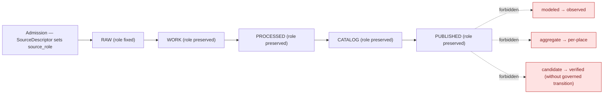
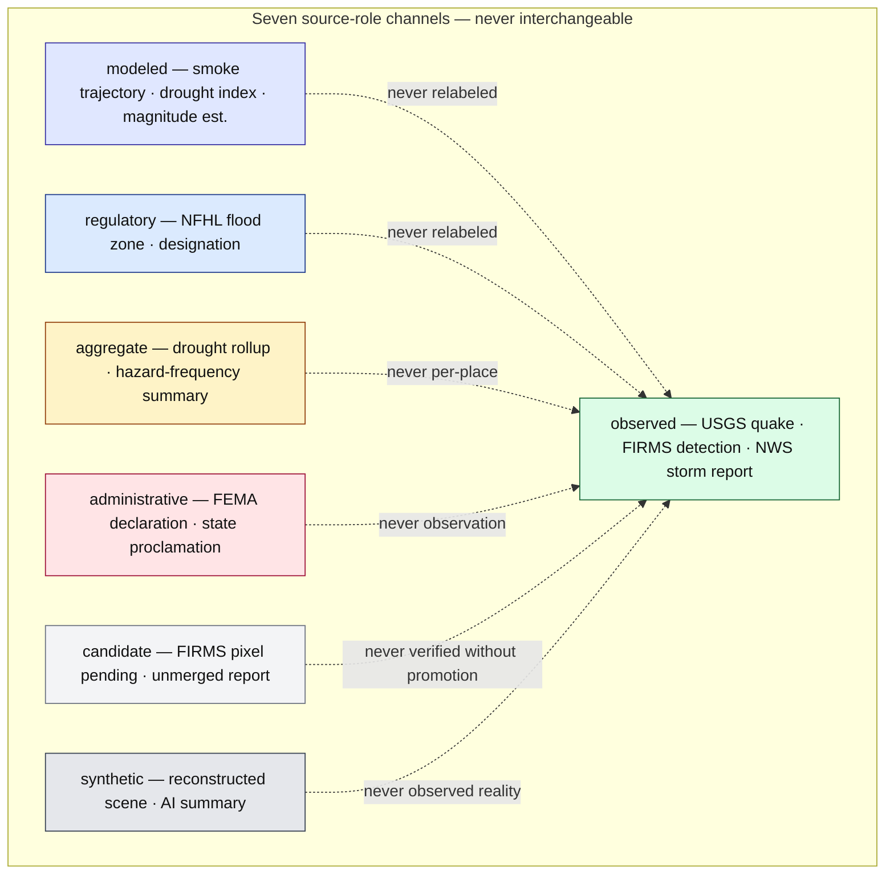

<!-- [KFM_META_BLOCK_V2]
doc_id: kfm://doc/docs/domains/hazards/source_role_matrix
title: Hazards — Source Role Matrix
type: standard
version: v1
status: draft
owners: TODO — Hazards domain steward + Source steward + Anti-collapse reviewer + Docs steward
created: 2026-06-05
updated: 2026-06-05
policy_label: public
related:
  - ai-build-operating-contract.md
  - docs/domains/hazards/README.md
  - docs/domains/hazards/SOURCES.md
  - docs/domains/hazards/SOURCE_REGISTRY.md
  - docs/domains/hazards/PUBLICATION_AND_BOUNDARY.md
  - docs/domains/hazards/PRESERVATION_MATRIX.md
  - docs/doctrine/directory-rules.md
  - schemas/contracts/v1/source/source-descriptor.json
tags: [kfm, domain, hazards, source-role, anti-collapse, matrix, deny-by-default, not-for-life-safety]
notes:
  # CONTRACT_VERSION = "3.0.0" (ai-build-operating-contract.md v3.0)
  # Realizes the Atlas figure-to-generate "Source-role anti-collapse diagram" for [DOM-HAZ] (Atlas 23.3 / 24.1).
  # Source role is the seven-class enum (Atlas 24.1.1), set at admission, never upgraded by promotion.
  # The role x object-family cells are PROPOSED applications of CONFIRMED 24.1.1 allowed-downstream rules.
  # Repository not mounted; all path/schema claims are PROPOSED.
  # Hazards is not an alert authority (T4 forever, Atlas 24.5.2); operational items are context only.
[/KFM_META_BLOCK_V2] -->

# 🌪️ Hazards — Source Role Matrix

> The anti-collapse matrix for the Hazards lane: which of the seven canonical **source roles** may legitimately produce which hazards **object families**, which combinations are **denied**, and how the `SourceDescriptor` enforces the boundary. Source role is a first-class identity attribute — set at admission, preserved through every promotion, never upgraded.

**Status:** draft · **Owners:** _TODO — Hazards domain steward + Source steward + Anti-collapse reviewer + Docs steward_ · **Last updated:** 2026-06-05 · **Pins:** `CONTRACT_VERSION = "3.0.0"`

---

## 📑 Table of contents

1. [Scope and reading guide](#1-scope-and-reading-guide)
2. [The seven canonical source roles](#2-the-seven-canonical-source-roles)
3. [Role → object-family matrix](#3-role--object-family-matrix)
4. [Source family → role assignment](#4-source-family--role-assignment)
5. [DENY conditions (anti-collapse register)](#5-deny-conditions-anti-collapse-register)
6. [The promotion rule — roles never upgrade](#6-the-promotion-rule--roles-never-upgrade)
7. [Descriptor enforcement](#7-descriptor-enforcement)
8. [Anti-collapse channels (diagram)](#8-anti-collapse-channels-diagram)
9. [Validators that enforce the matrix](#9-validators-that-enforce-the-matrix)
10. [Open questions and verification backlog](#10-open-questions-and-verification-backlog)
11. [Related docs](#11-related-docs)

---

## 1. Scope and reading guide

This document is the **anti-collapse control matrix** for the Hazards lane. It realizes, for `[DOM-HAZ]`, the Atlas figure-to-generate "source-role anti-collapse diagram showing observed, regulatory, modeled, aggregate, administrative, candidate, and synthetic records as separate source-role channels." _(CONFIRMED: Atlas §23.3 figure-to-generate; §24.1 Master Source-Role Anti-Collapse Register.)_

It answers three questions a reviewer must settle before any hazards artifact promotes:

1. *Which source role does this artifact carry, and is it legitimate for the object family it claims to be?* — [§2](#2-the-seven-canonical-source-roles), [§3](#3-role--object-family-matrix).
2. *Is this a forbidden collapse?* — [§5](#5-deny-conditions-anti-collapse-register).
3. *How is the boundary mechanically enforced?* — [§6](#6-the-promotion-rule--roles-never-upgrade), [§7](#7-descriptor-enforcement), [§9](#9-validators-that-enforce-the-matrix).

> [!IMPORTANT]
> **KFM treats source role as a first-class identity attribute.** An observed reading is not interchangeable with a modeled estimate; a regulatory determination is not interchangeable with an administrative compilation; an aggregate publication is not interchangeable with candidate evidence; synthetic content is never the same thing as observed reality. The lifecycle and the governed API both **fail closed** when these roles are conflated. _(CONFIRMED: Atlas §24.1.)_

> [!NOTE]
> **Repository not mounted in this session.** The role *definitions* and the *DENY conditions* are CONFIRMED doctrine. The role × object-family *cells* in [§3](#3-role--object-family-matrix) are **PROPOSED** applications of the CONFIRMED §24.1.1 "allowed downstream role" rules to hazards object families; the per-source role assignments in [§4](#4-source-family--role-assignment) are PROPOSED until fixed at admission. Schema/path claims are PROPOSED.

[⬆ Back to top](#-table-of-contents)

---

## 2. The seven canonical source roles

CONFIRMED doctrine, verbatim from the §24.1.1 register, with hazards examples.

| Role | Definition (CONFIRMED, §24.1.1) | Hazards example | Allowed downstream | Never relabeled as |
|---|---|---|---|---|
| `observed` | Direct reading / measurement / first-hand evidentiary record tied to place and time | USGS earthquake reading; FIRMS thermal detection; NWS storm report | May feed `modeled` or `aggregate` products | `regulatory` or `administrative` |
| `regulatory` | Authoritative determination by a governing body with legal/administrative force | NFHL flood-zone designation | Cite as regulatory context | an `observed` event or `modeled` estimate |
| `modeled` | Derived product from inputs/assumptions/fitted parameters; uncertainty + input provenance preserved | Smoke trajectory; drought index surface; magnitude estimate | Cite with model identity, run receipt, bounds | an observation |
| `aggregate` | Published summary/total/average over a unit; irreversible loss of per-record fidelity | Drought-monitor county rollup; decadal hazard-frequency summary | Cite with aggregation receipt | a per-place record |
| `administrative` | Compiled agency record for administration/registration/accounting | FEMA disaster declaration; state proclamation | Cite as administrative context | an observation or a regulation |
| `candidate` | Proposed record awaiting validation/evidence/dedup/steward review; not yet authoritative | Quarantined connector output; unmerged storm report; FIRMS pixel awaiting confirmation | Cite as candidate in WORK / QUARANTINE | a verified record in PUBLISHED without promotion |
| `synthetic` | Generated by simulation/reconstruction/AI/interpolation; no first-hand observation | Reconstructed historical hazard scene; AI-drafted summary | Carries Reality Boundary Note + Representation Receipt | observed reality |

> [!IMPORTANT]
> **Reading note (CONFIRMED, §24.1.1).** The role of a source is set at admission (`SourceDescriptor`) and is preserved through every promotion. Promotion does not upgrade an observation to a regulation, or a model to an aggregate, or a candidate to a verified record — those are separate governed transitions with their own evidence and review requirements.

[⬆ Back to top](#-table-of-contents)

---

## 3. Role → object-family matrix

Which source roles may legitimately produce which hazards object families. **✅ = legitimate** (the role can carry/feed this object); **⛔ = forbidden** (would be a source-role collapse — see [§5](#5-deny-conditions-anti-collapse-register)); **—  = not applicable / not a producer of this object**. Cells are PROPOSED applications of the §24.1.1 allowed-downstream rules; object families are CONFIRMED (§12.E).

| Hazards object family | observed | regulatory | modeled | aggregate | administrative | candidate | synthetic |
|---|:--:|:--:|:--:|:--:|:--:|:--:|:--:|
| `HazardEvent` | ✅ | ⛔ | — | — | ✅ | ✅¹ | ⛔ |
| `HazardObservation` | ✅ | ⛔ | — | — | — | ✅¹ | ⛔ |
| `WarningContext` | ✅² | — | — | — | ✅² | ✅¹ | ⛔ |
| `AdvisoryContext` | ✅² | — | — | — | ✅² | ✅¹ | ⛔ |
| `DisasterDeclaration` | ⛔ | ✅³ | — | — | ✅ | ✅¹ | ⛔ |
| `FloodContext` (NFHL) | ⛔ | ✅ | ✅⁴ | — | — | ✅¹ | ⛔ |
| `WildfireDetection` | ✅ | — | ✅ | — | — | ✅¹ | ⛔ |
| `SmokeContext` | ✅ | — | ✅ | — | — | ✅¹ | ⛔ |
| `DroughtIndicator` | — | — | ✅ | ✅ | — | ✅¹ | ⛔ |
| `EarthquakeEvent` | ✅ | — | ✅⁵ | — | — | ✅¹ | ⛔ |
| `HeatColdEvent` | ✅ | — | ✅ | — | — | ✅¹ | ⛔ |
| `ExposureSummary` | — | — | ✅ | ✅ | — | ✅¹ | ⛔ |
| `ResilienceSummary` | — | — | ✅ | ✅ | ✅⁶ | ✅¹ | ⛔ |
| `HazardTimeline` | — | — | ✅⁷ | — | — | ✅¹ | ⛔ |
| `ImpactArea` | — | — | ✅ | — | — | ✅¹ | ⛔ |

**Cell notes:**
1. **`candidate`** may *carry* any object family while in WORK / QUARANTINE awaiting promotion — but never on a PUBLISHED edge. The ✅¹ marks "admissible as candidate evidence," not "publishable."
2. **Operational warning/advisory** is `observed`/`administrative` evidence (the issuance act) *presented as historical context*. It is never a `regulatory` determination and never a live alert (T4 forever).
3. **`DisasterDeclaration`** is primarily `administrative`; it is `regulatory` only where the declaration carries binding legal force.
4. **`FloodContext`** is `regulatory` (the NFHL designation). A `modeled` flood surface is a *different* object and must not be relabeled as the NFHL `FloodContext`.
5. **`EarthquakeEvent`** is `observed`; magnitude *estimates* are `modeled` attributes carried with the observed event, not a separate observed claim.
6. **`ResilienceSummary`** may draw on `administrative` planning documents (state resilience plans) as inputs, cited as administrative context.
7. **`HazardTimeline`** is a `modeled` (derived) composition of cited events; each rolled-in item retains its own source role and temporal caveat.

> [!CAUTION]
> The ⛔ cells are not stylistic — each is a named or derivable DENY condition. The most consequential are `regulatory → HazardEvent`/`HazardObservation` (NFHL as observed flood) and `synthetic → *` (generated content as observed reality). See [§5](#5-deny-conditions-anti-collapse-register).

[⬆ Back to top](#-table-of-contents)

---

## 4. Source family → role assignment

The Atlas §12.D records each hazards source family's role as "authority / observation / context / model **as source role requires**" — i.e., the role is **assigned at admission, not pre-pinned**. The column below is the **PROPOSED** mapping onto the seven-class enum, to be fixed per source via `SourceDescriptor` + `SourceActivationDecision`.

| Source family | PROPOSED canonical role(s) | Produces (legitimate object families) |
|---|---|---|
| NOAA Storm Events / NCEI | `observed` / `administrative` | `HazardEvent`, `HazardObservation`, `HeatColdEvent` |
| NWS warnings / advisories / watches | `observed`/`administrative` (context only) | `WarningContext`, `AdvisoryContext` |
| FEMA Disaster Declarations / OpenFEMA | `administrative` (+ `regulatory` where binding) | `DisasterDeclaration` |
| FEMA NFHL / MSC | `regulatory` | `FloodContext` |
| USGS Earthquake Catalog | `observed` (magnitude est. `modeled`) | `EarthquakeEvent` |
| NOAA HMS Fire and Smoke | `observed` (detection) / `modeled` (trajectory) | `WildfireDetection`, `SmokeContext` |
| NASA FIRMS active fire | `observed` (detection); `candidate` until confirmed | `WildfireDetection` |
| Drought monitors (USDM, NIDIS) | `modeled` / `aggregate` | `DroughtIndicator` |
| Kansas / local emergency management | `administrative` (context) | `WarningContext`, `AdvisoryContext`, `DisasterDeclaration` |
| State / regional resilience plans | `administrative` / `modeled` | `ResilienceSummary` |

> [!NOTE]
> Rights for every family are `NEEDS VERIFICATION; sensitive joins fail closed` (Atlas §12.D). Role assignment is one half of admission; rights resolution + `SourceActivationDecision` is the other. See [`SOURCES.md`](./SOURCES.md) and [`SOURCE_REGISTRY.md`](./SOURCE_REGISTRY.md).

[⬆ Back to top](#-table-of-contents)

---

## 5. DENY conditions (anti-collapse register)

CONFIRMED DENY conditions from §24.1.2, with the hazards-relevant rows and the hazards-specific additions. Each is a fail-closed gate at publication and an ABSTAIN at the AI surface.

| Collapse pattern | Denied outcome | Required guardrail | Source |
|---|---|---|---|
| Regulatory zone labeled as an observed flood / event (NFHL as "this area flooded") | DENY publication of regulatory layer as event evidence | Separate regulatory-layer and observed-event lanes; UI banner; `not_authoritative_for: [observed_inundation_event]` | §24.1.2 (Hydrology; **Hazards**; Air) |
| Modeled product labeled or queried as observed (smoke trajectory as observed smoke) | DENY at publication; ABSTAIN at AI | Run receipt + uncertainty surface + role-preserving DTO field | §24.1.2 (Air; Hydrology; Habitat; Ag; 3D) |
| Aggregate cited as a per-place truth (drought cell → single place) | DENY join from aggregate cell to single record; ABSTAIN at AI | Aggregation receipt; geometry-scope guard; matrix-cell semantics | §24.1.2 (Ag; People; Geology; Air) |
| Administrative compilation cited as observation (declaration as observed event) | DENY publication of compilation as observed event timeline | Source-role tag preserved; named Admin/Event types | §24.1.2 (People/Land; Settlements; Roads) |
| Candidate record exposed on a public surface | DENY at trust membrane; route to QUARANTINE | Promotion gate; no PUBLISHED edge to WORK/QUARANTINE | §24.1.2 (ENCY; DIRRULES) |
| Synthetic content presented as observed reality | DENY publication; HOLD for steward review; ABSTAIN at AI | Reality Boundary Note; Representation Receipt; UI badge | §24.1.2 (Planetary/3D; AI; Arch; Habitat) |
| AI text treated as evidence | DENY publication; ABSTAIN at Focus Mode; `AIReceipt` mandatory | Cite-or-abstain; `AIReceipt`; release state required | §24.1.2 (GAI; ENCY; UIAI) |
| **Hazards-specific:** detection (FIRMS/HMS) labeled as confirmed fire | DENY confirmation claim; admit as `candidate` only | Candidate disposition; promotion requires field/agency confirmation | derived from §24.1.1 candidate rule |
| **Hazards-specific:** operational warning treated as KFM life-safety guidance | DENY at every public surface; ABSTAIN at AI; redirect to official source | `life_safety_boundary` flag; **T4 forever** | §24.5.2; §12.B |
| **Hazards-specific:** expired operational warning shown as current | DENY publication; fail-closed freshness gate | Issue/expiry tracked; freshness policy ref | §12.I |

[⬆ Back to top](#-table-of-contents)

---

## 6. The promotion rule — roles never upgrade

The single rule that makes the matrix enforceable: **promotion is a governed state transition, not a role upgrade.**

A `modeled` smoke surface stays `modeled` from RAW to PUBLISHED. A `candidate` FIRMS pixel becomes a verified `WildfireDetection` only through a *separate* governed transition with its own evidence and review — not by being promoted through the lifecycle. Correcting a role produces a **new `SourceDescriptor` + `CorrectionNotice`**, never an in-place edit; the prior descriptor is retained with a `superseded_by` link. _(CONFIRMED: Atlas §24.1.1 reading note; §24.8.2.)_

[⬆ Back to top](#-table-of-contents)

---

## 7. Descriptor enforcement

The matrix is enforced mechanically through the `SourceDescriptor` role fields (Atlas §24.1.3; schema home `schemas/contracts/v1/source/source-descriptor.json` per §7.4/ADR-0001, PROPOSED).

| Field | Role it guards | What it prevents |
|---|---|---|
| `source_role` (MUST) | all | Admission without a role; the matrix has no row for a roleless source |
| `role_authority` (MUST when `regulatory`/`modeled`/`aggregate`) | regulatory, modeled, aggregate | Anonymous authority on a regulatory designation or model output |
| `role_aggregation_unit` (MUST when `aggregate`) | aggregate | Geometry-scope drift; the aggregate → per-place collapse |
| `role_model_run_ref` (MUST when `modeled`) | modeled | A model output without its run receipt being read as observed |
| `role_candidate_disposition` (MUST when `candidate`) | candidate | A candidate reaching PUBLISHED before `merged` |
| `role_synthetic_basis` (MUST when `synthetic`) | synthetic | Synthetic content without a Reality Boundary Note |
| `not_authoritative_for` (array) | all | A source family being used for a claim class it must not support (e.g., NFHL → `observed_inundation_event`) |

> [!TIP]
> `not_authoritative_for` is how the matrix's ⛔ cells become *machine-checkable refusals*. An NFHL descriptor listing `observed_inundation_event` in `not_authoritative_for` lets a validator deny the `regulatory → HazardEvent` collapse without a human in the loop.

[⬆ Back to top](#-table-of-contents)

---

## 8. Anti-collapse channels (diagram)

The seven roles as separate channels — the figure the Atlas calls for (§23.3). No arrow crosses between channels except through a *governed transition* with its own evidence; nothing crosses into `observed` from any other channel.

[⬆ Back to top](#-table-of-contents)

---

## 9. Validators that enforce the matrix

PROPOSED validator classes (Atlas §12.K), framed as matrix-defense obligations. Test home `tests/domains/hazards/`; fixtures `fixtures/domains/hazards/`; policy `policy/domains/hazards/` (release-gate `.rego` may also live at `policy/release/hazards/`, ADR-HAZ-07).

- **Source-role anti-collapse** — reject any artifact whose claimed object family is a ⛔ cell for its `source_role`; reject silent role collapses in joins.
- **`not_authoritative_for` guard** — reject any claim in a source's `not_authoritative_for` list (e.g., NFHL → observed inundation).
- **Aggregate geometry-scope guard** — reject any join from an `aggregate` cell to a single place without an aggregation receipt.
- **Candidate-edge guard** — reject any `candidate` artifact on a PUBLISHED edge; route to QUARANTINE.
- **Synthetic reality-boundary guard** — reject any `synthetic` artifact presented as observed; require Reality Boundary Note + Representation Receipt.
- **Promotion role-preservation** — reject any promotion that changes `source_role`; corrections must be a new descriptor + `CorrectionNotice`.
- **Life-safety boundary** — reject any operational item framed as a live alert (T4 forever).

<strong>PROPOSED negative-fixture set (click to expand)</strong>

| Fixture | Collapse tested | Expected outcome |
|---|---|---|
| `negative_nfhl_as_observed` | `regulatory → HazardEvent` | DENY |
| `negative_smoke_model_as_observed` | `modeled → observed` | DENY |
| `negative_firms_as_confirmed_fire` | `candidate → verified` | DENY (admit as candidate) |
| `negative_drought_cell_per_place` | `aggregate → per-place` | DENY |
| `negative_declaration_as_event` | `administrative → observed event` | DENY |
| `negative_synthetic_as_observed` | `synthetic → observed` | DENY / HOLD |
| `negative_candidate_published` | `candidate` on PUBLISHED edge | DENY → QUARANTINE |
| `negative_role_upgraded_on_promote` | role change during promotion | DENY |
| `negative_warning_as_current` | expired operational as current | DENY |

[⬆ Back to top](#-table-of-contents)

---

## 10. Open questions and verification backlog

| ID | Question / item | Status | Resolution path |
|---|---|---|---|
| OQ-HAZ-SRM-01 | Source-role enum vocabulary and evolution rule | **OPEN (ADR-S-04)** | ADR |
| OQ-HAZ-SRM-02 | Confirm the role × object-family cells in §3 against a mounted contract/schema for each object family | **PROPOSED** | Schema + contract inspection |
| OQ-HAZ-SRM-03 | Pin canonical role per source family (the §4 column is PROPOSED until fixed at admission) | **PROPOSED** | Per-source `SourceActivationDecision` |
| OQ-HAZ-SRM-04 | Confirm `not_authoritative_for` is implemented and populated for collapse-risk families | **NEEDS VERIFICATION** | Descriptor schema + registry sample |
| OQ-HAZ-SRM-05 | Confirm `SourceDescriptor` role-conditional fields exist in the mounted schema | **NEEDS VERIFICATION** | Inspect `schemas/contracts/v1/source/` |
| OQ-HAZ-SRM-06 | Confirm anti-collapse validators + negative fixtures exist and pass in CI | **NEEDS VERIFICATION** | Tests + CI run logs |
| OQ-HAZ-SRM-07 | Whether magnitude-estimate-as-modeled-attribute (cell note 5) is a contract field or a separate object | **OPEN** | Contract decision |

> These items remain `NEEDS VERIFICATION` / `OPEN` before this doc promotes from `draft` to `published`. Reconcile against `docs/registers/VERIFICATION_BACKLOG.md`.

[⬆ Back to top](#-table-of-contents)

---

## 11. Related docs

> All targets below are **PROPOSED** in this session; reconcile against the live repo before relying on them.

- `ai-build-operating-contract.md` — Canonical operating contract (`CONTRACT_VERSION = "3.0.0"`).
- [`docs/domains/hazards/README.md`](./README.md) — Hazards lane landing page; ubiquitous-language ↔ role crosswalk in §4.
- [`docs/domains/hazards/SOURCES.md`](./SOURCES.md) — Source dossier; roles, descriptor fields, admission/activation.
- [`docs/domains/hazards/SOURCE_REGISTRY.md`](./SOURCE_REGISTRY.md) — Admission control surface; per-family registry.
- [`docs/domains/hazards/PUBLICATION_AND_BOUNDARY.md`](./PUBLICATION_AND_BOUNDARY.md) — publication path + not-for-life-safety boundary.
- [`docs/domains/hazards/PRESERVATION_MATRIX.md`](./PRESERVATION_MATRIX.md) — preservation per lifecycle stage and tier.
- `docs/doctrine/directory-rules.md` — Directory Rules (§7.4 schema home, §9.1 lifecycle, §12 placement, §13.5 anti-patterns).
- `schemas/contracts/v1/source/source-descriptor.json` — Descriptor schema (ADR-0001).
- Atlas v1.1 §23.3 (figure-to-generate), §24.1 (Master Source-Role Anti-Collapse Register: §24.1.1 classes, §24.1.2 DENY conditions, §24.1.3 descriptor fields), §24.5.2 (alert-authority T4 forever); §12.C/D/E (Hazards vocabulary, sources, objects), §12.I (publication gate).
- KFM Encyclopedia §7.10 — Hazards mission, boundary, objects, sources.

---

<strong>Last reviewed:</strong> 2026-06-05 ·
<strong>Doc version:</strong> v1 (initial source-role matrix; realizes Atlas §23.3 figure-to-generate for [DOM-HAZ]) ·
<strong>Pins:</strong> CONTRACT_VERSION = "3.0.0" ·
<strong>Lineage:</strong> KFM Domains Culmination Atlas v1.1 §23.3, §24.1.1–§24.1.3, §24.5.2; §12.C/D/E/I; KFM Encyclopedia §7.10; Directory Rules §7.4, §9.1, §12, §13.5 ·
<a href="#-hazards--source-role-matrix">⬆ Back to top</a>

