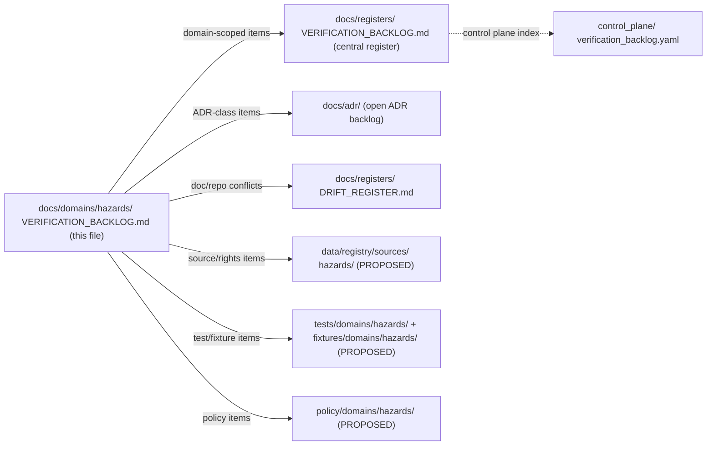
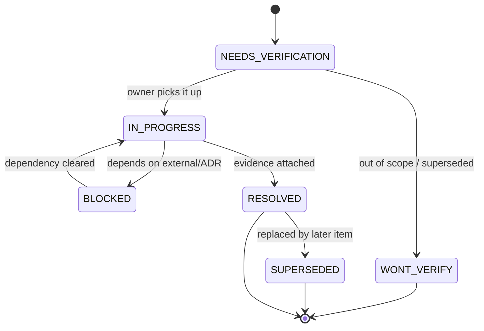

<!-- [KFM_META_BLOCK_V2]
doc_id: kfm://doc/docs/domains/hazards/verification_backlog
title: Hazards Domain — Verification Backlog
type: register
version: v2
status: draft
owners: <hazards-domain-steward>, <governance-steward>
created: 2026-05-17
updated: 2026-06-05
policy_label: public
related:
  - ai-build-operating-contract.md
  - docs/registers/VERIFICATION_BACKLOG.md
  - docs/registers/DRIFT_REGISTER.md
  - docs/registers/OBJECT_FAMILY_MAP.md
  - docs/domains/hazards/README.md
  - docs/domains/hazards/SOURCES.md
  - docs/domains/hazards/SOURCE_REGISTRY.md
  - docs/domains/hazards/SOURCE_ROLE_MATRIX.md
  - docs/domains/hazards/PUBLICATION_AND_BOUNDARY.md
  - docs/domains/hazards/PRESERVATION_MATRIX.md
  - docs/runbooks/hazards/SOURCE_REFRESH_RUNBOOK.md
  - docs/doctrine/directory-rules.md
  - docs/standards/PROV.md
tags: [kfm, hazards, verification, governance, register]
notes:
  # CONTRACT_VERSION = "3.0.0" (ai-build-operating-contract.md v3.0)
  # Domain-scoped extension of the central docs/registers/VERIFICATION_BACKLOG.md.
  # Repo evidence not mounted in this session; all repo-state claims are PROPOSED or NEEDS VERIFICATION.
  # "KFM is not an emergency alert system" is the load-bearing invariant; every item here is downstream of it.
  # ADR-S-* numbering follows the Atlas 24.12 canonical backlog; the kfm_unified_doctrine_synthesis 49 scheme diverges — see 13.1 CONFLICT note.
[/KFM_META_BLOCK_V2] -->

# 🌪️ Hazards Domain — Verification Backlog

> Living register of unresolved verification items, open questions, and ADR-class decisions for the **Hazards** lane. Not a roadmap, not a design doc, not an alerting surface.


**Status:** draft · **Owners:** `<hazards-domain-steward>`, `<governance-steward>` · **Last updated:** 2026-06-05 · **Pins:** `CONTRACT_VERSION = "3.0.0"`

> [!IMPORTANT]
> **KFM is not an emergency alert system.** Every item in this backlog inherits that boundary [DOM-HAZ §§1–2; KFM-IDX-POL-007], pinned at the strongest tier — **alert authority is T4 forever, no transform** [Atlas §24.5.2]. No verification path in this file may be used to justify life-safety instructions, real-time alerting behavior, or regulatory determinations. When a hazard surface drifts toward alerting, the resolution is **refer to NWS, FEMA, or state emergency channels**, not "improve KFM coverage."

---

## Contents

- [1. Purpose and scope](#1-purpose-and-scope)
- [2. How this register fits](#2-how-this-register-fits)
- [3. Entry conventions](#3-entry-conventions)
- [4. Severity, status, and lifecycle](#4-severity-status-and-lifecycle)
- [5. Backlog — Source rights and endpoints](#5-backlog--source-rights-and-endpoints)
- [6. Backlog — Source-role taxonomy and freshness](#6-backlog--source-role-taxonomy-and-freshness)
- [7. Backlog — Emergency-alert boundary enforcement](#7-backlog--emergency-alert-boundary-enforcement)
- [8. Backlog — Release, correction, and rollback drill](#8-backlog--release-correction-and-rollback-drill)
- [9. Backlog — Validators, fixtures, and negative paths](#9-backlog--validators-fixtures-and-negative-paths)
- [10. Backlog — Schema, contract, and policy homes](#10-backlog--schema-contract-and-policy-homes)
- [11. Backlog — Governed AI and Focus Mode](#11-backlog--governed-ai-and-focus-mode)
- [12. Backlog — MapLibre UI and Evidence Drawer](#12-backlog--maplibre-ui-and-evidence-drawer)
- [13. ADR-class questions surfaced from this backlog](#13-adr-class-questions-surfaced-from-this-backlog)
- [14. Resolution flow](#14-resolution-flow)
- [15. Closed and superseded items](#15-closed-and-superseded-items)
- [16. Related docs](#16-related-docs)
- [Appendix A — Item template](#appendix-a--item-template)
- [Appendix B — Cross-reference to v1.0 §12.N](#appendix-b--cross-reference-to-v10-12n)

---

## 1. Purpose and scope

This file is the **domain-scoped verification backlog** for Hazards. It enumerates checkable, unresolved items whose resolution would let a CONFIRMED or PROPOSED claim about the Hazards lane be promoted, demoted, or retired. It is the single Hazards-side surface for:

- items lifted from the v1.0 Atlas §12.N (Verification backlog) [DOM-HAZ §12.N];
- items lifted from the Encyclopedia §7.10 Hazards self-check [ENCY §7.10];
- items implied by Hazards-relevant doctrine in `[POL-007]`, `[VAL-007]`, `[APP-005]`, and the Atlas Chapter 24 master registers [ENCY] [DIRRULES];
- new items raised by Hazards stewards as work proceeds.

**Out of scope** for this file (live elsewhere, not here):

| Out-of-scope topic | Lives in |
|---|---|
| Cross-domain verification items (any domain or shared infra) | `docs/registers/VERIFICATION_BACKLOG.md` (central) |
| Naming/structural decisions requiring a formal record | `docs/adr/` |
| Conflicts between docs and repo/implementation | `docs/registers/DRIFT_REGISTER.md` |
| Source rights and license capture for individual sources | `data/registry/sources/hazards/` (PROPOSED) |
| Idea-stage proposals not yet checkable | `docs/intake/NEW_IDEAS_INDEX.md` |
| Hazards architecture, scope, or ubiquitous language | `docs/domains/hazards/README.md` and Atlas §12 |

[Back to top](#contents)

---

## 2. How this register fits



> [!NOTE]
> The central `docs/registers/VERIFICATION_BACKLOG.md` is **canonical** for the project's overall verification picture; this domain-scoped file is a **lane mirror** that lets the Hazards steward triage Hazards work without scanning every other lane. Items that close here close in both places. Items raised here flow upward to the central register at the next sync.

[Back to top](#contents)

---

## 3. Entry conventions

Every backlog entry below uses the same column shape:

| Column | Meaning |
|---|---|
| **ID** | Stable `HAZ-VB-NNN` identifier. Once assigned, never reused. |
| **Item** | One-line statement of what needs to be verified. |
| **Why it matters** | Doctrine/invariant at stake, in one short clause. |
| **Evidence that would settle it** | What artifact (file, schema, test, log, manifest, receipt, ADR) would let this entry close. |
| **Owner** | Steward or role accountable for movement. Placeholders allowed. |
| **Severity** | `BLOCK_RELEASE` · `BLOCK_PROMOTION` · `BLOCK_PUBLIC` · `WARN` · `INFO`. |
| **Status** | `NEEDS VERIFICATION` · `IN PROGRESS` · `BLOCKED` · `RESOLVED` · `SUPERSEDED` · `WONT VERIFY`. |
| **Refs** | Doctrine/source citations and links to issues, ADRs, or drift entries. |

> [!TIP]
> If an item is **not checkable from repo evidence alone** (e.g., requires a live source probe or a steward decision), say so explicitly in the "Evidence that would settle it" column. A backlog item with no settlement path is a design question and belongs in the open-ADR backlog (§13) or `docs/intake/`.

[Back to top](#contents)

---

## 4. Severity, status, and lifecycle



**Severity ladder** (what an unresolved item is allowed to block):

| Severity | What it blocks while open |
|---|---|
| `BLOCK_RELEASE` | Any new Hazards `ReleaseManifest` for affected layers. |
| `BLOCK_PROMOTION` | Promotion from `CATALOG` / `TRIPLET` to `PUBLISHED` for affected objects. |
| `BLOCK_PUBLIC` | Any public-safe layer touching the affected source/object/route. |
| `WARN` | Visible in dashboards and PR reviewer summaries; does not block. |
| `INFO` | Tracked for context; no enforcement implied. |

> [!CAUTION]
> Severity is a **policy** call, not a doctrinal label. The defaults below are PROPOSED. If a Hazards steward downgrades any item from `BLOCK_*` to `WARN`, the change must land in a PR with rationale and (where structural) an ADR.

[Back to top](#contents)

---

## 5. Backlog — Source rights and endpoints

> Source family list (CONFIRMED catalog, PROPOSED implementation): NOAA Storm Events / NCEI; NWS alerts/warnings/advisories/watches; FEMA Disaster Declarations / OpenFEMA; FEMA NFHL / MSC flood hazard context; USGS Earthquake Catalog; NOAA HMS Fire and Smoke; NASA FIRMS active fire; USGS Water; drought monitors; Kansas / local emergency context [DOM-HAZ §§D, B] [ENCY §7.10]. Per family, `rights NEEDS VERIFICATION; sensitive joins fail closed` [Atlas §12.D]. See [`SOURCES.md`](./SOURCES.md) and [`SOURCE_REGISTRY.md`](./SOURCE_REGISTRY.md).

| ID | Item | Why it matters | Evidence that would settle it | Owner | Severity | Status | Refs |
|---|---|---|---|---|---|---|---|
| `HAZ-VB-001` | Verify official source endpoints, rights, and current terms for every Hazards source family. | Unclear rights, unresolved source role, or absent terms block public promotion. | `data/registry/sources/hazards/*.yaml` entries with `endpoint`, `rights_spdx`, `terms_url`, `cadence`, and `last_verified_at`, plus a passing source-rights validator. | `<hazards-source-steward>` | `BLOCK_PUBLIC` | NEEDS VERIFICATION | [DOM-HAZ §12.N] [ENCY §7.10] [DIRRULES] |
| `HAZ-VB-002` | Confirm NWS alerts feed is treated as **context only**, never authority, and is wired to a freshness gate. | "Operational warning products are contextual only and not for life safety" [DOM-HAZ §I]. | A `SourceDescriptor` for NWS where `source_role ∈ {observed, administrative}` presented as context only, plus a passing freshness gate fixture. | `<hazards-source-steward>` | `BLOCK_RELEASE` | NEEDS VERIFICATION | [DOM-HAZ §§B, I] [POL-007] |
| `HAZ-VB-003` | Verify FEMA NFHL / MSC flood layers are labeled as **regulatory context**, not observed flood. | Misreading regulatory polygons as observed flood is a named DENY condition [Atlas §24.1.2]. | `SourceDescriptor` with `source_role = regulatory` and a validator denying "observed flood" labels on NFHL layers (`not_authoritative_for: [observed_inundation_event]`). | `<hazards-source-steward>` | `BLOCK_PUBLIC` | NEEDS VERIFICATION | [DOM-HAZ §B] [Atlas §24.1.2] [ENCY §7.10] |
| `HAZ-VB-004` | Confirm NASA FIRMS / NOAA HMS feeds carry source-role labels (`observed` detection / `modeled`) and never appear as observed/confirmed ground fire. | "Model-as-observed" and "detection-as-confirmation" denials are required [Atlas §24.1.2]. | A fixture where a FIRMS detection without a source-role label, or labeled "confirmed fire," fails closed in CI. | `<hazards-source-steward>` | `BLOCK_PUBLIC` | NEEDS VERIFICATION | [DOM-HAZ §K] [Atlas §24.1.2] [APP-005] |
| `HAZ-VB-005` | Capture Kansas / local emergency-management source agreements (or record their absence). | Steward sources have rights and review requirements that public sources may not. | A signed steward agreement record or an explicit "no agreement, restricted use" entry in the source registry. | `<hazards-domain-steward>` | `BLOCK_PUBLIC` | NEEDS VERIFICATION | [DOM-HAZ §B] [POL-002] |
| `HAZ-VB-006` | Verify USGS Earthquake Catalog cadence and version-stability commitments. | Without cadence, freshness gates cannot mark stale. | `last_verified_at` plus documented cadence in the source registry; cited in a `freshness_gate.json` fixture. | `<hazards-source-steward>` | `WARN` | NEEDS VERIFICATION | [DOM-HAZ §D] |

[Back to top](#contents)

---

## 6. Backlog — Source-role taxonomy and freshness

> Hazards strictly separates the seven canonical source roles — `observed`, `regulatory`, `modeled`, `aggregate`, `administrative`, `candidate`, `synthetic` [Atlas §24.1.1] — and the §12.C usage vocabulary (operational warning/advisory/watch, regulatory context, scientific observation, remote-sensing detection, modeled derivative, resilience analysis). Source-role anti-collapse is the load-bearing test for this lane [DOM-HAZ §K]. See [`SOURCE_ROLE_MATRIX.md`](./SOURCE_ROLE_MATRIX.md).

| ID | Item | Why it matters | Evidence that would settle it | Owner | Severity | Status | Refs |
|---|---|---|---|---|---|---|---|
| `HAZ-VB-010` | Implement the Hazards source-role taxonomy and pin it as the source-role enum for this lane. | Source-role confusion is the most common failure mode in this domain [Atlas §24.1]. | A pinned `source_role` enum (seven-class, per §24.1.1) in `schemas/contracts/v1/source/source-descriptor.json` plus a source-role anti-collapse test that fails closed when two roles are merged. | `<hazards-domain-steward>` | `BLOCK_PROMOTION` | NEEDS VERIFICATION | [DOM-HAZ §K] [Atlas §24.1.1] [ADR-S-04 PROPOSED] |
| `HAZ-VB-011` | Implement freshness states and stale-state markers for operational Hazards products. | "Expired operational context cannot appear as current warning state" [DOM-HAZ §I]. | A freshness validator that, given `issue_time`, `expiry`, and `now`, returns one of `current`, `stale`, `expired`, and a fixture confirming `expired` denies public render. | `<hazards-domain-steward>` | `BLOCK_RELEASE` | NEEDS VERIFICATION | [DOM-HAZ §§I, K] [Atlas §24.8.1] |
| `HAZ-VB-012` | Verify temporal-role validators distinguish `source_time`, `observed_time`, `valid_time`, `issue_time`, `expiry_time`, `retrieval_time`, `release_time`, `correction_time`. | Temporal logic collapse is a leading cause of false "current warning" claims. | Passing temporal-logic tests with positive and negative fixtures for each role. | `<hazards-domain-steward>` | `BLOCK_PROMOTION` | NEEDS VERIFICATION | [DOM-HAZ §K] [ENCY §7.10] |
| `HAZ-VB-013` | Define the stale-threshold table per Hazards source-type. | Stale thresholds are policy choices and vary by source (NWS minutes vs. FEMA months). | A documented `stale_thresholds.yaml` per source, cited from the freshness validator. | `<hazards-domain-steward>` | `WARN` | NEEDS VERIFICATION | [Master MapLibre ML-Z-062] |

[Back to top](#contents)

---

## 7. Backlog — Emergency-alert boundary enforcement

> [!WARNING]
> This section verifies that the **"not an emergency alert system"** boundary is enforced in code, schemas, policy, and UI — not merely declared in docs. The boundary is **T4 forever** with no transform path [Atlas §24.5.2]. See [`PUBLICATION_AND_BOUNDARY.md`](./PUBLICATION_AND_BOUNDARY.md).

| ID | Item | Why it matters | Evidence that would settle it | Owner | Severity | Status | Refs |
|---|---|---|---|---|---|---|---|
| `HAZ-VB-020` | Verify emergency-alert denial is enforced at the policy layer (not only in docs). | Policy enforcement, not prose, is the durable defense [DIRRULES §13]. | A policy fixture in `policy/domains/hazards/` (or `policy/release/hazards/`, ADR-HAZ-07) that returns `DENY` with reason `not_emergency_alert_system` for life-safety instruction payloads. | `<governance-steward>` | `BLOCK_PUBLIC` | NEEDS VERIFICATION | [DOM-HAZ §K] [POL-007] [Atlas §24.5.2] |
| `HAZ-VB-021` | Verify every Hazards layer manifest carries the `planning context, not alerting` label on every public surface. | Disclaimer must be part of surface vocabulary, not buried [PLN-002]. | A LayerManifest schema field, a validator that denies layers missing it, and a UI smoke test asserting the label is rendered. | `<hazards-domain-steward>` | `BLOCK_PUBLIC` | NEEDS VERIFICATION | [PLN-002] [POL-007] |
| `HAZ-VB-022` | Verify Hazards `DecisionEnvelope` / `RuntimeResponseEnvelope` includes `not_emergency_alert_system` and `official_source_referral` fields. | Without these, finite outcomes lose the boundary [POL-007 expansion]. | A schema in `schemas/contracts/v1/domains/hazards/` plus a fixture proving Focus Mode answers omitting either field fail closed. | `<governance-steward>` | `BLOCK_RELEASE` | NEEDS VERIFICATION | [POL-007] [GAI] |
| `HAZ-VB-023` | Verify Evidence Drawer payloads for Hazards carry a freshness/expiry disclaimer block. | Evidence Drawer disclaimer tests are explicit PROPOSED tests [DOM-HAZ §K]. | A snapshot test of `EvidenceDrawerPayload` for a Hazards feature including a non-empty disclaimer block. | `<hazards-ui-steward>` | `BLOCK_PUBLIC` | NEEDS VERIFICATION | [DOM-HAZ §K] |
| `HAZ-VB-024` | Verify UI no-direct-source enforcement: public UI never reads RAW/WORK/QUARANTINE/canonical stores or external Hazards feeds. | Trust membrane: public clients use governed APIs only [DIRRULES §13]. | A no-forbidden-client-calls static check that flags any Hazards-tagged UI module importing model runtimes, raw stores, or live feeds. | `<hazards-ui-steward>` | `BLOCK_RELEASE` | NEEDS VERIFICATION | [DOM-HAZ §K] [DIRRULES §13] |

[Back to top](#contents)

---

## 8. Backlog — Release, correction, and rollback drill

| ID | Item | Why it matters | Evidence that would settle it | Owner | Severity | Status | Refs |
|---|---|---|---|---|---|---|---|
| `HAZ-VB-030` | Run an end-to-end release / correction / rollback drill against a Hazards thin slice. | "Hazards publication requires ReleaseManifest, EvidenceBundle, validation/policy support, review state where required, correction path, stale-state rule, and rollback target" [DOM-HAZ §M]. | A recorded drill in `docs/reports/` showing release → correction → rollback against a Hazards fixture, with `ReleaseManifest`, `CorrectionNotice`, and `RollbackCard` artifacts attached. | `<release-steward>` | `BLOCK_RELEASE` | NEEDS VERIFICATION | [DOM-HAZ §M] [Atlas §24.6.1] |
| `HAZ-VB-031` | Verify the Hazards thin slice is "Historical flood / severe-weather event fixture plus NFHL context and exposure summary, with warning feeds disabled or contextual-only." | First credible thin slice for Hazards is defined doctrinally [ENCY §7.10]. | A `fixtures/domains/hazards/` thin-slice pack matching that description, plus passing fixture validators. | `<hazards-domain-steward>` | `BLOCK_PROMOTION` | NEEDS VERIFICATION | [ENCY §7.10] [DOM-HAZ §N thin-slice] |
| `HAZ-VB-032` | Verify catalog/proof closure for Hazards EvidenceBundles passes the JCS-canonicalization round-trip. | Catalog closure is the gate for promotion to `CATALOG / TRIPLET` [DOM-HAZ §H]. | A test that recomputes `spec_hash` over JCS for every Hazards EvidenceBundle in fixtures and fails closed on mismatch. | `<release-steward>` | `BLOCK_PROMOTION` | NEEDS VERIFICATION | [DOM-HAZ §K] [Pass 10 C1-02] |
| `HAZ-VB-033` | Verify a `RollbackCard` exists and resolves for every PROPOSED Hazards release candidate. | Default-deny promotion: no resolvable rollback target → no publication. | A schema-validated `RollbackCard` per release candidate plus a rollback resolver test; revert receipt lands in `data/rollback/hazards/`. | `<release-steward>` | `BLOCK_RELEASE` | NEEDS VERIFICATION | [DOM-HAZ §M] [Atlas §24.8.2] |
| `HAZ-VB-034` | Verify `CorrectionNotice` path works for at least one synthetic Hazards correction. | The correction path is named in doctrine [DOM-HAZ §M] but unverified in implementation. | A signed `CorrectionNotice` artifact tied to an existing `EvidenceBundle` via supersession link; prior bundle retained for audit. | `<hazards-domain-steward>` | `BLOCK_PUBLIC` | NEEDS VERIFICATION | [DOM-HAZ §M] [Atlas §24.8.2] |

[Back to top](#contents)

---

## 9. Backlog — Validators, fixtures, and negative paths

> All seven Hazards validator/test families are explicitly PROPOSED in v1.0 §12.K and Atlas §12.K [DOM-HAZ §K]. This section is the verification mirror of that test list.

| ID | Item | Why it matters | Evidence that would settle it | Owner | Severity | Status | Refs |
|---|---|---|---|---|---|---|---|
| `HAZ-VB-040` | Implement the **source-role anti-collapse** test in `tests/domains/hazards/`. | First-line defense against source-role confusion [Atlas §24.1]. | Test that fails closed when two distinct source-roles are merged on the same object. | `<hazards-domain-steward>` | `BLOCK_PROMOTION` | NEEDS VERIFICATION | [DOM-HAZ §K] [Atlas §24.1.2] |
| `HAZ-VB-041` | Implement **temporal-role validators**. | See `HAZ-VB-012`. | See `HAZ-VB-012`. | `<hazards-domain-steward>` | `BLOCK_PROMOTION` | NEEDS VERIFICATION | [DOM-HAZ §K] |
| `HAZ-VB-042` | Implement **emergency-alert denial** test. | See `HAZ-VB-020`. | See `HAZ-VB-020`. | `<governance-steward>` | `BLOCK_PUBLIC` | NEEDS VERIFICATION | [DOM-HAZ §K] |
| `HAZ-VB-043` | Implement **operational expiry / freshness** tests. | See `HAZ-VB-011`. | See `HAZ-VB-011`. | `<hazards-domain-steward>` | `BLOCK_RELEASE` | NEEDS VERIFICATION | [DOM-HAZ §K] |
| `HAZ-VB-044` | Implement **catalog closure** tests. | See `HAZ-VB-032`. | See `HAZ-VB-032`. | `<release-steward>` | `BLOCK_PROMOTION` | NEEDS VERIFICATION | [DOM-HAZ §K] |
| `HAZ-VB-045` | Implement **Evidence Drawer disclaimer** tests. | See `HAZ-VB-023`. | See `HAZ-VB-023`. | `<hazards-ui-steward>` | `BLOCK_PUBLIC` | NEEDS VERIFICATION | [DOM-HAZ §K] |
| `HAZ-VB-046` | Implement **UI no-direct-source** tests. | See `HAZ-VB-024`. | See `HAZ-VB-024`. | `<hazards-ui-steward>` | `BLOCK_RELEASE` | NEEDS VERIFICATION | [DOM-HAZ §K] |
| `HAZ-VB-047` | Provide negative fixtures for every Hazards validator (a passing positive fixture alone is insufficient). | Validators without negative paths produce false confidence [New Ideas 5-8, run-receipt validator pattern]. | Each validator under `tests/domains/hazards/` paired with at least one invalid fixture under `fixtures/domains/hazards/invalid/`. | `<hazards-domain-steward>` | `WARN` | NEEDS VERIFICATION | [New Ideas 5-8] [DOM-HAZ §K] |
| `HAZ-VB-048` | Verify **no-network** fixtures (Hazards CI does not contact live NWS / FEMA / NASA / USGS endpoints). | "no-network fixtures" is an explicit doctrine for this lane [DOM-HAZ §K]. | A CI step proving the Hazards test suite passes with network disabled. | `<hazards-domain-steward>` | `BLOCK_RELEASE` | NEEDS VERIFICATION | [DOM-HAZ §K] |

[Back to top](#contents)

---

## 10. Backlog — Schema, contract, and policy homes

<details>
<summary>Schema-home and Directory Rules reconciliation (PROPOSED locations)</summary>

The locations below are **PROPOSED** per Directory Rules §12 (Domain Placement Law) and §4 (Placement Protocol). None are confirmed against a mounted repo in this session.

```
docs/domains/hazards/                          # this file's parent
contracts/domains/hazards/                     # object-family meaning (Markdown)
schemas/contracts/v1/domains/hazards/          # machine-checkable shape (JSON Schema)
schemas/contracts/v1/source/source-descriptor.json  # source-role enum home (§7.4 / ADR-0001)
policy/domains/hazards/                        # ALLOW/DENY/ABSTAIN/ERROR gates
policy/release/hazards/                        # release-gate .rego (alt home, §13.5; ADR-HAZ-07)
tests/domains/hazards/                         # validators / negative-path tests
fixtures/domains/hazards/                      # golden, valid, invalid fixtures
pipelines/domains/hazards/                     # executable pipeline logic
pipeline_specs/hazards/                        # declarative pipeline configuration
data/raw/hazards/        data/work/hazards/
data/quarantine/hazards/ data/processed/hazards/
data/catalog/domain/hazards/                   # catalog records
data/published/layers/hazards/                 # public-safe released layers
data/registry/sources/hazards/                 # SourceDescriptors
data/rollback/hazards/                         # rollback revert receipts (§9.1)
release/candidates/hazards/                    # release candidates per Hazards layer
```

</details>

| ID | Item | Why it matters | Evidence that would settle it | Owner | Severity | Status | Refs |
|---|---|---|---|---|---|---|---|
| `HAZ-VB-050` | Confirm the canonical schema home for Hazards DTOs (`schemas/contracts/v1/domains/hazards/...`) against the mounted repo. | Schema-home rule is ADR-required [DIRRULES §2.4(3); ADR-S-01]. | A passing ADR-0001 reference plus presence of the schema files at the canonical path. | `<governance-steward>` | `BLOCK_PROMOTION` | NEEDS VERIFICATION | [DIRRULES §2.4; Atlas §24.12 ADR-S-01] |
| `HAZ-VB-051` | Pin the Hazards `source_role` vocabulary v1 (Atlas open-ADR ADR-S-04). | Source-role anti-collapse depends on stable vocabulary. | Accepted ADR documenting the seven-class enum + evolution rule, plus a schema referencing the ADR. | `<governance-steward>` | `BLOCK_PROMOTION` | NEEDS VERIFICATION | [Atlas §24.12 ADR-S-04] |
| `HAZ-VB-052` | Pin the Hazards sensitivity tier scheme (T0–T4) or revise [ADR-S-05]. | Sensitivity tier scheme governs Hazards exposure controls. | Accepted ADR; tier scheme cited from `policy/domains/hazards/`. | `<governance-steward>` | `BLOCK_PUBLIC` | NEEDS VERIFICATION | [Atlas §24.12 ADR-S-05] |
| `HAZ-VB-053` | Resolve whether receipts live at `schemas/contracts/v1/receipts/` or `schemas/contracts/v1/<domain>/receipts/` [ADR-S-03]. | Parallel receipt homes are explicitly ADR-class drift [DIRRULES §2.4(5)]. | Accepted ADR; one canonical home with the other frozen/mirrored. | `<governance-steward>` | `BLOCK_PROMOTION` | NEEDS VERIFICATION | [Atlas §24.12 ADR-S-03] [DIRRULES §13.1] |
| `HAZ-VB-054` | Resolve the release-gate `.rego` home: `policy/domains/hazards/` vs. `policy/release/hazards/` (both admissible per §13.5). | Two admissible homes need one lane convention. | Accepted ADR-HAZ-07; the chosen home cited from the release pipeline. | `<governance-steward>` | `BLOCK_RELEASE` | NEEDS VERIFICATION | [DIRRULES §13.5] [ADR-HAZ-07 PROPOSED] |

[Back to top](#contents)

---

## 11. Backlog — Governed AI and Focus Mode

| ID | Item | Why it matters | Evidence that would settle it | Owner | Severity | Status | Refs |
|---|---|---|---|---|---|---|---|
| `HAZ-VB-060` | Verify Hazards Focus Mode answers carry an `AIReceipt` 100% of the time. | "AIReceipt presence rate: 100%" is the healthy posture [Atlas §24.11.4]. | A measurement run + dashboard panel showing 100% over a defined window, with negative cases auto-blocked. | `<governed-ai-steward>` | `BLOCK_PUBLIC` | NEEDS VERIFICATION | [Atlas §24.11.4] [GAI] |
| `HAZ-VB-061` | Verify Hazards Focus Mode citation validation fails closed on uncited authoritative claims. | "Citation validation, finite outcomes and no direct model-to-public path" [DOM-HAZ §L]. | A negative fixture where an uncited authoritative Hazards claim returns `ABSTAIN` or `DENY` with reason. | `<governed-ai-steward>` | `BLOCK_PUBLIC` | NEEDS VERIFICATION | [DOM-HAZ §L] [Atlas §24.1.2] |
| `HAZ-VB-062` | Verify Hazards Focus Mode `DENY` is returned for life-safety prompt patterns. | The boundary must hold at the AI surface, not just at the data surface. | Negative fixtures with prompts requesting life-safety instructions, all returning `DENY` with reason `not_emergency_alert_system`. | `<governed-ai-steward>` | `BLOCK_PUBLIC` | NEEDS VERIFICATION | [POL-007] [DOM-HAZ §L] [Atlas §24.5.2] |
| `HAZ-VB-063` | Verify Hazards Focus Mode never reads from RAW/WORK/QUARANTINE/canonical stores. | Trust membrane invariant [DIRRULES §13]. | Static analysis of the Hazards Focus path + integration test asserting only governed APIs are consumed. | `<governed-ai-steward>` | `BLOCK_RELEASE` | NEEDS VERIFICATION | [DIRRULES §13] [GAI] |

[Back to top](#contents)

---

## 12. Backlog — MapLibre UI and Evidence Drawer

| ID | Item | Why it matters | Evidence that would settle it | Owner | Severity | Status | Refs |
|---|---|---|---|---|---|---|---|
| `HAZ-VB-070` | Verify MapLibre / Evidence Drawer / Focus Mode integration for Hazards layers (via `packages/maplibre-runtime/`). | This is a NEEDS VERIFICATION item lifted directly from the v1.0 §12.N table. | An end-to-end fixture rendering one Hazards layer through MapLibre with Evidence Drawer + Focus Mode wired and a passing e2e smoke test. | `<hazards-ui-steward>` | `BLOCK_PUBLIC` | NEEDS VERIFICATION | [DOM-HAZ §12.N analog; Atmosphere §11.N] [DIRRULES §7.2] |
| `HAZ-VB-071` | Verify Hazards layers expose `freshness_state` and `source_role` badges in the Evidence Drawer. | UI must surface what doctrine requires (freshness + source-role) [Atlas §24.8.1]. | Snapshot test asserting both badges render for a Hazards feature. | `<hazards-ui-steward>` | `BLOCK_PUBLIC` | NEEDS VERIFICATION | [Atlas §24.8.1] [DOM-HAZ §K] |
| `HAZ-VB-072` | Verify time-slider for Hazards layers respects `valid_time` / `issue_time` / `expiry_time` and does not silently re-issue expired warnings. | Temporal logic at the UI must match the validator at the data layer. | Time-slider snapshot tests covering past/present/expired Hazards features. | `<hazards-ui-steward>` | `BLOCK_PUBLIC` | NEEDS VERIFICATION | [DOM-HAZ §K] [APP-005] |
| `HAZ-VB-073` | Verify the "not-for-life-safety official-link mode" surface exists and references official authorities. | Doctrine names this as one of the canonical Hazards map/viewing modes [ENCY §7.10 E]. | A documented UI surface plus a contract test that the official-source referrals link to NWS, FEMA, or state emergency channels. | `<hazards-ui-steward>` | `BLOCK_PUBLIC` | NEEDS VERIFICATION | [ENCY §7.10 E] [PLN-002] |

[Back to top](#contents)

---

## 13. ADR-class questions surfaced from this backlog

> These items are not pure verification — they are **decisions** that, per Directory Rules §2.4 and Atlas §24.12, warrant an ADR before they can close. They are listed here because they block multiple verification items above. ADR-S-* numbering follows the **Atlas §24.12** canonical backlog.

| ADR-ref | Question | Blocks items |
|---|---|---|
| `ADR-S-01` | Schema home: confirm `schemas/contracts/v1/domains/hazards/...` or amend ADR-0001. | `HAZ-VB-050` and all schema-dependent items. |
| `ADR-S-04` | Source-role enum — canonical vocabulary and evolution rule (seven-class). | `HAZ-VB-010`, `HAZ-VB-040`, `HAZ-VB-051`. |
| `ADR-S-05` | Sensitivity tier scheme (T0–T4) — adopt as canonical or revise. | `HAZ-VB-052` and all `BLOCK_PUBLIC` items that cite the tier scheme. |
| `ADR-S-03` | Receipt-class home: `schemas/contracts/v1/receipts/` vs. per-domain receipts. | `HAZ-VB-053`. |
| `ADR-S-09` | Reviewer separation-of-duties threshold (when tooling-enforced vs. custom). | `HAZ-VB-030`, release-authority items. |
| `ADR-S-12` | Connector cadence and quarantine-recovery policy. | `HAZ-VB-001`, `HAZ-VB-006`, source-refresh items. |
| `ADR-HAZ-07` *(domain-local)* | Release-gate `.rego` home: `policy/domains/hazards/` vs. `policy/release/hazards/`. | `HAZ-VB-020`, `HAZ-VB-054`. |
| `ADR-HAZ-NN` *(new, PROPOSED)* | Stale-threshold policy per Hazards source type (defaults, override path). | `HAZ-VB-013`. |
| `ADR-HAZ-NN` *(new, PROPOSED)* | Hazards `DecisionEnvelope` shape (fields, finite outcomes, mandatory `not_emergency_alert_system`). | `HAZ-VB-022`, `HAZ-VB-060`, `HAZ-VB-062`. |

### 13.1 ADR numbering — CONFLICTED

> [!WARNING]
> **Two divergent `ADR-S-*` numbering schemes exist in the corpus.** This register uses the **Atlas §24.12** canonical scheme (ADR-S-09 = reviewer separation-of-duties; ADR-S-12 = connector cadence/quarantine; ADR-S-13 = drift triage; ADR-S-15 = atlas lifecycle). A second scheme in `kfm_unified_doctrine_synthesis.md` §49 assigns different topics to the same numbers (e.g., ADR-S-06 = PROV/PROVENANCE naming; ADR-S-08 = promotion-gate sequence; ADR-S-12 = sensitive-lane two-person rule). These are **CONFLICTED** until reconciled. Per the source hierarchy, the Atlas §24.12 register is the higher authority here; the synthesis-doc scheme should be logged as a drift entry in `docs/registers/DRIFT_REGISTER.md` and reconciled by ADR before any ADR-S-* number is cited as canonical in code.

> [!NOTE]
> The two `ADR-HAZ-NN` entries above are PROPOSED **new** ADRs; they are not numbered in any existing ADR register in this session. `ADR-HAZ-07` reuses the domain-local number established in the sibling hazards docs (release-gate `.rego` home). Final numbering follows the ADR home convention once verified.

[Back to top](#contents)

---

## 14. Resolution flow

```mermaid
sequenceDiagram
    autonumber
    participant Steward as Hazards steward
    participant Backlog as This file (HAZ-VB-NNN)
    participant Repo as Repo (schemas / tests / fixtures / policy)
    participant Central as docs/registers/VERIFICATION_BACKLOG.md
    participant ADR as docs/adr/

    Steward->>Backlog: Pick an open NEEDS VERIFICATION item
    alt Item is structural / vocabulary decision
        Steward->>ADR: Open ADR (e.g., ADR-S-04 vocabulary)
        ADR-->>Steward: Accepted decision
    end
    Steward->>Repo: Land evidence (schema, test, fixture, policy, manifest)
    Repo-->>Steward: CI passes; artifact present
    Steward->>Backlog: Move item to RESOLVED; attach evidence link
    Backlog->>Central: Sync RESOLVED state to central register
    note over Backlog,Central: If repo and docs conflict, file a DRIFT_REGISTER entry first.
```

[Back to top](#contents)

---

## 15. Closed and superseded items

> *(empty at v2 — no items have moved to RESOLVED or SUPERSEDED yet)*

| ID | Closed on | Resolution | Evidence link |
|---|---|---|---|
| *(none)* | — | — | — |

[Back to top](#contents)

---

## 16. Related docs

- `ai-build-operating-contract.md` — operating contract (`CONTRACT_VERSION = "3.0.0"`)
- `docs/registers/VERIFICATION_BACKLOG.md` — central register (canonical) <!-- TODO: link -->
- `docs/registers/DRIFT_REGISTER.md` — doc/repo conflicts (incl. ADR-S numbering, §13.1) <!-- TODO: link -->
- `docs/registers/OBJECT_FAMILY_MAP.md` — object family ownership <!-- TODO: link -->
- [`docs/domains/hazards/README.md`](README.md) — Hazards lane README
- [`docs/domains/hazards/SOURCES.md`](SOURCES.md) — source dossier
- [`docs/domains/hazards/SOURCE_REGISTRY.md`](SOURCE_REGISTRY.md) — admission control surface
- [`docs/domains/hazards/SOURCE_ROLE_MATRIX.md`](SOURCE_ROLE_MATRIX.md) — source-role anti-collapse matrix
- [`docs/domains/hazards/PUBLICATION_AND_BOUNDARY.md`](PUBLICATION_AND_BOUNDARY.md) — publication path + boundary
- [`docs/domains/hazards/PRESERVATION_MATRIX.md`](PRESERVATION_MATRIX.md) — preservation per stage/tier
- [`docs/runbooks/hazards/SOURCE_REFRESH_RUNBOOK.md`](../../runbooks/hazards/SOURCE_REFRESH_RUNBOOK.md) — Hazards source refresh runbook (runbooks home per §6.1.b)
- `docs/doctrine/directory-rules.md` — Directory Rules (path authority)
- `docs/doctrine/trust-membrane.md` — trust membrane (public surface invariant)
- `docs/standards/PROV.md` — provenance profile
- `docs/adr/` — accepted and PROPOSED ADRs referenced above
- Atlas v1.1 §12 — Hazards (chapter)
- Atlas v1.1 §24.1, §24.5.2, §24.6.1, §24.8, §24.11, §24.12 — source-role register, alert-authority boundary, lifecycle gates, stale-state markers, governance health, open-ADR backlog
- KFM Encyclopedia §7.10 — Hazards mission and boundary

[Back to top](#contents)

---

## Appendix A — Item template

When adding a new entry, copy this row into the appropriate section and fill it in. Do not invent owners or evidence paths.

```text
| HAZ-VB-NNN | <one-line verification item> | <invariant or doctrine clause at stake> | <what artifact would settle it> | <owner placeholder or role> | <BLOCK_RELEASE|BLOCK_PROMOTION|BLOCK_PUBLIC|WARN|INFO> | NEEDS VERIFICATION | <citations / refs> |
```

Notes:

1. Assign the next free `HAZ-VB-NNN` ID; never reuse.
2. If the entry is a decision rather than a verification, route it to §13 (ADR-class) instead.
3. If the entry crosses domains (Hazards × Hydrology, Hazards × Atmosphere, etc.), open the cross-domain mirror item in `docs/registers/VERIFICATION_BACKLOG.md` and link both ways.
4. Default severity is **`BLOCK_PUBLIC`** unless evidence supports a lower bar — Hazards is a high-consequence lane.

[Back to top](#contents)

---

## Appendix B — Cross-reference to v1.0 §12.N

The four items below are lifted **verbatim** from Atlas v1.0 §12.N (Verification backlog and open questions) for the Hazards chapter. Each is mapped to one or more `HAZ-VB-NNN` entries above so the v1.0 row never goes stale.

| v1.0 §12.N item | Status in v1.0 | Mapped to |
|---|---|---|
| Verify official source endpoints and rights. | NEEDS VERIFICATION | `HAZ-VB-001`, `HAZ-VB-002`, `HAZ-VB-003`, `HAZ-VB-005` |
| Implement role taxonomy and freshness states. | NEEDS VERIFICATION | `HAZ-VB-010`, `HAZ-VB-011`, `HAZ-VB-012`, `HAZ-VB-013`, `HAZ-VB-051` |
| Verify emergency-alert boundary enforcement. | NEEDS VERIFICATION | `HAZ-VB-020`, `HAZ-VB-021`, `HAZ-VB-022`, `HAZ-VB-062` |
| Verify release/correction/rollback drill. | NEEDS VERIFICATION | `HAZ-VB-030`, `HAZ-VB-033`, `HAZ-VB-034` |

[Back to top](#contents)

---

**Related docs:** [central VERIFICATION_BACKLOG](../../registers/VERIFICATION_BACKLOG.md) · [Hazards README](README.md) · [Source Role Matrix](SOURCE_ROLE_MATRIX.md) · [Publication & Boundary](PUBLICATION_AND_BOUNDARY.md) · [Directory Rules](../../doctrine/directory-rules.md)
**Last updated:** 2026-06-05 · **Doc version:** v2 · **Pins:** CONTRACT_VERSION = "3.0.0"
[Back to top](#contents)
