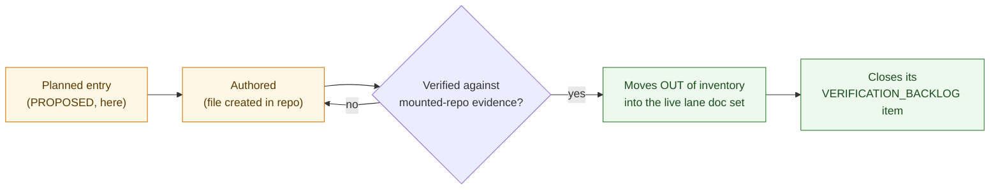

<!-- [KFM_META_BLOCK_V2]
doc_id: kfm://doc/domains/hazards/missing-or-planned-files/readme
title: Hazards Domain — Missing or Planned Files (inventory index)
type: standard
version: v1
status: draft
owners: <hazards-domain-steward>, <docs-steward>, <verification-steward>   # placeholders pending owner-registry verification
created: 2026-06-05
updated: 2026-06-05
policy_label: public
contract_version: "3.0.0"   # pinned per ai-build-operating-contract.md
related:
  - docs/domains/hazards/README.md
  - docs/domains/hazards/SOURCE_REGISTRY/README.md
  - docs/domains/hazards/VERIFICATION_BACKLOG.md
  - docs/domains/habitat/MISSING_OR_PLANNED_FILES.md
  - docs/doctrine/directory-rules.md
  - schemas/contracts/v1/domains/hazards/
  - contracts/domains/hazards/
  - policy/domains/hazards/
  - policy/release/hazards/
  - data/registry/sources/hazards/
  - ai-build-operating-contract.md
tags: [kfm, domain:hazards, missing-files, planned-files, inventory, governance, needs-verification]
notes:
  - "FOLDER + CASING: requested as docs/domains/hazards/missing_or_planned_files/README.md — folder form (permitted, §6.1.a) with a lowercase_with_underscores folder name. The domain-suite member name is MISSING_OR_PLANNED_FILES; Directory Rules §6.1.a recommends UPPERCASE for doc artifacts. The lowercase folder + file-vs-folder choice is a low-stakes casing/structure drift item, tracked as OQ-HAZ-MPF-01 (same class as OPEN-DR-04). Honored as requested; flagged not split."
  - "INVENTORY DOC: every file listed here is PROPOSED / planned / NOT YET CREATED by definition. Nothing here asserts a file exists. This is the lane's gap inventory, derived from the Hazards dossier §B/§D/§E/§J/§K/§M/§N and the standard domain-suite pattern."
  - "EMERGENCY-ALERT BOUNDARY (hard): KFM Hazards is never an alert authority; planned files must encode warning/advisory/watch as CONTEXT, never instruction."
  - "Expected schema/contract/policy homes follow Atlas §24.13 (hazards) and Directory Rules §12 segment form. CONTRACT_VERSION = \"3.0.0\"."
[/KFM_META_BLOCK_V2] -->

# ⚠️ Hazards Domain — Missing or Planned Files

> The Hazards lane's **gap inventory**: every file the domain intends to create but has not yet — schemas, contracts, policy bundles, registry entries, validators, fixtures, runbooks, and viewing/release artifacts. This is the folder index for `docs/domains/hazards/missing_or_planned_files/`. **Nothing listed here is asserted to exist.**

  <b>Every entry is PROPOSED / planned · Nothing asserted as built · Emergency-alert boundary applies to all planned surfaces</b>

<!-- TODO: replace static badges with CI-driven Shields endpoints once owners + repo are verified (NEEDS VERIFICATION). -->

**Status:** draft &middot; **Owners:** hazards steward · docs steward · verification steward *(placeholders)* &middot; **Contract:** `CONTRACT_VERSION = "3.0.0"` &middot; **Last updated:** 2026-06-05

> [!IMPORTANT]
> **This is an inventory of gaps, not an assertion of existence.** Every file named here is **PROPOSED** / planned / not yet created. A path appearing in this inventory is a *plan to author*, never evidence that the file is in the repo. When a planned file is actually created and verified, it moves out of this inventory and into the lane's live doc set. **(CONFIRMED posture — Evidence Rule; memory/plan is not proof.)**

> [!WARNING]
> **KFM Hazards is never an emergency-alert authority.** Every planned surface below — viewing products, Focus Mode, API resolvers — must encode NWS/FEMA operational content as **Context** (a record that a warning/declaration was issued), never as a live alert or life-safety instruction. KFM used as a life-safety instruction is a `DENY`. **(CONFIRMED — Atlas §20.5; Hazards dossier §B.)**

---

## Contents

1. [Purpose & the inventory's role](#1-purpose--the-inventorys-role)
2. [Casing & folder-form note](#2-casing--folder-form-note)
3. [How an entry leaves this inventory](#3-how-an-entry-leaves-this-inventory)
4. [Planned — documentation suite](#4-planned--documentation-suite)
5. [Planned — contracts (object meaning)](#5-planned--contracts-object-meaning)
6. [Planned — schemas (machine shape)](#6-planned--schemas-machine-shape)
7. [Planned — policy & release gates](#7-planned--policy--release-gates)
8. [Planned — registry & data lifecycle](#8-planned--registry--data-lifecycle)
9. [Planned — validators & fixtures](#9-planned--validators--fixtures)
10. [Planned — viewing, API & runbooks](#10-planned--viewing-api--runbooks)
11. [Open questions register](#11-open-questions-register)
12. [Open verification backlog](#12-open-verification-backlog)
13. [Changelog & definition of done](#13-changelog--definition-of-done)
14. [Related docs](#14-related-docs)

---

## 1. Purpose & the inventory's role

This document is the Hazards lane's **missing-or-planned-files inventory** — the domain-suite `MISSING_OR_PLANNED_FILES` member. It answers "what does the Hazards lane still need to author, and where will each piece live?" It is derived from the Hazards dossier (§B object families, §D source families, §J API/schema surfaces, §K validators, §M publication, §N backlog) and the standard domain-suite pattern.

| This inventory does | This inventory does NOT |
|---|---|
| List planned files with their expected responsibility-root home. | Assert any file exists (everything is PROPOSED). |
| Map each planned file to its doctrine basis. | Author or place the files. |
| Track which planned files block which capabilities. | Decide schema/policy content (that is `contracts/`/`schemas/`/`policy/`). |
| Feed the lane verification backlog and central registers. | Substitute for verification — closure needs the real file. |

> [!NOTE]
> This inventory pairs with the lane's **verification backlog** (`VERIFICATION_BACKLOG.md`): the backlog tracks *what must be checked*, this inventory tracks *what must be created*. A planned file here that is authored and verified closes the corresponding backlog item.

[⬆ back to top](#top)

---

## 2. Casing & folder-form note

> [!NOTE]
> **OQ-HAZ-MPF-01 (low-stakes drift).** This was requested at `docs/domains/hazards/missing_or_planned_files/README.md` — a **folder** (permitted by Directory Rules §6.1.a) with a **lowercase_with_underscores** name. The domain-suite member name is `MISSING_OR_PLANNED_FILES`, and §6.1.a recommends `UPPERCASE` for doc artifacts; lowercase folder names are a known casing irregularity (the OPEN-DR-04 / OPEN-ENC-05 class). It is honored as requested and flagged, not silently renamed — the casing/structure is a per-root-README decision, not a placement-root conflict. Both the casing (`missing_or_planned_files/` vs `MISSING_OR_PLANNED_FILES.md`) and the file-vs-folder choice (cf. the Hazards `SOURCE_REGISTRY/` folder and the Habitat single-file members) should be reconciled lane-wide.

[⬆ back to top](#top)

---

## 3. How an entry leaves this inventory

An entry leaves this inventory only when the file is **authored AND verified** against admissible repo evidence — not when it is merely planned in more detail. **(CONFIRMED — Verification Threshold; doc-only resolution is not closure.)**

[⬆ back to top](#top)

---

## 4. Planned — documentation suite

The standard domain-suite docs for the Hazards lane. **All PROPOSED.** Path form per Directory Rules §12 (segment); casing per OQ-HAZ-MPF-01.

| Planned file | Expected home | Doctrine basis | Status |
|---|---|---|---|
| Lane README | `docs/domains/hazards/README.md` | domain-suite | PROPOSED |
| Architecture | `docs/domains/hazards/ARCHITECTURE.md` | domain-suite | PROPOSED |
| Canonical paths | `docs/domains/hazards/CANONICAL_PATHS.md` | domain-suite | PROPOSED |
| Data lifecycle | `docs/domains/hazards/DATA_LIFECYCLE.md` | dossier §H | PROPOSED |
| Identity model | `docs/domains/hazards/IDENTITY_MODEL.md` | dossier §E identity rules | PROPOSED |
| Cross-lane relations | `docs/domains/hazards/CROSS_LANE_RELATIONS.md` | dossier §F; §24.4.10 | PROPOSED |
| Sensitivity | `docs/domains/hazards/SENSITIVITY.md` | §20.5 alert boundary; infra deny | PROPOSED |
| Reason codes | `docs/domains/hazards/REASON_CODES.md` | §24.6.3 + alert-boundary code | PROPOSED |
| Release index | `docs/domains/hazards/RELEASE_INDEX.md` | dossier §M | PROPOSED |
| Source registry (folder) | `docs/domains/hazards/SOURCE_REGISTRY/` | dossier §D | PROPOSED *(index authored)* |
| Source families | `docs/domains/hazards/SOURCE_FAMILIES.md` | dossier §D | PROPOSED |
| Verification backlog | `docs/domains/hazards/VERIFICATION_BACKLOG.md` | dossier §N | PROPOSED |
| Map/UI contracts | `docs/domains/hazards/MAP_UI_CONTRACTS.md` | dossier §G | PROPOSED |
| This inventory (folder) | `docs/domains/hazards/missing_or_planned_files/` | domain-suite | PROPOSED *(index authored)* |

[⬆ back to top](#top)

---

## 5. Planned — contracts (object meaning)

The Hazards object families (dossier §B/§E) need semantic contracts under `contracts/domains/hazards/` (Markdown meaning, not schema). **All PROPOSED.**

| Object family | Planned contract | Status |
|---|---|---|
| Hazard Event | `contracts/domains/hazards/hazard_event.md` | PROPOSED |
| Hazard Observation | `contracts/domains/hazards/hazard_observation.md` | PROPOSED |
| Warning Context / Advisory Context / Operational Watch | `contracts/domains/hazards/warning_context.md` *(et al.)* | PROPOSED — **Context, never alert** |
| Disaster Declaration | `contracts/domains/hazards/disaster_declaration.md` | PROPOSED |
| Flood Context | `contracts/domains/hazards/flood_context.md` | PROPOSED — **not observed inundation** |
| Wildfire Detection | `contracts/domains/hazards/wildfire_detection.md` | PROPOSED |
| SmokeContext | `contracts/domains/hazards/smoke_context.md` | PROPOSED |
| Drought Indicator | `contracts/domains/hazards/drought_indicator.md` | PROPOSED |
| Earthquake Event | `contracts/domains/hazards/earthquake_event.md` | PROPOSED |
| Heat Cold Event | `contracts/domains/hazards/heat_cold_event.md` | PROPOSED |
| Exposure Summary / Resilience Summary | `contracts/domains/hazards/exposure_summary.md` *(et al.)* | PROPOSED |
| Hazard Timeline / ImpactArea | `contracts/domains/hazards/hazard_timeline.md` *(et al.)* | PROPOSED |

> [!NOTE]
> `.schema.json` files **never** live under `contracts/` — those go to `schemas/` (§6). Contracts here are Markdown meaning only.

[⬆ back to top](#top)

---

## 6. Planned — schemas (machine shape)

Machine schemas live under `schemas/contracts/v1/domains/hazards/` (ADR-0001 default; Atlas §24.13 lists `schemas/contracts/v1/hazards/` flat — the §12-vs-§24.13 path-form conflict applies here too). **All PROPOSED.**

| Planned schema | Expected home (§12 segment) | Status |
|---|---|---|
| Hazard event / observation schemas | `schemas/contracts/v1/domains/hazards/hazard_event.schema.json` *(et al.)* | PROPOSED |
| Warning/advisory/watch context schemas | `.../domains/hazards/warning_context.schema.json` | PROPOSED |
| Flood-context schema | `.../domains/hazards/flood_context.schema.json` | PROPOSED |
| HazardDecisionEnvelope | `.../domains/hazards/hazard_decision_envelope.schema.json` | PROPOSED — dossier §J |
| ModelRunReceipt (hazard models) | `schemas/contracts/v1/receipts/...` *(ADR-S-03)* | PROPOSED |
| SourceDescriptor (shared) | `schemas/contracts/v1/source/source-descriptor.json` | PROPOSED — shared, not hazards-owned |

> [!CAUTION]
> **Path-form conflict (HAZ).** Directory Rules §12 uses the segment form `schemas/contracts/v1/domains/hazards/`; Atlas §24.13 crosswalk uses the flat form `schemas/contracts/v1/hazards/`. Atlas §24 tables are self-declared navigational, so the §12 segment form governs placement; the flat form is the drift candidate (logged in `DRIFT_REGISTER`).

[⬆ back to top](#top)

---

## 7. Planned — policy & release gates

Hazards admissibility and release policy. Atlas §24.13 explicitly assigns this lane a `policy/release/hazards/` lane. **All PROPOSED.**

| Planned policy | Expected home | Status |
|---|---|---|
| Hazards admissibility bundle | `policy/domains/hazards/` | PROPOSED |
| **Emergency-alert-boundary policy** | `policy/domains/hazards/alert_boundary.rego` *(deny KFM-as-alert / life-safety instruction)* | PROPOSED — **the lane's hard DENY** |
| NFHL-as-observed denial | `policy/domains/hazards/` | PROPOSED |
| Operational-warning-as-live-alert denial | `policy/domains/hazards/` | PROPOSED |
| `modeled_derivative`-as-observed denial | `policy/domains/hazards/` | PROPOSED |
| Hazards release gate | `policy/release/hazards/` | PROPOSED — §24.13 |
| Critical-infrastructure exposure deny (Settlements join) | `policy/sensitivity/infrastructure/` *(Settlements-owned)* | PROPOSED — §24.4.12 |

[⬆ back to top](#top)

---

## 8. Planned — registry & data lifecycle

Registry entries and the lifecycle homes for Hazards data. **All PROPOSED.**

| Planned artifact | Expected home | Status |
|---|---|---|
| Per-family SourceDescriptors (8) | `data/registry/sources/hazards/<family>/descriptor.json` | PROPOSED — dossier §D |
| Per-family registry entry docs (8) | `docs/domains/hazards/SOURCE_REGISTRY/<family>.md` | PROPOSED |
| RAW capture home | `data/raw/hazards/` | PROPOSED |
| WORK / QUARANTINE | `data/work/hazards/`, `data/quarantine/hazards/` | PROPOSED |
| PROCESSED | `data/processed/hazards/` | PROPOSED |
| CATALOG / TRIPLET | `data/catalog/domain/hazards/` | PROPOSED |
| PUBLISHED layers | `data/published/layers/hazards/` | PROPOSED |
| Receipts | `data/receipts/...` | PROPOSED |

[⬆ back to top](#top)

---

## 9. Planned — validators & fixtures

Hazards dossier §K names the validator/fixture families; the emergency-alert-boundary validator is the lane's signature check. **All PROPOSED.**

| Planned validator / fixture | Expected home | Status |
|---|---|---|
| **Emergency-alert-boundary denial** | `tools/validators/domains/hazards/` + fixtures | PROPOSED — deny KFM-as-alert / life-safety instruction |
| Source-descriptor tests | `tests/domains/hazards/` | PROPOSED |
| Source-role / anti-collapse tests | `tools/validators/domains/hazards/` | PROPOSED |
| NFHL-as-observed denial fixture | `fixtures/domains/hazards/invalid/` | PROPOSED |
| Operational-warning-as-live-alert denial fixture | `fixtures/domains/hazards/invalid/` | PROPOSED |
| `modeled_derivative`-as-observed denial fixture | `fixtures/domains/hazards/invalid/` | PROPOSED |
| Catalog-closure tests | `tests/domains/hazards/` | PROPOSED |
| No-network dry-run fixtures | `fixtures/domains/hazards/` | PROPOSED |
| Rollback-drill receipt | `tests/domains/hazards/` + `release/rollback_cards/` | PROPOSED |

[⬆ back to top](#top)

---

## 10. Planned — viewing, API & runbooks

Hazards viewing products (dossier §G), API surfaces (§J), and operational runbooks. **All PROPOSED.**

| Planned artifact | Expected home | Status |
|---|---|---|
| Hazard overlay registry / LayerManifest set | `data/published/layers/hazards/` + manifests | PROPOSED — **Context, never alert** |
| Hazard timeline view, exposure/resilience view | UI shell (`apps/explorer-web/...`) | PROPOSED |
| Hazard feature/detail resolver (HazardDecisionEnvelope) | governed API (`apps/governed-api/...`) | PROPOSED — §J |
| Hazard Evidence Drawer payload | governed API | PROPOSED — §J |
| Hazard Focus Mode (ANSWER/ABSTAIN/DENY/ERROR + AIReceipt) | governed API + `policy/runtime/` | PROPOSED — §J; **never an alert** |
| Source-refresh runbook | `docs/runbooks/hazards/SOURCE_REFRESH_RUNBOOK.md` | PROPOSED — §6.1.b runbook home (Pattern A) |
| Rollback-drill runbook | `docs/runbooks/hazards/` | PROPOSED |

> [!WARNING]
> Every planned viewing/API/Focus surface above inherits the emergency-alert boundary: it presents hazard content as **context with evidence**, never as a warning, instruction, or live alert. A planned surface that would do otherwise is mis-scoped before it is even authored. **(CONFIRMED — Atlas §20.5; dossier §B.)**

[⬆ back to top](#top)

---

## 11. Open questions register

| ID | Question | Owner role | Resolution path |
|---|---|---|---|
| OQ-HAZ-MPF-01 | Folder + lowercase_with_underscores casing (`missing_or_planned_files/`) vs `MISSING_OR_PLANNED_FILES.md`; file-vs-folder consistency across the lane and vs Habitat. | Directory steward + docs steward | Per-root README in `docs/domains/`; §6.1.a / OPEN-DR-04 class. |
| OQ-HAZ-MPF-02 | Path-form for hazards schema/contract/policy homes (§12 segment vs §24.13 flat). | Directory steward | DRIFT_REGISTER + ADR (§12 governs). |
| OQ-HAZ-MPF-03 | Which planned files are first-wave (thin-slice) vs later. | Hazards steward | Roadmap; pairs with the proof-lane phasing. |
| OQ-HAZ-MPF-04 | Does the emergency-alert-boundary policy live in `policy/domains/hazards/` or `policy/runtime/` (it gates both admission and runtime answers)? | Policy steward | ADR; both may carry a slice. |
| OQ-HAZ-MPF-05 | Relationship between this inventory and the central `MISSING_OR_PLANNED_FILES` register (if one exists). | Docs steward | Feeder vs standalone; per-root README. |
| OQ-HAZ-MPF-06 | Heat Cold Event contract/schema naming (single vs split heat/cold). | Hazards steward | Contract authoring. |

[⬆ back to top](#top)

---

## 12. Open verification backlog

These items remain `NEEDS VERIFICATION` before promotion from `draft` to `published`:

1. Casing/folder convention (OQ-HAZ-MPF-01) and the path-form conflict (OQ-HAZ-MPF-02).
2. Every entry in §4–§10 remains PROPOSED until the file is authored *and* verified — none asserted as existing.
3. Whether a central `MISSING_OR_PLANNED_FILES` register exists that this should feed (OQ-HAZ-MPF-05).
4. The emergency-alert-boundary policy and validator homes (OQ-HAZ-MPF-04; §7, §9).
5. Atlas §24.13 hazards responsibility-root homes vs the §12 segment form used here.
6. First-wave vs later phasing of the planned files (OQ-HAZ-MPF-03).
7. The Hazards lane README and verification backlog (referenced here) actually exist or are themselves planned.

[⬆ back to top](#top)

---

## 13. Changelog & definition of done

### 13.1 Changelog

| Change | Type (per contract §37) | Reason |
|---|---|---|
| Initial Hazards missing-or-planned-files **folder index**. | new | First planned-files inventory for the Hazards lane. |
| Honored the requested folder + lowercase casing; flagged as low-stakes drift (OQ-HAZ-MPF-01). | reconciliation | §6.1.a permits the folder form; lowercase is a known casing irregularity, surfaced not silently renamed. |
| Enumerated planned docs, contracts, schemas, policy, registry/data, validators, and viewing/API/runbooks (§4–§10) from the Hazards dossier §B/§D/§E/§G/§J/§K/§M. | gap closure | Establishes the lane's gap inventory against doctrine. |
| Marked **every entry PROPOSED**; added the "how an entry leaves" gate (§3). | clarification | Nothing asserted as existing; plan ≠ proof. |
| Led the alert-boundary discipline through every planned surface (§7, §9, §10). | safety | Atlas §20.5 — KFM is never an alert authority. |
| Surfaced the §12-vs-§24.13 path-form conflict for hazards (OQ-HAZ-MPF-02). | reconciliation | Consistent with the lane-wide path-form handling. |
| Pinned `CONTRACT_VERSION = "3.0.0"`. | housekeeping | Required for doctrine-adjacent docs. |

> **Backward compatibility.** New document — no prior anchors. Sibling to the Hazards `SOURCE_REGISTRY/` folder and the Habitat `MISSING_OR_PLANNED_FILES.md`; the casing/structure convention must be reconciled (OQ-HAZ-MPF-01).

### 13.2 Definition of done

This inventory is done enough to enter the repository when:

- the casing/folder convention (OQ-HAZ-MPF-01) and path-form conflict (OQ-HAZ-MPF-02) are resolved or logged in `docs/registers/DRIFT_REGISTER.md`;
- the hazards domain steward, docs steward, and verification steward review it;
- every entry is confirmed to be PROPOSED — none marked as existing without a citable repo artifact;
- it is linked from `docs/domains/hazards/README.md` and the lane verification backlog;
- the emergency-alert-boundary planned policy/validator (§7, §9) are tracked in the backlog;
- the relationship to any central planned-files register is decided (OQ-HAZ-MPF-05);
- the `GENERATED_RECEIPT.json` planned in the PR is wired into CI with `contract_version: "3.0.0"`;
- future changes follow the operating contract's §37 lifecycle.

[⬆ back to top](#top)

---

## 14. Related docs

**All targets PROPOSED until confirmed against a mounted repo; path form follows Directory Rules §12.**

- [`docs/domains/hazards/README.md`](../README.md) — Hazards lane orientation *(PROPOSED)*.
- [`docs/domains/hazards/SOURCE_REGISTRY/README.md`](../SOURCE_REGISTRY/README.md) — source-registry folder index (sibling folder form).
- `docs/domains/hazards/VERIFICATION_BACKLOG.md` — what must be *checked* (this inventory tracks what must be *created*) *(PROPOSED)*.
- [`docs/domains/habitat/MISSING_OR_PLANNED_FILES.md`](../../habitat/MISSING_OR_PLANNED_FILES.md) — sibling lane's single-file inventory (file-vs-folder comparison) *(PROPOSED)*.
- [`docs/doctrine/directory-rules.md`](../../../doctrine/directory-rules.md) — §5/§6.1.a/§12; casing (OPEN-DR-04).
- `schemas/contracts/v1/domains/hazards/` — planned schema home *(PROPOSED)*.
- `contracts/domains/hazards/` — planned contract home *(PROPOSED)*.
- `policy/domains/hazards/`, `policy/release/hazards/` — planned policy homes *(PROPOSED; §24.13)*.
- `data/registry/sources/hazards/` — planned registry home *(PROPOSED)*.
- [`ai-build-operating-contract.md`](../../../../ai-build-operating-contract.md) — §20.5 emergency-alert boundary; canonical operating contract (`CONTRACT_VERSION = "3.0.0"`).

---

**Last updated:** 2026-06-05 &middot; **Status:** draft &middot; **Contract:** `CONTRACT_VERSION = "3.0.0"` &middot; **Role:** planned-files inventory (folder index) &middot; **Every entry:** PROPOSED / not yet created &middot; **Hard boundary:** KFM is never an emergency-alert authority &middot; **Citation short-names:** [DOM-HAZ], [DOM-HYD], [DOM-SETTLE], [ENCY], [DIRRULES], [GAI]

[⬆ back to top](#top)
