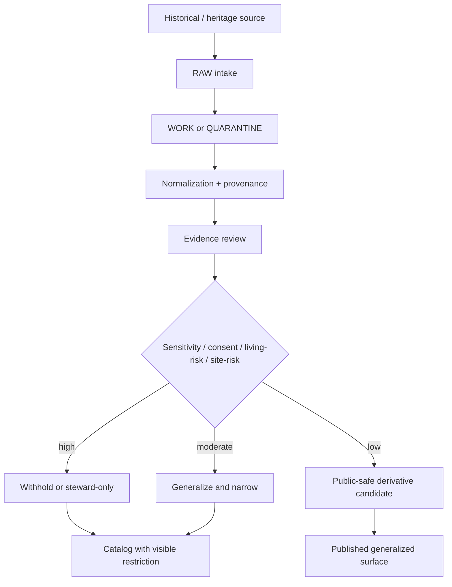
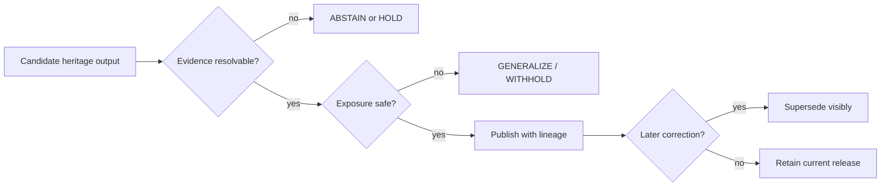

<!--
doc_id: NEEDS VERIFICATION
title: Heritage Domain
type: standard
version: v1
status: draft
owners: [@bartytime4life, NEEDS VERIFICATION]
created: NEEDS VERIFICATION
updated: 2026-04-02
policy_label: public
related: [
  docs/domains/README.md,
  docs/governance/ROOT_GOVERNANCE.md,
  docs/governance/ETHICS.md,
  docs/governance/SOVEREIGNTY.md,
  docs/domains/heritage/gedcom-intake-mapping.md
]
tags: [kfm, heritage, archives, genealogy, sensitivity, provenance, geoprivacy]
notes: [
  "Proposed lane README for heritage materials; exact lane name and path need repo verification.",
  "Designed to pair with GEDCOM intake and privacy mapping guidance.",
  "Avoids claiming implementation or publication readiness not confirmed in repo."
]
-->

# Heritage Domain

**Purpose:** define the KFM heritage lane as a governed home for historical, genealogical, cultural, archival, and place-linked materials that require evidence visibility and exposure controls.

**Repo fit:** **PROPOSED** path: `docs/domains/heritage/README.md`  
**Upstream:** archives, family-history exports, oral-history materials, cemetery and memorial references, migration traces, local historical records, steward instructions  
**Downstream:** generalized public maps, evidence-bound dossiers, controlled overlays, steward-reviewed releases, domain-specific intake standards

> [!IMPORTANT]
> Heritage materials are **not publish-by-default**. Historical usefulness does not erase privacy, cultural sensitivity, community stewardship, or living-person risk.

---

## Status / impact

**Status:** `experimental`  
**Owners:** `@bartytime4life`, `NEEDS VERIFICATION`  
**Scope badges:**    

**Quick jumps:** [Scope](#scope) · [Repo fit](#repo-fit) · [Inputs](#accepted-inputs) · [Exclusions](#exclusions) · [Directory](#directory-view) · [Operating posture](#operating-posture) · [Documents](#lane-documents) · [Exposure classes](#exposure-classes) · [Task list](#task-list)

---

## Scope

The heritage lane exists for materials where **time, place, memory, identity, and stewardship** intersect. These materials often look deceptively simple in file form—spreadsheets, exports, scans, coordinates, narrative notes—but they carry elevated risk when recombined into searchable, mapped, or inferential surfaces.

This lane is intended for:

- historical records tied to people, families, settlements, routes, or communities,
- genealogical exports and their derived place/time products,
- archival references that may contain sensitive names, locations, or affiliations,
- cemetery, memorial, burial, and commemorative materials,
- migration, settlement, and kinship-linked documentation,
- oral history or related interpretive materials where place or identity sensitivity exists.

This lane is **not** a license to turn all historical data into public overlays. It is a governance and documentation surface for handling such materials correctly.

[Back to top](#heritage-domain)

---

## Repo fit

| Field | Value |
|---|---|
| Proposed path | `docs/domains/heritage/README.md` |
| Alternate plausible placement | `docs/domains/archives/README.md` |
| Adjacent root index | `docs/domains/README.md` |
| Key governance anchors | `docs/governance/ROOT_GOVERNANCE.md`, `docs/governance/ETHICS.md`, `docs/governance/SOVEREIGNTY.md` |
| Immediate companion standard | `docs/domains/heritage/gedcom-intake-mapping.md` |
| Verification state | `NEEDS VERIFICATION` |

### Why this lane exists

KFM’s core doctrine favors:

- **evidence before persuasion,**
- **context before compression,**
- **stewardship before exposure,**
- **correction before quiet supersession.**

Heritage materials stress all four at once. A scanned register, family export, cemetery table, or local-history map may be historically valuable while still being too specific, too inferential, or too sensitive for public release in raw form.

[Back to top](#heritage-domain)

---

## Accepted inputs

| Input class | Examples | Status |
|---|---|---|
| genealogical exports | GEDCOM 5.5.1, GEDCOM 7.x, GEDZIP | `INFERRED` |
| archival texts and scans | registers, transcriptions, index cards, county histories, letters | `PROPOSED` |
| memorial / cemetery records | burial registers, plot lists, memorial datasets | `PROPOSED` |
| oral-history support materials | interview indexes, consent notes, place references | `PROPOSED` |
| migration / settlement records | rosters, route traces, community movement summaries | `PROPOSED` |
| steward guidance | release notes, restrictions, community review instructions | `PROPOSED` |

> [!NOTE]
> “Accepted input” here means the lane is conceptually responsible for the material type. It does **not** prove every listed source class already has active ingestion code in the repo.

---

## Exclusions

This lane excludes the following from default public treatment:

- exact home addresses or modern residence histories,
- precise coordinates for culturally sensitive or vulnerable sites,
- inferred ethnicity, religion, tribal/community identity, or kinship-sensitive claims not explicitly supported,
- living-person personal detail published from convenience exports,
- decorative 3D/2.5D treatment that weakens evidence, policy, or correction visibility,
- sovereign use of derived overlays where the authoritative record remains narrower or disputed.

---

## Directory view

```text
docs/
└── domains/
    ├── README.md
    ├── heritage/                           # PROPOSED
    │   ├── README.md                       # this file
    │   ├── gedcom-intake-mapping.md        # PROPOSED companion
    │   ├── fixtures/                       # PROPOSED
    │   └── examples/                       # PROPOSED
    └── archives/                           # alternate plausible lane
        └── ...
```

---

## Operating posture



### Domain rule

Heritage outputs should prefer:

- generalized place over exact place,
- bounded dates over exact dates when risk exists,
- visible uncertainty over polished certainty,
- steward review over inertia,
- evidence-linked correction over silent replacement.

---

## Lane documents

| Document | Role | Status |
|---|---|---|
| `docs/domains/heritage/README.md` | lane overview and posture | `PROPOSED` |
| `docs/domains/heritage/gedcom-intake-mapping.md` | genealogy export intake standard | `PROPOSED` |
| `docs/domains/heritage/fixtures/README.md` | parser and redaction fixtures | `PROPOSED` |
| `docs/domains/heritage/examples/README.md` | safe examples and release patterns | `PROPOSED` |
| related governance docs | doctrine anchors | `INFERRED` |

---

## Exposure classes

Public release decisions in this lane should be explicit. The following classes are recommended.

| Exposure class | Meaning | Typical use |
|---|---|---|
| `public_safe` | suitable for broad release | generalized, non-reidentifying summaries |
| `generalized` | releasable only after narrowing place/time/detail | public maps, timelines, counts |
| `steward_only` | visible only to authorized reviewers/stewards | precise site-linked or identity-sensitive material |
| `restricted_precise` | exact details retained internally under policy | internal evidence handling |
| `withheld` | not published | unsafe, revoked, contested, or unconsented material |

### Disclosure rule of thumb

When uncertainty exists, choose one of:

- `generalized`
- `steward_only`
- `withheld`

rather than silently publishing a finer-grained derivative.

---

## Typical material patterns

### 1) Genealogy and kinship-linked exports

These often contain:

- living/deceased mixtures,
- exact residences,
- relationship chains,
- burial or memorial locations,
- vendor-specific privacy flags.

Use the companion GEDCOM standard for intake and mapping.

### 2) Cemetery and memorial datasets

These may appear “historical” but can still expose:

- precise site coordinates,
- family clustering,
- recent burials,
- community-specific vulnerable heritage locations.

Default to generalized public views unless a stronger release basis exists.

### 3) Oral-history support materials

These can create identity or location risk even when transcripts are not public. Avoid public exact-place linkage when that would expose narrators, descendants, or culturally sensitive locations.

### 4) Migration and settlement surfaces

These are often valuable for public interpretation, but should privilege aggregated routes, regional flows, and bounded time windows over person-level traceability.

---

## Domain questions this lane should answer

A mature heritage lane should help answer:

- what kind of historical material are we handling,
- what is authoritative versus derived,
- what can be safely generalized for public use,
- what must stay internal or steward-routed,
- how do corrections, withdrawals, and revocations stay visible,
- how do place/time products avoid quietly disclosing sensitive details.

---

## Minimum publication posture



### Required public-surface behaviors

| Requirement | Why it matters |
|---|---|
| visible uncertainty | prevents historical overclaim |
| visible narrowing | makes policy action legible |
| visible correction lineage | avoids quiet supersession |
| evidence route for consequential claims | supports trust |
| no exact sensitive geographies by default | prevents exposure by map polish |

---

## Quickstart

```text
1. Classify the source as heritage-sensitive or not.
2. Preserve provenance before transformation.
3. Separate authoritative source facts from derived summaries.
4. Assess living-person, site, and cultural sensitivity.
5. Generalize place/time before public release.
6. Publish only evidence-resolvable claims.
7. Keep correction and withdrawal lineage visible.
```

---

## Usage

### When to place a document in this lane

Use this lane when the document concerns:

- historical people or family-linked place/time records,
- culturally sensitive heritage geography,
- archival materials that need exposure controls,
- documentation for how such sources are ingested, generalized, or published.

### When **not** to place a document in this lane

Prefer another lane when the material is primarily:

- hydrology, hazards, climate, or ecology without heritage sensitivity,
- generic ingestion/platform architecture not specific to heritage material,
- public-domain historical narrative with no location/identity sensitivity and no lane-specific governance needs.

---

## Truth labels in this lane

KFM truth labels should be used literally at point of use.

| Label | Meaning in this lane |
|---|---|
| `CONFIRMED` | directly supported by doctrine or visible repo evidence |
| `INFERRED` | strongly implied by doctrine but not implementation-verified |
| `PROPOSED` | recommended target state or new lane shape |
| `UNKNOWN` | no reliable evidence available |
| `NEEDS VERIFICATION` | requires in-repo confirmation before merge |

---

## FAQ

### Why not keep this under a generic archives or ingestion path?

That may still be the correct final placement. This README proposes a dedicated heritage lane because the dominant problem is not file format management; it is **governed historical exposure**.

### Is “historical” automatically safe?

No. Historical materials can still expose living descendants, culturally sensitive locations, or community-vulnerable patterns.

### Are public maps allowed in this lane?

Yes, but only when they preserve KFM trust posture: generalized when necessary, evidence-linked, correction-capable, and visibly narrowed where policy requires it.

### Does this lane govern final release for every downstream use?

No. This lane defines posture and documentation expectations. Final release decisions still depend on downstream policy, audience, and implementation controls.

---

## Task list

- [ ] **NEEDS VERIFICATION:** confirm whether `heritage/` already exists
- [ ] **NEEDS VERIFICATION:** confirm whether this lane should instead live under `archives/`
- [ ] **NEEDS VERIFICATION:** align owners with `.github/CODEOWNERS`
- [ ] link this README from `docs/domains/README.md`
- [ ] add companion standards and examples
- [ ] define exposure-class glossary shared with adjacent sensitive domains
- [ ] add domain-specific examples for cemetery, oral-history, and migration materials
- [ ] confirm public/restricted policy label expectations for lane docs

### Definition of done

- [ ] lane path is confirmed
- [ ] adjacent links resolve
- [ ] companion standard paths are validated
- [ ] no unverified implementation claims remain unlabeled
- [ ] examples reflect actual repo conventions

[Back to top](#heritage-domain)

---

## Appendix

<details>
<summary><strong>Related companion docs</strong></summary>

**PROPOSED** immediate companions:

- `docs/domains/heritage/gedcom-intake-mapping.md`
- `docs/domains/heritage/fixtures/README.md`
- `docs/domains/heritage/examples/README.md`

Potential cross-links:

- `docs/governance/ROOT_GOVERNANCE.md`
- `docs/governance/ETHICS.md`
- `docs/governance/SOVEREIGNTY.md`
- `docs/domains/README.md`

</details>

<details>
<summary><strong>Editorial note</strong></summary>

This lane README intentionally avoids claiming that a heritage ingestion pipeline, enforcement gate, or publication UI already exists unless such implementation is visible in-repo. The lane is documented here as a governed domain shape consistent with KFM doctrine.

</details>
