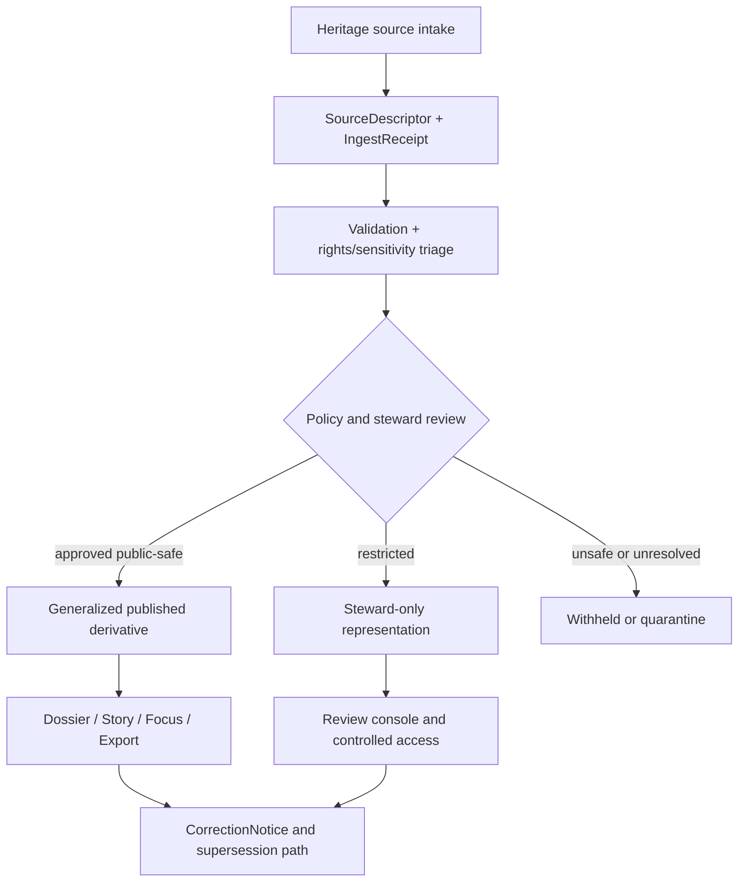

<!-- [KFM_META_BLOCK_V2]
doc_id: kfm://doc/NEEDS-VERIFICATION-heritage-lane-readme
title: KFM Heritage Domain Lane
type: standard
version: v1
status: draft
owners: [@bartytime4life, NEEDS VERIFICATION]
created: NEEDS VERIFICATION
updated: 2026-04-10
policy_label: public
related: [../README.md, ../archives-heritage/README.md, ../../architecture/TRUTH_PATH_LIFECYCLE.md, ../../architecture/TRUST_MEMBRANE.md, ../../governance/ROOT_GOVERNANCE.md, ./sources.md, ./rights-and-sensitivity.md, ./entity-and-evidence-model.md, ./publication-and-review.md, ./roadmap.md, ./gedcom-intake-mapping.md, ./gedcom-map-timeline-pipeline.md, ./examples/README.md, ./fixtures/README.md]
tags: [kfm, domains, heritage, archives, oral-history, public-memory, evidence-governance]
notes: [Built from existing heritage lane drafts plus repo-visible architecture and domains doctrine., Keeps CONFIRMED/INFERRED/PROPOSED/UNKNOWN/NEEDS VERIFICATION distinctions explicit and avoids implementation overclaiming.]
[/KFM_META_BLOCK_V2] -->

# KFM Heritage Domain Lane

Heritage in KFM is a **governed evidence lane** for documentary and memory-bearing materials that require explicit provenance, rights, sensitivity, and review handling before publication.

> [!IMPORTANT]
> **Doctrinal baseline for this lane:** [`../../architecture/TRUTH_PATH_LIFECYCLE.md`](../../architecture/TRUTH_PATH_LIFECYCLE.md) and [`../../architecture/TRUST_MEMBRANE.md`](../../architecture/TRUST_MEMBRANE.md). Heritage content must stay downstream of evidence, policy, review, and correction, not narrative convenience.

## Scope and lane fit

- **CONFIRMED:** KFM doctrine treats archives/newspapers/oral-history/public-memory/heritage as a structural burdened lane in domain guidance. 
- **CONFIRMED:** `docs/domains/heritage/` exists in this repository and already contains lane-specific docs.
- **INFERRED:** this subtree is a focused split of the broader `archives-heritage` burden described in `docs/domains/README.md`.
- **NEEDS VERIFICATION:** final long-term split decision between `archives-heritage/` and `heritage/` as canonical lane root.

Heritage-lane evidence includes, but is not limited to:

- archival description, scans, map sheets, and captions
- newspapers and clipping records
- oral history transcripts and audio-linked records
- genealogy-linked documentary records (with strict disclosure handling)
- commemorative and public-memory documentation
- heritage documentation packages (including 2.5D/3D where warranted)

## Source-role taxonomy (lane-specific)

| Source role | What it means in heritage lane | Core restriction |
|---|---|---|
| Documentary / archival | Primary records, scans, finding aids, transcripts, newspapers, captions | Must retain context and locator trace; never flatten into unsupported fact tables. |
| Community-contributed | Community memory, local submissions, oral-history contributions | Governed input only; never auto-promoted as truth without review and evidence linkage. |
| Statutory / administrative | Register entries, legal designations, administrative listings | Administrative status is not full interpretive truth; keep scope explicit. |
| Direct observational / field | Site notes, survey observations, steward field documentation | Requires chain-of-custody and sensitivity review before publication. |
| Modeled / derived | OCR, entity extraction, summaries, embeddings, reconstructions | Must be visibly derived and linked back to inspectable source evidence. |
| Mirror / discovery service | Index portals and discovery mirrors | Discovery aid only; do not treat mirror metadata as authority by default. |

For detailed role handling and examples, use [`./sources.md`](./sources.md).

## Rights and sensitivity summary

Heritage lane is **not publish-by-default**.

- Rights posture, reuse constraints, and quote safety are first-class publication gates.
- Culturally sensitive material and exact-location exposure are explicit risk classes.
- Generalized/public-safe derivatives are preferred when precise disclosure creates harm.
- Steward-only and withheld outcomes are valid, expected outcomes.

Detailed rules and example handling are in [`./rights-and-sensitivity.md`](./rights-and-sensitivity.md).

## Publication surfaces and trust rules

| Surface | Allowed heritage output | Must remain visible |
|---|---|---|
| Dossier | Evidence-linked summary claims | Evidence route, uncertainty, correction state |
| Story surface | Bounded narrative claims | Claim-to-evidence linkage; no unsupported certainty upgrade |
| Evidence Drawer | Source and support inspection | Locator, provenance, rights/sensitivity posture |
| Focus Mode | Bounded synthesis over released scope | Citations, finite outcomes, policy-bounded response envelope |
| Export | Release-scoped derivative package | Release lineage, disclosure class, correction linkage |
| Review / Stewardship | Restricted and precise handling | Decision record, reviewer action, rationale, escalation path |

Detailed publication model: [`./publication-and-review.md`](./publication-and-review.md).

## Directory map

```text
docs/domains/heritage/
├── README.md                            # lane definition and routing (this file)
├── sources.md                           # source-role discipline and source-family handling
├── rights-and-sensitivity.md            # rights, quote safety, sensitivity, and disclosure policy
├── entity-and-evidence-model.md         # entity families, evidence objects, and trust artifacts
├── publication-and-review.md            # publication surfaces, review gates, correction posture
├── roadmap.md                           # open unknowns and next artifacts
├── gedcom-intake-mapping.md             # genealogy intake mapping standard
├── gedcom-map-timeline-pipeline.md      # map/timeline downstream pipeline standard
├── examples/
│   └── README.md
└── fixtures/
    └── README.md
```

## Working lane flow



## Contributor guidance

1. Keep claim-bearing text tethered to inspectable documentary evidence.
2. Preserve original context before extraction, summary, or visualization.
3. Use explicit status labels (`CONFIRMED`, `INFERRED`, `PROPOSED`, `UNKNOWN`, `NEEDS VERIFICATION`) when certainty differs.
4. Do not import hydrology-style public-safe assumptions into heritage; this lane has a higher disclosure burden.
5. Prefer narrow, link-rich edits over broad speculative rewrites.

## Verification backlog (open unknowns)

- **UNKNOWN:** executable schema location for all heritage-specific objects.
- **NEEDS VERIFICATION:** implemented workflow checks that enforce quote safety and sensitivity publication gates.
- **NEEDS VERIFICATION:** lane-specific policy bundles tied to heritage disclosure classes.
- **UNKNOWN:** complete source descriptor registry for heritage source families.
- **NEEDS VERIFICATION:** canonical owner list and reviewer/steward rota for this lane.

## Related docs

- Domains hub: [`../README.md`](../README.md)
- Adjacent combined lane: [`../archives-heritage/README.md`](../archives-heritage/README.md)
- Doctrine baseline: [`../../architecture/TRUTH_PATH_LIFECYCLE.md`](../../architecture/TRUTH_PATH_LIFECYCLE.md), [`../../architecture/TRUST_MEMBRANE.md`](../../architecture/TRUST_MEMBRANE.md)
- Governance anchors: [`../../governance/ROOT_GOVERNANCE.md`](../../governance/ROOT_GOVERNANCE.md), [`../../governance/ETHICS.md`](../../governance/ETHICS.md), [`../../governance/SOVEREIGNTY.md`](../../governance/SOVEREIGNTY.md)

