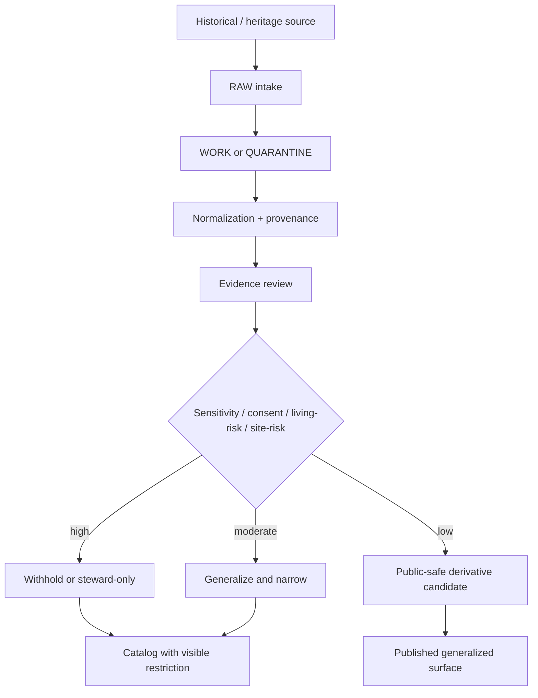

<!-- [KFM_META_BLOCK_V2]
doc_id: NEEDS VERIFICATION
title: Heritage Domain
type: standard
version: v1
status: draft
owners: [@bartytime4life, NEEDS VERIFICATION]
created: NEEDS VERIFICATION
updated: 2026-04-02
policy_label: public
related: [docs/domains/README.md, docs/governance/ROOT_GOVERNANCE.md, docs/governance/ETHICS.md, docs/governance/SOVEREIGNTY.md, docs/domains/heritage/gedcom-intake-mapping.md]
tags: [kfm, heritage, archives, oral-history, genealogy, provenance, geoprivacy]
notes: ["Repo tree was not mounted in this session; path, owners, created date, and companion-file existence remain NEEDS VERIFICATION.", "Grounded in the uploaded heritage draft and March 2026 KFM atlas/manual doctrine; avoids claiming mounted implementation."]
[/KFM_META_BLOCK_V2] -->

# Heritage Domain

_Governed lane for archives, oral histories, public memory, genealogy, and heritage-sensitive place-linked materials._

> **Lane status:** `experimental`  
> **Doc status:** `draft`  
> **Owners:** `@bartytime4life`, `NEEDS VERIFICATION`  
> **Repo fit:** **PROPOSED** path `docs/domains/heritage/README.md`  
> **Workspace evidence limit:** current-session repo tree not mounted; adjacent files, CODEOWNERS, and path existence remain `NEEDS VERIFICATION`

   

**Quick jumps:** [Scope](#scope) · [Repo fit](#repo-fit) · [Inputs](#accepted-inputs) · [Exclusions](#exclusions) · [Source ecosystem](#representative-source-ecosystem) · [Directory tree](#directory-tree) · [Quickstart](#quickstart) · [Usage](#usage) · [Operating posture](#operating-posture) · [Exposure classes](#exposure-classes) · [Companion docs](#companion-docs) · [Task list](#task-list) · [FAQ](#faq) · [Appendix](#appendix)

> [!IMPORTANT]
> Heritage material is **not publish-by-default**. Historical value does not erase privacy, cultural sensitivity, living-person risk, descendant risk, or exact-location exposure.

> [!NOTE]
> In KFM doctrine, archives, newspapers, oral histories, public memory, and heritage are a **structural operating lane**, not a decorative content tag. Documentary evidence must keep context, provenance, rights posture, and reuse limits visible at the point of use.

## Scope

This lane exists for materials where **time, place, memory, identity, and stewardship** intersect. Many of these artifacts look deceptively simple in file form—spreadsheets, scans, transcripts, coordinates, family exports, notes, or map sheets—but they become higher-risk once they are recombined into searchable, mapped, inferential, or story-facing surfaces.

Use this lane for materials such as:

- historical records tied to people, families, settlements, routes, or communities
- genealogical exports and their derived place/time products
- archival references containing sensitive names, locations, affiliations, or narrative context
- cemetery, memorial, burial, and commemorative materials
- oral-history support materials and transcript-linked place evidence
- migration, settlement, and kinship-linked documentation
- heritage documentation bundles such as scans, orthophotos, 2.5D surfaces, georeferenced meshes, CT-derived volumes, and interpretive reconstructions

This lane is a **governance and documentation surface**, not a blanket license to turn historical material into public overlays. KFM’s archival and heritage doctrine is explicit on three points:

1. keep the original artifact first
2. treat OCR cleanup, entity extraction, and interpretive summarization as separate downstream lanes
3. do not let narrative convenience erase provenance, rights, or sensitivity context

## Repo fit

| Field | Value |
|---|---|
| Target path | `docs/domains/heritage/README.md` |
| Alternate plausible placement | `docs/domains/archives/README.md` |
| Parent domain index | [`../README.md`][domains-readme] |
| Governance anchors | [`../../governance/ROOT_GOVERNANCE.md`][root-governance], [`../../governance/ETHICS.md`][ethics], [`../../governance/SOVEREIGNTY.md`][sovereignty] |
| Immediate companion | [`./gedcom-intake-mapping.md`][gedcom-intake] |
| Downstream fit | generalized public maps, evidence-linked story surfaces, dossier context, steward review, release/correction documentation |
| Verification state | `NEEDS VERIFICATION` |

This README is intentionally written so it can survive either of two repo outcomes:

- a dedicated `heritage/` lane
- an eventual merge into a broader `archives/` lane

The mounted corpus supports the **lane concept** strongly. It does **not** prove the mounted repo path in this session.

## Accepted inputs

| Input class | Examples | Status |
|---|---|---|
| genealogical exports | GEDCOM 5.5.1, GEDCOM 7.x, GEDZIP | `INFERRED` |
| archival texts and scans | registers, letters, diaries, reports, index cards, county histories, map sheets | `CONFIRMED` |
| newspapers and captions | OCR text, image captions, event coverage, timeline enrichment material | `CONFIRMED` |
| oral-history support materials | interview indexes, transcripts, consent notes, place references, streaming/audio companions | `CONFIRMED` |
| memorial / cemetery records | burial registers, memorial datasets, plot lists, recent-burial-sensitive records | `PROPOSED` |
| heritage documentation bundles | scan + image derivative + 2.5D/3D package + interpretive companion | `CONFIRMED` |
| steward guidance | release notes, restrictions, rights tokens, review instructions | `PROPOSED` |

> [!NOTE]
> “Accepted input” here means the lane is conceptually responsible for the material type. It does **not** prove that every listed source class already has active ingestion code or finalized schemas in the mounted repo.

## Exclusions

### Not for default public release

- exact home addresses or modern residence histories
- exact coordinates for culturally sensitive or vulnerable sites
- inferred ethnicity, religion, tribal/community identity, or kinship-sensitive claims not explicitly supported
- living-person personal detail published from convenience exports
- narrative summaries that detach claims from their source artifact
- “generic 3D” packaging that collapses scans, orthophotos, 2.5D surfaces, meshes, and interpretive models into one undifferentiated object
- decorative 3D/2.5D presentation that weakens evidence, policy, or correction visibility
- sovereign use of derived overlays where the authoritative record remains narrower, disputed, or rights-limited

### Usually belongs elsewhere

- hydrology, hazards, climate, ecology, or agriculture without heritage sensitivity → use the corresponding domain lane
- generic ingestion, runtime, or platform architecture → keep in architecture / platform / governance docs
- land-tenure or legal-description mechanics where the dominant burden is deed, parcel, or tract resolution → prefer the land-tenure / parcel / deed lane

## Representative source ecosystem

| Source or source family | What it contributes | KFM handling note |
|---|---|---|
| Kansas Memory / Kansas Historical Society | maps, photographs, letters, diaries, reports, archival description | metadata-first, rights-aware use |
| Chronicling America | digitized Kansas newspapers with OCR and date retrieval | useful for discourse evidence, event narrative, and timeline enrichment |
| Kansas Oral History Project (KOHP) | named oral-history corpus with transcripts, thematic collections, and audio/streaming context | derivative and publication strategy must respect `CC BY-NC-ND` limits |
| KHRI / NRHP | historic resources and listed sites with map/context layers | some heritage layers need sensitivity controls |
| local archives / university collections | regionally important documentary artifacts and collection-specific metadata | rights, quote limits, and exact-location posture may vary by collection |

### Interpretation rule

Treat documentary and archival material as **documentary / interpretive evidence**, not as automatically flattened fact tables. Preserve original identifiers, transcript anchors, page or image references, and contextual notes whenever claims are extracted.

## Directory tree

```text
docs/
└── domains/
    ├── README.md
    ├── heritage/                           # PROPOSED; NEEDS VERIFICATION
    │   ├── README.md                       # this file
    │   ├── gedcom-intake-mapping.md        # PROPOSED companion
    │   ├── fixtures/
    │   │   └── README.md                   # PROPOSED
    │   └── examples/
    │       └── README.md                   # PROPOSED
    └── archives/                           # alternate plausible lane
        └── ...
```

## Quickstart

```text
1. Classify the source as heritage-sensitive or not.
2. Preserve the original artifact and source descriptor before transformation.
3. Record rights, quote/derivative posture, and exact-location constraints.
4. Separate documentary source facts from OCR, extraction, and summary layers.
5. Assess living-person, descendant, site, and cultural sensitivity.
6. Choose an explicit exposure class before public release.
7. Publish only evidence-resolvable claims with visible correction lineage.
```

## Usage

### Place a document in this lane when it is primarily about

- historical people or family-linked place/time records
- archival or oral-history material that needs exposure controls
- public-memory or heritage documentation with contextual or rights burden
- documentation for how such sources are ingested, generalized, reviewed, or published

### Prefer another lane when the material is primarily about

- hydrology, hazards, climate, ecology, or agriculture without heritage sensitivity
- generic ingestion/platform architecture not specific to heritage material
- public-domain historical narrative with no location/identity sensitivity and no lane-specific governance burden
- cadastral, deed, or parcel mechanics where the dominant burden is land-tenure/legal-description handling rather than archival/heritage handling

### Working rules

- **Source intake is a contract, not a download.**
- **Preserve the original first; extract second.**
- **Do not collapse scan, OCR, extraction, summary, and interpretive model into one opaque workflow.**
- **Keep rights ambiguity, quote limits, and derivative limits visible.**
- **Generalize before public release when place/time precision could disclose sensitive detail.**
- **Narrative convenience must not erase provenance.**

## Operating posture



### Domain rule

Heritage outputs should prefer:

- generalized place over exact place
- bounded dates over exact dates when risk exists
- visible uncertainty over polished certainty
- steward review over inertia
- evidence-linked correction over silent replacement

### Required public-surface behaviors

| Requirement | Why it matters |
|---|---|
| visible uncertainty | prevents historical overclaim |
| visible narrowing | makes policy action legible |
| visible correction lineage | avoids quiet supersession |
| evidence route for consequential claims | supports trust |
| no exact sensitive geographies by default | prevents exposure by map polish |

## Exposure classes

Public release decisions in this lane should be explicit.

| Exposure class | Meaning | Typical use |
|---|---|---|
| `public_safe` | suitable for broad release | generalized, non-reidentifying summaries |
| `generalized` | releasable only after narrowing place/time/detail | public maps, timelines, counts |
| `steward_only` | visible only to authorized reviewers/stewards | precise site-linked or identity-sensitive material |
| `restricted_precise` | exact details retained internally under policy | internal evidence handling |
| `withheld` | not published | unsafe, revoked, contested, unconsented, or rights-blocked material |

When uncertainty exists, prefer one of `generalized`, `steward_only`, or `withheld` rather than silently publishing a finer-grained derivative.

## Companion docs

| Document | Role | Status |
|---|---|---|
| `docs/domains/heritage/README.md` | lane overview and posture | `PROPOSED` |
| `docs/domains/heritage/gedcom-intake-mapping.md` | genealogy export intake and privacy mapping | `PROPOSED` |
| `docs/domains/heritage/fixtures/README.md` | parser, redaction, and review fixtures | `PROPOSED` |
| `docs/domains/heritage/examples/README.md` | safe examples, generalized outputs, release patterns | `PROPOSED` |
| governance anchors | root doctrine for publication, ethics, sovereignty, and sensitivity handling | `INFERRED` |

## Task list

- [ ] **NEEDS VERIFICATION:** confirm whether `heritage/` already exists
- [ ] **NEEDS VERIFICATION:** confirm whether this lane should instead live under `archives/`
- [ ] **NEEDS VERIFICATION:** align owners with `.github/CODEOWNERS`
- [ ] confirm that companion paths resolve
- [ ] link this README from the parent domain index
- [ ] add shared exposure-class glossary if another sensitive lane already defines one
- [ ] add domain-specific examples for cemetery, oral-history, and migration materials
- [ ] add one generalized-vs-precise comparison example
- [ ] confirm public/restricted policy-label expectations for lane docs

### Definition of done

- [ ] lane path is confirmed
- [ ] adjacent links resolve
- [ ] companion standard paths are validated
- [ ] no unverified implementation claims remain unlabeled
- [ ] examples reflect actual repo conventions

## FAQ

### Why not keep this under a generic archives or ingestion path?

That may still be the correct final placement. This README proposes a dedicated heritage lane because the dominant problem is not file format management; it is **governed historical exposure**.

### Is “historical” automatically safe?

No. Historical materials can still expose living descendants, culturally sensitive locations, or community-vulnerable patterns.

### Are public maps allowed in this lane?

Yes, but only when they preserve KFM trust posture: generalized when necessary, evidence-linked, correction-capable, and visibly narrowed where policy requires it.

### Does this lane govern final release for every downstream use?

No. This lane defines posture and documentation expectations. Final release decisions still depend on downstream policy, audience, implementation controls, and review state.

## Appendix

<details>
<summary><strong>Descriptor fields that should be explicit for heritage sources</strong></summary>

| Field family | Minimum expectation |
|---|---|
| object identity | `object_id`, collection/archive identifier, source URI |
| anchor | page ID, image ID, transcript anchor, or timestamp anchor |
| rights | rights token, quote limit, derivative-allowed flag, public/restricted posture |
| extraction quality | OCR confidence, extraction confidence, reviewer note |
| role context | speaker/interviewer roles, contributor role, steward/reviewer role |
| model/package type | scan, orthophoto, 2.5D surface, georeferenced mesh, CT-derived volume, interpretive reconstruction |

</details>

<details>
<summary><strong>Editorial note</strong></summary>

This README intentionally avoids claiming that a heritage ingestion pipeline, enforcement gate, companion fixtures, or publication UI already exists unless that implementation is visible in the mounted repo. In this session, the mounted workspace evidence was document-only.

</details>

[Back to top](#heritage-domain)

[domains-readme]: ../README.md
[root-governance]: ../../governance/ROOT_GOVERNANCE.md
[ethics]: ../../governance/ETHICS.md
[sovereignty]: ../../governance/SOVEREIGNTY.md
[gedcom-intake]: ./gedcom-intake-mapping.md
