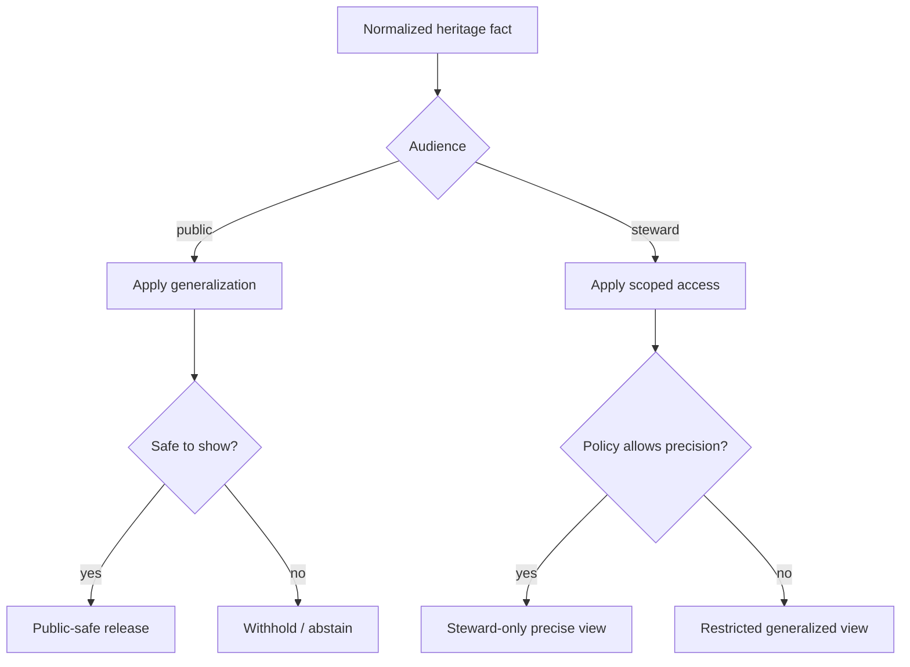
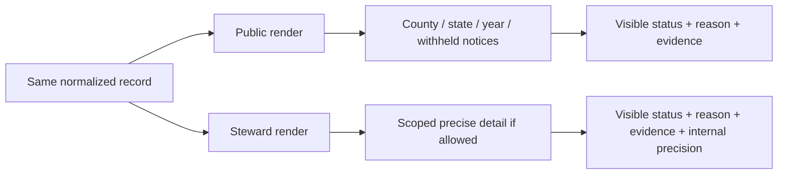

<!--
doc_id: NEEDS VERIFICATION
title: Heritage Examples and Safe Release Patterns
type: standard
version: v1
status: draft
owners: [@bartytime4life, NEEDS VERIFICATION]
created: NEEDS VERIFICATION
updated: 2026-04-02
policy_label: public
related: [
  docs/domains/heritage/README.md,
  docs/domains/heritage/gedcom-intake-mapping.md,
  docs/domains/heritage/fixtures/README.md,
  docs/governance/ROOT_GOVERNANCE.md,
  docs/governance/ETHICS.md,
  docs/governance/SOVEREIGNTY.md
]
tags: [kfm, heritage, examples, release-patterns, geoprivacy, genealogy, public-safe]
notes: [
  "Proposed examples README for heritage lane.",
  "Demonstrates safe public, generalized, steward-only, and withheld release patterns.",
  "All examples are synthetic and illustrative; no real individuals or sensitive sites."
]
-->

# Heritage Examples and Safe Release Patterns

**Purpose:** show how heritage materials should appear across public, generalized, steward-only, and withheld surfaces so KFM release behavior stays trust-visible and policy-legible.

**Repo fit:** **PROPOSED** path: `docs/domains/heritage/examples/README.md`  
**Upstream:** normalized heritage records, policy decisions, evidence bundles, correction and revocation receipts  
**Downstream:** public maps, timelines, dossiers, focus views, evidence drawers, steward review surfaces

> [!IMPORTANT]
> These are **rendering and release examples**, not raw data examples. They show what users should see after governance decisions have already been applied.

---

## Status / impact

**Status:** `experimental`  
**Owners:** `@bartytime4life`, `NEEDS VERIFICATION`  
**Scope badges:**    

**Quick jumps:** [Scope](#scope) · [Repo fit](#repo-fit) · [Inputs](#accepted-inputs) · [Exclusions](#exclusions) · [Exposure classes](#exposure-classes) · [Examples](#example-patterns) · [UI patterns](#ui-patterns) · [Task list](#task-list)

---

## Scope

This file exists to answer a practical question:

**What should a heritage record look like after policy has done its job?**

KFM doctrine emphasizes that narrowing, withholding, abstention, and correction are trust-preserving outcomes. For heritage materials, those outcomes must be visible in the product surface rather than hidden behind polished map layers or silently simplified summaries.

This document provides:

- example public-safe map and timeline outputs,
- examples of generalized versus withheld place/time rendering,
- steward-only and restricted-precise view patterns,
- examples of visible correction and revocation behavior,
- examples of evidence-linked claims and abstentions.

[Back to top](#heritage-examples-and-safe-release-patterns)

---

## Repo fit

| Field | Value |
|---|---|
| Proposed path | `docs/domains/heritage/examples/README.md` |
| Companion lane doc | `docs/domains/heritage/README.md` |
| Companion standard | `docs/domains/heritage/gedcom-intake-mapping.md` |
| Companion fixtures | `docs/domains/heritage/fixtures/README.md` |
| Verification state | `NEEDS VERIFICATION` |

---

## Accepted inputs

| Input | Role |
|---|---|
| normalized heritage records | source for release examples |
| disclosure decisions | determine visible narrowing |
| provenance / evidence receipts | support evidence-linked display |
| correction / revocation notices | show supersession behavior |
| audience profile | determines public vs steward surface |

---

## Exclusions

This file does **not** include:

- real living-person data,
- real exact addresses,
- real exact burial plots,
- real sensitive community sites,
- implementation claims about active UI components unless verified in repo,
- decorative screenshots or mockups that imply product readiness.

---

## Directory view

```text
docs/
└── domains/
    └── heritage/
        ├── README.md
        ├── gedcom-intake-mapping.md
        ├── fixtures/
        │   └── README.md
        └── examples/
            └── README.md                  # this file
```

---

## Exposure classes

| Exposure class | User-visible expectation | Example behavior |
|---|---|---|
| `public_safe` | broad audience can view | generalized county/state map point, year-level time |
| `generalized` | visible but intentionally narrowed | no street, no parcel, no plot, no exact DOB |
| `steward_only` | restricted interface only | precise internal detail behind policy gate |
| `restricted_precise` | exact detail retained internally | not shown to public |
| `withheld` | visible statement of non-disclosure | “Location withheld due to sensitivity” |

### Core display rule

When KFM narrows or blocks a heritage record, the interface should show **that narrowing happened**.

Bad pattern:

- silently dropping detail with no explanation.

Better pattern:

- “Location generalized to county level due to privacy policy.”
- “Exact date withheld.”
- “Precise site visible only to authorized stewards.”
- “Record temporarily withdrawn pending correction review.”

---

## Operating model



---

## Example patterns

### Example 1 — Public-safe generalized map card

**Scenario:** historical birth event, deceased person, no living-person risk, source place parsed from genealogy export.

**Public card**

```text
Birth event
Place: Clark County, Kansas, USA
Time: 1910
Status: generalized
Why: Original source contained more specific locality detail; public display narrowed to county level.
Evidence: available
```

**Good behavior**

- county-level display instead of city/street,
- year-only time display,
- visible note that the result is generalized.

**Bad behavior**

- city or street displayed because the file happened to include it,
- exact day shown merely because the parser extracted it.

---

### Example 2 — Withheld location banner

**Scenario:** burial-related record with site-specific sensitivity.

**Public display**

```text
Burial record
Place: withheld
Time: 1898
Status: withheld
Reason: Exact location not disclosed due to site sensitivity.
Evidence: summary available; precise site not public.
```

**What matters**

- the user can see that a record exists,
- the user can see why exact place is absent,
- the system does not pretend the place was never present.

> [!WARNING]
> “No data” and “withheld data” are not the same thing. Heritage surfaces should distinguish them.

---

### Example 3 — Living-person suppression

**Scenario:** family-history dataset includes modern person with full birth date and residence.

**Public display**

```text
Individual record
Time: withheld
Place: Kansas, USA
Status: generalized
Reason: Living-person safeguards applied.
Evidence: restricted
```

**Expected public effect**

- exact date of birth removed,
- exact city/address removed,
- relationship details minimized,
- no map point more precise than broad state-level or none at all.

---

### Example 4 — Steward-only dossier view

**Scenario:** authorized steward reviewing a precise cemetery or archival reference.

**Steward view**

```text
Burial event
Place: Smallville Cemetery, internal reference available
Time: 14 OCT 1898
Status: steward-only
Why: Precise site retained for steward review under policy.
Evidence bundle: attached
Correction history: none
```

**Public counterpart**

```text
Burial event
Place: Clark County, Kansas
Time: 1898
Status: generalized
Why: Precise site restricted.
```

**Pattern**

A steward-only surface may expose more detail, but public and steward views must still share a common lineage and correction path.

---

### Example 5 — Visible correction and supersession

**Scenario:** a previously released generalized heritage record is later corrected.

**Before correction**

```text
Settlement record
Place: Ellsworth County, Kansas
Time: 1874
Status: generalized
Evidence: available
```

**After correction**

```text
Settlement record
Place: Rice County, Kansas
Time: 1874
Status: corrected
Correction note: Prior county assignment superseded by updated evidence review.
Evidence: updated
```

**Required behavior**

- correction is visible,
- newer release does not silently erase lineage,
- the user can see what changed at the trust layer, even if not every internal detail is displayed.

---

### Example 6 — Revocation / withdrawal

**Scenario:** a heritage media item was visible in public form and later withdrawn.

**Public display after withdrawal**

```text
Historical photo
Availability: withdrawn
Status: withdrawn
Reason: release basis narrowed or revoked
Replacement: summary metadata only
Evidence lineage: preserved
```

**Pattern**

Withdrawal should fail calmly but visibly. The surface should narrow without pretending the earlier release state never existed.

---

### Example 7 — Evidence-linked abstention

**Scenario:** a public user asks a consequential identity-sensitive question not supportable from safe evidence.

**Response pattern**

```text
Answer status: ABSTAIN
Why: Available public-safe evidence does not support a reliable answer without overexposing sensitive historical detail.
What is available: generalized place/time summary
Next route: steward review or restricted evidence process
```

**Why this matters**

Heritage systems should resist pressure to over-answer when the evidence path would require unsafe inference.

---

## Example comparison table

| Scenario | Public output | Steward output | Outcome |
|---|---|---|---|
| deceased birth event | county + year | finer locality if allowed | `GENERALIZE` |
| sensitive burial site | withheld or county | precise site if authorized | `WITHHOLD` / `STEWARD_ONLY` |
| living person | broad state or none | restricted internal detail | `GENERALIZE` |
| corrected settlement record | corrected generalized surface | same + fuller evidence detail | `ANSWER` with correction |
| revoked media item | withdrawn notice | internal hold or restricted | `WITHDRAW` / `DENY` |

---

## UI patterns

### Pattern A — Trust-visible card footer

**Recommended footer fields**

| Field | Purpose |
|---|---|
| `Status` | generalized / withheld / corrected / steward-only |
| `Why` | brief human-readable explanation |
| `Evidence` | available / restricted / under review |
| `Correction` | none / corrected / superseded / withdrawn |

**Example**

```text
Status: generalized
Why: Place narrowed to county level due to privacy review.
Evidence: available
Correction: none
```

---

### Pattern B — Evidence drawer summary

**Public-safe evidence drawer should show:**

- source class,
- generalized place/time basis,
- whether narrowing occurred,
- whether the record is current, corrected, or withdrawn.

**It should not show:**

- exact withheld detail,
- hidden coordinates,
- precise internal identifiers if they create disclosure risk.

---

### Pattern C — Focus-mode side panel

**Recommended labels**

- `Observed`
- `Derived`
- `Generalized`
- `Restricted`
- `Under review`
- `Withdrawn`

These labels help prevent polished derived views from masquerading as sovereign truth.

---

## Diagram — public versus steward rendering



---

## Minimum rendering contract

A heritage-facing UI or document should, at minimum:

- show whether a record is generalized, withheld, corrected, or withdrawn,
- avoid exact sensitive geography by default,
- distinguish absence from deliberate withholding,
- preserve visible correction lineage,
- route consequential claims through evidence rather than polish.

---

## Quickstart

```text
1. Start from normalized heritage record + disclosure decision.
2. Choose audience: public or steward.
3. Apply narrowing rules before formatting.
4. Add visible status and reason labels.
5. Show evidence availability without leaking restricted detail.
6. Preserve correction / withdrawal lineage in the rendered surface.
```

---

## Usage

### When to use these examples

Use this file when designing or reviewing:

- map popups,
- timeline entries,
- evidence drawer summaries,
- dossier cards,
- public release notes,
- steward-review interfaces.

### What reviewers should check

Reviewers should ask:

- is the narrowing visible,
- is the reason legible,
- does the interface confuse withheld with missing,
- does public output expose more precision than policy allows,
- does correction remain visible.

---

## FAQ

### Why not just omit the sensitive field entirely?

Because omission hides governance action. In heritage systems, visible narrowing builds trust.

### Can the public ever see exact localities?

Possibly, but only when policy, sensitivity, and evidence posture clearly permit it. This file intentionally demonstrates safer defaults.

### Should every heritage surface include an evidence drawer?

**INFERRED:** consequential claims should have an evidence route. The exact UI component name or implementation remains **NEEDS VERIFICATION**.

### Is “generalized” a lower-quality result?

No. In KFM terms, generalization is often the correct, highest-trust public result.

---

## Task list

- [ ] **NEEDS VERIFICATION:** confirm examples path exists
- [ ] align terminology with any existing Focus Mode or Evidence Drawer contract docs
- [ ] add companion JSON render examples if UI contracts exist
- [ ] add public map popup examples for cemetery and migration cases
- [ ] add withdrawn-media and corrected-timeline examples
- [ ] verify whether `withdrawn` and `withheld` are distinct UI states in current implementation

### Definition of done

- [ ] examples are clearly synthetic
- [ ] public/steward difference is legible
- [ ] correction and withdrawal patterns are visible
- [ ] no unverified implementation claims remain unlabeled
- [ ] terminology aligns with adjacent governance docs

[Back to top](#heritage-examples-and-safe-release-patterns)

---

## Appendix

<details>
<summary><strong>Suggested companion artifacts</strong></summary>

**PROPOSED** next companions:

- `docs/domains/heritage/examples/public-cards.json` — synthetic render payloads
- `docs/domains/heritage/examples/timeline-patterns.md` — timeline-specific examples
- `docs/domains/heritage/examples/map-popup-patterns.md` — public popup examples
- implementation-facing UI contract docs — `NEEDS VERIFICATION`

</details>

<details>
<summary><strong>Editorial note</strong></summary>

This file focuses on **what safe release looks like**, not on whether a current frontend already implements these exact states. Any concrete UI contract, component name, API field, or render pipeline should be verified in repo before this document is merged as published guidance.

</details>
