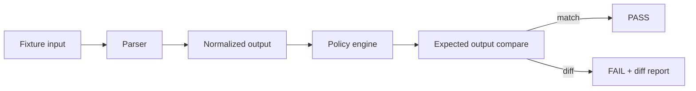

<!--
doc_id: NEEDS VERIFICATION
title: Heritage Fixtures and Test Cases
type: standard
version: v1
status: draft
owners: [@bartytime4life, NEEDS VERIFICATION]
created: NEEDS VERIFICATION
updated: 2026-04-02
policy_label: restricted
related: [
  docs/domains/heritage/README.md,
  docs/domains/heritage/gedcom-intake-mapping.md,
  docs/governance/ROOT_GOVERNANCE.md,
  docs/governance/ETHICS.md
]
tags: [kfm, fixtures, genealogy, gedcom, redaction, geoprivacy, testing]
notes: [
  "Fixture definitions for GEDCOM intake and privacy mapping.",
  "Used for parser validation, policy enforcement testing, and regression checks.",
  "Contains synthetic examples only — no real individuals or sensitive locations."
]
-->

# Heritage Fixtures and Test Cases

**Purpose:** define canonical test fixtures for validating GEDCOM ingestion, normalization, privacy mapping, and publication-safe generalization within the heritage lane.

**Repo fit:** **PROPOSED** path: `docs/domains/heritage/fixtures/README.md`  
**Upstream:** GEDCOM samples, synthetic genealogical records, simulated GEDZIP bundles  
**Downstream:** parser tests, CI checks, validation harnesses, redaction verification, release gating

> [!IMPORTANT]
> All fixtures must be **synthetic or fully de-identified**. No real living-person data or sensitive real-world coordinates should appear in this directory.

---

## Status / impact

**Status:** `experimental`  
**Owners:** `@bartytime4life`, `NEEDS VERIFICATION`  
**Scope badges:**   

---

## Scope

This fixture set exists to make **policy visible and testable**.

It ensures:

- GEDCOM 5.5.1 and 7.x parsing behaves consistently,
- place parsing and generalization are deterministic,
- disclosure logic does not regress,
- geoprivacy controls cannot be bypassed silently,
- revocation and correction pathways remain reproducible.

Fixtures represent **expected behavior**, not raw input chaos.

---

## Directory view

```text
docs/
└── domains/
    └── heritage/
        ├── README.md
        ├── gedcom-intake-mapping.md
        └── fixtures/
            ├── README.md                  # this file
            ├── gedcom_551/
            │   ├── basic_restricted.ged
            │   ├── mixed_precision.ged
            │   └── vendor_extensions.ged
            ├── gedcom_7/
            │   ├── typed_places.ged
            │   ├── date_ranges.ged
            │   └── gedzip_manifest.json
            ├── expected_outputs/
            │   ├── basic_restricted.json
            │   ├── generalized_public.json
            │   └── withheld_case.json
            └── policy_cases/
                ├── living_person_block.json
                ├── revocation_case.json
                └── cemetery_sensitive.json
```

---

## Fixture categories

| Category | Purpose |
|---|---|
| `gedcom_551/` | legacy parsing + RESN handling |
| `gedcom_7/` | structured parsing + typed jurisdictions |
| `expected_outputs/` | canonical normalized KFM outputs |
| `policy_cases/` | disclosure and redaction decisions |
| `edge_cases/` (optional) | malformed or ambiguous inputs |

---

## Core fixture examples

### 1) Basic restricted address (GEDCOM 5.5.1)

**Input (`basic_restricted.ged`)**

```text
0 @I1@ INDI
1 BIRT
2 DATE 12 MAR 1938
2 PLAC 42 Oak St, Smallville, Clark County, Kansas, USA
1 RESN privacy
```

**Expected output (`basic_restricted.json`)**

```json
{
  "place_buckets": ["Clark County", "Kansas", "USA"],
  "place_precision_class": "local",
  "disclosure_level": "internal_only",
  "policy_decision": "WITHHOLD"
}
```

**Test assertions**

- exact address MUST NOT appear in output
- disclosure MUST be `internal_only`
- parser MUST preserve raw input internally

---

### 2) GEDCOM 7 typed place + safe generalization

**Input (`typed_places.ged`)**

```text
0 @I2@ INDI
1 BIRT
2 DATE 1910
2 PLAC Smallville, Clark County, Kansas, USA
2 FORM City, County, State, Country
```

**Expected output (`generalized_public.json`)**

```json
{
  "place_buckets": ["Clark County", "Kansas", "USA"],
  "date_precision": "year",
  "disclosure_level": "public_candidate",
  "policy_decision": "GENERALIZE"
}
```

**Test assertions**

- FORM must be respected if present
- output must NOT default to exact city-level for public surface
- date must not be over-precise

---

### 3) Living person suppression

**Input (`living_person_block.json`)**

```json
{
  "birth_date": "1985-07-12",
  "place": "123 Main St, Smallville, Kansas, USA",
  "living": true
}
```

**Expected output**

```json
{
  "display_date": null,
  "place_buckets": ["Kansas", "USA"],
  "disclosure_level": "limited",
  "policy_decision": "GENERALIZE"
}
```

**Test assertions**

- exact date must be removed
- address must collapse beyond city level
- living flag must override absence of RESN

---

### 4) Cemetery sensitivity case

**Input (`cemetery_sensitive.json`)**

```json
{
  "event": "burial",
  "location": "Section B Row 3 Plot 14, Smallville Cemetery, Clark County, Kansas",
  "sensitivity": "site_specific"
}
```

**Expected output**

```json
{
  "place_buckets": ["Clark County", "Kansas"],
  "disclosure_level": "limited",
  "policy_decision": "GENERALIZE"
}
```

**Test assertions**

- plot-level detail MUST NOT appear
- cemetery name may be suppressed depending on policy layer
- geobucket must be coarse

---

### 5) Revocation / rollback case

**Input (`revocation_case.json`)**

```json
{
  "initial_release": {
    "place_buckets": ["Clark County", "Kansas"],
    "approved": true
  },
  "revocation": {
    "reason": "consent_withdrawn"
  }
}
```

**Expected output**

```json
{
  "place_buckets": null,
  "disclosure_level": "withheld",
  "policy_decision": "WITHHOLD",
  "revocation_applied": true
}
```

**Test assertions**

- previously allowed data must be removed
- revocation must be visible
- system must not silently retain earlier exposure

---

## Parser validation rules

Each fixture must validate:

| Rule | Description |
|---|---|
| determinism | same input → same normalized output |
| loss visibility | removed detail must be intentional and logged |
| provenance retention | raw values retained internally |
| extension safety | unknown fields preserved |
| policy override | living/sensitive rules override format capability |

---

## CI integration (PROPOSED)



### Suggested checks

- schema validation against expected JSON
- diff-based regression detection
- geoprivacy enforcement test (no exact coordinates leak)
- disclosure-level correctness
- revocation behavior consistency

---

## Fixture naming conventions

| Pattern | Meaning |
|---|---|
| `basic_*` | simple baseline behavior |
| `mixed_*` | combined conditions |
| `edge_*` | malformed or ambiguous |
| `policy_*` | disclosure and governance logic |
| `revocation_*` | correction lifecycle |

---

## Data safety rules

Fixtures must:

- never contain real addresses or coordinates
- avoid real surnames + real places combination
- use synthetic or clearly fictional place names where possible
- avoid reconstructable family chains
- avoid culturally sensitive real-world sites

---

## Quickstart

```text
1. Load fixture GEDCOM or JSON input.
2. Run version-aware parser.
3. Normalize to KFM intake structure.
4. Apply disclosure policy.
5. Compare against expected output.
6. Fail on any precision leakage or policy mismatch.
```

---

## Usage

### When adding a new fixture

- include both input and expected output
- document what rule it tests
- keep it minimal but complete
- label sensitivity case explicitly

### When modifying a fixture

- update expected outputs intentionally
- include reasoning in commit message
- ensure no policy regression is introduced

---

## Task list

- [ ] **NEEDS VERIFICATION:** confirm fixture directory exists or create it
- [ ] implement parser test harness
- [ ] add JSON schema for expected outputs
- [ ] add diff tooling for CI
- [ ] expand GEDZIP bundle cases
- [ ] add malformed GEDCOM cases
- [ ] add multi-generation genealogy scenarios (synthetic)

### Definition of done

- [ ] fixtures execute in CI
- [ ] failures produce clear diffs
- [ ] no sensitive data present
- [ ] all core mapping rules covered
- [ ] revocation and geoprivacy cases enforced

---

## Appendix

<details>
<summary><strong>Design philosophy</strong></summary>

Fixtures are not just parser tests.  
They are **policy guarantees encoded as executable examples**.

If a fixture fails, it indicates:

- a regression in parsing,
- a violation of disclosure rules,
- or a breach in geoprivacy posture.

</details>
