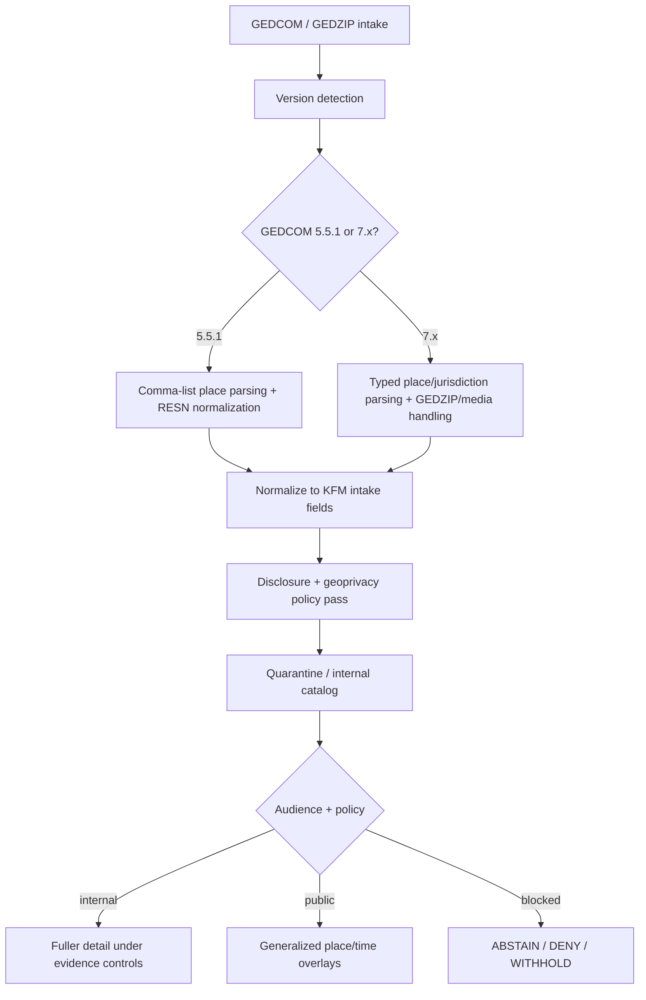
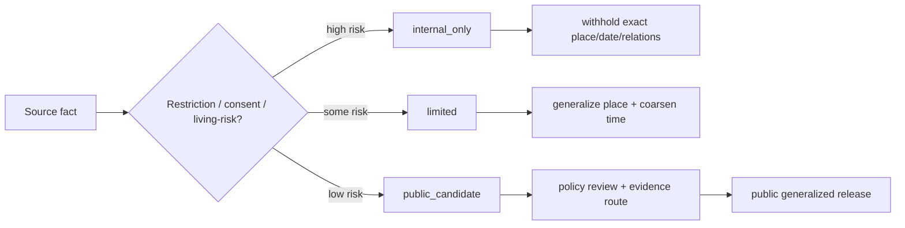

<!--
doc_id: NEEDS VERIFICATION
title: GEDCOM Intake and Privacy Mapping Standard
type: standard
version: v1
status: draft
owners: [@bartytime4life, NEEDS VERIFICATION]
created: NEEDS VERIFICATION
updated: 2026-04-02
policy_label: public
related: [
  docs/governance/ROOT_GOVERNANCE.md,
  docs/governance/ETHICS.md,
  docs/governance/SOVEREIGNTY.md,
  docs/domains/README.md,
  NEEDS VERIFICATION: target domain index/README for heritage or archives lane
]
tags: [kfm, genealogy, gedcom, privacy, provenance, geospatial, intake, standard]
notes: [
  "Proposed new standard; exact placement and owning domain need repo verification.",
  "Maps GEDCOM 5.5.1 and GEDCOM 7.x into KFM privacy-aware intake outputs.",
  "Contains external standard references for GEDCOM semantics; KFM implementation details remain NEEDS VERIFICATION until confirmed in repo."
]
-->

# GEDCOM Intake and Privacy Mapping Standard

**Purpose:** define a governed, privacy-aware intake mapping from GEDCOM genealogy exports into KFM-compatible place, time, provenance, and disclosure outputs.

**Repo fit:** **PROPOSED** path: `docs/domains/heritage/gedcom-intake-mapping.md`  
**Upstream:** GEDCOM 5.5.1 / FamilySearch GEDCOM 7.x exports, vendor bundles, media packages, consent or steward instructions  
**Downstream:** quarantine/work intake, catalog/provenance layers, evidence-bound overlays, generalized public map/timeline products

> [!IMPORTANT]
> This standard is for **safe ingestion and controlled transformation** of genealogy exports. It is **not** a blanket publication rule for family history data, exact residences, living-person records, or culturally sensitive kinship material.

---

## Status / impact

**Status:** `experimental`  
**Owners:** `@bartytime4life`, `NEEDS VERIFICATION`  
**Scope badges:**    

**Quick jumps:** [Scope](#scope) · [Repo fit](#repo-fit) · [Inputs](#accepted-inputs) · [Exclusions](#exclusions) · [Mapping rules](#mapping-rules) · [Disclosure model](#disclosure-model) · [Examples](#examples) · [Implementation notes](#implementation-notes) · [Task list](#task-list) · [Appendix](#appendix)

---

## Scope

KFM regularly prefers **evidence before persuasion**, **context before compression**, and **stewardship before exposure**. Genealogy files are often rich in place, date, kinship, and identity data, but they are also frequently under-governed, vendor-extended, and mixed between deceased and living persons. This standard defines how to ingest them without letting convenience layers become sovereign truth.

This document covers:

- version-aware parsing of GEDCOM 5.5.1 and GEDCOM 7.x,
- normalization into KFM-friendly intake outputs,
- place generalization and geoprivacy controls,
- restriction and consent handling,
- date uncertainty handling,
- provenance capture for bundled media and revocation-sensitive publication.

This document does **not** define final public release policy for every domain consumer. It establishes the intake contract and minimum safe behavior at the trust boundary.

[Back to top](#gedcom-intake-and-privacy-mapping-standard)

---

## Repo fit

| Field | Value |
|---|---|
| Proposed path | `docs/domains/heritage/gedcom-intake-mapping.md` |
| Alternate plausible lane | `docs/domains/archives/gedcom-intake-mapping.md` |
| Why this fits | Genealogy exports intersect heritage, archives, migration, dossiers, and place/time evidence handling |
| Adjacent doctrine | `docs/governance/ROOT_GOVERNANCE.md`, `docs/governance/ETHICS.md`, `docs/governance/SOVEREIGNTY.md` |
| Implementation coupling | Intake/parser code, provenance receipts, policy filtering, publication generalization |
| Verification state | `NEEDS VERIFICATION` for exact domain lane, owners, and downstream file links |

### Placement recommendation

**PROPOSED:** place this under the heritage or archives lane rather than a generic ingestion folder, because GEDCOM data is not merely a technical format problem; it is a **historical evidence + disclosure governance** problem.

If the repo already has a genealogy, family-history, migration, or dossiers lane, prefer that location instead.

[Back to top](#gedcom-intake-and-privacy-mapping-standard)

---

## Accepted inputs

This standard accepts the following input classes:

| Input class | Examples | Status |
|---|---|---|
| GEDCOM 5.5.1 text export | `.ged` | `CONFIRMED` |
| GEDCOM 7.x text export | `.ged` | `CONFIRMED` |
| GEDZIP / packaged GEDCOM bundle | `.gdz`, zip-packaged dataset + local media | `CONFIRMED` |
| Vendor-specific extension tags | `_LAT`, `_LON`, `_LOC`, `_UID`, custom `_PRIV`-like tags | `INFERRED` |
| Steward instructions or consent metadata | sidecar policy notes, intake form, release notes | `PROPOSED` |
| Supporting media | images, scans, attached files referenced by GEDZIP | `CONFIRMED` |

---

## Exclusions

This standard excludes the following by default:

- direct publication of exact home addresses or precise residence histories for living persons,
- exact coordinates or tight geobuckets for sensitive family, cemetery, or culturally sensitive kinship materials,
- unreviewed inference of ethnicity, religion, tribal affiliation, legitimacy, or cultural identity from family records,
- promotion of vendor-exported derivatives to authoritative truth without evidence lineage,
- silent merge of living and deceased-person detail into a single public overlay.

> [!WARNING]
> A genealogy export is not equivalent to permission to publish. Intake success does **not** imply release approval.

[Back to top](#gedcom-intake-and-privacy-mapping-standard)

---

## Directory view

```text
docs/
└── domains/
    ├── README.md
    ├── heritage/                         # PROPOSED
    │   ├── README.md                     # NEEDS VERIFICATION
    │   └── gedcom-intake-mapping.md      # this file
    └── archives/                         # alternate plausible lane
        └── ...
```

---

## Operating model



---

## Mapping rules

### 1) Version detection

The parser **must** detect the GEDCOM version before structural mapping.

| Signal | Meaning | Handling |
|---|---|---|
| `HEAD.GEDC.VERS = 5.5.1` | classic 5.5.1 lineage-linked form | use 5.5.1 mapper |
| `HEAD.GEDC.VERS = 7.x` | FamilySearch GEDCOM 7.x | use 7.x mapper |
| missing / malformed version | unknown or vendor-damaged export | quarantine; parse conservatively |
| mixed or contradictory headers | export corruption or vendor bug | quarantine; emit parser warning |

**Rationale:** GEDCOM 7 introduced breaking changes relative to 5.5.1 and adopted semantic versioning; 5.5.1 and 7.x should not be treated as structurally interchangeable. :contentReference[oaicite:0]{index=0}

---

### 2) Place parsing

#### GEDCOM 5.5.1

In 5.5.1, `PLAC` is commonly represented as a comma-separated place string, often moving from lower to higher jurisdiction in examples such as `City, County, State` or more specific place strings. The 5.5.1 specification also notes added subordinate map-coordinate support in place structure revisions. :contentReference[oaicite:1]{index=1}

**Mapping rule:**

- split `PLAC` by commas,
- trim whitespace,
- preserve original order as `raw_place_parts`,
- classify heuristically into:
  - site/building/cemetery,
  - locality/city/town,
  - county/parish,
  - state/province,
  - country,
- when uncertain, retain original token order and avoid over-typing.

#### GEDCOM 7.x

In GEDCOM 7, `PLAC` remains a jurisdiction list ordered from **lowest to highest** jurisdiction, and jurisdiction types can be specified by `PLAC.FORM` or defaulted from `HEAD.PLAC.FORM`. Missing jurisdictions may appear as empty entries. :contentReference[oaicite:2]{index=2}

**Mapping rule:**

- parse the place list in order,
- read `PLAC.FORM` if present,
- otherwise read `HEAD.PLAC.FORM`,
- store:
  - `raw_place_string`,
  - `raw_place_parts[]`,
  - `place_part_types[]` when declared,
  - `place_confidence` describing certainty of type assignment.

#### KFM output fields

| KFM field | Description | Notes |
|---|---|---|
| `raw_place_string` | exact source place text | internal preservation field |
| `raw_place_parts[]` | ordered jurisdiction/site tokens | preserve source order |
| `place_part_types[]` | typed roles if known | often stronger in 7.x |
| `place_buckets[]` | generalized publishable buckets | public-safe representation |
| `place_precision_class` | exact / parcelish / local / county / state / country | disclosure control input |
| `place_parse_status` | parsed / partial / uncertain / quarantined | trust-visible |

#### Public generalization rule

For public or broad-audience outputs:

- suppress street, building, cemetery row, neighborhood, and parcel-like detail,
- default to **county/state/country** or broader when living-person or sensitive-event risk exists,
- prefer visible narrowing over silent precision leakage.

---

### 3) Coordinates and geobuckets

GEDCOM 7 formally defines latitude and longitude data types. GEDCOM 5.5.1 also anticipated subordinate map-coordinate support in place structures, though vendor implementations vary in practice. :contentReference[oaicite:3]{index=3}

**Mapping rule:**

| Source condition | KFM action |
|---|---|
| exact lat/lon present and policy allows internal use | store in internal geometry field |
| vendor `_LAT` / `_LON` or equivalent | preserve in extension map and normalize if parseable |
| public output | convert to `geobucket`, not exact coordinate |
| sensitive location | withhold coordinate entirely |

**Recommended geobucket classes:**

- `gb20km` for broad public overlays,
- `gb10km` only for low-risk deceased-person historical events,
- `exact_internal` only behind governed APIs and evidence controls.

> [!CAUTION]
> Exact residence or burial coordinates can be re-identifying even for historical records when combined with names, relationships, or recent generations.

---

### 4) Restrictions, privacy, and consent

GEDCOM 5.5.1 includes `RESN` as a restriction notice in individual records, and GEDCOM 7 retains `RESN` as a list of restriction values to help software filter data that should not be exported or used in a given context. :contentReference[oaicite:4]{index=4}

**Normalization target:**

| Source signal | KFM normalized field | Guidance |
|---|---|---|
| `RESN` = privacy/confidential/locked-like values | `disclosure_level=internal_only` | no public exposure |
| living-person heuristic with no explicit consent | `disclosure_level=limited` | generalize aggressively |
| deceased + low sensitivity + no restriction flags | `disclosure_level=public_candidate` | still policy-checked |
| explicit steward or consent authorization | `consent_token_hash` + higher permitted detail | retain auditability |

**Required fields:**

| KFM field | Purpose |
|---|---|
| `disclosure_level` | normalized release posture |
| `consent_token_hash` | stable audit token for explicit authorization |
| `restriction_source` | RESN / steward note / vendor extension / inferred living rule |
| `restriction_reason` | human-readable cause |
| `policy_decision` | ANSWER / ABSTAIN / DENY / HOLD / GENERALIZE / WITHHOLD |

#### Living-person default

**PROPOSED:** if a person is plausibly living and explicit publication authorization is absent:

- suppress exact date of birth,
- suppress exact residences,
- suppress exact relationship exposure beyond policy minimum,
- publish no map point more precise than a generalized bucket,
- default to `limited` or `internal_only`.

This aligns with KFM’s stewardship-first posture.

---

### 5) Dates and uncertainty

GEDCOM 7 explicitly supports date ranges, date periods, multiple calendars, and `PHRASE` for source-like human wording when exact structured encoding is incomplete. :contentReference[oaicite:5]{index=5}

**Mapping rule:**

- parse exact dates to normalized machine date when available,
- parse approximate/range expressions into:
  - `date_start`,
  - `date_end`,
  - `date_precision`,
  - `date_phrase_raw`,
- preserve calendar/source phrase when provided,
- do **not** fabricate certainty.

**Normalization examples:**

| Source date | KFM normalized representation |
|---|---|
| `02 OCT 1822` | `date_start=1822-10-02`, `date_end=1822-10-02`, `precision=day` |
| `BEF 1828` | `date_end=1828-12-31`, `precision=bounded_before`, `raw=BEF 1828` |
| `BET 1898 AND 1902` | `date_start=1898-01-01`, `date_end=1902-12-31`, `precision=range` |
| `ABT 1900` | `precision=approximate`, bounded per parser policy, retain raw phrase |
| `Q1 1867` in GEDCOM 7 phrase example | range for first quarter + `date_phrase_raw="Q1 1867"` |

#### Public display rule

For public outputs:

- show **year** or **decade** when living or sensitivity risk exists,
- never expose exact dates solely because the source format allows it.

---

### 6) Multimedia bundles and GEDZIP provenance

GEDCOM 7 includes GEDZIP for bundling the GEDCOM dataset with local media or supporting documents, and the bundle version tracks the dataset version. :contentReference[oaicite:6]{index=6}

**Mapping rule:**

| Input | KFM provenance field | Purpose |
|---|---|---|
| GEDCOM/GEDZIP version | `spec_version` | parser behavior + audit |
| normalized spec identifier | `spec_hash` | reproducible provenance anchor |
| bundle manifest / file inventory | `media_manifest_hash` | attachment accountability |
| source bundle checksum | `source_checksum` | reproducibility |
| revocation or withdrawal anchor | `revocation_root` | rollback support |
| import timestamp | `ingest_ts` | chain-of-custody |

#### Rollback expectation

If previously published, fine-grained overlays were produced from a consented or steward-cleared source, and that authorization is later narrowed, revoked, or superseded, the publication layer **must** be able to deterministically revert to a generalized or withdrawn state while preserving visible lineage.

That behavior is consistent with KFM correction and supersession doctrine.

---

### 7) Extension handling

GEDCOM exports in the wild routinely include vendor-specific tags and implementation quirks. GEDCOM 7 documentation explicitly discusses extensions and support for common 5.5.1 extensions. :contentReference[oaicite:7]{index=7}

**Extension rules:**

1. Preserve unknown extensions in `extensions_raw`.
2. Never silently drop a restriction-like extension.
3. Never elevate an extension to trusted semantics without a parser rule.
4. Record every honored extension in parser receipts.

**Recommended fields:**

- `extensions_raw`
- `extensions_honored[]`
- `extensions_rejected[]`
- `parser_warnings[]`

---

## Disclosure model



### Normalized disclosure levels

| Level | Meaning | Public behavior |
|---|---|---|
| `internal_only` | sensitive, restricted, or unconsented | no public release |
| `limited` | some safe derivative may be shown | generalized place/time only |
| `public_candidate` | low-risk candidate pending policy | still generalized unless explicitly approved |
| `withheld` | do not disclose | no public record surface |

---

## Canonical KFM intake shape

```json
{
  "source_format": "gedcom",
  "spec_version": "7.0.18",
  "spec_hash": "sha256:NEEDS_VERIFICATION",
  "source_checksum": "sha256:NEEDS_VERIFICATION",
  "record_type": "individual_event",
  "record_id": "source-local-id",
  "raw_place_string": "42 Oak St, Smallville, Clark County, Kansas, USA",
  "raw_place_parts": ["42 Oak St", "Smallville", "Clark County", "Kansas", "USA"],
  "place_part_types": ["street", "city", "county", "state", "country"],
  "place_buckets": ["Clark County", "Kansas", "USA"],
  "place_precision_class": "local",
  "place_parse_status": "parsed",
  "geobucket": null,
  "date_start": "1910-01-01",
  "date_end": "1910-12-31",
  "date_precision": "year",
  "date_phrase_raw": "1910",
  "disclosure_level": "limited",
  "consent_token_hash": null,
  "restriction_source": "RESN",
  "restriction_reason": "privacy",
  "policy_decision": "GENERALIZE",
  "extensions_raw": {},
  "parser_warnings": [],
  "ingest_ts": "NEEDS VERIFICATION",
  "revocation_root": "NEEDS VERIFICATION"
}
```

---

## Examples

### Example A — GEDCOM 5.5.1 restricted exact address

**Source**

```text
1 BIRT
2 DATE 12 MAR 1938
2 PLAC 42 Oak St, Smallville, Clark County, Kansas, USA
1 RESN privacy
```

**Internal normalized result**

| Field | Value |
|---|---|
| `raw_place_string` | `42 Oak St, Smallville, Clark County, Kansas, USA` |
| `place_buckets` | `["Clark County", "Kansas", "USA"]` |
| `place_precision_class` | `local` |
| `disclosure_level` | `internal_only` |
| `policy_decision` | `WITHHOLD` |

**Public result**

| Field | Value |
|---|---|
| `display_place` | withheld or `Clark County, Kansas, USA` |
| `display_date` | `1938` or suppressed depending on living-risk logic |
| `map_geometry` | none |

---

### Example B — GEDCOM 7.x typed place, deceased person, low-risk event

**Source characteristics**

- `HEAD.GEDC.VERS = 7.0.x`
- `PLAC` present with jurisdiction ordering and `FORM`
- lat/lon present
- person deceased, no restriction flags

**Public normalized result**

| Field | Value |
|---|---|
| `place_buckets` | county / state / country |
| `geobucket` | coarse rounded bucket |
| `date_precision` | year |
| `disclosure_level` | `public_candidate` |
| `policy_decision` | `GENERALIZE` |

---

### Example C — GEDZIP bundle with media and later revocation

**Input**

- `.gdz` bundle containing `gedcom.ged` and photos
- explicit release token initially present
- later correction narrows public display

**Expected behavior**

1. original receipt records `spec_version`, `source_checksum`, `media_manifest_hash`, `consent_token_hash`;
2. public overlay initially uses approved generalized detail;
3. after revocation/supersession, rerender removes media and narrows place/time detail;
4. public surface shows the narrowed state without silently pretending the earlier publication never existed.

---

## Implementation notes

### Parser split

Maintain separate version-aware mappers:

- `map_gedcom_551()`
- `map_gedcom_7()`

Both should emit a common normalized intake shape.

### Recommended processing phases

| Phase | Purpose |
|---|---|
| detect | version and source integrity |
| parse | structural extraction |
| normalize | map to KFM fields |
| classify | place precision, living risk, sensitivity |
| govern | apply disclosure and evidence policy |
| receipt | emit provenance and parser warnings |

### Finite outcomes

At publication or API response time, downstream consumers should preserve KFM’s finite outcome posture:

- `ANSWER`
- `ABSTAIN`
- `DENY`
- `ERROR`

For this lane, additional internal decision verbs are often useful during governance flow:

- `GENERALIZE`
- `WITHHOLD`
- `HOLD`
- `QUARANTINE`

---

## Quickstart

```text
1. Detect GEDCOM version from header.
2. Parse place, date, restrictions, and media references.
3. Normalize to KFM intake fields.
4. Compute place precision + living/sensitivity risk.
5. Apply disclosure mapping.
6. Emit provenance receipt.
7. Publish only generalized derivatives unless higher-detail release is explicitly allowed.
```

---

## Usage

### Minimum parser contract

A conforming GEDCOM intake implementation should:

- reject or quarantine malformed version headers,
- preserve raw place/date strings before normalization,
- generalize rather than discard when public-safe summarization is possible,
- carry restriction semantics forward,
- preserve unknown extensions for audit,
- emit machine-readable provenance fields.

### Minimum publication contract

A conforming public-facing consumer should:

- never default to exact location for genealogy data,
- never silently expose living-person details,
- visibly reflect narrowing or withholding,
- be able to reproduce why a place/date was generalized.

---

## Trust and evidence notes

| Claim type | Required posture |
|---|---|
| exact address or residence history | evidence-bound + restricted |
| inferred kinship-sensitive identity | abstain unless explicitly supported and policy-cleared |
| approximate time/place summary | allowed when generalized and non-harmful |
| media publication | requires provenance + release basis |
| correction or revocation | visible lineage-preserving supersession |

---

## FAQ

### Why not just store the full GEDCOM and decide later?

Because uncontrolled retention and later ad hoc publication creates invisible disclosure debt. Intake should preserve source fidelity **and** establish policy-ready normalized fields immediately.

### Why generalize place even for deceased persons?

Because genealogy datasets often connect generations, residences, cemeteries, and family clusters in ways that can still expose living relatives or sensitive sites.

### Does `RESN` alone solve privacy?

No. `RESN` is important, but living-person risk, steward rules, cultural sensitivity, and downstream audience all still matter. :contentReference[oaicite:8]{index=8}

### Does GEDCOM 7 fully replace 5.5.1?

It is the modern standard and 7.x adds important capabilities, but older files remain common and older software may not import 7.x files. Backward assumptions should not be made casually. :contentReference[oaicite:9]{index=9}

---

## Task list

- [ ] **NEEDS VERIFICATION:** confirm target domain lane (`heritage`, `archives`, or other)
- [ ] **NEEDS VERIFICATION:** confirm owners and CODEOWNERS alignment
- [ ] **NEEDS VERIFICATION:** cross-link to the correct domain README
- [ ] Define parser receipt schema for GEDCOM imports
- [ ] Define living-person heuristic and override process
- [ ] Define geobucket precision classes used by public overlays
- [ ] Add fixture examples for 5.5.1, 7.x, GEDZIP, and vendor extensions
- [ ] Add CI lint/check for required provenance fields on import recipes
- [ ] Add correction/revocation rollback example tied to release receipts

### Definition of done

- [ ] path confirmed in repo
- [ ] doctrine links validated
- [ ] parser field names aligned to implementation
- [ ] examples match test fixtures
- [ ] no unverified implementation claims remain unlabelled

[Back to top](#gedcom-intake-and-privacy-mapping-standard)

---

## Appendix

<details>
<summary><strong>External standard notes used in this draft</strong></summary>

- GEDCOM 5.5.1 remains a recognized standard form and includes restriction notices and place examples with comma-separated jurisdictions. :contentReference[oaicite:10]{index=10}
- GEDCOM 7.x uses semantic versioning, contains breaking changes relative to 5.5.1, includes formal place/jurisdiction handling, latitude/longitude data types, and GEDZIP packaging. :contentReference[oaicite:11]{index=11}
- FamilySearch notes that older-version users may import older GEDCOMs, while older systems may not import GEDCOM 7.0. :contentReference[oaicite:12]{index=12}

</details>

<details>
<summary><strong>Suggested companion files</strong></summary>

**PROPOSED** follow-on docs:

- `docs/domains/heritage/README.md` — lane overview and sensitivity posture
- `docs/domains/heritage/gedcom-fixtures.md` — parser fixtures and edge cases
- `docs/governance/consent-and-revocation.md` — broader release rollback rules
- implementation receipt schema doc/path — `NEEDS VERIFICATION`

</details>
