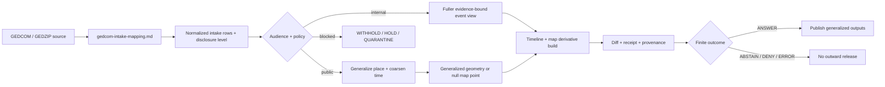

<!-- [KFM_META_BLOCK_V2]
doc_id: kfm://doc/NEEDS-VERIFICATION-gedcom-map-timeline-pipeline
title: GEDCOM → Map + Timeline Pipeline
type: standard
version: v1
status: draft
owners: @bartytime4life, NEEDS VERIFICATION
created: 2026-04-08
updated: 2026-04-08
policy_label: NEEDS VERIFICATION
related: [docs/domains/heritage/README.md, docs/domains/heritage/gedcom-intake-mapping.md, docs/domains/genomics/dna-vault/README.md]
tags: [kfm, heritage, genealogy, gedcom, timeline, privacy]
notes: [Proposed companion path: docs/domains/heritage/gedcom-map-timeline-pipeline.md, Request did not name a target file so this draft is positioned as a downstream companion to the existing intake/privacy mapping standard.]
[/KFM_META_BLOCK_V2] -->

# GEDCOM → Map + Timeline Pipeline

Downstream heritage-lane standard for turning policy-aware GEDCOM intake records into generalized map and timeline derivatives with receipts, diffability, and revocation-safe correction.


**Quick jumps:** [Scope](#scope) · [Repo fit](#repo-fit) · [Accepted inputs](#accepted-inputs) · [Exclusions](#exclusions) · [Quickstart](#quickstart) · [Operating model](#operating-model) · [Pipeline stages](#pipeline-stages) · [Disclosure-to-surface matrix](#disclosure-to-surface-matrix) · [Task list](#task-list) · [FAQ](#faq) · [Appendix](#appendix--illustrative-bundle-shape-proposed)

> [!IMPORTANT]
> This document starts **after** [`gedcom-intake-mapping.md`](./gedcom-intake-mapping.md). It does not replace intake mapping, and intake success does **not** equal public-release approval.

> [!CAUTION]
> Raw DNA files, match CSVs, segment exports, and other genomics artifacts are out of scope here. Keep them in the restricted genomics lane.

---

## Status / impact

| Field | Value |
|---|---|
| Status | `draft` |
| Path target | `PROPOSED` `docs/domains/heritage/gedcom-map-timeline-pipeline.md` |
| Upstream companion | [`./gedcom-intake-mapping.md`](./gedcom-intake-mapping.md) |
| Parent lane | [`./README.md`](./README.md) |
| Adjacent exclusion lane | [`../genomics/dna-vault/README.md`](../genomics/dna-vault/README.md) |
| Truth posture | `CONFIRMED` doctrine and lane fit · `PROPOSED` target path and exact artifact bundle · `NEEDS VERIFICATION` owners, policy label, and implementation homes |

---

## Scope

This standard defines the **release-facing middle** between GEDCOM intake and outward map/timeline surfaces.

It covers:

- conversion of normalized intake rows into event-shaped timeline and map derivatives
- place and time coarsening for public-safe release
- generalized geometry rules for heritage-sensitive family records
- release receipts, diffability, and correction / revocation behavior
- finite downstream outcomes: `ANSWER`, `ABSTAIN`, `DENY`, `ERROR`

It does **not** redefine GEDCOM parsing, raw-format validation, or the full privacy mapping contract already handled upstream.

---

## Repo fit

| Item | Value |
|---|---|
| Why this belongs in `heritage/` | The dominant burden is not file parsing alone; it is the safe transformation of family-linked place/time records into outward-facing heritage surfaces. |
| Upstream | `./gedcom-intake-mapping.md` for version detection, place/date parsing, disclosure levels, `spec_hash`, `source_checksum`, and `revocation_root` handling |
| Downstream | generalized map overlays, timeline cards, Story / Dossier context, Evidence Drawer links, release and correction packets |
| Alternate placement | `docs/domains/archives/` if the repo later merges `heritage/` into a broader archival lane |
| Exact code / artifact homes | `NEEDS VERIFICATION` |

---

## Accepted inputs

| Input class | Examples | Status |
|---|---|---|
| Normalized intake rows | `individual_event` rows carrying raw strings, parsed buckets, disclosure posture, and provenance anchors | `CONFIRMED` upstream shape |
| Disclosure decisions | `internal_only`, `limited`, `public_candidate`, `withheld` | `CONFIRMED` |
| Provenance anchors | `spec_hash`, `source_checksum`, parser warnings, revocation or supersession pointers | `CONFIRMED` doctrine / upstream fields |
| Generalized place carriers | `place_buckets`, coarse geobuckets, or null geometry | `CONFIRMED` concept |
| Steward / policy decisions | release hold, generalize, withhold, correction, revocation | `CONFIRMED` doctrine |

---

## Exclusions

This file is **not** the authoritative home for:

- raw GEDCOM / GEDZIP parsing rules or vendor-extension intake semantics
- raw DNA, SNP-array, VCF, BAM/CRAM, match lists, or segment exports
- exact living-person residences or precise birth dates in public-facing products
- unreviewed inference of ethnicity, religion, tribal affiliation, legitimacy, or cultural identity
- silent conversion of vendor extensions or convenience derivatives into authoritative truth

---

## Quickstart

1. Start with normalized rows emitted under the intake/privacy mapping standard.
2. Drop any record whose disclosure posture is already `withheld`.
3. Coarsen time and place **before** deriving map or timeline display fields.
4. Derive public geometry only from approved generalized buckets; otherwise emit no geometry.
5. Build outward artifacts together with receipts, diffs, and correction anchors.
6. Publish only after policy and evidence checks return a finite downstream outcome.

---

## Operating model



---

## Pipeline stages

| Stage | What happens | Must already be true | Output posture |
|---|---|---|---|
| 1. Intake handoff | Accept normalized intake rows from the upstream GEDCOM standard | version detected, raw strings preserved, disclosure level assigned | `CONFIRMED` doctrine |
| 2. Event shaping | Materialize outward-facing event rows from source-linked intake records | record IDs and provenance anchors available | `PROPOSED` field bundle |
| 3. Time shaping | Convert machine dates into display-safe time fields | exact or approximate date fields already normalized | `CONFIRMED` concept |
| 4. Place shaping | Convert `place_buckets` / geobuckets into display place and map geometry | place precision class and policy decision available | `CONFIRMED` concept |
| 5. Artifact build | Emit timeline derivative, map derivative, and release-bearing receipts together | outward fields stable and diffable | `PROPOSED` exact formats |
| 6. Validation + diff | Compare current release candidate to the prior published state | previous release or null baseline available | `CONFIRMED` doctrine |
| 7. Publish / withhold | Return finite outcome and either release or hold the bundle | policy and evidence checks completed | `CONFIRMED` doctrine |

---

## Disclosure-to-surface matrix

| Disclosure level | Timeline surface | Map surface | Default internal verb |
|---|---|---|---|
| `internal_only` | no public event row | none | `WITHHOLD` |
| `limited` | generalized year / range only | coarse bucket or none | `GENERALIZE` |
| `public_candidate` | generalized by default pending review | coarse bucket only unless explicitly cleared | `HOLD` → `GENERALIZE` or `ANSWER` |
| `withheld` | none | none | `QUARANTINE` or `WITHHOLD` |

> [!NOTE]
> Public-safe release here means **generalized** release. Exact place and exact time are not the default just because the source format can technically carry them.

---

## Surface contract

| Surface | May show | Must not show |
|---|---|---|
| Internal steward view | fuller normalized rows, evidence links, parser warnings, correction lineage | raw DNA or genomics artifacts unless the request is routed to the restricted genomics lane |
| Public timeline | generalized place/time, evidence-linked event framing, visible correction status | exact living-person dates, exact restricted relationships, silent certainty upgrades |
| Public map | coarse bucket, county/state/country labels, null geometry when required | exact addresses, tight family clusters, automatically restored withdrawn detail |
| Story / Dossier context | evidence-resolvable summaries tied to the released derivative | unsupported narrative leaps or policy-bypassing identity inference |

---

## Illustrative downstream event row

*Illustrative only. Fields below reuse confirmed intake concepts and add a small downstream display layer that still needs implementation alignment.*

```json
{
  "record_id": "source-local-id",
  "record_type": "individual_event",
  "event_kind": "birth",
  "display_place": "Clark County, Kansas, USA",
  "map_geometry": null,
  "date_start": "1910-01-01",
  "date_end": "1910-12-31",
  "date_precision": "year",
  "date_phrase_raw": "1910",
  "disclosure_level": "limited",
  "policy_decision": "GENERALIZE",
  "spec_hash": "sha256:NEEDS_VERIFICATION",
  "source_checksum": "sha256:NEEDS_VERIFICATION",
  "revocation_root": "NEEDS_VERIFICATION",
  "parser_warnings": []
}
```

---

## Validation and correction gates

A conforming implementation should:

- preserve `spec_hash`, `source_checksum`, disclosure level, and restriction lineage through every outward transformation
- never emit public geometry for `internal_only` or `withheld` rows
- never widen time precision during reruns without a visible policy decision
- emit a diff and release receipt for every outward change, including narrowing corrections
- rerender deterministically to a narrower or withdrawn state when consent, steward direction, or supersession changes
- keep finite outcomes explicit at API or publication time: `ANSWER`, `ABSTAIN`, `DENY`, `ERROR`

---

## Task list

- [ ] `NEEDS VERIFICATION`: confirm target path and owner alignment
- [ ] `NEEDS VERIFICATION`: confirm whether public map artifacts should be `GeoJSON`, `PMTiles`, both, or another governed derivative
- [ ] Define the outward event-row contract that sits downstream of `gedcom-intake-mapping.md`
- [ ] Define release receipt + diff schema for GEDCOM-derived map/timeline updates
- [ ] Add fixture pairs that map intake examples to public-safe pipeline outputs
- [ ] Add a revocation / supersession example that proves rerender-to-narrower-state behavior
- [ ] Add CI checks for required provenance, diff, and outcome fields

### Definition of done

- path and owners confirmed in-repo
- outward fields aligned to implementation
- public map/timeline examples tied to fixtures
- release receipt and diff shape documented
- no unlabeled implementation claims remain

---

## FAQ

### Does successful intake mean the event must appear on a public timeline?

No. Intake establishes a governed, evidence-ready shape. Public release still depends on disclosure posture, audience, and policy review.

### Why can a deceased-person event still lose precise place or date detail?

Because family-linked geography can still expose living relatives, sensitive sites, or clustered identity information. This pipeline defaults to generalized release unless a higher-detail release basis is explicit.

---

<details>
<summary>Appendix — illustrative bundle shape (PROPOSED)</summary>

```text
docs/
└── domains/
    └── heritage/
        ├── README.md
        ├── gedcom-intake-mapping.md
        └── gedcom-map-timeline-pipeline.md   # this file

<release-run>/
├── timeline.events.parquet        # exact format NEEDS VERIFICATION
├── map.events.geojson             # or vector-tile derivative; NEEDS VERIFICATION
├── release-receipt.json
├── diff-summary.json
└── prov.jsonld
```

</details>

[Back to top](#gedcom--map--timeline-pipeline)
