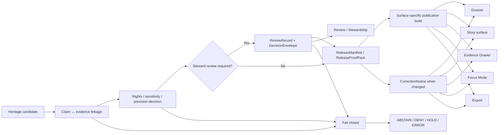

<!-- [KFM_META_BLOCK_V2]
doc_id: kfm://doc/<NEEDS-VERIFICATION-UUID>
title: Heritage Publication and Review Model
type: standard
version: v1
status: draft
owners: <NEEDS VERIFICATION>
created: YYYY-MM-DD
updated: YYYY-MM-DD
policy_label: <NEEDS VERIFICATION>
related: [NEEDS VERIFICATION: repo path for canonical master reference manual, NEEDS VERIFICATION: repo path for strengthened primary documentation, NEEDS VERIFICATION: repo path for MapLibre UI doctrine]
tags: [kfm, heritage, publication, review, evidence, correction]
notes: [PDF-visible doctrine only; repo path, owners, live schema inventory, and CI coverage remain NEEDS VERIFICATION]
[/KFM_META_BLOCK_V2] -->

# Heritage Publication and Review Model

Governed publication rules for heritage-facing outputs across KFM surfaces.

| Field | Value |
|---|---|
| Status | Draft |
| Evidence posture | **CONFIRMED** doctrine · **INFERRED** heritage application · **PROPOSED** runbook/checklist · **UNKNOWN** mounted implementation depth |
| Applies to | Dossier · Story surface · Evidence Drawer · Focus Mode · Export · Review / Stewardship |
| Core promise | Heritage outputs stay evidence-linked, rights-visible, review-visible, and correction-visible at the point of use |

**Quick jump:** [Operating rule](#operating-rule) · [Surface rules](#surface-by-surface-publication-rules) · [Review gates](#review-gates) · [Finite outcomes](#finite-outcomes) · [Correction posture](#correction-posture) · [Verification backlog](#unknowns-and-verification-backlog)

> [!IMPORTANT]
> This standard is doctrine-led and implementation-restrained. Current-session evidence is PDF-visible only. Exact repo path, live route names, schema filenames, API fields, and CI assertions for heritage-specific visibility remain **NEEDS VERIFICATION**.

## Operating rule

**Status:** **CONFIRMED** doctrine · **INFERRED** heritage framing

Heritage publication in KFM is not a storytelling exception to governance. It is a stricter case of governed publication. Any consequential heritage-facing value must remain explainable in terms of evidence state, release state, rights posture, sensitivity posture, review context, and correction lineage.

Public-safe heritage reading is reconstructed from released scope through governed APIs. Dossier, Story surface, Evidence Drawer, Focus Mode, Export, and Review / Stewardship therefore share one trust model even when their audiences, permissions, and density differ.

Narrative convenience does not outrun provenance. Heritage framing may guide interpretation, but it does not replace evidence resolution, policy checks, review artifacts, or correction visibility.

## Surface-by-surface publication rules

**Status:** Trust-critical contents **CONFIRMED** · minimum governing-object crosswalk **INFERRED**

> [!NOTE]
> The trust-critical contents below are source-grounded. The “minimum governing objects” column is a contract-oriented crosswalk derived from the documented KFM object families, not a claim that these exact mounted schema paths already exist.

| Surface | Heritage output type | Trust-critical contents that must remain visible | Minimum governing objects* |
|---|---|---|---|
| **Dossier** | Structured summary of evidence-backed heritage context | Evidence links, uncertainty posture, rights/sensitivity class, correction state | `DatasetVersion` · `EvidenceBundle` · `ReleaseManifest / ReleaseProofPack` · `CorrectionNotice` when applicable |
| **Story surface** | Narrative framing with bounded claims | Claim-to-source linkage, narrowing notes, abstain/deny handling | `EvidenceBundle` · `ReviewRecord` where required · `ReleaseManifest / ReleaseProofPack` · `CorrectionNotice` |
| **Evidence Drawer** | Direct support inspection | Source locator, provenance, rights status, review/decision refs | `EvidenceBundle` · `DecisionEnvelope` where gated · `ReviewRecord` refs |
| **Focus Mode** | Governed synthesis over released scope | Citations, policy-bounded finite outcomes, response-envelope state | `EvidenceBundle` · `RuntimeResponseEnvelope` · `DecisionEnvelope` |
| **Export** | Release-scoped package | Manifest lineage, disclosure class, corrections/supersession metadata | `ReleaseManifest / ReleaseProofPack` · `ProjectionBuildReceipt` · `CorrectionNotice` |
| **Review / Stewardship** | Restricted review interface | Decision records, reviewer actions, escalation notes, withheld rationale path | `ReviewRecord` · `DecisionEnvelope` · `ReleaseManifest` · `CorrectionNotice` |

\* Actual mounted contract names and field inventories remain **NEEDS VERIFICATION**.

## Heritage lane-specific caution

**Status:** Lane burden **CONFIRMED** · default narrowing posture **INFERRED**

> [!CAUTION]
> Heritage is **not** equivalent to hydrology or other public-safe-first lanes. Documentary, archival, oral-history, archaeology, and exact-location materials carry stronger default obligations around context, reuse, sensitivity, and precision.

Heritage-facing publication must preserve the special burden of documentary and archival material. That means retaining context, dates, provenance, and interpretive framing rather than flattening a source into a decontextualized fact strip.

It also means that community-contributed and oral-history material stays governed input, not automatic truth. Confidence handling, moderation, rights handling, and role-aware release decisions remain part of publication, not a postscript.

| Evidence shape | Publication rule |
|---|---|
| **Documentary / archival** | Preserve context, quote frame, dates, and provenance. Do not flatten interpretive material into decontextualized fact. |
| **Oral history / community-contributed** | Treat as governed input with confidence handling, moderation, and rights handling; do not auto-promote as settled truth. |
| **Exact-location heritage / archaeology** | Generalize, restrict, or withhold when precision risk is not covered by a safe public representation. |
| **Derived visualization / narrative synthesis** | Keep derived status visible and subordinate to admissible source evidence and policy. |

## Review gates

**Status:** Fail-closed doctrine **CONFIRMED** · heritage concretization **INFERRED**

A heritage publication candidate should fail closed if any of the following remain unresolved:

- rights/reuse or quote-safety ambiguity
- sensitivity class and precision decision ambiguity
- missing claim-to-evidence linkage
- unresolved steward review requirement
- unresolved correction/supersession propagation
- release-closure failure where the surface depends on catalog, review, documentation, or accessibility gates

| Gate | Why it exists | Visible failure posture |
|---|---|---|
| **Rights / reuse / quote-safety** | Heritage materials can carry redistribution limits, quote constraints, or unclear reuse posture. | Hold, restrict to steward view, or deny public publication. |
| **Sensitivity / precision** | Exact-location, culturally sensitive, or otherwise unsafe detail may not be public-safe at full precision. | Generalize, withhold, or deny. |
| **Claim-to-evidence linkage** | Every consequential heritage claim must remain one hop from inspectable evidence. | Block publication or return `ABSTAIN`. |
| **Steward review requirement** | Oral-history, archaeology, and similar review-bearing cases require explicit review artifacts before release. | Keep candidate in review or quarantine; no hidden approval path. |
| **Correction / supersession propagation** | Corrected heritage outputs must not leave stale public meaning behind. | Block release, or mark prior surface superseded/withdrawn before replacement. |
| **Release closure** | Public-safe publication is not valid without release proof, and in some cases documentation/accessibility closure. | Fail build or promotion. |

## Finite outcomes

**Status:** Outcome grammar **CONFIRMED** · publication mapping **INFERRED**

For runtime and synthesis surfaces, KFM recognizes four valid finite outcomes:

| Outcome | Meaning | Typical surface behavior |
|---|---|---|
| `ANSWER` | Release-safe and evidence-resolvable | Publish or render with citations/links and visible surface state. |
| `ABSTAIN` | Insufficient support, unresolved conflict, or incomplete evidence route | Do not synthesize a claim; show abstained or partial state with reason path. |
| `DENY` | Blocked by policy, rights, sensitivity, or exact-location constraints | Show denied/withheld state with a public-safe reason; steward path retains full rationale. |
| `ERROR` | System failure to produce a governed response | Show errored state and audit trail; do not bluff with fallback prose. |

Story surface, Dossier, and Export do not need to display these literal tokens to end users. Their build and publication behavior should still follow the same logic: if a heritage output cannot satisfy `ANSWER`-like release-safe conditions, it should not quietly publish.

## Correction posture

**Status:** Lineage-preserving correction discipline **CONFIRMED** · public/steward split **INFERRED**

Corrections append lineage. They do not silently rewrite prior public meaning.

| Correction type | Required publication behavior | Public-facing visibility | Steward-facing visibility |
|---|---|---|---|
| **Supersession** | Mark prior output as superseded and link forward to the correcting release or notice. | Superseded state plus forward link. | Affected release refs, rebuild refs, review refs, and correction note. |
| **Withdrawal** | Remove from public-safe exposure and keep visible withdrawal rationale. | Withdrawn / unavailable state with public-safe note. | Full rationale, affected objects, and audit refs. |
| **Narrowing / generalization** | Visibly show that precision was reduced and why. | Generalized state plus note on reduced precision or scope. | Exact obligation, policy basis, and generalized-vs-precise comparison context. |
| **Denial after review** | Preserve decision reason and non-public rationale path for stewards. | Denied / withheld state with public-safe reason. | Complete decision notes, escalation refs, and withheld rationale. |

## Minimum proof-object crosswalk

**Status:** Contract-family definitions **CONFIRMED** · heritage role mapping **INFERRED** · mounted filenames **NEEDS VERIFICATION**

| Object family | Heritage role across surfaces | What must remain inspectable |
|---|---|---|
| **EvidenceBundle** | Support package for a claim, feature, story excerpt, export preview, or answer | Source basis, dataset refs, lineage summary, rights/sensitivity state, transform receipts, negative-path trace |
| **DecisionEnvelope** | Machine-readable policy result for release, withholding, denial, or narrowing | Subject, action, lane, result, reason codes, obligation codes, policy basis, audit linkage |
| **ReviewRecord** | Human approval, denial, escalation, or review note | Reviewer role, decision, timestamp, refs, comments |
| **ReleaseManifest / ReleaseProofPack** | Public-safe release assembly | Version refs, catalog refs, decision refs, docs/accessibility gate, rollback/correction posture |
| **ProjectionBuildReceipt** | Export or derived heritage package built from known release scope | Release ref, projection type, surface class, build time, freshness basis |
| **RuntimeResponseEnvelope** | Focus Mode accountability | Result, citations check, decision ref, surface state, evaluated-at time |
| **CorrectionNotice** | Cross-surface lineage under change | Affected releases, replacement releases, affected surface classes, rebuild refs, cause, public note |

## Proposed heritage publication checklist

**Status:** **PROPOSED**

Before a heritage output is promoted into a public-safe or public-facing surface, verify the following:

- [ ] Every outward claim resolves to a reviewable `EvidenceBundle`.
- [ ] Rights, reuse, and quote posture are explicitly recorded.
- [ ] Sensitivity rank and precision/generalization decision are explicitly recorded.
- [ ] Required steward review has emitted a `ReviewRecord`.
- [ ] Release scope is assembled through a `ReleaseManifest / ReleaseProofPack`.
- [ ] Focus Mode, if present, can return only `ANSWER`, `ABSTAIN`, `DENY`, or `ERROR`.
- [ ] Correction / supersession linkage is wired into every affected surface.
- [ ] Public and steward views both render withheld, generalized, denied, stale, and superseded states legibly.
- [ ] No surface silently broadens visibility beyond the approved release scope.

## Unknowns and verification backlog

**Status:** **UNKNOWN / NEEDS VERIFICATION**

- **NEEDS VERIFICATION:** exact API/output contract fields used by current runtime surfaces.
- **UNKNOWN:** current CI checks that assert heritage-specific trust-critical visibility requirements.
- **NEEDS VERIFICATION:** publication classes, steward drawer payloads, and at least one generalized-vs-precise comparison flow for oral-history, archaeology, and exact-location heritage cases.
- **NEEDS VERIFICATION:** one real release receipt/proof pack and one sample `RuntimeResponseEnvelope` showing heritage `ANSWER` / `ABSTAIN` / `DENY` / `ERROR` behavior.
- **NEEDS VERIFICATION:** mounted repo path, owners, and checked-in contract inventory for this standard.
- **PROPOSED:** a lane-specific heritage publication runbook built from the checklist above.

<strong>Appendix — starter reason codes and trust cues</strong>

### Confirmed starter reason codes

- `rights.unknown`
- `sensitivity.exact_location`
- `validation.schema_failed`
- `corroboration.conflicted`

### Confirmed surface states to keep visible where applicable

- `promoted`
- `generalized`
- `partial`
- `stale-visible`
- `abstained`
- `denied`
- `withdrawn`
- `superseded`

### Proposed heritage-specific additions

- `documentary.context_loss_risk`
- `quote.reuse_unclear`
- `heritage.precision_narrowed`

[Back to top](#heritage-publication-and-review-model)
