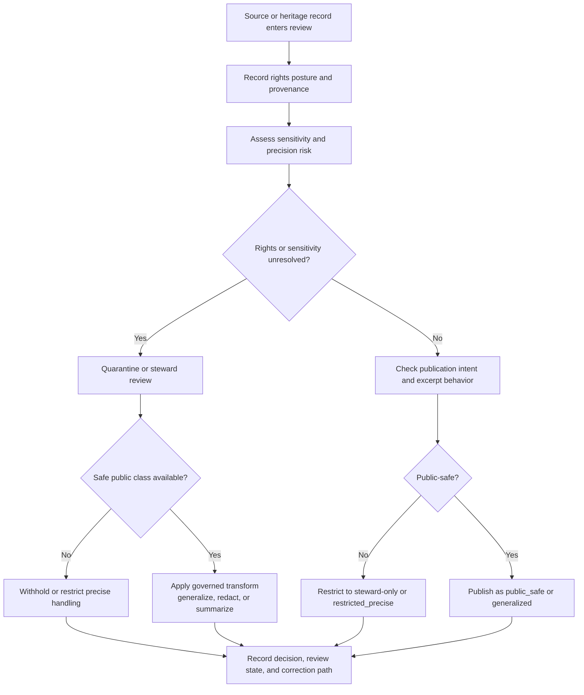

<!-- [KFM_META_BLOCK_V2]
doc_id: kfm://doc/TBD-HERITAGE-RIGHTS-SENSITIVITY-UUID
title: Heritage Rights and Sensitivity Rules
type: standard
version: v1
status: draft
owners: TBD — verify heritage steward / policy owner
created: YYYY-MM-DD
updated: YYYY-MM-DD
policy_label: TBD — verify
related: [TBD — verify adjacent governance, heritage, publication, and correction docs]
tags: [kfm, heritage, rights, sensitivity, policy]
notes: [Current-session repo verification was PDF-only; exact repo path, owners, policy label, machine enum set, and live steward workflow remain NEEDS VERIFICATION.]
[/KFM_META_BLOCK_V2] -->

# Heritage Rights and Sensitivity Rules

Publication and review rules for rights, reuse, quote safety, culturally sensitive material, and exact-location exposure in the heritage lane.

[Purpose](#purpose) · [Rights controls](#rights-and-reuse-controls) · [Quote safety](#quote-and-excerpt-safety) · [Sensitivity controls](#sensitivity-controls) · [Precision policy](#publication-precision-policy) · [Review flow](#review-flow) · [Backlog](#unknowns-and-verification-backlog)

> [!IMPORTANT]
> This document applies KFM’s confirmed governance posture to the heritage lane while keeping unverified implementation details visible.
>
> In this revision:
> - **CONFIRMED** means directly supported by the attached KFM corpus.
> - **PROPOSED** means a heritage-lane rule or packaging move that fits confirmed KFM doctrine but is not directly verified in mounted implementation.
> - **UNKNOWN** and **NEEDS VERIFICATION** remain explicit where repo, schema, workflow, or enforcement evidence was not directly surfaced.

## Purpose

The heritage lane covers narrative and documentary evidence such as scans, transcripts, map sheets, captions, archival description, oral-history collections, and related heritage documentation. In KFM, those materials are not decorative attachments. They are governed evidence-bearing resources whose publication burden includes context, rights, reuse limits, provenance, sensitivity, and visible correction state.

This document exists to keep heritage publication decisions inspectable and repeatable. It is meant to stop four common failure modes:

1. rights ambiguity getting smoothed into publication
2. decontextualized excerpts becoming stand-alone “facts”
3. culturally sensitive or exact-location-sensitive material leaking through generalized public surfaces
4. UI-only hiding rules replacing governed transforms, review records, and correction lineage

## Governing posture

| Posture | Rule |
|---|---|
| **Rights-first publication** | No heritage object becomes public-safe merely because it is interesting, old, or easy to display. Rights, sensitivity, provenance, and release state still have to pass. |
| **Context is part of the evidence** | Heritage interpretation must preserve source context rather than flattening archival or oral-history material into decontextualized claims. |
| **Redaction is a governed transform** | Coordinate suppression, generalization, policy-safe summaries, and similar narrowing moves belong in the governed transform path, not as ad hoc client-side hide rules. |
| **Review is visible** | Heritage publication decisions should leave inspectable review state, policy basis, and correction lineage. |
| **Fail closed when unresolved** | Unclear rights, unresolved sensitivity, or unsupported exact-location release should route to quarantine, restricted handling, or withholding rather than silent publication. |

## Rights and reuse controls

| Control area | Heritage-lane rule | Required review consequence |
|---|---|---|
| Copyright / reuse | Record the rights posture before extraction, excerpting, transformation, or publication. Unresolved rights fail closed. | Route to quarantine or restricted review until the source basis, reuse terms, and redistribution posture are explicit. |
| Redistribution limits | Respect item-level, collection-level, donor, archive, or steward restrictions. Derivative publication may be narrower than reading-room or internal access. | Public-safe publication must not outrun the narrowest applicable redistribution rule. |
| Quote safety | Quotes must remain traceable to inspectable source context and release scope. | Require source trace, reviewable context, and policy-safe excerpt behavior before outward publication. |
| Excerpt policy | Prefer minimal excerpts tied to surrounding source context over large decontextualized copy blocks. | When excerpting increases rights or sensitivity risk, replace with summary, generalized note, or withholding rationale. |
| Derivative summaries | Summaries, captions, and synthesized descriptions must stay linked to inspectable evidence and marked as derived. | A derived statement without resolvable evidence should not be promoted. |
| Terms snapshots | Preserve source terms, license notes, donor restrictions, or archive conditions when relevant. | Review must be able to show what terms governed the publication decision at release time. |

## Quote and excerpt safety

Heritage excerpts often carry more risk than simple metadata because they can expose restricted detail, distort meaning through truncation, or imply a broader reuse right than the source allows.

### Required safeguards

| Rule | Practical expectation |
|---|---|
| **Traceability** | Keep a source trace that is strong enough for review: collection/item reference, page or locator where available, transform note where applicable, and release linkage. |
| **Context retention** | Preserve enough surrounding context to avoid misleading cherry-picking. |
| **Minimality** | Use the smallest excerpt that still supports the public-safe claim. |
| **Derived labeling** | Clearly distinguish direct excerpt, paraphrase, summary, transcription, translation, and editorial normalization. |
| **Policy-safe fallback** | When a quote is not safely reusable, switch to summary, generalized statement, metadata-only publication, steward-only access, or withholding. |

> [!NOTE]
> **NEEDS VERIFICATION:** exact quote-length or excerpt-size enforcement, and the policy/test location where it would be machine-checked.

## Sensitivity controls

The first two rows below are directly aligned with confirmed KFM sensitivity doctrine. The remaining heritage-specific applications are conservative extensions of that doctrine and should be treated as **PROPOSED heritage-lane defaults** until lane-specific policy tests and steward workflows are directly surfaced.

| Sensitivity class | Typical handling |
|---|---|
| Culturally sensitive material | Steward review required before publication; default to restricted handling or withholding if sensitivity remains unresolved. |
| Exact-location-sensitive sites | Generalize geography for public outputs; precise geometry remains steward-only, restricted, or withheld. |
| Living-person-linked records | Narrow place/time precision and personal detail by default; avoid direct public precision release unless policy basis is explicit. |
| Burial / memorial precision | Treat plot-, row-, grave-, or mound-level exactness as restricted unless explicit policy basis permits release. |
| Sacred / ceremonial association | Prefer generalized, neutral, and non-revealing public representation; require heritage-sensitive wording review. |
| Community-submitted heritage leads | Treat as governed input, not automatic truth; require moderation, provenance, and rights handling before public reuse. |

## Publication precision policy

The class names below are a **PROPOSED doc-level policy vocabulary** for keeping heritage review outcomes explicit. They should be reconciled with machine contracts and policy registries before being treated as canonical enum values.

| Publication class | Meaning | Typical use |
|---|---|---|
| `public_safe` | Generalized, non-reidentifying representation only. | Public maps, Story surfaces, civic exploration, broad heritage overview. |
| `generalized` | Visible narrowing of place, time, identity, or descriptive detail, with explanation. | Public heritage notes where exact detail would overexpose the subject. |
| `steward_only` | Precise or sensitivity-bearing view restricted to authorized reviewers or stewards. | Exact site review, archival sensitivity review, controlled inspection. |
| `restricted_precise` | Exact detail retained internally under governance but not released broadly. | Canonical restricted asset paths, review-bearing internal reference sets. |
| `withheld` | No publication of the underlying detail; expose only rationale or high-level notice if appropriate. | Unresolved rights, unresolved cultural sensitivity, harmful exact-location exposure, contested release basis. |

### Interpretation rules

- `public_safe` is the default target for outward publication, not the default assumption for intake.
- `generalized` is preferred over accidental precision.
- `steward_only` and `restricted_precise` are not public classes.
- `withheld` is a valid governed outcome, not a failure of the documentation process.

## Steward review requirements

Steward review is mandatory when any of the following triggers are present:

1. unresolved rights, donor terms, or derivative-use ambiguity
2. culturally sensitive context uncertainty
3. exact-location exposure risk
4. living-person, family, descendant, or community harm risk
5. burial, memorial, ceremonial, or sacred-place precision
6. contested interpretation with policy, sensitivity, or release consequences
7. public-safe publication that depends on redaction, generalization, or metadata-only substitution
8. correction, narrowing, supersession, or withdrawal of a previously released heritage object

## Public-safe vs steward-only outputs

| Field type | Public-safe default | Steward-only allowance |
|---|---|---|
| Place | County, watershed, township, county-range-section bucket, city, region, or other coarse frame | Exact site, address, parcel, burial plot, trench, or recorded coordinates where policy allows |
| Time | Year, approximate era, or bounded date range | Exact dates, timestamps, accession timing, or event sequence where policy allows |
| Personal detail | Minimal contextual identity only | Expanded detail under controlled access and review |
| Source excerpt | Short, contextualized, policy-safe excerpt or summary | Broader excerpt where rights and sensitivity review allow it |
| Visual symbolization | Generalized or culturally neutral representation | Richer restricted symbology where stewardship approves it |
| Geometry | Suppressed, masked, generalized, or area-based | Precise point/line/polygon under role-limited access |

## Review flow

## Proof objects and enforcement touchpoints

The doctrine-backed object family below is important for heritage handling even where mounted schemas remain unverified.

| Proof object | Heritage-lane role |
|---|---|
| `SourceDescriptor` | Declares source identity, owner or steward, access mode, rights posture, cadence, validation plan, and publication intent. |
| `DatasetVersion` | Carries the candidate or promoted heritage subject set with support, time semantics, and provenance links. |
| `EvidenceBundle` | Packages the support for a claim, excerpt, feature, story block, or export preview, including context, transform receipts, and rights/sensitivity state. |
| `DecisionEnvelope` | Records the machine-readable policy result for publication, denial, generalization, or withholding. |
| `ReviewRecord` | Captures steward approval, denial, escalation, note, or restriction basis. |
| `CorrectionNotice` | Preserves visible lineage when a heritage publication is narrowed, generalized further, corrected, superseded, or withdrawn. |

> [!CAUTION]
> Exact schema paths, enum sets, and mounted workflow wiring for these proof objects remain **NEEDS VERIFICATION** in the current session.

## Heritage-lane application notes

### What belongs in this rule set

- archival description with reuse constraints
- oral-history or transcript material with publication implications
- heritage map sheets, scans, captions, and documentary excerpts
- site or memorial references where exactness changes harm posture
- public-safe Story or dossier material that depends on generalization

### What does not belong here

- generic copyright boilerplate with no heritage consequence
- UI-only hiding behavior that has no governed transform behind it
- implementation claims about active workflows, tests, or route trees that were not directly verified
- unrestricted publication assumptions based only on public discoverability

## Unknowns and verification backlog

- **NEEDS VERIFICATION:** exact quote-length or excerpt-size enforcement location in policy or tests.
- **UNKNOWN:** complete steward authorization workflow implementation path.
- **NEEDS VERIFICATION:** established rights vocabulary and enum set in machine contracts and policy registries.
- **NEEDS VERIFICATION:** exact repo path and owning steward or policy team for this document.
- **UNKNOWN:** whether generalized-vs-precise comparison flows already exist as mounted reviewer payloads.
- **UNKNOWN:** whether heritage-lane correction notices already carry a dedicated withdrawal/generalization subtype in current implementation.

## Change discipline for future revisions

Revise this file only when at least one of the following changes materially:

- rights or reuse handling
- sensitivity classes or review triggers
- publication precision classes
- proof objects or review records required for release
- correction or withdrawal behavior
- machine contracts, policy registries, or tests that make heritage publication rules more explicit

[Back to top](#heritage-rights-and-sensitivity-rules)
