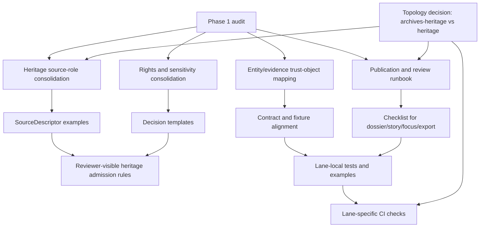

<!-- [KFM_META_BLOCK_V2]
doc_id: kfm://doc/NEEDS-VERIFICATION
title: Heritage Lane Roadmap and Verification Backlog
type: standard
version: v1
status: draft
owners: NEEDS VERIFICATION
created: YYYY-MM-DD
updated: YYYY-MM-DD
policy_label: NEEDS VERIFICATION
related: [NEEDS VERIFICATION: heritage lane README, heritage source-role guide, heritage rights/sensitivity guide, heritage publication/review guide]
tags: [kfm, heritage, roadmap, verification, governance]
notes: [Current-session workspace verification was PDF-only; exact repo path, owners, and related mounted files remain NEEDS VERIFICATION. This document preserves heritage-lane doctrine and backlog structure without implying current implementation completeness.]
[/KFM_META_BLOCK_V2] -->

# Heritage Lane Roadmap and Verification Backlog

Prioritized follow-on artifacts and open verification work for moving the heritage lane toward enforcement-ready, evidence-first operation.

> [!NOTE]
> **Status:** draft  
> **Owners:** NEEDS VERIFICATION  
>      
> **Quick jumps:** [Scope](#scope) · [Phase 1 survey summary](#phase-1-survey-summary-current-state-audit) · [Enforcement pressures](#heritage-lane-enforcement-pressures) · [Priority roadmap](#priority-roadmap) · [Verification backlog](#open-unknowns--verification-backlog) · [Artifact wave](#proposed-follow-on-artifact-wave) · [Definition of done](#definition-of-done-for-next-pass)  
> **Repo fit:** suggested placement in the heritage lane subtree; exact path remains **NEEDS VERIFICATION** pending the unresolved topology choice between `archives-heritage` and standalone `heritage`.

> [!IMPORTANT]
> This document is a **roadmap and verification backlog**, not proof that the named schemas, workflows, CI checks, review drawers, or publication gates already exist in mounted implementation.

> [!WARNING]
> Current-session repo inspection was PDF-only. References here to lane structure, artifact families, or companion-doc shapes are grounded in attached project doctrine and audit materials, but exact filenames, directories, owners, and implementation coverage still require direct repository verification before merge.

## Scope

The heritage lane is not a decorative storytelling add-on. In KFM doctrine it sits inside the Kansas operating lanes alongside hydrology, hazards, agriculture, transportation, ecology, land tenure, and service geography. Its burden is different from those lanes because it mixes documentary evidence, scans, transcripts, captions, archival description, oral-history material, and heritage documentation with stronger reuse, context, and sensitivity constraints.

This file exists to do three things:

1. Keep the current heritage follow-on work visible and prioritized.
2. Separate **confirmed doctrine** from **proposed artifactization**.
3. Reduce the risk that heritage publication appears more mature, more automated, or more policy-complete than the evidence currently supports.

## Repo fit

| Field | Current reading |
| --- | --- |
| Suggested role | Lane-level planning and verification reference |
| Likely parent area | Heritage or archives/heritage docs subtree |
| Upstream doctrine | Central KFM master reference, domains/source atlas, verification and artifactization overlays |
| Downstream companions | Source-role guide, rights/sensitivity guide, entity/evidence model, publication/review guide, fixtures/tests, release checklists |
| Path certainty | **NEEDS VERIFICATION** |

## Accepted inputs

This document should track only heritage-lane work that is narrow enough to review and strong enough to act on, such as:

- verified lane audit findings
- doctrine-backed artifact backlog items
- review-bearing heritage publication constraints
- contract and fixture alignment tasks
- policy or review tasks that block public-safe heritage release
- unresolved topology, ownership, or enforcement questions that materially affect the lane

## Exclusions

This document is **not** the place for:

- free-form ideation dumps
- release claims without evidence
- broad project-wide CI/CD design notes unless they materially affect heritage publication
- domain content itself, such as archival summaries or oral-history interpretations
- pretending that lane-local docs, drawers, routes, schemas, or workflows are mounted and implemented when they have not been directly verified

## Phase 1 survey summary (current-state audit)

### Strong docs to preserve

- `README.md` lane framing and evidence-first posture
- GEDCOM intake and downstream pipeline docs
- examples/fixtures lane-local companion docs

### Thin or redundant areas to repair

- Source-role guidance was distributed but not consolidated into one lane reference.
- Rights/sensitivity rules were present but not centralized for reviewer use.
- Entity/evidence artifact mapping to trust objects needed an explicit lane-level table.

### Current pass target closures

The current pass is intended to close the most visible doctrine-to-artifact gaps by centering:

- source roles for heritage materials
- reviewer-facing rights and sensitivity handling
- entity/evidence mapping to KFM trust objects
- publication and review checkpoints
- explicit unknown tracking rather than implied certainty

> [!TIP]
> Treat the list above as a **target closure set**, not as proof that every companion file already exists at a mounted repo path.

## Heritage lane enforcement pressures

Heritage material carries a stricter publication burden than a simple map layer. The lane must keep provenance, context, reuse constraints, and sensitivity visible at review time and at public surfaces.

| Pressure | Why it matters | Minimum response |
| --- | --- | --- |
| Documentary context preservation | Archival descriptions, scans, transcripts, oral histories, and captions lose meaning when flattened into detached facts. | Preserve source identity, quote context, and narrative provenance. |
| Rights and derivative limits | Viewing, quoting, reuse, redistribution, and commercial derivative rights may differ. | Make rights posture explicit before release. |
| Cultural and community sensitivity | Some heritage materials can be viewable while still requiring precision controls, wording controls, or steward review. | Support publication classes, review notes, and generalized-vs-precise comparison. |
| Exact-location exposure | Archaeology, protected sites, and some heritage records may require withholding or generalization. | Make public-safe precision state visible, not hidden. |
| Narrative convenience risk | Storytelling pressure can erase uncertainty, provenance, or contested interpretation. | Keep evidence one hop away from every consequential heritage claim. |
| Mixed evidence types | Heritage work combines documentary, community-contributed, statutory, and sometimes modeled/contextual layers. | Keep source roles distinct and machine-visible. |

## Priority roadmap

| Priority | Artifact | Status | Why it matters | First useful proof artifact |
| --- | --- | --- | --- | --- |
| P0 | Heritage source descriptor examples tied to lane roles | PROPOSED | Converts doctrine into reviewable, machine-adjacent examples. | A small registry of heritage source descriptors covering archive, oral-history, documentary scan, and mirror/discovery cases |
| P0 | Rights/sensitivity decision templates for steward review | PROPOSED | Reduces inconsistent publication decisions. | One reviewed template set for public-safe, generalized, withheld, and rights-unclear outcomes |
| P1 | Heritage contract/fixture alignment pass with schemas/contracts | NEEDS VERIFICATION | Prevents doc-contract drift. | One valid/invalid fixture set mapped to heritage-critical proof objects |
| P1 | Publication checklist runbook for dossier/story/focus/export | PROPOSED | Makes trust-critical visibility testable before release. | One lane-specific checklist that can be executed by reviewer or CI |
| P2 | Lane-specific CI checks for quote-safety and precision narrowing | UNKNOWN | Moves heritage policy from prose to enforcement. | One automated check for quote locator presence and one for generalized coordinate/path rules |
| P2 | Canonical split decision: `archives-heritage` vs standalone `heritage` | NEEDS VERIFICATION | Clarifies long-term lane topology. | ADR or topology note naming the owning subtree and routing boundary |

## Dependency map

## Working review sequence

1. Confirm the lane’s canonical location and ownership.
2. Verify which heritage companion docs already exist.
3. Normalize source-role language into one lane reference.
4. Normalize rights/sensitivity handling into one reviewer-facing guide.
5. Align heritage-critical trust objects with current contract families.
6. Add valid/invalid examples before claiming enforcement.
7. Add lane-local runbook and only then consider CI automation.

## Open unknowns / verification backlog

| Status | Open item | Why it matters | Direct verification needed |
| --- | --- | --- | --- |
| UNKNOWN | Exact schema and policy bundles currently enforcing heritage rights/sensitivity gates | Without this, “enforcement-ready” remains aspirational rather than reviewable. | Surface the mounted schemas, policy bundles, and one example evaluation path |
| NEEDS VERIFICATION | Active workflow/CI checks for lane-specific publication constraints | Determines whether heritage controls live only in prose or also in automation | Inspect workflows, tests, and merge gates tied to heritage publication |
| NEEDS VERIFICATION | Maintainer and steward ownership map for this lane | Review-bearing material needs clear operating ownership | Confirm CODEOWNERS, reviewer roles, and lane steward responsibilities |
| UNKNOWN | Full registry of heritage source families with machine-usable descriptors | Source admission cannot be made consistent without a stable descriptor set | Surface registry entries or create first-wave source descriptor examples |
| NEEDS VERIFICATION | Current generalized-vs-precise review flow for exact-location heritage cases | Exact-location exposure is a trust-critical heritage issue | Verify whether a steward drawer payload and comparison flow already exist |
| UNKNOWN | Mounted proof objects already used by heritage publication surfaces | Prevents re-documenting concepts that may already exist in checked-in form | Inspect contracts, fixtures, manifests, and release artifacts tied to heritage outputs |

## Proposed follow-on artifact wave

The items below are **proposed shapes**, not asserted mounted files.

| Artifact family | Suggested role in the lane | Status |
| --- | --- | --- |
| Heritage source-role guide | Consolidates archive, documentary, oral-history, mirror/discovery, and community-contributed handling | PROPOSED |
| Heritage rights and sensitivity guide | Central reviewer reference for reuse, quotation, derivative limits, precision controls, and steward review triggers | PROPOSED |
| Heritage entity/evidence model | Maps lane objects to SourceDescriptor, EvidenceBundle, ReviewRecord, DecisionEnvelope, and related trust objects | PROPOSED |
| Heritage publication and review guide | Defines pre-publication checks for dossier, story, Focus, and export surfaces | PROPOSED |
| Heritage source descriptor examples | Turns doctrine into concrete examples with identity, access, semantics, rights, validation, and lineage fields | PROPOSED |
| Rights/sensitivity decision templates | Makes publication classes and obligations consistent | PROPOSED |
| Heritage valid/invalid fixtures | Grounds contract language in examples | NEEDS VERIFICATION |
| Quote-safety and locator checks | Enforces citation/locator discipline for heritage excerpts | UNKNOWN |
| Precision narrowing checks | Enforces generalized vs precise output rules | UNKNOWN |
| Topology ADR | Settles `archives-heritage` vs `heritage` subtree ownership | NEEDS VERIFICATION |

## Review gates for enforcement readiness

| Gate | Minimum proof | Fail-closed outcome |
| --- | --- | --- |
| Source admission | Heritage source descriptor with rights/sensitivity and publication intent | Do not admit source to downstream publication path |
| Heritage evidence mapping | One lane table mapping source/material types to trust objects | Do not claim runtime evidence readiness |
| Reviewer decision consistency | Decision templates or equivalent structured review payloads | Hold publication for steward review |
| Public-safe precision | Generalized-vs-precise rule documented and testable | Withhold or generalize public output |
| Dossier/story/Focus/export checklist | Runbook step list with explicit trust-visible checks | Do not mark surface release-ready |
| Fixtures and validation | At least one valid and one invalid heritage example | Keep rules documentary, not enforced |
| CI automation | Verified heritage-specific checks | Leave status at manual-review only |

## Definition of done for next pass

- [ ] Heritage source-role and rights rules are reflected in fixtures/tests, not prose only.
- [ ] At least one lane-specific publication review checklist is runnable in CI or review tooling.
- [ ] Contract/schema references for lane-critical artifacts are path-accurate and verified.
- [ ] Unknowns are reduced, and any remaining uncertainty is explicitly tracked.

## FAQ

### Is this a release or implementation record?

No. This is a planning and verification document for the heritage lane.

### Does this file prove that the companion docs already exist?

No. Exact file inventory remains **NEEDS VERIFICATION** unless directly surfaced in the mounted repo.

### Why is rights/sensitivity so central here?

Because heritage publication burdens are materially different from simpler observational lanes. Reuse limits, cultural sensitivity, quotation safety, and exact-location exposure can all change what is public-safe.

### Why is topology still open?

Because the current audit brief itself names the unresolved split between `archives-heritage` and standalone `heritage`. This document preserves that uncertainty rather than forcing a false repo fact.

## Task list / completion conditions

- [ ] Verify canonical lane path
- [ ] Verify owners and reviewer roles
- [ ] Verify existing companion docs and remove duplicates
- [ ] Add first-wave heritage source descriptor examples
- [ ] Add steward-facing rights/sensitivity templates
- [ ] Align lane docs with current contract families
- [ ] Add fixtures and at least one negative example
- [ ] Add checklist runbook for dossier/story/focus/export
- [ ] Decide whether CI automation is manual-next or immediate-following
- [ ] Record the topology decision explicitly

<strong>Appendix — working non-claims</strong>

This document does **not** claim any of the following without further verification:

- mounted schema paths for heritage-specific proof objects
- active CI enforcement for quote-safety or precision narrowing
- implemented steward drawer payloads for heritage review
- implemented public/steward split surfaces dedicated to heritage
- final subtree placement for the lane
- current named owners, dates, or policy label values for this document

These remain visible on purpose so the lane can be strengthened without persuasive overclaiming.

[Back to top](#heritage-lane-roadmap-and-verification-backlog)
