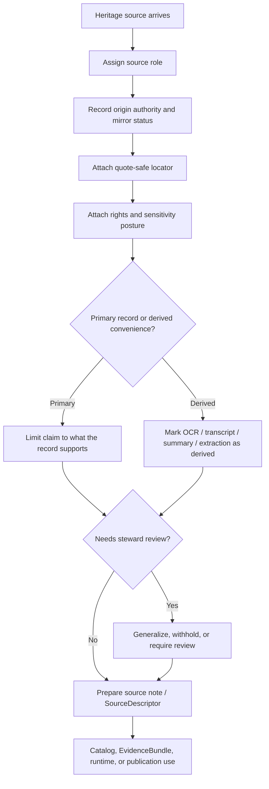

<!-- [KFM_META_BLOCK_V2]
doc_id: kfm://doc/<TODO-uuid>
title: Heritage Source-Role Discipline
type: standard
version: v1
status: draft
owners: TODO-verify-heritage-steward(s)
created: TODO-YYYY-MM-DD
updated: TODO-YYYY-MM-DD
policy_label: TODO-verify-policy-label
related: [TODO: verify adjacent heritage/domain docs, source atlas, SourceDescriptor schema, EvidenceBundle docs]
tags: [kfm, heritage, source-role, provenance]
notes: [PROPOSED repo path only; current session exposed doctrinal PDFs but no mounted repo tree, schema registry, or test inventory]
[/KFM_META_BLOCK_V2] -->

# Heritage Source-Role Discipline

Lane-specific source-role semantics and minimum evidence-handling rules for heritage materials in KFM’s heritage lane.


| Field | Value |
| --- | --- |
| Status | `draft` |
| Owners | `TODO: verify heritage/domain steward(s)` |
| Repo fit | `PROPOSED: docs/domains/heritage/source-role-discipline.md` |
| Path confidence | `NEEDS VERIFICATION` |
| Audience | Heritage stewards, source-onboarding authors, policy/review authors, connector builders, Evidence Drawer / Focus implementers |

**Quick jump:** [Scope](#scope) · [Repo fit](#repo-fit) · [Source-role matrix](#source-role-matrix) · [Representative source families](#representative-source-families) · [Heritage intake minimum](#heritage-intake-minimum) · [Open unknowns](#open-unknowns-and-verification-backlog)

> [!IMPORTANT]
> This document is doctrine-facing and repo-placement-conservative. It states **CONFIRMED** lane rules from the visible corpus, carries **INFERRED** heritage-specific normalizations where the corpus strongly implies them, and keeps machine enforcement, exact repo paths, schemas, and tests as **UNKNOWN** or **NEEDS VERIFICATION** where the current session did not surface mounted implementation.

## Scope

This document defines how KFM should classify, describe, and handle heritage materials before they are used in dossiers, story surfaces, Evidence Drawer payloads, Focus answers, exports, or other outward-facing artifacts.

It applies to heritage-lane materials such as archival items, newspapers, oral histories, heritage registers, field observations, and mirror-index records. It also applies to convenience derivatives such as OCR text, transcripts, summaries, extractions, and discovery mirrors when those are used to accelerate intake or explanation.

This document is **not** a complete release policy, a substitute for a full `SourceDescriptor` contract, or proof that machine-enforced validation already exists at a verified repo path.

## Repo fit

**PROPOSED path**

`docs/domains/heritage/source-role-discipline.md`

**Why this placement is plausible**

This topic belongs with lane-specific documentation rather than with generic platform doctrine. It is narrow enough to live close to other heritage-lane material, but important enough to act as a durable rule document for source onboarding, review, and runtime evidence behavior.

**Upstream dependencies**

- `NEEDS VERIFICATION` — heritage/domain index or lane overview
- `NEEDS VERIFICATION` — source atlas / lane burden documentation
- `NEEDS VERIFICATION` — source onboarding or `SourceDescriptor` contract documentation
- `NEEDS VERIFICATION` — rights/sensitivity or review workflow docs

**Downstream consequences**

- heritage source notes and onboarding records
- `SourceDescriptor` and evidence payload design
- Evidence Drawer heritage rendering
- Focus answer behavior over heritage materials
- review / escalation behavior for sensitive or weakly corroborated heritage claims

## Accepted inputs

This document belongs alongside materials that describe or onboard:

- archival descriptions and item records
- newspapers and issue/page references
- oral history audio, transcripts, and transcript derivatives
- heritage registers and designation records
- field notes, steward observations, and condition reports
- mirror indexes and discovery-service references
- OCR, transcript cleanup, summaries, and extraction outputs tied to heritage corpora

## Exclusions

This document does **not** belong in place of:

- a full schema inventory
- a general KFM metadata-spine manual
- the complete public release / promotion workflow
- lane-agnostic policy reason-code registries
- implementation claims about mounted tests, fixtures, or runtime handlers not directly surfaced in the current session

## Status posture

| Label | Current statement |
| --- | --- |
| **CONFIRMED** | The heritage lane must preserve documentary context, provenance, and source-role distinctions. |
| **INFERRED** | The source-role handling rules below align with the visible KFM lane model, source-role doctrine, and onboarding-as-contract posture. |
| **NEEDS VERIFICATION** | Exact repo path(s), machine-readable enum names, schema fields, fixtures, and tests that enforce this discipline. |
| **UNKNOWN** | Whether the current repo already contains a heritage-specific `SourceDescriptor` extension, mirror-vs-origin tests, or review payload examples for generalized-vs-precise heritage cases. |

## Why this document exists

KFM’s heritage lane is not a generic “content” bucket. It carries narrative evidence, scans, transcripts, map sheets, captions, archival description, oral-history collections, and heritage documentation. That means the lane must prevent a common failure mode: converting rich, contextual records into smooth but weakly supported present-tense fact claims.

This document exists to keep three boundaries visible:

1. **Recorded statement vs asserted fact**
2. **Origin authority vs mirror convenience**
3. **Primary record vs derived convenience output**

Those boundaries are what keep heritage material usable without making it falsely authoritative.

## Core discipline

Heritage handling in KFM should follow four durable rules.

**First, preserve documentary context.**  
A heritage item is not merely a fact container. Its provenance, item identity, locator, time basis, and rights posture remain part of what the item means.

**Second, keep source role explicit.**  
A register entry, a newspaper page, an oral-history transcript, an OCR layer, and a mirror index are not interchangeable—even when they mention the same subject.

**Third, never let convenience derivatives masquerade as primaries.**  
OCR, extraction, transcript cleanup, summaries, and discovery mirrors may be extremely useful, but they must remain visibly derived or secondary when the origin record is available.

**Fourth, escalate sensitivity rather than smoothing it away.**  
Exact locations, culturally sensitive material, community-held memory, and incomplete corroboration belong in review-bearing flows, not in automatic flattening pipelines.

## Source-role matrix

| Source role | Allowed claim form in the heritage lane | Not allowed without escalation | Minimum note additions |
| --- | --- | --- | --- |
| **Documentary / archival** | “Source X records Y at locator Z.” | Flattening the archival record into unsupported contemporary fact claims. | Item identity, origin authority, locator, rights/reuse posture, quote context. |
| **Community-contributed** | “Contributor report states Y, pending corroboration or review.” | Treating a single contribution as settled heritage fact. | Contributor identity or provenance token, moderation state, consent/rights note, confidence note. |
| **Statutory / administrative** | “Registry or designation records Y under authority A.” | Conflating legal designation with full historical or interpretive certainty. | Issuing authority, effective date, designation scope, legal status note. |
| **Direct observational / field** | “Field observation records condition, time, and place under protocol P.” | Publishing precise sensitive locations or conditions without rights/sensitivity clearance. | Observer/steward, protocol, observation time, support, precision/sensitivity posture. |
| **Modeled / derived** | “Derived output summarizes or extracts from source corpus under method M.” | Presenting OCR, extraction, clustering, or summaries as if they were primary records. | Method, transform/extraction status, source inputs, validation limits, derived marker. |
| **Mirror / discovery service** | “Mirror index points to origin source at locator L.” | Using the mirror as final authority when origin records are available. | Mirror status, origin authority, origin locator when known, resolution attempt note. |

## Representative source families

| Source family | Role tendency | Handling note |
| --- | --- | --- |
| **Kansas Historical Society / Kansas Memory** | Documentary / archival | Preserve item-level context, rights fields, and stable citation locators. |
| **Chronicling America / newspaper corpora** | Documentary / archival + mirror | Treat OCR as derived convenience; retain issue, date, and page anchors. |
| **Oral history programs** | Documentary / archival + community-contributed | Keep transcript, audio, and quote locator aligned; do not let transcript cleanup overwrite testimony context. |
| **Heritage registers** | Statutory / administrative | Keep designation scope separate from broader interpretation claims. |
| **Local archive mirrors** | Mirror / discovery service | Use for discovery and fallback access, but resolve to origin authority where possible. |

## Heritage intake minimum

KFM’s broader doctrine treats source onboarding as a contract rather than a download. For heritage materials, that base rule should be extended with lane-specific minimums.

### Required intake checklist

- [ ] Source role assigned.
- [ ] Origin authority recorded.
- [ ] Mirror status recorded.
- [ ] Quote-safe locator recorded (`page`, `timecode`, `item-id`, `issue+page`, or equivalent).
- [ ] Rights / reuse / quote constraints attached.
- [ ] Sensitivity class assigned.
- [ ] Claim extraction status marked as **derived** where applicable.
- [ ] If oral history is involved, transcript/audio identity alignment recorded.
- [ ] If exact location is sensitive, generalization or withholding posture recorded.
- [ ] If mirror-only access was used, origin-resolution attempt or rationale recorded.

### Minimum field families for a heritage source note

| Field family | Minimum heritage expectation | Status |
| --- | --- | --- |
| **Identity** | source identifier, title, provider, origin authority, steward or contact, role assignment | **CONFIRMED** base need; heritage emphasis **INFERRED** |
| **Access** | origin vs mirror status, access mode, fetch or reference pattern, fallback notes | **CONFIRMED** base need |
| **Semantics** | declared grain/support, time basis, method, primary-vs-derived status, publication intent | **CONFIRMED** |
| **Locator** | quote-safe locator for the supporting record | **INFERRED** heritage-specific completion |
| **Rights and sensitivity** | rights holder, reuse terms, attribution, precision constraints, privacy/care obligations, review requirement | **CONFIRMED** base need; heritage emphasis **CONFIRMED** |
| **Validation** | identity checks, locator checks, transform checks, mirror/origin checks, quarantine triggers | **CONFIRMED** base need; heritage-specific examples **INFERRED** |
| **Lineage** | raw/origin reference, transform family, derived markers, outbound catalog/evidence expectations | **CONFIRMED** |

## Mirror vs origin handling

> [!NOTE]
> A mirror is a discovery convenience, not an authority upgrade.

When a heritage record is discovered through a mirror, the mirror should remain explicitly labeled as a mirror or discovery service. The working assumption should be:

- use the mirror to **find** the record;
- prefer the origin authority to **anchor** the claim when possible;
- if the origin cannot be resolved in the current run, keep the record visibly mirror-dependent rather than pretending the mirror is the same thing as the origin.

This matters most for newspaper OCR portals, local archive mirrors, and aggregator sites that help discovery but should not silently replace item-level provenance.

## Quote-safe locator discipline

Heritage claims should be locator-bearing by default. “Locator-bearing” means that a reader, reviewer, or runtime surface can point to the exact evidence location that supports the statement.

Acceptable locator patterns vary by source family:

- archival item: `item-id`, accession, folder/box, page
- newspaper: `issue-date + page`, column when available
- oral history: `timecode`, transcript page/line anchor when available
- register: `entry-id`, designation number, effective date
- field note: `observation-id`, notebook page, timestamp

If the best available support is only approximate, the approximation should be stated rather than implied away.

## Oral history transcript/audio alignment

Oral history handling should preserve the relationship between:

- the audio or audiovisual primary object
- the transcript
- any cleaned transcript or excerpt
- any summary or extracted claim

A cleaned transcript is not the same thing as the original recording. A summary is not the same thing as the transcript. Claims should therefore stay aligned to the specific layer they came from, with locators that match the layer actually used.

## Sensitive location and culturally sensitive material

> [!WARNING]
> Heritage publication is not precision-maximization by default.

Some heritage materials carry exact-location, cultural, community, archaeological, or stewardship sensitivities. In those cases, the correct move is not to preserve maximum visible precision at all costs. The correct move is to make the publication posture explicit:

- `public-safe`
- `generalized`
- `withheld`
- `review-required`

Where exact precision is unsafe, generalized or withheld publication is the correct state. That state should remain visible in metadata and runtime evidence behavior rather than being hidden as an internal adjustment.

## Machine-readable implications (PROPOSED)

The current session did **not** surface a verified heritage-specific enum or schema path. The minimum machine-readable shape below is therefore **PROPOSED**, not asserted repo fact.

### Proposed starter enum values

| Field | Proposed values |
| --- | --- |
| `source_role` | `documentary_archival`, `community_contributed`, `statutory_administrative`, `direct_observational_field`, `modeled_derived`, `mirror_discovery_service` |
| `mirror_status` | `origin`, `mirror`, `mirror_only_currently_resolved` |
| `claim_extraction_status` | `primary`, `manual_extract`, `ocr`, `transcript_cleanup`, `summary`, `derived_model_output` |
| `sensitivity_class` | `public_safe`, `generalize`, `withhold`, `review_required` |

<details>
<summary>Illustrative heritage source-note shape (PROPOSED)</summary>

```yaml
source_id: TODO
title: TODO
source_role: documentary_archival
origin_authority:
  name: Kansas Historical Society
  status: origin
mirror_status: origin
locator:
  kind: item_id
  value: TODO
semantics:
  time_basis: recorded_at_source
  support: item_level
  claim_extraction_status: primary
rights:
  reuse_status: TODO
  quote_constraints: TODO
  attribution_required: true
sensitivity:
  class: public_safe
  notes: []
validation:
  locator_present: true
  mirror_origin_checked: true
lineage:
  derived_from: []
  outbound_intent: evidence_support
```

</details>

## Decision flow



## Definition of done

A heritage source-handling change is not complete until all of the following are true:

- role semantics are explicit
- origin vs mirror status is explicit
- locator behavior is explicit
- rights and sensitivity posture is explicit
- derived convenience layers are visibly marked as derived
- sensitive precision decisions are visible rather than hidden
- open unknowns about repo enforcement remain marked as `UNKNOWN` or `NEEDS VERIFICATION` until directly verified

## Open unknowns and verification backlog

| Item | Current status | Why it matters | What would resolve it |
| --- | --- | --- | --- |
| Exact repo path for this document | **NEEDS VERIFICATION** | Path claims should not outrun visible repo evidence. | Mounted repo tree or adjacent docs. |
| Machine-readable `source_role` enum already enforced in repo | **UNKNOWN** | Needed for real validation, fixtures, and UI/runtime consistency. | Surfaced schema, enum definition, or validator. |
| Heritage source registry completeness | **NEEDS VERIFICATION** | Needed to know whether current source families are already normalized and onboarded. | Registry files, onboarding manifests, or source inventory docs. |
| Mirror-vs-origin handling tests | **NEEDS VERIFICATION** | Needed to prove that mirror convenience does not silently overwrite origin provenance. | Fixtures and tests showing positive and negative cases. |
| Generalized-vs-precise heritage review flow | **NEEDS VERIFICATION** | Sensitive heritage publication needs review-bearing operational proof, not prose only. | Review payload examples, decision artifacts, or runbook evidence. |
| Transcript/audio/timecode contract | **UNKNOWN** | Needed for quote-safe oral history handling. | Heritage-specific schema examples or fixtures. |

## Appendix

<details>
<summary>Design notes for later contract alignment</summary>

This document is written so it can later align cleanly with broader KFM contract families without pretending those mounted files were verified in the current session.

The most likely downstream alignments are:

- **SourceDescriptor** for intake contract
- **ValidationReport** for heritage-specific checks
- **DecisionEnvelope** for sensitivity/generalization/withholding outcomes
- **EvidenceBundle** for runtime drill-through
- **CorrectionNotice** when heritage interpretation or provenance display changes after release

Those alignments are **plausible and useful**, but they remain **PROPOSED** until direct repo inspection surfaces the actual contract inventory.

</details>

[Back to top](#heritage-source-role-discipline)
