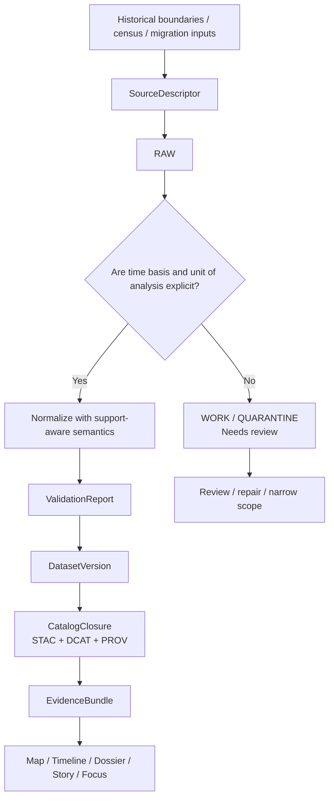

<!-- [KFM_META_BLOCK_V2]
doc_id: kfm://doc/<NEEDS-VERIFICATION-uuid>
title: History & Mobility
type: standard
version: v1
status: draft
owners: <NEEDS VERIFICATION>
created: YYYY-MM-DD
updated: YYYY-MM-DD
policy_label: <NEEDS VERIFICATION>
related: [<NEEDS VERIFICATION>]
tags: [kfm, domains, history, mobility]
notes: [Current-session repo evidence was PDF-only; adjacent lane files, owners, and local inventory still need direct repo verification.]
[/KFM_META_BLOCK_V2] -->

# History & Mobility

Kansas-first lane for time-explicit historical boundaries, census baselines, settlement scaffolding, and migration/mobility evidence.

> **Status:** Experimental  
> **Owners:** TODO — **NEEDS VERIFICATION**  
>      
> **Quick jumps:** [Scope](#scope) · [Repo fit](#repo-fit) · [Accepted inputs](#accepted-inputs) · [Exclusions](#exclusions) · [Quickstart](#quickstart) · [Diagram](#diagram) · [Task list](#task-list--definition-of-done) · [FAQ](#faq)

> [!IMPORTANT]
> This lane exists to keep **historical place frames** and **mobility aggregates** interpretable. Boundary vintages, census grains, household/person counts, and origin–destination flows must stay explicit rather than being flattened into a synthetic population story.

> [!WARNING]
> The current session directly exposed a **PDF corpus**, not a mounted repository tree. This README therefore prioritizes lane boundaries, trust-bearing rules, and routing logic over claims about checked-in leaf pages, owners, workflows, or local automation depth.

---

## Scope

This directory is the KFM lane for **time-aware county and territorial geographies, population baselines, settlement scaffolding, nativity/place-of-birth context, and aggregate origin–destination movement**. It is where maintainers should document how historical boundary regimes, census products, and migration/mobility summaries enter the governed evidence system and how those materials should be routed into map, timeline, dossier, story, and Focus surfaces.

In KFM terms, this is not a decorative topic area. It is one of the Kansas-first operating lanes, and it carries its own publication burden: explicit time semantics, explicit support, visible unit-of-analysis, visible aggregation limits, and a hard refusal to collapse people, households, flows, and administrative units into one interchangeable object.

## Current verified snapshot

What could be directly verified in the current session is narrow but still useful:

| Item | Verified state | Notes |
| --- | --- | --- |
| `docs/domains/history-mobility/README.md` | target path for this task | User-specified target path only |
| History/mobility as a KFM lane | **CONFIRMED** | Defined in the KFM doctrinal corpus |
| Adjacent README files and sibling directories | **NEEDS VERIFICATION** | Not directly visible in the current session |
| Checked-in workflows, schemas, tests, or runbooks for this lane | **UNKNOWN** | Not directly visible in the current session |
| Local lane owners / CODEOWNERS | **NEEDS VERIFICATION** | Not directly visible in the current session |

That means this README should favor **structure, routing, and trust-bearing conventions** over claims about mature lane inventory or implementation completeness.

## Repo fit

| Path / relationship | Role in the repo | Verified state |
| --- | --- | --- |
| `docs/domains/history-mobility/README.md` | Directory README for the history/mobility lane | **CONFIRMED** as the requested target path |
| Parent domain index | Upstream entry point for domain lanes | **NEEDS VERIFICATION** |
| Lane leaf pages | Boundary-vintage notes, census-product notes, migration/mobility notes, story-routing notes | **NEEDS VERIFICATION** |
| Contracts / runbooks / examples for this lane | Source descriptors, validation logic, publication notes, review routines | **NEEDS VERIFICATION** |
| Cross-lane routing | Service geography, land tenure, archives/heritage, transportation, hazards, ecology | Lane relationships are **CONFIRMED** doctrinally; exact paths are **NEEDS VERIFICATION** |

### Upstream / downstream routing

| Direction | What should live there | Current note |
| --- | --- | --- |
| Upstream | Domain-level navigation, lane registry, shared standards, cross-lane rules | Exact file path **NEEDS VERIFICATION** |
| Downstream | Narrow, source-aware leaves for one dataset family, one historical regime, one movement product, or one story-routing object | Exact file inventory **NEEDS VERIFICATION** |

## Accepted inputs

Place materials here when they are primarily about **historical place frames** or **aggregate movement context** inside the KFM trust model.

| Accepted input family | What belongs here | Minimum trust-bearing detail |
| --- | --- | --- |
| Historical boundary references | County, territorial, district, or other time-bounded geography notes | Boundary regime, valid time, geographic unit, source basis |
| Census and demographic aggregates | Decennial Census, ACS, NHGIS, Kansas territorial/state census extracts, normalization notes | Vintage, unit of analysis, support, aggregation level |
| Migration / mobility products | IRS migration flows or comparable aggregate OD products | Flow grain, origin/destination unit, time window, support limits |
| Settlement scaffolding | Place-frame notes, settlement chronology, jurisdiction context, place naming changes | Date basis, jurisdiction basis, source basis |
| Lane metadata artifacts | Source descriptors, validation notes, dataset-version notes, STAC/DCAT/PROV references, run receipts | Stable identifiers, lineage, release or review state |
| Evidence-linked narrative routing | Story or dossier notes that explain how a historical/mobility claim should route to evidence | Evidence bundle reference, dates, scope, uncertainty notes |

## Exclusions

Do **not** place the following here:

| Exclusion | Where it goes instead | Why |
| --- | --- | --- |
| Service areas, utilities, lifeline systems, emergency-response coverage, broadband/service-capacity notes | Service geography lane (**path NEEDS VERIFICATION**) | Related, but not identical to historical place or mobility evidence |
| Parcels, deeds, plats, chain-of-title notes, cadastral OCR, legal descriptions | Land tenure / cadastral lane (**path NEEDS VERIFICATION**) | Review-bearing identity and legal-record work belongs elsewhere |
| Archive scans, newspapers, oral-history custody, heritage interpretation as primary material | Archives / heritage lane (**path NEEDS VERIFICATION**) | Documentary provenance and reuse constraints need their own lane owner |
| Live routing, GTFS-RT, WZDx, traffic operations, fleet movement, roadwork feeds | Transportation lane (**path NEEDS VERIFICATION**) | Operational transport data is not the same as historical/migration context |
| Unsupported synthetic population layers or person-level behavioral inference | Quarantine or a narrower reviewed workflow | KFM explicitly rejects flattening aggregate units into synthetic person stories |
| Free-form historical essays detached from evidence routing | Story surface only after evidence linkage | Narrative convenience must not outrun provenance |

## Source families and publication burden

The doctrinal source family list for this lane is compact and strong. The burden is not just finding data; it is preserving what kind of thing the data is.

| Source family | Typical use in this lane | Main caution |
| --- | --- | --- |
| Historical boundaries | Time-aware county / territorial place frames | Boundary vintage must stay explicit |
| Decennial Census | Baseline population and settlement context | Do not mix vintages casually |
| ACS / NHGIS | Supplemental demographic and geographic aggregates | Support and geographic comparability vary |
| Kansas territorial / state censuses | Earlier historical baselines | Coverage and comparability can be uneven |
| IRS migration flows | Aggregate origin–destination movement | Flows remain aggregate; do not infer person-level trajectories |

## Local conventions

| Rule | Why it matters |
| --- | --- |
| Use one page per bounded topic, dataset family, or time window | Keeps review and correction scope legible |
| State **time basis** before interpretation | Historical meaning changes when vintages blur |
| Keep administrative unit, household count, person count, and flow object distinct | Prevents synthetic-population flattening |
| Distinguish documentary context from analytic dataset outputs | Archive evidence and modeled summaries carry different trust burdens |
| Route publishable outputs through STAC/DCAT/PROV language when available | Keeps the lane aligned to KFM’s outward catalog spine |
| Mark uncertain repo-local claims as **NEEDS VERIFICATION** | Avoids bluffing about implementation maturity |
| Prefer narrow, routable leaves over “everything about Kansas migration” pages | Maintains reviewable scope and easier corrections |

## Directory tree

The current session did **not** directly verify the checked-in directory inventory. Use the tree below as the smallest honest shape for this lane until the repo is re-inspected.

```text
docs/
└── domains/
    └── history-mobility/
        ├── README.md
        ├── <boundary-vintage leaves — NEEDS VERIFICATION>
        ├── <census / mobility leaves — NEEDS VERIFICATION>
        ├── <story-routing or dossier notes — NEEDS VERIFICATION>
        └── <runbooks / source descriptors / examples — NEEDS VERIFICATION>
```

## Quickstart

When adding a new page in this lane, start with a **narrow, time-scoped, source-aware** shape.

### Illustrative leaf template

```md
# <Topic or dataset family>

One-line purpose for the exact history/mobility scope.

## What this page is
- geography or administrative unit
- time basis / vintage
- source family
- why it belongs in history-mobility

## Source basis
- primary source(s)
- support / aggregation level
- rights / reuse notes
- known comparability limits

## KFM routing
- what claim types this page can support
- which adjacent lane owns related material
- released artifact refs (STAC / DCAT / PROV / receipt), if available

## Local notes
- CONFIRMED:
- INFERRED:
- PROPOSED:
- UNKNOWN:
- NEEDS VERIFICATION:
```

### Minimal add flow

1. Pick one bounded subject: one boundary regime, one census family, one migration product, or one settlement/place-frame note.
2. Write the **time basis**, **geographic unit**, and **support level** before interpretation.
3. State what the page does **not** claim.
4. Route adjacent material outward instead of letting the page become a mixed-lane notebook.
5. Mark unresolved ownership, file paths, artifact refs, or implementation details as **NEEDS VERIFICATION**.

## Usage

### Add a lane leaf

Use this lane for the smallest useful historical/mobility unit that a reviewer can re-check later:

- one county-boundary vintage or boundary-change note
- one census or NHGIS product note
- one migration-flow product note
- one settlement/place-frame background note
- one evidence-routing note that supports a story or dossier surface

### Update this README

Update this file when any of the following changes:

- the verified lane inventory becomes visible in the repo
- ownership or policy labels are resolved
- a stable naming pattern for leaves is agreed
- adjacent lane boundaries change
- the lane gains direct contracts, tests, examples, or runbooks that should be routable from here
- the lane’s publication burden changes in a way that affects public interpretation

## Diagram



## Trust-bearing requirements

This lane is easy to misuse if the README does not keep the burden explicit.

| Requirement | Why it is non-negotiable |
| --- | --- |
| Boundary vintage must be named | Historical place meaning is time-dependent |
| Unit of analysis must be named | Counties, households, persons, and flows are not interchangeable |
| Aggregate movement products must stay aggregate | Unsupported person-level inference is out of bounds |
| Rights / reuse constraints must stay visible | Historical maps and documentary sources may carry reuse limits |
| Output status must be clear | Draft, reviewed, or published state materially affects interpretation |
| Claims should remain one hop from evidence | History-themed prose is not a substitute for inspectable support |

## Status vocabulary used in this directory

| Label | Use here |
| --- | --- |
| **CONFIRMED** | Directly supported by visible corpus or directly verified repo evidence |
| **INFERRED** | Small structural completion that fits KFM doctrine but is not yet directly proven locally |
| **PROPOSED** | Recommended directory behavior, leaf pattern, or next step |
| **UNKNOWN** | Not verified strongly enough in the current session |
| **NEEDS VERIFICATION** | Review flag for owners, inventory, paths, or behavior that should be rechecked before commit |

## Task list & definition of done

A meaningful update in this lane should satisfy the following before merge:

- [ ] The topic is narrow enough to review as one historical regime, one dataset family, or one movement product.
- [ ] Time basis and geographic unit are explicit.
- [ ] The page does not collapse people, households, flows, and administrative units into one object.
- [ ] Source basis and support limits are visible.
- [ ] Rights / reuse posture is stated when documentary or map material is involved.
- [ ] Adjacent lane routing is explicit where relevant.
- [ ] Publishable artifacts link to STAC/DCAT/PROV or clearly state why that linkage is not yet available.
- [ ] Any repo-local path, owner, workflow, or test claim not directly reverified is marked **NEEDS VERIFICATION**.
- [ ] If the change affects public interpretation, correction, or release meaning, it stays in the same governed review stream as related docs, contracts, or data artifacts.

## FAQ

### Is this the archive or oral-history lane?

No. This lane can reference historical context, but primary documentary custody, oral-history handling, reuse constraints, and heritage interpretation belong in the archives / heritage lane.

### Can I put live transit or routing notes here?

Only when the page is fundamentally about historical or aggregate mobility context. Operational transport feeds and route behavior belong in the transportation lane.

### Does “mobility” here mean person-level movement tracking?

No. The doctrinal burden for this lane is aggregate movement context, not unsupported person-level inference.

### Do we already have live source descriptors, tests, or publish pipelines for this lane?

**UNKNOWN** in the current session. This README is written to be honest under that evidence limit.

## Appendix

<details>
<summary><strong>Appendix A — illustrative leaf archetypes</strong></summary>

| Archetype | Good use | Avoid |
| --- | --- | --- |
| Boundary-vintage note | One regime, one time window, one geography family | Full Kansas political history dump |
| Census-product note | One extract family, one vintage, one unit-of-analysis | Mixing many products with incompatible grains |
| Migration-flow note | One aggregate OD product with explicit support | Converting aggregate flows into person stories |
| Settlement/place-frame note | One locality or jurisdiction frame with dates and sources | Free-form essay without evidence routing |
| Story-routing note | One claim family and its evidence path | Narrative page that becomes the source of truth |

</details>

<details>
<summary><strong>Appendix B — open verification backlog</strong></summary>

The following should be rechecked directly in the repository before calling this lane “finished”:

1. Exact sibling lane paths under `docs/domains/`
2. Whether this lane already has leaf docs, examples, contracts, or runbooks
3. Whether owners, CODEOWNERS, or policy labels are already declared elsewhere
4. Whether this lane already emits STAC/DCAT/PROV or receipt-bearing artifacts
5. Whether changelog, release-manifest, or correction-note conventions already exist for domain docs

</details>

[Back to top](#history--mobility)
