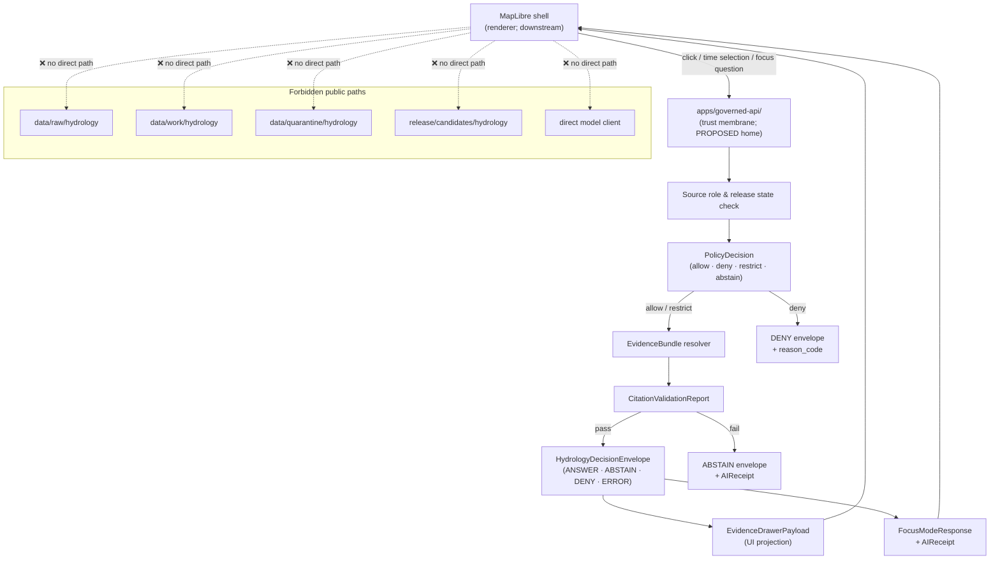
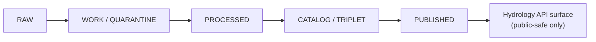

<!-- [KFM_META_BLOCK_V2]
doc_id: kfm://doc/domains/hydrology/api-contracts
title: Hydrology — API Contracts
type: standard
version: v1
status: draft
owners: <hydrology-lane-steward>, <governed-api-owner>, <contract-schema-steward>
created: 2026-05-17
updated: 2026-05-17
policy_label: public
related:
  - docs/domains/hydrology/README.md
  - docs/domains/hydrology/SOURCE_FAMILIES.md
  - docs/architecture/governed-api.md
  - docs/architecture/contract-schema-policy-split.md
  - docs/doctrine/trust-membrane.md
  - docs/doctrine/directory-rules.md
  - contracts/domains/hydrology/
  - schemas/contracts/v1/domains/hydrology/
  - policy/domains/hydrology/
  - tests/domains/hydrology/
  - fixtures/domains/hydrology/
  - docs/runbooks/fauna/SOURCE_REFRESH_RUNBOOK.md
tags: [kfm, hydrology, api, contracts, governed-api, trust-membrane, evidence, decision-envelope]
notes:
  - Repository is not mounted in this drafting session; all path-shaped claims are PROPOSED or NEEDS VERIFICATION.
  - All API routes are PROPOSED; current implementation maturity is UNKNOWN.
  - Authoritative doctrine is KFM Domains Atlas v1.1 §4 (Hydrology), Encyclopedia §7.2, Directory Rules §12, and Whole-UI + Governed AI Expansion Report.
[/KFM_META_BLOCK_V2] -->

# Hydrology — API Contracts

> Trust-membrane contract reference for the Hydrology domain. Defines the governed API surfaces, outcome envelopes, DTOs, schema homes, and policy bindings that public clients, the Map shell, Focus Mode, and stewards may interact with — without ever touching canonical, RAW, WORK, or QUARANTINE stores.

<!-- Badges: Shields.io. Targets are placeholders until a CI/build steward sets canonical endpoints. -->


**Status:** draft · **Owners:** `<hydrology-lane-steward>`, `<governed-api-owner>`, `<contract-schema-steward>` · **Last updated:** 2026-05-17

---

## Contents

1. [Purpose and scope](#1-purpose-and-scope)
2. [Trust-membrane posture](#2-trust-membrane-posture)
3. [Governed API surface inventory](#3-governed-api-surface-inventory)
4. [Trust-membrane flow](#4-trust-membrane-flow)
5. [Finite outcome envelope](#5-finite-outcome-envelope)
6. [Hydrology DTO and object families](#6-hydrology-dto-and-object-families)
7. [Schema, contract, and policy homes](#7-schema-contract-and-policy-homes)
8. [Source families and source roles](#8-source-families-and-source-roles)
9. [Hydrology-specific deny rules](#9-hydrology-specific-deny-rules)
10. [Cross-lane API constraints](#10-cross-lane-api-constraints)
11. [Validation, fixtures, and tests](#11-validation-fixtures-and-tests)
12. [Pipeline binding and publication](#12-pipeline-binding-and-publication)
13. [Anti-patterns](#13-anti-patterns)
14. [Open verification backlog](#14-open-verification-backlog)
15. [Change discipline](#15-change-discipline)
16. [Related docs](#16-related-docs)

[Back to top](#hydrology--api-contracts)

---

## 1. Purpose and scope

This document defines the **API contract surface** for the Hydrology domain — i.e., the set of governed endpoints, DTOs, outcome envelopes, schema homes, and policy bindings that downstream surfaces (MapLibre shell, Evidence Drawer, Focus Mode, Story Nodes, exports, review console) may consume.

It is a **reference doc**, not a runtime spec. It pins doctrine, names objects, and binds them to responsibility roots so that authors, reviewers, and clients can recognize the trust membrane without inferring it.

| Aspect | In scope | Out of scope |
|---|---|---|
| Governed API DTOs and finite outcomes for Hydrology | ✅ | Internal store layouts, canonical schema bytes |
| Schema, contract, and policy homes | ✅ | Per-field JSON Schema content (lives in `schemas/`) |
| Outcome semantics and deny rules | ✅ | Specific OPA rules (live in `policy/`) |
| Cross-lane integration constraints | ✅ | Cross-lane object ownership (lives in each domain's dossier) |
| Source-family role discipline | ✅ | Source onboarding playbook (lives in source runbooks) |

> [!NOTE]
> **Status discipline.** Hydrology API doctrine — outcomes, DTO families, trust-membrane rules, sensitivity posture — is **CONFIRMED doctrine** in the Atlas and Encyclopedia. **Implementation** (routes, mounts, route handlers, schema files on disk) is **PROPOSED / NEEDS VERIFICATION** until inspected in the mounted repo. Memory and prior plans are not evidence.

[Back to top](#hydrology--api-contracts)

---

## 2. Trust-membrane posture

Hydrology's API surface sits behind the same **trust membrane** that governs every domain in KFM. The membrane is **not optional plumbing** — it is the structural boundary at which release state, policy, evidence, and rights are enforced before any payload leaves the trust spine. Public clients consume governed APIs only; they MUST NOT read canonical, RAW, WORK, QUARANTINE, or unpublished candidate stores.

> [!IMPORTANT]
> The following invariants apply to every Hydrology endpoint and are **non-negotiable** trust-spine rules:
>
> - **No RAW / WORK / QUARANTINE public path.** Public clients receive only released, public-safe payloads through governed APIs and EvidenceBundle resolution.
> - **No direct model client.** Focus Mode and AI runtime sit behind governed API boundaries and finite outcomes; no browser-to-model traffic.
> - **No unreleased layer load.** A layer toggle is not publication; `LayerManifest`, `MapReleaseManifest`, and a passing `PolicyDecision` must allow the layer.
> - **No popup as Evidence Drawer substitute.** A popup may summarize; consequential claims must resolve through `EvidenceDrawerPayload` and `CitationValidationReport`.
> - **No uncited export.** Screenshots, PDFs, Story Nodes, and Focus Mode answers must carry citation, evidence ID, version lock, and release manifest reference.
> - **No KFM-as-alert authority.** Hydrology is not an emergency flood-warning system; life-safety instructions are not a KFM output.

CONFIRMED doctrine sources: Directory Rules §1, §12; Atlas v1.1 §4(I), §24.9.2; Whole-UI + Governed AI Expansion Report; MapLibre Operating Manual §10–11.

[Back to top](#hydrology--api-contracts)

---

## 3. Governed API surface inventory

The table below enumerates the Hydrology-facing governed surfaces. **All endpoints are PROPOSED** — exact route shapes, HTTP verbs, mount points, and DTO field-by-field specifications are not asserted here. Per Directory Rules §7.1, the canonical home for these routes is `apps/governed-api/` (PROPOSED until inspection of the mounted repo).

### 3.1 Surface table

<!-- This is the central per-domain table consolidating Atlas v1.1 §4(J) and Encyclopedia §7.2(J) for Hydrology. -->

| # | Surface (PROPOSED) | Verb / shape (PROPOSED) | Request DTO | Response DTO | Permitted outcomes | Status |
|---|---|---|---|---|---|---|
| H-API-01 | Hydrology feature / detail resolver | `GET` (resource shape PROPOSED) | feature id, time scope, version lock | `HydrologyDecisionEnvelope` carrying `FeatureDTO` + `EvidenceRef[]` | ANSWER / ABSTAIN / DENY / ERROR | PROPOSED; route UNKNOWN |
| H-API-02 | Hydrology layer manifest resolver | `GET` | layer id | `LayerManifest` (domain layer descriptor) | ANSWER / DENY / ERROR | PROPOSED; public-safe release only |
| H-API-03 | Hydrology Evidence Drawer payload | `GET` / `POST` | feature/layer ref, time, policy context | `EvidenceDrawerPayload` (projection of `EvidenceBundle`) | ANSWER / ABSTAIN / DENY / ERROR | PROPOSED; evidence and policy filtered |
| H-API-04 | Hydrology Focus Mode answer | `POST` | `FocusModeRequest` carrying `MapContextEnvelope` | `FocusModeResponse` + `AIReceipt` (`RuntimeResponseEnvelope`) | ANSWER / ABSTAIN / DENY / ERROR | PROPOSED; AI is never root truth |
| H-API-05 | EvidenceBundle resolver | `GET` | `EvidenceRef` (bundle id) | `EvidenceBundle` | ANSWER / DENY / ERROR | PROPOSED; generic cross-domain surface |
| H-API-06 | Correction submission | `POST` | `CorrectionNoticeCandidate` | acknowledgement w/ tracking id | ACCEPTED / DENY / ERROR | PROPOSED; queued for steward review |
| H-API-07 | Steward review decision (restricted) | `POST` | review payload | `ReviewRecord` | ALLOW / RESTRICT / DENY / ERROR | PROPOSED; role-gated, audited |
| H-API-08 | Hydrology export request | `POST` | export spec + scope | export envelope (job/artifact ref) | ANSWER / DENY / ERROR | PROPOSED; public-safe export only |
| H-API-09 | Hydrology telemetry intake (safe UI events) | `POST` | telemetry payload | acknowledgement | ANSWER / DENY / ERROR | PROPOSED; no PII, no model prompts |

> [!CAUTION]
> The table above mirrors Atlas v1.1 §4(J) and the generic cross-domain envelope in Encyclopedia §7.2(J). **Specific URL shapes** (e.g., `/api/v1/domains/hydrology/features/{id}`) appear in source dossiers as illustrative examples and are explicitly **PROPOSED**; the canonical URL ontology is set by the governed-API steward in conjunction with `docs/architecture/governed-api.md`.

### 3.2 Surfaces explicitly excluded

The following are **not** Hydrology API surfaces and MUST NOT be added under this contract reference:

- Direct read of canonical stores (`data/raw/hydrology/`, `data/work/hydrology/`, `data/quarantine/hydrology/`).
- Direct read of unpublished promotion candidates under `release/candidates/hydrology/`.
- Direct browser-to-model AI surfaces (no path bypassing the `apps/governed-api/` membrane).
- Emergency alerting or life-safety instruction endpoints. Hydrology is not an alert authority.
- "NFHL as observed flood" surfaces. See [§9](#9-hydrology-specific-deny-rules).

[Back to top](#hydrology--api-contracts)

---

## 4. Trust-membrane flow

The diagram below illustrates the **CONFIRMED doctrinal flow** for a Hydrology interaction. It reflects the responsibility separation between renderer, governed API, evidence resolver, policy engine, release manifest, and AI runtime. Concrete service names are PROPOSED.



> [!NOTE]
> The diagram reflects **doctrine**, not a verified implementation graph. Actual service names, mount paths, and adapter boundaries are PROPOSED until verified against the mounted repository.

[Back to top](#hydrology--api-contracts)

---

## 5. Finite outcome envelope

Every Hydrology governed surface returns a **finite outcome** from the KFM outcome family. There is no "soft success" and no silent fall-through to a different lane. CONFIRMED doctrine: Atlas v1.1 §24.3.

### 5.1 Outcome semantics

| Outcome | When | Required carrier | Public effect |
|---|---|---|---|
| **ANSWER** | Evidence sufficient · policy allows · release state allows · review state recorded if required. | `EvidenceBundle` resolved · `PolicyDecision = allow` · `ReleaseManifest` applies. | Substantive payload with citation. |
| **ABSTAIN** | Evidence insufficient · citation cannot be validated · evidence stale with no released alternative · source role conflicts · temporal scope insufficient. | `AIReceipt` with reason; no claim emitted. | Non-substantive note + reason; never invents. |
| **DENY** | Policy, rights, sensitivity, release state, or source-role anti-collapse forbids the answer. | `PolicyDecision = deny` + `reason_code`; `AIReceipt` if AI-touched. | Denial reason; alternative non-restricted surface where possible. |
| **ERROR** | API cannot evaluate — missing schema, malformed query, contract violation, infrastructure failure. | Error envelope with diagnostic code; no claim leakage. | Finite, actionable error. |
| **HOLD** | Release / promotion / correction paused pending steward, rights-holder, or policy review. | `ReviewRecord` pending; `PolicyDecision = hold`. | Prior state retained; no silent replacement. |

> [!TIP]
> **DENY is a valid outcome.** A KFM API call that returns DENY with a `reason_code` is not a bug — it is the membrane doing its job. Treat DENY shapes as first-class fixtures, not exception paths.

### 5.2 Outcome × Hydrology surface matrix

| Surface | ANSWER | ABSTAIN | DENY | ERROR | HOLD |
|---|---|---|---|---|---|
| Feature / detail resolver | ✅ | ✅ | ✅ | ✅ | — |
| Layer manifest resolver | ✅ | — | ✅ | ✅ | — |
| Evidence Drawer payload | ✅ | ✅ | ✅ | ✅ | — |
| Focus Mode answer | ✅ | ✅ | ✅ | ✅ | — |
| EvidenceBundle resolver | ✅ | — | ✅ | ✅ | — |
| Correction submission | ACCEPTED | — | ✅ | ✅ | ✅ |
| Steward review decision | ALLOW | — | ✅ / RESTRICT | ✅ | ✅ |
| Export request | ✅ | — | ✅ | ✅ | ✅ |
| Telemetry intake | ✅ | — | ✅ | ✅ | — |

Forbidden behaviors (per Atlas v1.1 §24.3.2):

- Returning raw source bytes, quarantined material, or unreleased candidate as ANSWER.
- Returning a layer that lacks a `ReleaseManifest`.
- Returning a Focus Mode ANSWER without a valid `CitationValidationReport`.
- Silently substituting one outcome for another.

[Back to top](#hydrology--api-contracts)

---

## 6. Hydrology DTO and object families

The DTOs surfaced through the API are projections of CONFIRMED Hydrology object families. The names and meanings below are CONFIRMED doctrine from the Hydrology dossier; field-by-field realization is PROPOSED and lives in `schemas/contracts/v1/domains/hydrology/` (PROPOSED home).

### 6.1 Hydrology-owned object families

<details>
<summary><b>Click to expand the full object-family list</b> (CONFIRMED Hydrology dossier; field realization PROPOSED)</summary>

| Object family | Purpose | Identity basis (PROPOSED) | Temporal handling (CONFIRMED) |
|---|---|---|---|
| `Watershed` | Watershed evidence or released derivative. | source id + object role + temporal scope + normalized digest | source / observed / valid / retrieval / release / correction kept distinct |
| `HUCUnit` | Hydrologic Unit Code unit (HUC2–HUC12). | as above | as above |
| `HydroFeature` | General hydrographic feature. | as above | as above |
| `ReachIdentity` | Stream reach identity (e.g., NHDPlus reach). | as above | as above |
| `GaugeSite` | Monitoring station identity. | as above | as above |
| `FlowObservation` | Discharge / streamflow observation. | as above | as above |
| `WaterLevelObservation` | Gage height / stage observation. | as above | as above |
| `WaterQualityObservation` | Water-quality parameter observation. | as above | as above |
| `GroundwaterWell` | Groundwater well evidence. | as above | as above |
| `NFHLZone` | Regulatory flood zone (NFHL). | as above | as above |
| `Hydrograph` | Derived time-series view. | as above | as above |
| `UpstreamTrace` | Upstream/downstream trace derivative. | as above | as above |
| `WaterUseLink`, `DroughtLink`, `IrrigationLink` | Cross-domain link objects. | as above | as above |

Source: Atlas v1.1 §4(E); Encyclopedia §7.2(C).

</details>

### 6.2 Cross-cutting object families used in Hydrology APIs

| Object family | Role on the Hydrology API surface |
|---|---|
| `SourceDescriptor` | Pins source role, rights, cadence, sensitivity per Hydrology source family. |
| `EvidenceRef` | Pointer from a Hydrology claim / feature / answer / layer to its evidence. |
| `EvidenceBundle` | Resolved evidence package (truth-bearing); outranks any DTO field, tile pixel, or AI sentence. |
| `LayerManifest` | Released Hydrology layer descriptor; required for any public layer load. |
| `MapReleaseManifest` | Pins the active Hydrology layer set, style refs, tile artifacts, rollback target. |
| `EvidenceDrawerPayload` | UI projection of `EvidenceBundle` for a clicked Hydrology feature. |
| `MapContextEnvelope` | Bounded camera / time / layer / feature context sent to Focus Mode. |
| `FocusModeRequest` / `FocusModeResponse` | Bounded governed-AI request / finite-outcome response. |
| `AIReceipt` | Audit record of any AI-touched Hydrology answer. |
| `CitationValidationReport` | Pass/fail report tying any claim to `EvidenceBundle` and citations. |
| `PolicyDecision` | Allow / deny / restrict / abstain verdict against rights, sensitivity, release class. |
| `PromotionDecision` | Governed state transition into release for a Hydrology candidate. |
| `RunReceipt` | Build / pipeline / tile generation audit record. |
| `ReleaseManifest` | Public artifact set, digests, rollback target. |
| `CorrectionNotice` | Public correction lineage object linked to claims and releases. |
| `RollbackCard` | Prior release manifest pointer for rollback execution. |
| `ReviewRecord` | Steward review state for a candidate transition. |

CONFIRMED doctrine: Encyclopedia §7.2(H); Unified Implementation Architecture Build Manual §10; Master MapLibre Components §11.

> [!NOTE]
> Field-by-field DTO shapes are **schema content**, not contract content. They live under `schemas/contracts/v1/domains/hydrology/` (PROPOSED home, ADR-0001 governed). This document binds names, not bytes.

[Back to top](#hydrology--api-contracts)

---

## 7. Schema, contract, and policy homes

Per Directory Rules §6.3–§6.5, §7.4, and §12, Hydrology's machine-checkable shapes, semantic meanings, and admissibility rules each have a distinct home.

### 7.1 Responsibility-root map (PROPOSED until mounted-repo verification)

| Concern | Home (PROPOSED) | Authority class | What lives here |
|---|---|---|---|
| Object meaning, ubiquitous language | `contracts/domains/hydrology/` | Canonical Markdown | Semantic intent of `HUCUnit`, `NFHLZone`, `FlowObservation`, etc. |
| Machine shape (JSON Schema) | `schemas/contracts/v1/domains/hydrology/` | Canonical (ADR-0001) | `*.schema.json` files for each Hydrology DTO. |
| Admissibility (allow / deny / restrict / abstain) | `policy/domains/hydrology/` | Canonical | OPA bundles / equivalent; sensitivity, rights, release-class rules. |
| Validators and admission tests | `tools/validators/<topic>/...` and `tests/domains/hydrology/` | Canonical | Validators (cross-domain) and per-domain tests. |
| Positive / negative test fixtures | `tests/fixtures/hydrology/` or `fixtures/domains/hydrology/` | Canonical | Valid/invalid fixtures (one home, per Directory Rules §6.6). |
| Pipelines | `pipelines/domains/hydrology/`, `pipeline_specs/hydrology/` | Implementation-bearing | Hydrology pipelines and specs. |
| Lifecycle data | `data/raw/hydrology/`, `data/work/hydrology/`, `data/quarantine/hydrology/`, `data/processed/hydrology/`, `data/catalog/domain/hydrology/`, `data/published/layers/hydrology/`, `data/registry/sources/hydrology/` | Canonical (lifecycle) | RAW → PUBLISHED progression. |
| Release candidates / decisions | `release/candidates/hydrology/` | Canonical | Pre-publication candidates and decisions. |
| Governed API routes | `apps/governed-api/` (no domain segment in the URL tree itself) | Implementation-bearing | Hydrology endpoints implemented as API handlers. |
| Trust receipts | `data/receipts/`, `data/proofs/`, `release/` | Canonical | Receipts, proofs, manifests, release decisions. Never `artifacts/`. |

### 7.2 ADR sensitivity

> [!WARNING]
> The schema-home convention (`schemas/contracts/v1/...`) is governed by **ADR-0001** per Directory Rules §2.4(3). If the mounted repo authors any Hydrology schema under `contracts/domains/hydrology/<x>.schema.json` instead, that is **CONFLICTED lineage** and MUST be migrated under ADR-0001 before any new schema lands. Do **not** maintain divergent definitions in both homes.

### 7.3 Naming examples (PROPOSED file names)

The following are illustrative; canonical filenames are pinned by the contract-schema steward in the schema registry.

```text
schemas/contracts/v1/domains/hydrology/
├── watershed.schema.json
├── huc_unit.schema.json
├── hydro_feature.schema.json
├── reach_identity.schema.json
├── gauge_site.schema.json
├── flow_observation.schema.json
├── water_level_observation.schema.json
├── water_quality_observation.schema.json
├── groundwater_well.schema.json
├── nfhl_zone.schema.json
├── hydrograph.schema.json
└── hydrology_decision_envelope.schema.json
```

> [!NOTE]
> File names above are **PROPOSED**. The mounted repository convention governs casing, separator (`_` vs `-`), and `.json` vs `.schema.json` suffix.

[Back to top](#hydrology--api-contracts)

---

## 8. Source families and source roles

Hydrology source families and their CONFIRMED role discipline are summarized below. Source role is **fixed at admission**; promotion does not upgrade it (e.g., a modeled product never becomes "observed" through release).

### 8.1 Source family table

| Source family | Role discipline | Rights / sensitivity | Freshness | Status |
|---|---|---|---|---|
| USGS WBD / HUC12 | authority for hydrologic unit geometry | source-vintage specific; sensitive joins fail closed | per-vintage release cadence | CONFIRMED dossier / PROPOSED implementation |
| NHDPlus HR / 3DHP-oriented hydrography | authority for hydrographic network | source-vintage specific | per-vintage cadence | CONFIRMED dossier / PROPOSED implementation |
| USGS Water Data / NWIS | observation (gauge, flow, water-quality) | provisional/final distinction required | sub-daily to daily | CONFIRMED dossier / PROPOSED implementation |
| FEMA NFHL / MSC | **regulatory context** (not observed inundation) | regulatory attribution required; event-driven updates | localized, event-driven | CONFIRMED dossier / PROPOSED implementation |
| 3DEP terrain | context / derivative basis | source-vintage specific | per-vintage cadence | CONFIRMED dossier / PROPOSED implementation |
| Water-quality and groundwater sources | observation / context | parameter-specific | source-specific | CONFIRMED dossier / PROPOSED implementation |
| Historical observed flood evidence | observation (historical) | review-gated | static / archival | CONFIRMED dossier / PROPOSED implementation |

### 8.2 Source-role anti-collapse

> [!IMPORTANT]
> **Source role cannot be inferred from convenience.** Examples that MUST be enforced at the API surface:
>
> - **NFHL ≠ observed inundation.** NFHL flood zones are regulatory context; never publish as observed flood extent. DENY at the API and policy layer.
> - **Provisional ≠ final** for USGS streamflow / water-level observations; provisional status must be carried in the DTO and surfaced in the Evidence Drawer.
> - **Modeled hydrography ≠ observed hydrography.** Identity ambiguity (e.g., NHDPlus HR vs HR-3DHP) requires `ABSTAIN` rather than a forced match.
> - **Aggregate ≠ per-place observation.** Watershed totals or HUC rollups must not be cited as if they were point observations.

CONFIRMED doctrine: Atlas v1.1 §4(I), §24.9.3; Encyclopedia §7.2; Master MapLibre §10–11.

[Back to top](#hydrology--api-contracts)

---

## 9. Hydrology-specific deny rules

Beyond the cross-cutting trust-membrane rules, Hydrology carries the following **CONFIRMED deny-by-default** behaviors. Every relevant endpoint MUST encode these as `PolicyDecision = deny` with a clear `reason_code`.

| # | Denied behavior | Reason | DENY surface |
|---|---|---|---|
| H-DENY-01 | Publishing NFHL zones as observed flood extent. | Source-role collapse; regulatory ≠ observed. | Layer manifest resolver; feature resolver. |
| H-DENY-02 | Returning a Hydrology answer that asserts a life-safety instruction or emergency alert. | KFM is not an alert authority. | Focus Mode; all answer surfaces. |
| H-DENY-03 | Returning RAW / WORK / QUARANTINE Hydrology content to a public client. | Trust-membrane bypass. | Feature, layer, drawer, evidence resolvers. |
| H-DENY-04 | Returning Hydrology layer without `LayerManifest` + active `MapReleaseManifest`. | Unreleased layer load. | Layer manifest resolver. |
| H-DENY-05 | Returning a Focus Mode ANSWER that fails `CitationValidationReport`. | Cite-or-abstain broken. | Focus Mode (must ABSTAIN instead). |
| H-DENY-06 | Joining infrastructure / private-property detail to Hydrology features without steward review. | Sensitivity bypass. | Drawer; export. |
| H-DENY-07 | Exposing operational-warning content as KFM evidence. | Lane-ownership violation (belongs to Hazards / official authority). | All Hydrology answer surfaces. |
| H-DENY-08 | Releasing a flood-context layer without `EvidenceBundle` closure and `RollbackCard`. | Catalog/release closure missing. | Promotion / publication gates. |

> [!CAUTION]
> **Hydrology denies unclear rights and flood-role misuse.** This is CONFIRMED doctrine from the Hydrology dossier and Atlas v1.1 §4(I). Surfaces that loosen these rules require an ADR plus a recorded sensitivity transform; they do not become tractable through implementation convenience.

[Back to top](#hydrology--api-contracts)

---

## 10. Cross-lane API constraints

Hydrology relates to several adjacent domains. Every cross-lane API response MUST preserve **ownership, source role, sensitivity, and EvidenceBundle support** — the relation does not transfer canonical authority across lanes.

| Related lane | Relation type | Cross-lane API constraint |
|---|---|---|
| **Hazards** | flood, drought, warning, declaration, resilience context | Hazards owns warnings and declarations; Hydrology contributes observed and regulatory context only. KFM never issues alerts. |
| **Soil** | soil moisture, hydrologic group, infiltration, runoff | Cross-domain joins resolve through governed APIs with explicit relation edges; no silent merge. |
| **Agriculture** | irrigation, drought stress, crop-water context | Aggregation receipts required; private-join denial defaults. |
| **Settlements / Infrastructure** | floodplain exposure, bridges, dams, utilities | Critical-asset deny lane applies; infrastructure detail requires steward review. |
| **Fauna** | aquatic / riparian / wetland / spawning context | Fauna sensitive-occurrence rules (deny-default for nests, dens, roosts, hibernacula, spawning sites) take precedence on any join. |
| **Habitat** | aquatic and riparian habitat patches | Habitat owns suitability; Hydrology contributes hydrologic context. |
| **Geology** | aquifer / lithology context | Geology owns subsurface; Hydrology consumes via relation, not ownership. |

CONFIRMED doctrine: Atlas v1.1 §4(F).

> [!TIP]
> Cross-lane object families (e.g., a habitat × fauna × hydrology validator) live under the **lowest common responsibility root** without a domain segment — e.g., `tools/validators/<topic>/...`, not `tools/validators/domains/hydrology/...`. See Directory Rules §12 "Multi-domain and cross-cutting files."

[Back to top](#hydrology--api-contracts)

---

## 11. Validation, fixtures, and tests

Every Hydrology API surface contract is enforceable only if validators, fixtures, and tests bind to it. The list below is CONFIRMED scope from Atlas v1.1 §4(K); specific test names and file paths are PROPOSED.

### 11.1 Required validator and fixture families

| Family | Minimum check | Status |
|---|---|---|
| Schema validation | Every Hydrology DTO validates against its `schemas/contracts/v1/domains/hydrology/` JSON Schema. | PROPOSED |
| `SourceDescriptor` validation | Source role, rights, sensitivity, cadence present and recognized. | PROPOSED |
| Rights validation | Unclear rights → DENY at admission and at release. | PROPOSED |
| Sensitivity validation | Sensitivity tier, redaction posture, geoprivacy transforms (where required). | PROPOSED |
| `EvidenceBundle` closure | Every Hydrology claim resolves to `EvidenceBundle` via `EvidenceRef`. | PROPOSED |
| Temporal logic | `source_time`, `observed_time`, `valid_time`, `retrieval_time`, `release_time`, `correction_time` kept distinct. | PROPOSED |
| Geometry validity | Geometry sanity (self-intersection, ring direction, area, CRS) on Hydrology geometries. | PROPOSED |
| HUC12 fingerprint | Deterministic HUC12 geometry fingerprint and identity test. | PROPOSED |
| NHDPlus HR identity ambiguity | ABSTAIN when reach identity cannot be unambiguously resolved. | PROPOSED |
| USGS parameter / unit / qualifier / no-data | Recognized parameter codes (e.g., discharge), units, qualifier handling, no-data semantics. | PROPOSED |
| **NFHL role-separation** | NFHL never publishable as observed flood extent. | PROPOSED |
| `PolicyDecision` DENY fixtures | Negative fixtures proving DENY paths for unreleased layers, life-safety queries, RAW exposure. | PROPOSED |
| `CitationValidationReport` | Pass/fail citation closure before any public ANSWER or export. | PROPOSED |
| `ReleaseManifest` validation | Manifest closure (digests, rollback target, cache invalidation). | PROPOSED |
| Rollback drill | Rollback restores prior `ReleaseManifest`; cache invalidated. | PROPOSED |
| Stale-source fixture | Stale source headers trigger ABSTAIN / DENY or stale badge. | PROPOSED |
| No-network proof fixture | Hydrology slice can be exercised entirely from fixtures (no live USGS / FEMA calls). | PROPOSED |
| Non-regression | Prior lineage preserved across schema and release changes. | PROPOSED |

### 11.2 Suggested fixture layout (PROPOSED)

```text
fixtures/domains/hydrology/
├── valid/
│   ├── huc12_kansas_example.json
│   ├── gauge_site_example.json
│   ├── flow_observation_provisional_example.json
│   ├── nfhl_zone_regulatory_context_example.json
│   └── evidence_bundle_closed_example.json
├── invalid/
│   ├── nfhl_published_as_observed_flood.json        # MUST DENY
│   ├── unreleased_layer_load.json                    # MUST DENY
│   ├── uncited_focus_answer.json                     # MUST ABSTAIN
│   ├── raw_path_exposed.json                         # MUST DENY
│   ├── nhdplus_ambiguous_reach.json                  # MUST ABSTAIN
│   └── life_safety_query.json                        # MUST DENY
└── golden/
    └── huc12_kansas_first_thin_slice_release.json    # CONFIRMED roadmap thin-slice target
```

> [!NOTE]
> Atlas v1.1 §21 places Hydrology as the **roadmap Phase 5 proof-bearing thin slice**: HUC / gauge / NFHL fixture, EvidenceBundle, drawer, rollback. The fixture layout above reflects that roadmap; concrete filenames are PROPOSED.

[Back to top](#hydrology--api-contracts)

---

## 12. Pipeline binding and publication

The Hydrology API surface is **downstream of the lifecycle**. CONFIRMED doctrine: a public API call MUST NOT cause a state transition; promotion is a governed state transition, not a side effect of read traffic.

### 12.1 Lifecycle binding



| Stage | Hydrology gate (PROPOSED) | API exposure |
|---|---|---|
| RAW | `SourceDescriptor` exists; immutable payload captured with role, rights, sensitivity, citation, time, hash. | ❌ never public |
| WORK / QUARANTINE | Schema, geometry, time, identity, evidence, rights, policy normalized; failures held. | ❌ never public |
| PROCESSED | `EvidenceRef`, `ValidationReport`, and digest closure exist. | ❌ never public |
| CATALOG / TRIPLET | Catalog records, `EvidenceBundle`, graph/triplet projections, release candidates emitted. | restricted internal only |
| PUBLISHED | `ReleaseManifest`, correction path, rollback target, review/policy state exist. | ✅ governed public |

### 12.2 Promotion gates (CONFIRMED doctrine; PROPOSED enforcement)

Promotion gates A–G (per `PromotionDecision`) must pass before any Hydrology surface exposes a layer or feature publicly:

- Source activation
- Evidence closure
- Source-role distinction (no NFHL-as-observed; no provisional-as-final)
- Freshness marking
- Validation (schema, geometry, temporal, rights, sensitivity)
- `PolicyDecision`
- `ReleaseManifest` + correction path + rollback target

CONFIRMED doctrine: Unified Implementation Architecture Build Manual §3.4, §5.5; Atlas v1.1 §4(M), §21.

> [!IMPORTANT]
> **Promotion is a state transition, not a file move.** Copying a file from `data/processed/hydrology/` into `data/published/layers/hydrology/` is **not** a publication. Without a `PromotionDecision`, `ReleaseManifest`, and rollback target, the artifact is not released and MUST NOT be served.

[Back to top](#hydrology--api-contracts)

---

## 13. Anti-patterns

CONFIRMED anti-patterns from Atlas v1.1 §24.9.1–§24.9.3 and Directory Rules §13, scoped to Hydrology's API surface.

<details>
<summary><b>Anti-pattern catalog</b> (click to expand)</summary>

| Anti-pattern | What goes wrong | Counter-rule |
|---|---|---|
| Public client reads RAW / WORK / QUARANTINE Hydrology data. | Trust membrane bypassed; promotion gates skipped. | All public reads go through `apps/governed-api/`. |
| MapLibre shell fetches canonical hydrology stores directly. | Renderer becomes the public surface and inherits no governance. | MapLibre consumes only released artifacts and governed API responses. |
| Focus Mode returns an answer without `CitationValidationReport`. | Cite-or-abstain broken. | ABSTAIN unless citation closure passes. |
| NFHL surfaced as observed flood extent. | Source-role collapse; regulatory ≠ observed. | DENY at the layer manifest resolver and at the feature resolver. |
| Hydrology endpoint emits a life-safety instruction. | KFM as alert authority. | DENY; redirect to the official authority where appropriate. |
| Two parallel schema homes for Hydrology DTOs. | Reviewer cannot tell which is authoritative. | One schema home (ADR-0001: `schemas/contracts/v1/domains/hydrology/`); legacy paths marked CONFLICTED. |
| Hydrology folder appearing at repo root. | Topic-based root competes with responsibility roots. | All Hydrology files live under responsibility roots per Directory Rules §12. |
| Receipts stored under `artifacts/`. | Build output, process memory, and trust records collapse. | Receipts live under `data/receipts/`, `data/proofs/`, `release/`. |
| Promotion that "upgrades" a Hydrology source role (modeled → observed). | Source-role anti-collapse violated. | Role is fixed at admission; never upgraded by promotion. |
| Re-publishing a corrected Hydrology claim without invalidating derivatives. | Derivative drift; stale claims persist. | `CorrectionNotice` lists invalidated derivatives; `RollbackCard` issued if needed. |

</details>

[Back to top](#hydrology--api-contracts)

---

## 14. Open verification backlog

The items below are NEEDS VERIFICATION until a mounted repository is inspected. None of these MAY be assumed answered by prior plans, attached PDFs, generated reports, or external research.

| Item | Evidence that would settle it | Status |
|---|---|---|
| Exact mount and route convention for `apps/governed-api/` Hydrology routes. | Mounted-repo inspection of `apps/governed-api/src/routes/`. | NEEDS VERIFICATION |
| Whether `apps/api/` and `apps/governed-api/` co-exist; canonical public-trust path. | Mounted-repo inspection + ADR. | NEEDS VERIFICATION |
| Canonical schema-home convention in this repo (default `schemas/contracts/v1/...` per ADR-0001). | Mounted-repo inspection. | NEEDS VERIFICATION |
| Field-by-field shape of `HydrologyDecisionEnvelope`. | JSON Schema file in `schemas/contracts/v1/domains/hydrology/`. | NEEDS VERIFICATION |
| Whether `policies/` vs `policy/` is canonical. | Mounted-repo inspection (default `policy/`). | NEEDS VERIFICATION |
| Existence and content of `tests/domains/hydrology/`, `fixtures/domains/hydrology/`. | Mounted-repo inspection. | NEEDS VERIFICATION |
| HUC12 fingerprint canonicalization rule. | Repo validator + fixture. | NEEDS VERIFICATION |
| NHDPlus HR identity ambiguity ABSTAIN behavior. | Repo policy + test. | NEEDS VERIFICATION |
| USGS NWIS normalizer behavior (parameter / unit / qualifier / no-data). | Repo normalizer + test fixtures. | NEEDS VERIFICATION |
| NFHL source-role separation enforcement. | Repo policy + negative fixture. | NEEDS VERIFICATION |
| MapLibre layer-adapter binding for Hydrology layers. | Repo adapter + ADR. | NEEDS VERIFICATION |
| Exact `PROV.md` vs `PROVENANCE.md` naming convention in `docs/standards/`. | Mounted-repo + ADR. | OPEN — flagged in prior standards docs |
| Validator exit-code contract. | Repo validator + ADR. | OPEN |

> [!NOTE]
> Atlas v1.1 §24.12 carries an ADR backlog including ADR-S-01 (schema home), ADR-S-04 (source-role vocabulary), ADR-S-05 (sensitivity tier scheme). Resolution of those ADRs may amend portions of this document; check the ADR index before treating any path here as canonical.

[Back to top](#hydrology--api-contracts)

---

## 15. Change discipline

This contract reference is governance-bearing. Changes follow the Directory Rules change discipline (§14, §17).

| Change type | Required action |
|---|---|
| Editorial, dead-link fix, clarification | Routine PR. |
| New surface family (e.g., add a Hydrology API surface row) | PR + steward sign-off. Update §3 table; update §5 outcome matrix; update §11 validators. |
| Add / remove an outcome class for a Hydrology surface | **ADR required.** Update §5 and §11. |
| Move schema home or rename DTO | **ADR required.** Per ADR-0001 discipline. Add supersession + migration manifest. |
| Loosen a deny-by-default rule in §9 | **ADR required + steward review + recorded sensitivity transform.** Never silent. |
| Replace this document | ADR + supersession notice + drift register entry. |

The KFM Meta Block v2 `updated` field MUST be refreshed on every material change.

[Back to top](#hydrology--api-contracts)

---

## 16. Related docs

<!-- All links are repo-relative and PROPOSED. Update once mounted-repo paths are confirmed. -->

- [`docs/domains/hydrology/README.md`](./README.md) — Hydrology domain index (PROPOSED).
- [`docs/domains/hydrology/SOURCE_FAMILIES.md`](./SOURCE_FAMILIES.md) — Hydrology source families and role discipline (PROPOSED).
- [`docs/architecture/governed-api.md`](../../architecture/governed-api.md) — Governed API trust membrane (PROPOSED).
- [`docs/architecture/contract-schema-policy-split.md`](../../architecture/contract-schema-policy-split.md) — Contract / schema / policy split (PROPOSED).
- [`docs/doctrine/trust-membrane.md`](../../doctrine/trust-membrane.md) — Trust membrane doctrine (PROPOSED).
- [`docs/doctrine/directory-rules.md`](../../doctrine/directory-rules.md) — Directory Rules (CONFIRMED doctrine).
- [`docs/doctrine/lifecycle-law.md`](../../doctrine/lifecycle-law.md) — Lifecycle law (PROPOSED).
- [`docs/standards/PROV.md`](../../standards/PROV.md) — W3C PROV-O and PAV profile.
- [`docs/standards/PMTILES.md`](../../standards/PMTILES.md) — PMTiles v3 governance.
- [`docs/standards/OGC-API-TILES.md`](../../standards/OGC-API-TILES.md) — OGC API Tiles profile.
- [`docs/standards/ISO-19115.md`](../../standards/ISO-19115.md) — ISO 19115 crosswalk.
- [`docs/runbooks/fauna/SOURCE_REFRESH_RUNBOOK.md`](../../runbooks/fauna/SOURCE_REFRESH_RUNBOOK.md) — Sibling runbook template.
- [`contracts/domains/hydrology/`](../../../contracts/domains/hydrology/) — Hydrology object meaning (PROPOSED home).
- [`schemas/contracts/v1/domains/hydrology/`](../../../schemas/contracts/v1/domains/hydrology/) — Hydrology schemas (PROPOSED home; ADR-0001 governed).
- [`policy/domains/hydrology/`](../../../policy/domains/hydrology/) — Hydrology admissibility policy (PROPOSED home).
- `TODO` — Hydrology layer manifest reference (link once published).
- `TODO` — Hydrology runbook (`docs/runbooks/hydrology/SOURCE_REFRESH_RUNBOOK.md`, PROPOSED).

---

**Last updated:** 2026-05-17 · **Doc id:** `kfm://doc/domains/hydrology/api-contracts` · **Authority:** doctrine-bound; implementation PROPOSED until verified.

[Back to top](#hydrology--api-contracts)
