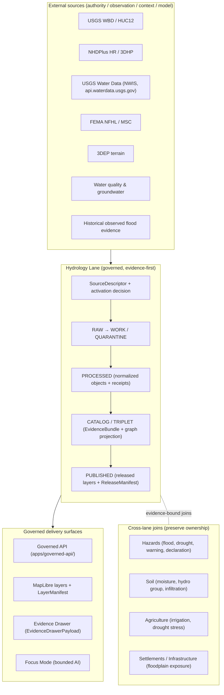
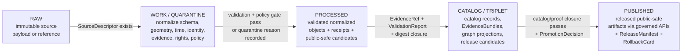

<!-- [KFM_META_BLOCK_V2]
doc_id: kfm://doc/domains/hydrology/architecture
title: Hydrology Domain — Lane Architecture
type: standard
version: v1
status: draft
owners: hydrology-lane-stewards <TODO: confirm owners>
created: 2026-05-17
updated: 2026-05-17
policy_label: public
related:
  - docs/doctrine/directory-rules.md
  - docs/doctrine/lifecycle-law.md
  - docs/doctrine/trust-membrane.md
  - docs/architecture/contract-schema-policy-split.md
  - docs/domains/hydrology/README.md
  - contracts/domains/hydrology/
  - schemas/contracts/v1/domains/hydrology/
  - policy/domains/hydrology/
tags: [kfm, domain-lane, hydrology, architecture]
notes:
  - Doctrine is CONFIRMED from project knowledge; implementation maturity is PROPOSED until mounted-repo evidence confirms.
  - NFHL regulatory context is NOT observed inundation; USGS Water Data are observations, not emergency authority.
[/KFM_META_BLOCK_V2] -->

# Hydrology Domain — Lane Architecture

> The Kansas Frontier Matrix (KFM) **hydrology lane** governs watersheds, hydrologic units, stream networks, gauges, water observations, regulatory flood context, and terrain-derived hydrology — as evidence-bound, time-aware artifacts served through the trust membrane, never as emergency-grade authority.

<p align="left">
  
  
  
  
  
  
  
</p>

**Status** `draft` · **Owners** `hydrology-lane-stewards` *(placeholder — confirm)* · **Last updated** `2026-05-17`

---

## Table of Contents

1. [Purpose & Scope](#1-purpose--scope)
2. [Position in the KFM Architecture](#2-position-in-the-kfm-architecture)
3. [Non-Ownership Boundary](#3-non-ownership-boundary)
4. [Ubiquitous Language](#4-ubiquitous-language)
5. [Source Families & Source Roles](#5-source-families--source-roles)
6. [Canonical Object Families](#6-canonical-object-families)
7. [Spatial & Temporal Model](#7-spatial--temporal-model)
8. [Lifecycle Pipeline (RAW → PUBLISHED)](#8-lifecycle-pipeline-raw--published)
9. [Cross-Lane Relations](#9-cross-lane-relations)
10. [Map & Viewing Products](#10-map--viewing-products)
11. [Governed AI Behavior](#11-governed-ai-behavior)
12. [Sensitivity, Rights & Publication Posture](#12-sensitivity-rights--publication-posture)
13. [Validators, Tests & Fixtures](#13-validators-tests--fixtures)
14. [Lane Directory Pattern](#14-lane-directory-pattern)
15. [First Proof Slice](#15-first-proof-slice)
16. [Verification Backlog & Open Questions](#16-verification-backlog--open-questions)
17. [Related Docs](#17-related-docs)

---

## 1. Purpose & Scope

The hydrology lane represents Kansas water systems as **evidence-bound, time-aware hydrologic features, observations, and regulatory contexts** without becoming an emergency flood-warning system. It is the KFM project's **preferred early proof lane** because it can exercise the full trust spine — source roles, identity crosswalks, temporal modeling, catalog closure, EvidenceBundle resolution, public-safe layer publication, and rollback — without immediately touching the project's highest-sensitivity domains. **(CONFIRMED doctrine / PROPOSED implementation.)**

> [!IMPORTANT]
> Hydrology in KFM is **observational, regulatory-context, and reference**, never **operational authority**. The lane MUST NOT collapse FEMA NFHL regulatory zones, observed inundation, hydraulic-model output, forecasts, and emergency warnings into one truth class. Source role discipline is the lane's most important invariant.

**In scope (this lane owns).** Watersheds and HUC units; hydrography (waterbody and flowline identity); gauges and water observations (flow, water level, water quality); groundwater context; regulatory flood context (NFHL); historical observed flood evidence; terrain-derived hydrology; upstream/downstream tracing; non-emergency flood-context views; and the EvidenceBundles, layer manifests, receipts, and release artifacts those objects ride on.

**Adjacent (this lane consumes or contributes to, but does not own).** Soil moisture and hydrologic soil groups (soil lane); irrigation and crop-water context (agriculture lane); floodplain exposure of bridges, dams, and utilities (settlements/infrastructure lane); flood/drought hazard declarations and resilience context (hazards lane).

[↑ Back to top](#table-of-contents)

---

## 2. Position in the KFM Architecture

The hydrology lane lives **inside** KFM responsibility roots — never as a root folder of its own. Material is placed by the **Domain Placement Law** (Directory Rules §12), so that lifecycle and governance boundaries remain intact across every domain.



> [!NOTE]
> The diagram is a **conceptual** lane shape. Specific module names, route names, and package names remain **PROPOSED** until verified against mounted-repo evidence. The lane's *shape* — sources → governed lifecycle → governed delivery, with evidence-bound cross-lane joins — is **CONFIRMED doctrine**.

[↑ Back to top](#table-of-contents)

---

## 3. Non-Ownership Boundary

Some material adjacent to water belongs to **other lanes**. Hydrology does not own:

| The lane does **not** own | Owner / authority | Why this matters |
|---|---|---|
| Emergency alerts and life-safety warnings | Hazards lane / official sources (NWS, state EM) | KFM is not an emergency alerting system; collapsing the boundary would imply operational authority KFM cannot honor. |
| Observed inundation as derived from NFHL | None (NFHL is regulatory only) | NFHL is **legally effective flood hazard data**, not observed inundation, hydraulic-model output, or climate projection. |
| Soil, agriculture, geology, infrastructure claims | Their respective lanes | Hydrology may receive context but never overwrites those lanes' canonical objects. |
| Ownership and parcel context | People / DNA / Land lane | Hydrology may reference administrative geometry without owning it. |
| Cross-domain spatial conventions, CRS rules, base layers | Spatial Foundation / Cartography lane | Hydrology consumes the shared spatial spine; it does not redefine it. |

> [!WARNING]
> **NFHL is not observed inundation.** Any visualization or claim that conflates regulatory flood zones with observed flooding, real-time forecast, or hydraulic model output is a category violation and must fail the publication gate. (CONFIRMED — see source attribution under Source Families.)

[↑ Back to top](#table-of-contents)

---

## 4. Ubiquitous Language

These terms have meaning **inside the hydrology lane** that is constrained by source role, evidence, time, and release state. Spell them and capitalize them as written. *(CONFIRMED term / PROPOSED field realization in each case.)*

| Term | Lane meaning |
|---|---|
| **Watershed** | Drainage area defined by surface-flow topology; carries identity and version per source. |
| **HUCUnit** | A nested Hydrologic Unit Code polygon (regions through HUC12 subwatersheds). |
| **HydroFeature** | A waterbody, flowline, reach, or other hydrography feature with source-specific identity. |
| **ReachIdentity** | A stable identity rule for a stream reach across sources; ambiguity is **classified, not collapsed**. |
| **GaugeSite** | A monitoring station with metadata (location, datum, units, operator). |
| **FlowObservation** | A discharge value with parameter code, unit, qualifier, and source/observed/valid times. |
| **WaterLevelObservation** | A stage value with the same temporal and qualifier discipline. |
| **WaterQualityObservation** | A water-quality parameter measurement bound to method, units, and detection context. |
| **GroundwaterWell** | A well point with construction, aquifer, and depth context. |
| **AquiferObservation** | Groundwater level or aquifer-state observation. |
| **NFHLZone** | A FEMA NFHL regulatory zone polygon with verbatim regulatory attributes (e.g., DFIRM_ID, VERSION_ID, EFFECTIVE_DATE, flood zone). |
| **Observed Flood Event** | A historically recorded inundation event with primary evidence (not derived from NFHL). |
| **Flood Context** | Composite contextual surface (NFHL + terrain + observed history) explicitly labeled as **context, not authority**. |
| **Hydrograph** | A time-indexed projection of FlowObservation / WaterLevelObservation for a GaugeSite. |
| **UpstreamTrace** / **DownstreamTrace** | Network navigation along NHDPlus HR flowlines, scoped to a temporal snapshot. |
| **WaterUseLink** / **DroughtLink** / **IrrigationLink** | Evidence-bound cross-lane relations to agriculture, hazards, and soil. |

[↑ Back to top](#table-of-contents)

---

## 5. Source Families & Source Roles

KFM's cross-domain rule is that **source role cannot be inferred from convenience**. Regulatory flood layers are not observed inundation; community-science records are not legal status authority; operational warnings are not life-safety authority *inside KFM*. The hydrology lane records role explicitly in each `SourceDescriptor`. *(CONFIRMED rule.)*

| Source family | Role | Rights / sensitivity | Freshness | Source ID lineage |
|---|---|---|---|---|
| **USGS WBD / HUC12** | Authority (geography) | Public per source terms — confirm vintage; **NEEDS VERIFICATION** of current terms | Source-vintage; HUC12 changes between WBD snapshots require lineage notes | `EXT-WBD` |
| **NHDPlus HR / 3DHP-oriented hydrography** | Authority (identity) / Context (catchment) | Public per source terms — confirm; identity ambiguity must be **classified, not silently merged** | Source-vintage; permanent IDs and pour-point references preferred | `EXT-NHDHR` |
| **USGS Water Data / NWIS** (api.waterdata.usgs.gov) | Observation | Public; **observational signals, not emergency authority**; treat provisional/final distinction explicitly | Near-real-time (instantaneous) and daily values; cadence is parameter-specific | `EXT-USGS-WATER` |
| **FEMA NFHL / MSC** | Regulatory context (legally effective flood hazard data) | Public, attribution required; **NEEDS VERIFICATION** of current terms | Event-driven, per-community; tracked via `VERSION_ID`, `EFFECTIVE_DATE`, `DFIRM_ID` | `EXT-NFHL` |
| **3DEP terrain** | Authority (elevation) / Model (terrain-derived hydrology) | Public per source terms | Source-vintage | `EXT-3DEP` |
| **Water quality programs** (EPA, state) | Observation | Public per program terms; sensitive joins fail closed | Cadence varies by program | (PROPOSED, register per source) |
| **Groundwater wells / aquifer networks** (state, KGS) | Observation / context | Some private or steward-restricted; **deny-by-default on sensitive joins** | Variable | (PROPOSED, register per source) |
| **Historical observed flood evidence** (archives, gages, post-event surveys) | Observation (historical) | Public per source; care with exact infrastructure exposure | Static (event) | (PROPOSED, register per source) |

> [!CAUTION]
> Source role is recorded in the `SourceDescriptor` and reviewed before activation. Connectors and watchers remain **inactive** until activation decision, fixtures, validators, and policy gates exist. (CONFIRMED activation rule.)

[↑ Back to top](#table-of-contents)

---

## 6. Canonical Object Families

Object families are PROPOSED with a deterministic identity rule and confirmed temporal discipline. Identity is `source_id + object_role + temporal_scope + normalized_digest` (PROPOSED). Times stay distinct where material: `source_time`, `observed_time`, `valid_time`, `retrieval_time`, `release_time`, `correction_time` (CONFIRMED).

<details>
<summary><strong>Full object-family table</strong> (click to expand)</summary>

| Object | Purpose | Identity rule (PROPOSED) | Temporal discipline (CONFIRMED) |
|---|---|---|---|
| `Watershed` | Drainage-area polygon | `source_id + role + scope + digest` | All six times where material |
| `HUCUnit` | Nested HUC polygon (regions → HUC12) | `huc_code + wbd_vintage` | source / valid / retrieval / release / correction |
| `HydroFeature` | Hydrography feature (waterbody, flowline, reach) | `nhd_permanent_id + vintage` | All six times |
| `ReachIdentity` | Stable reach identity across sources | Crosswalk record with rationale | All six times |
| `GaugeSite` | Monitoring station | `site_id + operator` | All six times |
| `FlowObservation` | Discharge (parameter `00060`) | `site_id + parameter + observed_time` | observed / valid / source / retrieval / release |
| `WaterLevelObservation` | Stage / water level | `site_id + parameter + observed_time` | observed / valid / source / retrieval / release |
| `WaterQualityObservation` | WQ parameter measurement | `site_id + parameter + method + observed_time` | All six times |
| `GroundwaterWell` | Well point with construction context | `well_id + operator` | All six times |
| `AquiferObservation` | Groundwater level or state | `well_id + parameter + observed_time` | observed / valid / source / retrieval / release |
| `NFHLZone` | Regulatory flood polygon | `DFIRM_ID + VERSION_ID + EFFECTIVE_DATE` | source / valid / retrieval / release |
| `Hydrograph` | Time-indexed projection over a GaugeSite | `site_id + parameter + window` | observed / valid / release |
| `UpstreamTrace` | Network navigation result | `start_id + direction + nhd_vintage + temporal_snapshot` | retrieval / release |
| `WaterUseLink` / `DroughtLink` / `IrrigationLink` | Evidence-bound cross-lane relations | Relation triple + evidence_refs | source / release |

</details>

> [!NOTE]
> The **shared kernel** that backs every object — `SourceDescriptor`, `EvidenceRef`, `EvidenceBundle`, `RunReceipt`, `ValidationReport`, `PolicyDecision`, `PromotionDecision`, `ReleaseManifest`, `RollbackCard`, `CorrectionNotice`, `ReviewRecord` — is **not** owned by this lane. It is jointly governed across KFM and changed only via ADR. (CONFIRMED.)

[↑ Back to top](#table-of-contents)

---

## 7. Spatial & Temporal Model

**Geometry types.** Lines for streams and flowlines; polygons for HUCs, floodplains, and aquifer extents; points for gauges and wells; rasters for terrain and drought context. *(CONFIRMED doctrine.)*

**Temporal fields.** Hydrology objects MUST track:

| Field | Meaning |
|---|---|
| `source_time` | When the upstream source asserts the value (e.g., USGS publish timestamp). |
| `observed_time` | When the phenomenon was observed (gauge sample time, satellite pass). |
| `valid_time` | The time the value is claimed to be valid (often equals `observed_time` for instant readings). |
| `retrieval_time` | When KFM fetched it. |
| `release_time` | When KFM published the derivative. |
| `correction_time` | When a correction notice supersedes a prior release. |

**Provisional vs. final.** USGS observations carry a provisional/final status; the lane MUST preserve this distinction and surface it on the Evidence Drawer and any released artifact. *(CONFIRMED.)*

**Qualifiers, units, uncertainty.** Parameter code, unit string, qualifier code, and (where available) uncertainty MUST travel with the observation through the lifecycle. NFHL regulatory attributes (e.g., `DFIRM_ID`, `VERSION_ID`, `EFFECTIVE_DATE`, flood zone code) MUST be preserved **verbatim**. *(CONFIRMED.)*

[↑ Back to top](#table-of-contents)

---

## 8. Lifecycle Pipeline (RAW → PUBLISHED)

The hydrology lane runs the KFM lifecycle invariant: **promotion is a governed state transition, not a file move.** *(CONFIRMED doctrine / PROPOSED lane application.)*



| Stage | Handling | Gate | Maturity |
|---|---|---|---|
| **RAW** | Capture immutable source payload or reference with source role, rights, sensitivity, citation, time, and content hash. | `SourceDescriptor` exists and is activated. | PROPOSED |
| **WORK / QUARANTINE** | Normalize schema, geometry, time, identity, evidence, rights, and policy. Hold failures in QUARANTINE with a recorded reason. | Validation + policy gates pass, **or** quarantine reason is recorded. | PROPOSED |
| **PROCESSED** | Emit validated normalized objects, `RunReceipt`, and public-safe candidates. | `EvidenceRef`, `ValidationReport`, and digest closure exist. | PROPOSED |
| **CATALOG / TRIPLET** | Emit catalog records, `EvidenceBundle`, graph/triplet projections, and release candidates. | Catalog/proof closure passes. | PROPOSED |
| **PUBLISHED** | Serve released public-safe artifacts through governed APIs and manifests. | `ReleaseManifest`, correction path, rollback target, and review/policy state exist. | PROPOSED |

> [!IMPORTANT]
> **Connectors do not publish.** A hydrology connector emits to `data/raw/hydrology/` (or `data/quarantine/hydrology/` if it fails admission). Pipelines promote. Watchers observe and record but never write to `data/catalog/` or `data/published/`. (CONFIRMED — watcher-as-non-publisher invariant.)

[↑ Back to top](#table-of-contents)

---

## 9. Cross-Lane Relations

Cross-lane joins MUST preserve ownership, source role, sensitivity, and EvidenceBundle support. The hydrology lane provides **context to** and **receives context from** the following lanes:

| This lane | Related lane | Relation type | Constraint |
|---|---|---|---|
| Hydrology | **Hazards** | Flood, drought, warning, declaration, resilience context. | Hazards lane owns life-safety boundaries and official-alert authority. Hydrology supplies observational and regulatory context only. |
| Hydrology | **Soil** | Soil moisture, hydrologic soil group, infiltration, runoff. | Soil lane owns SSURGO/SDA truth. Hydrology consumes via governed joins. |
| Hydrology | **Agriculture** | Irrigation, drought stress, crop-water context. | Agriculture lane owns crop and CDL truth. Hydrology supplies water context. |
| Hydrology | **Settlements / Infrastructure** | Floodplain exposure of bridges, dams, utilities. | Infrastructure lane owns asset truth; exact-asset exposure may be staged-access. |
| Hydrology | **Spatial Foundation** | CRS, base layers, geometry validation. | Hydrology consumes the shared spatial spine; does not redefine it. |

[↑ Back to top](#table-of-contents)

---

## 10. Map & Viewing Products

Public surfaces are governed delivery, not direct reads of canonical stores. Hydrology layers are served through `apps/governed-api/` and rendered by `packages/maplibre/` from `LayerManifest` records. *(CONFIRMED doctrine; package paths PROPOSED per Directory Rules §13.3.)*

**Domain viewing products (PROPOSED):**

- HUC12 watershed drilldown
- Stream / reach view (NHDPlus HR identity)
- Gauge + hydrograph view (time slider over released snapshots)
- Flow / water-level time slider
- Water quality view
- Groundwater context view
- Regulatory flood-context layer (NFHL — clearly labeled as **regulatory, not observed**)
- Observed flood-event layer (historical, evidence-bound)
- Terrain-derived hydrology layer (3DEP-derived; clearly labeled as **derivative**)
- Upstream / downstream tracing
- Non-emergency flood-context composite view

**Cross-cutting surfaces (CONFIRMED doctrine):**

- **Evidence Drawer** — resolves a clicked feature to its `EvidenceBundle` with citations, policy/review/release state, stale state, and correction links.
- **Time-aware state** — time slider selects **released** snapshots only; unreleased snapshots are rejected.
- **Trust badges** — stale, degraded, provisional/final, source-role.
- **Sensitivity-redacted view** — for staged-access or steward-only joins.
- **Correction / stale-state view** — surfaces `CorrectionNotice` and stale freshness.
- **Focus Mode** — bounded AI synthesis over released, typed map context only.

> [!NOTE]
> **Renderer-as-non-publisher.** MapLibre (and Cesium where present) is a **renderer**, not an alternate truth path. 2D and 3D views consume the same `EvidenceBundle` and `DecisionEnvelope`. No tile, style, or scene is sovereign. (CONFIRMED.)

[↑ Back to top](#table-of-contents)

---

## 11. Governed AI Behavior

The hydrology lane participates in Focus Mode and Evidence Drawer-bound AI summarization under KFM's governed-AI envelope. *(CONFIRMED doctrine / PROPOSED implementation.)*

**AI MAY:**

- Summarize **released** hydrology EvidenceBundles.
- Compare evidence across sources (e.g., USGS observation vs. NFHL regulatory context) and explain limitations.
- Draft steward-review notes.
- Explain why a layer is marked stale, provisional, or under correction.

**AI MUST ABSTAIN when:**

- Evidence is insufficient or unresolved.
- A claim would require synthesis across sources whose roles disagree (e.g., treating NFHL as observed inundation).
- Reach identity is ambiguous and the lane has not classified it.

**AI MUST DENY when:**

- Policy, rights, sensitivity, or release state blocks the request.
- The user requests operational or life-safety authority that the hydrology lane explicitly does not own.

Finite outcomes follow the KFM envelope: `ANSWER` · `ABSTAIN` · `DENY` · `ERROR`. `AIReceipt` records the provider/model adapter, evidence refs, citation-validation result, and policy outcome — without exposing private chain-of-thought.

[↑ Back to top](#table-of-contents)

---

## 12. Sensitivity, Rights & Publication Posture

Hydrology is **generally public-suitable** when released, but the lane carries non-trivial sensitivity dimensions that fail closed when in doubt. *(CONFIRMED doctrine; specific source terms NEEDS VERIFICATION.)*

| Posture | Default |
|---|---|
| Public release | **Allowed** for released, validated, manifest-backed artifacts with attribution preserved. |
| Operational / life-safety authority | **Denied.** KFM is not an emergency system. |
| Exact infrastructure exposure (dams, intakes, levees) joined to hydrology | **Default-deny** until staged-access review; generalize or redact. |
| Sensitive private wells, regulated water-use records | **Default-deny** until rights and steward review. |
| Provisional USGS readings | Allowed with **provisional badge** and freshness state; never silently promoted to final. |
| NFHL as observed inundation | **Forbidden** — category violation. |
| Stale sources past freshness threshold | **ABSTAIN / stale badge** on the surface; do not silently re-publish. |

**Required for any public release** *(CONFIRMED — publication gate)*:

1. `SourceDescriptor` activated.
2. `EvidenceBundle` resolves and closes.
3. Source-role distinction is explicit (authority / observation / context / model).
4. Freshness is marked.
5. Validation passes; policy decision recorded.
6. `ReleaseManifest` exists.
7. Correction path exists.
8. Rollback target exists.

[↑ Back to top](#table-of-contents)

---

## 13. Validators, Tests & Fixtures

Hydrology is a **fixture-first, no-network** lane during proof. Live connectors activate only after fixtures, validators, and policy gates exist. *(CONFIRMED VAL pattern.)*

**Validator families (PROPOSED placement under `tools/validators/` and `policy/domains/hydrology/`):**

- Schema validation — `SourceDescriptor`, hydrology object families, `LayerManifest`, `EvidenceBundle`, `RunReceipt`, `ReleaseManifest`.
- Source-descriptor validation — role, rights, sensitivity, cadence, attribution.
- Rights validation — license, attribution, redistribution class.
- Sensitivity validation — joins to wells, infrastructure, restricted aquifers.
- Evidence closure — every claim has a resolvable `EvidenceRef` → `EvidenceBundle`.
- Temporal logic — `source_time` / `observed_time` / `valid_time` / `retrieval_time` / `release_time` ordering and distinctness; provisional/final transitions.
- Geometry validity — topology, CRS, fingerprint canonicalization (PROPOSED rule).
- Identity crosswalk — NHDPlus permanent ID / pour-point stability; reach-identity ambiguity classifier.
- HUC ↔ catchment alignment gate — catchment overlapping >1 HUC12 fails; centroid outside assigned HUC12 fails (see *KFM_New_Ideas_5-8* hydro-validator proposal, PROPOSED).
- Policy-deny tests — sensitive joins, unknown rights, non-public sensitivity.
- Citation validation — Focus Mode and Evidence Drawer payloads.
- Release-manifest validation — kinds, signatures, rollback target.
- Rollback drill — rehearsed for every release.

**Fixture taxonomy (PROPOSED per `KFM-IDX-VAL-001`):**

| Fixture class | Purpose |
|---|---|
| `valid/` | Positive path: one HUC12, one normalized observation, one NFHL record, one EvidenceBundle, one LayerManifest, one drawer payload. |
| `rights-denied/` | Source whose rights/terms block public release. |
| `sensitivity-denied/` | Join that exposes sensitive private well or infrastructure asset. |
| `stale-source/` | Source past freshness threshold → ABSTAIN / stale badge. |
| `unresolved-evidenceref/` | EvidenceRef that does not resolve to an EvidenceBundle. |
| `ambiguous-reach/` | Reach identity ambiguity → classifier ABSTAIN. |
| `nfhl-as-observed/` | Negative: category violation must be rejected. |
| `rollback/` | Rehearsal of a release rollback. |

> [!TIP]
> The validators fail **closed**. Missing schema fields, missing policy decisions, missing rights evidence, missing proof objects, or missing release state all produce `DENY` / `ABSTAIN` / `ERROR` — never silent passes. (CONFIRMED — see `KFM-IDX-VAL-002`.)

[↑ Back to top](#table-of-contents)

---

## 14. Lane Directory Pattern

Per Directory Rules §12 (Domain Placement Law), the hydrology lane MUST occupy lanes inside responsibility roots — **never** a root folder of its own.

```text
docs/domains/hydrology/                          # this lane's documentation
  ├── README.md                                  # lane orientation (separate file)
  ├── ARCHITECTURE.md                            # this document
  └── (other lane docs as needed)

contracts/domains/hydrology/                     # object meaning (Markdown)
schemas/contracts/v1/domains/hydrology/          # machine shape (JSON Schema) — canonical per ADR-0001
policy/domains/hydrology/                        # admissibility, sensitivity, release
tests/domains/hydrology/                         # enforceability proofs
fixtures/domains/hydrology/                      # valid / invalid / denied / stale / rollback
packages/domains/hydrology/                      # reusable code
pipelines/domains/hydrology/                     # pipeline implementations
pipeline_specs/hydrology/                        # what should run
data/raw/hydrology/                              # immutable source payloads
data/work/hydrology/                             # mid-lifecycle workspaces
data/quarantine/hydrology/                       # held-on-failure
data/processed/hydrology/                        # validated normalized objects
data/catalog/domain/hydrology/                   # catalog records + EvidenceBundles
data/published/layers/hydrology/                 # released public-safe artifacts
data/registry/sources/hydrology/                 # SourceDescriptors
release/candidates/hydrology/                    # release decisions
```

> [!NOTE]
> Specific path existence is **PROPOSED** until verified against a mounted-repo inspection. The *pattern* (Domain Placement Law) is **CONFIRMED** by Directory Rules.

**Cross-domain hydrology files** (e.g., a habitat × fauna × hydrology validator) go under the **lowest common responsibility root without** a domain segment — for example `tools/validators/<topic>/`, not `tools/validators/domains/hydrology/`.

[↑ Back to top](#table-of-contents)

---

## 15. First Proof Slice

The recommended first hydrology slice is **fixture-first, no-network, evidence-closing** *(CONFIRMED proposal per `KFM-IDX-APP-001` and the Master Domain Atlas):*

> **One Kansas HUC12** + **one USGS gauge fixture** + **one NHDPlus identity crosswalk** + **one NFHL contextual overlay** + **one hydrograph panel** + **one EvidenceBundle closure** + **ABSTAIN on ambiguous reach identity.**

This slice exercises:

1. `SourceDescriptor` activation across four source families with distinct roles.
2. Identity crosswalk and ambiguity classification.
3. Temporal field discipline (six times preserved through the lifecycle).
4. NFHL category integrity (regulatory ≠ observed).
5. `EvidenceBundle` closure and `EvidenceDrawerPayload` projection.
6. `LayerManifest` + governed delivery via the trust membrane.
7. `Focus Mode` answer/abstain/deny envelope on a real map context.
8. `ReleaseManifest` + `RollbackCard` + rehearsed rollback.

A future expansion adds **live source verification** only after rights, endpoint behavior, cadence, and policy checks are complete.

[↑ Back to top](#table-of-contents)

---

## 16. Verification Backlog & Open Questions

Items to track in `docs/registers/VERIFICATION_BACKLOG.md`. None are resolvable from project knowledge alone; all require mounted-repo inspection, source-current verification, or ADR resolution.

| # | Item | Evidence that would settle it | Status |
|---|---|---|---|
| 1 | Actual schema home and path conventions for hydrology under `schemas/contracts/v1/domains/hydrology/`. | Mounted repo files, schema registry entries. | NEEDS VERIFICATION |
| 2 | Live behavior, rate limits, and authentication for `api.waterdata.usgs.gov` and the phase-out of legacy `waterservices.usgs.gov` endpoints (per upstream USGS migration). | Source terms, current endpoint behavior, tested connector. | NEEDS VERIFICATION |
| 3 | NFHL `VERSION_ID` / `EFFECTIVE_DATE` capture and version-lock fixtures. | Mounted repo fixtures and tests. | NEEDS VERIFICATION |
| 4 | NHDPlus HR permanent-ID stability and the COMID ↔ HUC12 crosswalk publication state. | Mounted repo + USGS Science Data Catalog references. | NEEDS VERIFICATION |
| 5 | Geometry fingerprint canonicalization rule for hydro objects. | Mounted repo + ADR. | NEEDS VERIFICATION |
| 6 | Whether `Observed Flood Event` has a dedicated schema home or is profiled from `HydroFeature`. | Mounted repo + lane ADR. | UNKNOWN |
| 7 | Owners and steward roster for `hydrology-lane-stewards`. | CODEOWNERS or lane register. | NEEDS VERIFICATION |
| 8 | MapLibre layer binding registry for hydrology layers and Focus Mode context contract for hydrograph features. | `LayerManifest` records, `MapContextEnvelope` schema. | NEEDS VERIFICATION |
| 9 | Whether `Hydrology / Hazards` joins go through hazards-owned policy or a shared cross-lane policy bundle. | Policy bundle inspection + ADR. | OPEN |
| 10 | Provisional → final transition policy: who issues the `CorrectionNotice`, and how is the prior release marked? | Policy + workflow inspection. | NEEDS VERIFICATION |
| 11 | Public-safe geometry generalization rules for gauge ↔ infrastructure joins (where infrastructure exposure may be staged-access). | Cross-lane policy + ADR. | OPEN |
| 12 | Whether NFHL WMS is permitted at all, or only NFHL FeatureServer/REST (analytics vs. visualization split per Master MapLibre ML-061-021). | Lane ADR. | OPEN |

[↑ Back to top](#table-of-contents)

---

## 17. Related Docs

> Placeholder links — paths are **PROPOSED** per Directory Rules; verify against the mounted repo before linking from elsewhere.

- [`docs/domains/hydrology/README.md`](./README.md) — lane orientation (companion to this document).
- [`docs/doctrine/directory-rules.md`](../../doctrine/directory-rules.md) — placement law (Domain Placement, §12).
- [`docs/doctrine/lifecycle-law.md`](../../doctrine/lifecycle-law.md) — RAW → PUBLISHED invariant.
- [`docs/doctrine/trust-membrane.md`](../../doctrine/trust-membrane.md) — governed delivery boundary.
- [`docs/architecture/contract-schema-policy-split.md`](../../architecture/contract-schema-policy-split.md) — split between `contracts/`, `schemas/`, `policy/`, `tests/`.
- [`contracts/domains/hydrology/`](../../../contracts/domains/hydrology/) — object meaning (Markdown).
- [`schemas/contracts/v1/domains/hydrology/`](../../../schemas/contracts/v1/domains/hydrology/) — machine shape (JSON Schema).
- [`policy/domains/hydrology/`](../../../policy/domains/hydrology/) — admissibility and release policy.
- [`docs/standards/PROV.md`](../../standards/PROV.md) — W3C PROV-O profile (provenance vocabulary used by EvidenceBundles).
- [`docs/standards/PMTILES.md`](../../standards/PMTILES.md) — published-tile governance.
- [`docs/standards/OGC-API-TILES.md`](../../standards/OGC-API-TILES.md) — tile delivery standard.
- [`docs/registers/VERIFICATION_BACKLOG.md`](../../registers/VERIFICATION_BACKLOG.md) — where this lane's open items belong.
- [`docs/registers/DRIFT_REGISTER.md`](../../registers/DRIFT_REGISTER.md) — any drift discovered between this doc and mounted-repo reality.

---

<sub><strong>Last updated</strong> 2026-05-17 · <strong>Doc id</strong> <code>kfm://doc/domains/hydrology/architecture</code> · <a href="#hydrology-domain--lane-architecture">↑ Back to top</a></sub>
