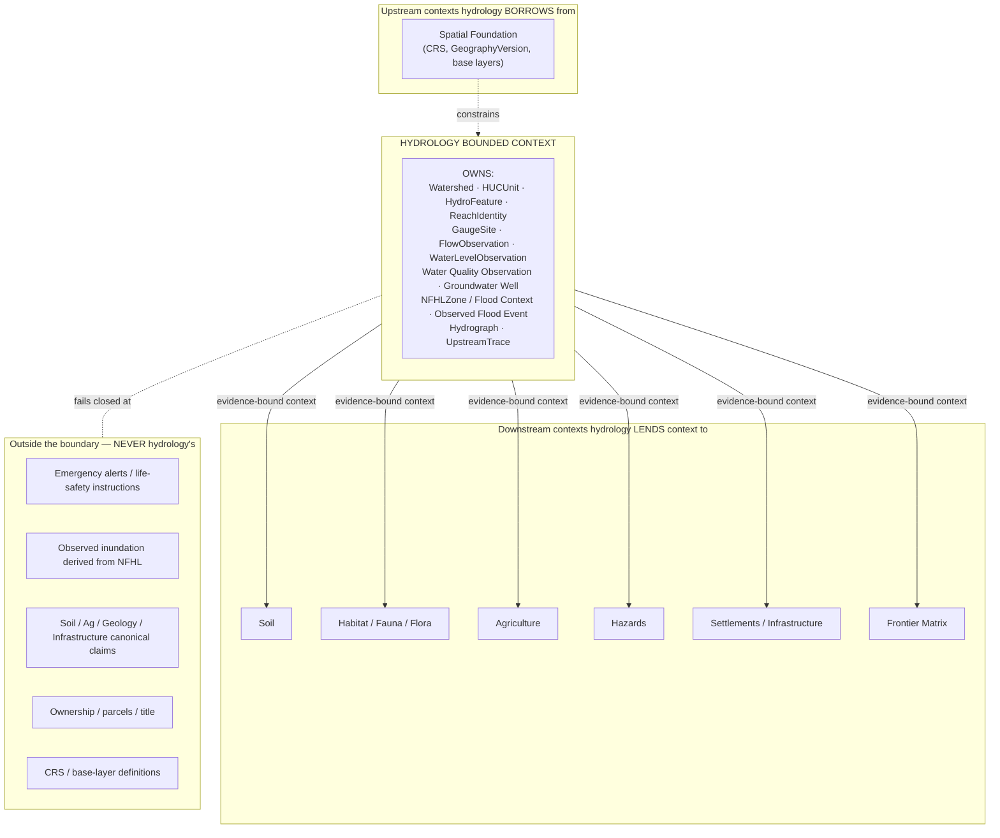
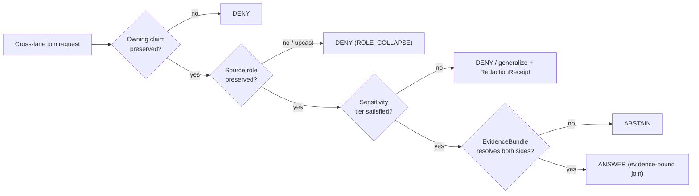

<!-- [KFM_META_BLOCK_V2]
doc_id: kfm://doc/domains/hydrology/boundary
title: Hydrology Domain — Boundary
type: standard
version: v1
status: draft
owners: <hydrology-lane-steward>   # TODO: confirm owning role(s)
created: 2026-06-06
updated: 2026-06-06
policy_label: public
related:
  - docs/domains/hydrology/README.md
  - docs/domains/hydrology/ARCHITECTURE.md
  - directory-rules.md                                  # §12 Domain Placement Law (path authority)
  - ai-build-operating-contract.md                      # CONTRACT_VERSION = "3.0.0"; §23.2 sensitive-domain matrix
  - DomainDriven_Design_Reference.pdf                   # Bounded Context frame
tags: [kfm, hydrology, boundary, bounded-context, ownership, cross-lane, non-ownership]
notes:
  - CONTRACT_VERSION = "3.0.0" pinned per ai-build-operating-contract.md v3.0.
  - Owns / does-not-own lists are CONFIRMED from Atlas v1.1 §4(B); the directed-edge lattice is CONFIRMED from Atlas §24.4.2.
  - NFHL is regulatory context only, never observed inundation. KFM is never a life-safety alert authority.
  - All repo-shaped paths PROPOSED until verified against a mounted repo.
[/KFM_META_BLOCK_V2] -->

# 💧 Hydrology Domain — Boundary

> The bounded-context statement for the hydrology lane: what it **owns**, what it explicitly **does not own**, and the **directed edges** along which it lends and borrows context — so the seam between water and every adjacent lane stays sharp.

**Status** `draft` · **Owners** `<hydrology-lane-steward>` *(TODO)* · **Last updated** `2026-06-06` · **`CONTRACT_VERSION = "3.0.0"`**

> [!IMPORTANT]
> This is a **bounded-context** document. The owns / does-not-own statements and the cross-lane edge lattice are **CONFIRMED doctrine** (Atlas v1.1 §4 B. and §24.4.2). Repository paths and field-level realizations are **PROPOSED / NEEDS VERIFICATION** until inspected against a mounted repo. Memory and prior plans are not evidence.

---

## Contents

1. [Why a boundary doc](#1-why-a-boundary-doc)
2. [The boundary at a glance](#2-the-boundary-at-a-glance)
3. [Inside the boundary — what hydrology owns](#3-inside-the-boundary--what-hydrology-owns)
4. [Outside the boundary — what hydrology does not own](#4-outside-the-boundary--what-hydrology-does-not-own)
5. [The three hard seams](#5-the-three-hard-seams)
6. [Directed edges — context hydrology lends](#6-directed-edges--context-hydrology-lends)
7. [Directed edges — context hydrology borrows](#7-directed-edges--context-hydrology-borrows)
8. [Edge-crossing rules](#8-edge-crossing-rules)
9. [Deny-by-default at the boundary](#9-deny-by-default-at-the-boundary)
10. [How the boundary is enforced](#10-how-the-boundary-is-enforced)
11. [Open questions register](#11-open-questions-register)
12. [Definition of done](#12-definition-of-done)
13. [Related docs](#13-related-docs)

---

## 1. Why a boundary doc

Every KFM domain is a **bounded context**: a region where its terms, identity rules, and claims hold, surrounded by other contexts that hold their own. Where contexts touch, meaning can leak — a regulatory flood zone gets read as observed flooding, an observed streamflow gets cited as a crop yield input, a gauge gets joined to a private parcel. This document draws the hydrology lane's boundary explicitly so those leaks fail closed.

It complements `ARCHITECTURE.md` (which describes *how the lane is built*) by stating *where the lane's authority begins and ends*. The owns/does-not-own content and the edge lattice are lifted from the Atlas; this doc consolidates them into a single boundary statement.

> [!NOTE]
> Boundary doctrine (`directory-rules.md`, the Atlas) wins on every authority question. If this doc ever diverges from those, they are authoritative and the divergence is logged in `docs/registers/DRIFT_REGISTER.md`.

[↑ Back to top](#top)

---

## 2. The boundary at a glance

[↑ Back to top](#top)

---

## 3. Inside the boundary — what hydrology owns

`CONFIRMED` (Atlas v1.1 §4 B.). These object families are the lane's canonical claims; their meaning is constrained by source role, evidence, time, and release state.

| Owned object family | What it is |
|---|---|
| `Watershed` and `HUCUnit` | Drainage areas and nested Hydrologic Unit Code polygons (regions → HUC12). |
| `HydroFeature` and `ReachIdentity` | Hydrography features (waterbodies, flowlines, reaches) and stable reach identity. |
| `GaugeSite` | Monitoring-station identity (location, datum, units, operator). |
| `FlowObservation`, `WaterLevelObservation` | Discharge and stage observations with parameter, unit, qualifier, time. |
| `Water Quality Observation` | Water-quality parameter measurements bound to method and units. |
| `Groundwater Well` | Well points with construction / aquifer / depth context. |
| `NFHLZone` / `Flood Context` | FEMA regulatory flood zones and the composite **context** surface — *not* authority. |
| `Observed Flood Event` | Historically recorded inundation with primary evidence (not derived from NFHL). |
| `Hydrograph`, `UpstreamTrace` | Time-indexed projections and network-trace derivatives. |

> [!NOTE]
> "Owns" means hydrology is the **canonical home** for these claims and their evidence, identity rules, and release state — not that hydrology is their original source. Sources remain external and role-typed (see `ARCHITECTURE.md` §5).

[↑ Back to top](#top)

---

## 4. Outside the boundary — what hydrology does not own

`CONFIRMED` (Atlas v1.1 §4 B.). Each item below belongs to another authority; hydrology may **reference** or **receive context** but never overwrites the owning lane's canonical claim.

| Not owned | Owner / authority | Why the line matters |
|---|---|---|
| Emergency alerts and life-safety warnings | Hazards lane / official sources (NWS, state EM) | KFM is not an emergency system; collapsing this implies operational authority KFM cannot honor. |
| Observed inundation derived from NFHL | None — NFHL is regulatory only | NFHL is legally effective flood hazard data, not observed inundation, hydraulic-model output, or forecast. |
| Soil, agriculture, geology, infrastructure canonical claims | Their respective lanes | Hydrology receives context but never restates those lanes' truth. |
| Ownership, parcels, title | People / DNA / Land lane | Hydrology may reference administrative geometry without owning it. |
| CRS, GeographyVersion, base layers, generalization tolerances | Spatial Foundation lane | Hydrology consumes the shared spatial spine; it does not redefine it. |

[↑ Back to top](#top)

---

## 5. The three hard seams

These are the boundary crossings most prone to silent failure. Each is a `CONFIRMED` category line that MUST hold.

> [!WARNING]
> **Seam 1 — Regulatory ≠ observed.** `NFHLZone` is regulatory **context**. Any visualization or claim that presents an NFHL zone as observed flooding, real-time inundation, hydraulic-model output, or forecast is a category violation and MUST fail the publication gate. (Atlas §4 B.; Master MapLibre ML-061-018.)

> [!CAUTION]
> **Seam 2 — Context ≠ alert authority.** Hydrology contributes observed flow and regulatory context to the Hazards lane; it never issues warnings, declarations, or life-safety instructions. KFM is never an alert authority on any surface. (Atlas §20.5 emergency-alert boundary.)

> [!NOTE]
> **Seam 3 — Observation ≠ derived input.** Observed flow and water-level observations are **cited as context**; they are not, for example, a crop-yield input without an explicit model, nor a per-place observation when they are watershed aggregates. Source role is fixed at admission and never upgraded by a join. (Atlas §24.4.2; source-role anti-collapse.)

[↑ Back to top](#top)

---

## 6. Directed edges — context hydrology lends

`CONFIRMED` (Atlas v1.1 §24.4.2, *"Edges owned by Hydrology"*). These are the directed relations hydrology owns: the downstream lane **consumes from** hydrology, and each relation carries its stated constraint. *"No row consumes from another row except via this lattice."*

| Consuming lane | Relation (CONFIRMED) | Constraint at the seam |
|---|---|---|
| **Soil** | HUC / watershed identity bounds soil hydrologic-group context. | Soil owns SSURGO/SDA truth; hydrology supplies identity bounds only. |
| **Habitat / Fauna / Flora** | Wetland and reach identity feeds habitat-quality and occurrence-context joins. | Sensitive occurrences never cross; public-safe context only. |
| **Agriculture** | Reach identity and water-availability context bound irrigation links. | **Observed flow is not a yield input without modeling.** |
| **Hazards** | Observed flow and water-level observations are cited as context for flood events. | **NFHL is regulatory context only**; hydrology issues no warnings. |
| **Settlements / Infrastructure** | Reach proximity and HUC context drive settlement and crossing analyses. | Do **not** override settlement identity; exact-asset exposure may be staged-access. |
| **Frontier Matrix** | HUC / reach act as cross-temporal anchors for water-availability cells. | Anchors only; the matrix cell is analytical release, not spreadsheet truth. |

[↑ Back to top](#top)

---

## 7. Directed edges — context hydrology borrows

`CONFIRMED` (Atlas v1.1 §24.4.1, *"Edges owned by Spatial Foundation"*). Hydrology is a **consumer** here; the upstream lane owns the relation.

| Owning lane | What hydrology consumes | Constraint at the seam |
|---|---|---|
| **Spatial Foundation** | Coordinate Reference Profile, GeographyVersion, Projection Transform Receipt, scale-support, base-layer descriptors. | Hydrology's time-aware overlay primitives are constrained by Spatial Foundation rules (clipping, projection, generalization tolerances); hydrology does not redefine them. |

> [!TIP]
> The asymmetry is deliberate: hydrology **owns** edges to six downstream lanes but **borrows** the spatial spine from one upstream lane. That keeps the geometry/CRS authority in one place and prevents every domain from re-inventing projection rules.

[↑ Back to top](#top)

---

## 8. Edge-crossing rules

Every cross-lane join across the hydrology boundary MUST preserve four things (Atlas §4 F.; operating contract evidence rules):

1. **Ownership** — the owning lane's canonical claim is not overwritten.
2. **Source role** — authority / observation / context / model is preserved, never upgraded (anti-collapse).
3. **Sensitivity** — the most restrictive applicable tier governs the join; sensitive material fails closed.
4. **EvidenceBundle support** — each side resolves its own `EvidenceRef → EvidenceBundle`; a join without evidence closure is not admissible.

[↑ Back to top](#top)

---

## 9. Deny-by-default at the boundary

`CONFIRMED` (Atlas §20.5 Deny-by-Default Register). At the hydrology boundary, the following are denied unless the stated condition is met.

| Denied at the boundary | Allowed only when |
|---|---|
| KFM used as a life-safety / emergency-alert instruction (Hazards × Hydrology × Air emergency-alert boundary). | **Never** — not allowed as KFM authority. |
| NFHL published as observed flood extent or forecast. | **Never** — category violation. |
| Exact infrastructure exposure (dams, intakes, levees) joined to hydrology features. | Steward review + public-safe generalization. |
| Sensitive private wells or regulated water-use records joined to public surfaces. | Rights + steward review; otherwise generalize/withhold + `RedactionReceipt`. |
| Private person-parcel joins via hydrology administrative geometry. | Consent + policy (People/DNA/Land lane authority). |

> [!CAUTION]
> Sensitive-content disposition (precise coordinates, infrastructure-adjacency, private joins) is governed by the operating-contract **§23.2 sensitive-domain matrix** — this boundary doc points at it and applies it; it does not re-derive it. The most restrictive applicable row wins.

[↑ Back to top](#top)

---

## 10. How the boundary is enforced

The boundary is not self-enforcing prose — it is realized by the lane's governance objects (`PROPOSED` placement per Directory Rules §12).

| Boundary rule | Enforced by | Where (PROPOSED) |
|---|---|---|
| Owned object families have canonical shape | JSON Schema (ADR-0001 home) | `schemas/contracts/v1/domains/hydrology/` |
| Owned object meaning is fixed | Markdown contracts | `contracts/domains/hydrology/` |
| Seams 1–3 + deny-by-default | Policy (allow/deny/restrict/abstain) | `policy/domains/hydrology/` (+ `policy/sensitivity/...`) |
| NFHL role-separation; source-role anti-collapse | Validators + negative fixtures | `tools/validators/...`, `tests/domains/hydrology/`, `fixtures/domains/hydrology/invalid/` |
| Cross-lane edges preserve ownership/role/sensitivity/evidence | Cross-lane join policy + evidence closure | shared policy bundle (home OQ-HYD-BND-02) |
| No public read of canonical stores | Trust membrane / governed API | `apps/governed-api/` |

> [!NOTE]
> The negative fixture `nfhl-as-observed/` (per `ARCHITECTURE.md` §13) is the keystone boundary test: it proves Seam 1 fails closed. The emergency-alert deny case proves Seam 2.

[↑ Back to top](#top)

---

## 11. Open questions register

| ID | Question | Owner role | Resolution path |
|---|---|---|---|
| OQ-HYD-BND-01 | Does `Flood Context` (composite NFHL + terrain + observed history) need its own contract/schema, or is it profiled from `NFHLZone` + `Observed Flood Event`? | Contract-schema steward | Lane ADR + schema authoring. |
| OQ-HYD-BND-02 | Hydrology ↔ Hazards join policy home: hazards-owned vs a shared cross-lane policy bundle. | Policy steward | Policy bundle inspection + ADR (mirrors ADR-S-class cross-lane join policy). |
| OQ-HYD-BND-03 | Threshold/rule for when an observed-flow → agriculture relation requires an explicit model (Seam 3). | Hydrology + Agriculture stewards | Cross-lane policy + ADR. |
| OQ-HYD-BND-04 | Generalization rule for gauge ↔ infrastructure joins (staged-access boundary). | Infrastructure + Hydrology stewards | Cross-lane sensitivity policy + ADR. |
| OQ-HYD-BND-05 | Confirm Spatial Foundation is the only upstream lane hydrology borrows from (no other inbound owned edges). | Hydrology lane steward | Atlas §24.4 cross-check + repo inspection. |

## 12. Definition of done

This document is done enough to enter the repository when:

- it is placed at `docs/domains/hydrology/BOUNDARY.md` per Directory Rules §12;
- the hydrology lane steward (and cross-lane stewards for Seams 2–3) review it;
- it is linked from `docs/domains/hydrology/README.md` and cross-referenced from `ARCHITECTURE.md`;
- it does not conflict with accepted ADRs (esp. the cross-lane join policy ADR, OQ-HYD-BND-02);
- any divergence from Atlas §4 B. / §24.4.2 is logged in `docs/registers/DRIFT_REGISTER.md`;
- a `GENERATED_RECEIPT.json` is wired into CI with `human_review.state` transitioning from `pending` to `approved`;
- future changes follow the operating contract's §37 lifecycle.

[↑ Back to top](#top)

---

## 13. Related docs

- [`docs/domains/hydrology/README.md`](./README.md) — lane orientation *(PROPOSED — verify)*.
- [`docs/domains/hydrology/ARCHITECTURE.md`](./ARCHITECTURE.md) — lane architecture (how the lane is built).
- `directory-rules.md` — §12 Domain Placement Law *(canonical path NEEDS VERIFICATION)*.
- `ai-build-operating-contract.md` — `CONTRACT_VERSION = "3.0.0"`; §23.2 sensitive-domain matrix.
- `DomainDriven_Design_Reference.pdf` — Bounded Context / Anticorruption Layer frame.
- [`contracts/domains/hydrology/`](../../../contracts/domains/hydrology/) — object meaning *(PROPOSED home)*.
- [`schemas/contracts/v1/domains/hydrology/`](../../../schemas/contracts/v1/domains/hydrology/) — object shape *(PROPOSED home; ADR-0001)*.
- [`policy/domains/hydrology/`](../../../policy/domains/hydrology/) — admissibility, sensitivity, deny-by-default *(PROPOSED home)*.
- [`docs/registers/DRIFT_REGISTER.md`](../../registers/DRIFT_REGISTER.md) — boundary-divergence log *(verify)*.

---

<strong>Last updated</strong> 2026-06-06 · <strong>Doc id</strong> <code>kfm://doc/domains/hydrology/boundary</code> · <strong><code>CONTRACT_VERSION = "3.0.0"</code></strong> · <a href="#top">↑ Back to top</a>
