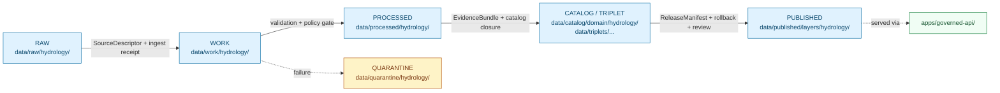

<!-- [KFM_META_BLOCK_V2]
doc_id: kfm://doc/domains/hydrology/canonical-paths
title: Hydrology Domain — Canonical Paths
type: standard
version: v1
status: draft
owners: <hydrology-domain-steward> + <docs-steward>  # placeholders — confirm in repo
created: 2026-05-17
updated: 2026-06-06
policy_label: public
related:
  - directory-rules.md                                  # placement law (root file; docs/doctrine/ mirror is PROPOSED)
  - docs/doctrine/lifecycle-law.md
  - docs/doctrine/trust-membrane.md
  - docs/architecture/contract-schema-policy-split.md
  - docs/architecture/maplibre-3d.md                    # sole-renderer doctrine (v1.3)
  - docs/adr/ADR-0001-schema-home.md
  - ai-build-operating-contract.md                      # CONTRACT_VERSION = "3.0.0"
  - docs/domains/README.md
  - docs/domains/hydrology/README.md
  - control_plane/domain_lane_register.yaml
tags: [kfm, domain, hydrology, paths, governance, lifecycle]
notes:
  - CONTRACT_VERSION = "3.0.0" pinned per ai-build-operating-contract.md v3.0.
  - Indexes every canonical path that the hydrology lane touches.
  - Specific path existence is PROPOSED until mounted-repo evidence verifies it.
  - Governed by Directory Rules §12 (Domain Placement Law) and §6–9.
  - Renderer home corrected to packages/maplibre-runtime/ (Directory Rules v1.3); packages/maplibre/ is the frozen v1.2 historical name (anti-pattern §13.5 #27). Cesium retired.
  - Possible filename collision with docs/domains/hydrology/canonical-paths/README.md — tracked as OQ-HYD-CP-01.
[/KFM_META_BLOCK_V2] -->

# 💧 Hydrology Domain — Canonical Paths

> The authoritative path index for the **hydrology** lane: every responsibility root the domain touches, the segment it lives under, what belongs there, and the rule that governs the placement.

 <!-- TODO: replace with real CI badge -->

**Status:** Draft · **Owners:** Hydrology domain steward + Docs steward *(placeholders — confirm)* · **Updated:** 2026-06-06 · **`CONTRACT_VERSION = "3.0.0"`**

> [!IMPORTANT]
> **Repository not mounted in this session.** The lane *pattern* (Directory Rules §12) is CONFIRMED doctrine; whether any concrete path below is materialized in the current repo is **PROPOSED / NEEDS VERIFICATION**. Treat every concrete path as a *target* the lane may legitimately occupy, not as evidence the file exists. Memory and prior plans are not evidence.

---

## Contents

1. [Purpose](#1-purpose)
2. [Doctrinal anchors](#2-doctrinal-anchors)
3. [Lane spine at a glance](#3-lane-spine-at-a-glance)
4. [Canonical paths by responsibility root](#4-canonical-paths-by-responsibility-root)
   - [4.1 `docs/domains/hydrology/`](#41-docsdomainshydrology--human-facing-doctrine-for-the-lane)
   - [4.2 `contracts/domains/hydrology/`](#42-contractsdomainshydrology--object-meaning)
   - [4.3 `schemas/contracts/v1/domains/hydrology/`](#43-schemascontractsv1domainshydrology--machine-shape)
   - [4.4 `policy/domains/hydrology/`](#44-policydomainshydrology--admissibility-and-release)
   - [4.5 `tests/domains/hydrology/` and `fixtures/domains/hydrology/`](#45-testsdomainshydrology-and-fixturesdomainshydrology--enforceability-proof)
   - [4.6 `packages/domains/hydrology/`](#46-packagesdomainshydrology--shared-libraries-scoped-to-hydrology)
   - [4.7 `pipelines/domains/hydrology/` and `pipeline_specs/hydrology/`](#47-pipelinesdomainshydrology-and-pipeline_specshydrology--pipeline-logic-and-config)
   - [4.8 `data/<phase>/hydrology/` lifecycle lanes](#48-datasephasehydrology-lifecycle-lanes)
   - [4.9 `data/catalog/domain/hydrology/` and `data/published/layers/hydrology/`](#49-datacatalogdomainhydrology-and-datapublishedlayershydrology)
   - [4.10 `data/registry/sources/hydrology/`](#410-dataregistrysourceshydrology--source-registry-for-hydrology-sources)
   - [4.11 `release/candidates/hydrology/`](#411-releasecandidateshydrology--release-decisions-for-hydrology-artifacts)
5. [Connectors that admit hydrology sources](#5-connectors-that-admit-hydrology-sources)
6. [Tools, validators, and cross-cutting topics](#6-tools-validators-and-cross-cutting-topics)
7. [Lifecycle invariant view](#7-lifecycle-invariant-view)
8. [Object families anchored to paths](#8-object-families-anchored-to-paths)
9. [Paths the hydrology lane MUST NOT own](#9-paths-the-hydrology-lane-must-not-own)
10. [Anti-patterns specific to this lane](#10-anti-patterns-specific-to-this-lane)
11. [Open questions and verification backlog](#11-open-questions-and-verification-backlog)
12. [Definition of done](#12-definition-of-done)
13. [Related docs](#13-related-docs)

---

## 1. Purpose

This document is the **path-level index** for the hydrology lane. It does three things, and only these three:

1. Names every canonical path the lane is permitted to occupy.
2. Cites the Directory Rules section that authorizes each path.
3. Marks each path **CONFIRMED** (rule), **PROPOSED** (path-as-applied), or **NEEDS VERIFICATION** (state in mounted repo).

It is **not** a substitute for `directory-rules.md` (rule source), the hydrology dossier (domain meaning), or `control_plane/domain_lane_register.yaml` (machine-readable lane registry). When this document disagrees with Directory Rules, **Directory Rules win** and this document is the drift entry.

> [!NOTE]
> **Rule status is CONFIRMED. Path-as-applied is PROPOSED.** The lane pattern from Directory Rules §12 is doctrine. Whether any specific path is materialized in the current repository is PROPOSED until verified. Treat every concrete path below as a *target* the lane may legitimately occupy.

> [!CAUTION]
> **Possible filename collision.** A sibling index may exist at `docs/domains/hydrology/canonical-paths/README.md` (the subfolder form). Only one of `CANONICAL_PATHS.md` (flat) or `canonical-paths/README.md` (subfolder) should be canonical; the subfolder convention is itself not in Directory Rules §12 and is `PROPOSED`. Tracked as [OQ-HYD-CP-01](#11-open-questions-and-verification-backlog).

[⬆ Back to top](#top)

---

## 2. Doctrinal anchors

The hydrology lane is governed by these doctrines. Every path in this document is justified by one or more of them.

| Doctrine | Source | Effect on hydrology paths |
|---|---|---|
| **Domain Placement Law** | `directory-rules.md` §12 | Hydrology is a **lane**, not a root. `hydrology/` MUST NOT exist at repo root. |
| **Responsibility roots** | `directory-rules.md` §3–§5 | A hydrology file's location is decided by its **responsibility** (docs, contracts, schemas, policy, tests, etc.), not by topic. |
| **Lifecycle invariant** | `directory-rules.md` §9.1; lifecycle-law | All hydrology data flows **RAW → WORK/QUARANTINE → PROCESSED → CATALOG/TRIPLET → PUBLISHED**. Promotion is a governed state transition, not a file move. |
| **Schema-home rule (ADR-0001)** | `directory-rules.md` §6.4; ADR-0001 | Hydrology machine schemas default to `schemas/contracts/v1/domains/hydrology/...`. Parallel homes under `contracts/<domain>/<x>.schema.json` are CONFLICTED and must migrate. |
| **Trust membrane** | `directory-rules.md` §7.1 | Public clients reach hydrology only through `apps/governed-api/`. RAW/WORK/QUARANTINE/canonical stores are not public surfaces. |
| **Watcher-as-non-publisher** | `directory-rules.md` §13.5; watcher invariant | Hydrology watchers (USGS NWIS poll, FEMA NFHL revision watch, etc.) emit receipts and candidates only — they never write to `data/catalog/` or `data/published/`. |
| **Connector boundary** | `directory-rules.md` §7.3 | Hydrology connectors (`connectors/usgs/`, `connectors/fema/`, etc.) emit to `data/raw/hydrology/...` or `data/quarantine/hydrology/...` and nowhere else. |
| **Sole-renderer architecture (v1.3)** | `directory-rules.md` §7.2.a, §11 | Hydrology layers render through `packages/maplibre-runtime/` (the sole governed renderer adapter); Cesium is retired. Hydrology does not own any renderer path. |

> [!NOTE]
> **Hydrology is not an emergency system.** Per the hydrology dossier, NFHL regulatory flood zones, observed inundation, forecasts, and emergency warnings remain **distinct truth classes** and MUST NOT collapse into a single layer. Path organization reflects that boundary — see §9.

[⬆ Back to top](#top)

---

## 3. Lane spine at a glance

The hydrology lane appears as a **segment inside each responsibility root** — never as a root itself. The spine below is the canonical surface for the lane.

```mermaid
flowchart TD
  subgraph Root["Repo root — boring & stable"]
    direction LR
    Docs["docs/"]
    Contracts["contracts/"]
    Schemas["schemas/"]
    Policy["policy/"]
    Tests["tests/"]
    Fixtures["fixtures/"]
    Packages["packages/"]
    Pipelines["pipelines/"]
    PipeSpecs["pipeline_specs/"]
    Data["data/"]
    Release["release/"]
    Connectors["connectors/"]
    Tools["tools/"]
  end

  subgraph Hydro["Hydrology lane segments (PROPOSED paths)"]
    direction TB
    D1["docs/domains/hydrology/"]
    C1["contracts/domains/hydrology/"]
    S1["schemas/contracts/v1/domains/hydrology/"]
    P1["policy/domains/hydrology/"]
    T1["tests/domains/hydrology/"]
    F1["fixtures/domains/hydrology/"]
    PK1["packages/domains/hydrology/"]
    PL1["pipelines/domains/hydrology/"]
    PS1["pipeline_specs/hydrology/"]
    DR["data/raw/hydrology/"]
    DW["data/work/hydrology/"]
    DQ["data/quarantine/hydrology/"]
    DP["data/processed/hydrology/"]
    DC["data/catalog/domain/hydrology/"]
    DPub["data/published/layers/hydrology/"]
    DReg["data/registry/sources/hydrology/"]
    RC["release/candidates/hydrology/"]
  end

  Docs --> D1
  Contracts --> C1
  Schemas --> S1
  Policy --> P1
  Tests --> T1
  Fixtures --> F1
  Packages --> PK1
  Pipelines --> PL1
  PipeSpecs --> PS1
  Data --> DR & DW & DQ & DP & DC & DPub & DReg
  Release --> RC

  Connectors -. shared, not domain-segmented .-> DR
  Tools -. shared validators only .-> S1

  classDef root fill:#f0f4f8,stroke:#334155,color:#0f172a;
  classDef lane fill:#e0f2fe,stroke:#0369a1,color:#0c4a6e;
  class Docs,Contracts,Schemas,Policy,Tests,Fixtures,Packages,Pipelines,PipeSpecs,Data,Release,Connectors,Tools root;
  class D1,C1,S1,P1,T1,F1,PK1,PL1,PS1,DR,DW,DQ,DP,DC,DPub,DReg,RC lane;
```

> Diagram reflects the lane pattern in Directory Rules §12 and the responsibility-root tree in §5. Specific path *materialization* in the current repo is PROPOSED.

[⬆ Back to top](#top)

---

## 4. Canonical paths by responsibility root

Each subsection enumerates a responsibility root the hydrology lane touches, the segment used, what belongs there, and what must **not** end up there.

### 4.1 `docs/domains/hydrology/` — human-facing doctrine for the lane

**Authority basis:** Directory Rules §6.1 (`docs/` is the human-facing control plane); §12 (domain lane under `docs/domains/`).

| Path | Holds | Status |
|---|---|---|
| `docs/domains/hydrology/README.md` | Domain landing page: mission, boundary, scope, public release posture, dossier links. | PROPOSED |
| `docs/domains/hydrology/CANONICAL_PATHS.md` | **This file.** Path-level index. *(See OQ-HYD-CP-01 re: flat vs subfolder form.)* | PROPOSED |
| `docs/domains/hydrology/ARCHITECTURE.md` | Lane architecture (how the lane is built). | PROPOSED |
| `docs/domains/hydrology/BOUNDARY.md` | Bounded-context owns / does-not-own + cross-lane edges. | PROPOSED |
| `docs/domains/hydrology/OBJECT_FAMILIES.md` | Per-object overview (Watershed, HUCUnit, GaugeSite, NFHLZone, …). | PROPOSED |
| `docs/domains/hydrology/SOURCE_ROLE_MATRIX.md` | Per-source role registry: observation vs regulatory vs model vs status. | PROPOSED |
| `docs/domains/hydrology/PUBLICATION_POSTURE.md` | Release posture, redaction profiles, NFHL/inundation/forecast non-collapse. | PROPOSED |

**MUST NOT contain:** machine schemas, policy bundles, executable validators, lifecycle data, release decisions. Those live under their own responsibility roots (§4.3, §4.4, §6, §4.8, §4.11).

> [!TIP]
> Doc pages here **explain**; they do not **decide**. If a page becomes the cited source of a release decision, promote the decision to an ADR (`docs/adr/`) or a `control_plane/` register.

### 4.2 `contracts/domains/hydrology/` — object meaning

**Authority basis:** Directory Rules §6.3 (`contracts/` owns object meaning; Markdown-only by default after ADR-0001).

| Path | Holds | Status |
|---|---|---|
| `contracts/domains/hydrology/README.md` | Lane contracts index. | PROPOSED |
| `contracts/domains/hydrology/watershed.md` | `Watershed` semantic contract. | PROPOSED |
| `contracts/domains/hydrology/huc_unit.md` | `HUCUnit` semantic contract (HUC2–HUC12, WBD identity). | PROPOSED |
| `contracts/domains/hydrology/hydro_feature.md` | `HydroFeature` semantic contract (streams/waterbodies). | PROPOSED |
| `contracts/domains/hydrology/reach_identity.md` | `ReachIdentity` (NHDPlus HR / 3DHP identity crosswalk). | PROPOSED |
| `contracts/domains/hydrology/gauge_site.md` | `GaugeSite` semantic contract (USGS monitoring location). | PROPOSED |
| `contracts/domains/hydrology/flow_observation.md` | `FlowObservation` semantic contract (discharge, cfs). | PROPOSED |
| `contracts/domains/hydrology/water_level_observation.md` | `WaterLevelObservation` semantic contract. | PROPOSED |
| `contracts/domains/hydrology/water_quality_observation.md` | `WaterQualityObservation` semantic contract. | PROPOSED |
| `contracts/domains/hydrology/groundwater_well.md` | `GroundwaterWell` / `AquiferObservation`. | PROPOSED |
| `contracts/domains/hydrology/nfhl_zone.md` | `NFHLZone` — regulatory flood-context only, **not** observed inundation. | PROPOSED |

**MUST NOT contain:** JSON Schema files. If a `contracts/domains/hydrology/<x>.schema.json` exists, it is **CONFLICTED** per Directory Rules §13.1 and must migrate to `schemas/contracts/v1/domains/hydrology/` under ADR-0001.

### 4.3 `schemas/contracts/v1/domains/hydrology/` — machine shape

**Authority basis:** Directory Rules §6.4 + ADR-0001 (schema home is `schemas/contracts/v1/...`).

| Path | Holds | Status |
|---|---|---|
| `schemas/contracts/v1/domains/hydrology/watershed.schema.json` | `Watershed` JSON Schema. | PROPOSED |
| `schemas/contracts/v1/domains/hydrology/huc_unit.schema.json` | `HUCUnit` JSON Schema. | PROPOSED |
| `schemas/contracts/v1/domains/hydrology/hydro_feature.schema.json` | `HydroFeature` JSON Schema. | PROPOSED |
| `schemas/contracts/v1/domains/hydrology/reach_identity.schema.json` | `ReachIdentity` JSON Schema. | PROPOSED |
| `schemas/contracts/v1/domains/hydrology/gauge_site.schema.json` | `GaugeSite` JSON Schema. | PROPOSED |
| `schemas/contracts/v1/domains/hydrology/flow_observation.schema.json` | `FlowObservation` JSON Schema. | PROPOSED |
| `schemas/contracts/v1/domains/hydrology/water_level_observation.schema.json` | `WaterLevelObservation` JSON Schema. | PROPOSED |
| `schemas/contracts/v1/domains/hydrology/water_quality_observation.schema.json` | `WaterQualityObservation` JSON Schema. | PROPOSED |
| `schemas/contracts/v1/domains/hydrology/groundwater_well.schema.json` | `GroundwaterWell` / `AquiferObservation` schemas. | PROPOSED |
| `schemas/contracts/v1/domains/hydrology/nfhl_zone.schema.json` | `NFHLZone` JSON Schema. | PROPOSED |
| `schemas/contracts/v1/domains/hydrology/hydrograph.schema.json` | `Hydrograph` derived-time-series schema. | PROPOSED |
| `schemas/tests/valid/domains/hydrology/` | Schema-valid sample documents (per schema). | PROPOSED |
| `schemas/tests/invalid/domains/hydrology/` | Schema-invalid sample documents (negative cases). | PROPOSED |

> [!WARNING]
> **No parallel schema homes.** Per Directory Rules §13.1, schemas MUST NOT exist simultaneously under `contracts/domains/hydrology/` **and** `schemas/contracts/v1/domains/hydrology/`. If both are found in the mounted repo, open a drift entry per §2.5 and migrate under ADR-0001.

### 4.4 `policy/domains/hydrology/` — admissibility and release

**Authority basis:** Directory Rules §6.5 (`policy/` is canonical singular; `policies/` is compatibility mirror).

| Path | Holds | Status |
|---|---|---|
| `policy/domains/hydrology/README.md` | Lane policy index. | PROPOSED |
| `policy/domains/hydrology/admission.rego` | Source-role admission rules (NFHL vs observed vs forecast vs status). | PROPOSED |
| `policy/domains/hydrology/sensitivity.rego` | Sensitivity classes for hydrology (typically T0–T1, but groundwater-well precision may warrant generalization). | PROPOSED |
| `policy/domains/hydrology/release.rego` | Release-gate policy specific to hydrology layers. | PROPOSED |
| `policy/domains/hydrology/freshness.rego` | Freshness/stale-state rules for live gauges and time series. | PROPOSED |

**MUST NOT contain:** schemas, executable validators (those live in `tools/validators/`), source registries (those live in `data/registry/sources/hydrology/`), release manifests (those live in `release/`).

### 4.5 `tests/domains/hydrology/` and `fixtures/domains/hydrology/` — enforceability proof

**Authority basis:** Directory Rules §6 placement table (tests prove enforceability; fixtures hold sample data).

| Path | Holds | Status |
|---|---|---|
| `tests/domains/hydrology/schema/` | Schema conformance tests for hydrology object families. | PROPOSED |
| `tests/domains/hydrology/policy/` | Policy admission / deny / abstain tests. | PROPOSED |
| `tests/domains/hydrology/identity/` | Identity-crosswalk tests (NHDPlus HR ↔ 3DHP ↔ legacy NHD). | PROPOSED |
| `tests/domains/hydrology/temporal/` | Temporal-logic tests (observed/valid/source/retrieval/release time separation). | PROPOSED |
| `tests/domains/hydrology/redaction/` | Redaction-receipt tests where generalization applies. | PROPOSED |
| `tests/domains/hydrology/no_network/` | Fixture-first, no-network proof tests. | PROPOSED |
| `fixtures/domains/hydrology/golden/` | Known-good sample documents (HUC12, gauge, observation, NFHL zone). | PROPOSED |
| `fixtures/domains/hydrology/invalid/` | Negative fixtures (rights gap, missing source role, ambiguous reach identity, NFHL-as-observed). | PROPOSED |

> [!NOTE]
> **Fixture-home choice.** Directory Rules §13.5 names "fixture sprawl" as an anti-pattern. If the repo uses root `fixtures/` as the authority, do not duplicate under `tests/fixtures/domains/hydrology/`. Settle the rule in `tests/README.md` and `fixtures/README.md` and respect it here.

### 4.6 `packages/domains/hydrology/` — shared libraries scoped to hydrology

**Authority basis:** Directory Rules §7.2 (`packages/` for reusable libraries; one-off steps go to `tools/` or `pipelines/`).

| Path | Holds | Status |
|---|---|---|
| `packages/domains/hydrology/` | Reusable hydrology library code (identity crosswalk helpers, HUC navigation, hydrograph reducers). | PROPOSED |
| `packages/domains/hydrology/README.md` | Package contract: public API, version, dependency boundary. | PROPOSED |

**MUST NOT contain:** workflow steps that run once (those belong in `pipelines/`), repo-wide validators (those belong in `tools/validators/`), or live data.

> [!NOTE]
> The browser **renderer** is not a hydrology package. Hydrology layers render through the shared `packages/maplibre-runtime/` adapter (Directory Rules §7.2.a). See §9.

### 4.7 `pipelines/domains/hydrology/` and `pipeline_specs/hydrology/` — pipeline logic and config

**Authority basis:** Directory Rules §7.4 (split: specs declare *what*, pipelines define *how*).

| Path | Holds | Status |
|---|---|---|
| `pipeline_specs/hydrology/README.md` | Declarative spec index for the hydrology lane. | PROPOSED |
| `pipeline_specs/hydrology/ingest_usgs_nwis.yaml` | USGS NWIS ingest spec. | PROPOSED |
| `pipeline_specs/hydrology/ingest_wbd.yaml` | USGS WBD/HUC ingest spec. | PROPOSED |
| `pipeline_specs/hydrology/ingest_nhdplus_hr.yaml` | NHDPlus HR ingest spec. | PROPOSED |
| `pipeline_specs/hydrology/ingest_nfhl.yaml` | FEMA NFHL ingest spec (regulatory only). | PROPOSED |
| `pipeline_specs/hydrology/normalize.yaml` | Normalization spec (geometry, identity, temporal, evidence). | PROPOSED |
| `pipeline_specs/hydrology/catalog.yaml` | Catalog/triplet closure spec. | PROPOSED |
| `pipeline_specs/hydrology/publish.yaml` | Public-safe publish spec. | PROPOSED |
| `pipelines/domains/hydrology/` | Executable hydrology pipeline code aligned to the specs above. | PROPOSED |

### 4.8 `data/<phase>/hydrology/` lifecycle lanes

**Authority basis:** Directory Rules §9.1 (lifecycle invariant); §12 (per-domain segments under `data/<phase>/`).

| Path | Lifecycle phase | Holds | Status |
|---|---|---|---|
| `data/raw/hydrology/<source_id>/<run_id>/` | RAW | Immutable source payload or reference. SourceDescriptor required. | PROPOSED |
| `data/work/hydrology/<run_id>/` | WORK | Normalization in flight: schema, geometry, time, identity. | PROPOSED |
| `data/quarantine/hydrology/<reason>/<run_id>/` | QUARANTINE | Held failures with reason recorded. | PROPOSED |
| `data/processed/hydrology/<dataset_id>/<version>/` | PROCESSED | Validated normalized objects, receipts, public-safe candidates. | PROPOSED |
| `data/catalog/domain/hydrology/` | CATALOG | Catalog records and EvidenceBundles for hydrology releases. | PROPOSED |
| `data/triplets/graph_deltas/` (hydrology slices) | TRIPLET | Graph projections that include hydrology objects (shared root, not domain-segmented). | PROPOSED |
| `data/published/layers/hydrology/` | PUBLISHED | Released public-safe layer artifacts (PMTiles, GeoParquet, API payloads). | PROPOSED |
| `data/rollback/hydrology/<release_id>/` | rollback target | Rollback objects for hydrology releases. | PROPOSED |

> [!CAUTION]
> **Promotion is a governed state transition, not a file move.** A pipeline that bypasses validators, policy gates, EvidenceBundle creation, catalog closure, and release-decision recording violates the invariant **regardless of which directory bytes end up in** (Directory Rules §9.1). The path is necessary but not sufficient.

> [!NOTE]
> **Triplets are plural.** The canonical lifecycle name is `data/triplets/` (plural). The singular `data/triplet/` is a named data-lifecycle drift (Directory Rules §13.5 / §20 drift #16); do not introduce it.

### 4.9 `data/catalog/domain/hydrology/` and `data/published/layers/hydrology/`

These two paths are called out separately because they are the **most likely confusion surface** in this lane.

| Path | What it is | What it is **not** |
|---|---|---|
| `data/catalog/domain/hydrology/` | Catalog records (STAC items, DCAT distributions, PROV entities) for hydrology releases. | Not the public surface. Not where layer bytes live. |
| `data/published/layers/hydrology/` | Released public-safe **artifacts** (PMTiles, GeoParquet, API payloads) keyed by layer. | Not release **decisions** — those live in `release/` (§4.11). |

Public clients reach published artifacts **only through `apps/governed-api/`**, per the trust membrane (Directory Rules §7.1). No browser or normal client reads `data/published/layers/hydrology/` directly.

### 4.10 `data/registry/sources/hydrology/` — source registry for hydrology sources

**Authority basis:** Directory Rules §9.1 (`data/registry/sources/`).

| Path | Holds | Status |
|---|---|---|
| `data/registry/sources/hydrology/README.md` | Source registry index for the hydrology lane. | PROPOSED |
| `data/registry/sources/hydrology/usgs_nwis.yaml` | SourceDescriptor: USGS Water Data APIs / NWIS. | PROPOSED |
| `data/registry/sources/hydrology/usgs_wbd.yaml` | SourceDescriptor: USGS WBD (HUC). | PROPOSED |
| `data/registry/sources/hydrology/usgs_nhdplus_hr.yaml` | SourceDescriptor: NHDPlus HR / 3DHP. | PROPOSED |
| `data/registry/sources/hydrology/fema_nfhl.yaml` | SourceDescriptor: FEMA NFHL (regulatory). | PROPOSED |
| `data/registry/sources/hydrology/fema_msc.yaml` | SourceDescriptor: FEMA MSC. | PROPOSED |
| `data/registry/sources/hydrology/usgs_3dep.yaml` | SourceDescriptor: 3DEP terrain (when used as hydrology-derived context). | PROPOSED |
| `data/registry/sources/hydrology/state_water_offices.yaml` | SourceDescriptor: state water offices. | PROPOSED |

> [!NOTE]
> **Source roles do not collapse.** Per the hydrology dossier, NFHL is *regulatory context*, NWIS is *observation*, NHDPlus is *reference geometry / identity*, forecasts are *model output*, and emergency declarations are *status*. The source descriptor MUST declare the role; the lane MUST keep them distinct in catalog records, policy, and viewing products. *(Rights and current terms for every source are `NEEDS VERIFICATION` per the dossier; sensitive joins fail closed.)*

### 4.11 `release/candidates/hydrology/` — release decisions for hydrology artifacts

**Authority basis:** Directory Rules §5 (`release/` owns release decisions, distinct from `data/published/` which owns released artifacts).

| Path | Holds | Status |
|---|---|---|
| `release/candidates/hydrology/<release_id>/manifest.json` | ReleaseManifest for a hydrology release candidate. | PROPOSED |
| `release/candidates/hydrology/<release_id>/rollback_card.json` | RollbackCard target tied to the manifest. | PROPOSED |
| `release/correction_notices/hydrology/` | CorrectionNotices for published hydrology claims. | PROPOSED |

[⬆ Back to top](#top)

---

## 5. Connectors that admit hydrology sources

**Connectors are not domain-segmented** under `connectors/`. Per Directory Rules §7.3, connector folders are **source-specific**, not domain-specific. A USGS connector serves hydrology *and* hazards *and* geology when relevant.

| Path | Source family it admits | Hydrology relevance | Status |
|---|---|---|---|
| `connectors/usgs/` | USGS Water Data APIs, NWIS, WBD, NHDPlus HR/3DHP, 3DEP | Primary observation, identity, terrain context | PROPOSED |
| `connectors/fema/` | FEMA NFHL, MSC | Regulatory flood context (not observed inundation) | PROPOSED |
| `connectors/noaa/` | NOAA water/weather services | Cross-lane (hazards/atmosphere); hydrology consumes time-aligned context | PROPOSED |
| `connectors/nrcs/` | NRCS sources | Cross-lane (soil/agriculture); hydrology consumes hydrologic soil group context | PROPOSED |
| `connectors/kansas/` | State water offices, state GIS | Kansas-specific hydrology context | PROPOSED |

> [!IMPORTANT]
> **Connectors emit to RAW or QUARANTINE only.** Per Directory Rules §7.3 and §13.5, connectors MUST NOT write under `data/processed/`, `data/catalog/`, or `data/published/`. The valid write surfaces are `data/raw/hydrology/<source_id>/<run_id>/` and `data/quarantine/hydrology/<reason>/<run_id>/`, with source descriptors, checksums, and ingest receipts.

[⬆ Back to top](#top)

---

## 6. Tools, validators, and cross-cutting topics

Tools and validators that serve hydrology are **shared infrastructure** under `tools/`. The hydrology lane consumes them; it does not own them.

| Path | Purpose | Hydrology relevance | Status |
|---|---|---|---|
| `tools/validators/connector_gate/` | Connector emission gate | Validates hydrology connector outputs land in RAW with required descriptors. | PROPOSED |
| `tools/validators/promotion_gate/` | Lifecycle promotion gate | Enforces evidence closure for hydrology promotion. | PROPOSED |
| `tools/validators/evidence_bundle/` | EvidenceBundle resolution | Required before hydrology claims become public. | PROPOSED |
| `tools/validators/source_descriptor/` | SourceDescriptor schema validation | Validates every hydrology source registry entry. | PROPOSED |
| `tools/validators/domains/hydrology/` | Hydrology-specific validators (HUC identity, gauge-site rules, NFHL vs observed non-collapse) | Lane-specific cross-cutting checks. | PROPOSED |

> [!NOTE]
> **Cross-domain validators do not get a domain segment.** Per Directory Rules §12 ("Multi-domain and cross-cutting files"), a hydrology × hazards flood-context validator lives under `tools/validators/<topic>/...`, not `tools/validators/domains/hydrology/...`. CI orchestration runs through `tools/validate_all.py` (orchestrator-location ambiguity is tracked as OPEN-DR-07, not settled here).

[⬆ Back to top](#top)

---

## 7. Lifecycle invariant view

The same paths, redrawn against the lifecycle phases hydrology objects flow through. Promotion across each arrow is a **governed state transition** (Directory Rules §9.1).

| Phase | Gate to pass before promotion | Path it lands in |
|---|---|---|
| **RAW** | SourceDescriptor exists; rights, sensitivity, citation, time, hash captured. | `data/raw/hydrology/<source_id>/<run_id>/` |
| **WORK / QUARANTINE** | Validation and policy gate pass — or quarantine reason recorded. | `data/work/hydrology/<run_id>/` or `data/quarantine/hydrology/<reason>/<run_id>/` |
| **PROCESSED** | EvidenceRef resolves; ValidationReport and digest closure exist. | `data/processed/hydrology/<dataset_id>/<version>/` |
| **CATALOG / TRIPLET** | EvidenceBundle, catalog item, triplet/graph projection emitted. | `data/catalog/domain/hydrology/` + `data/triplets/...` |
| **PUBLISHED** | ReleaseManifest, correction path, rollback target, review/policy state exist. | `data/published/layers/hydrology/` (served via `apps/governed-api/`) |

> [!NOTE]
> **Closure rule (Atlas §24.6.2).** A transition is closed only when required artifacts exist, each *resolves* its dependencies (`EvidenceRef → EvidenceBundle`, `source_id → SourceDescriptor`), and the policy gate recorded its decision — else it fails closed and the prior state is preserved.

[⬆ Back to top](#top)

---

## 8. Object families anchored to paths

Each hydrology object family from the encyclopedia and Atlas v1.1 has a corresponding **contract**, **schema**, and **fixture** home. The matrix below pins each one to its expected path triplet.

| Object family | Contract (`contracts/domains/hydrology/`) | Schema (`schemas/contracts/v1/domains/hydrology/`) | Golden fixture (`fixtures/domains/hydrology/golden/`) | Status |
|---|---|---|---|---|
| `Watershed` | `watershed.md` | `watershed.schema.json` | `watershed/*.json` | PROPOSED |
| `HUCUnit` | `huc_unit.md` | `huc_unit.schema.json` | `huc_unit/*.json` | PROPOSED |
| `HydroFeature` | `hydro_feature.md` | `hydro_feature.schema.json` | `hydro_feature/*.json` | PROPOSED |
| `ReachIdentity` | `reach_identity.md` | `reach_identity.schema.json` | `reach_identity/*.json` | PROPOSED |
| `GaugeSite` | `gauge_site.md` | `gauge_site.schema.json` | `gauge_site/*.json` | PROPOSED |
| `FlowObservation` | `flow_observation.md` | `flow_observation.schema.json` | `flow_observation/*.json` | PROPOSED |
| `WaterLevelObservation` | `water_level_observation.md` | `water_level_observation.schema.json` | `water_level_observation/*.json` | PROPOSED |
| `WaterQualityObservation` | `water_quality_observation.md` | `water_quality_observation.schema.json` | `water_quality_observation/*.json` | PROPOSED |
| `GroundwaterWell` / `AquiferObservation` | `groundwater_well.md` | `groundwater_well.schema.json` | `groundwater_well/*.json` | PROPOSED |
| `NFHLZone` | `nfhl_zone.md` | `nfhl_zone.schema.json` | `nfhl_zone/*.json` | PROPOSED |
| `Hydrograph` *(derived)* | `hydrograph.md` | `hydrograph.schema.json` | `hydrograph/*.json` | PROPOSED |
| `UpstreamTrace` *(derived)* | `upstream_trace.md` | `upstream_trace.schema.json` | `upstream_trace/*.json` | PROPOSED |
| `WaterUseLink`, `DroughtLink`, `IrrigationLink` *(relations)* | `links.md` | `links.schema.json` | `links/*.json` | PROPOSED |

> Object-family list is **CONFIRMED** by the hydrology dossier (Atlas v1.1 §4 E.) and Encyclopedia §7.2. Specific filenames are PROPOSED conventions; verify against any existing schema or contract in the repo before creating new ones.

[⬆ Back to top](#top)

---

## 9. Paths the hydrology lane MUST NOT own

These are paths that **look** like they belong to hydrology but actually live elsewhere. Misplacement here is the most common drift signal in the lane.

| Topic | Where it belongs | Why not under `hydrology/` |
|---|---|---|
| `hydrology/` at repo root | Nowhere — pattern is forbidden. | Directory Rules §12 (Domain Placement Law) and §13.4 (drift). |
| Hydrology API routes | `apps/governed-api/` (with route names verified). | Public surface is the trust-membrane app, not the lane. |
| Hydrology MapLibre layer wiring | **`packages/maplibre-runtime/`** (sole governed renderer adapter, v1.3) or `apps/explorer-web/`. | Renderer/shell paths are doctrine, not domain. `packages/maplibre/` is the frozen v1.2 historical name; Cesium is retired. |
| Hydrology × hazards flood-context validator | `tools/validators/flood_context/` (cross-cutting topic, no domain segment). | Directory Rules §12 multi-domain rule. |
| Hydrology × soil hydrologic-group join | `schemas/contracts/v1/joins/` (cross-cutting). | Two-domain relation does not live under one domain. |
| Emergency alerts, evacuation guidance | **Nowhere in KFM.** | Hydrology dossier: KFM is not an emergency flood-warning system. NFHL is regulatory **context**, distinct from forecasts and warnings. |
| Hydrology USGS connector code | `connectors/usgs/`. | Connectors are source-specific, not domain-specific (§7.3). |
| Documentation registers (drift, lineage) | `docs/registers/`. | Cross-cutting docs, not lane docs. |
| Schema home divergence under `contracts/domains/hydrology/<x>.schema.json` | Migrate to `schemas/contracts/v1/domains/hydrology/<x>.schema.json` under ADR-0001. | Directory Rules §13.1. |

[⬆ Back to top](#top)

---

## 10. Anti-patterns specific to this lane

> [!WARNING]
> Each pattern below has been recorded as a drift risk in the KFM corpus. If the mounted repo exhibits any of them, open a `docs/registers/DRIFT_REGISTER.md` entry rather than treating the repo state as canon.

| Anti-pattern | Symptom | Fix |
|---|---|---|
| **`hydrology/` at root** | Topic-based root with `data/`, `schemas/`, `policy/`, `docs/` subtree under it. | Migrate piece-by-piece into the responsibility-root lane pattern (§4). |
| **NFHL-as-inundation collapse** | NFHL regulatory zones styled or labeled as observed inundation in a published layer. | Keep regulatory, observed, forecast, and emergency layers in **distinct** `data/published/layers/hydrology/<layer_id>/` artifacts with distinct catalog items. |
| **Watcher writes to PUBLISHED** | A USGS gauge poller writes directly under `data/published/layers/hydrology/`. | Watcher emits **receipts and candidates only**; a governed pipeline performs promotion. |
| **Connector writes to PROCESSED** | A connector promotes a USGS pull straight to `data/processed/hydrology/`. | Connector lands in `data/raw/hydrology/<source_id>/<run_id>/`; pipeline promotes. |
| **Parallel schema home** | Both `contracts/domains/hydrology/<x>.schema.json` and `schemas/contracts/v1/domains/hydrology/<x>.schema.json` exist. | Per ADR-0001, `schemas/...` is canonical; freeze and migrate. |
| **Hydrology emergency routes** | API endpoints presented as "alerts" or "warnings." | Out of scope for KFM. Refer users to NWS/NOAA authority sources. |
| **Stale gauge data published without freshness markers** | Time-series layer served past its freshness window with no stale badge. | Freshness policy enforced via `policy/domains/hydrology/freshness.rego` + `SOURCE_STALE` badge in the Evidence Drawer. |
| **Renderer under a domain segment** | Hydrology layer rendering code placed under `packages/domains/hydrology/` or a `packages/maplibre/`/`packages/cesium/` path. | Hydrology supplies `LayerManifest` records; rendering lives in the shared `packages/maplibre-runtime/` (Directory Rules §7.2.a, §13.5 v1.3). |

[⬆ Back to top](#top)

---

## 11. Open questions and verification backlog

These items remain **NEEDS VERIFICATION** (or **OPEN**) until mounted-repo evidence or an ADR resolves them. They should be carried in `docs/registers/VERIFICATION_BACKLOG.md`.

| ID | Question | Status | Resolution path |
|---|---|---|---|
| OQ-HYD-CP-01 | Flat `CANONICAL_PATHS.md` vs subfolder `canonical-paths/README.md` — which is canonical? | OPEN | Pick one; the subfolder convention is not in §12 and is PROPOSED. Alias/redirect the other; log in `DRIFT_REGISTER.md`. |
| OQ-HYD-CP-02 | Does the mounted repo materialize the §4 lane segments verbatim, or use variant naming? | NEEDS VERIFICATION | Inspect repo; open drift entries for divergences. |
| OQ-HYD-CP-03 | Is `fixtures/domains/hydrology/` or `tests/fixtures/domains/hydrology/` the authority? | NEEDS VERIFICATION | Settle the rule in `tests/README.md` and `fixtures/README.md`. |
| OQ-HYD-CP-04 | Are any hydrology schemas already authored under `contracts/domains/hydrology/<x>.schema.json` (drift §13.1)? | NEEDS VERIFICATION | Inspect; if found, open ADR-0001 migration entry. |
| OQ-HYD-CP-05 | Which hydrology connectors are activated (USGS, FEMA, NOAA, NRCS, state) and what are their rights/terms? | NEEDS VERIFICATION | Check `data/registry/sources/hydrology/` and connector READMEs. |
| OQ-HYD-CP-06 | Does `apps/governed-api/` already expose hydrology routes, and under what shape? | NEEDS VERIFICATION | Inspect routes; record under `docs/architecture/governed-api.md`. |
| OQ-HYD-CP-07 | Renderer rename acceptance (`packages/maplibre/` → `packages/maplibre-runtime/`) and Cesium-retirement ADR. | NEEDS VERIFICATION | OPEN-DR-10 (sole-renderer ADR), OPEN-DR-12 (rename). |
| OQ-HYD-CP-08 | Are hydrology release candidates currently produced under `release/candidates/hydrology/`? | NEEDS VERIFICATION | Inspect `release/`. |
| OQ-HYD-CP-09 | Is there an ADR governing the hydrology-specific NFHL vs observed vs forecast separation? | NEEDS VERIFICATION | Search `docs/adr/`. |
| OQ-HYD-CP-10 | Canonical home of doctrine files (`directory-rules.md`, etc.): repo root vs `docs/doctrine/`. | NEEDS VERIFICATION | Mounted-repo inspection; reconcile `related` links. |
| OQ-HYD-CP-11 | Resolve `docs/standards/PROV.md` vs `PROVENANCE.md` naming (hydrology relies on PROV-O for time-series lineage). | OPEN ADR | OPEN-DR-04 (standards-file naming). |

[⬆ Back to top](#top)

---

## 12. Definition of done

This document is done enough to enter the repository when:

- it is placed under `docs/domains/hydrology/` per Directory Rules §12, and the flat-vs-subfolder question (OQ-HYD-CP-01) is resolved;
- a docs steward and the hydrology domain steward review it;
- it is linked from `docs/domains/hydrology/README.md` and `docs/domains/README.md`;
- it does not conflict with accepted ADRs (esp. ADR-0001 schema home and the sole-renderer ADR, OPEN-DR-10);
- the renderer correction and any path divergences are logged in `docs/registers/DRIFT_REGISTER.md`;
- a `GENERATED_RECEIPT.json` is wired into CI with `human_review.state` transitioning from `pending` to `approved`;
- future changes follow the operating contract's §37 lifecycle.

[⬆ Back to top](#top)

---

## 13. Related docs

- `directory-rules.md` — placement doctrine (authoritative; canonical path NEEDS VERIFICATION, OQ-HYD-CP-10).
- [`docs/doctrine/lifecycle-law.md`](../../doctrine/lifecycle-law.md) — RAW → PUBLISHED invariant.
- [`docs/doctrine/trust-membrane.md`](../../doctrine/trust-membrane.md) — governed-API boundary.
- [`docs/architecture/contract-schema-policy-split.md`](../../architecture/contract-schema-policy-split.md) — contracts vs schemas vs policy.
- [`docs/architecture/maplibre-3d.md`](../../architecture/maplibre-3d.md) — sole-renderer doctrine (v1.3).
- [`docs/adr/ADR-0001-schema-home.md`](../../adr/ADR-0001-schema-home.md) — schema-home rule.
- `ai-build-operating-contract.md` — operating contract, `CONTRACT_VERSION = "3.0.0"` (canonical path NEEDS VERIFICATION).
- [`docs/domains/README.md`](../README.md) — domains index.
- [`docs/domains/hydrology/README.md`](./README.md) — hydrology landing page.
- [`docs/domains/hydrology/ARCHITECTURE.md`](./ARCHITECTURE.md) · [`docs/domains/hydrology/BOUNDARY.md`](./BOUNDARY.md) — lane architecture and boundary.
- [`docs/standards/PROV.md`](../../standards/PROV.md) — provenance standard *(subject to PROVENANCE.md naming ADR, OPEN-DR-04)*.
- [`docs/standards/PMTILES.md`](../../standards/PMTILES.md) — PMTiles governance for published layers.
- [`docs/standards/OGC-API-TILES.md`](../../standards/OGC-API-TILES.md) — OGC API Tiles delivery.
- [`control_plane/domain_lane_register.yaml`](../../../control_plane/domain_lane_register.yaml) — machine-readable lane registry.
- [`control_plane/source_authority_register.yaml`](../../../control_plane/source_authority_register.yaml) — source-role authority.
- [`tools/README.md`](../../../tools/README.md) — tools directory contract.

<strong>Source-role anti-collapse reference (expand)</strong>

Hydrology source roles MUST stay distinct in catalog records, policy, and viewing products. This is doctrine, not implementation taste.

| Role | Example sources | Truth class |
|---|---|---|
| **Observation** | USGS NWIS (gauge readings, water quality), state monitoring | What was measured at a place and time |
| **Regulatory** | FEMA NFHL, FEMA MSC | What is *designated* by an authority (not observed) |
| **Reference geometry / identity** | USGS WBD (HUC), NHDPlus HR / 3DHP | Stable identity scaffolding for features and reaches |
| **Model output** | Forecast model fields (where admitted) | What a model *predicts* — not an observation |
| **Status** | Emergency declarations, drought monitors | Administrative state, not a measurement |
| **Context** | 3DEP terrain (where used for hydrology derivation) | Adjacent evidence supporting hydrologic interpretation |

Collapsing roles (e.g., styling NFHL as observed inundation) is a public-facing trust failure and is denied by lane policy. Source role is fixed at admission and never upgraded by promotion.

<strong>Cross-lane relations (expand)</strong>

Per Atlas v1.1 §4 F. (Cross-lane relations) and §24.4.2 (Edges owned by Hydrology), hydrology participates in these cross-lane relations. Files implementing them live under the **lowest common responsibility root** with no domain segment.

| Related lane | Relation type | Likely shared path |
|---|---|---|
| Hazards | Flood / drought / warning / declaration / resilience context (NFHL regulatory only) | `schemas/contracts/v1/joins/hydrology_hazards/` |
| Soil | Soil moisture / hydrologic group / infiltration / runoff | `schemas/contracts/v1/joins/hydrology_soil/` |
| Agriculture | Irrigation / drought stress / crop-water context (observed flow ≠ yield input without modeling) | `schemas/contracts/v1/joins/hydrology_agriculture/` |
| Settlements / Infrastructure | Floodplain / bridges / dams / utilities / exposure (do not override settlement identity) | `schemas/contracts/v1/joins/hydrology_settlements/` |

All cross-lane relations MUST preserve ownership, source role, sensitivity, and EvidenceBundle support (Atlas v1.1 §4 F.). See `BOUNDARY.md` for the full directed-edge lattice.

---

<strong>Last updated:</strong> 2026-06-06 · <strong>Version:</strong> v1 (draft) · <strong><code>CONTRACT_VERSION = "3.0.0"</code></strong> · <strong>Authority:</strong> Directory Rules §12 + §6–9 (CONFIRMED) · Path-as-applied (PROPOSED) · <a href="#top">⬆ Back to top</a>
