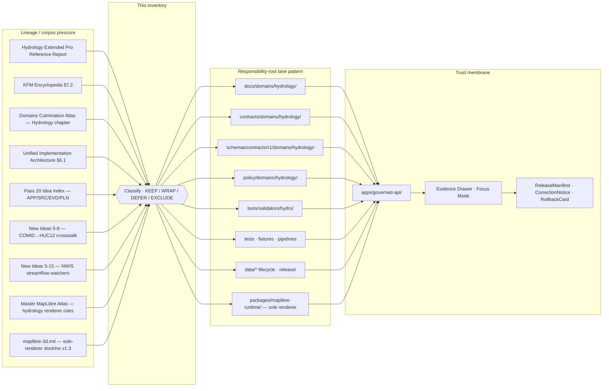

<!-- [KFM_META_BLOCK_V2]
doc_id: kfm://doc/docs-domains-hydrology-continuity-inventory
title: Hydrology — Continuity Inventory
type: standard
version: v1
status: draft
owners: <hydrology-stewards>   # NEEDS VERIFICATION: confirm CODEOWNERS entry for docs/domains/hydrology/
created: 2026-05-17
updated: 2026-06-06
policy_label: public
related:
  - docs/domains/hydrology/README.md
  - docs/domains/hydrology/ARCHITECTURE.md
  - docs/domains/hydrology/BOUNDARY.md
  - docs/domains/README.md
  - docs/doctrine/lifecycle-law.md
  - docs/doctrine/trust-membrane.md
  - directory-rules.md                                  # placement law (root file; docs/doctrine/ mirror is PROPOSED)
  - docs/architecture/maplibre-3d.md                    # sole-renderer doctrine (v1.3); 3D inside packages/maplibre-runtime/
  - ai-build-operating-contract.md                      # CONTRACT_VERSION = "3.0.0"
  - docs/standards/PROV.md
  - docs/standards/PMTILES.md
  - docs/standards/OGC-API-TILES.md
  - docs/standards/OAI-PMH.md
  - docs/standards/ISO-19115.md
  - docs/registers/VERIFICATION_BACKLOG.md
  - docs/registers/CANONICAL_LINEAGE_EXPLORATORY.md
  - control_plane/domain_lane_register.yaml
  - control_plane/source_authority_register.yaml
  - control_plane/verification_backlog.yaml
tags: [kfm, hydrology, continuity, lineage, doctrine, governance]
notes:
  - "CONTRACT_VERSION = \"3.0.0\" pinned per ai-build-operating-contract.md v3.0."
  - "Continuity inventory for the Hydrology domain lane."
  - "Lineage classification only; not an implementation claim."
  - "All path-bearing claims governed by Directory Rules §3, §4, §12."
  - "Renderer updated: Cesium is RETIRED (Directory Rules v1.3 §11; anti-pattern §13.5 #21). 3D hydrology is hosted inside packages/maplibre-runtime/ (MapLibre-3D). Sole-renderer decision is doctrine-CONFIRMED at directory-rules v1.3; underlying ADR is PROPOSED (OPEN-DR-10)."
[/KFM_META_BLOCK_V2] -->

<a id="top"></a>

# 💧 Hydrology — Continuity Inventory

> Lineage register for the Hydrology domain: what prior KFM work is carried forward, how it is classified, and what next behavior each surface is bound to preserve.

<p align="center"><b>Evidence-bound · Lifecycle-faithful · Source-role disciplined · Fail-closed on rights, sensitivity, and authority</b></p>


<!-- TODO Shields.io: replace with CI continuity-check badge once tests/domains/hydrology/continuity_inventory_check is wired. -->


**Status:** draft · **Owners:** `<hydrology-stewards>` *(placeholder — NEEDS VERIFICATION)* · **Last updated:** 2026-06-06 · **`CONTRACT_VERSION = "3.0.0"`**

> [!IMPORTANT]
> **Repository not mounted in this session.** This is a lineage register, not an implementation claim. Doctrine is CONFIRMED from project knowledge; every path, route, schema, test, and CI claim is `PROPOSED` / `NEEDS VERIFICATION` until inspected against a mounted repo. Memory is not evidence.

---

## Quick jump

- [1. Purpose & scope](#1-purpose--scope)
- [2. Continuity posture & method](#2-continuity-posture--method)
- [3. Lineage sources carried forward](#3-lineage-sources-carried-forward)
- [4. Prior gains — continuity inventory](#4-prior-gains--continuity-inventory)
- [5. Object family continuity](#5-object-family-continuity)
- [6. Source family continuity](#6-source-family-continuity)
- [7. Lifecycle, publication, and rollback continuity](#7-lifecycle-publication-and-rollback-continuity)
- [8. Cross-lane continuity](#8-cross-lane-continuity)
- [9. Anti-pattern continuity — what we do not carry forward](#9-anti-pattern-continuity--what-we-do-not-carry-forward)
- [10. Thin-slice continuity](#10-thin-slice-continuity)
- [11. Hydrology lineage flow](#11-hydrology-lineage-flow)
- [12. Open questions register](#12-open-questions-register)
- [13. Verification backlog](#13-verification-backlog)
- [14. Changelog](#14-changelog)
- [15. Definition of done](#15-definition-of-done)
- [16. Related docs](#16-related-docs)
- [Appendix A — Classification glossary](#appendix-a--classification-glossary)
- [Appendix B — Truth label glossary](#appendix-b--truth-label-glossary)

---

## 1. Purpose & scope

This document is the **Hydrology domain continuity inventory**. It records prior KFM gains — doctrine, design surfaces, source-role thinking, object families, validators, publication patterns, anti-patterns — and classifies how each is carried into the hydrology lane: **kept as doctrine, kept as lineage, extended, wrapped, deferred, or explicitly excluded**.

It exists because the hydrology lane has the longest planning lineage of any KFM domain (multiple dossiers, the encyclopedia chapter, the culmination atlas, idea-index entries, and operational New Ideas packets) and because *prior planning is not implementation*. The inventory keeps that lineage usable without letting it impersonate repo state.

| What this doc IS | What this doc IS NOT |
|---|---|
| A lineage register for hydrology surfaces, decisions, and design pressure | A claim about current repo implementation |
| A classification of how prior gains are preserved (`KEEP / EXTEND / WRAP / DEFER / EXCLUDE`) | A canonical schema, contract, policy, or release authority |
| A pointer from prior dossiers into the responsibility-root lane pattern | A substitute for `docs/domains/hydrology/README.md` or ADRs |
| Subordinate to KFM doctrine and Directory Rules | A trust authority over `EvidenceBundle`, `PromotionDecision`, or `ReleaseManifest` |

> [!NOTE]
> Continuity does not promote. A surface listed here as `KEEP AND EXTEND` is still a planning carrier until a mounted-repo PR with evidence (files, schemas, tests, manifests, receipts) demonstrates the implementation. This inventory has no power to upgrade `PROPOSED` to `CONFIRMED`.

[Back to top](#top)

---

## 2. Continuity posture & method

### 2.1 Why a continuity inventory exists

KFM's whole-UI expansion report introduces a *Prior Gains and Continuity Inventory* pattern: classify each preserved surface and state its next behavior, so prior work is neither discarded nor silently re-stated as current truth. The hydrology lane needs the same discipline at the domain scale because (a) hydrology is the corpus-recommended early proof lane, and (b) several legacy dossiers shape its design space.

### 2.2 Classification vocabulary

The following dispositions are used throughout this inventory. Detailed definitions appear in [Appendix A](#appendix-a--classification-glossary).

| Disposition | Meaning |
|---|---|
| `KEEP AND EXTEND` | Doctrine or surface preserved verbatim; next behavior adds testable surfaces. |
| `WRAP WITH ADAPTER` | External or legacy interface preserved behind an adapter so the trust membrane stays in front. |
| `KEEP AS LINEAGE` | Prior planning artifact preserved as design pressure only; not treated as implementation. |
| `DEFER` | Surface acknowledged but explicitly postponed until a prior gate is passed. |
| `EXCLUDE` | Surface listed only to mark that it is **not** carried forward (anti-pattern, scope-mismatch, or invariant violation). |

### 2.3 Truth labels used

This inventory uses the standard KFM labels — `CONFIRMED`, `INFERRED`, `PROPOSED`, `UNKNOWN`, `NEEDS VERIFICATION`. Full definitions live in [Appendix B](#appendix-b--truth-label-glossary). The default posture for any path, route, schema, test, CI step, or runtime claim in this file is `PROPOSED` unless mounted-repo evidence is cited.

> [!IMPORTANT]
> Memory is not evidence. The dossiers referenced here are corpus lineage — they prove *what was planned*, not *what is built*. Implementation depth for every hydrology surface remains `UNKNOWN` in this session because no KFM repo is mounted.

### 2.4 Authority order

1. KFM doctrine and Directory Rules (CONFIRMED in attached corpus).
2. Mounted repo evidence (NOT mounted in this session → `UNKNOWN` for implementation claims).
3. Hydrology-lane corpus dossiers (lineage, not implementation).
4. External standards (preserved as crosswalk/reference targets only; never substituted for KFM-internal trust authority).

[Back to top](#top)

---

## 3. Lineage sources carried forward

The hydrology lane inherits design pressure from a small set of confirmed corpus documents. Each is treated as **lineage / design pressure**, never as repo implementation evidence.

| Lineage source | Role for hydrology continuity | Evidence label |
|---|---|---|
| `KFM_Hydrology_Extended_Pro_PDF_Only_Reference_Report_2026-04-21.pdf` (43 pp.) | Primary domain blueprint: HUC12/WBD, NHDPlus HR identity, USGS Water Data normalization, NFHL regulatory flood context, 3DEP terrain, layer manifests, proof closure, rollback. | CONFIRMED lineage / `PROPOSED` implementation |
| `KFM_Domains_Culmination_Atlas_v1_1.pdf` — Hydrology chapter (`[DOM-HYD]`) | Culminated A–N domain template (identity, ubiquitous language, source families, object families, pipeline shape, sensitivity, governed-AI behavior, publication, rollback, verification backlog). | CONFIRMED doctrine / `PROPOSED` implementation |
| `kfm_encyclopedia.pdf` — §7.2 Hydrology | Mission/boundary, source families, canonical object families, spatial/temporal model, map products, analytical functions, knowledge systems, risks. | CONFIRMED doctrine / `PROPOSED` implementation |
| `KFM_Unified_Implementation_Architecture_Build_Manual.pdf` — §6.1 (30.1) Hydrology | Lane scope, source authority, sensitivity posture, object families, pipeline shape, publication gates, open verification items. | CONFIRMED doctrine / `PROPOSED` implementation |
| `KFM_Pass_20_Part_2_Idea_Index_Category_Atlas_and_Expansion_Dossier.md` | `KFM-IDX-APP-001` (Hydrology Proof Lane), `KFM-IDX-SRC-002` (SourceDescriptor / source-role registry), `KFM-IDX-EVD-002` (EvidenceRef → EvidenceBundle), `KFM-IDX-PLN-003` (proof-bearing thin slices). | CONFIRMED lineage |
| `New Ideas 5-8-26.pdf` | COMID → HUC12 crosswalk recipe, validator gates, manifest fields, fail-closed posture, recommended `tools/validators/hydro/` layout. | CONFIRMED lineage / `PROPOSED` implementation |
| `New Ideas 5-15-26.pdf` | USGS NWIS streamflow daily-value watchers, anomaly gates (3× 7-day median; consecutive ≥ p95), governed sidecar shape, RAW → PUBLISHED posture. | CONFIRMED lineage / `PROPOSED` implementation |
| `Master MapLibre Components-Functions-Features.pdf` | Hydrology renderer-boundary discipline; NFHL is regulatory context, not observed inundation; WaterWatch percentile context as released layer, not raw gauge pulls; PMTiles/COG/MapLibre patterns subordinate to governed catalog. | CONFIRMED lineage / `PROPOSED` implementation |
| `docs/architecture/maplibre-3d.md` (v1.3) | Sole-renderer doctrine: MapLibre GL JS is KFM's only browser-side renderer; 3D capabilities hosted inside `packages/maplibre-runtime/`; Cesium retired. | CONFIRMED doctrine (PROPOSED ADR; OPEN-DR-10) / `PROPOSED` implementation |
| `KFM_Whole_UI_Governed_AI_Expansion_Report.pdf` | The continuity-inventory pattern itself; Evidence Drawer, Focus Mode, finite outcomes (`ANSWER / ABSTAIN / DENY / ERROR`) applied to hydrology surfaces. | CONFIRMED doctrine |
| `directory-rules.md` | Domain Placement Law (§12) — hydrology is a **segment**, not a root. Sole-renderer architecture (§7.2.a, §11). Drives every path proposal below. | CONFIRMED placement authority |

<details>
<summary><b>Why this inventory does not re-extract those sources</b></summary>

Each lineage document already contains its own detailed argument. This inventory does not re-quote them; it classifies them. To consult any of them in detail, read the source in the project corpus and treat its specific paths, validators, or fixtures as `PROPOSED` until a mounted-repo PR demonstrates them.

</details>

[Back to top](#top)

---

## 4. Prior gains — continuity inventory

The core table. Each row records a hydrology-relevant prior surface, its continuity disposition, the lineage basis, and the preserved next behavior. **Implementation maturity for every row is `UNKNOWN` unless a mounted repo confirms otherwise.**

### 4.1 Doctrine & invariants

| Prior gain | Disposition | Lineage basis | Preserved next behavior |
|---|---|---|---|
| Hydrology owns watersheds, HUCs, stream reaches, gauges, flow/level/quality observations, groundwater, irrigation/drought links, flood-*context* | `KEEP AND EXTEND` | `[DOM-HYD]` / `[ENCY] §7.2` / `[UNIFIED] §6.1` | Treat as bounded context (DDD); enforce ownership boundary at schemas, policy, and Evidence Drawer payloads. |
| Hydrology explicitly does **not** own emergency alerts, life-safety warnings, or regulatory inundation-as-observed-event claims | `KEEP AND EXTEND` | `[DOM-HYD]` / `[DOM-HAZ]` | Refuse routes/layers/AI outputs that collapse NFHL regulatory zones with observed flood events; surface as `DENY` at the trust membrane. |
| `RAW → WORK / QUARANTINE → PROCESSED → CATALOG / TRIPLET → PUBLISHED` lifecycle for hydrology | `KEEP AND EXTEND` | `[DIRRULES] §9.1` / `[DOM-HYD] H` / `[ENCY]` | Every promotion is a governed state transition, not a file move. Hydrology pipelines emit `SourceDescriptor`, `ValidationReport`, `EvidenceBundle`, `ReleaseManifest`, `RollbackCard`. |
| Cite-or-abstain truth posture for all consequential hydrology claims | `KEEP AND EXTEND` | `[GAI]` / `[ENCY]` / `KFM-IDX-EVD-002` | EvidenceRef MUST resolve to EvidenceBundle before public claim authority; AI `ABSTAIN`s on missing/insufficient hydrology evidence. |
| Hydrology is the corpus-recommended first proof lane | `KEEP AND EXTEND` | `[DOM-HYD]` / `KFM-IDX-APP-001` / `KFM-IDX-PLN-003` / `[BLD-GREEN] §21` | First Kansas hydrology thin slice ships as a fixture-first, no-network proof closure (see §10). |
| Watcher-as-non-publisher invariant for hydrology probes | `KEEP AND EXTEND` | `[New Ideas 5-8]` / `[New Ideas 5-15]` / `KFM-IDX-SRC-003` | Streamflow / NHD-delta / NFHL-revision watchers emit `RunReceipt` and `PROPOSED` sidecars only; no direct publish path. |

### 4.2 Design surfaces (UI, API, AI)

| Prior gain | Disposition | Lineage basis | Preserved next behavior |
|---|---|---|---|
| Hydrology Evidence Drawer payload (clicked feature → resolved evidence → policy/release state) | `KEEP AND EXTEND` | `[DOM-HYD]` / `[UIAI]` / `[MAP-MASTER]` | `EvidenceDrawerPayload` schema for hydrology features; click-to-drawer + conflict/caveat tests; no raw layer click bypasses resolution. |
| Hydrology Focus Mode (bounded synthesis with `AIReceipt`) | `KEEP AND EXTEND` | `[GAI]` / `[DOM-HYD]` / `[UIAI]` | `RuntimeResponseEnvelope` returns `ANSWER / ABSTAIN / DENY / ERROR` (opt. `NARROWED` / `BOUNDED`) over released hydrology `EvidenceBundle`s only. No browser-to-model calls. |
| Hydrology layer manifests + MapLibre disciplined renderer boundary | `KEEP AND EXTEND` | `[MAP-MASTER]` / `[DOM-HYD]` / `[DIRRULES §7.2.a]` | `LayerManifest` + `StyleManifest` + `TileArtifactManifest` + `MapReleaseManifest` for each hydrology layer; rendered through `packages/maplibre-runtime/` (sole governed renderer adapter), not a truth path. |
| Time-aware hydrology state (valid/observed/retrieval/release/correction times) | `KEEP AND EXTEND` | `[ENCY] §7.2 D` / `[MAP-MASTER]` | `TimeState` carried at every layer + drawer payload; provisional/final, parameter code, unit, qualifier, uncertainty preserved. |
| WaterWatch percentile context as released hydrology layer | `KEEP AND EXTEND` | `ML-064-001` | Expose anomaly context through governed catalog; never as a raw gauge pull. |
| GeoManifest / trust-badge layer integrity | `WRAP WITH ADAPTER` | `[Whole-UI Expansion] §6` / `[MAP-MASTER]` | Use as proposed integrity layer for hydrology PMTiles/COG; validate digest + provenance before any UI badge. |
| External hydrology services (USGS NWIS, WBD/HUC, NHDPlus HR map services, NFHL ArcGIS REST/WMS, 3DEP terrain) | `WRAP WITH ADAPTER` | `[DOM-HYD] D` / `[New Ideas 5-8]` / `[New Ideas 5-15]` / `ML-061-017..021` | Reach external services only through `SourceDescriptor` + connector; outputs land in `data/raw/hydrology/<source_id>/<run_id>/`. Connectors do not publish. |

### 4.3 Validators, fixtures, and CI

| Prior gain | Disposition | Lineage basis | Preserved next behavior |
|---|---|---|---|
| HUC12 fingerprint validator | `KEEP AS LINEAGE` → target `KEEP AND EXTEND` | `[DOM-HYD] N` / `[ENCY]` | `PROPOSED` validator under `tools/validators/hydro/` *(per New Ideas 5-8; orchestration via `tools/validate_all.py`, OPEN-DR-07)*; deterministic, offline, no-network. |
| COMID → HUC12 crosswalk (deterministic, provenance-first) | `KEEP AS LINEAGE` → target `KEEP AND EXTEND` | `[New Ideas 5-8]` | `PROPOSED` manifest schema (`schema_version`, `comid`, `huc12`, `decision_reason`, `alignment_score`, `spec_hash`, `source_head`, `provenance`); fallback order: official crosswalk → area-weighted → centroid → snap-to-outlet. |
| NHDPlus HR identity ambiguity → `ABSTAIN` | `KEEP AND EXTEND` | `[DOM-HYD] N` | Required negative fixtures: invalid HUC12 length, `alignment_score < 0.75`, missing provenance, multi-HUC candidate. |
| USGS parameter/unit/qualifier/no-data tests | `KEEP AS LINEAGE` → target `KEEP AND EXTEND` | `[DOM-HYD] K` / `[ENCY]` | Preserve `00060` (cfs), `00065` (gage height), UTC, provisional/final flag; deny missing units / unresolved EvidenceRef. |
| NFHL source-role separation tests | `KEEP AND EXTEND` | `[DOM-HYD]` / `ML-061-017..021` | Validators MUST reject any claim that uses NFHL as observed inundation or forecast. |
| No-network hydrology proof fixture | `KEEP AS LINEAGE` → target `KEEP AND EXTEND` | `[DOM-HYD] K` / `[UNIFIED] §6.1` | Fixture-first thin slice: HUC12 + 1 gauge + 1 NHDPlus crosswalk + 1 NFHL context + 1 EvidenceBundle, all offline. |
| EvidenceBundle closure tests | `KEEP AND EXTEND` | `[ENCY]` / `KFM-IDX-EVD-002` | Every hydrology public claim resolves an EvidenceRef before the trust membrane. |
| USGS NWIS streamflow anomaly watcher (Gate A: > 3× 7-day median; Gate B: consecutive ≥ p95) | `KEEP AS LINEAGE` → target `KEEP AND EXTEND` (watcher only; non-publisher) | `[New Ideas 5-15]` | Watcher emits `PROPOSED` sidecar + `RunReceipt`; promotion handled by governed pipeline, not the watcher. |
| Stale source / freshness badges | `KEEP AND EXTEND` | `[ENCY] M` / `[MAP-MASTER]` | Freshness state surfaces on map + drawer; `ABSTAIN` / `DENY` / `SOURCE_STALE` on stale evidence per policy. |

### 4.4 Publication, correction, rollback

| Prior gain | Disposition | Lineage basis | Preserved next behavior |
|---|---|---|---|
| Hydrology `ReleaseManifest` + correction path + rollback target | `KEEP AND EXTEND` | `[DOM-HYD] M` / `[ENCY]` / `[DIRRULES]` | Each released hydrology layer/API carries `ReleaseManifest`, `CorrectionNotice` capability, and `RollbackCard` pointer. |
| Public-safe-by-default for hydrology | `KEEP AND EXTEND` | `[DOM-HYD]` / `[ENCY] M` | Default public posture, but DENY on unclear rights, NFHL misuse, or unresolved sensitivity (infrastructure / private property exposure). |
| Promotion as a governed state transition | `KEEP AND EXTEND` | `[DIRRULES] §9.1` / `[ENCY]` | No file-move publication. Promotion gates evaluate Validation + Policy + Evidence + Review state. |
| Receipts/proofs separated from build artifacts | `KEEP AND EXTEND` | `[DIRRULES] §13.2` | Hydrology receipts under `data/receipts/`, proofs under `data/proofs/`, release decisions under `release/`. No trust content in `artifacts/`. |

### 4.5 Deferred or scoped-out for now

| Prior gain | Disposition | Lineage basis | Reason for deferral |
|---|---|---|---|
| 3D hydrology scene (MapLibre-3D, hosted inside `packages/maplibre-runtime/`) | `DEFER` | `[DIRRULES §7.2.a, §11]` / `docs/architecture/maplibre-3d.md` / `[ENCY]` | 2D evidence continuity must be proven first. 3D enters only inside the sole governed renderer adapter, with `SceneManifest`, `RealityBoundaryNote`, a **3D Admission Decision**, and a `RepresentationReceipt`. **Cesium is retired** — see the [renderer note](#451-renderer-note-cesium-retired) below. |
| Cross-domain hydrology graph queries and analytics | `DEFER` | `[ENCY] L (Ambitious / research)` | Build only after thin-slice proof lane closure; graph projections downstream of evidence, not parallel to it. |
| Hydrology time-slider compare mode beyond fixtures | `DEFER` | `[ENCY] L (After proof lane)` | Requires versioned observations/layers + temporal-alignment tests beyond the thin slice. |
| MLT (MapLibre Tiles) pilot for hydrology | `DEFER` | `Master MapLibre Atlas` | Performance-promising but parity-unverified; PMTiles/COG remain canonical. |
| Live source activation (USGS Water Data legacy → modern `api.waterdata.usgs.gov`) | `DEFER until ADR` | `[New Ideas 5-8]` / `[DOM-HYD] N` | Legacy WaterServices phasing-out (2026/2027) per corpus — `NEEDS VERIFICATION` of current endpoint status; requires source-rights / endpoint / cadence / policy / monitoring checks before activation. |

#### 4.5.1 Renderer note — Cesium retired

> [!WARNING]
> **Renderer correction (Directory Rules v1.3).** Earlier lineage referred to a "3D / Cesium hydrology scene." **Cesium is retired** from KFM's architecture; reintroducing a parallel browser renderer is a named anti-pattern (Directory Rules §13.5 #21). KFM's **sole browser-side renderer is MapLibre GL JS**, and every 3D capability hydrology might use — terrain, globe projection, fill-extrusion, 3D Tiles (via three.js + `3d-tiles-renderer`), glTF, point clouds, deck.gl interleaved — is hosted **inside** `packages/maplibre-runtime/` via plugin-backed custom layers, gated by a **3D Admission Decision** before any `setTerrain` / globe / plugin-layer construction and emitting a `RepresentationReceipt`. 3D is an alternate **rendering mode** within the single renderer, never an alternate truth path. The sole-renderer decision is **doctrine-CONFIRMED at `directory-rules.md` v1.3**; the underlying ADR (*MapLibre as Sole Browser-Side Renderer; Retire Cesium Dependency*) is **PROPOSED, not yet accepted** (OPEN-DR-10).

> [!CAUTION]
> Deferred ≠ excluded. Each deferred surface remains design pressure. Reactivation requires (a) the gating prerequisite cited above, and (b) an ADR or migration note recording the transition.

[Back to top](#top)

---

## 5. Object family continuity

The hydrology canonical object families are inherited from the encyclopedia and culmination atlas. All are `CONFIRMED term / PROPOSED field realization` until schemas are mounted.

| Object family | Disposition | Identity rule (PROPOSED basis) | Temporal handling (CONFIRMED rule) |
|---|---|---|---|
| `Watershed` | `KEEP AND EXTEND` | source id + object role + temporal scope + normalized digest | source / observed / valid / retrieval / release / correction times stay distinct where material |
| `HUCUnit` | `KEEP AND EXTEND` | same | same |
| `HydroFeature` | `KEEP AND EXTEND` | same | same |
| `ReachIdentity` | `KEEP AND EXTEND` | same | same |
| `GaugeSite` | `KEEP AND EXTEND` | same | same |
| `FlowObservation` | `KEEP AND EXTEND` | same | same |
| `WaterLevelObservation` | `KEEP AND EXTEND` | same | same |
| `WaterQualityObservation` | `KEEP AND EXTEND` | same | same |
| `GroundwaterWell` | `KEEP AND EXTEND` | same | same |
| `AquiferObservation` | `KEEP AND EXTEND` | same | same |
| `NFHLZone` | `KEEP AND EXTEND` | same | same — regulatory only, never observed |
| `Hydrograph` | `KEEP AS LINEAGE` → target `KEEP AND EXTEND` | derived from `FlowObservation` + `WaterLevelObservation` | release-time scoped |
| `UpstreamTrace` | `KEEP AS LINEAGE` → target `KEEP AND EXTEND` | derived from `ReachIdentity` graph projection | derived, not observed |
| `Observed Flood Event` | `KEEP AND EXTEND` | same | distinct from `NFHLZone` regulatory context |
| `Flood Context` | `KEEP AND EXTEND` | same | non-emergency view only |
| `WaterUseLink`, `DroughtLink`, `IrrigationLink` | `KEEP AS LINEAGE` → target `KEEP AND EXTEND` | cross-lane relation objects | cross-lane temporal alignment required |

> [!NOTE]
> Field-level realization (exact JSON Schema property names, value types, required flags) is `NEEDS VERIFICATION` against `schemas/contracts/v1/domains/hydrology/` once the repo is mounted. This inventory does not propose schema shapes; that work belongs in contracts + schemas + ADR, not here.

[Back to top](#top)

---

## 6. Source family continuity

Source families are inherited from `[DOM-HYD] D` and `[ENCY] §7.2 B`. Each carries `source_role` discipline: a single provider can support `authority`, `observation`, `context`, or `modeled` claims only when the role is admissible — never blanket truth.

| Source family | Continuity disposition | Permitted source roles (PROPOSED) | Sensitivity / freshness posture |
|---|---|---|---|
| USGS WBD / HUC12 | `WRAP WITH ADAPTER` | `authority` (units) / `context` | rights NEEDS VERIFICATION; vintage-specific snapshot recorded |
| NHDPlus HR / 3DHP-oriented hydrography | `WRAP WITH ADAPTER` | `authority` (network) / `context` | rights NEEDS VERIFICATION; **do not silently mix** v2.1 / HR / WBD vintages |
| USGS Water Data / NWIS | `WRAP WITH ADAPTER` | `observation` | rights public (typical); endpoint migration (`api.waterdata.usgs.gov`) `NEEDS VERIFICATION`; legacy phase-out 2026/2027 |
| FEMA NFHL / MSC | `WRAP WITH ADAPTER` | `regulatory` only | **DENY** publication as observed inundation or forecast; preserve `DFIRM_ID`, `VERSION_ID`, `EFFECTIVE_DATE` |
| 3DEP terrain | `WRAP WITH ADAPTER` | `context` (terrain-derived hydrology) | terrain only, not hydrology truth |
| Water quality / groundwater sources (state, EPA) | `WRAP WITH ADAPTER` | `observation` / `regulatory` (where applicable) | rights, units, qualifiers preserved |
| Historical observed flood evidence | `KEEP AS LINEAGE` → target `WRAP WITH ADAPTER` | `observation` (archival) | distinct from regulatory; review required for sensitive locations |
| State water offices, irrigation / drought sources | `KEEP AS LINEAGE` | varies by feed | source-role MUST be assigned at admission |

> [!TIP]
> The CONUS handling rule (`coverage_scope: "CONUS"`, fail closed elsewhere unless explicitly supported), coastal/braided multi-HUC candidate rule (`multi_huc_candidate: true` with ranked overlap), and snapshot pinning (`{nhdplus_version, wbd_snapshot}`) from the New Ideas 5-8 packet are inherited as `KEEP AS LINEAGE` and SHOULD become `tools/validators/hydro/` enforcement gates.

[Back to top](#top)

---

## 7. Lifecycle, publication, and rollback continuity

```text
RAW ─▶ WORK / QUARANTINE ─▶ PROCESSED ─▶ CATALOG / TRIPLET ─▶ PUBLISHED
                                                                  │
                                                                  ▼
                                                     correction │ rollback
```

| Stage | Carried-forward gate | Carried-forward receipt(s) | Status |
|---|---|---|---|
| `RAW` | `SourceDescriptor` exists; immutable payload or reference; rights, sensitivity, role, citation, time, hash | `SourceDescriptor` | `PROPOSED` |
| `WORK / QUARANTINE` | Schema, geometry, time, identity, evidence, rights, policy normalized OR quarantine reason recorded | `TransformReceipt`, `PolicyDecision`, `ValidationReport` | `PROPOSED` |
| `PROCESSED` | `EvidenceRef`, `ValidationReport`, digest closure | `RunReceipt`, `ValidationReport` | `PROPOSED` |
| `CATALOG / TRIPLET` | Catalog + proof closure; STAC/DCAT/PROV linkage | `EvidenceBundle`, catalog record | `PROPOSED` |
| `PUBLISHED` | `ReleaseManifest`, correction path, rollback target, review state | `ReleaseManifest`, `CorrectionNotice` (on correction), `RollbackCard` (on rollback) | `PROPOSED` |

> [!NOTE]
> **Closure rule (Atlas §24.6.2).** A transition is closed only when required artifacts exist, each *resolves* its dependencies (`EvidenceRef → EvidenceBundle`, `source_id → SourceDescriptor`), and the policy gate recorded its decision — else it fails closed and the prior state is preserved.

[Back to top](#top)

---

## 8. Cross-lane continuity

Hydrology relations to other lanes are preserved at the **relation type** level only. Ownership stays with the originating domain. The full directed-edge lattice lives in `BOUNDARY.md` (Atlas §24.4.2, *Edges owned by Hydrology*).

| Counterpart lane | Relation | Continuity disposition | Constraint |
|---|---|---|---|
| Hazards | flood, drought, warning, declaration, resilience context | `KEEP AND EXTEND` | DENY collapse of regulatory/observed/forecast/emergency into one truth class |
| Soil | soil moisture, hydrologic soil group, infiltration, runoff | `KEEP AND EXTEND` | Soil owns SoilMapUnit/HSG; Hydrology cites |
| Agriculture | irrigation, drought stress, crop-water context | `KEEP AND EXTEND` | Agriculture owns crop claims; Hydrology supplies water context — observed flow is not a yield input without modeling |
| Settlements / Infrastructure | floodplain, bridges, dams, utilities, exposure context | `KEEP AND EXTEND` | Critical-asset deny lane; hydrology may surface context, not asset truth |
| Geology | aquifer extent, lithology context | `KEEP AS LINEAGE` | Geology owns lithology/borehole; Hydrology cites |
| Spatial Foundation | CRS, geometry validation, base layers | `KEEP AND EXTEND` | Hydrology consumes; never overrides CRS rules (Spatial Foundation owns this inbound edge) |

[Back to top](#top)

---

## 9. Anti-pattern continuity — what we do not carry forward

These surfaces are explicitly **excluded** from hydrology continuity, regardless of corpus mention. Each is preserved here only as a fence post.

| Anti-pattern | Disposition | Why excluded |
|---|---|---|
| `hydrology/` as a **root folder** with its own `data/`, `schemas/`, `policy/`, `docs/` subtree | `EXCLUDE` | Violates Domain Placement Law (`[DIRRULES] §12`). Hydrology is a **segment** inside each responsibility root. |
| Public route reading from canonical/raw stores | `EXCLUDE` | Violates trust membrane (`[DIRRULES] §7.1`). All public hydrology reads go through `apps/governed-api/`. |
| Connector or watcher writing to `data/catalog/` or `data/published/` | `EXCLUDE` | Watcher-as-non-publisher invariant; connector emits to `data/raw/hydrology/...` or `data/quarantine/hydrology/...` only. |
| Hydrology Release Manifest stored in `artifacts/` | `EXCLUDE` | Violates `[DIRRULES] §13.2`; release decisions live under `release/`. |
| NFHL regulatory layer presented as observed flood extent or forecast | `EXCLUDE` | Source-role mismatch; `DENY` at policy + trust membrane (`ML-061-018`, `ML-061-021`). |
| **Reintroducing a parallel browser renderer for hydrology 3D (e.g., a `packages/cesium*` scene)** | `EXCLUDE` | **Cesium retired**; sole renderer is MapLibre. Parallel renderer is anti-pattern `[DIRRULES] §13.5 #21`; hydrology 3D lives inside `packages/maplibre-runtime/`. |
| AI-generated hydrology answer without resolved `EvidenceBundle` + `AIReceipt` | `EXCLUDE` | Cite-or-abstain; AI never becomes the root truth source. |
| Lifecycle skip from `RAW` straight to `data/published/` | `EXCLUDE` | Promotion is a governed state transition, not a file move (`[DIRRULES] §13.5`). |
| Hydrology docs page cited as canonical decision authority | `EXCLUDE` | Docs explain; ADRs and `control_plane/` decide (`[DIRRULES] §13.5`). |
| Watcher / sidecar alert routed directly to the public | `EXCLUDE` | Watchers emit `PROPOSED` records for steward review; not an emergency system. |

[Back to top](#top)

---

## 10. Thin-slice continuity

The corpus-recommended first hydrology proof slice is preserved verbatim and bound to the lane pattern under Directory Rules.

> **Kansas HUC12 + one USGS gauge fixture + one NHDPlus identity crosswalk + NFHL contextual overlay + hydrograph panel + EvidenceBundle closure + ABSTAIN on ambiguous reach identity** — `[DOM-HYD]` / `[ENCY]` / `[BLD-GREEN] §21` / `[UNIFIED] §6.1`. Standing rule: *never label NFHL observed flood.*

### 10.1 Thin-slice path map (PROPOSED, governed by Directory Rules §12)

| Slice element | PROPOSED responsibility-root path | Disposition |
|---|---|---|
| Domain README + doctrine | `docs/domains/hydrology/` | `KEEP AND EXTEND` |
| Object semantics | `contracts/domains/hydrology/` | `KEEP AND EXTEND` |
| Object shape (JSON Schema) | `schemas/contracts/v1/domains/hydrology/` | `KEEP AND EXTEND` |
| Allow / deny / restrict / abstain rules | `policy/domains/hydrology/` | `KEEP AND EXTEND` |
| Domain validator suite | `tools/validators/hydro/` *(per `[New Ideas 5-8]`)* + `tools/validators/domains/` for cross-cutting | `KEEP AS LINEAGE` → target `KEEP AND EXTEND` |
| Domain tests | `tests/domains/hydrology/` | `KEEP AND EXTEND` |
| Valid / invalid fixtures | `fixtures/domains/hydrology/` | `KEEP AND EXTEND` |
| Domain package code | `packages/domains/hydrology/` | `KEEP AND EXTEND` |
| Browser rendering (incl. any 3D) | `packages/maplibre-runtime/` *(shared sole renderer; not a hydrology segment)* | `KEEP AND EXTEND` |
| Executable pipeline logic | `pipelines/domains/hydrology/` | `KEEP AND EXTEND` |
| Declarative pipeline config | `pipeline_specs/hydrology/` | `KEEP AND EXTEND` |
| Source-specific intake | `connectors/usgs/`, `connectors/fema/`, `connectors/noaa/`, `connectors/kansas/` | `WRAP WITH ADAPTER` |
| Lifecycle data | `data/raw/hydrology/<source_id>/<run_id>/` → `data/work/hydrology/<run_id>/` → `data/quarantine/hydrology/<reason>/<run_id>/` → `data/processed/hydrology/<dataset_id>/<version>/` → `data/catalog/domain/hydrology/` → `data/published/layers/hydrology/` | `KEEP AND EXTEND` |
| Source descriptors | `data/registry/sources/hydrology/` | `KEEP AND EXTEND` |
| Release candidates | `release/candidates/hydrology/` | `KEEP AND EXTEND` |

> [!IMPORTANT]
> Every path above is `PROPOSED` until verified against a mounted KFM repository. They are listed to make the lane pattern concrete, not to claim file presence. Confirmation requires inspection.

[Back to top](#top)

---

## 11. Hydrology lineage flow



[Back to top](#top)

---

## 12. Open questions register

| ID | Question | Owner role | Resolution path |
|---|---|---|---|
| OQ-HYD-CI-01 | Canonical home of doctrine files (`directory-rules.md`, `ai-build-operating-contract.md`): repo root vs `docs/doctrine/`. | Docs steward + Directory Rules owner | Mounted-repo inspection; the contract is PROPOSED at `docs/doctrine/...`. Reconcile `related` links. |
| OQ-HYD-CI-02 | Sole-renderer ADR acceptance (Cesium retirement) and `packages/maplibre/` → `packages/maplibre-runtime/` rename. | Renderer / ADR owner | OPEN-DR-10 (sole-renderer ADR), OPEN-DR-12 (rename). |
| OQ-HYD-CI-03 | Validator home: `tools/validators/hydro/` vs `tools/validators/domains/hydrology/`; orchestration via `tools/validate_all.py`. | Validation steward | New Ideas 5-8 layout vs §12 multi-domain rule; OPEN-DR-07. |
| OQ-HYD-CI-04 | `PROV.md` vs `PROVENANCE.md` naming as it intersects hydrology evidence references. | Standards steward | OPEN-DR-04 (standards-file naming) + link audit. |
| OQ-HYD-CI-05 | Whether `Observed Flood Event` / `Flood Context` need dedicated schemas or are profiled from `NFHLZone` + `HydroFeature`. | Contract-schema steward | Lane ADR + schema authoring. |

[Back to top](#top)

---

## 13. Verification backlog

Items the continuity inventory cannot settle on its own. Each is `NEEDS VERIFICATION` and SHOULD be resolved by a mounted-repo PR or an accepted ADR before promotion from `draft` to `published`. This register pairs with `docs/registers/VERIFICATION_BACKLOG.md` and `control_plane/verification_backlog.yaml`.

| # | Item | Evidence that would settle it | Status |
|---|---|---|---|
| 1 | HUC12 fixture and fingerprint rule actually present in repo | mounted `fixtures/domains/hydrology/`, `tools/validators/hydro/`, tests | `NEEDS VERIFICATION` |
| 2 | NHDPlus HR identity crosswalk + ambiguity `ABSTAIN` behavior implemented | mounted validator code, negative fixtures, CI logs | `NEEDS VERIFICATION` |
| 3 | USGS Water Data normalizer + NFHL source-role separation enforced | mounted normalizer, source-role registry entries, policy tests | `NEEDS VERIFICATION` |
| 4 | Hydrology governed-API routes + MapLibre layer adapter wired through `packages/maplibre-runtime/` | route inventory, `apps/governed-api/` code, `LayerManifest` entries | `NEEDS VERIFICATION` |
| 5 | `tools/validators/hydro/` exists at recommended path, or an ADR relocates it | mounted dir + ADR check | `NEEDS VERIFICATION` |
| 6 | NWIS streamflow watcher emits `RunReceipt` + `PROPOSED` sidecar without auto-publishing | mounted worker code, receipt fixtures, policy gates | `NEEDS VERIFICATION` |
| 7 | USGS modern API endpoint (`api.waterdata.usgs.gov`) status and legacy `waterservices` phase-out date | external standards check — current at session date | `NEEDS VERIFICATION` (external, version-sensitive) |
| 8 | `CODEOWNERS` mapping for `docs/domains/hydrology/` and the steward team named in the meta block | repo `CODEOWNERS` file | `NEEDS VERIFICATION` |
| 9 | Hydrology release dry-run + rollback drill recorded as `RollbackCard` artifact | mounted `release/candidates/hydrology/` + `data/rollback/hydrology/` | `NEEDS VERIFICATION` |
| 10 | Sole-renderer ADR acceptance + any `cesium*` inventory in the mounted repo | mounted ADR set + repo scan (OPEN-DR-10, OPEN-DR-11) | `NEEDS VERIFICATION` |
| 11 | Resolution of corpus `PROV.md` / `PROVENANCE.md` naming question as it intersects hydrology evidence references | ADR resolving the naming + link audit | `NEEDS VERIFICATION` |

[Back to top](#top)

---

## 14. Changelog

| Change | Type (per contract §37) | Reason |
|---|---|---|
| Pinned `CONTRACT_VERSION = "3.0.0"` (meta block, badge, status line, footer) | new | Required for doctrine-adjacent docs; previously absent. |
| §4.5 "3D / Cesium hydrology scene" → "3D hydrology scene (MapLibre-3D, inside `packages/maplibre-runtime/`)" + §4.5.1 renderer note | reconciliation | Cesium retired per Directory Rules v1.3 §11; anti-pattern §13.5 #21. Sole-renderer decision doctrine-CONFIRMED at v1.3; ADR PROPOSED (OPEN-DR-10). |
| §4.2 renderer-boundary row reworded to name `packages/maplibre-runtime/` as the sole renderer | reconciliation | Aligns with Directory Rules §7.2.a. |
| §9 added an EXCLUDE row for "reintroducing a parallel browser renderer (`packages/cesium*`)" | gap closure | Makes the retirement an enforced anti-pattern fence post. |
| Added `<a id="top">` anchor | housekeeping | The pre-existing "Back to top" links targeted `#top`, which had no anchor; they were broken on GitHub. |
| Added §12 Open questions register, §14 Changelog, §15 Definition of done | gap closure | Doctrine-doc companion sections required by the operating contract pattern. |
| Doctrine-file `related` links flagged: `directory-rules.md` at root; added `maplibre-3d.md`, `ai-build-operating-contract.md`, `ARCHITECTURE.md`, `BOUNDARY.md` | clarification | Path drift (`docs/doctrine/...` vs root) surfaced as OQ-HYD-CI-01. |
| `updated` 2026-05-17 → 2026-06-06 | housekeeping | Material change. |

> **Backward compatibility.** Section anchors §1–§11 are unchanged. New sections were inserted at §12–§15 and the former §13 "Related docs" moved to §16; any external deep-link to the old `#13-related-docs` will need updating. The leading 💧 on the H1 changes the GitHub auto-anchor; in-doc "Back to top" links now target the explicit `#top` anchor to avoid relying on the auto-anchor. No truth labels were upgraded; no `CONFIRMED` claim was added for repo state.

[Back to top](#top)

---

## 15. Definition of done

This document is done enough to enter the repository when:

- it is placed under `docs/domains/hydrology/` per Directory Rules §12, and the doctrine-file path question (OQ-HYD-CI-01) is resolved;
- a docs steward and the hydrology lane steward review it (with the renderer/ADR owner reviewing the §4.5.1 correction);
- it is linked from `docs/domains/hydrology/README.md` and `docs/domains/README.md`;
- it does not conflict with accepted ADRs (esp. the sole-renderer ADR, OPEN-DR-10);
- the renderer correction and any doctrine-file path divergence are logged in `docs/registers/DRIFT_REGISTER.md`;
- the `GENERATED_RECEIPT.json` planned in Section 2 is wired into CI with `human_review.state` transitioning from `pending` to `approved`;
- future changes follow the operating contract's §37 lifecycle.

[Back to top](#top)

---

## 16. Related docs

- [`docs/domains/hydrology/README.md`](./README.md) — hydrology domain README *(target; `NEEDS VERIFICATION` of presence)*
- [`docs/domains/hydrology/ARCHITECTURE.md`](./ARCHITECTURE.md) — hydrology lane architecture
- [`docs/domains/hydrology/BOUNDARY.md`](./BOUNDARY.md) — bounded-context owns / does-not-own + cross-lane edges
- [`docs/domains/README.md`](../README.md) — domain lane index *(target; `NEEDS VERIFICATION` of presence)*
- [`docs/doctrine/lifecycle-law.md`](../../doctrine/lifecycle-law.md) — RAW→PUBLISHED governing rules
- [`docs/doctrine/trust-membrane.md`](../../doctrine/trust-membrane.md) — governed API as the public path
- `directory-rules.md` — Domain Placement Law (§12), sole-renderer architecture (§7.2.a, §11) *(canonical path NEEDS VERIFICATION, OQ-HYD-CI-01)*
- [`docs/architecture/maplibre-3d.md`](../../architecture/maplibre-3d.md) — sole-renderer doctrine; 3D inside `packages/maplibre-runtime/` (v1.3)
- `ai-build-operating-contract.md` — operating contract, `CONTRACT_VERSION = "3.0.0"` *(canonical path NEEDS VERIFICATION)*
- [`docs/standards/PROV.md`](../../standards/PROV.md) — W3C PROV-O / PAV provenance profile *(naming question open with `PROVENANCE.md`, OPEN-DR-04)*
- [`docs/standards/PMTILES.md`](../../standards/PMTILES.md) — PMTiles v3 governance profile
- [`docs/standards/OGC-API-TILES.md`](../../standards/OGC-API-TILES.md) — OGC API Tiles delivery profile
- [`docs/standards/OAI-PMH.md`](../../standards/OAI-PMH.md) — OAI-PMH 2.0 harvest governance
- [`docs/standards/ISO-19115.md`](../../standards/ISO-19115.md) — ISO 19115 metadata crosswalk
- [`docs/runbooks/`](../../runbooks/) — runbook home (hydrology runbooks `PROPOSED`)
- [`docs/registers/VERIFICATION_BACKLOG.md`](../../registers/VERIFICATION_BACKLOG.md) — cross-domain verification backlog
- [`docs/registers/CANONICAL_LINEAGE_EXPLORATORY.md`](../../registers/CANONICAL_LINEAGE_EXPLORATORY.md) — canonical vs exploratory lineage register
- [`control_plane/domain_lane_register.yaml`](../../../control_plane/domain_lane_register.yaml) — machine-readable lane register
- [`control_plane/source_authority_register.yaml`](../../../control_plane/source_authority_register.yaml) — source authority register

> [!NOTE]
> Some related-doc paths are `NEEDS VERIFICATION` — they reflect the canonical homes defined by Directory Rules but may not yet exist in the mounted repo. The inventory does not assert their presence; it asserts where they belong if and when they do.

[Back to top](#top)

---

## Appendix A — Classification glossary

<details>
<summary>Continuity disposition definitions</summary>

- **`KEEP AND EXTEND`** — Doctrine, surface, or invariant preserved exactly. Next behavior adds testable extension points (schemas, fixtures, validators, routes, layer manifests) without renegotiating the core idea. Example: hydrology ownership boundary; cite-or-abstain; lifecycle.
- **`WRAP WITH ADAPTER`** — External or legacy interface preserved behind an adapter. Internal KFM code never depends on the upstream shape directly. Example: USGS NWIS, FEMA NFHL, NHDPlus HR, 3DEP terrain.
- **`KEEP AS LINEAGE`** — Planning artifact preserved as design pressure only. It does not assert implementation. Carried forward so that, when implementation begins, the prior thinking is not lost. Example: COMID→HUC12 crosswalk recipe, anomaly watcher design.
- **`DEFER`** — Surface acknowledged but explicitly postponed. Reactivation requires a stated gating prerequisite to clear. Example: 3D hydrology scene (MapLibre-3D), cross-domain graph queries, MLT pilot.
- **`EXCLUDE`** — Surface listed only to mark that it is **not** carried forward. Used to fence off anti-patterns and invariant violations. Example: hydrology-as-root-folder, NFHL-as-observed-flood, parallel browser renderer (Cesium).

</details>

## Appendix B — Truth label glossary

<details>
<summary>Standard KFM truth labels</summary>

- **`CONFIRMED`** — Verified in this session from attached doctrine, workspace evidence, tests, logs, or generated artifacts. In this file, `CONFIRMED` applies to the continuity-inventory *pattern* and to corpus doctrine; it does **not** apply to repo implementation.
- **`INFERRED`** — Reasonably derivable from visible evidence but not directly stated.
- **`PROPOSED`** — Design, path, placement, or recommendation not yet verified in implementation. Default label for every path/route/schema/test claim in this file.
- **`UNKNOWN`** — Not resolvable in this session without more evidence (typically: no mounted repo, no runtime, no logs).
- **`NEEDS VERIFICATION`** — Checkable, but not yet checked strongly enough to act as fact. Default label for items in the [Verification backlog](#13-verification-backlog).
- **`CONFLICTED`** — Sources disagree, or doctrine and implementation appear inconsistent. Use until an ADR or drift-register entry resolves it.
- **`EXTERNAL`** — Sourced from authoritative external research. Not used in this inventory; all material is drawn from project corpus and Directory Rules.

</details>

---

**Last updated:** 2026-06-06 · **Doc ID:** `kfm://doc/docs-domains-hydrology-continuity-inventory` · **Status:** draft · **Version:** v1 · **`CONTRACT_VERSION = "3.0.0"`**

[Back to top](#top)
