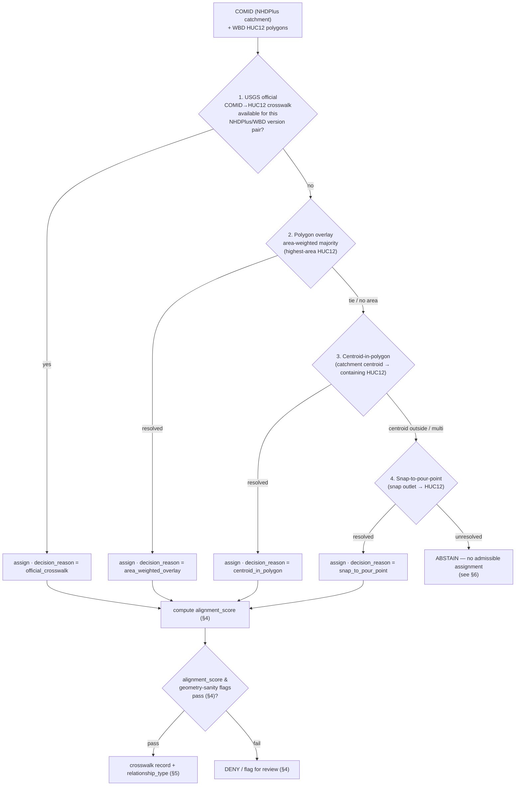

<!-- [KFM_META_BLOCK_V2]
doc_id: kfm://doc/domains/hydrology/crosswalk-rules
title: Hydrology — Crosswalk Rules
type: standard
version: v1
status: draft
owners: <hydrology-lane-steward> + <contract-schema-steward>   # NEEDS VERIFICATION: confirm CODEOWNERS
created: 2026-06-06
updated: 2026-06-06
policy_label: public
related:
  - docs/domains/hydrology/README.md
  - docs/domains/hydrology/ARCHITECTURE.md
  - docs/domains/hydrology/BOUNDARY.md
  - docs/domains/hydrology/CANONICAL_PATHS.md
  - directory-rules.md                                  # placement law (root file; docs/doctrine/ mirror is PROPOSED)
  - ai-build-operating-contract.md                      # CONTRACT_VERSION = "3.0.0"
  - schemas/contracts/v1/domains/hydrology/             # crosswalk + reach-identity schema home (ADR-0001)
  - policy/domains/hydrology/                           # admission / ambiguity-abstain policy
tags: [kfm, hydrology, crosswalk, identity, comid, huc12, nhdplus, reachidentity, governance]
notes:
  - "CONTRACT_VERSION = \"3.0.0\" pinned per ai-build-operating-contract.md v3.0."
  - "Canonical recipe is KFM-P5-PROG-0008 (fail-closed COMID->HUC12 crosswalk manifest)."
  - "Companion cards: KFM-P24-PROG-0036 (relationship_type enum), KFM-P24-PROG-0040 (split/merge disambiguation), KFM-P24-PROG-0041 (ambiguous-join ABSTAIN), KFM-P28-PROG-0008 (crosswalk schema)."
  - "Recipe is CONFIRMED lineage / PROPOSED implementation; all repo paths PROPOSED until a mounted repo verifies them."
  - "3DHP supersession of NHDPlus v2.1 is an open question the corpus does not resolve (OQ-HYD-XW-01)."
[/KFM_META_BLOCK_V2] -->

<a id="top"></a>

# 💧 Hydrology — Crosswalk Rules

> How the hydrology lane maps identities across hydrography sources — `COMID → HUC12`, NHDPlus HR ↔ legacy NHD, reach disambiguation — **deterministically, per release, fail-closed, and with explicit alignment scoring** — so that the most-used join keys in KFM never drift silently.

[](#)
[](#)
[](#)
[](#)
[](#)
[](#)
[](#)

**Status:** draft · **Owners:** `<hydrology-lane-steward>` + `<contract-schema-steward>` *(placeholders — NEEDS VERIFICATION)* · **Last updated:** 2026-06-06 · **`CONTRACT_VERSION = "3.0.0"`**

> [!IMPORTANT]
> **Repository not mounted in this session.** The crosswalk *recipe* is CONFIRMED lineage from the corpus (KFM-P5-PROG-0008 and companion cards); every repo path, schema file, policy rule, and threshold value is `PROPOSED` / `NEEDS VERIFICATION` until inspected against a mounted repo. Memory is not evidence. Thresholds quoted here (e.g., `alignment_score` cutoffs) are corpus design pressure and **subject to tuning** before they become enforced gates.

---

## Contents

1. [Purpose & scope](#1-purpose--scope)
2. [Why crosswalk discipline matters](#2-why-crosswalk-discipline-matters)
3. [The deterministic fallback ladder](#3-the-deterministic-fallback-ladder)
4. [Alignment scoring & geometry-sanity flags](#4-alignment-scoring--geometry-sanity-flags)
5. [Relationship typing — never assume one-to-one](#5-relationship-typing--never-assume-one-to-one)
6. [The ABSTAIN rule for ambiguous joins](#6-the-abstain-rule-for-ambiguous-joins)
7. [Identity keys & legacy compatibility](#7-identity-keys--legacy-compatibility)
8. [The crosswalk manifest](#8-the-crosswalk-manifest)
9. [Version drift & the 3DHP transition](#9-version-drift--the-3dhp-transition)
10. [Where crosswalk artifacts live](#10-where-crosswalk-artifacts-live)
11. [Validators, fixtures & the release gate](#11-validators-fixtures--the-release-gate)
12. [Open questions register](#12-open-questions-register)
13. [Open verification backlog](#13-open-verification-backlog)
14. [Changelog](#14-changelog)
15. [Definition of done](#15-definition-of-done)
16. [Related docs](#16-related-docs)

---

## 1. Purpose & scope

This document defines the **rules** by which the hydrology lane crosswalks identities between hydrography sources. Its anchor is the **fail-closed `COMID → HUC12` crosswalk** (corpus card **KFM-P5-PROG-0008**) plus the reach-identity and relationship-typing companions. It states *how a crosswalk is computed, scored, typed, signed, and gated* — not the field-by-field schema (that lives in `schemas/contracts/v1/domains/hydrology/`).

| In scope | Out of scope |
|---|---|
| The deterministic fallback ladder for `COMID → HUC12` | The full JSON Schema for crosswalk records (lives in `schemas/`) |
| Alignment scoring, geometry-sanity flags, DENY/ABSTAIN cutoffs | OPA rule source (lives in `policy/`) |
| `relationship_type` semantics and disambiguation rules | NHD/NHDPlus upstream documentation |
| The crosswalk manifest shape and signing | Connector fetch mechanics (lives in `connectors/`) |
| Version-drift handling and the 3DHP open question | Map rendering of crosswalk results (lives in `packages/maplibre-runtime/`) |

> [!NOTE]
> The recipe is **CONFIRMED lineage** (corpus, KFM-P5-PROG-0008) and **PROPOSED implementation**. This doc binds the rules; it does not assert that any of them is wired in the mounted repo.

[↑ Back to top](#top)

---

## 2. Why crosswalk discipline matters

> [!IMPORTANT]
> **Hydrography join keys are the most-used join keys in KFM.** If the `COMID → HUC12` join is non-deterministic or unstable, **every downstream layer drifts** — soil-by-watershed, agriculture water context, hazards flood context, the Frontier Matrix water-availability cells. A deterministic algorithm with explicit alignment scoring and a fixed fallback order makes the join reproducible across runs *and* across NHDPlus version pairs.

Three failure modes this doc exists to prevent:

1. **Silent non-determinism** — the same input producing different HUC12 assignments across runs because the fallback order or tie-breaking was unspecified.
2. **False confidence on a weak match** — a low-overlap or coastal/braided catchment assigned a single HUC12 as if it were exact.
3. **Forced one-to-one joins** — collapsing a `split` or `merge` relationship into a single edge, losing the ambiguity that downstream consumers need to see.

[↑ Back to top](#top)

---

## 3. The deterministic fallback ladder

`CONFIRMED` recipe (KFM-P5-PROG-0008). The crosswalk is computed **deterministically per release** with a **fixed fallback order**. Each rung is tried only if the rung above is unavailable or fails its sanity check; the rung used is recorded as `decision_reason` on the output record.



| Rung | Method | `decision_reason` token (PROPOSED) | When used |
|---|---|---|---|
| 1 | USGS official `COMID → HUC12` crosswalk | `official_crosswalk` | Available for the NHDPlus/WBD version pair — **preferred**. |
| 2 | Polygon overlay, area-weighted majority | `area_weighted_overlay` | No official crosswalk; assign the highest-area HUC12. |
| 3 | Centroid-in-polygon | `centroid_in_polygon` | Overlay tie or no usable area; assign the HUC12 containing the catchment centroid. |
| 4 | Snap-to-pour-point | `snap_to_pour_point` | Centroid outside or multi-HUC; snap the catchment outlet to a HUC12. |
| — | (none) | `abstain` | No rung yields an admissible assignment → [ABSTAIN](#6-the-abstain-rule-for-ambiguous-joins). |

> [!TIP]
> The order is **fixed and total**: determinism comes from always trying rungs top-down and recording which rung won. Two runs over the same inputs and the same version pair MUST produce the same `decision_reason` and the same assignment.

[↑ Back to top](#top)

---

## 4. Alignment scoring & geometry-sanity flags

Every assignment carries an explicit **`alignment_score`** and a set of **geometry-sanity flags**. These drive the DENY / ABSTAIN gate.

| Element | Meaning | Disposition |
|---|---|---|
| `alignment_score` | Numeric confidence in the assignment (e.g., area-overlap fraction for the overlay rung). | Carried on every record; thresholds gate publication. |
| `braided_geometry` flag | Catchment is part of a braided/anastomosing channel where a single HUC12 is not well-defined. | If set, a low score is *expected* and may still pass with the flag recorded. |
| `coastal` flag | Coastal/estuarine catchment where HUC12 coverage is partial. | Must be explicitly flagged; an *unflagged* coastal catchment is a negative-fixture case. |
| `multi_huc_candidate` flag | More than one HUC12 has substantial overlap (ranked candidate list retained). | Drives `split` relationship typing (§5) or ABSTAIN (§6). |
| `centroid_outside` flag | Catchment centroid falls outside any assigned HUC12. | Forces a lower rung and lowers the score. |

> [!CAUTION]
> **Threshold posture (corpus design pressure — `NEEDS VERIFICATION`, subject to tuning).** The corpus notes that **`alignment_score` below 0.5 *without* a `braided_geometry` flag is common in real data and triggers many DENYs**, and that the threshold "may need tuning." Treat the following as PROPOSED cutoffs to ratify by ADR, not as enforced constants:
>
> - `alignment_score ≥ 0.75` *(PROPOSED)* → assignment may pass without a flag.
> - `0.5 ≤ alignment_score < 0.75` *(PROPOSED)* → pass only with a recorded geometry flag, else `split`-typed or ABSTAIN.
> - `alignment_score < 0.5` *without* `braided_geometry` *(PROPOSED)* → **DENY** (flag for review).
>
> The exact cutoffs are an open question — see [OQ-HYD-XW-02](#12-open-questions-register).

[↑ Back to top](#top)

---

## 5. Relationship typing — never assume one-to-one

`CONFIRMED` recipe (KFM-P24-PROG-0036, KFM-P24-PROG-0040). A crosswalk record carries a **`relationship_type`** rather than assuming a one-to-one join. Split/merge cases require **geometry-overlap or reach-code disambiguation before the join is accepted**.

| `relationship_type` | Meaning | Acceptance rule |
|---|---|---|
| `exact` | One source identity maps cleanly to one target. | Standard acceptance once the alignment gate passes. |
| `split` | One source identity maps to multiple targets (e.g., a catchment spanning >1 HUC12). | Requires geometry-overlap evidence or reach-code disambiguation; retain the ranked `multi_huc_candidate` list. |
| `merge` | Multiple source identities map to one target. | Requires geometry-overlap or reach-code disambiguation before acceptance. |
| `retired` | The source identity has been retired with no clear replacement. | Not joinable as a live edge; see ABSTAIN (§6). |

> [!IMPORTANT]
> The crosswalk is **one-to-many with explicit ambiguity flags**, not one-to-one. Forcing a `split` or `merge` into a single edge silently discards the very ambiguity downstream consumers must be able to see. *(The corpus flags one-to-one-vs-one-to-many as a NEEDS VERIFICATION design decision — recorded here as the working posture, OQ-HYD-XW-03.)*

[↑ Back to top](#top)

---

## 6. The ABSTAIN rule for ambiguous joins

`CONFIRMED` recipe (KFM-P24-PROG-0041). This is the lane's most important crosswalk safeguard and aligns with the hydrology `ReachIdentity` doctrine that *identity ambiguity is classified, not collapsed*.

> [!WARNING]
> **If a hydrography crosswalk yields multiple unresolved matches, or a retired identifier without a clear replacement, the pipeline MUST `ABSTAIN`.** It does not guess, does not pick the first candidate, and does not force a match. An ABSTAIN is a finite, recorded outcome — not an error to be suppressed.

ABSTAIN triggers (each MUST be exercised by a negative fixture):

- Multiple unresolved candidate HUC12s after the full fallback ladder (`multi_huc_candidate` with no disambiguator).
- A `retired` source identifier with no clear replacement.
- Reach identity that cannot be resolved by geometry-overlap *or* reach-code.
- `alignment_score` below the ratified floor with no admissible geometry flag (this DENYs the assignment; the dependent join ABSTAINs).

The relationship to the lane's finite outcomes (operating contract §8 / §21.2): an ambiguous crosswalk surfaces as **`ABSTAIN`** at the runtime envelope and as a **`FAIL` / `HOLD`** at the promotion gate — never as a silent best-guess `ANSWER`.

[↑ Back to top](#top)

---

## 7. Identity keys & legacy compatibility

`CONFIRMED` recipe (KFM-P24-PROG-0037, KFM-P24-PROG-0038). Crosswalk records preserve stable identity and a legacy-key compatibility layer.

| Rule | Statement | Card |
|---|---|---|
| Canonical `kfm_id` | Hydrology features derive `kfm_id` from `nhdhr:` + Permanent Identifier when the permanent identifier is available. | KFM-P24-PROG-0037 |
| Legacy COMID layer | COMID is preserved as a `legacy_keys` compatibility field, not as the primary identity. | KFM-P24-PROG-0038 |
| Identity graph | Permanent IDs, legacy COMIDs, HUC12 units, reach codes, and source versions are represented as an identity graph with `EvidenceRef`s. | KFM-P24-PROG-0046 |
| HUC12 context retained | HUC12 is preserved in the crosswalk or related metadata to provide landscape context for joins. | KFM-P24-PROG-0045 |

[↑ Back to top](#top)

---

## 8. The crosswalk manifest

`CONFIRMED` recipe (KFM-P5-PROG-0008, KFM-P28-PROG-0008, KFM-P26-PROG-0026). Each crosswalk is emitted as a **DSSE-signed manifest** carrying both a descriptor `spec_hash` and a release content hash, plus the per-record fields below. Exact field names are `PROPOSED` until the schema is mounted.

```text
data/spatial/comid_huc12/<NHDPlus_version>/<WBD_version>/manifest.json   # PROPOSED path
```

| Field (PROPOSED) | Purpose |
|---|---|
| `schema_version` | Pins the crosswalk record schema. |
| `comid` / `permanent_identifier` | Source identity (legacy COMID + NHDHR permanent ID). |
| `huc12` | Target HUC12 assignment. |
| `relationship_type` | `exact` / `split` / `merge` / `retired` (§5). |
| `decision_reason` | Which fallback rung produced the assignment (§3). |
| `alignment_score` | Confidence score (§4). |
| geometry flags | `braided_geometry`, `coastal`, `multi_huc_candidate`, `centroid_outside` (§4). |
| `valid_time` | Temporal validity of the mapping. |
| `nhdplus_version`, `wbd_snapshot` | Snapshot pinning — the version pair the crosswalk was computed against. |
| `source_head` | The source descriptor / dataset head the run consumed. |
| `provenance` / `source_descriptor` linkage | `EvidenceRef` to the `SourceDescriptor`s. |
| `spec_hash` | Descriptor hash (deterministic over inputs + algorithm). |
| `run_receipt_id` | `EvidenceRef → RunReceipt` for the computing run. |
| release content hash | DSSE-signed hash over the released crosswalk content. |

> [!NOTE]
> **Snapshot pinning is mandatory.** The manifest path itself is keyed by `<NHDPlus_version>/<WBD_version>`; **do not silently mix** v2.1 / HR / WBD vintages within one crosswalk. Mixing vintages is a version-drift defect (§9).

For the related **HUC12 ↔ admin** crosswalk (KFM-P26-PROG-0026), the pair schema additionally requires `huc12_id`, `admin_id`, `admin_type`, `areas`, `overlap_m2`, `overlap_pct_huc`, `overlap_pct_admin`, `spec_hash`, and `run_receipt_id`.

[↑ Back to top](#top)

---

## 9. Version drift & the 3DHP transition

The crosswalk is computed **per version pair** and must handle source drift explicitly.

- **Version-drift handling** is part of the recipe: a crosswalk is valid only for the `<NHDPlus_version>/<WBD_version>` pair it was computed against. A new vintage requires a new computation, a new manifest, and a `CorrectionNotice` if it supersedes a published crosswalk.
- **Kansas-subset CI probing** exercises the algorithm on a Kansas subset every run, so drift is caught before a full-CONUS release.

> [!CAUTION]
> **Open question the corpus does not resolve.** When NHDPlus v2.1 is fully superseded by **3DHP**, does the crosswalk become `COMID → 3DHP universal_reference_id → HUC12`, or does HUC12 itself get superseded? The corpus explicitly leaves this `NEEDS VERIFICATION`. Until an ADR resolves it, treat any 3DHP-era crosswalk shape as `PROPOSED` and do not hard-code the two-hop assumption. See [OQ-HYD-XW-01](#12-open-questions-register).

[↑ Back to top](#top)

---

## 10. Where crosswalk artifacts live

The corpus card suggests a `tools/probes/comid_huc12/` + `data/spatial/comid_huc12/` layout. That predates the lane's responsibility-root convention, so the table below records **both** the card's suggested home and the Directory-Rules-aligned lane home, and flags the divergence.

| Concern | Card-suggested path (KFM-P5-PROG-0008) | Lane-pattern path (Directory Rules §12) | Status |
|---|---|---|---|
| Crosswalk compute / scoring / verify code | `tools/probes/comid_huc12/{compute_crosswalk.py, score_alignment.py, verify_manifest.py}` | `tools/validators/hydro/` or `packages/domains/hydrology/` (reusable) | PROPOSED — reconcile (OQ-HYD-XW-04) |
| Crosswalk manifest data | `data/spatial/comid_huc12/<NHDPlus>/<WBD>/manifest.json` | `data/processed/hydrology/...` → `data/catalog/domain/hydrology/` per lifecycle | PROPOSED — reconcile (OQ-HYD-XW-04) |
| Admissibility / ambiguity-abstain policy | `policy/spatial/comid_huc12.rego` | `policy/domains/hydrology/` | PROPOSED — reconcile (OQ-HYD-XW-04) |
| Positive / negative fixtures | `fixtures/spatial/comid_huc12/{positive/, negative/}` | `fixtures/domains/hydrology/{valid,invalid}/` | PROPOSED — reconcile (OQ-HYD-XW-04) |
| Crosswalk record schema | — | `schemas/contracts/v1/domains/hydrology/comid_huc12_crosswalk.schema.json` (ADR-0001) | PROPOSED |

> [!WARNING]
> **Path-home divergence (CONFLICTED until resolved).** The card's `*/spatial/comid_huc12/` paths and the Directory Rules §12 hydrology lane pattern (`*/domains/hydrology/`, `data/<phase>/hydrology/`) are **two competing homes** for the same artifacts. Per the placement law, a `COMID → HUC12` crosswalk is hydrology-owned lane content and SHOULD follow the lane pattern; the `spatial/` home would only apply if the crosswalk is treated as Spatial-Foundation-owned cross-cutting infrastructure. This requires an ADR — tracked as [OQ-HYD-XW-04](#12-open-questions-register). Until resolved, do not author the crosswalk under both homes.

[↑ Back to top](#top)

---

## 11. Validators, fixtures & the release gate

`CONFIRMED` recipe (KFM-P5-PROG-0008, KFM-P28-IDEA-0010, KFM-P24-PROG-0047). The crosswalk is enforceable only through validators, a negative-fixture set, and a release gate.

**Required negative fixtures** (each MUST fail closed):

| Fixture | What it proves |
|---|---|
| `missing_version` | A crosswalk without a pinned `nhdplus_version` / `wbd_snapshot` is rejected. |
| `low_alignment_no_braid` | `alignment_score` below the floor with no `braided_geometry` flag → DENY. |
| `coastal_unflagged` | A coastal catchment without the `coastal` flag is rejected. |
| `multi_huc_unresolved` | Multiple unresolved candidates with no disambiguator → ABSTAIN. |
| `retired_no_replacement` | A retired identifier with no clear replacement → ABSTAIN. |
| `duplicate_relationship` | Duplicate crosswalk relationships are caught (KFM-P24-PROG-0047). |

**Validator behavior** (KFM-P28-IDEA-0010): crosswalk artifacts carry schema validation, deterministic relationship typing, **warning gates**, and **fail-on-warning CLI behavior**.

> [!IMPORTANT]
> **Wire into Gate G.** Per the recipe, the crosswalk validator gates **any release that depends on the crosswalk** — it is a promotion-gate input (Gate G), not an advisory check. A release whose layers join on `COMID → HUC12` MUST NOT promote unless the crosswalk manifest passed its gate for the active version pair. Orchestration runs through `tools/validate_all.py` (orchestrator location is OPEN-DR-07, not settled here).

[↑ Back to top](#top)

---

## 12. Open questions register

| ID | Question | Owner role | Resolution path |
|---|---|---|---|
| OQ-HYD-XW-01 | When NHDPlus v2.1 is superseded by 3DHP, does the crosswalk become `COMID → 3DHP universal_reference_id → HUC12`, or is HUC12 itself superseded? | Hydrology lane steward + contract-schema steward | ADR; corpus does not resolve (KFM-P5-PROG-0008 open question). |
| OQ-HYD-XW-02 | Ratify the `alignment_score` thresholds (`< 0.5` DENY-without-braid; `≥ 0.75` clean pass) — corpus says they "may need tuning." | Validation steward | ADR + Kansas-subset calibration run. |
| OQ-HYD-XW-03 | Confirm crosswalk is one-to-many with explicit ambiguity flags (vs one-to-one). Corpus marks this NEEDS VERIFICATION (KFM-P2-PROG-0017). | Contract-schema steward | ADR; working posture is one-to-many. |
| OQ-HYD-XW-04 | Crosswalk artifact home: card's `*/spatial/comid_huc12/` vs Directory Rules §12 `*/domains/hydrology/` lane pattern. | Directory Rules owner + hydrology steward | ADR + `DRIFT_REGISTER.md` entry. |
| OQ-HYD-XW-05 | Canonical home of doctrine files (`directory-rules.md`, `ai-build-operating-contract.md`): repo root vs `docs/doctrine/`. | Docs steward | Mounted-repo inspection. |

[↑ Back to top](#top)

---

## 13. Open verification backlog

These items remain `NEEDS VERIFICATION` before promotion from `draft` to `published`:

1. The crosswalk compute/score/verify code exists at a ratified path (OQ-HYD-XW-04) with deterministic output.
2. `comid_huc12_crosswalk.schema.json` is authored under `schemas/contracts/v1/domains/hydrology/` (ADR-0001) with the §8 fields.
3. The ambiguity-ABSTAIN policy (`KFM-P24-PROG-0041`) is implemented as an enforced policy rule with the §11 negative fixtures.
4. `alignment_score` thresholds are ratified (OQ-HYD-XW-02) and encoded as constants, not prose.
5. The DSSE-signed manifest (spec_hash + release content hash) is emitted and verified per release.
6. Kansas-subset CI probing runs every crosswalk computation.
7. The crosswalk validator is wired into Gate G for any dependent release.
8. The 3DHP transition shape is resolved by ADR (OQ-HYD-XW-01).

[↑ Back to top](#top)

---

## 14. Changelog

| Change | Type (per contract §37) | Reason |
|---|---|---|
| Initial draft of `CROSSWALK_RULES.md` | new | No prior crosswalk-rules doc in the hydrology lane; recipe lived only as corpus cards. |
| Bound the recipe to KFM-P5-PROG-0008 + companion cards | gap closure | Makes the fail-closed crosswalk an explicit lane rule with stable card IDs. |
| Surfaced the `*/spatial/` vs `*/domains/hydrology/` path divergence | clarification | Path-home conflict requires an ADR (OQ-HYD-XW-04), not a silent pick. |
| Recorded `alignment_score` cutoffs as PROPOSED + tunable | clarification | Corpus explicitly flags the threshold as needing tuning; not asserted as constant. |

> **Backward compatibility.** New file; no anchors broken elsewhere. Internal anchors route to a stable `#top` (the leading 💧 changes the GitHub auto-anchor, so navigation uses `#top`).

[↑ Back to top](#top)

---

## 15. Definition of done

This document is done enough to enter the repository when:

- it is placed at `docs/domains/hydrology/CROSSWALK_RULES.md` per Directory Rules §12;
- the hydrology lane steward and contract-schema steward review it (validation steward reviews §4 thresholds);
- it is linked from `docs/domains/hydrology/README.md` and cross-referenced from `ARCHITECTURE.md` and `CANONICAL_PATHS.md`;
- it does not conflict with accepted ADRs (esp. the crosswalk-home ADR, OQ-HYD-XW-04, and the schema-home ADR-0001);
- the path-home divergence and threshold decisions are logged in `docs/registers/DRIFT_REGISTER.md` until resolved;
- a `GENERATED_RECEIPT.json` is wired into CI with `human_review.state` transitioning from `pending` to `approved`;
- future changes follow the operating contract's §37 lifecycle.

[↑ Back to top](#top)

---

## 16. Related docs

- [`docs/domains/hydrology/README.md`](./README.md) — hydrology domain README *(target; NEEDS VERIFICATION)*.
- [`docs/domains/hydrology/ARCHITECTURE.md`](./ARCHITECTURE.md) — lane architecture (identity crosswalk sits in the normalization stage).
- [`docs/domains/hydrology/BOUNDARY.md`](./BOUNDARY.md) — bounded-context owns / does-not-own + cross-lane edges.
- [`docs/domains/hydrology/CANONICAL_PATHS.md`](./CANONICAL_PATHS.md) — lane path index.
- `directory-rules.md` — §12 Domain Placement Law *(canonical path NEEDS VERIFICATION, OQ-HYD-XW-05)*.
- `ai-build-operating-contract.md` — `CONTRACT_VERSION = "3.0.0"`; §8 / §21.2 finite outcomes (ABSTAIN).
- [`schemas/contracts/v1/domains/hydrology/`](../../../schemas/contracts/v1/domains/hydrology/) — crosswalk + `ReachIdentity` schema home (ADR-0001) *(PROPOSED)*.
- [`policy/domains/hydrology/`](../../../policy/domains/hydrology/) — ambiguity-abstain / admission policy *(PROPOSED)*.
- [`docs/registers/DRIFT_REGISTER.md`](../../registers/DRIFT_REGISTER.md) — path-home + threshold divergence log *(verify)*.
- [`docs/registers/VERIFICATION_BACKLOG.md`](../../registers/VERIFICATION_BACKLOG.md) — cross-domain verification backlog.

---

<sub><strong>Last updated:</strong> 2026-06-06 · <strong>Doc id:</strong> <code>kfm://doc/domains/hydrology/crosswalk-rules</code> · <strong><code>CONTRACT_VERSION = "3.0.0"</code></strong> · <strong>Recipe:</strong> KFM-P5-PROG-0008 (CONFIRMED lineage / PROPOSED implementation) · <a href="#top">↑ Back to top</a></sub>
