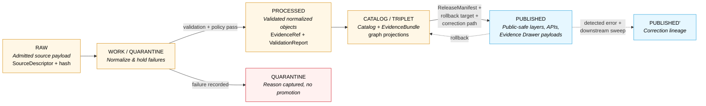
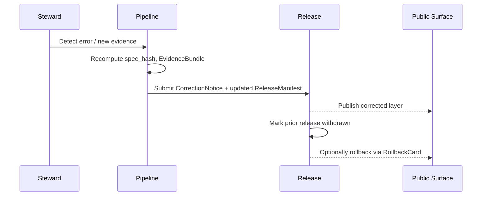

<!-- [KFM_META_BLOCK_V2]
doc_id: kfm://doc/hydrology-data-lifecycle
title: Hydrology — Data Lifecycle
type: standard
version: v1
status: draft
owners: TODO — hydrology lane stewards (placeholder)
created: 2026-05-17
updated: 2026-05-17
policy_label: public
related:
  - docs/doctrine/lifecycle-law.md
  - docs/doctrine/trust-membrane.md
  - directory-rules.md
  - docs/standards/PROV.md
  - docs/standards/ISO-19115.md
  - docs/standards/OGC-API-TILES.md
  - docs/standards/PMTILES.md
  - docs/standards/OAI-PMH.md
  - docs/domains/hydrology/README.md
tags: [kfm, domain, hydrology, lifecycle, governance]
notes:
  - Body claims labeled CONFIRMED doctrine / PROPOSED implementation per KFM truth posture.
  - Implementation-layer claims (paths, validators, CI) are PROPOSED pending mounted-repo verification.
[/KFM_META_BLOCK_V2] -->

# 💧 Hydrology — Data Lifecycle

> Governance, gates, and artifact homes for the hydrology lane as material moves from **RAW → WORK / QUARANTINE → PROCESSED → CATALOG / TRIPLET → PUBLISHED**.


<!-- TODO: replace with live CI / coverage / signing badges once published lane is wired. -->

**Status:** draft · **Owners:** TODO — hydrology lane stewards (placeholder) · **Last updated:** 2026-05-17

---

## Quick jump

- [1 · Purpose & scope](#1--purpose--scope)
- [2 · Lifecycle invariant (hydrology view)](#2--lifecycle-invariant-hydrology-view)
- [3 · Source families and source roles](#3--source-families-and-source-roles)
- [4 · Stage-by-stage handling](#4--stage-by-stage-handling)
- [5 · Promotion gates and required artifacts](#5--promotion-gates-and-required-artifacts)
- [6 · Artifact homes (path map)](#6--artifact-homes-path-map)
- [7 · Sensitivity, rights, and publication posture](#7--sensitivity-rights-and-publication-posture)
- [8 · Cross-lane interactions](#8--cross-lane-interactions)
- [9 · Validators, tests, fixtures](#9--validators-tests-fixtures)
- [10 · Correction and rollback](#10--correction-and-rollback)
- [11 · Thin-slice exemplar](#11--thin-slice-exemplar)
- [12 · Open questions & verification backlog](#12--open-questions--verification-backlog)
- [13 · Related docs](#13--related-docs)
- [Appendix A · Directory tree (hydrology lanes)](#appendix-a--directory-tree-hydrology-lanes)
- [Appendix B · Glossary (lifecycle subset)](#appendix-b--glossary-lifecycle-subset)

---

## 1 · Purpose & scope

**CONFIRMED doctrine.** This document specifies how hydrology material is admitted, normalized, validated, cataloged, and released inside the KFM lifecycle invariant — the same invariant that governs every KFM domain — and pins each transition to the artifacts and gates required for it to succeed (or to fail closed in a recorded, recoverable way).

The hydrology lane owns watersheds, HUC/WBD units, stream networks, water observations, waterbody/flowline identity, terrain-derived hydrology context, and flood-regulatory context. It explicitly does **not** own life-safety alerting, emergency instructions, hazards-as-event truth, or infrastructure exposure detail; those belong to the Hazards and Settlements/Infrastructure lanes and to the agencies that issue them in the first place.

> [!IMPORTANT]
> **Promotion is a governed state transition, not a file move.** A path-level move from `data/raw/hydrology/...` to `data/published/layers/hydrology/...` that bypasses validators, policy gates, EvidenceBundle creation, catalog closure, and a recorded release decision is a violation of the lifecycle invariant regardless of which directory the bytes ended up in.

**Truth posture.** Doctrine in this file is CONFIRMED where it is grounded in `directory-rules.md`, the *Domains Culmination Atlas v1.1* [DOM-HYD], the *Unified Implementation Architecture Build Manual*, and the *Domain & Capability Encyclopedia* [ENCY]. Implementation-layer claims — exact validator names, CI surface, mounted file presence, route names — are PROPOSED pending mounted-repo verification and are marked accordingly.

[Back to top](#-hydrology--data-lifecycle)

---

## 2 · Lifecycle invariant (hydrology view)

**CONFIRMED doctrine** [DIRRULES] [DOM-HYD] [ENCY]. The hydrology lane follows the KFM lifecycle invariant:

```text
RAW  →  WORK / QUARANTINE  →  PROCESSED  →  CATALOG / TRIPLET  →  PUBLISHED
```

Receipts, proofs, registry entries, and rollback targets are emitted **alongside** the lifecycle phases — they do not replace them.



> [!NOTE]
> The hydrology lane is repeatedly identified across KFM doctrine as the **first credible proof-bearing thin slice** — the lane that should exercise descriptor, evidence, policy, validation, catalog, release, correction, and rollback before broader domains are wired. See §11.

[Back to top](#-hydrology--data-lifecycle)

---

## 3 · Source families and source roles

**CONFIRMED doctrine / PROPOSED field realization** [DOM-HYD] [ENCY]. Every admitted hydrology source enters under a `SourceDescriptor` carrying identity, **role**, rights, sensitivity, cadence, citation, time, and a content hash. Source-role discipline is the first wall against the most consistent hydrology failure mode: collapsing **regulatory**, **observed**, **modeled**, and **administrative** flood/water material into one truth class.

| Source family | Permitted role(s) | Rights / sensitivity | Freshness | Notes |
|---|---|---|---|---|
| **USGS WBD / HUC12** | authority · context | NEEDS VERIFICATION (terms current) | source-vintage | Watershed boundary framework; HUC codes define drainage by surface flow topology. [DOM-HYD] [ENCY] |
| **NHDPlus HR / 3DHP-oriented hydrography** | authority · context · observation | NEEDS VERIFICATION | source-vintage | Flowlines, catchments, VAAs; pour-points and permanent IDs material to downstream stability. [DOM-HYD] [ENCY] |
| **USGS Water Data / NWIS (api.waterdata.usgs.gov)** | observation | NEEDS VERIFICATION | continuous / daily | Real-time and historical gauge observations; legacy WaterServices phasing out — version lock matters. [DOM-HYD] [ENCY] |
| **FEMA NFHL / MSC** | regulatory context **only** | NEEDS VERIFICATION | event-driven; tracked by `VERSION_ID`, `EFFECTIVE_DATE`, `DFIRM_ID` | **MUST NOT** be promoted as observed inundation or forecast. [DOM-HYD] [ENCY] |
| **3DEP terrain** | context · authority for elevation | NEEDS VERIFICATION | source-vintage | Terrain-derived hydrology; do not infer observation from derivation. [DOM-HYD] [ENCY] |
| **Water quality and groundwater sources** | observation · context | NEEDS VERIFICATION; sensitive joins fail closed | source-vintage or cadence specific | Source-role tag preserved on every record. [DOM-HYD] [ENCY] |
| **Historical observed flood evidence** | observation (with steward review) | NEEDS VERIFICATION | source-vintage | Distinct from regulatory NFHL; never collapsed. [DOM-HYD] [ENCY] |

> [!WARNING]
> **NFHL is regulatory context, not observed flood evidence.** NFHL/MSC layers are legally effective flood hazard data, not real-time inundation, climate projection, or hydraulic model output. The hydrology lane denies any promotion path that publishes NFHL content as an "observed flood event," "forecast," or "current inundation." This is a fail-closed invariant. [DOM-HYD] [ML-061-018] [ENCY]

PROPOSED descriptor surface (illustrative, not authoritative) — see `docs/sources/SOURCE_DESCRIPTOR_STANDARD.md` and ADR-0001 for the canonical schema home; field names below are NEEDS VERIFICATION against the mounted `SourceDescriptor` schema:

| Field | Vocabulary | Required when | Notes |
|---|---|---|---|
| `source_role` | `observed` \| `regulatory` \| `modeled` \| `aggregate` \| `administrative` \| `candidate` \| `synthetic` | always | Set at admission; corrections produce a new descriptor + `CorrectionNotice`. |
| `role_authority` | string | `regulatory` / `modeled` / `aggregate` | Issuing body or model identity. |
| `role_aggregation_unit` | geometry-scope token (`HUC12`, county, …) | `aggregate` | Prevents geometry-scope drift on join. |
| `role_model_run_ref` | `EvidenceRef → ModelRunReceipt` | `modeled` | Pins inputs, parameters, version. |
| `role_candidate_disposition` | `pending` \| `merged` \| `rejected` \| `quarantined` | `candidate` | PUBLISHED edge forbidden until merged. |

[Back to top](#-hydrology--data-lifecycle)

---

## 4 · Stage-by-stage handling

Each row below restates the **CONFIRMED doctrine** for the stage and notes the **PROPOSED implementation** specifics for the hydrology lane. Implementation specifics remain PROPOSED until mounted-repo evidence verifies them.

### 4.1 RAW — `data/raw/hydrology/<source_id>/<run_id>/`

**Handling.** Capture the immutable source payload (or reference, for very large or licensed material) together with source role, rights, sensitivity, citation, time, and content hash. [DOM-HYD §H] [DIRRULES §9.1]

**PROPOSED hydrology specifics.**
- WBD/HUC layers admitted by HUC level (HUC12 first); pour-points and permanent IDs preserved verbatim. [New Ideas 5-8]
- NWIS observations admitted with full provider station/series IDs (`provider:station_id:source_series_id`) so downstream feature identity remains stable across refreshes. [ML-062-019]
- NFHL admitted as **regulatory** with `VERSION_ID`, `EFFECTIVE_DATE`, `DFIRM_ID` preserved; observed-event role explicitly disallowed. [ML-061-018] [DOM-HYD §I]
- HEAD checks (`ETag`, `Last-Modified`, `Content-Length`) captured into `source_head` for low-cost change detection; 304/no-change responses do **not** mint new catalog entities. [New Ideas 5-10] [ML-062-020]

### 4.2 WORK / QUARANTINE — `data/work/hydrology/<run_id>/`, `data/quarantine/hydrology/<reason>/<run_id>/`

**Handling.** Normalize schema, geometry, time, identity, evidence, rights, and policy. Material that fails any precondition moves to QUARANTINE **with a recorded reason**; it does not silently promote. [DIRRULES §9.1] [DOM-HYD §H]

**PROPOSED hydrology specifics.**
- HUC12 fingerprint validation (12-digit code, polygon hash, geometry validity). [DOM-HYD §K] [New Ideas 5-8]
- NHDPlus → WBD identity work follows a deterministic crosswalk fallback order: **official USGS crosswalk → area-weighted polygon overlay → centroid-in-polygon (heuristic, recorded) → snap-to-outlet/pour-point with PRNG-seed receipt for ties**. Each row carries a `decision_reason` and `alignment_score`. [New Ideas 5-8]
- NWIS observations normalized against parameter, unit, qualifier, and no-data conventions; failures quarantine with structured reasons. [DOM-HYD §K]
- NFHL role-separation tests run in WORK; any record tagged as observed inundation is sent to QUARANTINE with reason `nfhl_role_misuse`. [DOM-HYD §K]

### 4.3 PROCESSED — `data/processed/hydrology/<dataset_id>/<version>/`

**Handling.** Emit validated normalized objects, receipts, and public-safe candidates. `EvidenceRef`, `ValidationReport`, and digest closure must exist before the artifact is eligible for catalog closure. [DOM-HYD §H] [DIRRULES §9.1]

**PROPOSED hydrology specifics.**
- Object families emitted in this phase: `Watershed`, `HUCUnit`, `HydroFeature`, `NFHLZone` (with `source_role = regulatory`), `Observed Flood Event` (only when an admissible observed source supports it), `Flood Context`. Identity rule: `source id + object role + temporal scope + normalized digest`. [DOM-HYD §E]
- Time fields kept distinct where material: **source time**, **observed time**, **valid time**, **retrieval time**, **release time**, and **correction time**. [DOM-HYD §E]
- `TransformReceipt`, `ValidationReport`, and (when sensitivity applies) `RedactionReceipt` written to the receipts/proofs lanes (§6).

### 4.4 CATALOG / TRIPLET — `data/catalog/domain/hydrology/`, `data/triplets/graph_deltas/` (cross-domain)

**Handling.** Emit catalog records, `EvidenceBundle`s, graph/triplet projections, and release candidates. Catalog/proof closure must pass before release is even attempted. [DOM-HYD §H] [DIRRULES §9.1]

**PROPOSED hydrology specifics.**
- KFM STAC profile enforced on hydrology catalog entries; DCAT + PROV records emitted alongside. [ML-062-023]
- `EvidenceBundle` closure exercised here: every consequential claim resolves through `EvidenceRef → EvidenceBundle` before any public-edge consumer sees it. [DOM-HYD §K] [ENCY]
- Graph projections (CIDOC-CRM / PROV-O) round-trip with the originating `RunReceipt`; an unresolved `EvidenceRef` is an abstain condition, not a render condition. [C8-04] [ENCY]

### 4.5 PUBLISHED — `data/published/layers/hydrology/`, governed APIs

**Handling.** Serve only released, public-safe artifacts through governed APIs and manifests. `ReleaseManifest`, correction path, rollback target, and review/policy state must exist. [DOM-HYD §H] [DIRRULES §9.1]

**PROPOSED hydrology specifics.**
- Public viewing products: HUC12 watershed view; gauge/site time-series; hydrograph; **regulatory** flood-context layer (labeled NFHL, with `EFFECTIVE_DATE`); **observed** flood-event layer (only when supported by an observed source); terrain-derived hydrology layer; Evidence Drawer payloads. [DOM-HYD §G]
- Public clients consume hydrology through `apps/governed-api/` only — never directly through `data/processed/` or `data/catalog/`. [DIRRULES §13.5 — trust membrane]
- Stale-source badges, generalized geometry for sensitive joins, and `ABSTAIN` on ambiguous reach identity are all visible UI states; they are not silently hidden. [MAP-MASTER] [GAI]

[Back to top](#-hydrology--data-lifecycle)

---

## 5 · Promotion gates and required artifacts

**CONFIRMED doctrine** [DIRRULES] [ENCY §24.6.1] [BLD-GREEN §§16, 19, 24]. Each transition is a **promotion gate** with a structured precondition, a minimum required artifact set, and a fail-closed outcome.

| Transition | Pre-condition | Required artifacts (PROPOSED minimum) | Fail-closed outcome |
|---|---|---|---|
| `— → RAW` (Admission) | Source identity, rights minimally established; source-role intent set. | `SourceDescriptor` (role, authority, rights, sensitivity, cadence); payload-or-reference hash. | Not admitted; logged as candidate awaiting steward review. |
| `RAW → WORK / QUARANTINE` (Normalization) | Schema, geometry, time, identity, evidence, rights, and policy rules are runnable. | `TransformReceipt`; `ValidationReport` (working set); `PolicyDecision`; `QUARANTINE` reason if any rule fails. | Quarantine with reason; never silently promotes. |
| `WORK → PROCESSED` (Validation) | Validators are deterministic and tied to fixtures; required receipts present. | `ValidationReport` pass; `RedactionReceipt` if sensitivity applies; `AggregationReceipt` where applicable. | Stay in WORK; structured FAIL outcome. |
| `PROCESSED → CATALOG / TRIPLET` (Catalog closure) | `EvidenceRef`s resolve; catalog matrix and digests close. | `CatalogMatrix` entry; `EvidenceBundle`; graph/triplet projections if applicable. | HOLD at PROCESSED; structured FAIL; **no public edge**. |
| `CATALOG / TRIPLET → PUBLISHED` (Release) | Review state where required; release authority distinct from original author when materiality applies. | `ReleaseManifest`; rollback target; correction path; `ReviewRecord` (if required). | HOLD at CATALOG; **no public surface change**. |
| `PUBLISHED → PUBLISHED'` (Correction) | Detected error or new evidence; downstream derivatives identified. | `CorrectionNotice`; updated `ReleaseManifest`; downstream invalidation receipts. | Prior release withdrawable via `RollbackCard`. |

> [!CAUTION]
> **Default-deny promotion.** Promotion is denied unless `spec_hash` recomputes; the run receipt is signed and verifiable (DSSE / cosign or equivalent); rights are in an allowlist; at least one attestation bundle is published; **and** every dataset-quality check passes. Absence of evidence blocks promotion. [C5-02] [BLD-GREEN §§16, 24]

**Gate family ↔ default failure** (for quick reference):

| Gate family | Must answer | Default failure |
|---|---|---|
| Shape gate | Does the object match its schema and required version? | `ERROR` / quarantine |
| Meaning gate | Does it conform to contract and vocabulary? | `ERROR` / review |
| Source gate | Are source role, rights, cadence, sensitivity known? | `DENY` / quarantine |
| Evidence gate | Do `EvidenceRef`s resolve to `EvidenceBundle`? | `ABSTAIN` |
| Policy gate | Is exposure allowed for this user, purpose, release class? | `DENY` |
| Lifecycle gate | Is object in correct `RAW → PUBLISHED` state? | `DENY` |
| Receipt gate | Are `RunReceipt` / `PromotionReceipt` / decision logs present? | `ERROR` |
| Release gate | Does manifest include proof, correction, rollback? | `HOLD` / `DENY` |

[Back to top](#-hydrology--data-lifecycle)

---

## 6 · Artifact homes (path map)

**CONFIRMED doctrine** [DIRRULES §§3–4, §9.1, §12]. Hydrology files live in **lanes inside responsibility roots** — hydrology is never a root folder. Implementation file presence at the paths below is PROPOSED / NEEDS VERIFICATION pending mounted-repo inspection.

| Artifact / responsibility | Canonical home (PROPOSED) |
|---|---|
| This document & domain prose | `docs/domains/hydrology/` |
| Object meaning (contracts) | `contracts/domains/hydrology/` |
| Machine shape (schemas) | `schemas/contracts/v1/domains/hydrology/` (per ADR-0001) |
| Allow / deny / restrict / abstain (policy) | `policy/domains/hydrology/` |
| Enforcement proofs (tests) | `tests/domains/hydrology/` |
| Golden / valid / invalid fixtures | `fixtures/domains/hydrology/` |
| Reusable hydrology code | `packages/domains/hydrology/` |
| Executable pipeline logic | `pipelines/domains/hydrology/` *(or topical pipelines under `pipelines/ingest`, `pipelines/normalize`, etc.)* |
| Declarative pipeline configuration | `pipeline_specs/hydrology/` |
| Source-specific fetchers | `connectors/usgs/`, `connectors/fema/`, `connectors/noaa/`, etc. — output to `data/raw/hydrology/...` or `data/quarantine/...` only |
| **RAW** lifecycle data | `data/raw/hydrology/<source_id>/<run_id>/` |
| **WORK** lifecycle data | `data/work/hydrology/<run_id>/` |
| **QUARANTINE** lifecycle data | `data/quarantine/hydrology/<reason>/<run_id>/` |
| **PROCESSED** lifecycle data | `data/processed/hydrology/<dataset_id>/<version>/` |
| **CATALOG** records | `data/catalog/domain/hydrology/` (+ `data/catalog/stac/`, `data/catalog/dcat/`, `data/catalog/prov/`) |
| **TRIPLET** graph projections | `data/triplets/graph_deltas/`, `data/triplets/exports/` *(cross-domain home, not domain-segmented)* |
| **PUBLISHED** layers | `data/published/layers/hydrology/` (`pmtiles/`, `geoparquet/` siblings as applicable) |
| Source registry entries | `data/registry/sources/hydrology/` |
| Receipts (ingest / validation / pipeline / ai / release) | `data/receipts/...` |
| Proofs (`EvidenceBundle`, `ProofPack`, `ValidationReport`, `CitationValidationReport`) | `data/proofs/...` |
| Release decisions, manifests, rollback cards, correction notices | `release/candidates/hydrology/`, `release/manifests/`, `release/rollback_cards/`, `release/correction_notices/` |
| Rollback receipts (data plane) | `data/rollback/hydrology/<release_id>/` |

> [!NOTE]
> Cross-domain hydrology files (e.g., a habitat × fauna × hydrology validator) live under the **lowest common responsibility root** without a domain segment — for example `tools/validators/<topic>/...`, not `tools/validators/domains/hydrology/...`. [DIRRULES §12]

[Back to top](#-hydrology--data-lifecycle)

---

## 7 · Sensitivity, rights, and publication posture

**CONFIRMED doctrine / PROPOSED enforcement** [DOM-HYD §I] [ENCY §20.5] [DIRRULES]. Hydrology is generally public-suitable when released, but the lane fails closed on a specific, named set of conditions.

| Condition | Action | Why |
|---|---|---|
| Unclear rights on a source | `DENY` public promotion | Unresolved rights block public surface. [ENCY] [DIRRULES] |
| NFHL content tagged as observed inundation | `DENY` publication; quarantine | NFHL is regulatory, not observed. [DOM-HYD] [ML-061-018] |
| KFM cited as life-safety alert authority | `DENY` | Hazards & official agencies own life-safety. [DOM-HYD] [DOM-HAZ] |
| Infrastructure / private-property implications | Require steward review + public-safe generalization | Avoid asset-exposure leakage. [DOM-HYD] [DOM-SETTLE] |
| Unresolved source role | `DENY` / quarantine | Cite-or-abstain default. [ENCY] |
| Missing or unresolved `EvidenceRef` | `ABSTAIN` at public surface | Evidence gate. [GAI] [ENCY] |
| Stale source head (ETag / `Last-Modified` past freshness window) | `ABSTAIN` + stale badge; no silent publish | Freshness discipline. [ML-062-021] |

> [!WARNING]
> **Emergency-alert boundary.** KFM is not an emergency alert authority. Hydrology and Hazards surfaces must redirect life-safety action to official sources (NWS, state EM, county EM). UI surfaces that drift toward "current inundation," "active warning," or "evacuation guidance" are out of policy for this lane and must be reviewed before merge. [ENCY §20.4] [DOM-HAZ]

[Back to top](#-hydrology--data-lifecycle)

---

## 8 · Cross-lane interactions

**CONFIRMED / PROPOSED** [DOM-HYD §F]. Cross-lane relations must preserve ownership, source role, sensitivity, and `EvidenceBundle` support — they do not transfer authority.

| Hydrology → | Relation | Constraint |
|---|---|---|
| **Hazards** | flood, drought, warning, declaration, resilience context | Regulatory ≠ observed; hazards owns event truth; hydrology supplies context. |
| **Soil** | soil moisture, hydrologic group (HSG), infiltration, runoff | Hydrology does not own SSURGO components. |
| **Agriculture** | irrigation, drought stress, crop-water context | Crop and yield claims belong to Agriculture. |
| **Settlements / Infrastructure** | floodplain, bridges, dams, utilities, exposure context | Public-safe generalization required; deny precise asset exposure. |
| **Spatial Foundation** | CRS, geometry validation, base layers | Cartographic conventions inherited from the foundation lane. |

[Back to top](#-hydrology--data-lifecycle)

---

## 9 · Validators, tests, fixtures

**PROPOSED** [DOM-HYD §K] [New Ideas 5-8] [ENCY]. Validator names below are working titles pending mounted-repo verification of `tools/validators/...` placement.

- HUC12 fingerprint validation (12-digit code, polygon hash, geometry validity).
- NHDPlus HR identity ambiguity tests with finite outcomes: `ANSWER` (valid authoritative mapping) · `ABSTAIN` (no defensible mapping) · `DENY` (policy/sensitivity restriction) · `ERROR` (structural / runtime failure).
- USGS NWIS parameter / unit / qualifier / no-data normalization tests.
- NFHL role-separation tests (`regulatory` MUST NOT promote to `observed`).
- `EvidenceBundle` closure tests (every consequential claim resolves; orphan refs fail closed).
- No-network hydrology proof fixture: HUC/WBD fixture + one USGS gauge fixture + one NHDPlus crosswalk fixture + one NFHL contextual fixture + hydrograph panel.
- Stale-source fixture: old `ETag` / `Last-Modified` triggers `ABSTAIN` or stale badge, not silent publication.
- Sensitive-geometry deny fixture: precise sensitive asset coordinate cannot publish or render publicly.
- 304 / no-change poll fixture: confirmed no-change responses **do not** mint new STAC/DCAT/PROV entities. [ML-062-020]

**PROPOSED fail-closed promotion rules** [New Ideas 5-10]:

| Condition | Action |
|---|---|
| Missing `decision_id` | `DENY` |
| Missing `attestation_ref` | `QUARANTINE` |
| Invalid `spec_hash` | `DENY` |
| Unresolved conflict | `NEEDS_REVIEW` |
| Missing provenance refs | `QUARANTINE` |
| Invalid prior lineage | `DENY` |
| Stale evidence | `QUARANTINE` |
| Unknown rights / sensitivity | `DENY` |
| Orphaned supersede chain | `DENY` |

[Back to top](#-hydrology--data-lifecycle)

---

## 10 · Correction and rollback

**CONFIRMED doctrine / PROPOSED implementation** [DOM-HYD §M] [ENCY Appendix E].

Hydrology publication requires, at minimum:

1. A signed `ReleaseManifest` referencing the catalog entries and `EvidenceBundle`s being published.
2. A named **correction path** — how a published claim is corrected without losing the original.
3. A named **rollback target** — the prior `ReleaseManifest` / root hash / tile checksum set the release can revert to.
4. A `RollbackCard` exercised at least once before the release is treated as production-ready.
5. A `ReviewRecord` when materiality requires release-author / release-authority separation.

**Tier transitions.** Promotions toward more public surface require **both** a transform receipt and a review record; demotions toward less public surface require only a `CorrectionNotice`. Correction always precedes derivative invalidation. [ENCY §24.6.1 reading note]



[Back to top](#-hydrology--data-lifecycle)

---

## 11 · Thin-slice exemplar

**CONFIRMED doctrine / PROPOSED implementation** [ENCY] [DOM-HYD §G] [DOM-HF pattern].

The hydrology proof-bearing thin slice exists to exercise the **whole** lifecycle end-to-end on a small AOI before broadening:

> **Kansas HUC12 + one USGS gauge fixture + one NHDPlus identity crosswalk + NFHL contextual overlay + hydrograph panel + `EvidenceBundle` closure + `ABSTAIN` on ambiguous reach identity.**

A thin slice is judged by **closure**, not coverage. It passes when:

- A `SourceDescriptor` exists for every admitted source.
- Validators run with finite outcomes and recorded receipts.
- An `EvidenceBundle` resolves for the public-edge claim.
- A `PolicyDecision` is recorded with reasons.
- A `ReleaseManifest` exists with a rollback target.
- An `ABSTAIN` path is exercised on the ambiguous-reach case — not papered over.

[Back to top](#-hydrology--data-lifecycle)

---

## 12 · Open questions & verification backlog

| Item | Evidence that would settle it | Status |
|---|---|---|
| Exact validator file homes under `tools/validators/hydro/` vs `tools/validators/domains/hydrology/` | Mounted-repo file tree; ADR-0001 confirmation | NEEDS VERIFICATION |
| Validator exit-code contract (which conditions return which non-zero codes) | ADR + reference validator | NEEDS VERIFICATION |
| `PROV.md` vs `PROVENANCE.md` standard naming for the provenance profile | ADR resolution | OPEN (cross-doc inconsistency flagged elsewhere) |
| Runbook subfolder convention (e.g., `docs/runbooks/hydrology/` vs flat-prefix naming) | ADR + repo evidence | OPEN |
| Hydrology API routes and DTOs (`HydrologyDecisionEnvelope`, layer manifest resolver, Evidence Drawer payload) | Mounted-repo `apps/governed-api/` + `schemas/contracts/v1/` | UNKNOWN |
| MapLibre hydrology layer adapter binding (release manifest → tileset) | Mounted-repo `packages/maplibre/` + `data/published/layers/hydrology/` | NEEDS VERIFICATION |
| CI execution of hydrology fixtures and policy gates | Workflow files + recent run logs | UNKNOWN |
| Current NWIS endpoint status given the 2026/2027 legacy WaterServices phase-out | Source-head probe + descriptor freshness check | NEEDS VERIFICATION |
| Whether `triplets/` is plural (current doc) or singular `triplet/` in the mounted repo | ADR resolution per `directory-rules.md` §18 | OPEN |
| Authority for hydrology lane stewards listed in the meta block | Project ownership register | TODO — placeholder owners |

[Back to top](#-hydrology--data-lifecycle)

---

## 13 · Related docs

- [`directory-rules.md`](../../../directory-rules.md) — placement law, lifecycle invariant, anti-patterns.
- [`docs/doctrine/lifecycle-law.md`](../../doctrine/lifecycle-law.md) — RAW → PUBLISHED invariant (canonical).
- [`docs/doctrine/trust-membrane.md`](../../doctrine/trust-membrane.md) — public surface boundary.
- [`docs/standards/PROV.md`](../../standards/PROV.md) — W3C PROV-O / PAV profile.
- [`docs/standards/ISO-19115.md`](../../standards/ISO-19115.md) — geospatial metadata crosswalk.
- [`docs/standards/PMTILES.md`](../../standards/PMTILES.md) — tile artifact governance.
- [`docs/standards/OGC-API-TILES.md`](../../standards/OGC-API-TILES.md) — delivery profile.
- [`docs/standards/OAI-PMH.md`](../../standards/OAI-PMH.md) — archival harvest profile.
- [`docs/sources/SOURCE_DESCRIPTOR_STANDARD.md`](../../sources/SOURCE_DESCRIPTOR_STANDARD.md) — `SourceDescriptor` schema home (PROPOSED canonical).
- [`docs/domains/hydrology/README.md`](./README.md) — domain landing.
- [`docs/runbooks/`](../../runbooks/) — operational procedures (rollback drills, validation runs).

<!-- TODO: re-check every link path against the mounted repo and add ADR cross-links once available. -->

[Back to top](#-hydrology--data-lifecycle)

---

## Appendix A · Directory tree (hydrology lanes)

**PROPOSED** [DIRRULES §12]. The full hydrology footprint across responsibility roots. File presence is NEEDS VERIFICATION pending mounted-repo inspection.

<details>
<summary>Show the full hydrology lane pattern</summary>

```text
docs/domains/hydrology/
contracts/domains/hydrology/
schemas/contracts/v1/domains/hydrology/
policy/domains/hydrology/
tests/domains/hydrology/
fixtures/domains/hydrology/
packages/domains/hydrology/
pipelines/domains/hydrology/     # or pipelines/ingest|normalize|catalog|publish lanes touching hydrology
pipeline_specs/hydrology/
data/raw/hydrology/<source_id>/<run_id>/
data/work/hydrology/<run_id>/
data/quarantine/hydrology/<reason>/<run_id>/
data/processed/hydrology/<dataset_id>/<version>/
data/catalog/domain/hydrology/
data/published/layers/hydrology/
data/registry/sources/hydrology/
data/rollback/hydrology/<release_id>/
release/candidates/hydrology/
```

</details>

[Back to top](#-hydrology--data-lifecycle)

---

## Appendix B · Glossary (lifecycle subset)

<details>
<summary>Show glossary</summary>

| Term | Short definition |
|---|---|
| **Lifecycle invariant** | `RAW → WORK / QUARANTINE → PROCESSED → CATALOG / TRIPLET → PUBLISHED`. |
| **Promotion** | Governed state transition between lifecycle phases. Not a file move. |
| **Trust membrane** | The boundary preventing raw / unreviewed / model-generated / internal state from becoming public truth. Operational form: `apps/governed-api/`. |
| **SourceDescriptor** | Record of source identity, role, rights, sensitivity, cadence, endpoint, version, `source_head`. |
| **EvidenceRef / EvidenceBundle** | Pointer (`EvidenceRef`) and its resolved support package (`EvidenceBundle`). Public claims require resolution. |
| **RunReceipt** | Process memory: inputs, outputs, hashes, commit, image, signature. Does not make a claim true. |
| **PromotionDecision** | Gate result with proofs, release target, rollback target, reviewer. |
| **ReleaseManifest** | Release decision artifact; canonical home `release/manifests/`. |
| **RollbackCard** | Rollback decision + drill; canonical home `release/rollback_cards/`. |
| **CorrectionNotice** | Public notice of corrected claim; canonical home `release/correction_notices/`. |
| **ValidationReport** | Pass/fail validator output tied to deterministic fixtures. |
| **RedactionReceipt** | Record of a public-safe field/geometry transformation. |
| **CitationValidationReport** | Citation-closure object for Focus Mode, exports, popups. |
| **NFHLZone** | FEMA NFHL flood hazard area object; `source_role = regulatory` only. |
| **Observed Flood Event** | Hydrology object backed by an admissible observed source; never NFHL-derived. |
| **HUCUnit** | WBD hydrologic unit (e.g., HUC12). |
| **HydroFeature** | Generic hydrology feature (waterbody, flowline, gauge site, well). |

</details>

[Back to top](#-hydrology--data-lifecycle)

---

**Last updated:** 2026-05-17 · **Status:** draft · **Lane:** hydrology · **Lifecycle:** RAW → PUBLISHED · **Trust posture:** cite-or-abstain · **Default:** deny-by-default

[⬆ Back to top](#-hydrology--data-lifecycle)
