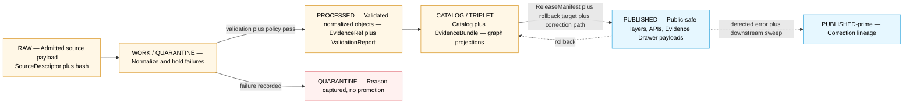
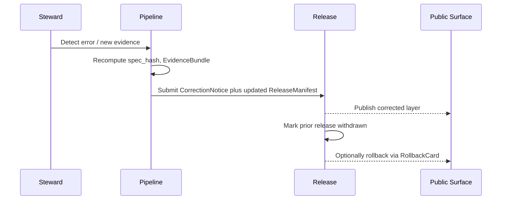

<!-- [KFM_META_BLOCK_V2]
doc_id: kfm://doc/hydrology-data-lifecycle
title: Hydrology — Data Lifecycle
type: standard
version: v2
status: draft
owners: TODO — hydrology lane stewards (placeholder; resolve via project ownership register)
created: 2026-05-17
updated: 2026-06-06
policy_label: public
contract_version: "3.0.0"   # pinned per ai-build-operating-contract.md v3.0
related:
  - ai-build-operating-contract.md            # canonical operating contract (CONTRACT_VERSION 3.0.0)
  - directory-rules.md
  - docs/doctrine/lifecycle-law.md
  - docs/doctrine/trust-membrane.md
  - docs/standards/PROV.md
  - docs/standards/ISO-19115.md
  - docs/standards/OGC-API-TILES.md
  - docs/standards/PMTILES.md
  - docs/standards/OAI-PMH.md
  - docs/domains/hydrology/README.md
tags: [kfm, domain, hydrology, lifecycle, governance]
notes:
  - Body claims labeled CONFIRMED doctrine / PROPOSED implementation per KFM truth posture.
  - Implementation-layer claims (paths, validators, CI) are PROPOSED pending mounted-repo verification.
  - v2 reconciles SourceDescriptor schema home, promotion-gate finite-outcome set, and ADR references against Atlas v1.1 + Directory Rules + Operating Contract v3.0. See Changelog.
[/KFM_META_BLOCK_V2] -->

# 💧 Hydrology — Data Lifecycle

> Governance, gates, and artifact homes for the hydrology lane as material moves from **RAW → WORK / QUARANTINE → PROCESSED → CATALOG / TRIPLET → PUBLISHED**.


<!-- TODO: replace with live CI / coverage / signing badges once the published lane is wired. -->

**Status:** draft · **Owners:** TODO — hydrology lane stewards (placeholder) · **Contract:** `CONTRACT_VERSION = "3.0.0"` · **Last updated:** 2026-06-06

---

## Quick jump

- [1 · Purpose & scope](#1--purpose--scope)
- [2 · Lifecycle invariant (hydrology view)](#2--lifecycle-invariant-hydrology-view)
- [3 · Source families and source roles](#3--source-families-and-source-roles)
- [4 · Stage-by-stage handling](#4--stage-by-stage-handling)
- [5 · Promotion gates and required artifacts](#5--promotion-gates-and-required-artifacts)
- [6 · Artifact homes (path map)](#6--artifact-homes-path-map)
- [7 · Sensitivity, rights, and publication posture](#7--sensitivity-rights-and-publication-posture)
- [8 · Cross-lane interactions](#8--cross-lane-interactions)
- [9 · Validators, tests, fixtures](#9--validators-tests-fixtures)
- [10 · Correction and rollback](#10--correction-and-rollback)
- [11 · Thin-slice exemplar](#11--thin-slice-exemplar)
- [12 · Open questions register](#12--open-questions-register)
- [13 · Open verification backlog](#13--open-verification-backlog)
- [14 · Changelog](#14--changelog-v1--v2)
- [15 · Definition of done](#15--definition-of-done)
- [16 · Related docs](#16--related-docs)
- [Appendix A · Directory tree (hydrology lanes)](#appendix-a--directory-tree-hydrology-lanes)
- [Appendix B · Glossary (lifecycle subset)](#appendix-b--glossary-lifecycle-subset)

---

## 1 · Purpose & scope

**CONFIRMED doctrine.** This document specifies how hydrology material is admitted, normalized, validated, cataloged, and released inside the KFM lifecycle invariant — the same invariant that governs every KFM domain — and pins each transition to the artifacts and gates required for it to succeed (or to fail closed in a recorded, recoverable way).

The hydrology lane owns watersheds, HUC/WBD units, stream networks, water observations, waterbody/flowline identity, terrain-derived hydrology context, and flood-regulatory context. It explicitly does **not** own life-safety alerting, emergency instructions, hazards-as-event truth, or infrastructure exposure detail; those belong to the Hazards and Settlements/Infrastructure lanes and to the agencies that issue them in the first place.

> [!IMPORTANT]
> **Promotion is a governed state transition, not a file move.** A path-level move from `data/raw/hydrology/...` to `data/published/layers/hydrology/...` that bypasses validators, policy gates, EvidenceBundle creation, catalog closure, and a recorded release decision is a violation of the lifecycle invariant regardless of which directory the bytes ended up in. [DIRRULES]

**Truth posture.** Doctrine in this file is CONFIRMED where it is grounded in `directory-rules.md`, the *Domains Culmination Atlas v1.1* [DOM-HYD], the *AI Build Operating Contract v3.0* [AIBOC], and the *Domain & Capability Encyclopedia* [ENCY]. Implementation-layer claims — exact validator names, CI surface, mounted file presence, route names — are PROPOSED pending mounted-repo verification and are marked accordingly. This session exposed **doctrine documents only, not a mounted repo**; no statement here asserts current repo implementation depth.

[Back to top](#-hydrology--data-lifecycle)

---

## 2 · Lifecycle invariant (hydrology view)

**CONFIRMED doctrine** [DIRRULES] [DOM-HYD] [ENCY]. The hydrology lane follows the KFM lifecycle invariant:

```text
RAW  →  WORK / QUARANTINE  →  PROCESSED  →  CATALOG / TRIPLET  →  PUBLISHED
```

Receipts, proofs, registry entries, and rollback targets are emitted **alongside** the lifecycle phases — they do not replace them. [DIRRULES §4 Step 2]



> [!NOTE]
> The hydrology lane is repeatedly identified across KFM doctrine as the **first credible proof-bearing thin slice** — the lane that should exercise descriptor, evidence, policy, validation, catalog, release, correction, and rollback before broader domains are wired. See §11. [ENCY] [DOM-HYD]

[Back to top](#-hydrology--data-lifecycle)

---

## 3 · Source families and source roles

**CONFIRMED doctrine / PROPOSED field realization** [DOM-HYD] [ENCY §24.1]. Every admitted hydrology source enters under a `SourceDescriptor` carrying identity, **role**, rights, sensitivity, cadence, citation, time, and a content hash. Source-role discipline is the first wall against the most consistent hydrology failure mode: collapsing **regulatory**, **observed**, **modeled**, and **administrative** flood/water material into one truth class.

> [!IMPORTANT]
> **Source role is fixed at admission and is never upgraded by promotion.** Promotion does not turn an observation into a regulation, a model into an aggregate, or a candidate into a verified record — each is a separate governed transition with its own evidence and review. The canonical seven-role vocabulary (`observed / regulatory / modeled / aggregate / administrative / candidate / synthetic`) is doctrine [ENCY §24.1.1]; its evolution rule is governed by **ADR-S-04** (source-role vocabulary).

| Source family | Permitted role(s) | Rights / sensitivity | Freshness | Notes |
|---|---|---|---|---|
| **USGS WBD / HUC12** | authority · context | NEEDS VERIFICATION (terms current) | source-vintage | Watershed boundary framework; HUC codes define drainage by surface flow topology. [DOM-HYD] [ENCY] |
| **NHDPlus HR / 3DHP-oriented hydrography** | authority · context · observation | NEEDS VERIFICATION | source-vintage | Flowlines, catchments, VAAs; pour-points and permanent IDs material to downstream stability. [DOM-HYD] [ENCY] |
| **USGS Water Data / NWIS (api.waterdata.usgs.gov)** | observation | NEEDS VERIFICATION | continuous / daily | Real-time and historical gauge observations; legacy WaterServices phasing out — version lock matters. [DOM-HYD] [ENCY] |
| **FEMA NFHL / MSC** | regulatory context **only** | NEEDS VERIFICATION; tracked by `VERSION_ID`, `EFFECTIVE_DATE`, `DFIRM_ID` | event-driven | **MUST NOT** be promoted as observed inundation or forecast. [DOM-HYD] [ENCY §24.1.2] |
| **3DEP terrain** | context · authority for elevation | NEEDS VERIFICATION | source-vintage | Terrain-derived hydrology; do not infer observation from derivation. [DOM-HYD] [ENCY] |
| **Water quality and groundwater sources** | observation · context | NEEDS VERIFICATION; sensitive joins fail closed | source-vintage or cadence specific | Source-role tag preserved on every record. [DOM-HYD] [ENCY] |
| **Historical observed flood evidence** | observation (with steward review) | NEEDS VERIFICATION | source-vintage | Distinct from regulatory NFHL; never collapsed. [DOM-HYD] [ENCY] |

> [!WARNING]
> **NFHL is regulatory context, not observed flood evidence.** NFHL/MSC layers are legally effective flood hazard data, not real-time inundation, climate projection, or hydraulic model output. The lane denies any promotion path that publishes NFHL content as an "observed flood event," "forecast," or "current inundation," and ABSTAINs at the AI surface on the same collapse. This is a fail-closed invariant. [DOM-HYD] [ENCY §24.1.2 — "Regulatory zone labeled as an observed flood / event → DENY"]

**PROPOSED descriptor surface** (illustrative, not authoritative). The canonical schema home for `SourceDescriptor` is `schemas/contracts/v1/source/source-descriptor.json` per **Directory Rules §7.4 / ADR-0001** [ENCY §24.1.3] — *not* a `docs/sources/` Markdown file (that holds the human-readable **meaning**, not the machine **shape**). Field names below are NEEDS VERIFICATION against the mounted schema.

> [!CAUTION]
> **CONFLICTED — descriptor path segment.** Atlas §24.1.3 cites the home as `schemas/contracts/v1/source/source-descriptor.json` (singular `source/`), while the Operating Contract's worked `GENERATED_RECEIPT` example references `schemas/contracts/v1/sources/source_descriptor.schema.json` (plural `sources/`, underscore + `.schema.json`). This is a real naming divergence; it is logged for **ADR-0001** confirmation and a `DRIFT_REGISTER.md` entry rather than silently picking a side. [ENCY] [AIBOC §46]

| Field | Vocabulary | Required when | Notes |
|---|---|---|---|
| `source_role` | `observed` \| `regulatory` \| `modeled` \| `aggregate` \| `administrative` \| `candidate` \| `synthetic` | always (MUST) | Set at admission; never edited in-place — corrections produce a new descriptor + `CorrectionNotice`. [ENCY §24.1.3] |
| `role_authority` | string | `regulatory` / `modeled` / `aggregate` | Issuing body or model identity. |
| `role_aggregation_unit` | geometry-scope token (`HUC12`, county, …) | `aggregate` | Prevents geometry-scope drift on join. |
| `role_model_run_ref` | `EvidenceRef → ModelRunReceipt` | `modeled` | Pins inputs, parameters, version. |
| `role_candidate_disposition` | `pending` \| `merged` \| `rejected` \| `quarantined` | `candidate` | PUBLISHED edge forbidden until merged. [ENCY §24.1.2 — "Candidate record exposed on a public surface → DENY"] |

[Back to top](#-hydrology--data-lifecycle)

---

## 4 · Stage-by-stage handling

Each row restates the **CONFIRMED doctrine** for the stage and notes the **PROPOSED implementation** specifics for the hydrology lane. Implementation specifics remain PROPOSED until mounted-repo evidence verifies them.

### 4.1 RAW — `data/raw/hydrology/<source_id>/<run_id>/`

**Handling.** Capture the immutable source payload (or reference, for very large or licensed material) together with source role, rights, sensitivity, citation, time, and content hash. [DOM-HYD §H] [DIRRULES §4 Step 2]

**PROPOSED hydrology specifics.**
- WBD/HUC layers admitted by HUC level (HUC12 first); pour-points and permanent IDs preserved verbatim.
- NWIS observations admitted with full provider station/series IDs (`provider:station_id:source_series_id`) so downstream feature identity stays stable across refreshes.
- NFHL admitted as **regulatory** with `VERSION_ID`, `EFFECTIVE_DATE`, `DFIRM_ID` preserved; observed-event role explicitly disallowed. [DOM-HYD §I] [ENCY §24.1.2]
- HEAD checks (`ETag`, `Last-Modified`, `Content-Length`) captured into `source_head` for low-cost change detection; 304/no-change responses do **not** mint new catalog entities.

### 4.2 WORK / QUARANTINE — `data/work/hydrology/<run_id>/`, `data/quarantine/hydrology/<reason>/<run_id>/`

**Handling.** Normalize schema, geometry, time, identity, evidence, rights, and policy. Material that fails any precondition moves to QUARANTINE **with a recorded reason**; it does not silently promote. [DIRRULES §4 Step 2] [DOM-HYD §H]

**PROPOSED hydrology specifics.**
- HUC12 fingerprint validation (12-digit code, polygon hash, geometry validity). [DOM-HYD §K]
- NHDPlus → WBD identity work follows a deterministic crosswalk fallback order: **official USGS crosswalk → area-weighted polygon overlay → centroid-in-polygon (heuristic, recorded) → snap-to-outlet/pour-point with PRNG-seed receipt for ties**. Each row carries a `decision_reason` and `alignment_score`.
- NWIS observations normalized against parameter, unit, qualifier, and no-data conventions; failures quarantine with structured reasons. [DOM-HYD §K]
- NFHL role-separation tests run in WORK; any record tagged as observed inundation is sent to QUARANTINE with reason `nfhl_role_misuse`. [DOM-HYD §K] [ENCY §24.1.2]

### 4.3 PROCESSED — `data/processed/hydrology/<dataset_id>/<version>/`

**Handling.** Emit validated normalized objects, receipts, and public-safe candidates. `EvidenceRef`, `ValidationReport`, and digest closure must exist before the artifact is eligible for catalog closure. [DOM-HYD §H]

**PROPOSED hydrology specifics.**
- Object families emitted in this phase: `Watershed`, `HUCUnit`, `HydroFeature`, `NFHLZone` (with `source_role = regulatory`), `Observed Flood Event` (only when an admissible observed source supports it), `Flood Context`. Identity rule: `source id + object role + temporal scope + normalized digest`. [DOM-HYD §E]
- Time fields kept distinct where material: **source time**, **observed time**, **valid time**, **retrieval time**, **release time**, and **correction time**. [DOM-HYD §E]
- `TransformReceipt`, `ValidationReport`, and (when sensitivity applies) `RedactionReceipt` written to the receipts/proofs lanes (§6).

### 4.4 CATALOG / TRIPLET — `data/catalog/domain/hydrology/`, `data/triplets/graph_deltas/` (cross-domain)

**Handling.** Emit catalog records, `EvidenceBundle`s, graph/triplet projections, and release candidates. Catalog/proof closure must pass before release is even attempted. [DOM-HYD §H]

**PROPOSED hydrology specifics.**
- KFM STAC profile enforced on hydrology catalog entries; DCAT + PROV records emitted alongside.
- `EvidenceBundle` closure exercised here: every consequential claim resolves through `EvidenceRef → EvidenceBundle` before any public-edge consumer sees it. [DOM-HYD §K] [ENCY]
- Graph projections (CIDOC-CRM / PROV-O) round-trip with the originating `RunReceipt`; an unresolved `EvidenceRef` is an `ABSTAIN` condition, not a render condition. [GAI] [ENCY]

### 4.5 PUBLISHED — `data/published/layers/hydrology/`, governed APIs

**Handling.** Serve only released, public-safe artifacts through governed APIs and manifests. `ReleaseManifest`, correction path, rollback target, and review/policy state must exist. [DOM-HYD §H]

**PROPOSED hydrology specifics.**
- Public viewing products: HUC12 watershed view; gauge/site time-series; hydrograph; **regulatory** flood-context layer (labeled NFHL, with `EFFECTIVE_DATE`); **observed** flood-event layer (only when supported by an observed source); terrain-derived hydrology layer; Evidence Drawer payloads. [DOM-HYD §G]
- Public clients consume hydrology through `apps/governed-api/` only — never directly through `data/processed/` or `data/catalog/`. [DIRRULES — trust membrane] [ENCY §24.9.2]
- Stale-source badges, generalized geometry for sensitive joins, and `ABSTAIN` on ambiguous reach identity are all visible UI states; they are not silently hidden. [MAP-MASTER] [GAI]

[Back to top](#-hydrology--data-lifecycle)

---

## 5 · Promotion gates and required artifacts

**CONFIRMED doctrine** [DIRRULES] [ENCY] [Pass 10 C5-01/C5-02]. Each transition is a **promotion gate** with a structured precondition, a minimum required artifact set, and a fail-closed outcome.

| Transition | Pre-condition | Required artifacts (PROPOSED minimum) | Fail-closed outcome |
|---|---|---|---|
| `— → RAW` (Admission) | Source identity, rights minimally established; source-role intent set. | `SourceDescriptor` (role, authority, rights, sensitivity, cadence); payload-or-reference hash. | Not admitted; logged as candidate awaiting steward review. |
| `RAW → WORK / QUARANTINE` (Normalization) | Schema, geometry, time, identity, evidence, rights, and policy rules are runnable. | `TransformReceipt`; `ValidationReport` (working set); `PolicyDecision`; `QUARANTINE` reason if any rule fails. | Quarantine with reason; never silently promotes. |
| `WORK → PROCESSED` (Validation) | Validators are deterministic and tied to fixtures; required receipts present. | `ValidationReport` PASS; `RedactionReceipt` if sensitivity applies; `AggregationReceipt` where applicable. | Stay in WORK; structured `FAIL`. |
| `PROCESSED → CATALOG / TRIPLET` (Catalog closure) | `EvidenceRef`s resolve; catalog matrix and digests close. | `CatalogMatrix` entry; `EvidenceBundle`; graph/triplet projections if applicable. | `HOLD` at PROCESSED; **no public edge**. |
| `CATALOG / TRIPLET → PUBLISHED` (Release) | Review state where required; release authority distinct from original author when materiality applies. | `ReleaseManifest`; rollback target; correction path; `ReviewRecord` (if required); `PromotionReceipt` (Gates A–G). | `HOLD` at CATALOG; **no public surface change**. |
| `PUBLISHED → PUBLISHED′` (Correction) | Detected error or new evidence; downstream derivatives identified. | `CorrectionNotice`; updated `ReleaseManifest`; downstream invalidation receipts. | Prior release withdrawable via `RollbackCard`. |

> [!CAUTION]
> **Default-deny promotion.** Promotion is denied unless `spec_hash` recomputes and matches; the run receipt is cosign-signed and verifiable (DSSE / in-toto); SPDX rights are in the allowlist; at least one attestation bundle is published; **and** every dataset-quality check returns `PASS`. **Absence of evidence blocks promotion.** [Pass 10 C5-02 — "Default-Deny Promotion via Signed Receipts and DQ Pass"]

**Gate family ↔ default failure** (quick reference). The promotion gate itself emits one of the **canonical finite outcomes** `ALLOW / DENY / HOLD / ERROR`; validators emit `PASS / FAIL / ERROR`; AI/governed-API surfaces emit `ANSWER / ABSTAIN / DENY / ERROR`. [ENCY §24.3] [Doctrine Synthesis §11]

| Gate family | Must answer | Default failure |
|---|---|---|
| Shape gate | Does the object match its schema and required version? | `ERROR` / quarantine |
| Meaning gate | Does it conform to contract and vocabulary? | `ERROR` / review |
| Source gate | Are source role, rights, cadence, sensitivity known? | `DENY` / quarantine |
| Evidence gate | Do `EvidenceRef`s resolve to `EvidenceBundle`? | `ABSTAIN` |
| Policy gate | Is exposure allowed for this user, purpose, release class? | `DENY` |
| Lifecycle gate | Is the object in the correct `RAW → PUBLISHED` state? | `DENY` |
| Receipt gate | Are `RunReceipt` / `PromotionReceipt` / decision logs present? | `ERROR` |
| Release gate | Does the manifest include proof, correction, rollback? | `HOLD` / `DENY` |

[Back to top](#-hydrology--data-lifecycle)

---

## 6 · Artifact homes (path map)

**CONFIRMED doctrine** [DIRRULES §3 §4 §12]. Hydrology files live in **lanes inside responsibility roots** — hydrology is never a root folder. Implementation file presence at the paths below is PROPOSED / NEEDS VERIFICATION pending mounted-repo inspection.

| Artifact / responsibility | Canonical home (PROPOSED) |
|---|---|
| This document & domain prose | `docs/domains/hydrology/` |
| Object meaning (contracts) | `contracts/domains/hydrology/` |
| Machine shape (schemas) | `schemas/contracts/v1/domains/hydrology/` (per ADR-0001) |
| `SourceDescriptor` schema (shared, not domain-segmented) | `schemas/contracts/v1/source/source-descriptor.json` (per DIRRULES §7.4 / ADR-0001 — see §3 CONFLICTED note) |
| Allow / deny / restrict / abstain (policy) | `policy/domains/hydrology/` |
| Enforcement proofs (tests) | `tests/domains/hydrology/` |
| Golden / valid / invalid fixtures | `fixtures/domains/hydrology/` |
| Reusable hydrology code | `packages/domains/hydrology/` |
| Executable pipeline logic | `pipelines/domains/hydrology/` *(or topical lanes under `pipelines/ingest`, `pipelines/normalize`, etc.)* |
| Declarative pipeline configuration | `pipeline_specs/hydrology/` |
| Source-specific fetchers | `connectors/usgs/`, `connectors/fema/`, `connectors/noaa/`, etc. — output to `data/raw/hydrology/...` or `data/quarantine/...` only |
| **RAW** lifecycle data | `data/raw/hydrology/<source_id>/<run_id>/` |
| **WORK** lifecycle data | `data/work/hydrology/<run_id>/` |
| **QUARANTINE** lifecycle data | `data/quarantine/hydrology/<reason>/<run_id>/` |
| **PROCESSED** lifecycle data | `data/processed/hydrology/<dataset_id>/<version>/` |
| **CATALOG** records | `data/catalog/domain/hydrology/` (+ `data/catalog/stac/`, `data/catalog/dcat/`, `data/catalog/prov/`) |
| **TRIPLET** graph projections | `data/triplets/graph_deltas/`, `data/triplets/exports/` *(cross-domain home, not domain-segmented; `triplets/` is plural per DIRRULES §4 Step 2)* |
| **PUBLISHED** layers | `data/published/layers/hydrology/` (`pmtiles/`, `geoparquet/` siblings as applicable) |
| Source registry entries | `data/registry/sources/hydrology/` |
| Receipts (ingest / validation / pipeline / ai / release) | `data/receipts/...` |
| Proofs (`EvidenceBundle`, `ProofPack`, `ValidationReport`, `CitationValidationReport`) | `data/proofs/...` |
| Release decisions, manifests, rollback cards, correction notices | `release/candidates/hydrology/`, `release/manifests/`, `release/rollback_cards/`, `release/correction_notices/` |
| Rollback receipts (data plane) | `data/rollback/hydrology/<release_id>/` |

> [!NOTE]
> Cross-domain hydrology files (e.g., a habitat × fauna × hydrology validator) live under the **lowest common responsibility root** *without* a domain segment — for example `tools/validators/<topic>/...`, **not** `tools/validators/domains/hydrology/...`. A domain folder at repo root is an explicit anti-pattern. [DIRRULES §12; §13.x / ENCY §24.9.1]

[Back to top](#-hydrology--data-lifecycle)

---

## 7 · Sensitivity, rights, and publication posture

**CONFIRMED doctrine / PROPOSED enforcement** [DOM-HYD §I] [ENCY §20.5, §24.1.2] [AIBOC §23]. Hydrology is generally public-suitable when released, but the lane fails closed on a specific, named set of conditions. Disposition for any sensitive object defers to the Operating Contract **§23.2 sensitive-domain decision matrix**; the rows below are the hydrology-specific fail-closed set.

| Condition | Action | Why |
|---|---|---|
| Unclear rights on a source | `DENY` public promotion | Unresolved rights block public surface. [ENCY] [DIRRULES] |
| NFHL content tagged as observed inundation | `DENY` publication; quarantine | NFHL is regulatory, not observed. [DOM-HYD] [ENCY §24.1.2] |
| KFM cited as life-safety alert authority | `DENY` | Hazards & official agencies own life-safety. [DOM-HYD] [DOM-HAZ] |
| Infrastructure / private-property implications | Require steward review + public-safe generalization (`RedactionReceipt`) | Avoid asset-exposure leakage. [DOM-HYD] [DOM-SETTLE] |
| Unresolved source role | `DENY` / quarantine | Cite-or-abstain default; source-role anti-collapse. [ENCY §24.1] |
| Missing or unresolved `EvidenceRef` | `ABSTAIN` at public surface | Evidence gate. [GAI] [ENCY] |
| Stale source head (`ETag` / `Last-Modified` past freshness window) | `ABSTAIN` + stale badge; no silent publish | Freshness discipline. [DOM-HYD] |

> [!WARNING]
> **Emergency-alert boundary.** KFM is not an emergency alert authority. Hydrology and Hazards surfaces must redirect life-safety action to official sources (NWS, state EM, county EM). UI surfaces drifting toward "current inundation," "active warning," or "evacuation guidance" are out of policy for this lane and must be reviewed before merge. [ENCY §20.4] [DOM-HAZ]

[Back to top](#-hydrology--data-lifecycle)

---

## 8 · Cross-lane interactions

**CONFIRMED / PROPOSED** [DOM-HYD §F]. Cross-lane relations must preserve ownership, source role, sensitivity, and `EvidenceBundle` support — they do not transfer authority. Cross-lane joins are inference-risk multipliers and are governed by **ADR-S-14** (cross-lane join policy).

| Hydrology → | Relation | Constraint |
|---|---|---|
| **Hazards** | flood, drought, warning, declaration, resilience context | Regulatory ≠ observed; Hazards owns event truth; hydrology supplies context. |
| **Soil** | soil moisture, hydrologic group (HSG), infiltration, runoff | Hydrology does not own SSURGO components. |
| **Agriculture** | irrigation, drought stress, crop-water context | Crop and yield claims belong to Agriculture. |
| **Settlements / Infrastructure** | floodplain, bridges, dams, utilities, exposure context | Public-safe generalization required; deny precise asset exposure. |
| **Spatial Foundation** | CRS, geometry validation, base layers | Cartographic conventions inherited from the foundation lane. |

[Back to top](#-hydrology--data-lifecycle)

---

## 9 · Validators, tests, fixtures

**PROPOSED** [DOM-HYD §K] [ENCY]. Validator names below are working titles pending mounted-repo verification of `tools/validators/...` placement.

- HUC12 fingerprint validation (12-digit code, polygon hash, geometry validity).
- NHDPlus HR identity ambiguity tests with finite outcomes: `ANSWER` (valid authoritative mapping) · `ABSTAIN` (no defensible mapping) · `DENY` (policy/sensitivity restriction) · `ERROR` (structural / runtime failure).
- USGS NWIS parameter / unit / qualifier / no-data normalization tests.
- NFHL role-separation tests (`regulatory` MUST NOT promote to `observed`). [ENCY §24.1.2]
- `EvidenceBundle` closure tests (every consequential claim resolves; orphan refs fail closed).
- No-network hydrology proof fixture: HUC/WBD fixture + one USGS gauge fixture + one NHDPlus crosswalk fixture + one NFHL contextual fixture + hydrograph panel.
- Stale-source fixture: old `ETag` / `Last-Modified` triggers `ABSTAIN` or stale badge, not silent publication.
- Sensitive-geometry deny fixture: precise sensitive asset coordinate cannot publish or render publicly.
- 304 / no-change poll fixture: confirmed no-change responses **do not** mint new STAC/DCAT/PROV entities.

**PROPOSED fail-closed admission/promotion rules.** Validator-class checks emit `PASS / FAIL / ERROR`; admission/policy outcomes map to the canonical finite set. `NEEDS_REVIEW` below maps to the canonical promotion-gate `HOLD` outcome (it is not itself a member of the canonical finite-outcome set). [ENCY §24.3] [Doctrine Synthesis §11]

| Condition | Action | Canonical outcome |
|---|---|---|
| Missing `decision_id` | `DENY` | `DENY` |
| Missing `attestation_ref` | `QUARANTINE` | `FAIL` → quarantine |
| Invalid `spec_hash` | `DENY` | `DENY` [Pass 10 C5-02] |
| Unresolved conflict | `NEEDS_REVIEW` | `HOLD` |
| Missing provenance refs | `QUARANTINE` | `FAIL` → quarantine |
| Invalid prior lineage | `DENY` | `DENY` |
| Stale evidence | `QUARANTINE` | `FAIL` → quarantine |
| Unknown rights / sensitivity | `DENY` | `DENY` |
| Orphaned supersede chain | `DENY` | `DENY` |

[Back to top](#-hydrology--data-lifecycle)

---

## 10 · Correction and rollback

**CONFIRMED doctrine / PROPOSED implementation** [DOM-HYD §M] [ENCY Appendix E].

Hydrology publication requires, at minimum:

1. A signed `ReleaseManifest` referencing the catalog entries and `EvidenceBundle`s being published.
2. A named **correction path** — how a published claim is corrected without losing the original.
3. A named **rollback target** — the prior `ReleaseManifest` / root hash / tile checksum set the release can revert to.
4. A `RollbackCard` exercised at least once before the release is treated as production-ready.
5. A `ReviewRecord` when materiality requires release-author / release-authority separation (governed by **ADR-S-09**, reviewer separation-of-duties threshold).

**Tier transitions.** Promotions toward more public surface require **both** a transform receipt and a review record; demotions toward less public surface require only a `CorrectionNotice`. Correction always precedes derivative invalidation — a `CorrectionNotice` must list invalidated derivatives, with a rollback card where needed. [ENCY Appendix E] [DIRRULES]



[Back to top](#-hydrology--data-lifecycle)

---

## 11 · Thin-slice exemplar

**CONFIRMED doctrine / PROPOSED implementation** [ENCY] [DOM-HYD §G].

The hydrology proof-bearing thin slice exists to exercise the **whole** lifecycle end-to-end on a small AOI before broadening:

> **Kansas HUC12 + one USGS gauge fixture + one NHDPlus identity crosswalk + NFHL contextual overlay + hydrograph panel + `EvidenceBundle` closure + `ABSTAIN` on ambiguous reach identity.**

A thin slice is judged by **closure**, not coverage. It passes when:

- A `SourceDescriptor` exists for every admitted source.
- Validators run with finite outcomes and recorded receipts.
- An `EvidenceBundle` resolves for the public-edge claim.
- A `PolicyDecision` is recorded with reasons.
- A `ReleaseManifest` exists with a rollback target.
- An `ABSTAIN` path is exercised on the ambiguous-reach case — not papered over.

[Back to top](#-hydrology--data-lifecycle)

---

## 12 · Open questions register

| ID | Question | Owner role | Resolution path |
|---|---|---|---|
| OQ-HYD-LC-01 | Exact validator file homes: `tools/validators/hydro/` vs `tools/validators/domains/hydrology/` vs cross-domain `tools/validators/<topic>/`. | Hydrology steward + docs steward | Mounted-repo tree + DIRRULES §12 + ADR-0001 |
| OQ-HYD-LC-02 | Validator exit-code contract (which conditions return which non-zero codes). | Hydrology steward | ADR + reference validator |
| OQ-HYD-LC-03 | `SourceDescriptor` schema path: `source/source-descriptor.json` (Atlas) vs `sources/source_descriptor.schema.json` (Contract example). | Architecture steward | ADR-0001 confirmation + DRIFT_REGISTER entry |
| OQ-HYD-LC-04 | `PROV.md` vs `PROVENANCE.md` standard naming for the provenance profile. | Docs steward | ADR resolution |
| OQ-HYD-LC-05 | Runbook subfolder convention (`docs/runbooks/hydrology/` vs flat-prefix naming). | Docs steward | ADR + repo evidence (ADR-S-13 drift triage adjacent) |
| OQ-HYD-LC-06 | Hydrology API routes and DTOs (`HydrologyDecisionEnvelope`, layer manifest resolver, Evidence Drawer payload). | Architecture steward | Mounted `apps/governed-api/` + `schemas/contracts/v1/` |
| OQ-HYD-LC-07 | Source-role enum stability and evolution rule for the hydrology set. | Policy steward | ADR-S-04 (source-role vocabulary v1) |
| OQ-HYD-LC-08 | Owners of record for the hydrology lane (meta-block placeholder). | Project lead | Project ownership register |

[Back to top](#-hydrology--data-lifecycle)

---

## 13 · Open verification backlog

These items remain `NEEDS VERIFICATION` before promotion from `draft` to `published`:

1. MapLibre hydrology layer adapter binding (release manifest → tileset) against mounted `packages/maplibre/` + `data/published/layers/hydrology/`.
2. CI execution of hydrology fixtures and policy gates (workflow files + recent run logs).
3. Current NWIS endpoint status given the legacy WaterServices phase-out (source-head probe + descriptor freshness check).
4. Whether `triplets/` is plural (this doc, DIRRULES §4 Step 2) or singular `triplet/` in the mounted repo.
5. Presence of every PROPOSED path in §6 against the mounted-repo tree.
6. Re-check of every relative link in §16 against actual file locations once the repo is mounted.

[Back to top](#-hydrology--data-lifecycle)

---

## 14 · Changelog v1 → v2

| Change | Type (per contract §37) | Reason |
|---|---|---|
| Pinned `CONTRACT_VERSION = "3.0.0"` in meta block, badge row, status line | conformance | Doctrine-adjacent doc must pin per AIBOC v3.0. |
| Corrected `SourceDescriptor` schema home to `schemas/contracts/v1/source/source-descriptor.json` and split it from the `docs/sources/` *meaning* doc | reconciliation | §3 previously implied the Markdown standard was the schema home; Atlas §24.1.3 places the schema under `schemas/contracts/v1/`. |
| Surfaced CONFLICTED `source/` vs `sources/` path-segment divergence between Atlas §24.1.3 and Contract §46 example | gap closure | Surface conflicts, never smooth them. Logged for ADR-0001. |
| Mapped non-canonical `NEEDS_REVIEW` (§9) to canonical promotion-gate `HOLD`; named the finite-outcome sets per surface | reconciliation | `ALLOW/DENY/HOLD/ERROR`, `PASS/FAIL/ERROR`, `ANSWER/ABSTAIN/DENY/ERROR` are the canonical sets [ENCY §24.3]. |
| Replaced bare/idiosyncratic citation tokens (`ML-061-018`, `New Ideas 5-8`, `C5-02`, `C8-04`) with stable Atlas/Pass references | housekeeping | Use resolvable evidence anchors. |
| Added explicit ADR references (ADR-0001, ADR-S-04, ADR-S-09, ADR-S-14) in place of generic `ADR pending` | clarification | These ADR slots are named in Atlas §24.12 backlog. |
| Split companion sections into Open questions register, Verification backlog, Changelog, Definition of done | new | Doctrine-doc companion-section pattern. |
| Quoted Mermaid labels rewritten to avoid `( ) : /` and `<br/>` parse hazards | housekeeping | KFM Mermaid label discipline. |

> **Backward compatibility.** Section anchors `#1--purpose--scope` through `#11--thin-slice-exemplar` are preserved. The former combined `## 12 · Open questions & verification backlog` is split into new §12 and §13; any inbound link to the old combined anchor (`#12--open-questions--verification-backlog`) will break and should be repointed to `#12--open-questions-register`. The former `## 13 · Related docs` is now §16.

[Back to top](#-hydrology--data-lifecycle)

---

## 15 · Definition of done

This document is done enough to enter the repository when:

- it is placed at `docs/domains/hydrology/` per Directory Rules;
- a docs steward and the hydrology lane steward review it;
- it is linked from the hydrology domain index and a doctrine/docs index;
- it does not conflict with accepted ADRs (notably ADR-0001 schema home, ADR-S-04 source-role vocabulary);
- the `source/` vs `sources/` conflict (§3, OQ-HYD-LC-03) is logged in `docs/registers/DRIFT_REGISTER.md`;
- the `GENERATED_RECEIPT.json` planned in the accompanying notes is wired into CI;
- future changes follow the operating contract's §37 lifecycle.

[Back to top](#-hydrology--data-lifecycle)

---

## 16 · Related docs

- [`ai-build-operating-contract.md`](../../../ai-build-operating-contract.md) — canonical operating contract; `CONTRACT_VERSION = "3.0.0"`.
- [`directory-rules.md`](../../../directory-rules.md) — placement law, lifecycle invariant, anti-patterns.
- [`docs/doctrine/lifecycle-law.md`](../../doctrine/lifecycle-law.md) — RAW → PUBLISHED invariant (canonical).
- [`docs/doctrine/trust-membrane.md`](../../doctrine/trust-membrane.md) — public surface boundary.
- [`docs/standards/PROV.md`](../../standards/PROV.md) — W3C PROV-O / PAV profile.
- [`docs/standards/ISO-19115.md`](../../standards/ISO-19115.md) — geospatial metadata crosswalk.
- [`docs/standards/PMTILES.md`](../../standards/PMTILES.md) — tile artifact governance.
- [`docs/standards/OGC-API-TILES.md`](../../standards/OGC-API-TILES.md) — delivery profile.
- [`docs/standards/OAI-PMH.md`](../../standards/OAI-PMH.md) — archival harvest profile.
- [`docs/domains/hydrology/README.md`](./README.md) — domain landing.
- [`docs/runbooks/`](../../runbooks/) — operational procedures (rollback drills, validation runs).

<!-- TODO: re-check every link path against the mounted repo and add ADR cross-links once available. -->

[Back to top](#-hydrology--data-lifecycle)

---

## Appendix A · Directory tree (hydrology lanes)

**PROPOSED** [DIRRULES §12]. The full hydrology footprint across responsibility roots. File presence is NEEDS VERIFICATION pending mounted-repo inspection.

<details>
<summary>Show the full hydrology lane pattern</summary>

```text
docs/domains/hydrology/
contracts/domains/hydrology/
schemas/contracts/v1/domains/hydrology/
schemas/contracts/v1/source/source-descriptor.json   # shared SourceDescriptor schema (not domain-segmented)
policy/domains/hydrology/
tests/domains/hydrology/
fixtures/domains/hydrology/
packages/domains/hydrology/
pipelines/domains/hydrology/     # or pipelines/ingest|normalize|catalog|publish lanes touching hydrology
pipeline_specs/hydrology/
data/raw/hydrology/<source_id>/<run_id>/
data/work/hydrology/<run_id>/
data/quarantine/hydrology/<reason>/<run_id>/
data/processed/hydrology/<dataset_id>/<version>/
data/catalog/domain/hydrology/
data/triplets/graph_deltas/                           # cross-domain; not domain-segmented
data/published/layers/hydrology/
data/registry/sources/hydrology/
data/rollback/hydrology/<release_id>/
release/candidates/hydrology/
```

</details>

[Back to top](#-hydrology--data-lifecycle)

---

## Appendix B · Glossary (lifecycle subset)

<details>
<summary>Show glossary</summary>

| Term | Short definition |
|---|---|
| **Lifecycle invariant** | `RAW → WORK / QUARANTINE → PROCESSED → CATALOG / TRIPLET → PUBLISHED`. |
| **Promotion** | Governed state transition between lifecycle phases. Not a file move. Emits `ALLOW / DENY / HOLD / ERROR`. |
| **Trust membrane** | The boundary preventing raw / unreviewed / model-generated / internal state from becoming public truth. Operational form: `apps/governed-api/`. |
| **SourceDescriptor** | Record of source identity, role, rights, sensitivity, cadence, endpoint, version, `source_head`. Schema home: `schemas/contracts/v1/source/source-descriptor.json` (per ADR-0001). |
| **Source role** | First-class identity attribute fixed at admission: `observed / regulatory / modeled / aggregate / administrative / candidate / synthetic`. Never upgraded by promotion. |
| **EvidenceRef / EvidenceBundle** | Pointer (`EvidenceRef`) and its resolved support package (`EvidenceBundle`). Public claims require resolution; an unresolved ref is an `ABSTAIN` condition. |
| **RunReceipt** | Process memory: inputs, outputs, hashes, commit, image, signature. Does not make a claim true. |
| **PromotionReceipt** | Promotion-gate (A–G) outcomes; emitted at Release. |
| **ReleaseManifest** | Release decision artifact; canonical home `release/manifests/`. |
| **RollbackCard** | Rollback decision + drill; canonical home `release/rollback_cards/`. |
| **CorrectionNotice** | Public notice of corrected claim; lists invalidated derivatives; canonical home `release/correction_notices/`. |
| **ValidationReport** | Pass/fail validator output tied to deterministic fixtures. Emits `PASS / FAIL / ERROR`. |
| **RedactionReceipt** | Record of a public-safe field/geometry transformation. |
| **CitationValidationReport** | Citation-closure object for Focus Mode, exports, popups. |
| **NFHLZone** | FEMA NFHL flood hazard area object; `source_role = regulatory` only. |
| **Observed Flood Event** | Hydrology object backed by an admissible observed source; never NFHL-derived. |
| **HUCUnit** | WBD hydrologic unit (e.g., HUC12). |
| **HydroFeature** | Generic hydrology feature (waterbody, flowline, gauge site, well). |

</details>

[Back to top](#-hydrology--data-lifecycle)

---

**Last updated:** 2026-06-06 · **Status:** draft · **Lane:** hydrology · **Contract:** `CONTRACT_VERSION = "3.0.0"` · **Lifecycle:** RAW → PUBLISHED · **Trust posture:** cite-or-abstain · **Default:** deny-by-default

[⬆ Back to top](#-hydrology--data-lifecycle)
