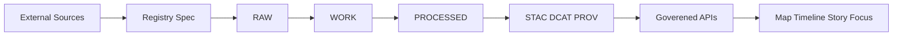

<!-- [KFM_META_BLOCK_V2]
doc_id: kfm://doc/2b0f6a7b-2b2a-4c7b-9e7e-2b0d1db2d6b1
title: Hydrology Data Sources
type: standard
version: v1
status: draft
owners: ["@kfm-data-stewards", "@kfm-hydrology"]
created: 2026-03-04
updated: 2026-03-04
policy_label: public
related:
  - "docs/domains/hydrology/README.md"
  - "docs/guides/geo/hydrology-workflows.md"
  - "data/registry/sources/"
  - "src/pipelines/hydrology/"
tags: ["kfm", "hydrology", "data-sources", "stac", "dcat", "prov"]
notes:
  - "Evidence-labeled inventory of hydrology sources and KFM ingestion status for Kansas-first workloads."
[/KFM_META_BLOCK_V2] -->

# Hydrology Data Sources
Single inventory of hydrology datasets (Kansas-first) with **evidence labels**, **governance posture**, and **ingestion readiness**.

> **Status:** draft (active work)  
> **Owners:** `@kfm-data-stewards`, `@kfm-hydrology`  
> **Policy boundary:** this doc is public, but it references *potentially restricted* datasets (see **Governance & Sensitivity**)  
>
> 
> 
> 

**Quick links**
- [Scope](#scope)
- [Where this fits](#where-this-fits)
- [Evidence discipline](#evidence-discipline)
- [Source registry](#source-registry)
- [Derived hydrology layers](#derived-hydrology-layers)
- [Governance and sensitivity](#governance-and-sensitivity)
- [Onboarding checklist](#onboarding-checklist)
- [Appendix](#appendix)

---

## Scope
Hydrology here includes:

- **Surface water observations:** discharge, gage height, daily statistics, flood-stage indicators
- **Groundwater observations:** water level time series, well metadata (with sensitivity controls)
- **Hydrography geometry:** rivers/streams, waterbodies, watersheds (HUCs), catchments
- **Terrain and derivatives:** DEMs → flow direction, flow accumulation, stream networks, watersheds
- **Water quality:** sampling sites, discrete chemistry results, impairment listings
- **Water infrastructure:** reservoirs, dams, diversions, canals (plus releases/operations where available)
- **Hazards (water-related):** floods, floodplains, event declarations, warnings (when relevant to hydrology narratives)

**Geographic default:** Kansas (state FIPS `20`), with optional upstream context in adjacent basins.

---

## Where this fits
This document is the **human-readable index** for hydrology sources. It should be reflected in:

- **Registry specs**: `data/registry/sources/**` (authoritative acquisition + rights + schema + cadence)
- **Pipelines**: `src/pipelines/hydrology/**` (fetch → RAW → WORK → PROCESSED → PUBLISHED)
- **Catalog outputs**: STAC Items/Collections + DCAT Datasets + PROV bundles
- **Governed APIs**: UI accesses hydrology only through policy-checked endpoints (never direct DB/storage)

---

## Evidence discipline
Every meaningful entry is labeled:

- **CONFIRMED**: Verified source exists + stable access pattern documented (and/or referenced in KFM docs).
- **PROPOSED**: Likely useful; not yet verified end-to-end in KFM.
- **UNKNOWN**: Missing at least one critical attribute (license, access method, schema, extents, cadence).

If **UNKNOWN**, the entry must include *smallest verification steps* to become **CONFIRMED**.

---

## Source registry

### Legend for columns
- **KFM ingest**: whether a governed pipeline + catalog triplet exists (**CONFIRMED/PROPOSED/UNKNOWN**)
- **Sensitivity**: `public | restricted | needs-review`
- **Rights**: capture SPDX license ID or “terms of use” reference in the registry spec (**do not guess**)

### A. Core hydrology monitoring APIs (time series)

| Source | What you get | Kansas filter strategy | Preferred formats | Rights | Cadence | Sensitivity | KFM ingest | Evidence | Smallest verification steps |
|---|---|---|---|---|---|---|---|---|---|
| **USGS Water Services – Instantaneous Values (IV)** | Near real-time time series (e.g., discharge, gage height) | site list OR bbox OR state code where supported | JSON (preferred), WaterML, RDB | UNKNOWN | ~15-min observations typical | public | **PROPOSED** | CONFIRMED | Confirm: rate limits, attribution text, and API parameter set for KS-only pulls |
| **USGS Water Services – Daily Values (DV)** | Daily statistical summaries (mean/min/max etc.) | site list OR state filter | JSON (preferred), WaterML, RDB | UNKNOWN | daily (with backfill) | public | **PROPOSED** | CONFIRMED | Confirm: DV retention window needed, and “daily stats fields” mapping into KFM schema |
| **USGS WaterData OGC APIs** | Modern OGC-style endpoints for time series + metadata | API-specific query | JSON | UNKNOWN | varies | public | **UNKNOWN** | CONFIRMED | Decide: use legacy Water Services vs OGC API as primary; document chosen contract |
| **NWIS Watcher (KFM pipeline)** | Governed fetch→normalize→QC→STAC TS Items→PROV→DCAT rollups | Kansas-focused site/param list (e.g., `00060`, `00065`) | Parquet + STAC JSON + PROV JSON-LD | MIT (pipeline code) | configurable | public | **PROPOSED (WIP)** | CONFIRMED | Confirm: exact dataset IDs, partition scheme, and policy checks before promotion |

**Notes**
- Parameter examples often used: `00060` (discharge), `00065` (gage height).  
- The NWIS Watcher spec includes freshness guards, QC checks, STAC Time-Series Items, and fail-closed promotion patterns.  
  See pipeline spec reference at `src/pipelines/hydrology/nwis_watcher/README.md` (WIP).  

[Back to top](#hydrology-data-sources)

---

### B. Water quality (discrete observations + regulatory artifacts)

| Source | What you get | Kansas filter strategy | Preferred formats | Rights | Cadence | Sensitivity | KFM ingest | Evidence | Smallest verification steps |
|---|---|---|---|---|---|---|---|---|---|
| **Water Quality Portal (WQP)** | Discrete water-quality samples + stations (aggregates multiple agencies) | state=KS, bbox, HUC | CSV/TSV for bulk, JSON where available | UNKNOWN | as submitted by agencies | public | **PROPOSED** | CONFIRMED | Confirm: parameter mapping + station identity rules; document dedupe rules between agencies |
| **KDHE monitoring layers** | Station locations; state-specific layers | Kansas GIS hub / KDHE portals | GeoJSON/GeoParquet after normalization | UNKNOWN | periodic | public | **UNKNOWN** | PROPOSED | Confirm: authoritative download endpoint + license |
| **KDHE 303(d) impairment workflow** | Regulatory reporting artifact (impaired waters lists/segments) | Kansas-only by definition | GeoParquet + metadata | UNKNOWN | biennial-ish | public | **CONFIRMED** | CONFIRMED | Confirm: published schema + versioning (year/submission) and link to authoritative KDHE source docs |

[Back to top](#hydrology-data-sources)

---

### C. Hydrography, watersheds, and terrain baselayers

| Source | What you get | Kansas filter strategy | Preferred formats | Rights | Cadence | Sensitivity | KFM ingest | Evidence | Smallest verification steps |
|---|---|---|---|---|---|---|---|---|---|
| **USGS The National Map – Hydrography** | National hydrography + related layers | download KS bbox / HUC set | GeoPackage/GeoParquet after normalize | UNKNOWN | periodic | public | **PROPOSED** | CONFIRMED | Confirm: which product is canonical for KFM (NHD vs 3DHP vs derived NHDPlus), and snapshot cadence |
| **USGS The National Map – Watersheds (WBD/HUC)** | Watershed boundaries (HUC2..HUC12) | Kansas intersect | GeoParquet | UNKNOWN | periodic | public | **PROPOSED** | PROPOSED | Confirm: WBD product selection + CRS standardization |
| **USGS 3DEP elevation (DEM/lidar-derived surfaces)** | DEMs for terrain/hydrology derivatives | Kansas bbox/tile index | COG GeoTIFF | UNKNOWN | periodic | public | **PROPOSED** | CONFIRMED | Confirm: vertical datum/units policy; select canonical resolution tiers (e.g., 10m vs 1m where available) |

[Back to top](#hydrology-data-sources)

---

### D. Flood hazards and floodplain products

| Source | What you get | Kansas filter strategy | Preferred formats | Rights | Cadence | Sensitivity | KFM ingest | Evidence | Smallest verification steps |
|---|---|---|---|---|---|---|---|---|---|
| **FEMA NFHL** | Effective flood hazard zones + related layers | county/bbox | Feature service → GeoParquet | UNKNOWN | updated as effective data changes | public | **PROPOSED** | CONFIRMED | Confirm: service constraints (feature limits), attribution, and tiling strategy |
| **NWS warnings + NOAA Storm Events** | Events affecting hydrology narratives (floods, storms) | KS bbox/county | GeoJSON/Parquet after normalize | UNKNOWN | frequent | public | **CONFIRMED (via hazards pipeline)** | CONFIRMED | Confirm: which feeds are authoritative + long-term archival strategy |

[Back to top](#hydrology-data-sources)

---

### E. Kansas-first groundwater and water administration sources

> **CAUTION:** well locations, water rights, and diversion points may become **restricted** depending on resolution, linkage risk, and use case.

| Source | What you get | Kansas filter strategy | Preferred formats | Rights | Cadence | Sensitivity | KFM ingest | Evidence | Smallest verification steps |
|---|---|---|---|---|---|---|---|---|---|
| **KGS WIZARD (water levels)** | Depth-to-water / groundwater level observations | Kansas by definition | Parquet + STAC TS assets | UNKNOWN | weekly/monthly varies | needs-review | **PROPOSED** | PROPOSED | Confirm: ToS, station IDs, update cadence, and masking policy for sensitive wells |
| **Kansas Geoportal – wells / aquifers** | Well points; aquifer polygons | Kansas by definition | GeoParquet | UNKNOWN | periodic | needs-review | **PROPOSED** | PROPOSED | Confirm: licensing + whether any fields are sensitive/PII-like |
| **Water rights / diversion infrastructure** | Rights, points of diversion, admin units | Kansas by definition | GeoParquet + policy masking | UNKNOWN | periodic | restricted | **UNKNOWN** | PROPOSED | Confirm: legal constraints; implement default-deny policy and aggregation/masking |

[Back to top](#hydrology-data-sources)

---

### F. Climate forcings used by hydrology (supporting domain)
Hydrology pipelines often depend on climate forcings (precip, temp, ET). Hydrology will *reference* the climate domain’s canonical sources.

| Source | What you get | Kansas filter strategy | Preferred formats | Rights | Cadence | Sensitivity | KFM ingest | Evidence | Smallest verification steps |
|---|---|---|---|---|---|---|---|---|---|
| **Kansas Mesonet** | Station-based precip/temp/ET (and more) | Kansas by definition | Parquet | UNKNOWN | frequent | public | **PROPOSED** | PROPOSED | Confirm: licensing + stable bulk download endpoint |
| **ERA5 reanalysis** | Gridded climate forcing | KS bbox/time | COG/Zarr | UNKNOWN | monthly+ | public | **PROPOSED** | PROPOSED | Confirm: chosen distribution + storage costs and resampling policy |

---

## Derived hydrology layers

### KFM terrain → hydrology ETL outputs
**CONFIRMED (implemented in KFM docs)**: a dedicated terrain/hydrology ETL derives layers such as **flow direction, flow accumulation, stream networks, watershed delineations**, and proximity-to-water rasters using GDAL and WhiteboxTools; outputs are stored as COG/Parquet and registered in STAC for map/timeline use.:contentReference[oaicite:1]{index=1}

**Canonical derived products (PROPOSED naming)**
- `stac:terrain/dem` (source DEM collection)
- `stac:hydrology/flow_direction`
- `stac:hydrology/flow_accumulation`
- `stac:hydrology/stream_network`
- `stac:hydrology/watersheds`
- `stac:hydrology/distance_to_water`

> NOTE: these IDs are **PROPOSED** unless explicitly present in the registry.

---

## Governance and sensitivity

### High-level policy guidance (domain-specific)
- **Restricted uses** (default-deny unless explicitly approved): regulatory water-rights adjudication, tribal water-use inference without approval, and other high-stakes decisioning use cases.
- **Masking**: where required, aggregate/mask sensitive watershed or cultural regions (e.g., coarse H3 resolution) rather than publishing precise features.

These constraints should be encoded as **OPA/Conftest policy gates**, not tribal knowledge.

### Sensitivity heuristics (practical)
Mark datasets `needs-review` or `restricted` if they include:
- precise well coordinates linked to ownership or private infrastructure
- diversion points + rights attributes at parcel-level precision
- any joins that materially increase re-identification risk

---

## Onboarding checklist

### Minimum promotion gate (fail-closed)
A hydrology source cannot be promoted to **PUBLISHED** unless ALL are true:

- Identity: `dataset_id`, version, extents (bbox + time), schema
- Rights: SPDX license ID or documented terms-of-use reference
- Sensitivity classification + policy label
- Provenance: PROV bundle links input → transforms → outputs
- Integrity: checksums/digests for immutable artifacts
- Catalog triplet: STAC + DCAT + PROV all validate
- Run record: run receipt / manifest with `spec_hash` and tool versions

### Small, reversible onboarding steps (recommended)
1. Add a registry spec under `data/registry/sources/hydrology/…`
2. Implement a “RAW snapshotter” (idempotent fetch, stores raw payloads immutably)
3. Add normalization into WORK (schemas, types, CRS, timestamp hygiene)
4. Add validations + policy checks
5. Publish PROCESSED artifacts + catalogs

---

## Appendix

Proposed dataset ID conventions (KFM)

- Prefix by domain: `stac:hydrology/...`, `stac:terrain/...`, `stac:climate/...`
- Prefer “source + product + granularity”:
  - `stac:hydrology/usgs_nwis_iv`
  - `stac:hydrology/usgs_nwis_dv`
  - `stac:hydrology/wqp_samples`
  - `stac:hydrology/fema_nfhl`
- Include `ks` qualifier only when the dataset is a Kansas-specific derivative:
  - `stac:hydrology/ks_flow_accumulation_10m`

Known gaps

- Rights/licensing for several Kansas-specific sources is not yet pinned in this document (must be verified per source).
- Decide on the canonical hydrography baseline (NHD vs 3DHP vs derived NHDPlus-style products) and encode in the registry.
- Define a single “station identity” strategy across NWIS + WQP + KDHE to reduce duplication in the graph.

