<!-- [KFM_META_BLOCK_V2]
doc_id: kfm://doc/domains/hydrology/expansion-backlog
title: Hydrology Domain — Expansion Backlog
type: register
version: v2
status: draft
owners: <hydrology domain steward> + <docs steward>   # placeholders — resolve via CODEOWNERS / ownership register
created: 2026-05-17
updated: 2026-06-06
policy_label: public
contract_version: "3.0.0"   # pinned per ai-build-operating-contract.md v3.0
related:
  - ai-build-operating-contract.md            # canonical operating contract (CONTRACT_VERSION 3.0.0)
  - directory-rules.md
  - docs/domains/hydrology/README.md
  - docs/domains/hydrology/DATA_LIFECYCLE.md
  - docs/domains/README.md
  - docs/registers/VERIFICATION_BACKLOG.md
  - docs/registers/DRIFT_REGISTER.md
  - docs/doctrine/lifecycle-law.md
  - docs/doctrine/authority-ladder.md
  - docs/doctrine/trust-membrane.md
  - docs/doctrine/truth-posture.md
  - docs/standards/PROV.md
  - docs/standards/PMTILES.md
  - control_plane/verification_backlog.yaml
tags: [kfm, hydrology, expansion, backlog, register, governance]
notes:
  - "PROPOSED file home per Directory Rules §12 (Domain Placement Law). Register authority = Rung 5 (lineage/proposed) on the authority ladder; docs explain, ADRs and promotions decide."
  - "All implementation-maturity claims are PROPOSED or NEEDS VERIFICATION pending mounted-repo evidence (no repo mounted this session)."
  - "Sequencing recommendations are non-binding until ADR/steward review."
  - "v2 reconciles crosswalk validator placement (ADR-S-CWV-01), Pre-RAW lifecycle phase, runbook convention (ADR-S-13 / OPEN-DR-02), and CONTRACT_VERSION pin against Atlas v1.1 + Directory Rules + Operating Contract v3.0. See Changelog."
[/KFM_META_BLOCK_V2] -->

# Hydrology Domain — Expansion Backlog

> The single ordered backlog of hydrology-lane work items — research, writing, contracts, validators, pipelines, map surfaces, and policy — sequenced from the strongest available evidence while preserving KFM's trust spine, lifecycle, and publication posture.

<!-- Badges -->


| Field | Value |
|---|---|
| **Status** | `draft` |
| **Owners** | `<hydrology domain steward>` + `<docs steward>` *(placeholders — to be filled by CODEOWNERS)* |
| **Contract** | `CONTRACT_VERSION = "3.0.0"` |
| **Last updated** | `2026-06-06` |
| **Authority class** | Register / lineage (authority-ladder **Rung 5**). `docs/` **explains**; this file does not decide alone. Promotions and ADRs decide. |
| **Supersedes** | v1 (initial draft, 2026-05-17) |

---

## Contents

- [1. Mission & scope](#1-mission--scope)
- [2. How to read this backlog](#2-how-to-read-this-backlog)
- [3. Lane map — where work lands](#3-lane-map--where-work-lands)
- [4. Track overview](#4-track-overview)
- [5. High-priority backlog](#5-high-priority-backlog)
- [6. Medium-priority backlog](#6-medium-priority-backlog)
- [7. Low-priority / exploratory backlog](#7-low-priority--exploratory-backlog)
- [8. Open questions register](#8-open-questions-register)
- [9. Cross-cutting dependencies](#9-cross-cutting-dependencies)
- [10. Closure criteria — what "done" looks like](#10-closure-criteria--what-done-looks-like)
- [11. Out-of-scope candidates (noted, not promoted)](#11-out-of-scope-candidates-noted-not-promoted)
- [12. Changelog](#12-changelog-v1--v2)
- [13. Related docs](#13-related-docs)
- [Appendix A — Source family snapshot](#appendix-a--source-family-snapshot)
- [Appendix B — Item detail cards](#appendix-b--item-detail-cards)

---

## 1. Mission & scope

The Hydrology Expansion Backlog is the **working list** of proposed, sequenced work that advances the hydrology lane from doctrine to operational thin slices, then to released artifacts, without weakening trust, governance, or publication controls.

> [!IMPORTANT]
> **CONFIRMED doctrine / PROPOSED implementation.** The hydrology domain owns watersheds, HUCs, stream reaches, gauges, water level, flow, water quality, hydrologic time series, groundwater context, irrigation/drought links, and flood-context overlays. It **does not** own emergency alerts, observed inundation reconstructed from regulatory zones, or canonical claims that belong to soil, agriculture, geology, or infrastructure. Source: KFM Domain Encyclopedia §7.2; Domains Culmination Atlas v1.1 §[DOM-HYD].

### 1.1 What this backlog **is**

- A single ordered list of hydrology-lane expansion items, sorted by priority and grouped by track.
- A working register that **carries forward** the hydrology open questions from the Domain Encyclopedia (§N. Verification backlog) and Atlas v1.1.
- A traceable bridge between high-level doctrine (`docs/doctrine/`), standards profiles (`docs/standards/`), the cross-domain verification register (`docs/registers/VERIFICATION_BACKLOG.md`), and the operational machine-readable register (`control_plane/verification_backlog.yaml`).

### 1.2 What this backlog **is not**

- It is **not** an ADR; it does not amend Directory Rules, schema homes, or lifecycle phases. Where a backlog item requires an ADR (per Directory Rules §2.4), the item links to a `PROPOSED ADR` row, not to a decision. On the authority ladder this register sits at **Rung 5** (domain dossiers / lineage — propose only); ADRs (Rung 2) and Directory Rules (Rung 3) outrank it.
- It is **not** a release plan; release decisions live in `release/` and are gated by promotion controls, not by backlog priority.
- It is **not** a source-rights authority; rights and sensitivity are governed by `policy/domains/hydrology/` and `data/registry/sources/hydrology/`.
- It is **not** the canonical machine register. The machine-readable companion is `control_plane/verification_backlog.yaml`; this file is the human-readable view.

---

## 2. How to read this backlog

### 2.1 Truth labels

| Label | Meaning in this file |
|---|---|
| **CONFIRMED** | Verified in attached KFM doctrine (Encyclopedia, Atlas, Directory Rules, Operating Contract) or in completed standards profiles. |
| **PROPOSED** | Design, path, placement, or item not yet verified in implementation. |
| **NEEDS VERIFICATION** | Checkable, but not yet checked in this session. Mounted-repo, source-current, or external-tool evidence required. |
| **UNKNOWN** | Not resolvable without more evidence. |
| **CONFLICTED** | Sources disagree, or doctrine and prior planning appear inconsistent; held open until an ADR or drift-register entry resolves it. |
| **EXTERNAL** | Sourced from cited external research. *(No EXTERNAL items in this draft — all items are grounded in attached KFM materials.)* |

### 2.2 Lifecycle and trust posture

Every item in this backlog **MUST** respect the KFM lifecycle and publication invariants. Note that **Pre-RAW** is a named lifecycle phase — the watcher signal/admission edge that precedes RAW — and several watcher items below (HYD-M01–M03) land there:

```text
Pre-RAW  →  RAW  →  WORK / QUARANTINE  →  PROCESSED  →  CATALOG / TRIPLET  →  PUBLISHED
```

- Promotion is a **governed state transition, not a file move.**
- Watchers observe and record; **watchers do not publish**. Watcher output is a Pre-RAW signal (`EventEnvelope` / `EventRunReceipt`) and at most a WORK candidate — never a `data/catalog/` or `data/published/` write.
- Public clients use **governed APIs and released artifacts**, never canonical or RAW stores.
- AI summaries are interpretive; **EvidenceBundle outranks generated language**.
- NFHL regulatory flood context **must not collapse** into observed inundation or emergency authority.

> [!CAUTION]
> Hydrology data can be **operationally current and safety-relevant** (gauges, streamflow anomalies, flood context). KFM publishes hydrology as **observational signals and regulatory context**, never as emergency alerts or live regulatory authority. Source-role separation is a hard, non-negotiable invariant. [Atlas §24.1.2 — "Regulatory zone labeled as an observed flood / event → DENY"]

### 2.3 Priority semantics

| Priority | What it means here |
|---|---|
| **High** | Load-bearing: unblocks multiple downstream items; required for the first proof slice; or directly mitigates a trust-membrane risk. |
| **Medium** | Important but not blocking the first slice; needed for breadth, source-role coverage, or operational hardening. |
| **Low** | Valuable but lower-leverage; safe to defer until High/Medium close. |

[⬆ back to top](#contents)

---

## 3. Lane map — where work lands

Hydrology work fans out across responsibility roots. The Mermaid map below is a **PROPOSED orientation diagram** showing where each track lands in the repo lane pattern (per Directory Rules §12). Exact paths remain `PROPOSED / NEEDS VERIFICATION` until mounted-repo evidence is inspected.

```mermaid
flowchart LR
    subgraph DOC["docs/ (this lane)"]
        D1["docs/domains/hydrology/ — README · EXPANSION_BACKLOG · DATA_LIFECYCLE"]
        D2["docs/standards/ — PROV, PMTILES, OGC-API-TILES, ISO-19115"]
        D3["docs/runbooks/hydrology/ — validation, rollback (Pattern A pending ADR-S-13)"]
        D4["docs/adr/ — PROPOSED ADRs"]
    end

    subgraph CON["contracts / schemas / policy"]
        C1["contracts/domains/hydrology/"]
        C2["schemas/contracts/v1/domains/hydrology/"]
        C3["policy/domains/hydrology/"]
    end

    subgraph CODE["tools / pipelines / connectors"]
        T1["tools/validators/ or tools/probes/ — crosswalk, fingerprint (home is ADR-S-CWV-01)"]
        T2["tools/ingest/hydrology/ — USGS streamflow watcher, NHD delta watch (Pre-RAW signals)"]
        T3["pipeline_specs/hydrology/ + pipelines/domains/hydrology/"]
        T4["connectors/ — USGS NWIS, WBD, NHDPlus HR, NFHL, 3DEP"]
    end

    subgraph DATA["data/ (lifecycle phases)"]
        L0["data/pre_raw/ — watcher signals (PROPOSED)"]
        L1["data/raw/hydrology/"]
        L2["data/work/ · data/quarantine/"]
        L3["data/processed/hydrology/"]
        L4["data/catalog/domain/hydrology/"]
        L5["data/published/layers/hydrology/"]
        L6["data/receipts/ · data/proofs/"]
        L7["data/registry/sources/hydrology/"]
    end

    subgraph REL["release / runtime"]
        R1["release/candidates/hydrology/"]
        R2["apps/governed-api/"]
        R3["packages/maplibre/ + apps/explorer-web/"]
    end

    DOC --> CON
    CON --> CODE
    CODE --> DATA
    DATA --> REL
    REL --> DOC

    classDef doc fill:#eef6ff,stroke:#1f6feb,color:#0b3a82
    classDef con fill:#f4ecff,stroke:#7d3c98,color:#3b1d5a
    classDef code fill:#eafff1,stroke:#1f883d,color:#0f4f24
    classDef data fill:#fff7e6,stroke:#bf8700,color:#6b4500
    classDef rel fill:#ffeef0,stroke:#cf222e,color:#7a0a17
    class DOC,D1,D2,D3,D4 doc
    class CON,C1,C2,C3 con
    class CODE,T1,T2,T3,T4 code
    class DATA,L0,L1,L2,L3,L4,L5,L6,L7 data
    class REL,R1,R2,R3 rel
```



> [!NOTE]
> **NEEDS VERIFICATION.** The diagram reflects Directory Rules §12 (Domain Placement Law) applied to the hydrology lane. The validator/probe home for the crosswalk is genuinely unsettled in the corpus (`tools/validators/hydro/`, `tools/probes/comid_huc12/`, and `tools/validators/validators/crosswalk/` all appear in different sources) — it is an ADR question, tracked as **ADR-S-CWV-01** / OQ-HYD-02 below. The canonical app shell is `apps/explorer-web/` (Directory Rules §7.1, §11). `apps/explorer-web/` siblings are confirmed; specific subfolder names remain PROPOSED until mounted-repo evidence confirms the in-use convention.

[⬆ back to top](#contents)

---

## 4. Track overview

Backlog items are organized into eight tracks, modeled on the cross-domain Expansion Agenda pattern (Pass 10 §10; Pass 20 §10).

| Track | What it produces | Owner role (PROPOSED) |
|---|---|---|
| **T1 — Research** | Source surveys, identity rules, cadence inventories, policy memos. | Hydrology domain steward + source steward |
| **T2 — Writing** | READMEs, standards profiles, ubiquitous-language glossaries, drawer prose. | Docs steward + domain steward |
| **T3 — Architecture** | ADRs, schema-home decisions, object-family resolutions, validator/policy splits. | Docs steward + subsystem owner |
| **T4 — Contracts & Schemas** | `contracts/domains/hydrology/` object meanings; `schemas/contracts/v1/domains/hydrology/` shapes. | Subsystem owner |
| **T5 — Validators** | Crosswalk, fingerprint, identity, role-separation checks (home per ADR-S-CWV-01). | Pipelines/tools owner |
| **T6 — Pipelines & Watchers** | `pipelines/domains/hydrology/`, Pre-RAW watchers, sidecars, receipts. | Pipelines owner + source steward |
| **T7 — Map & API surfaces** | `apps/governed-api/` routes; `packages/maplibre/` layer manifests; Evidence Drawer payloads. | Map/UI owner |
| **T8 — Verification & rollback** | CI fixtures, rollback drills, source-currentness reports, drift entries. | QA/release steward |

> [!TIP]
> A backlog item often spans tracks. The track listed for each item is its **primary** track; secondary tracks appear in parentheses.

[⬆ back to top](#contents)

---

## 5. High-priority backlog

High-priority items unblock the hydrology proof lane and the trust-membrane invariants. Each row carries: identifier, title, primary track, lifecycle phase touched, dependency note, and first artifact. **All implementation rows are PROPOSED until mounted-repo evidence confirms or revises.**

| ID | Title | Track(s) | Lifecycle | First artifact | Status |
|---|---|---|---|---|---|
| **HYD-H01** | Mounted-repo evidence pass for hydrology lane | T8 (T3) | all | `RepoEvidenceReport` (hydrology slice) | PROPOSED |
| **HYD-H02** | Hydrology source-currentness & rights backlog | T1 (T6, T8) | RAW → PROCESSED | `SourceCurrentnessReport` for hydrology sources | PROPOSED |
| **HYD-H03** | Hydrology source-role matrix | T1 (T3) | all | `source-role-matrix.md` distinguishing authority / observation / context / model | PROPOSED |
| **HYD-H04** | First hydrology proof lane — no-network thin slice | T6 (T4, T5, T7) | WORK → PUBLISHED (dry run) | Fixture pack: 1 Kansas HUC12 + 1 USGS gauge + 1 NHDPlus identity crosswalk + 1 NFHL context record + EvidenceBundle + LayerManifest + Drawer payload | PROPOSED |
| **HYD-H05** | COMID ↔ HUC12 crosswalk validator (offline) | T5 (T4) | PROCESSED → CATALOG | Deterministic crosswalk validator + schema + invalid/valid fixtures + DSSE-signed manifest *(home is ADR-S-CWV-01)* | PROPOSED |
| **HYD-H06** | HUC12 fixture & geometry fingerprint rule | T4 (T5) | PROCESSED | `huc12_fingerprint.schema.json` + fingerprint validator + ABSTAIN test | PROPOSED |
| **HYD-H07** | NHDPlus HR identity & ambiguity ABSTAIN behavior | T4 (T5) | PROCESSED → CATALOG | Identity tests + reachcode / permanent_identifier / vpuid carry-through fixtures | PROPOSED |
| **HYD-H08** | USGS Water normalizer (parameter / unit / qualifier / no-data) | T4 (T5, T6) | RAW → PROCESSED | `flow_observation.schema.json` + normalizer + parameter-code registry | PROPOSED |
| **HYD-H09** | NFHL source-role separation tests | T5 (T1) | CATALOG → PUBLISHED | Negative fixtures asserting NFHL ≠ observed inundation; deny test for collapsed claims | PROPOSED |
| **HYD-H10** | EvidenceBundle closure for hydrology | T4 (T8) | CATALOG | Hydrology EvidenceBundle emitter + closure tests + drawer projection | PROPOSED |
| **HYD-H11** | Schema-home reconciliation for hydrology contracts | T3 (T4) | n/a | ADR (or drift-register entry) confirming `schemas/contracts/v1/domains/hydrology/` | PROPOSED ADR |
| **HYD-H12** | Hydrology runbooks — validation & rollback | T2 (T8) | n/a | `docs/runbooks/hydrology/VALIDATION.md`, `…/ROLLBACK.md` (Pattern A pending ADR-S-13) | PROPOSED |

> [!IMPORTANT]
> **Sequencing recommendation (PROPOSED).** Run `HYD-H01` → `HYD-H02` → `HYD-H03` first (evidence + rights + roles). Then `HYD-H05` → `HYD-H06` → `HYD-H07` (identity foundations) before `HYD-H08` → `HYD-H09` (observations + role separation). `HYD-H04` is the visible thin-slice closure across the prior items. `HYD-H11` lands when schema-home drift surfaces; `HYD-H10` and `HYD-H12` close the trust loop.

[⬆ back to top](#contents)

---

## 6. Medium-priority backlog

| ID | Title | Track(s) | Lifecycle | First artifact | Status |
|---|---|---|---|---|---|
| **HYD-M01** | USGS streamflow anomaly watcher thin slice | T6 (T5, T8) | Pre-RAW → WORK | Streamflow watcher + sidecar + `EventRunReceipt`; emits candidates only | PROPOSED |
| **HYD-M02** | NHD hydrology delta watcher | T6 (T1, T5) | Pre-RAW → WORK | `SourceIntakeRecord` watcher + materiality thresholds; emits candidates only | PROPOSED |
| **HYD-M03** | FEMA NFHL revision watcher | T6 (T1) | Pre-RAW → WORK | NFHL revision intake records; role-locked as **context**, never observed | PROPOSED |
| **HYD-M04** | Source-watch registry for hydrology probes | T1 (T6, T3) | n/a | Registry entry per source: cadence, latency, threshold, receipt requirement | PROPOSED |
| **HYD-M05** | Hydrology LayerManifest + MapLibre adapter | T7 (T4) | CATALOG → PUBLISHED | `LayerManifest` for HUCs, streams, gauges; renderer-binding validator | PROPOSED |
| **HYD-M06** | Hydrology Evidence Drawer payloads | T7 (T4) | PUBLISHED | Drawer prose patterns for stale / withheld / ABSTAIN / DENY states | PROPOSED |
| **HYD-M07** | Hydrology STAC / GeoParquet profile | T4 (T1) | CATALOG | One STAC item for a HUC12 + one for a tile artifact | PROPOSED |
| **HYD-M08** | PMTiles hydrology overlay hooks | T7 (T4, T8) | PUBLISHED | PMTiles sidecar schema linkage; root-hash + signature gates per `docs/standards/PMTILES.md` | PROPOSED |
| **HYD-M09** | Hydrology DecisionEnvelope integration | T4 (T7) | runtime | `HydrologyDecisionEnvelope` finite outcomes: `ANSWER` / `ABSTAIN` / `DENY` / `ERROR` | PROPOSED |
| **HYD-M10** | Focus Mode hydrology answer template | T7 (T4) | runtime | Focus Mode template + `AIReceipt` + citation-validation tests | PROPOSED |
| **HYD-M11** | Hydrology source descriptors (registry entries) | T1 (T4) | n/a | One `SourceDescriptor` per source family (USGS NWIS, WBD, NHDPlus HR, NFHL, 3DEP, water quality, groundwater) | PROPOSED |
| **HYD-M12** | Hydrology ubiquitous-language glossary | T2 | n/a | `docs/domains/hydrology/GLOSSARY.md` — Watershed, HUCUnit, HydroFeature, ReachIdentity, GaugeSite, FlowObservation, WaterLevelObservation, WaterQualityObservation, GroundwaterWell, NFHLZone, Observed Flood Event, Flood Context | PROPOSED |
| **HYD-M13** | Upstream / downstream topology verification | T5 (T4) | PROCESSED | Flow-accumulation continuity tests; outlet-consistency fixtures | PROPOSED |
| **HYD-M14** | WBD snapshot lineage tracking | T6 (T5) | PROCESSED | HUC12 lineage drift across WBD snapshots; `wbd_snapshot` field carry-through | PROPOSED |
| **HYD-M15** | Hydrology rollback drill | T8 (T7) | PUBLISHED | Dry-run rollback card; restored prior `LayerManifest` | PROPOSED |

[⬆ back to top](#contents)

---

## 7. Low-priority / exploratory backlog

| ID | Title | Track(s) | Lifecycle | First artifact | Status |
|---|---|---|---|---|---|
| **HYD-L01** | Hydrograph panel + time-slider proof | T7 | PUBLISHED | One gauge → hydrograph component → drawer roundtrip | PROPOSED |
| **HYD-L02** | Drought / irrigation context links | T4 (T1) | CATALOG | `DroughtLink`, `IrrigationLink`, `WaterUseLink` object spines | PROPOSED |
| **HYD-L03** | Groundwater well context | T4 (T1) | CATALOG | `GroundwaterWell` + `AquiferObservation` minimal schema | PROPOSED |
| **HYD-L04** | Coastal / braided / multi-HUC candidate handling | T5 | PROCESSED | `multi_huc_candidate` ranked-candidates fixture set | PROPOSED |
| **HYD-L05** | NOAA AHPS flood-stage correlation (non-emergency) | T6 (T1) | WORK | Correlation sidecar; **explicitly not** an alert path | PROPOSED |
| **HYD-L06** | Async / multi-gauge ingest mode | T6 | Pre-RAW → WORK | County-scale sweep orchestrator | PROPOSED |
| **HYD-L07** | Public-safe gauge metadata exposure policy | T1 (T3) | PUBLISHED | Sensitivity memo; default-public with location-display review | PROPOSED |
| **HYD-L08** | Historical flood evidence intake (non-regulatory) | T1 (T4) | RAW → CATALOG | `Observed Flood Event` source-role rules; archive-only candidates | PROPOSED |

[⬆ back to top](#contents)

---

## 8. Open questions register

These questions are carried forward from the **Domain Encyclopedia §7.2.N** and **Atlas v1.1 [DOM-HYD] N. Verification backlog**, then extended with questions that surfaced while drafting this backlog. Each question is `NEEDS VERIFICATION` (or as labeled) until evidence is mounted. ADR-linked rows reference the open-ADR backlog in Atlas §24.12 and Directory Rules §18.

| OQ-ID | Question | Evidence / ADR that would settle it | Status |
|---|---|---|---|
| **OQ-HYD-01** | Is `schemas/contracts/v1/domains/hydrology/` the canonical schema home, or does an existing ADR amend that? | ADR-0001 / ADR-S-01 + repo `schemas/` walk | NEEDS VERIFICATION |
| **OQ-HYD-02** | Crosswalk validator home: `tools/validators/hydro/`, `tools/probes/comid_huc12/`, or `tools/validators/validators/crosswalk/` — the corpus uses all three. | **ADR-S-CWV-01** (validator nested-path normalization) + per-root README of `tools/` | CONFLICTED |
| **OQ-HYD-03** | Runbook subfolders convention (`docs/runbooks/hydrology/…`) or flat (`docs/runbooks/hydrology_VALIDATION.md`)? | **ADR-S-13** / Directory Rules §18 **OPEN-DR-02**; fauna precedent `docs/runbooks/fauna/SOURCE_REFRESH_RUNBOOK.md` (Pattern A) | NEEDS VERIFICATION |
| **OQ-HYD-04** | Verify HUC12 fixture and fingerprint rule. | Mounted repo files, schemas, tests, fixtures | NEEDS VERIFICATION |
| **OQ-HYD-05** | Verify NHDPlus HR crosswalk and ambiguity `ABSTAIN` behavior. | Mounted repo + validator test outputs | NEEDS VERIFICATION |
| **OQ-HYD-06** | Verify USGS Water normalizer and NFHL source-role separation. | Mounted repo + connector + policy fixture | NEEDS VERIFICATION |
| **OQ-HYD-07** | Verify hydrology API route names and MapLibre layer adapter binding. | `apps/governed-api/` + `packages/maplibre/` inspection | NEEDS VERIFICATION |
| **OQ-HYD-08** | USGS NWIS endpoint transition: are legacy `waterservices.usgs.gov` endpoints still in use, or has `api.waterdata.usgs.gov` superseded them in our connectors? Project corpus references a phase-out window, but the current production state is not verified here. | Current USGS docs at canonical endpoint URLs + connector source | NEEDS VERIFICATION |
| **OQ-HYD-09** | NHDPlus version policy: are v2.1 and HR both supported simultaneously, or is HR the lane default? Mixing must be denied per source-role doctrine. And when 3DHP supersedes v2.1, does the crosswalk become COMID → 3DHP `universal_reference_id` → HUC12, or does HUC12 itself get superseded? The corpus explicitly leaves this unresolved. | ADR + connector + `nhdplus_version` carry-through | CONFLICTED |
| **OQ-HYD-10** | Hydrology coverage scope: is non-CONUS (e.g. Alaska) ever in scope for KFM, or is `coverage_scope: "CONUS"` a hard gate? | ADR or policy decision | UNKNOWN |
| **OQ-HYD-11** | Crosswalk `decision_reason` vocabulary: enum stability (`official_crosswalk` / `area_weighted_overlay` / `centroid_in_polygon` / `snap_to_pour_point`) — is the vocabulary registered in a controlled list? | Vocabulary registry + ADR | PROPOSED |
| **OQ-HYD-12** | Alignment-score threshold: the corpus notes scores below ~0.5 without a braided-geometry flag are common in real data and trigger many denials, and that the threshold "may need tuning." Is any threshold doctrine, or per-source-family configurable in a policy registry? | ADR + threshold policy registry | PROPOSED |
| **OQ-HYD-13** | Streamflow anomaly thresholds (`>3× 7-day median`, `consecutive days > historic p95`): doctrine vs. illustrative? | Threshold policy registry; steward review | NEEDS VERIFICATION |
| **OQ-HYD-14** | Public-safe display of exact gauge coordinates: default permitted, default redacted, or per-site review? Route disposition through Operating Contract §23.2 sensitive-domain matrix. | Sensitivity policy + steward review | UNKNOWN |
| **OQ-HYD-15** | Watcher cadence policy: per-source HEAD checks vs. full refresh — what's the default cadence per hydrology source family? | Source-watch registry + **ADR-S-12** (connector cadence / quarantine recovery) | NEEDS VERIFICATION |

> [!NOTE]
> Items marked **PROPOSED ADR** in §§5–6 are mirrored as the relevant open questions above. When an ADR lands, its row in this register moves to **CONFIRMED** with an ADR reference and a forward link in `docs/registers/DRIFT_REGISTER.md` (if applicable). `CONFLICTED` rows (OQ-HYD-02, OQ-HYD-09) MUST carry a DRIFT_REGISTER entry until the ADR resolves them.

[⬆ back to top](#contents)

---

## 9. Cross-cutting dependencies

Hydrology items depend on, and feed into, several cross-domain artifacts. The table below names the dependency direction so item sequencing can respect it.

| Dependency | Direction | Affected items | Notes |
|---|---|---|---|
| `EvidenceBundle` / `EvidenceRef` schemas | Hydrology **depends on** | HYD-H04, HYD-H10, HYD-M05–M10 | Cross-domain object family; hydrology binds to it. |
| `SourceDescriptor` schema | Hydrology **depends on** | HYD-H02, HYD-H03, HYD-M01–M04, HYD-M11 | Source admission flows through the descriptor; canonical schema home `schemas/contracts/v1/source/source-descriptor.json` (per ADR-0001). |
| `EventEnvelope` / `EventRunReceipt` (Pre-RAW) | Hydrology **depends on** | HYD-M01–M03, HYD-L06 | Watcher signal family; watcher-as-non-publisher invariant. |
| `RunReceipt` / `PromotionDecision` / `ReleaseManifest` | Hydrology **depends on** | HYD-H04, HYD-M01–M03, HYD-M15 | All emitted artifacts pin to these. |
| `LayerManifest` / Tile spec / PMTiles profile | Hydrology **depends on** | HYD-M05, HYD-M08 | Renderer adapter is downstream of trust. |
| Directory Rules §12 (Domain Placement Law) | Hydrology **conforms to** | every item | Hard invariant. |
| ADR-0001 / ADR-S-01 (schema home) | Hydrology **conforms to** | HYD-H11 and all schema items | Drift entry required if conflict surfaces. |
| ADR-S-CWV-01 (crosswalk validator path) | Hydrology **conforms to** | HYD-H05, HYD-L04 | Path is genuinely unsettled — see OQ-HYD-02. |
| ADR-S-13 / OPEN-DR-02 (runbook convention) | Hydrology **conforms to** | HYD-H12 | Pattern A recommended pending ADR. |
| `docs/standards/PROV.md` | Hydrology **conforms to** | HYD-H10, HYD-M01–M03, HYD-M11 | Provenance closure on receipts and bundles. `PROV.md` is the live artifact; `PROVENANCE.md` is a drift candidate (OPEN-DR-01). |
| `docs/standards/PMTILES.md` | Hydrology **conforms to** | HYD-M08 | Sidecar + attestation. |
| `docs/standards/OGC-API-TILES.md` | Hydrology **conforms to** | HYD-M05, HYD-M08 | Tile delivery surface. |
| `docs/standards/ISO-19115.md` | Hydrology **conforms to** | HYD-M07, HYD-M11 | Metadata crosswalk for catalog items. |
| `docs/runbooks/fauna/SOURCE_REFRESH_RUNBOOK.md` | Hydrology **mirrors pattern** | HYD-H12 | Naming convention precedent for runbook subfolders (see OQ-HYD-03). |
| Hazards lane (life-safety boundary) | Hydrology **must not cross** | HYD-H09, HYD-L05 | NFHL ≠ observed inundation; AHPS correlation ≠ alert path. |
| Soil & Agriculture lanes | Hydrology **shares context with** | HYD-L02, HYD-L03 | Soil-hydrology joins, irrigation links — owned **outside** the hydrology canonical claims (cross-lane join policy ADR-S-14). |

[⬆ back to top](#contents)

---

## 10. Closure criteria — what "done" looks like

A backlog item is **closed** when every applicable bullet is true. Closure is a steward decision recorded in the PR or release manifest, not a self-claim by the item author.

> [!IMPORTANT]
> Closure does **not** equal publication. An item can be **closed** with `ABSTAIN`, `DENY`, or `quarantined` outcomes if those are the correct governed outcomes for the evidence available.

- [ ] **Evidence-grounded.** Claims map to attached doctrine, repo files, schemas, tests, workflows, or cited external sources. Memory is not evidence.
- [ ] **Lifecycle-respected.** The item touches only the lifecycle phases declared in its row (including Pre-RAW where it is a watcher); no phase is skipped.
- [ ] **Watcher invariant honored.** If the item is a watcher, it emits Pre-RAW signals, receipts, and at most WORK candidates — it does not publish.
- [ ] **Source-role preserved.** Observation ≠ model ≠ regulatory interpretation. Collapses are denied.
- [ ] **Trust objects emitted.** Where applicable: `EvidenceBundle`, `RunReceipt`, `LayerManifest`, `PromotionDecision`, `RollbackCard`.
- [ ] **Finite outcome.** Validators and runtime surfaces return finite outcomes (validators `PASS` / `FAIL` / `ERROR`; runtime `ANSWER` / `ABSTAIN` / `DENY` / `ERROR`), not free text.
- [ ] **Validator paired.** Every contract has a validator; every validator has invalid + valid fixtures.
- [ ] **Rollback target.** A documented, dry-runnable rollback path exists.
- [ ] **Docs updated.** README, glossary, runbook, and this backlog entry are updated to reflect closure.
- [ ] **Open questions resolved or carried.** Any related `OQ-HYD-*` row is moved to CONFIRMED or carried forward with a fresh reason.
- [ ] **GENERATED_RECEIPT planned** (for any AI-authored artifact merged to the repo) per Operating Contract §34, pinning `CONTRACT_VERSION = "3.0.0"`.

[⬆ back to top](#contents)

---

## 11. Out-of-scope candidates (noted, not promoted)

These ideas surface in the project corpus but are **not** in scope for hydrology expansion under current doctrine. They are recorded here so they aren't lost and so future passes can reconsider them deliberately.

| Candidate | Reason out of scope | Where it would belong if revisited |
|---|---|---|
| Real-time emergency flood alerting | Life-safety boundary belongs to Hazards / official alert authorities, not Hydrology. | Hazards lane + external alert authority — never KFM publication |
| NWS / NOAA alerting bridge | Same as above; KFM does not pass through emergency alerts. | Hazards lane; non-alert correlation only (cf. HYD-L05) |
| AI-generated hydrology forecasts | AI is interpretive, not the root truth source; forecasts are a `modeled` / `synthetic` source role with their own model lane and Reality Boundary Note. | Governed AI runtime + model lane; never as canonical hydrology claim |
| Free-form public chat over the hydrology graph | Public chat over arbitrary stores is not supported; only bounded model use behind governed APIs is. | Focus Mode templates only |
| Direct browser access to RAW / canonical hydrology stores | Trust membrane forbids it. | Always via `apps/governed-api/` |
| Hydrology data publication without an EvidenceBundle | Cite-or-abstain doctrine; default-deny promotion. | Block at promotion gate |

[⬆ back to top](#contents)

---

## 12. Changelog v1 → v2

| Change | Type (per contract §37) | Reason |
|---|---|---|
| Pinned `CONTRACT_VERSION = "3.0.0"` in meta block, badge row, status table | conformance | Doctrine-adjacent register must pin per AIBOC v3.0. |
| Added **Pre-RAW** to the lifecycle string (§2.2), the lane map (`data/pre_raw/`), and watcher rows HYD-M01–M03/HYD-L06 | gap closure | Pre-RAW is a CONFIRMED lifecycle phase; watcher items land there. Watcher-as-non-publisher made explicit. |
| Reclassified the crosswalk validator path (OQ-HYD-02) from a clean PROPOSED path to **CONFLICTED**, tied to **ADR-S-CWV-01** | reconciliation | Corpus uses `tools/validators/hydro/`, `tools/probes/comid_huc12/`, and `tools/validators/validators/crosswalk/`; surfaced rather than smoothed. |
| Tied runbook convention to **ADR-S-13 / OPEN-DR-02**; named Pattern A as recommended-pending-ADR | clarification | Directory Rules §18 already tracks this; fauna precedent cited. |
| Folded the 3DHP-supersession question into OQ-HYD-09 and marked it **CONFLICTED** | gap closure | Crosswalk card explicitly leaves COMID→3DHP→HUC12 unresolved. |
| Enriched OQ-HYD-12 with the corpus's alignment-threshold tuning note | clarification | Atlas crosswalk card flags sub-0.5 scores without braid flag as common. |
| Added `EventEnvelope` / `EventRunReceipt` Pre-RAW dependency row (§9); added CRS/SQL detail to HYD-H05 card (Appendix B) | gap closure | Doctrine Synthesis §44 names crosswalk SQL rules and `EPSG:5070`. |
| Added authority-ladder Rung 5 framing (§1.2, status table) | clarification | Register is lineage/propose-only; ADRs and Directory Rules outrank it. |
| Added GENERATED_RECEIPT closure bullet (§10) | conformance | AI-authored merges require a receipt (AIBOC §34). |
| Split Changelog out as its own numbered section; renumbered Related docs to §13 | housekeeping | Companion-section pattern for doctrine-adjacent docs. |

> **Backward compatibility.** Section anchors `#1` through `#11` are preserved. The former `## 12. Related docs` is now **§13** (`#13-related-docs`); inbound links to `#12-related-docs` should be repointed. Appendix A/B anchors are unchanged. All item IDs (`HYD-*`, `OQ-HYD-*`) are stable.

[⬆ back to top](#contents)

---

## 13. Related docs

> [!NOTE]
> Links are repository-relative. Targets marked **TODO** are referenced for completeness; the file may not yet exist and should be created or linked as the lane matures.

- [Operating contract](../../../ai-build-operating-contract.md) — canonical; `CONTRACT_VERSION = "3.0.0"`
- [Directory Rules](../../../directory-rules.md)
- [Domain README — Hydrology](./README.md) — **TODO**
- [Hydrology — Data Lifecycle](./DATA_LIFECYCLE.md) — companion lane doc
- [Domain glossary — Hydrology](./GLOSSARY.md) — **TODO** (per HYD-M12)
- [Domains index](../README.md) — **TODO**
- [Verification register (cross-domain)](../../registers/VERIFICATION_BACKLOG.md) — **TODO**
- [Drift register](../../registers/DRIFT_REGISTER.md) — **TODO**
- [Lifecycle law](../../doctrine/lifecycle-law.md) — **TODO**
- [Authority ladder](../../doctrine/authority-ladder.md) — **TODO**
- [Truth posture](../../doctrine/truth-posture.md) — **TODO**
- [Trust membrane](../../doctrine/trust-membrane.md) — **TODO**
- [PROV.md — provenance standards profile](../../standards/PROV.md)
- [PMTILES.md — PMTiles governance profile](../../standards/PMTILES.md)
- [OGC-API-TILES.md — tile delivery profile](../../standards/OGC-API-TILES.md)
- [OAI-PMH.md — harvest governance](../../standards/OAI-PMH.md)
- [ISO-19115.md — metadata crosswalk](../../standards/ISO-19115.md)
- [Fauna SOURCE_REFRESH_RUNBOOK](../../runbooks/fauna/SOURCE_REFRESH_RUNBOOK.md) — naming precedent for runbook subfolders
- [Machine register: `verification_backlog.yaml`](../../../control_plane/verification_backlog.yaml) — **TODO**

[⬆ back to top](#contents)

---

## Appendix A — Source family snapshot

<details>
<summary><strong>Click to expand: hydrology source families, roles, and freshness posture (CONFIRMED doctrine / PROPOSED implementation)</strong></summary>

Source: KFM Domain Encyclopedia §7.2; Domains Culmination Atlas v1.1 §[DOM-HYD] D. The role column uses the canonical Atlas phrasing — **authority / observation / context / model, as source role requires** — because a single source family can be admitted under more than one role at different times, but the role is fixed per admitted descriptor and never silently upgraded (Atlas §24.1).

| Source family | Role(s) | Rights / sensitivity | Freshness posture | Status |
|---|---|---|---|---|
| USGS WBD / HUC12 | authority / observation / context / model — **as source role requires** | rights and current terms **NEEDS VERIFICATION**; sensitive joins fail closed | source-vintage or cadence specific | CONFIRMED doctrine / PROPOSED impl |
| NHDPlus HR / 3DHP-oriented hydrography | authority / observation / context / model — **as source role requires** | rights and current terms **NEEDS VERIFICATION**; sensitive joins fail closed | source-vintage or cadence specific | CONFIRMED doctrine / PROPOSED impl |
| USGS Water Data / NWIS | authority / observation / context / model — **as source role requires** | rights and current terms **NEEDS VERIFICATION**; sensitive joins fail closed | operationally current; **observational, not regulatory or emergency** | CONFIRMED doctrine / PROPOSED impl |
| FEMA NFHL / MSC | authority / observation / context / model — **as source role requires** | rights and current terms **NEEDS VERIFICATION**; sensitive joins fail closed | regulatory context only — **NEVER observed inundation** | CONFIRMED doctrine / PROPOSED impl |
| 3DEP terrain | authority / observation / context / model — **as source role requires** | rights and current terms **NEEDS VERIFICATION**; sensitive joins fail closed | source-vintage specific | CONFIRMED doctrine / PROPOSED impl |
| Water-quality and groundwater sources | authority / observation / context / model — **as source role requires** | rights and current terms **NEEDS VERIFICATION**; sensitive joins fail closed | source-vintage or cadence specific | CONFIRMED doctrine / PROPOSED impl |
| Historical observed-flood evidence | authority / observation / context / model — **as source role requires** | rights and current terms **NEEDS VERIFICATION**; sensitive joins fail closed | archive cadence; non-regulatory | CONFIRMED doctrine / PROPOSED impl |

**Key invariants drawn from these families:**

1. NFHL is **regulatory context**, not observed inundation, not emergency authority.
2. USGS streamflow is **observational**, not emergency-grade. KFM does not turn observation into alert.
3. NHDPlus and WBD have **version drift**; lineage fields (`nhdplus_version`, `wbd_snapshot`) carry through.
4. Non-CONUS coverage requires explicit policy; default is `coverage_scope: "CONUS"` for the official crosswalk (PROPOSED — see OQ-HYD-10).

</details>

[⬆ back to top](#contents)

---

## Appendix B — Item detail cards

<details>
<summary><strong>Click to expand: detail cards for high-priority items (HYD-H01 – HYD-H12)</strong></summary>

### HYD-H01 — Mounted-repo evidence pass for hydrology lane

- **Goal.** Inspect the mounted repo to convert every `PROPOSED` / `UNKNOWN` row in this backlog and in the open-questions register into `CONFIRMED` / `NEEDS VERIFICATION` with explicit evidence.
- **Inputs.** Mounted repo; existing `tools/validators/`, `tools/probes/`, `pipelines/`, `connectors/`, `schemas/contracts/v1/`, `docs/runbooks/`, `release/` directories.
- **Outputs.** `RepoEvidenceReport (hydrology slice)`; updated truth labels in this file; new rows in `docs/registers/DRIFT_REGISTER.md` if conflicts surface (notably OQ-HYD-02, OQ-HYD-09).
- **Closure.** Every `OQ-HYD-*` row labeled NEEDS VERIFICATION / CONFLICTED has either a CONFIRMED resolution or a documented carry-forward reason.
- **Risk.** Reading a proposed tree as the current tree. Mitigation: do not promote any implementation claim without repo evidence.

### HYD-H02 — Hydrology source-currentness & rights backlog

- **Goal.** Establish a verification cadence for hydrology source rights, endpoint behavior, package/tool currency, and material-change windows.
- **Outputs.** `SourceCurrentnessReport` table; per-source-family verification cadence in `control_plane/source_authority_register.yaml` (PROPOSED path).
- **Risk.** Activating connectors before rights are verified. Mitigation: **deny activation when rights, cadence, or endpoint behavior is stale or unknown**.

### HYD-H03 — Hydrology source-role matrix

- **Goal.** For each hydrology source family, label its role(s) as authority / observation / context / model — and forbid silent collapse.
- **Outputs.** `docs/domains/hydrology/source-role-matrix.md` (PROPOSED); referenced by `LayerManifest` and policy decisions.
- **Risk.** Collapsing NFHL into observation. Mitigation: explicit role-separation tests in HYD-H09. [Atlas §24.1.2]

### HYD-H04 — First hydrology proof lane (no-network thin slice)

- **Goal.** Prove the hydrology lane end-to-end on offline fixtures.
- **Slice contents (CONFIRMED doctrine):** 1 Kansas HUC12 + 1 USGS gauge fixture + 1 NHDPlus identity crosswalk + 1 NFHL contextual overlay + hydrograph panel + EvidenceBundle closure + `ABSTAIN` on ambiguous reach identity.
- **Outputs.** Fixture pack + runner + receipts + `LayerManifest` + Drawer payload + dry-run release manifest.
- **Closure.** All gates pass on offline fixtures; ambiguous case correctly returns `ABSTAIN`.

### HYD-H05 — COMID ↔ HUC12 crosswalk validator (offline)

- **Goal.** Deterministic, offline-capable, side-effect-free validator for COMID → HUC12 lineage, computed per release with a DSSE-signed manifest carrying both a descriptor `spec_hash` and a release content hash. [Atlas KFM-P5-PROG-0008]
- **Placement (CONFLICTED — ADR-S-CWV-01).** The corpus proposes three homes: `tools/probes/comid_huc12/{compute_crosswalk.py, score_alignment.py, verify_manifest.py}` (crosswalk card), `tools/validators/validators/crosswalk/` (Doctrine Synthesis worked example), and `tools/validators/hydro/` (this backlog's v1 assumption). Do not assert one until the ADR lands; log a DRIFT_REGISTER entry.
- **Decision ladder (CONFIRMED doctrine):**
  1. Official USGS COMID→HUC12 crosswalk (primary, when available for the NHDPlus version pair).
  2. Polygon overlay — area-weighted majority (`alignment_score` retained).
  3. Centroid-in-polygon heuristic (recorded as heuristic).
  4. Snap-to-pour-point (recorded; PRNG seed for ties).
- **Required manifest fields (PROPOSED, drawn from the crosswalk card):** `spec_hash`, `source_head { url, etag, last_modified }`, `algorithm_version`, `comid`, `huc12`, `catchment_poly_hash`, `geometry_sanity_flags`, `alignment_score`, `decision_reason`, `provenance { tool, tool_version }`, plus release content hash.
- **SQL/area rules (CONFIRMED doctrine, Doctrine Synthesis §44):** area calc requires `crs = 'EPSG:5070'`; bounded checks `negative_overlap`, `overlap_gt_huc_area`, `overlap_gt_admin_area`, `overlap_pct_* out_of_bounds`, `weight_out_of_bounds`, `missing_geometry_hash` (`sha256:<64 hex>`).
- **Negative fixtures (PROPOSED):** `missing_version`, `low_alignment_no_braid`, `coastal_unflagged`.
- **Exit codes (PROPOSED; exit-code contract is itself ADR-class per Directory Rules OPEN-DR-03):** align to the canonical validator orchestrator (`0` PASS / `1` FAIL / `2` ERROR), with `ABSTAIN`/unresolved surfaced in the manifest rather than as a bespoke exit code unless the ADR says otherwise.
- **Gate wiring.** Wire the crosswalk gate into the release gate for any release that depends on the crosswalk.

### HYD-H06 — HUC12 fixture & geometry fingerprint rule

- **Goal.** Deterministic identity rule for HUC12 polygons; fail-closed on geometry validity.
- **Outputs.** Schema + validator + invalid fixtures (`invalid_huc_length`, `invalid_geometry_hash`, `duplicate_comid`, `missing_provenance`, `low_alignment`).

### HYD-H07 — NHDPlus HR identity & ambiguity ABSTAIN behavior

- **Goal.** Carry permanent IDs and pour-point references; return `ABSTAIN` on ambiguous reach identity.
- **Outputs.** Identity fixtures + ambiguity tests; carry-through of `reachcode`, `permanent_identifier`, `vpuid`. Mixing NHDPlus versions in one identity claim is denied (OQ-HYD-09).

### HYD-H08 — USGS Water normalizer

- **Goal.** Normalize USGS NWIS payloads with explicit parameter / unit / qualifier / no-data handling.
- **Outputs.** `flow_observation.schema.json`; parameter-code registry (e.g. `00060` for discharge in cfs); UTC-only timestamps.
- **Risk.** Silent legacy/modern endpoint mix. Mitigation: tie to OQ-HYD-08.

### HYD-H09 — NFHL source-role separation tests

- **Goal.** Hard-deny any release that conflates NFHL regulatory zones with observed inundation, forecasts, or emergency alerts.
- **Outputs.** Negative fixtures + denial tests + Drawer prose for `DENY` state. [Atlas §24.1.2 — DENY publication of regulatory layer as event evidence]

### HYD-H10 — EvidenceBundle closure for hydrology

- **Goal.** A hydrology release closes the EvidenceBundle: every claim resolves through `EvidenceRef` to a bundle.
- **Outputs.** Hydrology bundle emitter; closure tests; Drawer projection. Orphan refs fail closed (`ABSTAIN` at public surface).

### HYD-H11 — Schema-home reconciliation for hydrology contracts

- **Goal.** Confirm `schemas/contracts/v1/domains/hydrology/` per ADR-0001 / ADR-S-01, or open ADR amendment.
- **Outputs.** ADR (PROPOSED title: *Hydrology schema home — confirm or amend ADR-0001*) or a `DRIFT_REGISTER` entry.

### HYD-H12 — Hydrology runbooks — validation & rollback

- **Goal.** Operational runbooks for validating a hydrology release and rolling it back.
- **Outputs.** `docs/runbooks/hydrology/VALIDATION.md`, `docs/runbooks/hydrology/ROLLBACK.md` (Pattern A subfolder; recommended pending **ADR-S-13 / OPEN-DR-02**, with the fauna runbook as precedent).

</details>

[⬆ back to top](#contents)

---

### Footer

- **Related docs:** see [§13](#13-related-docs)
- **Last updated:** `2026-06-06`
- **Contract:** `CONTRACT_VERSION = "3.0.0"`
- **Authority class:** register / lineage (Rung 5). `docs/` explains; it does not decide alone.
- **Conformance:** Directory Rules §12 (Domain Placement Law), Lifecycle Law (Pre-RAW → … → PUBLISHED), Cite-or-Abstain, Watcher-as-Non-Publisher.

[⬆ back to top](#contents)
