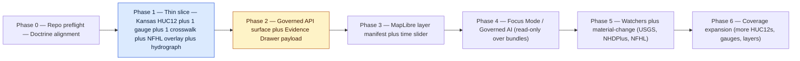
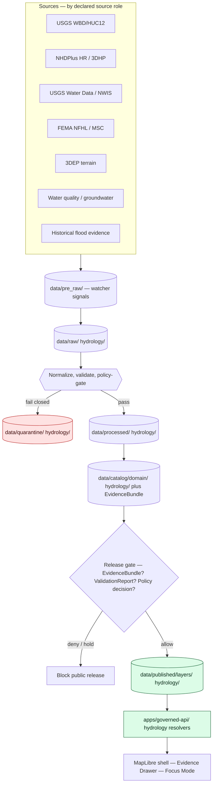
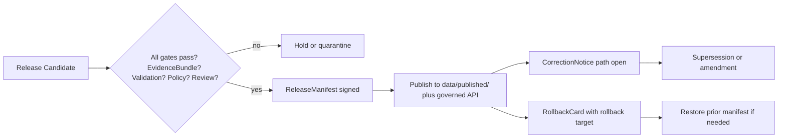

<!-- [KFM_META_BLOCK_V2]
doc_id: kfm://doc/domains/hydrology/expansion-plan
title: Hydrology — Domain Expansion Plan
type: standard
version: v2
status: draft
owners: <hydrology lane steward> + <docs steward>   # placeholders — resolve via CODEOWNERS / ownership register
created: 2026-05-17
updated: 2026-06-06
policy_label: public
contract_version: "3.0.0"   # pinned per ai-build-operating-contract.md v3.0
related:
  - ai-build-operating-contract.md            # canonical operating contract (CONTRACT_VERSION 3.0.0)
  - directory-rules.md
  - docs/domains/README.md
  - docs/domains/hydrology/README.md
  - docs/domains/hydrology/DATA_LIFECYCLE.md
  - docs/domains/hydrology/EXPANSION_BACKLOG.md
  - docs/doctrine/lifecycle-law.md
  - docs/doctrine/authority-ladder.md
  - docs/doctrine/trust-membrane.md
  - docs/sources/SOURCE_DESCRIPTOR_STANDARD.md   # SourceDescriptor MEANING (Markdown); schema home is schemas/contracts/v1/source/
  - docs/standards/PROV.md
tags: [kfm, domain, hydrology, expansion-plan, governance, thin-slice]
notes:
  - All path and implementation claims are PROPOSED until verified against a mounted repo (none mounted this session).
  - SourceDescriptor schema home is schemas/contracts/v1/source/source-descriptor.json (ADR-0001), NOT the docs/sources meaning doc; source/ vs sources/ segment is CONFLICTED pending ADR-0001.
  - Crosswalk validator path is CONFLICTED (ADR-S-CWV-01) — corpus uses three different homes; do not assert one.
  - PROV.md vs PROVENANCE.md naming = Directory Rules OPEN-DR-01; runbook subfolder = ADR-S-13 / OPEN-DR-02.
  - v2 reconciles schema home, crosswalk placement, Pre-RAW phase, and CONTRACT_VERSION pin. See Changelog (§17).
[/KFM_META_BLOCK_V2] -->

# 💧 Hydrology — Domain Expansion Plan

> The proof-bearing, reversible roadmap from a single Kansas HUC12 thin slice to a governed,
> publication-grade hydrology lane — under the responsibility-rooted Domain Placement Law.

<!-- Badges: placeholders until CI and registry endpoints are confirmed -->


<!-- TODO replace with verified CI badge:  -->
<!-- TODO replace with verified release tag badge:  -->

**Status:** Draft · **Owners:** `<hydrology lane steward>` + `<docs steward>` · **Contract:** `CONTRACT_VERSION = "3.0.0"` · **Last updated:** 2026-06-06

---

## Contents

- [1. Purpose and Posture](#1-purpose-and-posture)
- [2. Scope and Boundary](#2-scope-and-boundary)
- [3. Domain Placement Law — Lane File Homes](#3-domain-placement-law--lane-file-homes)
- [4. Phased Expansion Plan](#4-phased-expansion-plan)
- [5. Lifecycle and Promotion Flow](#5-lifecycle-and-promotion-flow)
- [6. Source Families and Source-Role Discipline](#6-source-families-and-source-role-discipline)
- [7. COMID ↔ HUC12 Crosswalk and Hydrology Edge Cases](#7-comid--huc12-crosswalk-and-hydrology-edge-cases)
- [8. Validators, Tests, and Fixtures](#8-validators-tests-and-fixtures)
- [9. Sensitivity, Rights, and Publication Posture](#9-sensitivity-rights-and-publication-posture)
- [10. API, Contract, and Schema Surfaces](#10-api-contract-and-schema-surfaces)
- [11. Governed AI Behavior in the Hydrology Lane](#11-governed-ai-behavior-in-the-hydrology-lane)
- [12. Publication, Correction, and Rollback](#12-publication-correction-and-rollback)
- [13. Small Reversible PR Sequence](#13-small-reversible-pr-sequence)
- [14. Watcher and Material-Change Governance](#14-watcher-and-material-change-governance)
- [15. Verification Backlog and Open Questions](#15-verification-backlog-and-open-questions)
- [16. Related Docs](#16-related-docs)
- [17. Changelog](#17-changelog-v1--v2)

---

## 1. Purpose and Posture

This document is the **hydrology lane's expansion plan**: it sequences the work that turns
CONFIRMED hydrology doctrine into a verifiable, PROPOSED-then-CONFIRMED lane implementation,
without bypassing the KFM trust membrane. It is a companion to
[`DATA_LIFECYCLE.md`](./DATA_LIFECYCLE.md) (governance/gates) and
[`EXPANSION_BACKLOG.md`](./EXPANSION_BACKLOG.md) (ordered work items); this plan is the
phased roadmap that sequences that backlog.

> [!IMPORTANT]
> Hydrology doctrine — what the lane owns, what it must not collapse, what fails closed — is
> **CONFIRMED**. Every claim about repo state, paths, route names, schemas, tests, CI, and
> runtime behavior in this document is **PROPOSED** until verified against a mounted repo. This
> session exposed doctrine documents only, not a mounted repo.

**Posture in one line.** Domain expansion is **proof-bearing, not coverage-bearing**: a single
small AOI with closed descriptor, evidence, policy, validation, and release proves the lane
before any horizontal expansion is earned.

| Concern | Posture |
|---|---|
| Lifecycle | `Pre-RAW → RAW → WORK / QUARANTINE → PROCESSED → CATALOG / TRIPLET → PUBLISHED` |
| Promotion | Governed state transition, **never** a file move |
| Truth | Cite-or-abstain; `EvidenceRef` resolves to `EvidenceBundle` |
| Watchers | Observe, emit Pre-RAW signals, receipts, and candidates; **never** publish |
| Reversibility | Every release carries `ReleaseManifest` + rollback target + correction path |
| Public path | Public clients use **governed API only**; no direct canonical or RAW reads |
| Authority of this doc | Standard plan doc; lineage/propose-only. ADRs and Directory Rules outrank it. |

[⬆ back to top](#contents)

---

## 2. Scope and Boundary

### 2.1 What the hydrology lane owns

The hydrology lane governs watersheds, hydrologic accounting units, the surface-water network,
in-situ observations, regulatory flood context, and observed flood evidence. Object families
follow the Culmination Atlas A–N scope for this domain. [DOM-HYD §E]

| Object family | Role |
|---|---|
| `Watershed`, `HUCUnit` | Hydrologic accounting geometry and identity |
| `HydroFeature`, `ReachIdentity` | Surface-water network features and reach identity |
| `GaugeSite` | Monitoring location identity and metadata |
| `FlowObservation`, `WaterLevelObservation` | Time-stamped, in-situ observations |
| `WaterQualityObservation` | Parameter/value/unit/qualifier observations |
| `GroundwaterWell` | Well identity, screened interval context, level observations |
| `NFHLZone`, `FloodContext` | Regulatory flood context (**not** observed inundation) |
| `ObservedFloodEvent` | Historical or sourced inundation evidence |
| `Hydrograph`, `UpstreamTrace` | Derived analytical projections of admitted observations |

### 2.2 What the hydrology lane does **not** own

> [!CAUTION]
> Hydrology must **not** collapse regulatory flood context, observed inundation, model
> forecasts, and emergency warnings into a single truth class. Collapsing these is a
> source-role violation and fails closed. [Atlas §24.1.2 — "Regulatory zone labeled as an observed flood / event → DENY"]

| Out of scope | Owning lane |
|---|---|
| Emergency alerts, life-safety warnings | **Hazards** (official-source posture) |
| Soil hydric class, SSURGO/SDA canonical claims | **Soil** |
| Crop, yield, irrigation administration claims | **Agriculture** |
| Lithology, boreholes, stratigraphy | **Geology** |
| Roads, bridges, transport facility identity | **Roads / Rail** |
| Critical infrastructure asset identity | **Settlements / Infrastructure** |

[⬆ back to top](#contents)

---

## 3. Domain Placement Law — Lane File Homes

> [!NOTE]
> Domain Placement Law: a domain is a **segment** inside a responsibility root, never a root
> folder of its own. Every hydrology file lives under an existing canonical root with a
> `domains/hydrology/` or `<root>/hydrology/` segment. [DIRRULES §12]

The table below is the **proposed** file-home map for the hydrology lane. Every row is
**PROPOSED** until a mounted-repo inspection confirms presence; ticking a row CONFIRMED is
gated on `git`-equivalent verification.

| Responsibility root | Proposed hydrology home | Holds |
|---|---|---|
| `docs/` | `docs/domains/hydrology/` | This plan, lane README, design notes, ADR links |
| `contracts/` | `contracts/domains/hydrology/` | Semantic object meaning (Markdown) |
| `schemas/` | `schemas/contracts/v1/domains/hydrology/` | JSON Schemas (per ADR-0001 default) |
| `schemas/` (shared) | `schemas/contracts/v1/source/source-descriptor.json` | `SourceDescriptor` schema — shared, not domain-segmented (ADR-0001; see §6 CONFLICTED note) |
| `policy/` | `policy/domains/hydrology/` | Allow / deny / restrict / abstain bundles |
| `tests/` | `tests/domains/hydrology/` | Schema, policy, evidence-closure, no-network tests |
| `fixtures/` | `fixtures/domains/hydrology/` | Golden, valid, and negative-path fixtures |
| `packages/` | `packages/domains/hydrology/` | Shared lane libraries |
| `pipelines/` | `pipelines/domains/hydrology/` | Executable lane pipeline logic |
| `pipeline_specs/` | `pipeline_specs/hydrology/` | Declarative pipeline spec |
| `data/pre_raw/` | `data/pre_raw/` (cross-cutting, not domain-segmented) | Watcher signals before admission (PROPOSED) |
| `data/raw/` | `data/raw/hydrology/` | Immutable source captures |
| `data/work/` | `data/work/hydrology/` | Normalization workspace |
| `data/quarantine/` | `data/quarantine/hydrology/` | Held-failed items with reason |
| `data/processed/` | `data/processed/hydrology/` | Validated normalized objects |
| `data/catalog/` | `data/catalog/domain/hydrology/` | Catalog records, `EvidenceBundle`s |
| `data/triplets/` | `data/triplets/graph_deltas/` (cross-cutting; plural per DIRRULES §18.a) | Graph/triplet projections |
| `data/published/` | `data/published/layers/hydrology/` | Public-safe released artifacts |
| `data/registry/` | `data/registry/sources/hydrology/` | Source registry entries (descriptor instances) |
| `release/` | `release/candidates/hydrology/` | Release candidates and `ReleaseManifest`s |

> [!WARNING]
> Do **not** create a root `hydrology/` folder. Do **not** create parallel schema, policy,
> registry, release, or proof homes under `docs/domains/hydrology/`. Any such home requires
> an ADR amending Directory Rules. Watcher tooling and crosswalk validators are
> **cross-cutting** and do not take a `domains/hydrology/` segment — their home is settled by
> ADR (see §7, §8, §14).

[⬆ back to top](#contents)

---

## 4. Phased Expansion Plan

Phases are sized to be **small, reversible, and proof-bearing**. Phase 1 is the encyclopedia
thin slice. Each subsequent phase earns its scope by demonstrating closure on the previous.
These phases map onto the Atlas system-wide phase roadmap (repo preflight → trust-object
fixtures → governed API/evidence resolver → MapLibre shell + Evidence Drawer → Governed AI /
Focus Mode → source activation maturity). [ENCY §21]



### 4.1 Phase 0 — Repo preflight (doctrine alignment)

**Goal.** Confirm Directory Rules conformance for the hydrology lane and resolve open ADR
items (schema home, `SourceDescriptor` schema path, crosswalk validator home, `PROV.md` vs
`PROVENANCE.md`, runbook subfolder convention) before any lane code is written.

| Activity | Status |
|---|---|
| Inspect mounted repo for existing `docs/domains/hydrology/`, `schemas/contracts/v1/domains/hydrology/`, `schemas/contracts/v1/source/`, etc. | NEEDS VERIFICATION |
| Confirm ADR-0001 / ADR-S-01 schema-home default applies to hydrology | NEEDS VERIFICATION |
| Resolve crosswalk validator home (ADR-S-CWV-01) | OPEN (ADR) |
| Record any drift in `docs/registers/DRIFT_REGISTER.md` | PROPOSED |

### 4.2 Phase 1 — Thin slice

**Goal.** Deliver the encyclopedia-defined thin slice: Kansas HUC12 + one USGS gauge fixture +
one NHDPlus identity crosswalk + NFHL contextual overlay + hydrograph panel + `EvidenceBundle`
closure + ABSTAIN on ambiguous reach identity. [DOM-HYD §G]

| Artifact | Home | Status |
|---|---|---|
| AOI selection (one Kansas HUC12) | `docs/domains/hydrology/THIN_SLICE.md` | PROPOSED |
| `SourceDescriptor` (USGS WBD/HUC12) | `data/registry/sources/hydrology/` | PROPOSED |
| `SourceDescriptor` (NHDPlus HR sample) | `data/registry/sources/hydrology/` | PROPOSED |
| `SourceDescriptor` (USGS Water Data / NWIS) | `data/registry/sources/hydrology/` | PROPOSED |
| `SourceDescriptor` (FEMA NFHL — context only) | `data/registry/sources/hydrology/` | PROPOSED |
| No-network fixture set | `fixtures/domains/hydrology/` | PROPOSED |
| `EvidenceBundle` for one HydroFeature | `data/catalog/domain/hydrology/` | PROPOSED |
| `ReleaseManifest` (dry-run) | `release/candidates/hydrology/` | PROPOSED |
| Ambiguous-reach ABSTAIN fixture | `fixtures/domains/hydrology/negative/` | PROPOSED |

> [!TIP]
> The thin slice's job is **closure** across descriptor, evidence, policy, validation, and
> release for **one** small AOI — not coverage. A Kansas county or single HUC12 with rich,
> public-safe sources is sufficient.

### 4.3 Phase 2 — Governed API surface

**Goal.** Stand up the governed API endpoints that resolve `EvidenceRef → EvidenceBundle` and
return finite `ANSWER / ABSTAIN / DENY / ERROR` envelopes for hydrology features.

| Surface | DTO | Status |
|---|---|---|
| Hydrology feature/detail resolver | `HydrologyDecisionEnvelope` (PROPOSED name) | PROPOSED |
| Hydrology layer manifest resolver | `LayerManifest` projection | PROPOSED |
| Hydrology Evidence Drawer payload | `EvidenceDrawerPayload` + `EvidenceBundle` projection | PROPOSED |

### 4.4 Phase 3 — MapLibre layer manifest and time slider

**Goal.** Public-safe MapLibre layers backed by `LayerManifest` reads only; no renderer reads
canonical or RAW stores. Time slider carries source / observed / valid / retrieval / release
times distinctly. [MAP-MASTER]

### 4.5 Phase 4 — Focus Mode / Governed AI

**Goal.** Mock-adapter Focus Mode that summarizes **released** hydrology `EvidenceBundle`s
and ABSTAINs on missing bundles. No direct browser-to-model path; no AI as truth source.
`FocusModeRequest` carries a `MapContextEnvelope`; `FocusModeResponse` returns a finite outcome
with an `AIReceipt`. [MAP-MASTER] [GAI]

### 4.6 Phase 5 — Watchers and material-change governance

**Goal.** Source-watch and material-change records for USGS flow anomalies, reservoir-level
changes, NHDPlus version drift, NFHL revisions, and floodplain geometry drift. Watchers emit
Pre-RAW signals and candidate decisions only; **promotion stays governed**. See §14.

### 4.7 Phase 6 — Coverage expansion

**Goal.** Earn horizontal expansion by repeating thin-slice closure across additional HUC12s,
gauges, and layers — never by skipping closure.

[⬆ back to top](#contents)

---

## 5. Lifecycle and Promotion Flow



| Stage | Handling | Gate |
|---|---|---|
| `Pre-RAW` | Watcher emits a source-event signal before admission; no admission, no publish | `EventEnvelope` / `EventRunReceipt` exists; admission is a separate transition |
| `RAW` | Capture immutable source payload/reference with source role, rights, sensitivity, citation, time, hash | `SourceDescriptor` exists |
| `WORK / QUARANTINE` | Normalize schema, geometry, time, identity, evidence, rights, policy; hold failures | Validation and policy gate pass, or quarantine reason recorded |
| `PROCESSED` | Emit validated normalized objects, receipts, public-safe candidates | `EvidenceRef`, `ValidationReport`, digest closure exist |
| `CATALOG / TRIPLET` | Emit catalog records, `EvidenceBundle`s, graph/triplet projections, release candidates | Catalog/proof closure passes |
| `PUBLISHED` | Serve released public-safe artifacts through governed APIs and manifests | `ReleaseManifest`, correction path, rollback target, review/policy state exist |

> [!NOTE]
> The release gate emits a finite promotion outcome (`ALLOW` / `DENY` / `HOLD` / `ERROR`);
> validators emit `PASS` / `FAIL` / `ERROR`; governed-API/AI surfaces emit
> `ANSWER` / `ABSTAIN` / `DENY` / `ERROR`. [Atlas §24.3]

[⬆ back to top](#contents)

---

## 6. Source Families and Source-Role Discipline

The hydrology lane admits sources only after their **source role** is declared and constrained.
Source role is one of the canonical seven classes — `observed / regulatory / modeled /
aggregate / administrative / candidate / synthetic` — **fixed at admission and never upgraded
by promotion** (Atlas §24.1). The role labels below are the working hydrology assignments; a
single source family can be admitted under more than one role at different times, but the role
travels with each admitted descriptor.

> [!CAUTION]
> **CONFLICTED — `SourceDescriptor` schema home.** Atlas §24.1.3 places the descriptor schema
> at `schemas/contracts/v1/source/source-descriptor.json` (singular `source/`), while the
> Operating Contract's worked `GENERATED_RECEIPT` example references
> `schemas/contracts/v1/sources/source_descriptor.schema.json` (plural `sources/`, underscore,
> `.schema.json`). `docs/sources/SOURCE_DESCRIPTOR_STANDARD.md` is the human-readable
> **meaning** doc, not the schema home. Log for ADR-0001 confirmation + DRIFT_REGISTER entry;
> do not assert one path. [ENCY §24.1.3] [AIBOC §46]

| Source family | Source role(s) | Notes |
|---|---|---|
| USGS WBD / HUC12 | **authority / context** (accounting geometry) | Watershed boundary, nested HUC codes; vintage-sensitive |
| NHDPlus HR / 3DHP | **authority / context** (network) | Flow network, catchments, VAAs; preserve permanent IDs |
| USGS Water Data / NWIS | **observed** | Real-time and historical streamflow, gauge height; legacy WaterServices phasing out |
| FEMA NFHL / MSC | **regulatory** context | Effective flood hazard data; **not** observed inundation, **not** forecast |
| 3DEP terrain | **observed / context** | DEM products supporting hydrologic derivatives |
| Water-quality / groundwater | **observed** | Parameter/unit/qualifier discipline required |
| Historical observed flood evidence | **observed** (archival) | Source vintage and citation required |
| Any hydrograph / reconstruction | **modeled** | Carries model identity + run receipt + bounds; never relabeled observed |

> [!IMPORTANT]
> **Three role separations the lane must enforce:**
> 1. NFHL regulatory context **≠** observed inundation **≠** forecast **≠** emergency warning.
> 2. NHDPlus v2.1, NHDPlus HR, and WBD snapshot vintages must not be silently mixed; carry
>    `nhdplus_version` and `wbd_snapshot` fields explicitly.
> 3. Models, observations, regulatory interpretations, and legal status are distinct truth
>    classes — labels travel with every emitted object. [Atlas §24.1.2]

### 6.1 Rights, freshness, and admission

| Source | Rights / sensitivity | Freshness | Admission posture |
|---|---|---|---|
| USGS WBD / HUC12 | Public; redistribution terms NEEDS VERIFICATION | Vintage-pinned snapshots | Admit with `wbd_snapshot` |
| NHDPlus HR | Public; redistribution terms NEEDS VERIFICATION | Version-pinned | Admit with `nhdplus_version` |
| USGS NWIS / Water Data | Public observation | Real-time / daily | Admit with retrieval-time band |
| FEMA NFHL | Regulatory; **DENY** as observed inundation | Localized, `EFFECTIVE_DATE`-bound | Admit as context-only |
| 3DEP terrain | Public | Tile-version-pinned | Admit with tile identity |
| Water-quality / groundwater | Mixed; rights NEEDS VERIFICATION | Parameter-cadence specific | Admit on rights review |

[⬆ back to top](#contents)

---

## 7. COMID ↔ HUC12 Crosswalk and Hydrology Edge Cases

A clean, defensible COMID → HUC12 join is foundational for the lane — it is among the most-used
join keys in KFM, so a non-deterministic join makes every downstream layer drift. The
deterministic fallback order below is CONFIRMED doctrine (Atlas KFM-P5-PROG-0008): the crosswalk
is computed per release with explicit alignment scoring, geometry sanity flags, version-drift
handling, Kansas-subset CI probing, and a DSSE-signed manifest carrying both a descriptor
`spec_hash` and a release content hash.

### 7.1 Deterministic fallback order

| Tier | Method | When to use |
|---|---|---|
| 1 | Official USGS COMID → HUC12 crosswalk (for the NHDPlus version pair, when available) | Primary — every networked flowline |
| 2 | Polygon overlay (area-weighted majority; max-overlap fraction kept) | Official crosswalk missing or insufficient |
| 3 | Centroid-in-polygon heuristic | Overlay ambiguous; record as heuristic |
| 4 | Snap-to-outlet / pour-point (PRNG seed recorded for ties) | Problematic geometry |

### 7.2 Required provenance manifest fields (per row)

```text
spec_hash             # sha256 of canonical, key-sorted JSON row
source_head           # { url, ETag, Last-Modified } of crosswalk inputs
source_doi            # e.g., USGS crosswalk DOI if present
algorithm_version     # crosswalk tool version string
comid                 # NHDPlus identifier
huc12                 # WBD HUC12 identifier
catchment_poly_hash   # wkb sha256
geometry_sanity_flags # self-intersection, tiny area, invalid ring, ...
alignment_score       # area overlap fraction used for decision
decision_reason       # official_crosswalk | area_weighted_overlay |
                      # centroid_in_polygon | snap_to_pour_point
provenance            # { tool, tool_version }
```

### 7.3 Edge cases that must not be silently collapsed

| Edge case | Required field / handling |
|---|---|
| NHDPlus version drift | `nhdplus_version` and `wbd_snapshot` carried on every row |
| 3DHP supersession of v2.1 | **Unresolved in the corpus** — whether the key becomes COMID → 3DHP `universal_reference_id` → HUC12, or HUC12 itself is superseded, is an open ADR (see §15) |
| Non-CONUS (e.g., Alaska) | `coverage_scope: "CONUS"`; **fail closed** outside supported extents unless explicitly supported |
| Coastal / braided systems | `multi_huc_candidate: true` + ranked `candidate_huc12s` with `overlap`; missing braid flag at low alignment is a common real-data DENY trigger |
| Ambiguous reach identity | ABSTAIN at the governed API; do not guess |

### 7.4 Validator placement and behavior

> [!CAUTION]
> **CONFLICTED — crosswalk validator home (ADR-S-CWV-01).** The corpus proposes three homes:
> `tools/probes/comid_huc12/{compute_crosswalk.py, score_alignment.py, verify_manifest.py}`
> (Atlas crosswalk card), `tools/validators/validators/crosswalk/` (Doctrine Synthesis worked
> example), and a flat `tools/validators/...` (earlier planning). Do **not** assert one until
> the ADR lands; log a DRIFT_REGISTER entry. The crosswalk policy bundle is proposed at
> `policy/spatial/comid_huc12.rego`. [Atlas KFM-P5-PROG-0008] [Doctrine Synthesis §43]

> [!CAUTION]
> Regardless of home, the crosswalk validator MUST be **deterministic, offline-capable,
> reproducible, and side-effect free**. It MUST NOT fetch live authoritative data during
> validation, mutate catalogs, publish records, or infer truth from AI outputs. It validates
> **declared evidence and lineage** only. Wire its gate into the release gate for any release
> that depends on the crosswalk.

[⬆ back to top](#contents)

---

## 8. Validators, Tests, and Fixtures

Hydrology shares the cross-domain validator suite (schema, source descriptor, rights,
sensitivity, evidence closure, temporal logic, geometry validity, policy deny, citation,
release manifest, rollback drill, no-network, non-regression) and adds the following
**lane-specific** checks, all **PROPOSED** until implemented in the mounted repo. Validators
emit finite `PASS` / `FAIL` / `ERROR`; the canonical orchestrator's exit-code contract
(`0`/`1`/`2`) is itself ADR-class (Directory Rules OPEN-DR-03).

### 8.1 Lane-specific validators

| Validator | Purpose | Status |
|---|---|---|
| HUC12 fingerprint validation | Canonicalize geometry + ID fingerprint; reject drift | PROPOSED |
| NHDPlus HR identity ambiguity tests | ABSTAIN on unresolved reach identity | PROPOSED |
| USGS parameter / unit / qualifier / no-data tests | Reject ambiguous observation semantics | PROPOSED |
| NFHL role-separation tests | Reject NFHL-as-observed-flood claims | PROPOSED |
| `EvidenceBundle` closure tests | Every public claim resolves to a closed bundle | PROPOSED |
| No-network hydrology proof fixture | Deterministic, offline, reproducible lane proof | PROPOSED |
| COMID ↔ HUC12 manifest validation | Per-row provenance manifest; fail closed on missing fields or low alignment (home per ADR-S-CWV-01) | PROPOSED |

### 8.2 Required negative fixtures

> [!NOTE]
> Outcome labels below pair a lane-specific reason code with the canonical finite outcome.
> `FAIL_*` codes are validator-class `FAIL` results; `DENY` / `ABSTAIN` are governed-API/policy outcomes.

| Fixture | Expected outcome |
|---|---|
| `invalid_huc12_length.json` | `FAIL` (`FAIL_INVALID_HUC12`) |
| `low_alignment_overlay.json` (`alignment_score` < threshold) | `FAIL` (`FAIL_LOW_ALIGNMENT`) |
| `missing_provenance.json` | `FAIL` (`FAIL_MISSING_PROVENANCE`) |
| `nfhl_as_observed_flood.json` | `DENY` (source-role violation) |
| `ambiguous_reach_identity.json` | `ABSTAIN` |
| `stale_source_head.json` | `ABSTAIN` or stale-state badge per policy |
| `unresolved_evidence_ref.json` | `ABSTAIN` |
| `non_conus_aoi.json` (e.g., Alaska) | `DENY` unless explicitly supported |
| `mixed_nhdplus_versions.json` | `DENY` (version-drift collapse) |
| `coastal_unflagged.json` | `FAIL` (`FAIL_LOW_ALIGNMENT` without braid flag) |

### 8.3 CI gating

CI MUST fail when any of the following hold:

- Crosswalk manifest missing `spec_hash`, `source_head`, or `algorithm_version`
- `alignment_score` below the policy threshold without an explicit override receipt
- Any validator emits non-finite output (must be `PASS` / `FAIL` / `ERROR`, with public-surface outcomes `ANSWER` / `ABSTAIN` / `DENY` / `ERROR`)
- A negative fixture passes (i.e., fails to fail)
- Direct RAW or canonical-store exposure detected from the public path
- `EvidenceRef` resolution skipped on a public claim surface

[⬆ back to top](#contents)

---

## 9. Sensitivity, Rights, and Publication Posture

Disposition for any sensitive object defers to the Operating Contract **§23.2 sensitive-domain
decision matrix**; the hydrology-specific fail-closed triggers are below.

| Trigger | Posture |
|---|---|
| Unclear source rights | **DENY** public release until terms and redistribution class are recorded |
| NFHL framed as observed inundation | **DENY** (source-role violation) |
| Private property or critical-infrastructure implication | **REVIEW** before any public release |
| Stale source vs release window | Stale-state badge or `ABSTAIN` per freshness policy |
| Precise sensitive-asset geometry | **DENY** unless a redaction / generalization receipt exists |

> [!WARNING]
> Hydrology has lower default sensitivity than fauna nests or archaeology, **but** it can
> still touch private property, infrastructure, and life-safety adjacencies. Default to
> redaction, generalization, or delayed publication when in doubt. Record every transform
> and reason on a `RedactionReceipt`. KFM is **not** an emergency alert authority; life-safety
> action redirects to official sources (NWS, state/county EM).

[⬆ back to top](#contents)

---

## 10. API, Contract, and Schema Surfaces

All surfaces below are **PROPOSED**. Route names, DTO names, and schema homes are placeholders
until verified against the mounted repo and named in an ADR where required.

| Endpoint / artifact | DTO / schema | Finite outcomes | Status |
|---|---|---|---|
| Hydrology feature / detail resolver | `HydrologyDecisionEnvelope` (PROPOSED) | `ANSWER` / `ABSTAIN` / `DENY` / `ERROR` | PROPOSED — route TBD |
| Hydrology layer manifest resolver | `LayerManifest` / domain layer descriptor | `ANSWER` / `DENY` / `ERROR` | PROPOSED — public-safe release only |
| Hydrology Evidence Drawer payload | `EvidenceDrawerPayload` + `EvidenceBundle` projection | `ANSWER` / `ABSTAIN` / `DENY` / `ERROR` | PROPOSED — evidence and policy filtered |
| Hydrology Focus Mode answer | `FocusModeRequest` / `FocusModeResponse` + `AIReceipt` | `ANSWER` / `ABSTAIN` / `DENY` / `ERROR` | PROPOSED — AI never root truth |
| Schema responsibility root | `schemas/contracts/v1/domains/hydrology/` | finite validator outcomes | PROPOSED — verify with Directory Rules + ADR-0001 |

<details>
<summary>Proposed schema list under <code>schemas/contracts/v1/domains/hydrology/</code></summary>

> [!NOTE]
> All filenames below are **PROPOSED**. Final names depend on the cross-domain object-map ADR
> and on whether the lane uses singular or plural object names in file paths. The shared
> `SourceDescriptor` schema lives under `schemas/contracts/v1/source/`, **not** here.

- `Watershed.v1.schema.json`
- `HUCUnit.v1.schema.json`
- `HydroFeature.v1.schema.json`
- `ReachIdentity.v1.schema.json`
- `GaugeSite.v1.schema.json`
- `FlowObservation.v1.schema.json`
- `WaterLevelObservation.v1.schema.json`
- `WaterQualityObservation.v1.schema.json`
- `GroundwaterWell.v1.schema.json`
- `NFHLZone.v1.schema.json` (regulatory context only)
- `ObservedFloodEvent.v1.schema.json`
- `Hydrograph.v1.schema.json` (modeled — carries run receipt + bounds)
- `UpstreamTrace.v1.schema.json`
- `ComidHuc12CrosswalkRow.v1.schema.json`

</details>

[⬆ back to top](#contents)

---

## 11. Governed AI Behavior in the Hydrology Lane

> [!IMPORTANT]
> AI is **interpretive, not the root truth source**. AI may summarize **released** hydrology
> `EvidenceBundle`s, compare evidence, explain limitations, and draft steward-review notes.
> AI MUST `ABSTAIN` when evidence is insufficient and `DENY` where policy, rights,
> sensitivity, or release state blocks the request. [GAI] [DOM-HYD §L]

| AI behavior | Permitted? | Rationale |
|---|---|---|
| Summarize released `EvidenceBundle` | ✅ | Bounded by citation validation; `AIReceipt` recorded |
| Compare two released observations | ✅ | If both bundles closed; otherwise ABSTAIN |
| Generate hydrologic forecast or model output | ❌ | AI is not a hydrologic model; forecasts are a `modeled`/`synthetic` role with their own lane |
| Reframe NFHL as observed flood | ❌ | Source-role violation; DENY |
| Read RAW / WORK / QUARANTINE / Pre-RAW | ❌ | Trust-membrane violation |
| Direct browser-to-model call | ❌ | Routed through governed API only |
| Emit uncited public claim | ❌ | Cite-or-abstain |

[⬆ back to top](#contents)

---

## 12. Publication, Correction, and Rollback

Every hydrology public release MUST carry:

1. A `ReleaseManifest` listing artifact digests and the release decision.
2. A closed `EvidenceBundle` for every public claim.
3. A `ValidationReport` and policy decision support.
4. A review state where required by sensitivity or rights (release author ≠ release authority where materiality applies; ADR-S-09 / ADR-S-12).
5. A correction path (how to file a correction, who handles it, what supersedes what). A `CorrectionNotice` must list invalidated derivatives.
6. A `RollbackCard` with a concrete rollback target and a drilled rollback procedure.



> [!TIP]
> A rollback drill MUST be performed against at least one dry-run hydrology release before the
> first live publication. The rollback receipt is itself part of the lane's proof set.

[⬆ back to top](#contents)

---

## 13. Small Reversible PR Sequence

The PR sequence below adapts the encyclopedia PR-00..PR-10 roadmap to the hydrology lane.
Every PR is small, reversible, and tied to validation and rollback. All proposed homes are
responsibility roots under Domain Placement Law.

| # | PR | Proposed home(s) | Acceptance | Rollback |
|---|---|---|---|---|
| PR-00 | No-network hydrology fixture | `fixtures/domains/hydrology/`, `tests/domains/hydrology/` | Fixture validates with no network access | Revert PR |
| PR-01 | Schema-home ADR (hydrology) + crosswalk-validator-home ADR (ADR-S-CWV-01) | `docs/adr/` | ADRs accepted; Directory Rules conformance | Supersede ADR |
| PR-02 | `SourceDescriptor` instances + source registry | `contracts/domains/hydrology/`, `schemas/contracts/v1/source/` (schema), `data/registry/sources/hydrology/` (instances) | Valid/invalid fixtures; deny unknown rights | Disable descriptor |
| PR-03 | Lane validators (schema/evidence/rights/sensitivity/temporal/geometry) | `tools/validators/…` (home per ADR-S-CWV-01), `tests/domains/hydrology/` | Negative tests fail closed | Revert / pin previous |
| PR-04 | `EvidenceBundle` resolver for one HydroFeature | `packages/evidence/`, `apps/governed-api/` | `ABSTAIN` on missing bundle | Disable route |
| PR-05 | Catalog closure stub (CatalogMatrix, DatasetVersion, ValidationReport) | `data/catalog/domain/hydrology/`, `schemas/...`, `tests/...` | Closure test rejects incomplete bundle | Delete release candidate |
| PR-06 | MapLibre `LayerManifest` + public-safe layer fixture + badges | `apps/explorer-web/`, `data/published/layers/hydrology/` | Map layer reads only released manifest | Remove layer from registry |
| PR-07 | Evidence Drawer (feature click → governed API → payload) | UI + `apps/governed-api/` | Citation / evidence tests pass | Disable drawer link |
| PR-08 | Focus Mode mock-adapter (read-only over released bundles) | `runtime/model_adapters/mock/`, `tests/...` | Finite-outcome tests pass | Disable adapter |
| PR-09 | Promotion dry-run (no public publication) | `release/candidates/hydrology/`, `policy/domains/hydrology/`, `tests/...` | `no-public-write` test passes | Discard candidate |
| PR-10 | Rollback drill against a dry-run release | `release/`, `docs/runbooks/hydrology/` (Pattern A pending ADR-S-13) | Rollback drill receipt produced | Restore prior `ReleaseManifest` |

> [!NOTE]
> Each AI-authored PR carries a `GENERATED_RECEIPT.json` pinning `CONTRACT_VERSION = "3.0.0"`
> (Operating Contract §34); a receipt with `human_review.state == "pending"` is well-formed
> but not mergeable.

[⬆ back to top](#contents)

---

## 14. Watcher and Material-Change Governance

Hydrology watchers observe and record; they do not publish. Watcher output is a **Pre-RAW**
signal (and at most a WORK candidate), never a `data/catalog/` or `data/published/` write —
the watcher-as-non-publisher invariant. The lane's first watchers are:

| Watcher | Trigger | Emits |
|---|---|---|
| USGS flow anomaly | Anomaly above policy threshold over rolling window | Pre-RAW signal + `EventRunReceipt` + candidate decision |
| Reservoir level change | Level delta above threshold for a monitored reservoir | Pre-RAW signal + candidate decision |
| NHDPlus version drift | New NHDPlus HR / v2.1 release; WBD snapshot change | Material-change record + supersession candidate |
| NFHL revision | New `EFFECTIVE_DATE` or `VERSION_ID` on a tracked panel | Material-change record (regulatory context only) |
| Floodplain geometry drift | Geometry-fingerprint change beyond tolerance | Material-change record + review candidate |

> [!IMPORTANT]
> Watcher invariants:
> - MUST NOT mutate catalog truth
> - MUST NOT publish directly
> - MUST NOT overwrite canonical records
> - MUST NOT bypass review states
> - MAY emit Pre-RAW signals, receipts, and candidate decisions only

[⬆ back to top](#contents)

---

## 15. Verification Backlog and Open Questions

ADR-linked rows reference the open-ADR backlog in Atlas §24.12 and Directory Rules §18.

| Item | What would settle it | Status |
|---|---|---|
| Verify actual schema home and path conventions in mounted repo | `schemas/contracts/v1/domains/hydrology/` presence + ADR-0001 / ADR-S-01 conformance | NEEDS VERIFICATION |
| Resolve `SourceDescriptor` schema path: `source/source-descriptor.json` vs `sources/source_descriptor.schema.json` | ADR-0001 confirmation + DRIFT_REGISTER entry | CONFLICTED |
| Resolve crosswalk validator home | **ADR-S-CWV-01** (validator nested-path normalization) | CONFLICTED |
| Verify HUC12 fixture and fingerprint canonicalization rule | Fixture files, validator code, validator tests | NEEDS VERIFICATION |
| Verify NHDPlus HR crosswalk and ambiguity ABSTAIN behavior | Route logic, validator outputs, negative fixtures | NEEDS VERIFICATION |
| Verify USGS Water normalizer and NFHL source-role separation | Normalizer code + policy bundle | NEEDS VERIFICATION |
| Verify hydrology API and MapLibre layer adapter | Route registry, `LayerManifest` reads, e2e smoke | NEEDS VERIFICATION |
| Confirm `release/candidates/hydrology/` exists or needs to be created | Repo inspection | NEEDS VERIFICATION |
| Decide singular vs plural in `data/triplet(s)/` path | One-line ADR (Directory Rules §18.a recommends plural `triplets/`) | OPEN |
| Resolve `PROV.md` vs `PROVENANCE.md` naming discrepancy | Directory Rules **OPEN-DR-01** (PROV.md is the live artifact) | OPEN |
| Confirm runbook subfolder convention (`docs/runbooks/hydrology/` vs flat-prefix) | **ADR-S-13** / Directory Rules **OPEN-DR-02** (Pattern A recommended; fauna precedent) | OPEN |
| Resolve 3DHP supersession of NHDPlus v2.1 crosswalk key | ADR + connector evidence (corpus leaves this unresolved) | CONFLICTED |
| Identify the Kansas HUC12 to seed the thin slice | Selection note in `docs/domains/hydrology/THIN_SLICE.md` | OPEN |
| Decide whether `EvidenceBundle` is always stored or sometimes generated at request time | ADR | OPEN |
| Identify watcher cadence and threshold-drift policy for USGS flow anomalies | Operational ADR + policy bundle (**ADR-S-12** connector cadence / quarantine recovery) | OPEN |
| Confirm `coverage_scope: "CONUS"` hard gate vs configurable | ADR or policy decision | UNKNOWN |

> [!NOTE]
> Items marked `NEEDS VERIFICATION` are checkable against a mounted repository. Items marked
> `OPEN` require an ADR or steward decision. `CONFLICTED` rows MUST carry a DRIFT_REGISTER
> entry until the ADR resolves them. Until all are resolved, every path-bearing claim in this
> document remains PROPOSED.

[⬆ back to top](#contents)

---

## 16. Related Docs

- [`ai-build-operating-contract.md`](../../../ai-build-operating-contract.md) — canonical operating contract; `CONTRACT_VERSION = "3.0.0"`
- [`directory-rules.md`](../../../directory-rules.md) — Domain Placement Law (§12), lifecycle invariants, OPEN-DR-01/02/03
- [`docs/domains/README.md`](../README.md) — Domain lane index and source-role burden logic (PROPOSED)
- [`docs/domains/hydrology/README.md`](./README.md) — Hydrology lane landing page (PROPOSED)
- [`docs/domains/hydrology/DATA_LIFECYCLE.md`](./DATA_LIFECYCLE.md) — lane governance, gates, artifact homes
- [`docs/domains/hydrology/EXPANSION_BACKLOG.md`](./EXPANSION_BACKLOG.md) — ordered backlog this plan sequences
- [`docs/doctrine/lifecycle-law.md`](../../doctrine/lifecycle-law.md) — Pre-RAW → PUBLISHED governed transitions (PROPOSED)
- [`docs/doctrine/authority-ladder.md`](../../doctrine/authority-ladder.md) — rung order; docs propose, ADRs decide (PROPOSED)
- [`docs/doctrine/trust-membrane.md`](../../doctrine/trust-membrane.md) — Public-path discipline (PROPOSED)
- [`docs/sources/SOURCE_DESCRIPTOR_STANDARD.md`](../../sources/SOURCE_DESCRIPTOR_STANDARD.md) — `SourceDescriptor` **meaning** (schema home is `schemas/contracts/v1/source/`)
- [`docs/standards/PROV.md`](../../standards/PROV.md) — W3C PROV-O / PAV provenance profile (live artifact; cf. OPEN-DR-01)
- [`docs/standards/PMTILES.md`](../../standards/PMTILES.md) — PMTiles governance profile
- [`docs/standards/OGC-API-TILES.md`](../../standards/OGC-API-TILES.md) — OGC API Tiles delivery profile
- [`docs/standards/OAI-PMH.md`](../../standards/OAI-PMH.md) — OAI-PMH harvest governance
- [`docs/standards/ISO-19115.md`](../../standards/ISO-19115.md) — ISO 19115 crosswalk profile
- [`docs/runbooks/fauna/SOURCE_REFRESH_RUNBOOK.md`](../../runbooks/fauna/SOURCE_REFRESH_RUNBOOK.md) — Companion runbook pattern (Pattern A precedent)
- `docs/adr/` — ADR home for schema-home, crosswalk-validator-home (ADR-S-CWV-01), runbook convention, and `PROV.md` / `PROVENANCE.md` decisions (PROPOSED)

[⬆ back to top](#contents)

---

## 17. Changelog v1 → v2

| Change | Type (per contract §37) | Reason |
|---|---|---|
| Pinned `CONTRACT_VERSION = "3.0.0"` in meta block, badge row, status line, PR-sequence note | conformance | Doctrine-adjacent standard doc must pin per AIBOC v3.0. |
| Corrected `SourceDescriptor` schema home to `schemas/contracts/v1/source/source-descriptor.json` (split from the `docs/sources/` meaning doc); surfaced `source/` vs `sources/` as CONFLICTED | reconciliation / gap closure | v1 listed the Markdown meaning doc in `related` without distinguishing schema home; Atlas §24.1.3 places the schema under `schemas/contracts/v1/source/`. |
| Reclassified crosswalk validator home (PR-03, §7.4, §8) from a flat `tools/validators/` assertion to **CONFLICTED / ADR-S-CWV-01** | reconciliation | Corpus uses `tools/probes/comid_huc12/`, `tools/validators/validators/crosswalk/`, and flat `tools/validators/`; surfaced rather than smoothed. |
| Added **Pre-RAW** to the posture table, lifecycle flow, lifecycle table, watcher section, and AI deny-list | gap closure | Pre-RAW is a CONFIRMED lifecycle phase; watchers land there. Watcher-as-non-publisher made explicit. |
| Folded 3DHP-supersession into §7.3 and §15 as **CONFLICTED** | gap closure | Crosswalk card explicitly leaves COMID→3DHP→HUC12 unresolved. |
| Named finite-outcome sets per surface (promotion `ALLOW/DENY/HOLD/ERROR`; validator `PASS/FAIL/ERROR`; runtime `ANSWER/ABSTAIN/DENY/ERROR`); paired §8.2 reason codes to canonical outcomes | clarification | Avoids implying bespoke `FAIL_*` codes are themselves finite outcomes. [Atlas §24.3] |
| Tied OPEN items to explicit ADR IDs (ADR-0001/S-01, ADR-S-CWV-01, ADR-S-09/12, ADR-S-13, OPEN-DR-01/02/03) and noted `triplets/` plural | clarification | Resolvable anchors instead of generic "tracked separately." |
| Added `MapContextEnvelope` / `FocusModeRequest` / `FocusModeResponse` DTO names (§4.5, §10) | clarification | Confirmed MapLibre Master DTOs. |
| Added authority framing (lineage/propose-only) and companion-doc cross-links | clarification | Aligns with authority ladder and the DATA_LIFECYCLE / EXPANSION_BACKLOG companions. |

> **Backward compatibility.** Section anchors `#1` through `#16` are preserved. A new §17 (Changelog) is appended; no inbound link breakage expected. All phase IDs (`P0`–`P6`), PR IDs (`PR-00`–`PR-10`), and table structure are stable.

[⬆ back to top](#contents)

---

<sub>Status: Draft · Version: v2 · Contract: CONTRACT_VERSION = "3.0.0" · Last updated: 2026-06-06 · Owners: `<hydrology lane steward>` + `<docs steward>`</sub>

[⬆ back to top](#contents)
